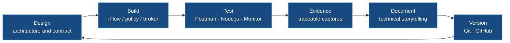
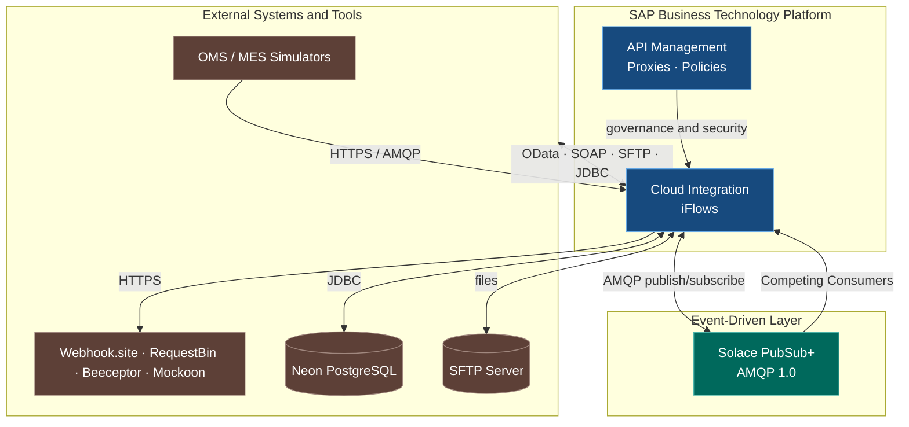

<div align="center">

# 🔗 SAP Integration Suite Learning

### Hands-on certification lab & enterprise integration engineering portfolio

**🌐 Language / Idioma:** [🇧🇷 Português](README.md) · 🇺🇸 **English**

<br/>


<br/>


<br/>


</div>

---

> 💡 A hands-on project for studying, building, and **preparing for the SAP Integration Suite certification**. It follows the official [Developing with SAP Integration Suite](https://learning.sap.com/learning-journeys/developing-with-sap-integration-suite) journey **and goes beyond it**, adding market-relevant scenarios with advanced security, messaging, and event-driven architecture.
>
> The goal goes beyond theory: to **build real end-to-end integration scenarios**, document every step with technical storytelling, generate traceable evidences, and build a consistent engineering portfolio.

---

### 🧭 Quick navigation

| 📚 [Documentation](docs/docsREADME.md) | 🎓 [Certification](certification/certification_README.md) | 📸 [Evidences](evidences/evidencesREADME.md) | 📦 [iFlows](iflows/iflows_README.md) | 📨 [Payloads](payloads/payloads_README.md) | 📮 [Postman](postman/postman_README.md) |
|:---:|:---:|:---:|:---:|:---:|:---:|

---

## 🎓 Certification preparation

<div align="center">


</div>

This lab is structured to cover the **SAP Certified Associate – Integration Developer** exam domains, mapping each area to concrete blocks and documents.

<table>
<tr><th>Exam domain (focus)</th><th>Where it is practiced</th><th>Coverage</th></tr>
<tr><td>Cloud Integration — iFlow modeling</td><td>Blocks A, B, C</td><td>✅ High</td></tr>
<tr><td>Mappings and message transformation</td><td>A3, B2, E6+E7</td><td>✅ High</td></tr>
<tr><td>Connectivity and adapters</td><td>Block D (OData, SOAP, SFTP, JDBC, ProcessDirect)</td><td>✅ High</td></tr>
<tr><td>Error handling and resilience</td><td>Block C</td><td>✅ High</td></tr>
<tr><td>API Management</td><td>Block E</td><td>✅ High</td></tr>
<tr><td>Security (Basic, API Key, OAuth, mTLS, CSRF, PGP, SAML)</td><td>Block F</td><td>✅ High</td></tr>
<tr><td>Event-driven architecture (Event Mesh)</td><td>Block H</td><td>🔄 In progress</td></tr>
<tr><td>Monitoring and operations</td><td>Cross-cutting</td><td>✅ High</td></tr>
</table>

---

## ⚙️ Engineering methodology



**Quality standards applied to every document:** executive vision and technical storytelling, general and detailed Mermaid architecture, complete self-contained code, contextualized evidences, root-cause troubleshooting, SAP best practices with official links, production recommendations, and clickable navigation between scenarios.

---

## 🛠️ Technology stack

<div align="center">


</div>

---

## 🏛️ Simulated landscape architecture



---

## 📊 Project metrics

<div align="center">

| 📦 Blocks | 📚 Documents | 🧪 Labs | 🔀 iFlows | 📸 Evidences | 🧰 Tools |
|:---:|:---:|:---:|:---:|:---:|:---:|
| **8** | **35+** | **33** | **40+** | **300+** | **15+** |

</div>

---

## 🗺️ Roadmap by blocks

<table>
<tr>
<th>Block</th>
<th>Focus</th>
<th>Scenarios</th>
<th>Status</th>
</tr>
<tr>
<td>Ⓐ</td>
<td>CPI Fundamentals</td>
<td>A1–A4</td>
<td>https://img.shields.io/badge/-completed-success?style=flat-square/></td>
</tr>
<tr>
<td>Ⓑ</td>
<td>Integration Patterns</td>
<td>B1–B5</td>
<td>https://img.shields.io/badge/-completed-success?style=flat-square</td>
</tr>
<tr>
<td>Ⓒ</td>
<td>Resilience and Errors</td>
<td>C1–C4</td>
<td>https://img.shields.io/badge/-completed-success?style=flat-square</td>
</tr>
<tr>
<td>Ⓓ</td>
<td>Connectivity / Adapters</td>
<td>D1–D4</td>
<td>https://img.shields.io/badge/-completed-success?style=flat-square</td>
</tr>
<tr>
<td>Ⓔ</td>
<td>API Management</td>
<td>E0–E12</td>
<td>https://img.shields.io/badge/-completed-success?style=flat-square</td>
</tr>
<tr>
<td>Ⓕ</td>
<td>Security</td>
<td>F4–F8</td>
<td>https://img.shields.io/badge/-completed-success?style=flat-square</td>
</tr>
<tr>
<td>Ⓖ</td>
<td>SAP MM / PP / QM</td>
<td>G1–G3</td>
<td>https://img.shields.io/badge/-planned-lightgrey?style=flat-square</td>
</tr>
<tr>
<td>Ⓗ</td>
<td>Event-Driven (Event Mesh)</td>
<td>H1–H4</td>
<td>https://img.shields.io/badge/-in%20progress-yellow?style=flat-square</td>
</tr>
</table>

---

## 🧱 Blocks and scenarios

### Ⓐ Block A — CPI Fundamentals 🥇
<table>
<tr><th>#</th><th>Scenario</th><th>Doc</th></tr>
<tr><td>A1</td><td>HTTP → Content Modifier → Webhook.site</td><td><a href="docs/03-a1-http-to-webhook.md">📄</a></td></tr>
<tr><td>A2</td><td>Timer → Request Reply → Public API</td><td><a href="docs/04-a2-timer-to-api.md">📄</a></td></tr>
<tr><td>A3</td><td>Message Mapping (JSON → XML)</td><td><a href="docs/05-a3-message-mapping.md">📄</a></td></tr>
<tr><td>A4</td><td>Groovy Script</td><td><a href="docs/06-a4-groovy-script.md">📄</a></td></tr>
</table>

### Ⓑ Block B — Integration Patterns 🥇
<table>
<tr><th>#</th><th>Scenario</th><th>Doc</th></tr>
<tr><td>B1</td><td>Content-Based Router</td><td><a href="docs/07-b1-content-based-router.md">📄</a></td></tr>
<tr><td>B2</td><td>Content Enricher</td><td><a href="docs/08-b2-content-enricher.md">📄</a></td></tr>
<tr><td>B3</td><td>Splitter</td><td><a href="docs/09-b3-splitter.md">📄</a></td></tr>
<tr><td>B4</td><td>Aggregator / Gather</td><td><a href="docs/10-b4-aggregator.md">📄</a></td></tr>
<tr><td>B5</td><td>Multicast</td><td><a href="docs/11-b5-multicast.md">📄</a></td></tr>
</table>

### Ⓒ Block C — Resilience and Errors 🥇
<table>
<tr><th>#</th><th>Scenario</th><th>Doc</th></tr>
<tr><td>C1</td><td>Exception Subprocess</td><td><a href="docs/12-c1-exception-subprocess.md">📄</a></td></tr>
<tr><td>C2</td><td>Retry and timeout</td><td><a href="docs/13-c2-retry-timeout.md">📄</a></td></tr>
<tr><td>C3</td><td>Dead Letter (JMS)</td><td><a href="docs/14-c3-dead-letter.md">📄</a></td></tr>
<tr><td>C4</td><td>Data Store & Idempotency</td><td><a href="docs/15-c4-data-store.md">📄</a></td></tr>
</table>

### Ⓓ Block D — Connectivity / Adapters 🥇
<table>
<tr><th>#</th><th>Scenario</th><th>Doc</th></tr>
<tr><td>D1</td><td>OData Adapter</td><td><a href="docs/16-d1-odata-adapter.md">📄</a></td></tr>
<tr><td>D2</td><td>SOAP Adapter</td><td><a href="docs/17-d2-soap-adapter.md">📄</a></td></tr>
<tr><td>D3</td><td>SFTP Adapter</td><td><a href="docs/18-d3-sftp-adapter.md">📄</a></td></tr>
<tr><td>D4</td><td>ProcessDirect + JDBC</td><td><a href="docs/19-d4-processdirect.md">📄</a></td></tr>
</table>

### Ⓔ Block E — API Management 🥇
<table>
<tr><th>#</th><th>Scenario</th><th>Doc</th></tr>
<tr><td>E0/E1/E12</td><td>API Proxy + Basic Authentication</td><td><a href="docs/20-e-api-management-proxy-basic-auth.md">📄</a></td></tr>
<tr><td>E2</td><td>Verify API Key</td><td><a href="docs/21-e2-verify-api-key.md">📄</a></td></tr>
<tr><td>E3</td><td>OAuth 2.0 and Scopes</td><td><a href="docs/22-e3-oauth-scopes.md">📄</a></td></tr>
<tr><td>E4+E5</td><td>Quota and Spike Arrest</td><td><a href="docs/23-e4-e5-quota-spike-arrest.md">📄</a></td></tr>
<tr><td>E6+E7</td><td>JSON → XML and Assign Message</td><td><a href="docs/24-e6-e7-mes-order-status-backend.md">📄</a></td></tr>
<tr><td>E10</td><td>API Analytics</td><td><a href="docs/25-e10-api-analytics.md">📄</a></td></tr>
</table>

### Ⓕ Block F — Security 🥇
<table>
<tr><th>#</th><th>Scenario</th><th>Doc</th></tr>
<tr><td>F4</td><td>Keystore, Client Certificate and mTLS</td><td><a href="docs/26-f4-b2b-client-certificate-mtls.md">📄</a></td></tr>
<tr><td>F5</td><td>Real CSRF</td><td><a href="docs/27-f5-csrf-token-validation.md">📄</a></td></tr>
<tr><td>F6</td><td>API Threat Protection</td><td><a href="docs/28-f6-api-threat-protection.md">📄</a></td></tr>
<tr><td>F7</td><td>PGP Message-Level Security</td><td><a href="docs/29-f7-pgp-message-level-security.md">📄</a></td></tr>
<tr><td>F8A–F8B</td><td>Authentication Context and Technical User SAML Bearer</td><td><a href="docs/30-f8-authentication-context-technical-user-saml-bearer.md">📄</a></td></tr>
<tr><td>F8E</td><td>End-User SAML Bearer Group-Based Authorization</td><td><a href="docs/31-f8e-end-user-saml-bearer-group-based-authorization.md">📄</a></td></tr>
</table>

### Ⓗ Block H — Event-Driven Integration (Event Mesh) 🥈
<table>
<tr><th>#</th><th>Scenario</th><th>Doc</th></tr>
<tr><td>H1</td><td>Solace PubSub+ Event Mesh Foundation</td><td><a href="docs/32-h1-solace-pubsub-event-mesh-foundation.md">📄</a></td></tr>
<tr><td>H2</td><td>CPI Publisher to Solace via AMQP 1.0</td><td><a href="docs/33-h2-sap-cloud-integration-publisher-solace-amqp.md">📄</a></td></tr>
<tr><td>H3</td><td>CPI Subscriber from Solace via AMQP (SAP PP/MES)</td><td><a href="docs/34-h3-sap-cloud-integration-subscriber-solace-amqp.md">📄</a></td></tr>
<tr><td>H4</td><td>Competing Consumers and Horizontal Scaling (SAP WM)</td><td><a href="docs/35-h4-solace-competing-consumers-scaling.md">📄</a></td></tr>
</table>

---

## 📁 Repository structure

```
SAP_Integration_Suite_Learning/
├── docs/            # 📚 Technical documentation (35+ documents)
├── iflows/          # 📦 Exported Integration Flows (.zip)
├── payloads/        # 📨 Input/output messages (JSON/XML)
├── postman/         # 📮 Test collections per block
├── evidences/       # 📸 Execution evidences (labXX)
├── certification/   # 🎓 Certification preparation dashboard
├── README.md        # 🇧🇷 Portuguese version
└── README.en.md     # 🇺🇸 This file
```

---

## 📚 Official SAP references

- 🥇 Main journey: [Developing with SAP Integration Suite](https://learning.sap.com/learning-journeys/developing-with-sap-integration-suite)
- 🥈 Event-Driven: [Discovering Event-Driven Integration with SAP Integration Suite, advanced event mesh](https://learning.sap.com/courses/discovering-event-driven-integration-with-sap-integration-suite-advanved-event-mesh)
- 🥈 AEM Tutorials: [Get Started with SAP Integration Suite, advanced event mesh](https://developers.sap.com/mission.advanced-event-mesh-get-started.html)
- 📖 Overview: [SAP Integration Suite — SAP Learning](https://learning.sap.com/products/business-technology-platform/integration-suite)

---

## 👤 Author / 📇 Contact

<div align="center">

[](https://www.linkedin.com/in/orlando-caetano/)
[](https://github.com/OrlandoCaetano2026)

**Orlando Caetano**  
SAP Specialist • Integration • Artificial Intelligence  
SAP MM Consultant with know-how in PP, QM and WM


</div>

> 📌 Study and portfolio project. The SAP MM, PP, QM, WM, MES and Event-Driven scenarios are educational simulations for architecture and integration practice.
