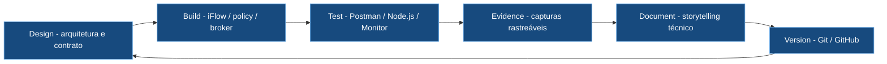
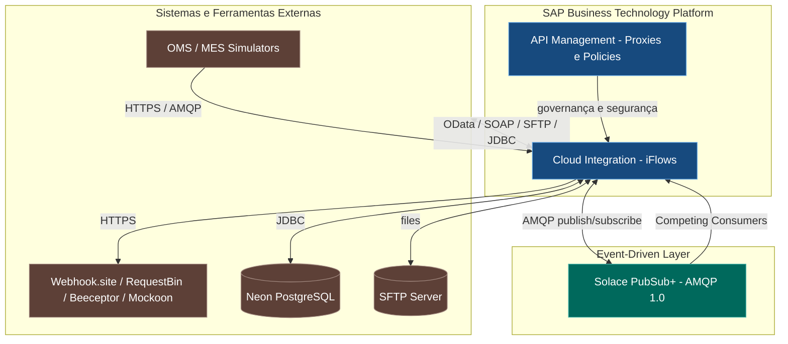

<div align="center">

# 🔗 SAP Integration Suite Learning

### Laboratório prático de engenharia de integração, portfólio técnico e referência de estudo

*Hands-on certification lab & enterprise integration engineering portfolio*

**🌐 Idioma / Language:** 🇧🇷 **Português** · [🇺🇸 English](README.en.md)

<br/>


<br/>


<br/>


</div>

---

> 💡 Projeto prático de estudo, desenvolvimento e portfólio técnico, utilizado como base de preparação para a certificação **SAP Certified - Integration Developer**, conquistada em **26/08/2026**. Acompanha a trilha oficial [Developing with SAP Integration Suite](https://learning.sap.com/learning-journeys/developing-with-sap-integration-suite) **e vai além dela**, adicionando cenários de mercado com segurança avançada, mensageria e arquitetura orientada a eventos.
>
> O objetivo é ir além da teoria: **construir cenários reais de integração de ponta a ponta**, documentar cada etapa com storytelling técnico, gerar evidências rastreáveis e formar um portfólio de engenharia consistente.

---

### 🧭 Navegação rápida

| 📚 [Documentação](docs/docsREADME.md) | 🎓 [Certificação](certification/certification_README.md) | 📸 [Evidências](evidences/evidencesREADME.md) | 📦 [iFlows](iflows/iflows_README.md) | 📨 [Payloads](payloads/payloads_README.md) | 📮 [Postman](postman/postman_README.md) |
|:---:|:---:|:---:|:---:|:---:|:---:|

---

## 📑 Índice

- [Sobre o projeto](#-sobre-o-projeto)
- [Certificação conquistada](#-certificação-conquistada)
- [Metodologia de engenharia](#-metodologia-de-engenharia)
- [Stack tecnológica](#-stack-tecnológica)
- [Arquitetura do landscape simulado](#-arquitetura-do-landscape-simulado)
- [Abordagem em duas camadas](#-abordagem-em-duas-camadas)
- [Métricas do projeto](#-métricas-do-projeto)
- [Roadmap por blocos](#-roadmap-por-blocos)
- [Blocos e cenários de prática](#-blocos-e-cenários-de-prática)
- [Estrutura do repositório](#-estrutura-do-repositório)
- [Fluxo de trabalho](#-fluxo-de-trabalho)
- [Referências oficiais SAP](#-referências-oficiais-sap)
- [Autor](#-autor--contato)

---

## 🧩 Sobre o projeto

O **SAP Integration Suite** é a plataforma de integração como serviço (**iPaaS**) da SAP, executada no **SAP Business Technology Platform (BTP)**. Ela conecta aplicações, processos, dados e eventos em ambientes **cloud, on-premise e híbridos**, permitindo que sistemas SAP e não-SAP se comuniquem de forma padronizada, segura e escalável.

Este repositório reúne a jornada completa de aprendizagem prática nessa plataforma, tratada como um **laboratório de engenharia**: cada cenário é projetado, construído, testado, evidenciado, documentado e versionado. O resultado é simultaneamente um **material de referência para estudo**, um **portfólio técnico demonstrável** e a base prática que apoiou a certificação conquistada em 26/08/2026.

---

## 🎓 Certificação conquistada

<div align="center">


</div>

Este laboratório foi estruturado para cobrir os domínios da certificação **SAP Certified - Integration Developer**. A certificação foi conquistada em **26/08/2026**, por meio do **C_CPI_2601 System-Based Assessment**. [Validar credencial no Credly](https://www.credly.com/badges/98eab00c-f5c1-4fe9-b256-d824289f6ed4).

<table>
<tr><th>Domínio do exame (foco)</th><th>Onde é praticado</th><th>Cobertura</th></tr>
<tr><td>Cloud Integration — modelagem de iFlows</td><td>Blocos A, B, C</td><td>✅ Alta</td></tr>
<tr><td>Mapeamentos e transformação de mensagens</td><td>A3, B2, E6+E7</td><td>✅ Alta</td></tr>
<tr><td>Conectividade e adapters</td><td>Bloco D (OData, SOAP, SFTP, JDBC, ProcessDirect)</td><td>✅ Alta</td></tr>
<tr><td>Tratamento de erros e resiliência</td><td>Bloco C (Exception, Retry, Dead Letter, Idempotência)</td><td>✅ Alta</td></tr>
<tr><td>API Management (proxies, policies, produtos)</td><td>Bloco E</td><td>✅ Alta</td></tr>
<tr><td>Segurança (Basic, API Key, OAuth, mTLS, CSRF, PGP, SAML)</td><td>Bloco F</td><td>✅ Alta</td></tr>
<tr><td>Arquitetura orientada a eventos (Event Mesh)</td><td>Bloco H</td><td>✅ H1-H7 concluídos</td></tr>
<tr><td>Monitoramento e operações</td><td>Transversal (todos os blocos)</td><td>✅ Alta</td></tr>
</table>

📊 Acompanhamento detalhado em **[certification/](certification/certification_README.md)**.

---

## ⚙️ Metodologia de engenharia

Cada cenário segue um ciclo disciplinado de engenharia, não apenas execução de tutoriais:



**Padrões de qualidade aplicados em cada documento:**

- 🎯 Visão executiva e **storytelling técnico** do cenário
- 🏛️ Arquitetura **geral e detalhada em Mermaid**
- 🔧 Códigos completos e autocontidos (Groovy, JSON, scripts)
- 📸 **Evidências contextualizadas** com explicação do que comprovam
- 🐞 Troubleshooting com **sintoma → causa raiz → solução**
- ✅ Boas práticas SAP com **links oficiais**
- 🚀 Recomendações para produção e navegação clicável entre cenários

---

## 🛠️ Stack tecnológica

<div align="center">

**SAP Core**


**Protocolos & Adapters**


**Event-Driven**


**Segurança**


**Ferramentas & DevX**


</div>

---

## 🏛️ Arquitetura do landscape simulado



---

## 🧭 Abordagem em duas camadas

O projeto combina o núcleo exigido na certificação com cenários de mercado que ampliam o alcance profissional.

<table>
<tr><th>🥇 Camada 1 — Trilha oficial SAP</th><th>🥈 Camada 2 — Cenários de mercado</th></tr>
<tr>
<td valign="top">
Núcleo da certificação:
<ul>
<li>Cloud Integration e Integration Flows</li>
<li>API Management</li>
<li>Mapeamentos e transformação</li>
<li>Monitoramento e operações</li>
</ul>
</td>
<td valign="top">
Diferencial de mercado:
<ul>
<li>Event-Driven Integration (Event Mesh)</li>
<li>B2B / EDI e mTLS</li>
<li>OData / API-First (S/4HANA)</li>
<li>Integração híbrida e conectividade a banco (JDBC)</li>
</ul>
</td>
</tr>
</table>

⚠️ Os cenários da Camada 2 são estudados a partir de conteúdos oficiais SAP **específicos de cada tema**, como a jornada [Discovering Event-Driven Integration with SAP Integration Suite, advanced event mesh](https://learning.sap.com/courses/discovering-event-driven-integration-with-sap-integration-suite-advanved-event-mesh).

---

## 📊 Métricas do projeto

<div align="center">

| 📦 Blocos | 📚 Documentos | 🧪 Laboratórios | 🔀 iFlows | 📸 Evidências | 🧰 Ferramentas |
|:---:|:---:|:---:|:---:|:---:|:---:|
| **8** | **38+** | **36** | **40+** | **300+** | **15+** |

</div>

---

## 🗺️ Roadmap por blocos

<table>
<tr><th>Bloco</th><th>Foco</th><th>Cenários</th><th>Status</th><th>Índice</th></tr>
<tr><td>Ⓐ</td><td>CPI Fundamentos</td><td>A1–A4</td><td></td><td><a href="docs/docsREADME.md">docs</a></td></tr>
<tr><td>Ⓑ</td><td>Padrões de Integração</td><td>B1–B5</td><td></td><td><a href="docs/docsREADME.md">docs</a></td></tr>
<tr><td>Ⓒ</td><td>Resiliência e Erros</td><td>C1–C4</td><td></td><td><a href="docs/docsREADME.md">docs</a></td></tr>
<tr><td>Ⓓ</td><td>Conectividade / Adapters</td><td>D1–D4</td><td></td><td><a href="docs/docsREADME.md">docs</a></td></tr>
<tr><td>Ⓔ</td><td>API Management</td><td>E0–E12</td><td></td><td><a href="docs/docsREADME.md">docs</a></td></tr>
<tr><td>Ⓕ</td><td>Segurança</td><td>F4–F8</td><td></td><td><a href="docs/docsREADME.md">docs</a></td></tr>
<tr><td>Ⓖ</td><td>SAP MM / PP / QM</td><td>G1–G3</td><td></td><td>—</td></tr>
<tr><td>Ⓗ</td><td>Event-Driven (Event Mesh)</td><td>H1-H7</td><td></td><td><a href="docs/docsREADME.md">docs</a></td></tr>
</table>

---

## 🧱 Blocos e cenários de prática

🥇 Camada 1 (trilha oficial) · 🥈 Camada 2 (complementar)

### Ⓐ Bloco A — CPI Fundamentos 🥇

<table>
<tr><th>#</th><th>Cenário</th><th>Objetivo</th><th>Doc</th></tr>
<tr><td>A1</td><td>HTTP → Content Modifier → Webhook.site</td><td>Primeiro iFlow: receber, ajustar e encaminhar</td><td><a href="docs/03-a1-http-to-webhook.md">📄</a></td></tr>
<tr><td>A2</td><td>Timer → Request Reply → API pública</td><td>Consumir API externa de forma agendada</td><td><a href="docs/04-a2-timer-to-api.md">📄</a></td></tr>
<tr><td>A3</td><td>Message Mapping (JSON → XML)</td><td>Transformação de mensagens</td><td><a href="docs/05-a3-message-mapping.md">📄</a></td></tr>
<tr><td>A4</td><td>Groovy Script</td><td>Lógica customizada no fluxo</td><td><a href="docs/06-a4-groovy-script.md">📄</a></td></tr>
</table>

### Ⓑ Bloco B — Padrões de Integração 🥇

<table>
<tr><th>#</th><th>Cenário</th><th>Objetivo</th><th>Doc</th></tr>
<tr><td>B1</td><td>Content-Based Router</td><td>Rotear mensagens por condição</td><td><a href="docs/07-b1-content-based-router.md">📄</a></td></tr>
<tr><td>B2</td><td>Content Enricher</td><td>Enriquecer dados via lookup OData</td><td><a href="docs/08-b2-content-enricher.md">📄</a></td></tr>
<tr><td>B3</td><td>Splitter</td><td>Quebrar lote em mensagens individuais</td><td><a href="docs/09-b3-splitter.md">📄</a></td></tr>
<tr><td>B4</td><td>Aggregator / Gather</td><td>Consolidar respostas</td><td><a href="docs/10-b4-aggregator.md">📄</a></td></tr>
<tr><td>B5</td><td>Multicast</td><td>Enviar para múltiplos destinos</td><td><a href="docs/11-b5-multicast.md">📄</a></td></tr>
</table>

### Ⓒ Bloco C — Resiliência e Erros 🥇

<table>
<tr><th>#</th><th>Cenário</th><th>Objetivo</th><th>Doc</th></tr>
<tr><td>C1</td><td>Exception Subprocess</td><td>Tratamento padronizado de erros</td><td><a href="docs/12-c1-exception-subprocess.md">📄</a></td></tr>
<tr><td>C2</td><td>Retry e timeout</td><td>Resiliência em falhas temporárias</td><td><a href="docs/13-c2-retry-timeout.md">📄</a></td></tr>
<tr><td>C3</td><td>Dead Letter (JMS)</td><td>Recuperação de mensagens com falha</td><td><a href="docs/14-c3-dead-letter.md">📄</a></td></tr>
<tr><td>C4</td><td>Data Store & Idempotência</td><td>Persistência temporária e deduplicação</td><td><a href="docs/15-c4-data-store.md">📄</a></td></tr>
</table>

### Ⓓ Bloco D — Conectividade / Adapters 🥇

<table>
<tr><th>#</th><th>Cenário</th><th>Objetivo</th><th>Doc</th></tr>
<tr><td>D1</td><td>OData Adapter</td><td>Integração no padrão S/4HANA</td><td><a href="docs/16-d1-odata-adapter.md">📄</a></td></tr>
<tr><td>D2</td><td>SOAP Adapter</td><td>Serviços SOAP externos (Split/Gather)</td><td><a href="docs/17-d2-soap-adapter.md">📄</a></td></tr>
<tr><td>D3</td><td>SFTP Adapter</td><td>Integração de arquivos (hot folder)</td><td><a href="docs/18-d3-sftp-adapter.md">📄</a></td></tr>
<tr><td>D4</td><td>ProcessDirect + JDBC</td><td>Reuso interno + conectividade a banco</td><td><a href="docs/19-d4-processdirect.md">📄</a></td></tr>
</table>

### Ⓔ Bloco E — API Management 🥇

<table>
<tr><th>#</th><th>Cenário</th><th>Objetivo</th><th>Doc</th></tr>
<tr><td>E0/E1/E12</td><td>API Proxy + Basic Authentication</td><td>Expor backend com autenticação via KVM</td><td><a href="docs/20-e-api-management-proxy-basic-auth.md">📄</a></td></tr>
<tr><td>E2</td><td>Verify API Key</td><td>Controle por Consumer Key</td><td><a href="docs/21-e2-verify-api-key.md">📄</a></td></tr>
<tr><td>E3</td><td>OAuth 2.0 e Scopes</td><td>Client Credentials e autorização por escopo</td><td><a href="docs/22-e3-oauth-scopes.md">📄</a></td></tr>
<tr><td>E4+E5</td><td>Quota e Spike Arrest</td><td>Controle de consumo e proteção</td><td><a href="docs/23-e4-e5-quota-spike-arrest.md">📄</a></td></tr>
<tr><td>E6+E7</td><td>JSON → XML e Assign Message</td><td>Resposta XML e visibilidade por scope</td><td><a href="docs/24-e6-e7-mes-order-status-backend.md">📄</a></td></tr>
<tr><td>E10</td><td>API Analytics</td><td>Overview, Health, Usage e Custom View</td><td><a href="docs/25-e10-api-analytics.md">📄</a></td></tr>
</table>

### Ⓕ Bloco F — Segurança 🥇

<table>
<tr><th>#</th><th>Cenário</th><th>Objetivo</th><th>Doc</th></tr>
<tr><td>F4</td><td>Keystore, Client Certificate e mTLS</td><td>Autenticação B2B inbound com X.509</td><td><a href="docs/26-f4-b2b-client-certificate-mtls.md">📄</a></td></tr>
<tr><td>F5</td><td>CSRF real</td><td>Token e cookies de sessão (SAP MM)</td><td><a href="docs/27-f5-csrf-token-validation.md">📄</a></td></tr>
<tr><td>F6</td><td>API Threat Protection</td><td>JSON, XML e Regex Protection</td><td><a href="docs/28-f6-api-threat-protection.md">📄</a></td></tr>
<tr><td>F7</td><td>PGP Message-Level Security</td><td>Criptografia, assinatura e testes negativos</td><td><a href="docs/29-f7-pgp-message-level-security.md">📄</a></td></tr>
<tr><td>F8A–F8B</td><td>Authentication Context e Technical User SAML Bearer</td><td>Anti-spoofing, RFC 7522, introspecção e autorização</td><td><a href="docs/30-f8-authentication-context-technical-user-saml-bearer.md">📄</a></td></tr>
<tr><td>F8E</td><td>End-User SAML Bearer Group-Based Authorization</td><td>Autorização por grupos (Buyer/Manager) no WSO2</td><td><a href="docs/31-f8e-end-user-saml-bearer-group-based-authorization.md">📄</a></td></tr>
</table>

### Ⓗ Bloco H — Event-Driven Integration (Event Mesh) 🥈

<table>
<tr><th>#</th><th>Cenário</th><th>Objetivo</th><th>Doc</th></tr>
<tr><td>H1</td><td>Solace PubSub+ Event Mesh Foundation</td><td>Broker, topic, durable queue, Direct e Guaranteed Messaging</td><td><a href="docs/32-h1-solace-pubsub-event-mesh-foundation.md">📄</a></td></tr>
<tr><td>H2</td><td>CPI Publisher para Solace via AMQP 1.0</td><td>Publicar eventos com TLS/SASL e correlação ponta a ponta</td><td><a href="docs/33-h2-sap-cloud-integration-publisher-solace-amqp.md">📄</a></td></tr>
<tr><td>H3</td><td>CPI Subscriber do Solace via AMQP (SAP PP/MES)</td><td>Consumir backlog e entregar a backend externo</td><td><a href="docs/34-h3-sap-cloud-integration-subscriber-solace-amqp.md">📄</a></td></tr>
<tr><td>H4</td><td>Competing Consumers e Escala Horizontal (SAP WM)</td><td>Non-Exclusive Queue, múltiplos workers, falha e recuperação</td><td><a href="docs/35-h4-solace-competing-consumers-scaling.md">📄</a></td></tr>
<tr><td>H5</td><td>Topic Hierarchy, Wildcards e Fan-out (SAP QM)</td><td>Roteamento seletivo e distribuição por subscriptions</td><td><a href="docs/36-h5-solace-topic-hierarchy-wildcards-fanout.md">📄</a></td></tr>
<tr><td>H6</td><td>Retry, DMQ, Recuperação e Message Replay (SAP MM)</td><td>Resiliência operacional e reprodução histórica</td><td><a href="docs/37-h6-solace-dead-letter-retry-replay.md">📄</a></td></tr>
<tr><td>H7</td><td>MQTT Industrial Telemetry (.NET / SAP PM)</td><td>Interoperabilidade MQTT-AMQP, ordem de manutenção e alerta por e-mail</td><td><a href="docs/38-h7-solace-mqtt-industrial-telemetry.md">📄</a></td></tr>
</table>

---

## 📁 Estrutura do repositório

```
SAP_Integration_Suite_Learning/
├── docs/            # 📚 Documentação técnica de cada cenário (38+ documentos)
├── iflows/          # 📦 Integration Flows exportados (.zip)
├── payloads/        # 📨 Mensagens de entrada/saída (JSON/XML)
├── postman/         # 📮 Collections de teste por bloco
├── evidences/       # 📸 Evidências de execução (labXX)
├── certification/   # 🎓 Certificação conquistada e jornada de aprendizagem
├── README.md        # 🇧🇷 Este arquivo
└── README.en.md     # 🇺🇸 English version
```

<table>
<tr><th>Pasta</th><th>Descrição</th><th>Índice</th></tr>
<tr><td><code>docs/</code></td><td>Documentação técnica (objetivo, arquitetura, passo a passo, troubleshooting)</td><td><a href="docs/docsREADME.md">abrir</a></td></tr>
<tr><td><code>iflows/</code></td><td>Integration Flows exportados do Integration Suite</td><td><a href="iflows/iflows_README.md">abrir</a></td></tr>
<tr><td><code>payloads/</code></td><td>Mensagens de entrada e saída usadas nos testes</td><td><a href="payloads/payloads_README.md">abrir</a></td></tr>
<tr><td><code>postman/</code></td><td>Collections de teste por bloco</td><td><a href="postman/postman_README.md">abrir</a></td></tr>
<tr><td><code>evidences/</code></td><td>Prints de monitoramento, logs e payloads processados</td><td><a href="evidences/evidencesREADME.md">abrir</a></td></tr>
<tr><td><code>certification/</code></td><td>Certificação conquistada, badge verificável e jornada de aprendizagem</td><td><a href="certification/certification_README.md">abrir</a></td></tr>
</table>

---

## 🔁 Fluxo de trabalho


---

## 📚 Referências oficiais SAP

- 🥇 Trilha principal: [Developing with SAP Integration Suite](https://learning.sap.com/learning-journeys/developing-with-sap-integration-suite)
- 🥈 Event-Driven: [Discovering Event-Driven Integration with SAP Integration Suite, advanced event mesh](https://learning.sap.com/courses/discovering-event-driven-integration-with-sap-integration-suite-advanved-event-mesh)
- 🥈 Tutoriais AEM: [Get Started with SAP Integration Suite, advanced event mesh](https://developers.sap.com/mission.advanced-event-mesh-get-started.html)
- 📖 Visão geral: [SAP Integration Suite — SAP Learning](https://learning.sap.com/products/business-technology-platform/integration-suite)

---

## 👤 Autor / 📇 Contato

<div align="center">

[](https://www.linkedin.com/in/orlando-caetano/)
[](https://github.com/OrlandoCaetano2026)

**Orlando Caetano**  
Especialista SAP • Integração • Inteligência Artificial  
Consultor SAP MM com know-how em PP, QM e WM


</div>

> 📌 Projeto de estudo e portfólio. Os cenários SAP MM, PP, QM, WM, MES e Event-Driven são simulações educativas para prática de arquitetura e integração.
