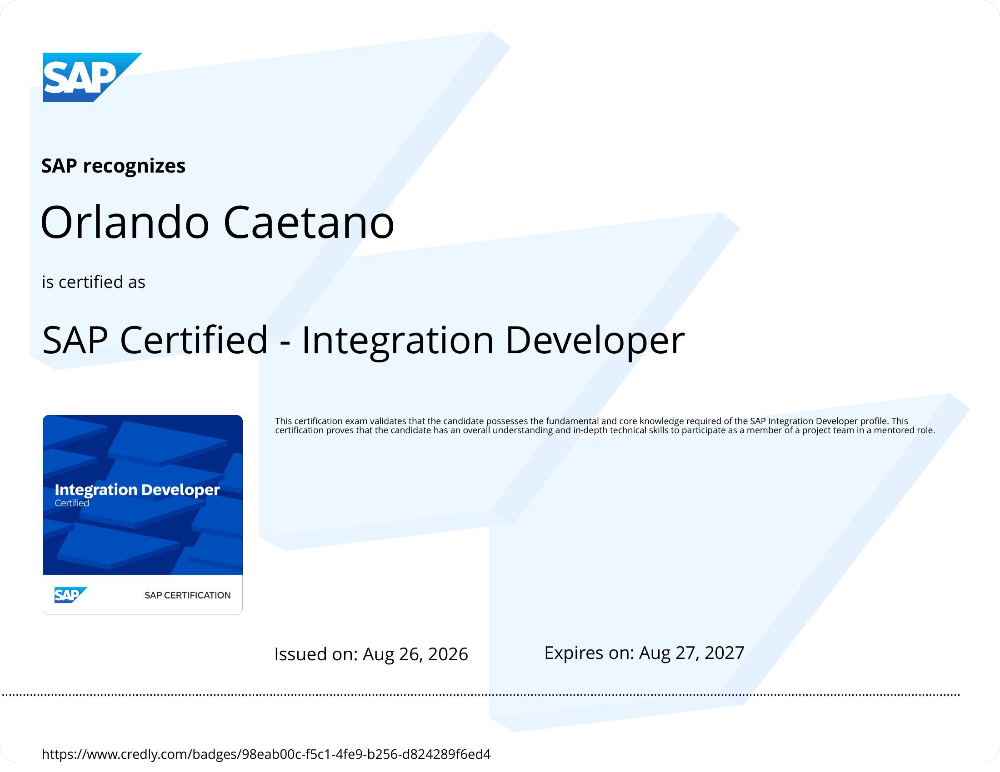
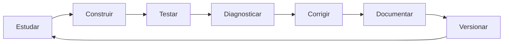

# 🎓 SAP Certified - Integration Developer

### Certificação conquistada por meio do C_CPI_2601 System-Based Assessment

---

> 🏆 **Orlando Caetano conquistou a certificação SAP Certified - Integration Developer em 26 de agosto de 2026.** O projeto `SAP_Integration_Suite_Learning` foi a base prática da preparação e continua evoluindo como laboratório, portfólio técnico e referência de estudo.

**🧭 Navegação:** [🏠 Principal](../README.md) · [📚 Documentação](../docs/docsREADME.md) · [📸 Evidências](../evidences/evidencesREADME.md) · [📦 iFlows](../iflows/iflows_README.md)

---

## ✅ Credencial oficial

| Item | Informação |
|---|---|
| Certificação | **SAP Certified - Integration Developer** |
| Assessment | **C_CPI_2601 - System-Based Assessment** |
| Data de emissão | **26/08/2026** |
| Validade informada no certificado | **27/08/2027** |
| Verificação | [Credencial verificável no Credly](https://www.credly.com/badges/98eab00c-f5c1-4fe9-b256-d824289f6ed4) |
| Certificado | [Abrir certificado em PDF](./sap-certified-integration-developer-certificate.pdf) |
| Badge | [Abrir badge oficial](./sap-certified-integration-developer.png) |

> 🔐 Esta pasta publica apenas a credencial, o certificado e o relato autoral da jornada. Instruções proprietárias, arquivos do assessment, credenciais, URLs internas e evidências do ambiente de prova não são versionados.

---

## 🖼️ Certificado e badge oficial

<table>
  <tr>
    <th align="center" width="60%">Certificado oficial</th>
    <th align="center" width="40%">Badge oficial</th>
  </tr>
  <tr>
    <td align="center" valign="top">
      
       
       
      <a href="./sap-certified-integration-developer-certificate.pdf">
        <strong>📄 Abrir certificado completo em PDF</strong>
      </a>
    </td>
    <td align="center" valign="top">
      
       
       
      <a href="https://www.credly.com/badges/98eab00c-f5c1-4fe9-b256-d824289f6ed4">
        <strong>🏆 Validar credencial oficial no Credly</strong>
      </a>
    </td>
  </tr>
</table>

  <strong>SAP Certified - Integration Developer</strong> 
  Conquistada em 26/08/2026 por meio do C_CPI_2601 System-Based Assessment

---

## 🧭 Da preparação à certificação

A abordagem transformou cada conceito em um cenário funcional, com arquitetura, configuração, código completo, evidências, troubleshooting e recomendações para produção.

---

## 📊 Progresso por bloco

| Bloco | Período | Status | Escopo |
|---|---|---|---|
| Ⓐ CPI Fundamentos | 01-03/08/2026 | ✅ Concluído | A1-A4 |
| Ⓑ Padrões de Integração | 03-04/08/2026 | ✅ Concluído | B1-B5 |
| Ⓒ Resiliência e Erros | 04-06/08/2026 | ✅ Concluído | C1-C4 |
| Ⓓ Conectividade / Adapters | 06-10/08/2026 | ✅ Concluído | D1-D4 |
| Ⓔ API Management | 11-16/08/2026 | ✅ Concluído | E0-E12 |
| Ⓕ Segurança | 16-24/08/2026 | ✅ Concluído | F4-F8 |
| Ⓖ SAP MM / PP / QM | Pós-certificação | ⏳ Planejado | G1-G3 |
| Ⓗ Event-Driven / Event Mesh | 24-26/08/2026 | ✅ H1-H7 concluídos | H1-H7 |

---

## 🗺️ Cobertura técnica consolidada

| Pilar | Onde foi praticado | Resultado |
|---|---|---|
| Modelagem de Integration Flows | Blocos A, B e C | ✅ Consolidado |
| Message Mapping e transformação | A3, B2, E6+E7 e assessment prático | ✅ Consolidado |
| Conectividade e adapters | Bloco D | ✅ Consolidado |
| API Management | Bloco E | ✅ Consolidado |
| Segurança | Bloco F | ✅ Consolidado |
| Event-Driven Integration | H1-H7 | ✅ Consolidado e em evolução |
| Monitoramento e troubleshooting | Transversal | ✅ Documentado |

---

## 🌟 Cenários de destaque

- **API Management:** proxies, API Key, OAuth 2.0, Quota, Spike Arrest, Products e Analytics.
- **Segurança:** mTLS, CSRF, Threat Protection, PGP e SAML Bearer.
- **Resiliência:** retry, JMS, idempotência, DMQ, recuperação e Message Replay.
- **Event Mesh:** AMQP 1.0, competing consumers, wildcards, fan-out e guaranteed messaging.
- **IoT / SAP PM:** publisher MQTT em .NET, consumo AMQP, ordem de manutenção e alerta por e-mail.

---

## 🚀 Próximos passos

A certificação conclui um marco, não o projeto. A evolução pós-certificação inclui novos cenários Event Mesh, SAP Cloud Identity Services, Principal Propagation real, integração híbrida e expansão dos domínios SAP MM, PP, QM, WM e PM.

---

## 👤 Autor / Contato

📌 [Voltar ao README principal](../README.md)
