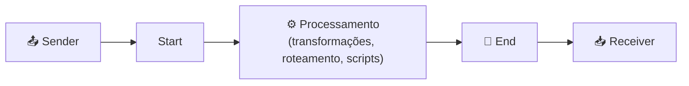

# 🔄 Cloud Integration (CPI) — Conceitos Básicos

> Documento base do projeto: apresenta os conceitos fundamentais do Cloud Integration (CPI), a capability central do SAP Integration Suite usada na maioria dos laboratórios.

---

## 🎯 Objetivo

Consolidar os conceitos essenciais do **Cloud Integration (CPI)** que servem de fundação para todos os cenários práticos do projeto — desde o primeiro iFlow até os padrões avançados.

---

## 🧩 O que é Cloud Integration (CPI)

O **Cloud Integration**, historicamente conhecido como **CPI (Cloud Platform Integration)**, é a capability central do SAP Integration Suite. Ele é responsável por **conectar sistemas** e **processar mensagens** entre aplicações SAP e não-SAP, na nuvem ou on-premise.

Toda integração é construída na forma de um **Integration Flow (iFlow)** — um fluxo visual que define como a mensagem é recebida, transformada, roteada e entregue.

---

## 🏗️ Anatomia de um Integration Flow (iFlow)



| Elemento | Função |
|---|---|
| **Sender** | Sistema/origem que envia a mensagem ao iFlow |
| **Start / Timer** | Ponto de início do fluxo (por mensagem ou por tempo) |
| **Steps de processamento** | Onde a mensagem é transformada, enriquecida, roteada |
| **End** | Encerra o processamento |
| **Receiver** | Sistema de destino que recebe a mensagem |

---

## 🔌 Adapters (conectividade)

Os **Adapters** definem *como* o iFlow se comunica com os sistemas externos. Os mais usados:

| Adapter | Uso típico |
|---|---|
| **HTTPS** | Receber chamadas HTTP de sistemas externos (Sender) |
| **HTTP** | Chamar APIs/serviços REST externos (Receiver) |
| **OData** | Integração no padrão SAP S/4HANA |
| **SOAP** | Integração com web services SOAP |
| **SFTP** | Transferência de arquivos |
| **ProcessDirect** | Comunicação entre iFlows internos |

---

## 🧰 Principais componentes de processamento

| Componente | Função |
|---|---|
| **Content Modifier** | Alterar headers, properties e o corpo (body) da mensagem |
| **Message Mapping** | Transformar a estrutura (ex.: JSON ↔ XML) |
| **Groovy Script** | Lógica customizada em código |
| **Router** | Rotear a mensagem conforme condições |
| **Splitter** | Dividir uma mensagem em várias |
| **Aggregator** | Consolidar várias mensagens em uma |
| **Request Reply** | Chamar um sistema externo e aguardar a resposta |
| **Content Enricher** | Enriquecer a mensagem com dados de outra fonte |
| **Exception Subprocess** | Tratamento estruturado de erros |

---

## 📨 Ciclo de vida de uma mensagem

```text
1. Sender envia a mensagem (ou o Timer dispara o fluxo)
2. O iFlow recebe e inicia o processamento
3. A mensagem passa pelos steps (transformação, roteamento, etc.)
4. O Receiver recebe a mensagem final
5. O resultado é registrado no Monitoramento (Monitor Message Processing)
```

---

## 📊 Monitoramento

O **Monitor Message Processing** permite acompanhar cada execução:

- **Status:** Completed ✅, Failed ❌, Processing, Retry
- **Log Content:** informações do processamento
- **Message Content:** payload da mensagem (quando o **Log Level: Trace** está ativo)
- **Run Steps:** sequência detalhada de cada etapa executada

> 💡 Por padrão, o CPI **não grava** o corpo da mensagem no log. Para inspecionar o payload durante os testes, ative **Log Level: Trace** na *Runtime Configuration* do iFlow.

---

## 🔐 Segurança de entrada (inbound)

As formas mais comuns de autenticar um sender que chama um iFlow:

- **Basic Authentication** (clientid/secret via Service Key) — mais simples, usada nos primeiros labs
- **OAuth Client Credentials** — mais robusta, recomendada para produção
- **Client Certificate** — autenticação por certificado

Além disso, para requisições **POST**, é importante conhecer o **CSRF Protection**: quando ativo, exige um token CSRF; para testes iniciais é comum desativá-lo no adapter Sender.

---

## ✅ Conceitos consolidados

Ao dominar os itens acima, o desenvolvedor está pronto para construir os cenários práticos do projeto:

- Estrutura de um iFlow (Sender → Start → Steps → End → Receiver)
- Escolha e configuração de Adapters
- Uso dos componentes de processamento
- Deploy e monitoramento
- Autenticação e segurança de entrada

---

## 📚 Referências

- [Developing with SAP Integration Suite](https://learning.sap.com/learning-journeys/developing-with-sap-integration-suite)
- [SAP Integration Suite — SAP Learning](https://learning.sap.com/products/business-technology-platform/integration-suite)

**Documento anterior:** [01 — Ambiente SAP BTP](./01-ambiente-btp.md)
**Primeiro laboratório:** [A1 — HTTP → Content Modifier → Webhook.site](./03-a1-http-to-webhook.md)
