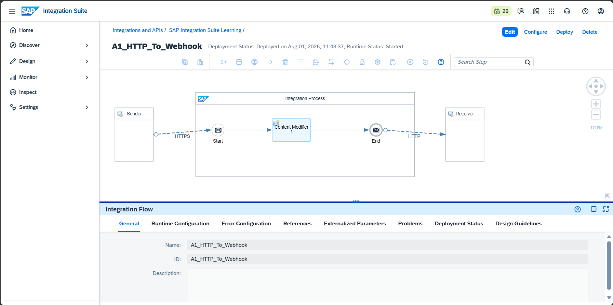
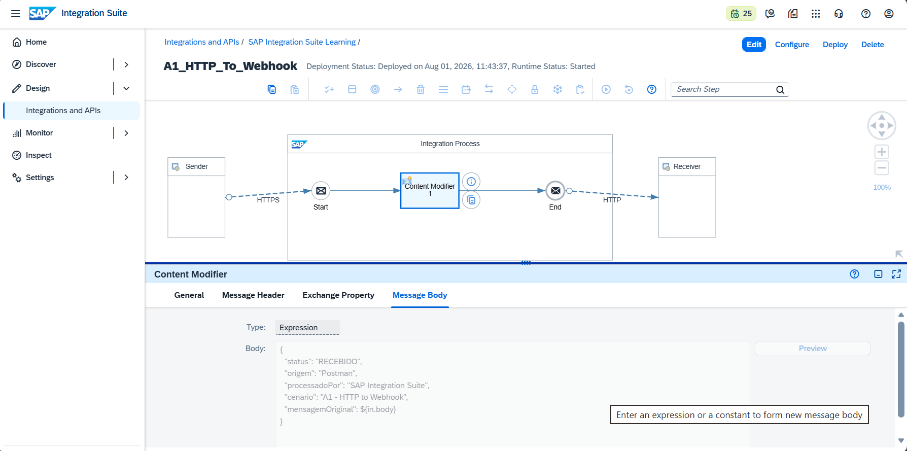
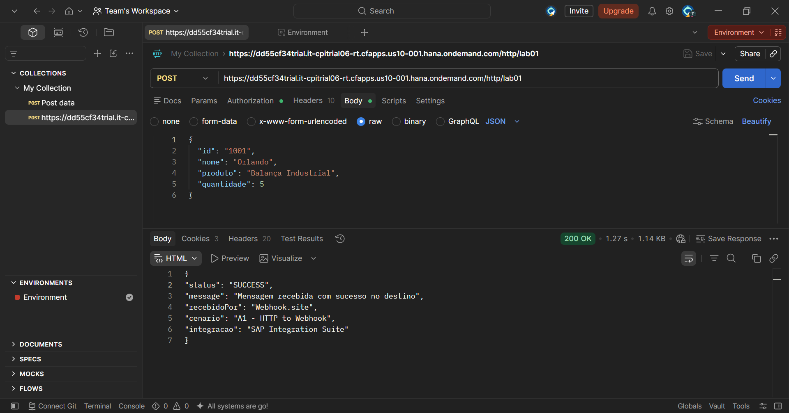
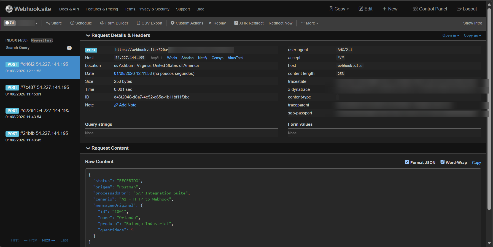
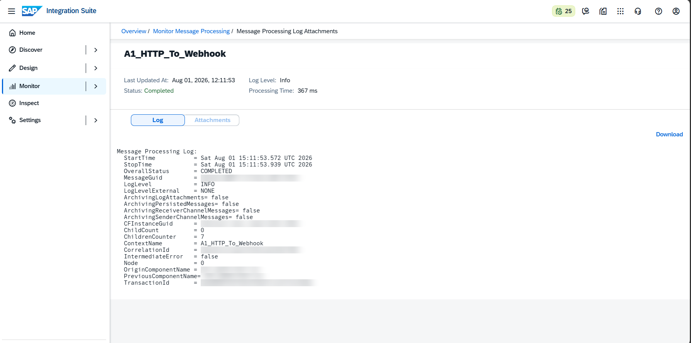

# 🧪 LAB01 — A1: HTTP → Content Modifier → Webhook.site

> **Bloco A — CPI Fundamentos** | Camada 1 (trilha oficial) 🥇
> Primeiro Integration Flow do projeto: receber uma mensagem via HTTP, transformá-la e encaminhá-la para um sistema externo, comprovando o recebimento.

---

## 🎯 Objetivo

Construir o primeiro iFlow do projeto, exercitando o ciclo completo de uma integração:

- **Receber** uma mensagem HTTP enviada por um sistema externo (Postman)
- **Transformar** o conteúdo da mensagem no SAP Integration Suite (Content Modifier)
- **Encaminhar** a mensagem para um sistema de destino (Webhook.site)
- **Validar** que a mensagem chegou ao destino e monitorar o processamento

---

## 🏗️ Arquitetura

```text
┌────────────┐        ┌──────────────────────────────┐        ┌────────────────┐
│  Postman   │  POST  │     SAP Integration Suite      │  POST  │  Webhook.site  │
│ (emissor)  │ ─────► │  HTTPS Sender → Content Mod.   │ ─────► │   (destino)    │
│            │        │        → HTTP Receiver         │        │                │
└────────────┘        └──────────────────────────────┘        └────────────────┘
                              (recebe e transforma)             (valida recebimento)
```

| Componente | Papel |
|---|---|
| **Postman** | Sistema emissor — envia o JSON de entrada |
| **HTTPS Sender** | Ponto de entrada do iFlow (endpoint `/lab01`) |
| **Content Modifier** | Transforma a mensagem, adicionando dados de contexto |
| **HTTP Receiver** | Envia a mensagem transformada ao destino |
| **Webhook.site** | Sistema de destino — comprova o recebimento |

---

## ⚙️ Passo a passo da construção

### 1. Criação do pacote e do iFlow
- Pacote: `SAP Integration Suite Learning`
- Integration Flow: `A1_HTTP_To_Webhook`

### 2. Sender (entrada HTTP)
- Adapter: **HTTPS**
- **Address:** `/lab01`
- **Authorization:** `User Role`
- **User Role:** `ESBMessaging.send`
- **CSRF Protected:** ❌ **desativado** (essencial para POST — ver Troubleshooting)

### 3. Content Modifier (transformação)
- Aba **Message Body** → Type: **Expression**
- Corpo configurado:

```json
{
  "status": "RECEBIDO",
  "origem": "Postman",
  "processadoPor": "SAP Integration Suite",
  "cenario": "A1 - HTTP to Webhook",
  "mensagemOriginal": ${in.body}
}
```

> 💡 A expressão `${in.body}` insere a mensagem original recebida do Postman dentro da nova estrutura, comprovando que o iFlow recebeu e transformou o conteúdo.

### 4. Receiver (saída para o destino)
- Adapter: **HTTP**
- **Address:** URL única do Webhook.site (bloco *"Your unique URL"*)
- **Method:** `POST`

### 5. Save + Deploy
- Salvar e realizar o **Deploy**
- Aguardar o status **Started** no monitoramento

---

## 🧩 Payloads

### Entrada (enviada pelo Postman)
```json
{
  "id": "1001",
  "nome": "Orlando",
  "produto": "Balança Industrial",
  "quantidade": 5
}
```

### Saída (recebida no Webhook.site)
```json
{
  "status": "RECEBIDO",
  "origem": "Postman",
  "processadoPor": "SAP Integration Suite",
  "cenario": "A1 - HTTP to Webhook",
  "mensagemOriginal": {
    "id": "1001",
    "nome": "Orlando",
    "produto": "Balança Industrial",
    "quantidade": 5
  }
}
```

---

## 🔐 Autenticação (Postman → iFlow)

A chamada ao iFlow **não usa** o login do portal SAP. É necessária uma credencial técnica gerada no BTP:

1. **BTP Cockpit** → *Instances and Subscriptions* → **Create**
2. Service: **Process Integration Runtime** | Plan: **integration-flow**
3. Roles: **ESBMessaging.send** | Grant-type: **Client Credentials**
4. Criar a instância e depois a **Service Key**
5. Usar no Postman (Basic Auth):
   - **Username:** `clientid`
   - **Password:** `clientsecret`

> 🔒 **Segurança:** o `clientsecret` nunca deve ser versionado no GitHub nem exposto em prints.

---

## 🐛 Troubleshooting (erros reais enfrentados e resolvidos)

Esta seção documenta os problemas encontrados durante a execução e como foram solucionados — parte essencial do aprendizado.

### ❌ Erro 1 — `403 Forbidden` (página Tomcat)
- **Sintoma:** POST retornava `403 Forbidden` mesmo com autenticação e roles corretos.
- **Causa:** a opção **CSRF Protected** estava **ativada** no adapter HTTPS, bloqueando requisições POST sem token CSRF.
- **Solução:** desmarcar **CSRF Protected** no Sender → Save → Deploy.

### ❌ Erro 2 — `500 Internal Server Error` / `404` no Receiver
- **Sintoma:** mensagem entrava no iFlow mas falhava; log apontava `statusCode: 404` ao invocar o Webhook.site.
- **Causa:** foi copiada a **URL da barra do navegador** (contendo `#!/view/`, codificado como `%23!`), em vez da URL única real.
- **Solução:** usar a URL do bloco **"Your unique URL"** do Webhook.site (sem `#!/view/`) → Save → Deploy.

### ✅ Resultado final
- **Postman:** `200 OK`
- **Webhook.site:** mensagem transformada recebida com sucesso
- **Monitor:** status **Completed**

> 📚 **Lições aprendidas:**
> 1. Em cenários POST, desabilitar CSRF Protected no Sender (para testes).
> 2. Sempre copiar a URL do Webhook.site do campo *"Your unique URL"*, nunca da barra do navegador.
> 3. Autenticação de aplicação usa Service Key (clientid/secret), não o login do portal.

---

## 📸 Evidências

### 1. iFlow montado no editor


### 2. Content Modifier configurado


### 3. Postman — resposta 200 OK


### 4. Webhook.site — mensagem recebida


### 5. Monitor — status Completed


---

## ✅ Conclusão

O cenário A1 exercitou o ciclo completo de uma integração no SAP Integration Suite: recebimento via HTTPS, transformação de mensagem com Content Modifier, envio a um sistema externo e validação por monitoramento. Além disso, o troubleshooting real (CSRF e URL de destino) consolidou conceitos fundamentais de segurança e conectividade que se repetem em cenários mais avançados.

**Recursos praticados:** HTTPS Sender · Content Modifier · Expression `${in.body}` · HTTP Receiver · Deploy · Monitoring · Basic Auth com Service Key

**Próximo cenário:** [A2 — Timer → Request Reply → API pública](./04-a2-timer-to-api.md)
