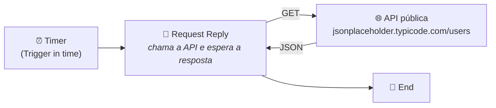
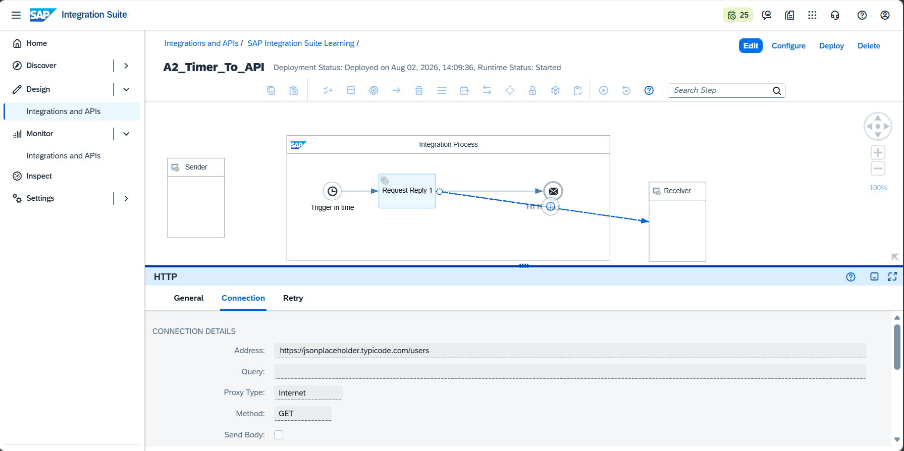
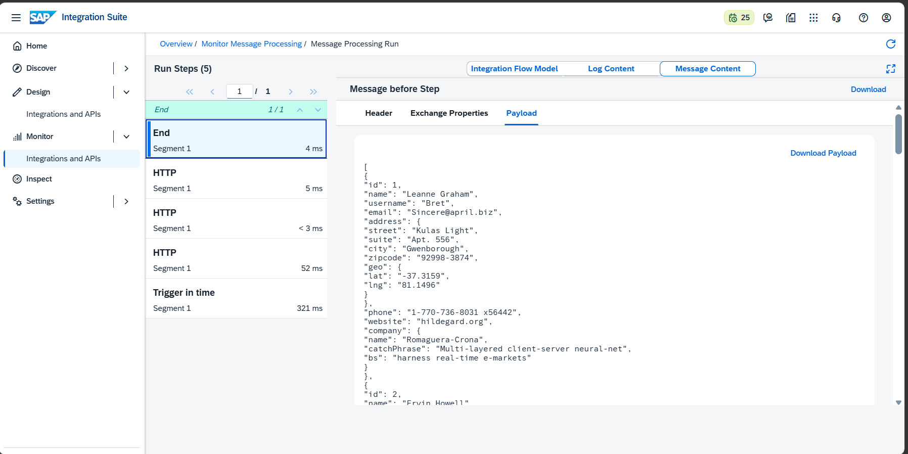

# 🧪 LAB02 — A2: Timer → Request Reply → API pública

> **Bloco A — CPI Fundamentos** | Camada 1 (trilha oficial) 🥇
> Segundo Integration Flow do projeto: um fluxo que se dispara sozinho (por tempo) e consome dados de uma API REST externa, invertendo a lógica do A1.

---

## 🎯 Objetivo

Enquanto no A1 uma aplicação externa (Postman) **enviava** a mensagem, no A2 o próprio iFlow **busca** os dados de forma autônoma. Os objetivos são:

- Disparar o fluxo automaticamente com um **Timer Start Event**
- Chamar uma **API REST pública** usando o padrão **Request Reply**
- Receber e visualizar a **resposta JSON** retornada pela API
- Monitorar a execução e o payload no **Trace**

---

## 🏗️ Arquitetura



| Componente | Papel |
|---|---|
| **Timer Start** | Dispara o fluxo automaticamente (Run Once) |
| **Request Reply** | Executa a chamada à API e aguarda o retorno |
| **HTTP Receiver** | Adapter que faz o GET na API externa |
| **API pública** | `jsonplaceholder` — retorna dados fake de usuários |

> 💡 **Conceito-chave:** o padrão *Request Reply* gera **duas linhas** no diagrama — uma **sólida** (sequência do processo, até o End) e uma **tracejada** (message flow, a chamada HTTP ao Receiver). Ambas são necessárias: o fluxo "sai para buscar" o dado e "volta" para continuar.

---

## ⚙️ Passo a passo da construção

### 1. Criação do iFlow
- Pacote: `SAP Integration Suite Learning`
- Integration Flow: `A2_Timer_To_API`

### 2. Timer Start Event
- Substituir o Start padrão por um **Timer**
- Aba **Scheduler** → **Run Once** (executa uma vez ao deployar)

### 3. Request Reply
- Adicionar o componente **Request Reply** entre o Timer e o End
- Conectar o Request Reply ao **Receiver** com o adapter **HTTP**

### 4. Configuração do adapter HTTP (aba Connection)
| Parâmetro | Valor |
|---|---|
| **Address** | `https://jsonplaceholder.typicode.com/users` |
| **Query** | *(vazio)* |
| **Proxy Type** | `Internet` |
| **Method** | `GET` |
| **Send Body** | ❌ desmarcado |

### 5. Habilitar o Trace (para visualizar o payload)
- Clicar em área vazia do **Integration Process**
- Aba **Runtime Configuration** → **Log Level: Trace**

### 6. Save + Deploy
- Salvar e realizar o **Deploy**
- Aguardar **Runtime Status: Started** (o fluxo executa uma vez automaticamente)

---

## 🧩 Resultado — Payload retornado pela API

A API pública retornou uma lista de usuários. Exemplo do primeiro registro recebido:

```json
[
  {
    "id": 1,
    "name": "Leanne Graham",
    "username": "Bret",
    "email": "Sincere@april.biz",
    "address": {
      "street": "Kulas Light",
      "suite": "Apt. 556",
      "city": "Gwenborough",
      "zipcode": "92998-3874",
      "geo": { "lat": "-37.3159", "lng": "81.1496" }
    },
    "phone": "1-770-736-8031 x56442",
    "website": "hildegard.org",
    "company": {
      "name": "Romaguera-Crona",
      "catchPhrase": "Multi-layered client-server neural-net",
      "bs": "harness real-time e-markets"
    }
  }
]
```

---

## 📊 Run Steps da execução

O monitoramento registrou 5 passos, comprovando o ciclo completo do Request Reply:

```text
Trigger in time (321 ms) → HTTP → HTTP → HTTP (52 ms) → End (4 ms)
Status: Completed ✅
```

---

## 📸 Evidências

### 1. iFlow e configuração do adapter HTTP (Connection)


### 2. Payload retornado pela API (Trace)


---

## ✅ Conclusão

O cenário A2 demonstrou o padrão **Request Reply** consumindo uma API REST externa de forma autônoma, disparada por um **Timer**. Diferentemente do A1 (onde o dado era empurrado para o iFlow), aqui o próprio fluxo **puxa** os dados de um sistema externo — um dos padrões mais comuns em integrações reais (consultar catálogos, buscar cadastros, sincronizar dados mestres, etc.).

**Recursos praticados:** Timer Start Event · Request Reply · HTTP Receiver (GET) · Consumo de API REST · Log Level Trace · Monitoring

**Cenário anterior:** [A1 — HTTP → Content Modifier → Webhook.site](./03-a1-http-to-webhook.md)
**Próximo cenário:** [A3 — Message Mapping (JSON → JSON / JSON → XML)](./05-a3-message-mapping.md)
