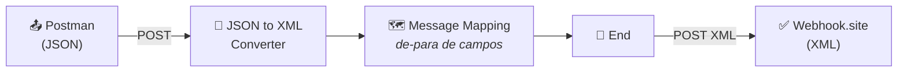
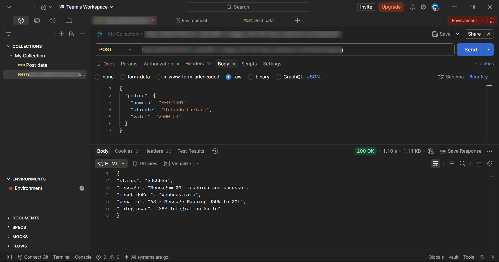
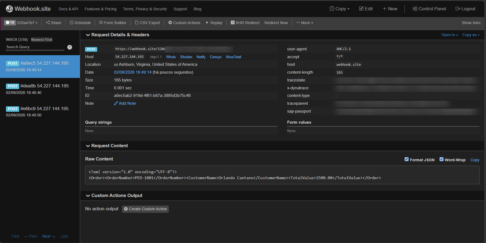
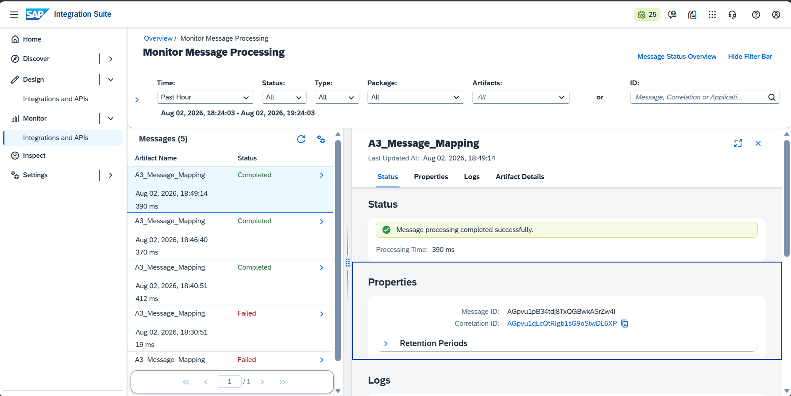
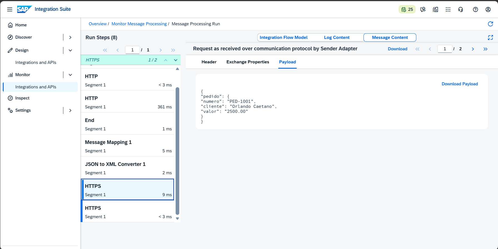
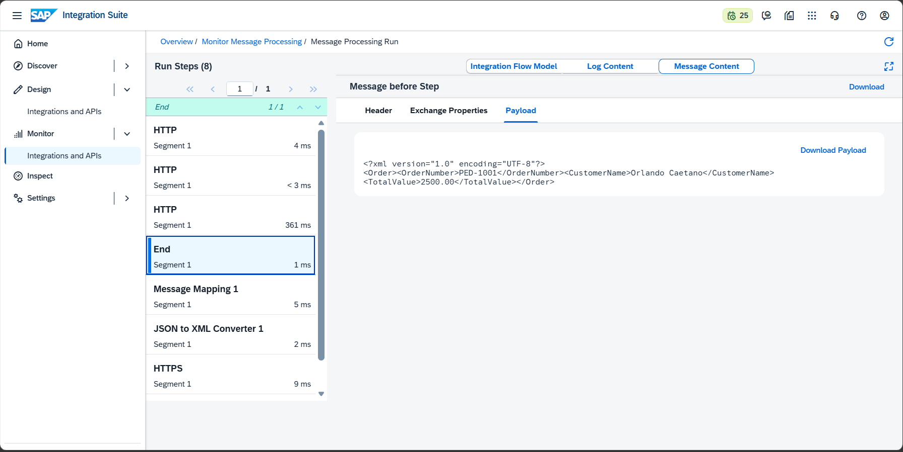

# 🧪 LAB03 — A3: Message Mapping (JSON → XML)

> **Bloco A — CPI Fundamentos** | Camada 1 (trilha oficial) 🥇
> Terceiro Integration Flow do projeto: transformar a **estrutura** e o **formato** de uma mensagem, convertendo JSON em XML e renomeando os campos (de-para).

---

## 🎯 Objetivo

Nos cenários anteriores a mensagem era apenas recebida (A1) ou buscada (A2). No A3 o foco é **transformar** a mensagem — o coração da maioria das integrações reais, onde cada sistema "fala uma língua" diferente. Os objetivos são:

- Converter uma mensagem de **JSON para XML**
- Renomear os campos por meio de um **Message Mapping** visual (de-para)
- Compreender por que o Message Mapping exige entrada **XML**
- Validar a transformação de ponta a ponta no monitoramento e no destino

---

## 🏗️ Arquitetura



| Componente | Papel |
|---|---|
| **HTTPS Sender** | Recebe o JSON do Postman (endpoint `/a3mapping`) |
| **JSON to XML Converter** | Converte o JSON de entrada em XML (pré-requisito do mapping) |
| **Message Mapping** | Renomeia/estrutura os campos (pedido → Order) |
| **HTTP Receiver** | Envia o XML resultante ao destino |
| **Webhook.site** | Recebe e comprova o XML transformado |

---

## 🗺️ O de-para (mapeamento de campos)

| Origem (JSON/pedido) | Destino (XML/Order) |
|---|---|
| `numero` | `OrderNumber` |
| `cliente` | `CustomerName` |
| `valor` | `TotalValue` |

---

## 🧩 Payloads (transformação passo a passo)

### 1. Entrada — JSON (recebido do Postman)
```json
{
  "pedido": {
    "numero": "PED-1001",
    "cliente": "Orlando Caetano",
    "valor": "2500.00"
  }
}
```

### 2. Após o JSON to XML Converter — XML com estrutura de origem
```xml
<?xml version="1.0" encoding="UTF-8"?>
<pedido>
  <numero>PED-1001</numero>
  <cliente>Orlando Caetano</cliente>
  <valor>2500.00</valor>
</pedido>
```

### 3. Saída — XML após o Message Mapping (campos renomeados)
```xml
<?xml version="1.0" encoding="UTF-8"?>
<Order>
  <OrderNumber>PED-1001</OrderNumber>
  <CustomerName>Orlando Caetano</CustomerName>
  <TotalValue>2500.00</TotalValue>
</Order>
```

---

## ⚙️ Passo a passo da construção

### 1. Criação do iFlow
- Integration Flow: `A3_Message_Mapping`
- Sender HTTPS → Address `/a3mapping` → **CSRF Protected desmarcado**

### 2. JSON to XML Converter
- Adicionado **antes** do Message Mapping
- **Add XML Root Element:** desmarcado (evita envolver o XML em `<root>`)
- **Use Namespace Mapping:** desmarcado (XML mais limpo)

### 3. Message Mapping
- Estrutura de origem (Source): `pedido` (numero, cliente, valor)
- Estrutura de destino (Target): `Order` (OrderNumber, CustomerName, TotalValue)
- Ligações criadas arrastando cada campo de origem ao destino
- Testado com o botão **Simulate** antes do deploy

### 4. Receiver HTTP
- Address: URL do Webhook.site | Method: POST

### 5. Save + Deploy
- Deploy realizado, Runtime Status **Started**

---

## 🐛 Troubleshooting (erros reais enfrentados e resolvidos)

### ❌ Erro 1 — `500 Internal Server Error` (Message Mapping)
- **Sintoma:** ao enviar JSON, o iFlow falhava no passo do Message Mapping.
- **Causa:** o **Message Mapping do CPI opera sobre XML**, não sobre JSON. A entrada JSON não era compreendida pelo mapping.
- **Solução:** adicionar um **JSON to XML Converter** antes do Message Mapping.

### ❌ Erro 2 — Estrutura não casava (root element)
- **Sintoma:** risco do XML gerado vir envolvido em `<root><pedido>...`, sem casar com o schema esperado (`<pedido>`).
- **Causa:** a opção **Add XML Root Element** do conversor estava marcada.
- **Solução:** desmarcar **Add XML Root Element** (e **Use Namespace Mapping**) para o XML iniciar diretamente em `<pedido>`.

> 📚 **Lição-chave (cai em prova):** *Message Mapping trabalha com XML. Para entradas JSON, sempre converter com **JSON to XML Converter** antes — e atenção ao **root element** para a estrutura casar com o schema.*

---

## 📊 Run Steps da execução

O monitoramento registrou 8 passos, comprovando toda a cadeia de transformação:

```text
HTTPS (entrada JSON) → JSON to XML Converter → Message Mapping → End (XML Order) → HTTP (envio)
Status: Completed ✅
```

---

## 📸 Evidências (sequência de ponta a ponta)

As evidências abaixo seguem a ordem cronológica da execução: do desenho do iFlow no SAP, passando pelo disparo no Postman e a chegada no destino, até a prova da transformação interna (JSON → XML) no monitoramento.

### 1. iFlow construído no SAP Integration Suite
Fluxo `HTTPS → JSON to XML Converter → Message Mapping → End → HTTP`, deployado e com status **Started**.


### 2. Disparo no Postman — JSON enviado e `200 OK`
Requisição POST com o JSON de entrada e resposta de sucesso.


### 3. Mensagem recebida no destino (Webhook.site) — XML
O destino recebe a mensagem já convertida em XML `<Order>`.


### 4. Pipeline no monitoramento (Integration Flow Model)
Visão dos 8 Run Steps executados no SAP.


### 5. SAP Trace — entrada em JSON (antes do conversor)
Payload como recebido pelo Sender: JSON `pedido`.


### 6. SAP Trace — saída em XML `<Order>` (no End)
Payload final após a transformação: XML `<Order>` com os campos renomeados.


---

## ✅ Conclusão

O cenário A3 demonstrou a **transformação de mensagens**, combinando **conversão de formato** (JSON → XML) e **mapeamento estrutural** (renomeação de campos). O monitoramento permitiu visualizar a mensagem em cada etapa — JSON na entrada, XML `<pedido>` após o conversor e XML `<Order>` na saída — comprovando toda a cadeia. O troubleshooting reforçou um conceito fundamental e muito cobrado: **o Message Mapping opera sobre XML**.

**Recursos praticados:** Message Mapping (de-para visual) · JSON to XML Converter · Simulate · Trace / Message Content · Monitoring

**Cenário anterior:** [A2 — Timer → Request Reply → API pública](./04-a2-timer-to-api.md)
**Próximo cenário:** [A4 — Groovy Script](./06-a4-groovy-script.md)
