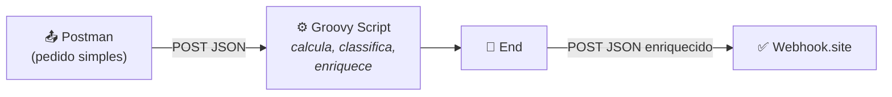
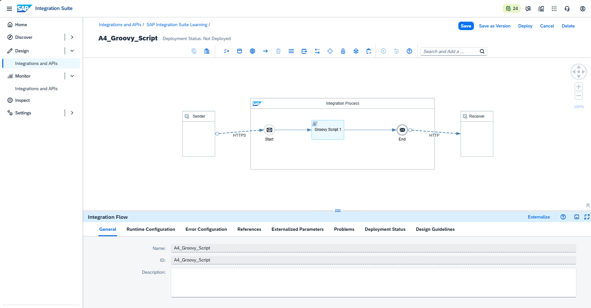
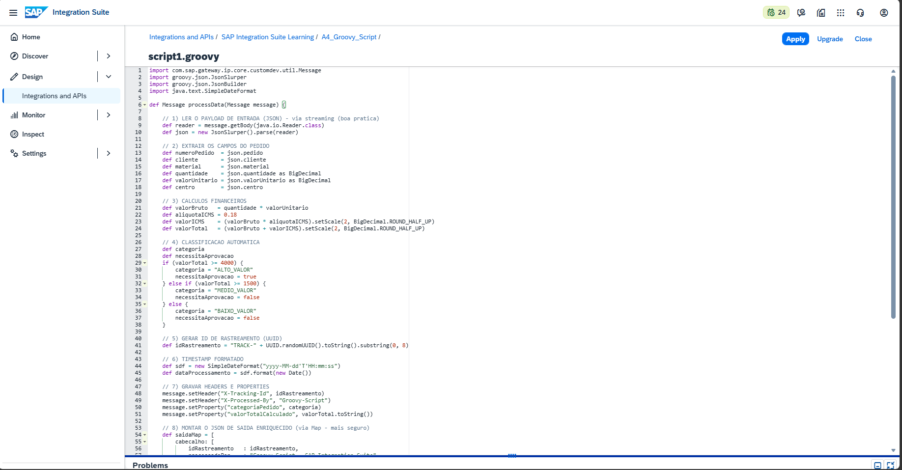
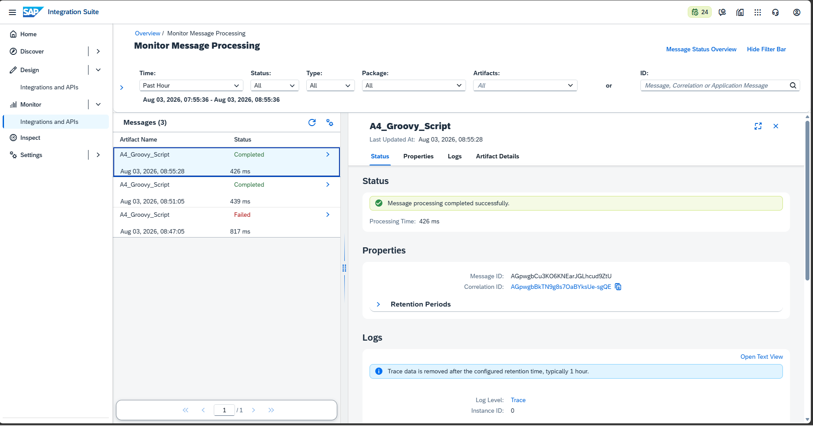
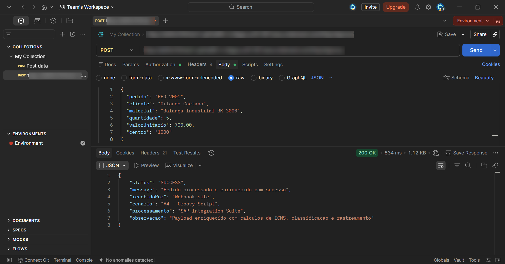
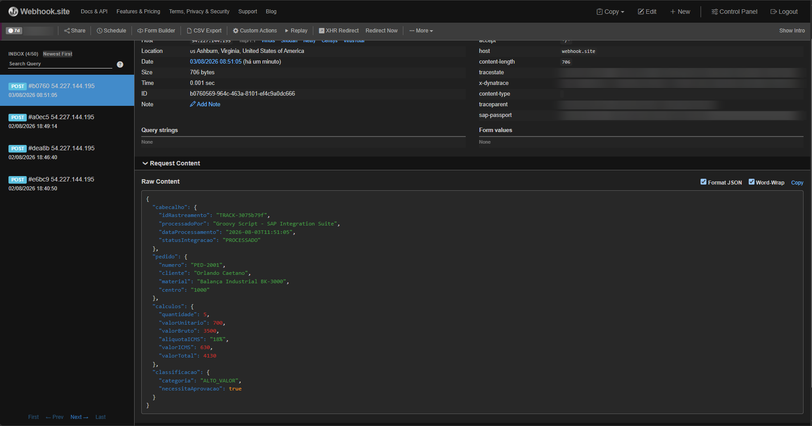
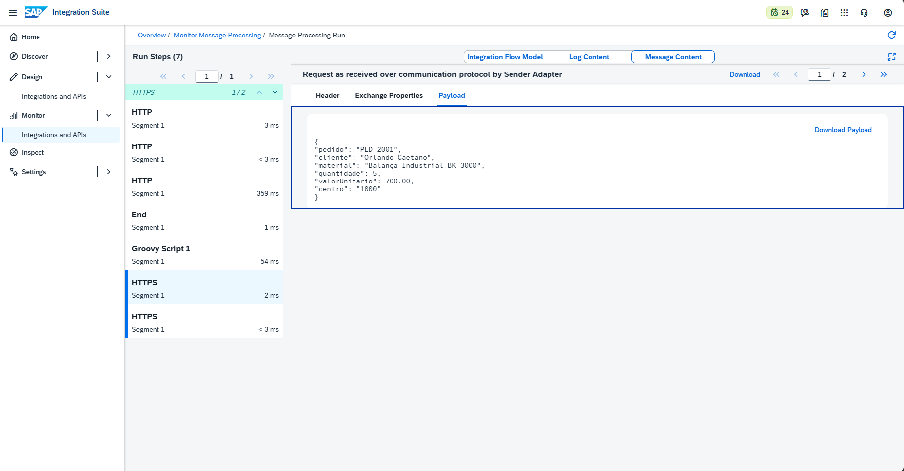
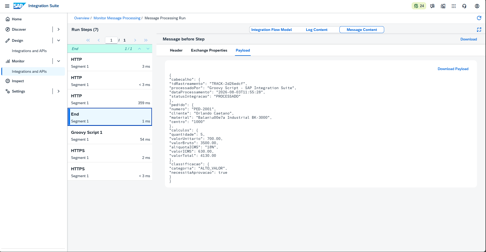

# 🧪 LAB04 — A4: Groovy Script (enriquecimento e lógica de negócio)

> **Bloco A — CPI Fundamentos** | Camada 1 (trilha oficial) 🥇
> Quarto e último Integration Flow do Bloco A: usar **código Groovy** para adicionar lógica de negócio ao iFlow — cálculos, classificação automática, rastreamento e enriquecimento da mensagem.

---

## 🎯 Objetivo

Nos cenários A1 a A3, a mensagem foi recebida, buscada e transformada usando **componentes prontos** (arrastar e soltar). No A4 damos um passo além: escrevemos **nosso próprio código** (Groovy) para executar lógica que os componentes padrão não fazem sozinhos.

O objetivo é receber um pedido simples e devolvê-lo **enriquecido**, com:

- Cálculos financeiros (valor bruto, ICMS e valor total)
- Classificação automática do pedido por faixa de valor
- Decisão de necessidade de aprovação
- Identificador único de rastreamento (UUID)
- Data/hora de processamento
- Metadados de controle em headers e properties

---

## 🔄 O que mudou em relação aos labs anteriores

| Lab | Abordagem | O que a mensagem sofria |
|---|---|---|
| A1 | Content Modifier | Ajuste simples de conteúdo |
| A2 | Request Reply | Buscava dados externos |
| A3 | Message Mapping | Mudança de estrutura/formato (JSON→XML) |
| **A4** | **Groovy Script** | **Lógica de negócio: cálculos, decisões e enriquecimento** |

> 💡 **A diferença-chave:** os componentes prontos fazem transformações **declarativas** (você configura "de-para"). O Groovy permite lógica **programática** — condições, cálculos, laços, geração de valores dinâmicos. É onde a integração deixa de ser "encanamento" e passa a aplicar **regras de negócio**.

---

## 🏗️ Arquitetura



| Componente | Papel |
|---|---|
| **HTTPS Sender** | Recebe o pedido em JSON (endpoint `/a4groovy`) |
| **Groovy Script** | Executa a lógica de negócio e monta o JSON de saída |
| **HTTP Receiver** | Envia o resultado enriquecido ao destino |

---

## 📥 Entrada vs. 📤 Saída

### Entrada (pedido simples — 6 campos)
```json
{
  "pedido": "PED-2001",
  "cliente": "Orlando Caetano",
  "material": "Balança Industrial BK-3000",
  "quantidade": 5,
  "valorUnitario": 700.00,
  "centro": "1000"
}
```

### Saída (enriquecida — 4 blocos gerados pelo código)
```json
{
  "cabecalho": {
    "idRastreamento": "TRACK-3075b79f",
    "processadoPor": "Groovy Script - SAP Integration Suite",
    "dataProcessamento": "2026-08-03T11:51:05",
    "statusIntegracao": "PROCESSADO"
  },
  "pedido": {
    "numero": "PED-2001",
    "cliente": "Orlando Caetano",
    "material": "Balança Industrial BK-3000",
    "centro": "1000"
  },
  "calculos": {
    "quantidade": 5,
    "valorUnitario": 700,
    "valorBruto": 3500,
    "aliquotaICMS": "18%",
    "valorICMS": 630,
    "valorTotal": 4130
  },
  "classificacao": {
    "categoria": "ALTO_VALOR",
    "necessitaAprovacao": true
  }
}
```

---

## 🧮 Os cálculos explicados

O Groovy calcula tudo a partir de apenas `quantidade` e `valorUnitario`:

| Cálculo | Fórmula | Resultado |
|---|---|---|
| **Valor Bruto** | `quantidade × valorUnitario` = 5 × 700 | **3.500,00** |
| **Valor ICMS** | `valorBruto × 18%` = 3500 × 0,18 | **630,00** |
| **Valor Total** | `valorBruto + valorICMS` = 3500 + 630 | **4.130,00** |

### Regra de classificação (lógica condicional)

```text
SE valorTotal ≥ 4000  → ALTO_VALOR   | necessitaAprovacao = true
SE valorTotal ≥ 1500  → MEDIO_VALOR  | necessitaAprovacao = false
SENÃO                 → BAIXO_VALOR  | necessitaAprovacao = false
```

No caso do pedido de teste: `valorTotal = 4.130` → **ALTO_VALOR** → **precisa de aprovação**.

> 💡 Isso simula um cenário real de **SAP MM**: um pedido de compra de alto valor que, por regra da empresa, exige aprovação gerencial antes de seguir. A lógica que normalmente estaria no ERP foi aplicada na camada de integração.

---

## 📜 O código Groovy explicado (9 blocos)

O script implementa 9 operações, demonstrando os principais recursos da linguagem:

| # | Bloco | Recurso Groovy | O que faz |
|---|---|---|---|
| 1 | Leitura do payload | `getBody(Reader)` + `JsonSlurper` | Lê o JSON de entrada via streaming |
| 2 | Extração de campos | Acesso a propriedades | Obtém pedido, cliente, quantidade, etc. |
| 3 | Cálculos | `BigDecimal` + `setScale` | Calcula bruto, ICMS e total (2 casas) |
| 4 | Classificação | `if / else if / else` | Define categoria e aprovação |
| 5 | Rastreamento | `UUID.randomUUID()` | Gera um ID único (TRACK-xxxxxxxx) |
| 6 | Timestamp | `SimpleDateFormat` | Data/hora do processamento |
| 7 | Metadados | `setHeader` / `setProperty` | Grava dados de controle na mensagem |
| 8 | Montagem do JSON | `Map` + `JsonBuilder` | Estrutura o payload de saída |
| 9 | Corpo final | `setBody` | Define o novo corpo enriquecido |

### Código completo
```groovy
import com.sap.gateway.ip.core.customdev.util.Message
import groovy.json.JsonSlurper
import groovy.json.JsonBuilder
import java.text.SimpleDateFormat

def Message processData(Message message) {

    // 1) LER O PAYLOAD DE ENTRADA (JSON) - via streaming (boa pratica)
    def reader = message.getBody(java.io.Reader.class)
    def json = new JsonSlurper().parse(reader)

    // 2) EXTRAIR OS CAMPOS DO PEDIDO
    def numeroPedido  = json.pedido
    def cliente       = json.cliente
    def material      = json.material
    def quantidade    = json.quantidade as BigDecimal
    def valorUnitario = json.valorUnitario as BigDecimal
    def centro        = json.centro

    // 3) CALCULOS FINANCEIROS
    def valorBruto   = quantidade * valorUnitario
    def aliquotaICMS = 0.18
    def valorICMS    = (valorBruto * aliquotaICMS).setScale(2, BigDecimal.ROUND_HALF_UP)
    def valorTotal   = (valorBruto + valorICMS).setScale(2, BigDecimal.ROUND_HALF_UP)

    // 4) CLASSIFICACAO AUTOMATICA
    def categoria
    def necessitaAprovacao
    if (valorTotal >= 4000) {
        categoria = "ALTO_VALOR"
        necessitaAprovacao = true
    } else if (valorTotal >= 1500) {
        categoria = "MEDIO_VALOR"
        necessitaAprovacao = false
    } else {
        categoria = "BAIXO_VALOR"
        necessitaAprovacao = false
    }

    // 5) GERAR ID DE RASTREAMENTO (UUID)
    def idRastreamento = "TRACK-" + UUID.randomUUID().toString().substring(0, 8)

    // 6) TIMESTAMP FORMATADO
    def sdf = new SimpleDateFormat("yyyy-MM-dd'T'HH:mm:ss")
    def dataProcessamento = sdf.format(new Date())

    // 7) GRAVAR HEADERS E PROPERTIES
    message.setHeader("X-Tracking-Id", idRastreamento)
    message.setHeader("X-Processed-By", "Groovy-Script")
    message.setProperty("categoriaPedido", categoria)
    message.setProperty("valorTotalCalculado", valorTotal.toString())

    // 8) MONTAR O JSON DE SAIDA ENRIQUECIDO (via Map - mais seguro)
    def saidaMap = [
        cabecalho: [
            idRastreamento   : idRastreamento,
            processadoPor    : "Groovy Script - SAP Integration Suite",
            dataProcessamento: dataProcessamento,
            statusIntegracao : "PROCESSADO"
        ],
        pedido: [
            numero  : numeroPedido,
            cliente : cliente,
            material: material,
            centro  : centro
        ],
        calculos: [
            quantidade   : quantidade,
            valorUnitario: valorUnitario,
            valorBruto   : valorBruto,
            aliquotaICMS : "18%",
            valorICMS    : valorICMS,
            valorTotal   : valorTotal
        ],
        classificacao: [
            categoria         : categoria,
            necessitaAprovacao: necessitaAprovacao
        ]
    ]

    // 9) DEFINIR O NOVO CORPO DA MENSAGEM
    def saida = new JsonBuilder(saidaMap)
    message.setBody(saida.toPrettyString())

    return message
}
```

---

## 🐛 Troubleshooting (erros reais enfrentados e resolvidos)

### ⚠️ Aviso 1 — Leitura sem streaming (General Script Check)
- **Sintoma:** o SAP alertou *"parse the message body using JSONSlurper without streaming"*.
- **Causa:** `getBody(String)` carrega toda a mensagem em memória de uma vez.
- **Solução:** usar `getBody(java.io.Reader.class)` + `JsonSlurper().parse(reader)` (streaming), evitando risco de out-of-memory com payloads grandes.

### ❌ Erro 2 — `500` no JsonBuilder (`String.call()`)
- **Sintoma:** `No signature of method: java.lang.String.call() ... values: [TRACK-...]`.
- **Causa:** a sintaxe de *closure* do `JsonBuilder` (`chave variavel`) gera ambiguidade quando a chave tem o mesmo nome da variável — o Groovy tenta "chamar" a variável como método.
- **Solução:** montar um **Map** e passá-lo ao `new JsonBuilder(map)`. Mais legível e sem ambiguidade.

> 📚 **Lições-chave:**
> 1. Ler o body via **streaming** (`Reader`) é boa prática e passa nos checks do SAP.
> 2. Para JSON de saída, **montar um Map** e usar `JsonBuilder(map)` é mais seguro que a sintaxe de closure.

---

## 📸 Evidências (sequência de ponta a ponta)

As evidências seguem a ordem da execução: do iFlow e do código no SAP, passando pelo disparo no Postman e a chegada no Webhook, até a prova da transformação interna (entrada simples → saída enriquecida) no Trace.

### 1. iFlow com o Groovy Script
Fluxo `HTTPS → Groovy Script → End`, deployado e com status **Started**.


### 2. Código Groovy no editor
Script com as 9 operações, sem apontamentos nos Script Checks.


### 3. Status no Monitor — Completed
Execução processada com sucesso.


### 4. Disparo no Postman — `200 OK`
Envio do pedido simples e resposta de sucesso do cenário A4.


### 5. Mensagem recebida no destino (Webhook.site)
O destino recebe o JSON já enriquecido pelo Groovy.


### 6. SAP Trace — entrada (HTTPS): pedido simples
Payload como recebido pelo Sender, antes do processamento (6 campos).


### 7. SAP Trace — saída (End): JSON enriquecido pelo Groovy
Payload final após os cálculos, classificação e enriquecimento (4 blocos).


---

## ✅ Conclusão

O cenário A4 demonstrou o uso de **Groovy Script** para aplicar **lógica de negócio real** dentro da integração: a partir de um pedido simples com 6 campos, o iFlow calculou valores financeiros (bruto, ICMS, total), classificou o pedido por faixa de valor, decidiu sobre a necessidade de aprovação e gerou identificadores de rastreamento — devolvendo um payload estruturado e enriquecido. Isso mostra a capacidade do SAP Integration Suite de ir **além do transporte de dados**, aplicando regras que muitas vezes estariam no ERP.

Com este laboratório, o **Bloco A — CPI Fundamentos** é concluído (A1 a A4), cobrindo os pilares do desenvolvimento de Integration Flows: recebimento, consumo de APIs, transformação de mensagens e lógica programática.

**Recursos praticados:** Groovy Script · JsonSlurper (streaming) · BigDecimal · Lógica condicional · UUID · SimpleDateFormat · Headers/Properties · JsonBuilder · Monitoring/Trace

**Cenário anterior:** [A3 — Message Mapping (JSON → XML)](./05-a3-message-mapping.md)

**Próximo bloco:** [B1 — Content-Based Router](./07-b1-content-based-router.md) _(Bloco B — Padrões de Integração)_
