# 🧪 LAB05 — B1: Content-Based Router

> **Bloco B — Padrões de Integração** | Camada 1 (trilha oficial) 🥇
> Primeiro cenário do Bloco B: rotear mensagens por caminhos diferentes conforme o conteúdo, aplicando o padrão **Content-Based Router** (roteamento baseado em conteúdo).

---

## 🎯 Objetivo

Nos labs do Bloco A, o fluxo seguia sempre um caminho único. No B1 a mensagem passa a **"tomar decisões"**: com base no valor do pedido, o Router direciona cada mensagem para um destino diferente. Os objetivos são:

- Aplicar o **Enterprise Integration Pattern** de roteamento por conteúdo
- Avaliar condições sobre o payload usando **XPath**
- Direcionar a mensagem para rotas distintas conforme a faixa de valor
- Compreender a importância da **ordem** e de **faixas exclusivas** nas condições

---

## 🏗️ Arquitetura

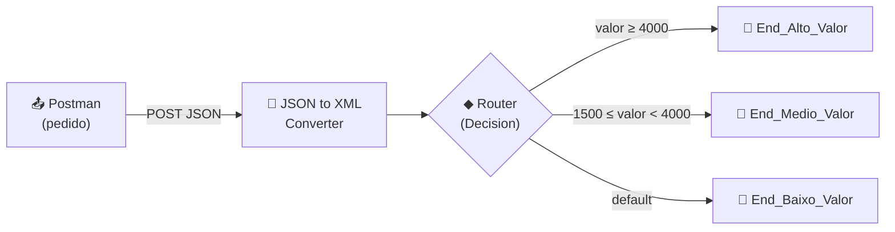

| Componente | Papel |
|---|---|
| **HTTPS Sender** | Recebe o pedido em JSON (endpoint `/b1router`) |
| **JSON to XML Converter** | Converte para XML (o Router avalia via XPath) |
| **Router (Decision)** | Avalia o valor e escolhe a rota |
| **End_Alto/Medio/Baixo_Valor** | Destinos distintos por faixa de valor |

---

## 🔀 Regras de roteamento

| Ordem | Rota | Condição (XPath) | Destino |
|---|---|---|---|
| 1 | Route 1 | `/pedido/valor >= 4000` | End_Alto_Valor |
| 2 | Route 2 | `/pedido/valor >= 1500 and /pedido/valor < 4000` | End_Medio_Valor |
| 3 | Route 3 | *Default Route* | End_Baixo_Valor |

---

## 🧩 Payloads de teste

> ⚠️ O JSON precisa de **um único elemento raiz** (`pedido`), envolvendo os demais campos — requisito do JSON to XML Converter e do XPath `/pedido/valor`.

### Alto valor (→ End_Alto_Valor)
```json
{ "pedido": { "numero": "PED-3001", "cliente": "Orlando", "valor": 5000 } }
```

### Médio valor (→ End_Medio_Valor)
```json
{ "pedido": { "numero": "PED-3002", "cliente": "Orlando", "valor": 2000 } }
```

### Baixo valor (→ End_Baixo_Valor)
```json
{ "pedido": { "numero": "PED-3003", "cliente": "Orlando", "valor": 500 } }
```

---

## ⚙️ Passo a passo da construção

### 1. Criação do iFlow
- Integration Flow: `B1_Content_Based_Router`
- Sender HTTPS → Address `/b1router` → **CSRF Protected desmarcado**

### 2. JSON to XML Converter
- Adicionado após o Start (Router avalia XML via XPath)
- **Add XML Root Element** e **Use Namespace Mapping** desmarcados

### 3. Router (Decision) com 3 rotas
- Cada rota conectada a um **End** próprio (End_Alto/Medio/Baixo_Valor)
- Condições XPath definidas conforme a tabela de roteamento
- Route 3 marcada como **Default Route**

### 4. Save + Deploy
- Deploy realizado, Runtime Status **Started**

---

## 🐛 Troubleshooting (erros reais enfrentados e resolvidos)

### ❌ Erro 1 — `500`: "JSON contains more than one member in the root object"
- **Sintoma:** o JSON to XML Converter falhava ao converter o payload.
- **Causa:** o JSON de teste tinha **múltiplos campos na raiz** (pedido, cliente, valor). O conversor exige **um único elemento raiz**.
- **Solução:** envolver os campos em um objeto pai (`pedido`), deixando uma única raiz — o que também alinha com o XPath `/pedido/valor`.

### ❌ Erro 2 — Roteamento incorreto: valor 5000 caindo no MÉDIO
- **Sintoma:** um pedido de 5000 (alto) foi direcionado para `End_Medio_Valor`.
- **Causa:** condições **sobrepostas** + dependência de ordem. `5000` satisfaz tanto `>= 4000` quanto `>= 1500`; a rota do médio foi avaliada/atendida antes.
- **Solução:** usar **faixas mutuamente exclusivas** — alterar a condição do médio para `>= 1500 and < 4000`. Assim cada valor bate em apenas uma rota, independentemente da ordem.

> 📚 **Lições-chave (caem em prova):**
> 1. O **JSON to XML Converter** exige um único elemento raiz.
> 2. Em Routers, **evite condições sobrepostas**: use faixas fechadas (`>= X and < Y`) para um roteamento previsível e correto.

---

## 📊 Comprovação do roteamento

Cada payload seguiu o caminho correto, comprovado pelos Run Steps no monitoramento:

| Pedido | Valor | Rota escolhida | End |
|---|---|---|---|
| PED-3001 | 5000 | Route 1 (≥ 4000) | End_Alto_Valor ✅ |
| PED-3002 | 2000 | Route 2 (1500–3999) | End_Medio_Valor ✅ |
| PED-3003 | 500 | Route 3 (default) | End_Baixo_Valor ✅ |

---

## 📸 Evidências

### 1. iFlow com as 3 rotas (Router)
Fluxo `HTTPS → JSON to XML → Router` com três rotas para Ends distintos.
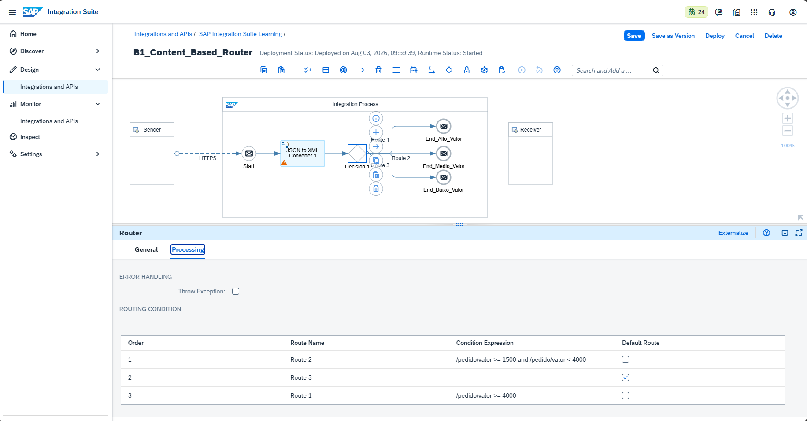

### 2. Monitor — status das execuções
Execuções processadas com sucesso (Completed).
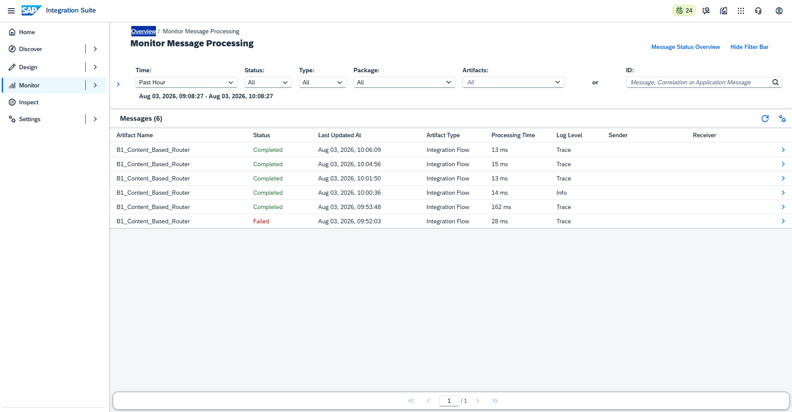

---

### 🔺 Fluxo ALTO VALOR (valor 5000)

**3. Postman — envio (alto valor)**
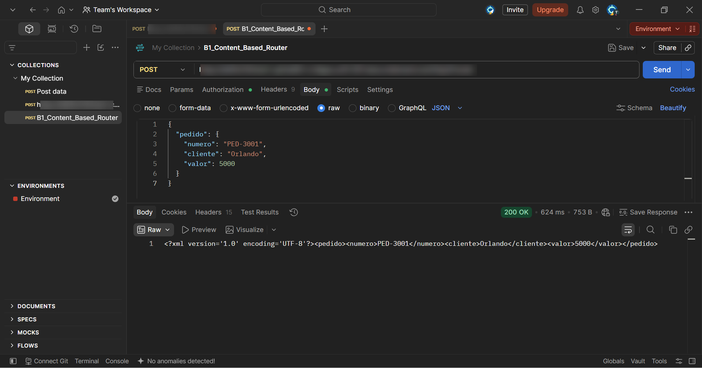

**4. Trace — entrada (alto valor)**
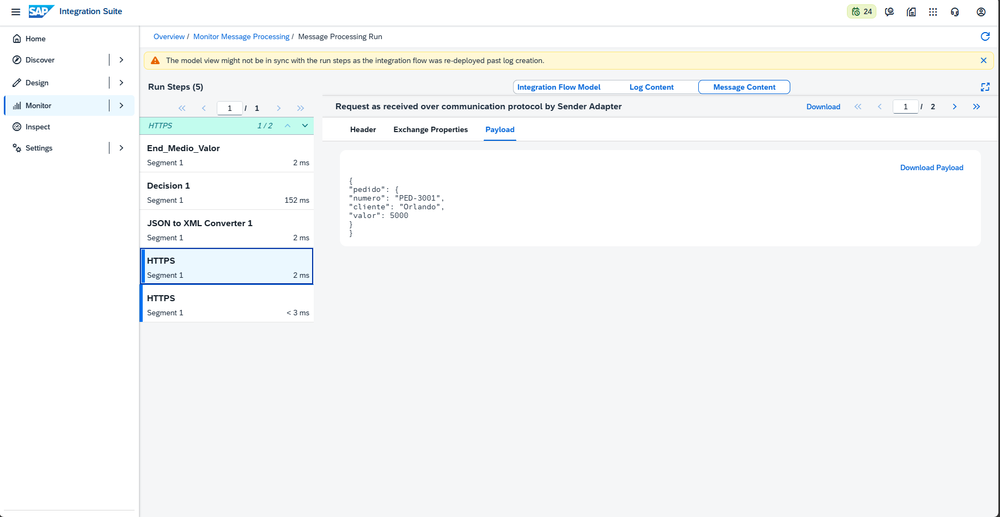

**5. End — End_Alto_Valor**
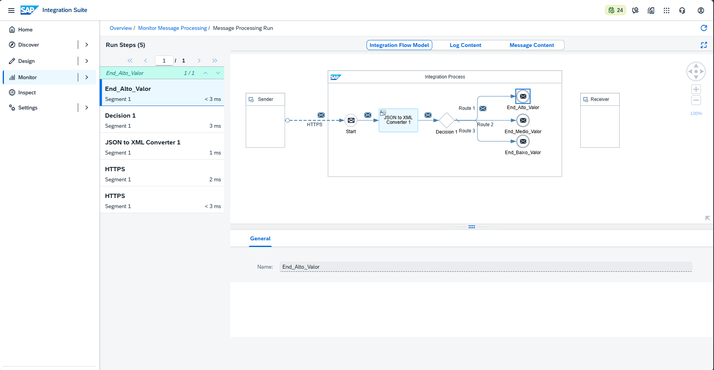

---

### 🔶 Fluxo MÉDIO VALOR (valor 2000)

**6. Postman — envio (médio valor)**
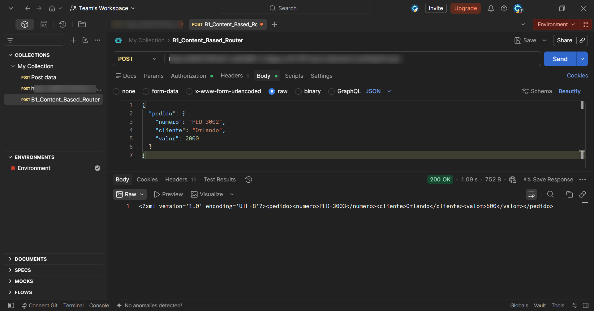

**7. Trace — entrada (médio valor)**
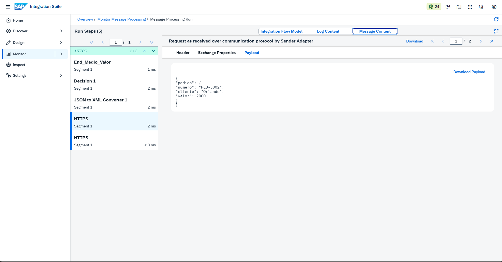

**8. End — End_Medio_Valor**
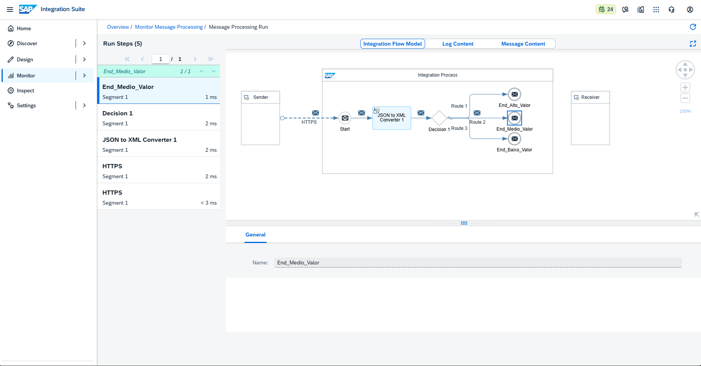

---

### 🔵 Fluxo BAIXO VALOR (valor 500)

**9. Postman — envio (baixo valor)**


**10. Trace — entrada (baixo valor)**
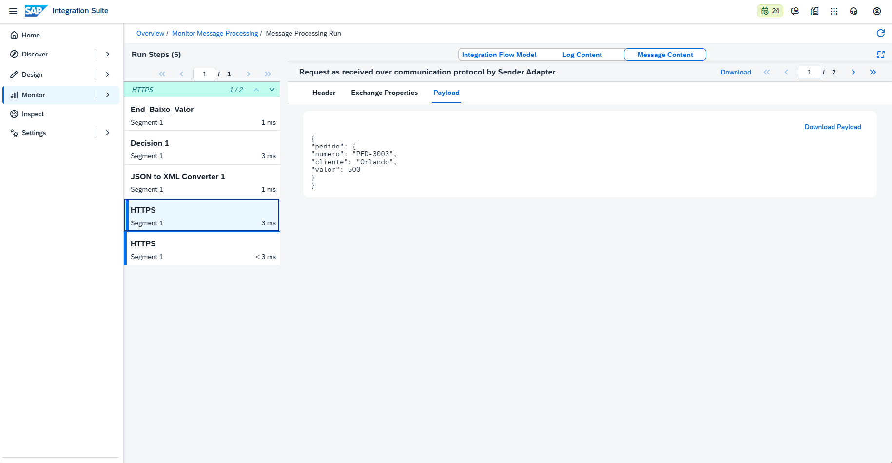

**11. End — End_Baixo_Valor**
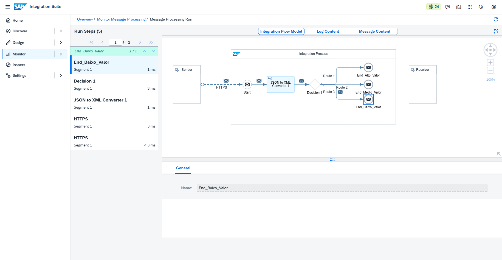

---

## ✅ Conclusão

O cenário B1 introduziu o padrão **Content-Based Router**, permitindo que uma mesma integração direcione mensagens para destinos diferentes conforme o conteúdo. Foram testadas três faixas de valor (alto, médio e baixo), cada uma comprovadamente roteada ao seu End correto. O troubleshooting reforçou dois conceitos essenciais de qualquer integrador: a exigência de **raiz única** no JSON to XML e o cuidado com **condições sobrepostas** em roteamentos — resolvido com faixas mutuamente exclusivas.

**Recursos praticados:** Content-Based Router · Roteamento por XPath · Default Route · JSON to XML Converter · Múltiplos End Events · Monitoring/Trace

**Bloco anterior:** [A4 — Groovy Script](./06-a4-groovy-script.md)
**Próximo cenário:** [B2 — Content Enricher](./08-b2-content-enricher.md)
