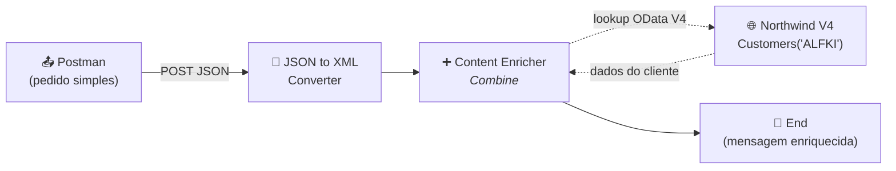
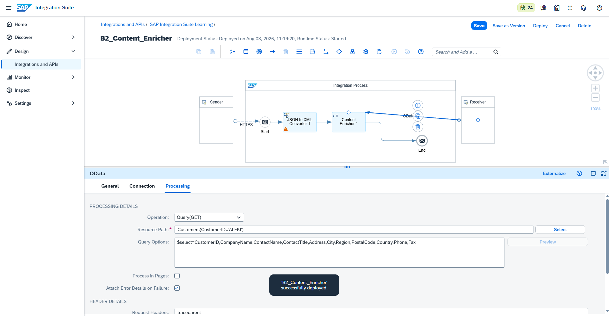
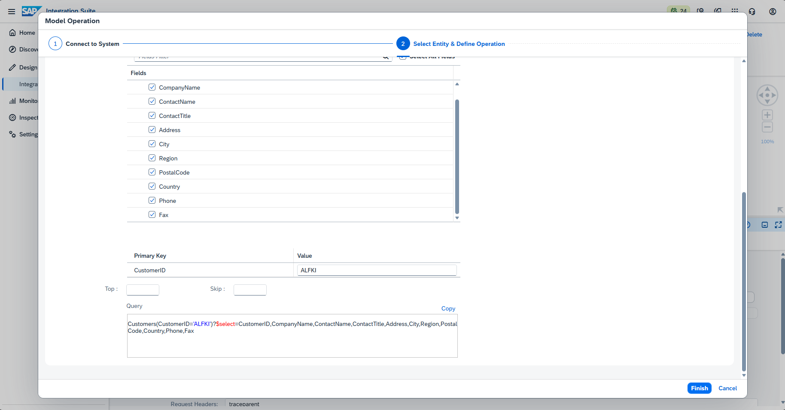
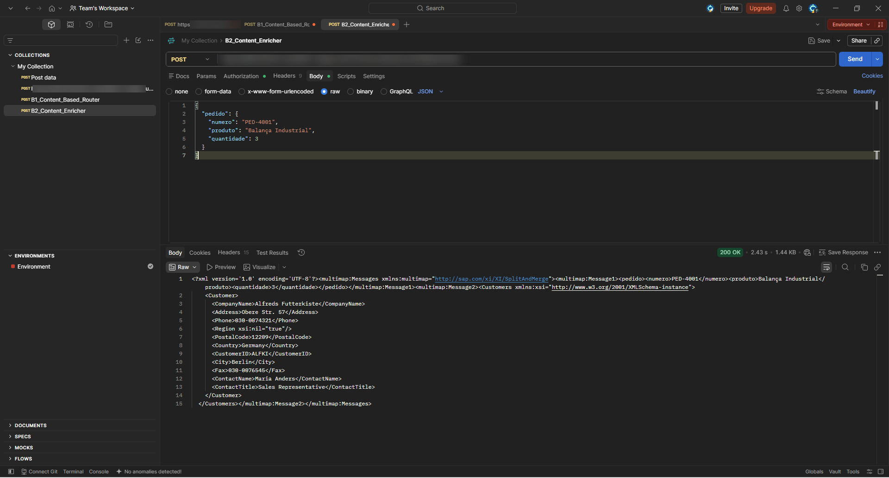
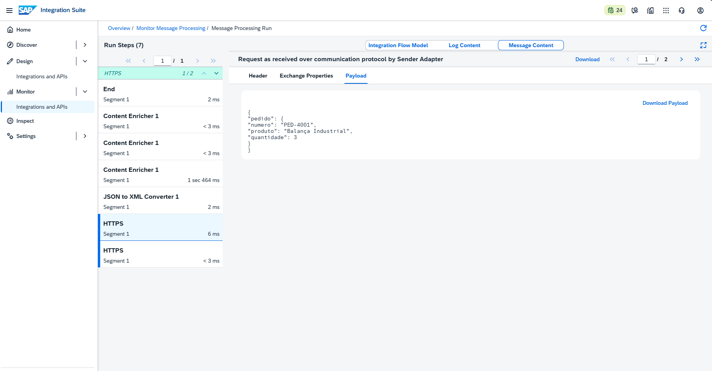
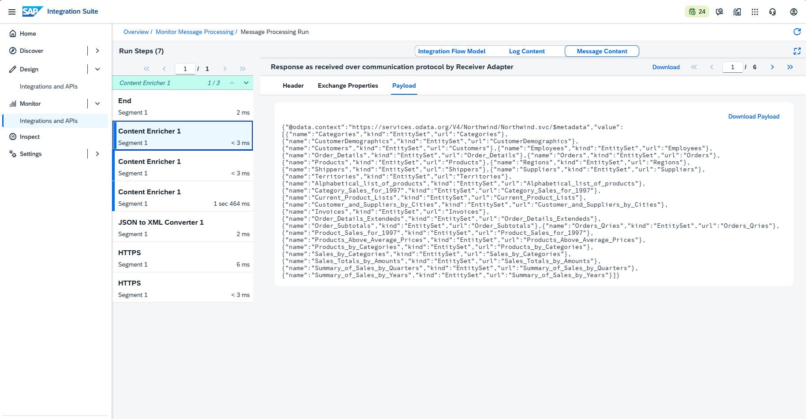
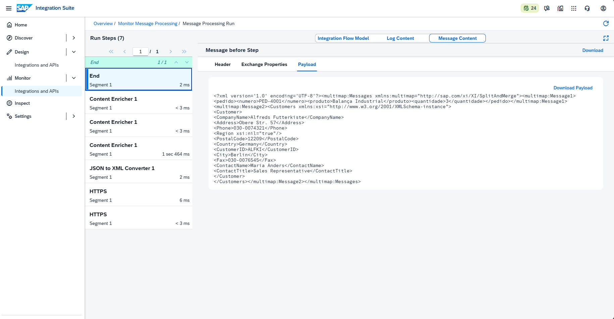

# 🧪 LAB06 — B2: Content Enricher (enriquecimento via lookup OData)

> **Bloco B — Padrões de Integração** | Camada 1 (trilha oficial) 🥇
> Segundo cenário do Bloco B: completar uma mensagem "incompleta" buscando dados adicionais em uma fonte externa, aplicando o padrão **Content Enricher**.

---

## 🎯 Objetivo

No B1 a mensagem escolhia um caminho (Router). No B2 a mensagem **busca dados que faltam** em outra fonte e se completa. É um dos padrões mais comuns em integrações reais: receber um pedido "magro" e enriquecê-lo com dados de cadastro (cliente, produto, preço, etc.).

Os objetivos são:

- Aplicar o **Enterprise Integration Pattern** de enriquecimento de conteúdo
- Realizar um **lookup síncrono** a uma fonte externa (OData V4)
- **Combinar** a mensagem original com os dados buscados
- Compreender as **restrições de adapter** do Content Enricher

---

## 🏗️ Arquitetura



| Componente | Papel |
|---|---|
| **HTTPS Sender** | Recebe o pedido em JSON (endpoint `/b2enricher`) |
| **JSON to XML Converter** | Converte para XML (o Enricher trabalha com XML) |
| **Content Enricher** | Faz o lookup e combina as duas mensagens |
| **OData V4 Receiver** | Adapter que busca os dados na Northwind |
| **Northwind V4** | Fonte externa com os dados do cliente |

---

## 🔧 Como o Content Enricher funciona

O Content Enricher lê dados **sincronamente** de um sistema externo e os **anexa** à mensagem original antes de seguir o fluxo. Ele oferece duas estratégias de agregação:

| Estratégia | Comportamento |
|---|---|
| **Combine** | Junta as duas mensagens em `multimap:Messages` (Message1 = original, Message2 = lookup). Sem regras. |
| **Enrich** | Mescla por chave (Path to Node + Key Element) — mais controle. |

Neste laboratório usamos **Combine** (mais direto para demonstrar o padrão).

---

## 🧩 Entrada vs. Saída

### Entrada — pedido simples (Postman)
```json
{
  "pedido": {
    "numero": "PED-4001",
    "produto": "Balança Industrial",
    "quantidade": 3
  }
}
```

### Saída — mensagem enriquecida (multimap:Messages)
```xml
<multimap:Messages xmlns:multimap="http://sap.com/xi/XI/SplitAndMerge">
  <multimap:Message1>
    <pedido>
      <numero>PED-4001</numero>
      <produto>Balança Industrial</produto>
      <quantidade>3</quantidade>
    </pedido>
  </multimap:Message1>
  <multimap:Message2>
    <Customers>
      <Customer>
        <CustomerID>ALFKI</CustomerID>
        <CompanyName>Alfreds Futterkiste</CompanyName>
        <ContactName>Maria Anders</ContactName>
        <ContactTitle>Sales Representative</ContactTitle>
        <Address>Obere Str. 57</Address>
        <City>Berlin</City>
        <Country>Germany</Country>
        <Phone>030-0074321</Phone>
      </Customer>
    </Customers>
  </multimap:Message2>
</multimap:Messages>
```

> 💡 A mensagem entrou com 3 campos e saiu com os dados completos do cliente **Alfreds Futterkiste** (Berlim, Alemanha) buscados na Northwind — o enriquecimento em ação.

---

## ⚙️ Passo a passo da construção

### 1. Criação do iFlow
- Integration Flow: `B2_Content_Enricher`
- Sender HTTPS → Address `/b2enricher` → **CSRF Protected desmarcado**

### 2. JSON to XML Converter
- Adicionado após o Start (Enricher trabalha com XML)
- **Add XML Root Element** e **Use Namespace Mapping** desmarcados

### 3. Content Enricher
- Adicionado após o conversor, conectado ao End
- Aba **Processing** → Aggregation Algorithm: **Combine**

### 4. Lookup OData V4 (Receiver)
- Conexão do Enricher ao Receiver com adapter **OData V4**
- **Address:** `https://services.odata.org/V4/Northwind/Northwind.svc`
- **Operation:** Query(GET)
- **Resource Path:** `Customers(CustomerID='ALFKI')`
- **Query Options:** `$select=CustomerID,CompanyName,ContactName,ContactTitle,Address,City,Region,PostalCode,Country,Phone,Fax`

### 5. Save + Deploy
- Deploy realizado, Runtime Status **Started**

---

## 🐛 Troubleshooting (erros reais enfrentados e resolvidos)

### ❌ Erro 1 — Conexão do Enricher ao Receiver "não conectava"
- **Sintoma:** ao arrastar do Content Enricher ao Receiver, a linha não fixava; só aceitava o sentido reverso.
- **Causa:** particularidade da interface do CPI Web para o message flow de lookup. A conexão deve fixar com o alvo destacado; o adapter resultante fica com **Direction: Receiver** e **System: Content Enricher**.
- **Solução:** desenhar a conexão com o Receiver destacado (ou aproximar os elementos). A validação foi confirmada pela direção correta no adapter.

### ❌ Erro 2 — "Content Enricher supports SuccessFactors, Soap1.x, and OData adapter types"
- **Sintoma:** com o adapter **HTTP**, o Content Enricher exibia erro (X vermelho).
- **Causa:** o Content Enricher **não suporta o adapter HTTP**. Ele aceita apenas **OData, SOAP 1.x e SuccessFactors**.
- **Solução:** substituir o HTTP por **OData V4**, usando a Northwind pública como fonte de lookup.

> 📚 **Lições-chave (caem em prova):**
> 1. O **Content Enricher** só funciona com adapters **OData, SOAP 1.x e SuccessFactors** — **não** com HTTP. Para lookup via HTTP simples, usa-se **Request Reply**.
> 2. A estratégia **Combine** gera a estrutura `multimap:Messages` (Message1 = original, Message2 = lookup).
> 3. **OData V4** é a versão mais recente (padrão OASIS/ISO); a Northwind está disponível em V2 e V4.

---

## 📸 Evidências

### 1. iFlow com Content Enricher e lookup OData
Fluxo `HTTPS → JSON to XML → Content Enricher → End`, com o lookup OData V4 ao Receiver. Deployado e **Started**.


### 2. Model Operation OData (Customers / ALFKI)
Assistente do adapter OData V4 conectado à Northwind, com a entidade Customers e a chave ALFKI selecionadas.


### 3. Postman — envio e `200 OK`
Envio do pedido simples e retorno com a mensagem enriquecida.


### 4. Trace — entrada (HTTPS): pedido simples
Payload como recebido pelo Sender, antes do enriquecimento.


### 5. Trace — conversão JSON → XML
Payload após o JSON to XML Converter (estrutura em XML, pronta para o Enricher).


### 6. Resultado enriquecido — multimap:Messages (XML)
Saída final combinando o pedido (Message1) com os dados do cliente buscados na Northwind (Message2).


---

## ✅ Conclusão

O cenário B2 aplicou o padrão **Content Enricher**, realizando um **lookup síncrono** em uma fonte OData V4 (Northwind) e **combinando** os dados retornados com a mensagem original. A partir de um pedido com apenas três campos, o iFlow produziu uma mensagem enriquecida com os dados completos do cliente. O troubleshooting evidenciou uma restrição importante e frequentemente cobrada: o Content Enricher **não** opera com adapter HTTP, exigindo OData, SOAP 1.x ou SuccessFactors.

**Recursos praticados:** Content Enricher · Aggregation Combine · Adapter OData V4 · Model Operation · Lookup síncrono · JSON to XML Converter · multimap:Messages · Monitoring/Trace

**Cenário anterior:** [B1 — Content-Based Router](./07-b1-content-based-router.md)

**Próximo cenário:** [B3 — Splitter](./09-b3-splitter.md)
