# 🧪 LAB07 — B3: Splitter

> **Bloco B — Padrões de Integração** | Camada 1 (trilha oficial) 🥇
> Terceiro cenário do Bloco B: dividir uma única mensagem contendo um lote de itens em várias mensagens individuais, aplicando o padrão **Splitter**.

---

## 🎯 Objetivo

No B1 a mensagem escolhia um caminho e no B2 buscava dados. No B3 **uma mensagem vira várias**: um pedido com múltiplos itens é dividido em mensagens independentes — uma por item. É um padrão essencial para processar em lote (linhas de pedido, registros de arquivo, notas de um lote, etc.).

Os objetivos são:

- Aplicar o **Enterprise Integration Pattern** de divisão de mensagens
- Usar o **General Splitter** com expressão **XPath**
- Gerar uma mensagem individual por item, preservando o contexto do pedido
- Comprovar a divisão no monitoramento e no destino

---

## 🏗️ Arquitetura

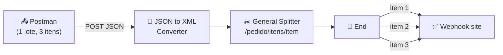

| Componente | Papel |
|---|---|
| **HTTPS Sender** | Recebe o lote em JSON (endpoint `/b3splitter`) |
| **JSON to XML Converter** | Converte para XML (o Splitter divide via XPath) |
| **General Splitter** | Divide o lote em mensagens individuais |
| **HTTP Receiver** | Envia cada item separadamente ao destino |
| **Webhook.site** | Recebe uma requisição por item |

---

## ⚙️ Configuração do General Splitter

| Parâmetro | Valor |
|---|---|
| **Expression Type** | XPath |
| **XPath Expression** | `/pedido/itens/item` |
| **Grouping** | `1` (um item por mensagem) |
| **Streaming** | Habilitado |
| **Parallel Processing** | Desabilitado (mantém a ordem) |
| **Stop on Exception** | Habilitado |

> 💡 A expressão `/pedido/itens/item` define o **ponto de corte**: cada elemento `<item>` vira uma mensagem separada. Com `Grouping = 1`, um lote de 3 itens gera 3 mensagens.

---

## 🧩 Entrada vs. Saída

### Entrada — 1 lote com 3 itens (Postman)
```json
{
  "pedido": {
    "numero": "PED-5001",
    "itens": {
      "item": [
        { "produto": "Balança Industrial", "quantidade": 2 },
        { "produto": "Etiqueta Térmica", "quantidade": 100 },
        { "produto": "Impressora Zebra", "quantidade": 5 }
      ]
    }
  }
}
```

### Saída — 3 mensagens individuais (Webhook.site)
```xml
<!-- Item 1 -->
<pedido><numero>PED-5001</numero><itens><item>
  <produto>Balança Industrial</produto><quantidade>2</quantidade>
</item></itens></pedido>

<!-- Item 2 -->
<pedido><numero>PED-5001</numero><itens><item>
  <produto>Etiqueta Térmica</produto><quantidade>100</quantidade>
</item></itens></pedido>

<!-- Item 3 -->
<pedido><numero>PED-5001</numero><itens><item>
  <produto>Impressora Zebra</produto><quantidade>5</quantidade>
</item></itens></pedido>
```

> 💡 Cada mensagem mantém o envelope `<pedido><numero>PED-5001</numero>` — o **General Splitter preserva o contexto** do pedido em cada fatia.

---

## ⚙️ Passo a passo da construção

### 1. Criação do iFlow
- Integration Flow: `B3_Splitter`
- Sender HTTPS → Address `/b3splitter` → **CSRF Protected desmarcado**

### 2. JSON to XML Converter
- Adicionado após o Start (Splitter divide XML)
- **Add XML Root Element** e **Use Namespace Mapping** desmarcados

### 3. General Splitter
- Adicionado após o conversor
- XPath `/pedido/itens/item`, Grouping `1`

### 4. Receiver HTTP
- Address: URL do Webhook.site | Method: POST

### 5. Save + Deploy
- Deploy realizado, Runtime Status **Started**

---

## 🐛 Troubleshooting / Observações

### 💡 "No Monitor apareceram 2 mensagens, mas no Webhook chegaram 6"
- **Observação:** ao testar, o Monitor mostrava execuções do iFlow, enquanto o Webhook mostrava mais requisições.
- **Explicação:** cada **execução do iFlow** (1 lote) gera **N requisições ao destino** (1 por item). Ao enviar o teste 2 vezes, o resultado foi `2 execuções × 3 itens = 6 requisições` no Webhook. Não é erro — é o Splitter operando: 1 mensagem de entrada → várias mensagens de saída.

> 📚 **Lições-chave:**
> 1. O **General Splitter** divide via **XPath** e o **Grouping** controla quantos itens por mensagem.
> 2. A contagem no destino = (execuções) × (itens por lote).
> 3. O General Splitter **preserva o contexto** do elemento pai em cada mensagem gerada.

---

## 📸 Evidências

### 1. iFlow com o General Splitter (fluxo + configuração)
Fluxo `HTTPS → JSON to XML → General Splitter → End`, com a expressão XPath configurada. Deployado e **Started**.
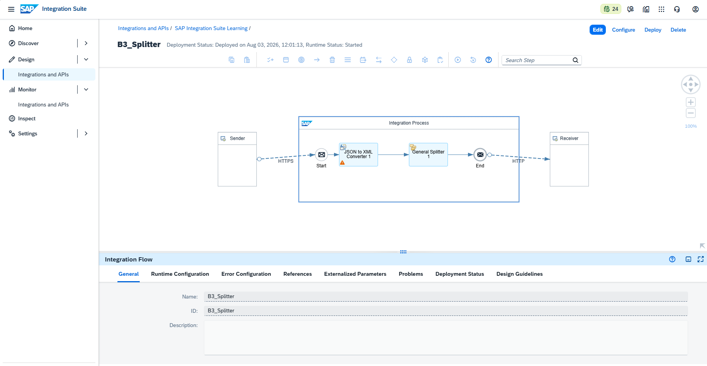

### 2. Postman — envio do lote (3 itens)
Envio do pedido com os três itens e retorno `200 OK`.
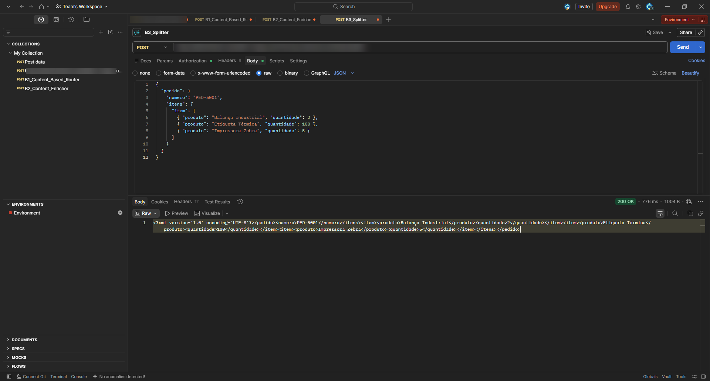

### 3. Trace — entrada (HTTPS): lote com 3 itens
Payload como recebido pelo Sender, antes da divisão.
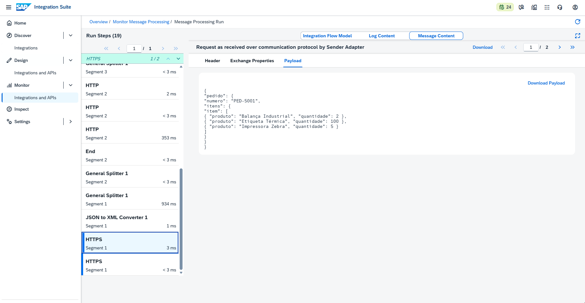

### 4. Trace — conversão JSON → XML
Payload após o JSON to XML Converter, pronto para o Splitter.
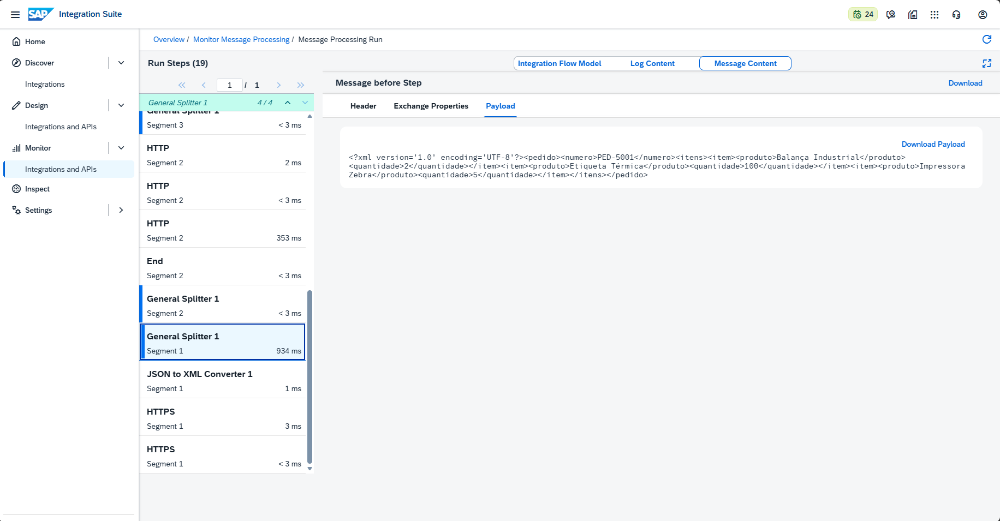

---

### 📦 Item 1 — Balança Industrial (quantidade 2)

**5. End / HTTP — envio do item 1**
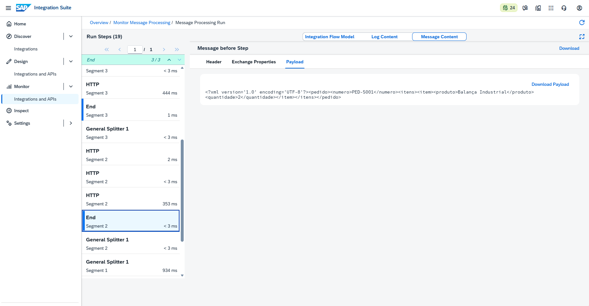

**6. Webhook.site — item 1 recebido**
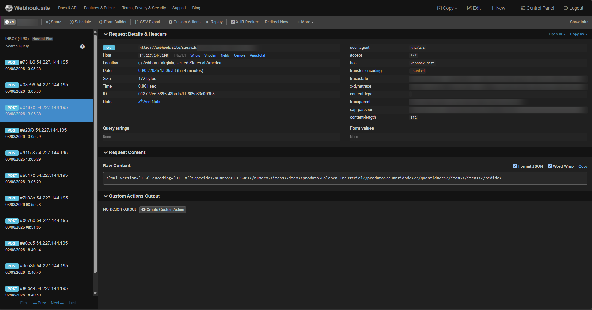

---

### 📦 Item 2 — Etiqueta Térmica (quantidade 100)

**7. End / HTTP — envio do item 2**
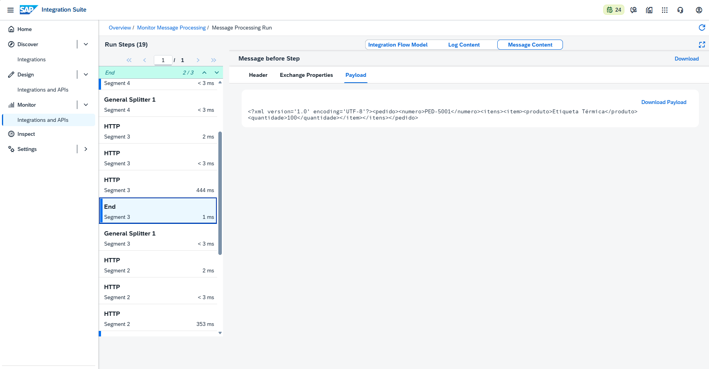

**8. Webhook.site — item 2 recebido**
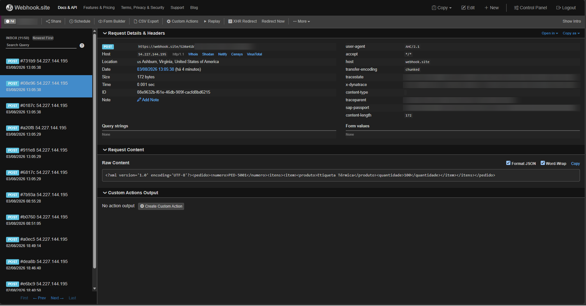

---

### 📦 Item 3 — Impressora Zebra (quantidade 5)

**9. End / HTTP — envio do item 3**
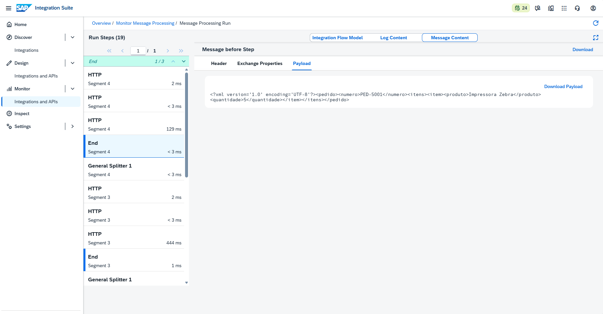

**10. Webhook.site — item 3 recebido**
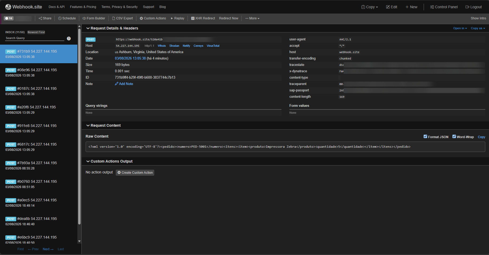

---

## ✅ Conclusão

O cenário B3 aplicou o padrão **Splitter**, dividindo um único pedido com três itens em três mensagens individuais, cada uma entregue separadamente ao destino e preservando o contexto do pedido (`PED-5001`). O comportamento foi comprovado de ponta a ponta: entrada única no Trace, divisão pelo General Splitter e três requisições distintas no Webhook.site. A observação sobre a contagem (execuções × itens) reforçou o entendimento de como o Splitter transforma uma mensagem em várias.

**Recursos praticados:** General Splitter · Divisão por XPath · Grouping · JSON to XML Converter · Monitoring/Trace · Múltiplas entregas ao destino

**Cenário anterior:** [B2 — Content Enricher](./08-b2-content-enricher.md)

**Próximo cenário:** [B4 — Aggregator](./10-b4-aggregator.md)
