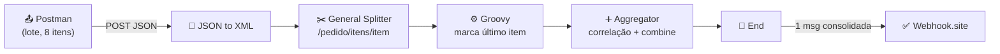
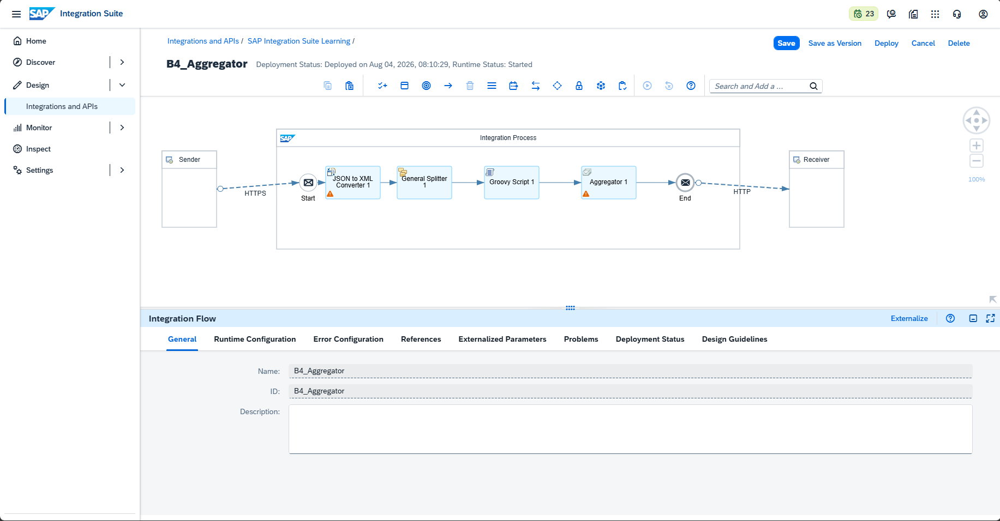
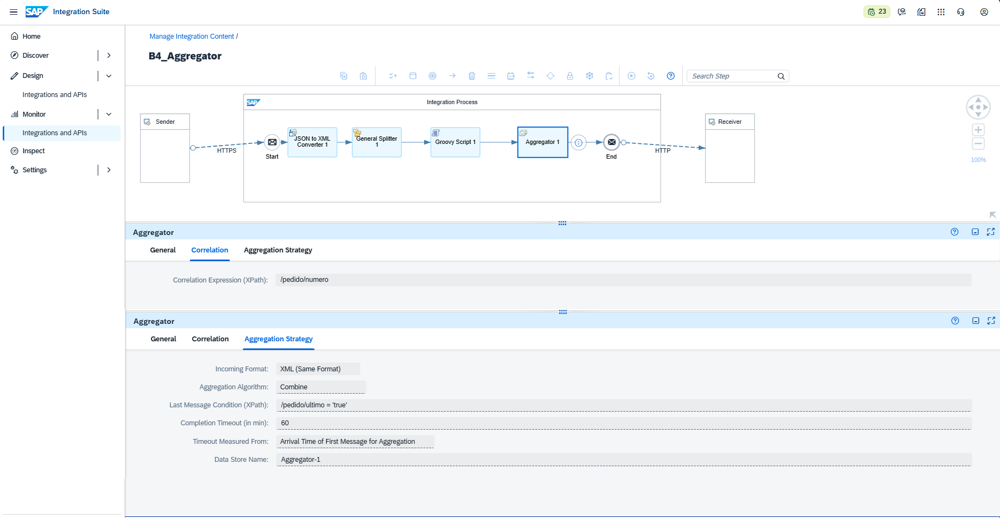
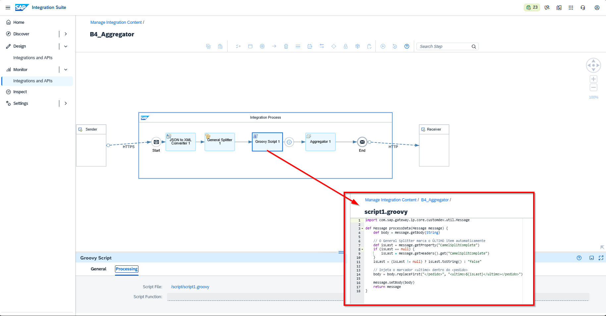
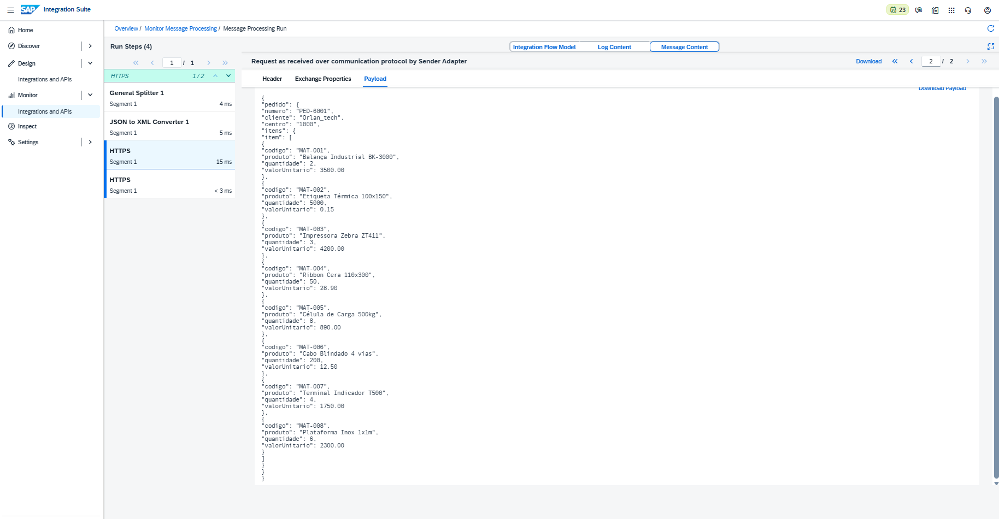
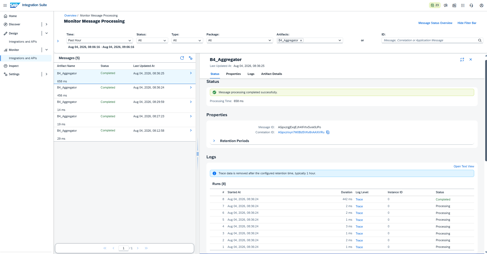
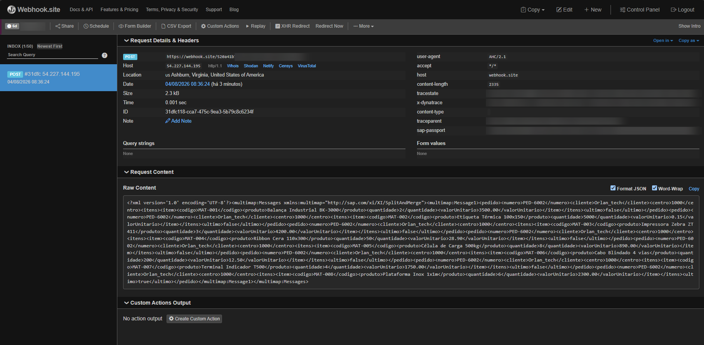

# 🧪 LAB08 — B4: Aggregator

> **Bloco B — Padrões de Integração** | Camada 1 (trilha oficial) 🥇
> Quarto cenário do Bloco B: reunir várias mensagens individuais em uma única mensagem consolidada, aplicando o padrão **Aggregator** — o complemento do Splitter.

---

## 🎯 Objetivo

Se o Splitter (B3) divide **uma** mensagem em **várias**, o Aggregator faz o **oposto**: reúne **várias** mensagens em **uma**. Combinados, formam o padrão **Composed Message Processor** — dividir para processar item a item e depois consolidar o resultado.

Os objetivos são:

- Aplicar o **Enterprise Integration Pattern** de agregação de mensagens
- Combinar **Splitter + Aggregator** num único fluxo
- Detectar dinamicamente a **última mensagem** (sem depender da quantidade)
- Correlacionar mensagens do mesmo grupo e consolidá-las

---

## 🏗️ Arquitetura



| Componente | Papel |
|---|---|
| **HTTPS Sender** | Recebe o lote em JSON (endpoint `/b4aggregator`) |
| **JSON to XML Converter** | Converte para XML (Splitter e Aggregator usam XPath) |
| **General Splitter** | Divide o lote em itens individuais |
| **Groovy Script** | Injeta o marcador do último item (`CamelSplitComplete`) |
| **Aggregator** | Correlaciona e consolida os itens em uma mensagem |
| **HTTP Receiver** | Envia a mensagem consolidada ao destino |

---

## ⚙️ Configuração do Aggregator

| Parâmetro | Valor |
|---|---|
| **Incoming Format** | XML (Same Format) |
| **Correlation Expression (XPath)** | `/pedido/numero` |
| **Aggregation Algorithm** | Combine |
| **Last Message Condition (XPath)** | `/pedido/ultimo = 'true'` |
| **Completion Timeout** | 60 (rede de segurança) |
| **Data Store Name** | Aggregator-1 |

> ⚠️ **Requisito obrigatório:** o iFlow precisa de **Transaction Handling: Required for JDBC** (Runtime Configuration do Integration Process), pois o Aggregator persiste mensagens temporariamente no Data Store.

---

## 🧠 A detecção dinâmica do último item (CamelSplitComplete)

O ponto mais importante do cenário: **como o Aggregator sabe que chegou o último item, sem saber quantos são nem qual o código do último?**

O **General Splitter marca automaticamente** a última mensagem dividida com a propriedade `CamelSplitComplete = true`. Um pequeno **Groovy** lê essa propriedade e injeta um marcador `<ultimo>` no XML, que o Aggregator usa na Last Message Condition.

### Groovy — marcador do último item
```groovy
import com.sap.gateway.ip.core.customdev.util.Message

def Message processData(Message message) {
    def body = message.getBody(String)

    // O General Splitter marca o ÚLTIMO item automaticamente
    def isLast = message.getProperty("CamelSplitComplete")
    if (isLast == null) {
        isLast = message.getHeaders().get("CamelSplitComplete")
    }
    isLast = (isLast != null) ? isLast.toString() : "false"

    // Injeta o marcador <ultimo> dentro do <pedido>
    body = body.replaceFirst("</pedido>", "<ultimo>${isLast}</ultimo></pedido>")

    message.setBody(body)
    return message
}
```

> 💡 **Por que isso é robusto:** funciona com **qualquer quantidade** de itens (8, 50 ou 1000), sem depender de índice de posição ou do código do último material. É a abordagem correta para cenários reais, onde não se sabe o tamanho do lote de antemão.

---

## 🧩 Entrada vs. Saída

### Entrada — lote com 8 itens (cliente Orlan_tech)
```json
{
  "pedido": {
    "numero": "PED-6002",
    "cliente": "Orlan_tech",
    "centro": "1000",
    "itens": {
      "item": [
        { "codigo": "MAT-001", "produto": "Balança Industrial BK-3000", "quantidade": 2, "valorUnitario": 3500.00 },
        { "codigo": "MAT-002", "produto": "Etiqueta Térmica 100x150", "quantidade": 5000, "valorUnitario": 0.15 },
        { "codigo": "MAT-003", "produto": "Impressora Zebra ZT411", "quantidade": 3, "valorUnitario": 4200.00 },
        { "codigo": "MAT-004", "produto": "Ribbon Cera 110x300", "quantidade": 50, "valorUnitario": 28.90 },
        { "codigo": "MAT-005", "produto": "Célula de Carga 500kg", "quantidade": 8, "valorUnitario": 890.00 },
        { "codigo": "MAT-006", "produto": "Cabo Blindado 4 vias", "quantidade": 200, "valorUnitario": 12.50 },
        { "codigo": "MAT-007", "produto": "Terminal Indicador T500", "quantidade": 4, "valorUnitario": 1750.00 },
        { "codigo": "MAT-008", "produto": "Plataforma Inox 1x1m", "quantidade": 6, "valorUnitario": 2300.00 }
      ]
    }
  }
}
```

### Saída — 1 mensagem consolidada (multimap:Messages)
```xml
<multimap:Messages xmlns:multimap="http://sap.com/xi/XI/SplitAndMerge">
  <multimap:Message1>
    <pedido><numero>PED-6002</numero>...MAT-001...<ultimo>false</ultimo></pedido>
    <pedido>...MAT-002...<ultimo>false</ultimo></pedido>
    ...
    <pedido>...MAT-008...<ultimo>true</ultimo></pedido>
  </multimap:Message1>
</multimap:Messages>
```

> 💡 Os 8 itens divididos pelo Splitter foram reunidos em **uma única mensagem**. Note o `<ultimo>true</ultimo>` apenas no MAT-008 — o marcador que fechou o grupo.

---

## ⚙️ Passo a passo da construção

1. **iFlow** `B4_Aggregator` — Sender HTTPS `/b4aggregator`, CSRF desmarcado
2. **JSON to XML Converter** — Add XML Root Element e Namespace **desmarcados**
3. **General Splitter** — XPath `/pedido/itens/item`, Grouping 1
4. **Groovy Script** — injeta `<ultimo>` via `CamelSplitComplete`
5. **Aggregator** — correlação `/pedido/numero`, Last Message `/pedido/ultimo = 'true'`, Combine
6. **Transaction Handling: Required for JDBC** (Runtime Configuration)
7. **Receiver HTTP** — URL do Webhook.site, POST
8. **Save + Deploy** — Runtime Status **Started**

---

## 🐛 Troubleshooting (erros reais enfrentados e resolvidos)

### ❌ Erro 1 — "The process requires a transaction because aggregator is used"
- **Causa:** o Aggregator persiste mensagens no Data Store e exige controle transacional.
- **Solução:** definir **Transaction Handling: Required for JDBC** na Runtime Configuration do Integration Process.

### ❌ Erro 2 — Aggregator preso em "Processing" (nunca fechava)
- **Sintoma:** a mensagem não era entregue; as execuções ficavam em Processing.
- **Causa:** a Last Message Condition usava índice de posição (`/pedido/itens/item[8]`), que **não existe** em cada mensagem já dividida (cada uma tem só 1 item).
- **Solução:** detectar o último item dinamicamente com **`CamelSplitComplete`** (via Groovy) e usar `/pedido/ultimo = 'true'` como condição.

### ❌ Erro 3 — Nada chegava ao destino (após deploy)
- **Sintoma:** 200 OK no Postman, mas nada no Webhook; a resposta trazia `<root>`.
- **Causa:** o **"Add XML Root Element"** do conversor inseria um `<root>`, alterando os XPaths (`/pedido/...` virava `/root/pedido/...`), quebrando Splitter e Aggregator.
- **Solução:** desmarcar **Add XML Root Element** no JSON to XML Converter.

### 💡 Observação — correlação e testes repetidos
- Como a correlação é `/pedido/numero`, reenviar testes com o **mesmo número** acumula execuções no mesmo grupo. Em produção, cada pedido tem número único; em testes, variar o número (PED-6002, PED-6003...) garante agregações limpas.

> 📚 **Lições-chave (caem em prova):**
> 1. **Aggregator exige Transaction Handling: Required for JDBC.**
> 2. A **última mensagem** de um Splitter é identificada por **`CamelSplitComplete`** — robusto e agnóstico de quantidade.
> 3. **Add XML Root Element** altera todos os XPaths do fluxo — mantenha desmarcado ao usar XPath.

---

## 📸 Evidências

### 1. iFlow completo (Splitter + Groovy + Aggregator)
Fluxo `HTTPS → JSON to XML → Splitter → Groovy → Aggregator → End`, deployado e **Started**.


### 2. Configuração do Aggregator (correlação + last message)
Aba de configuração com a correlação `/pedido/numero` e a Last Message Condition.


### 3. Groovy — detecção do último item (CamelSplitComplete)
Script que injeta o marcador `<ultimo>` no XML.


### 4. Monitor — log de chegada (Processing)
Registro da chegada da mensagem no Monitor Message Processing.


### 5. Postman — envio do lote (itens 1–4)
Envio do pedido com os 8 itens (parte 1) e retorno `200 OK`.


### 6. Postman — envio do lote (itens 5–8) e resposta
Continuação do lote e resposta em XML (sem `<root>`).


### 7. Monitor — Runs do Aggregator
Os itens ficam em **Processing** aguardando; ao chegar o último, o grupo é **Completed**.


### 8. Webhook.site — mensagem consolidada (multimap:Messages)
Uma única mensagem com os 8 itens agregados; `<ultimo>true</ultimo>` apenas no MAT-008.


---

## ✅ Conclusão

O cenário B4 aplicou o padrão **Aggregator** em conjunto com o **Splitter**, formando o **Composed Message Processor**: um lote de 8 itens foi dividido, processado item a item e reunido em uma única mensagem consolidada. O destaque foi a **detecção dinâmica do último item** via `CamelSplitComplete`, tornando a solução independente da quantidade de itens — uma abordagem de nível arquitetural. Os três troubleshootings (transação, condição de conclusão e root element) consolidaram conceitos fundamentais e frequentemente cobrados na certificação.

**Recursos praticados:** Aggregator · General Splitter · Groovy (CamelSplitComplete) · Correlação · Aggregation Combine · Transaction Handling (Required for JDBC) · Data Store · Monitoring/Trace

**Cenário anterior:** [B3 — Splitter](./09-b3-splitter.md)

**Próximo cenário:** [B5 — Multicast](./11-b5-multicast.md)
