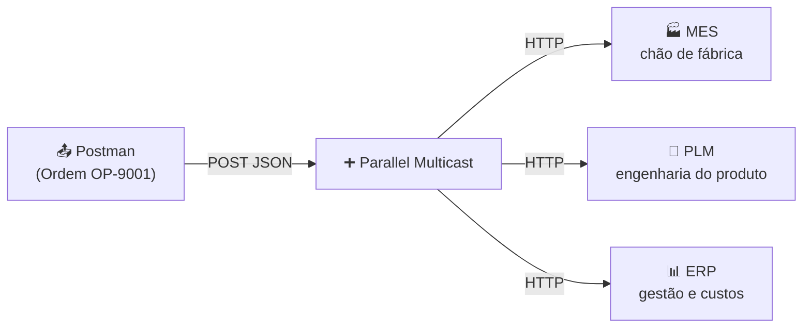
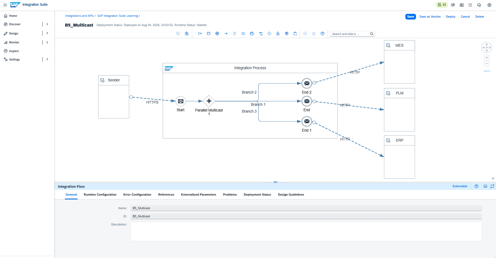
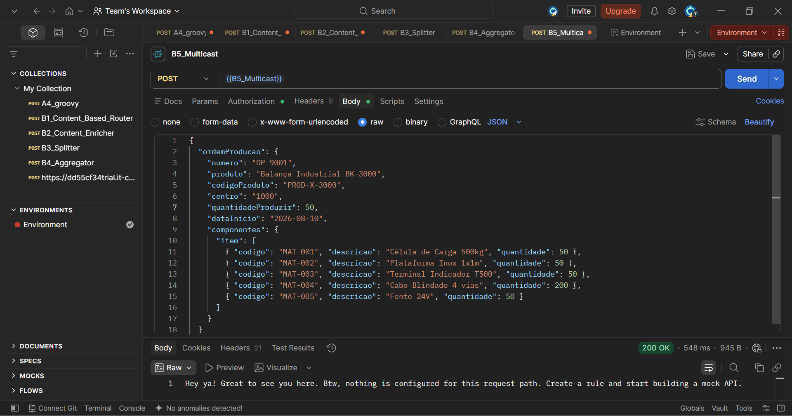
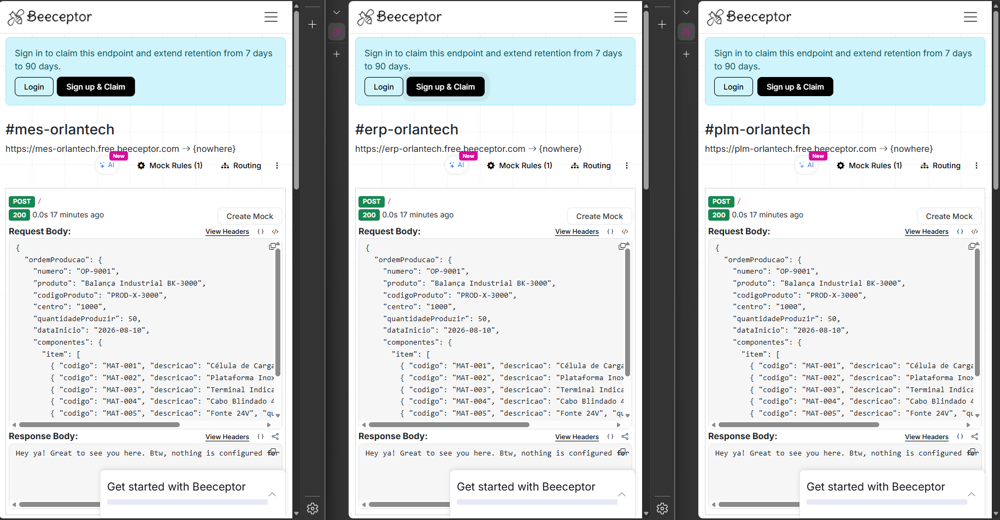
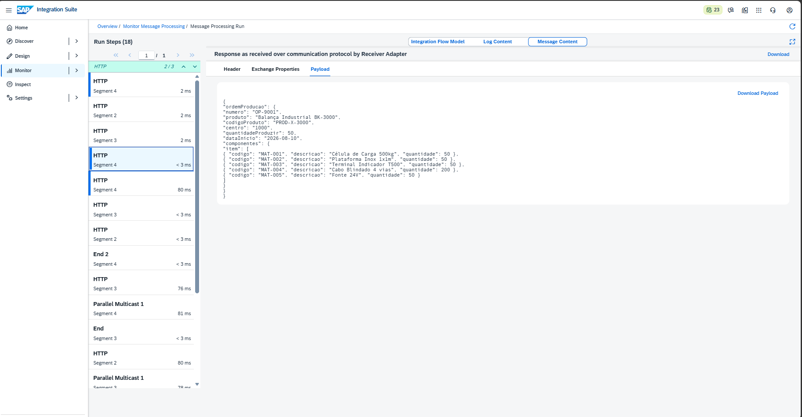

# 🧪 LAB09 — B5: Multicast

> **Bloco B — Padrões de Integração** | Camada 1 (trilha oficial) 🥇
> Quinto e último cenário do Bloco B: distribuir a mesma mensagem para múltiplos destinos simultaneamente, aplicando o padrão **Multicast**.

---

## 🎬 Demonstração

Uma **Ordem de Produção** disparada de uma vez e entregue **simultaneamente** a três sistemas (MES, PLM e ERP):

https://github.com/OrlandoCaetano2026/SAP_Integration_Suite_Learning/raw/main/evidences/lab09/B5_Multicast.mp4

> 💡 Uma única requisição no SAP Integration Suite → três sistemas notificados ao mesmo tempo, em paralelo.
>
> ▶️ Caso o player não carregue, [clique aqui para assistir ao vídeo](../evidences/lab09/B5_Multicast.mp4).

---

## 🎯 Objetivo

Enquanto o Splitter (B3) divide o conteúdo e o Aggregator (B4) reúne mensagens, o **Multicast** faz algo diferente: envia **cópias da mesma mensagem** para **vários destinos ao mesmo tempo**. É o padrão de "notificar todos".

Os objetivos são:

- Aplicar o **Enterprise Integration Pattern** de distribuição de mensagens
- Usar o **Parallel Multicast** para envio simultâneo
- Distribuir uma **Ordem de Produção** para três sistemas distintos
- Simular um cenário industrial real (MES, PLM, ERP)

---

## 🏭 Cenário — Ordem de Produção para 3 sistemas

Quando uma ordem de produção é liberada, diferentes áreas precisam ser notificadas ao mesmo tempo:



| Sistema | Papel no cenário | Endpoint (mock) |
|---|---|---|
| **MES** | Execução da produção no chão de fábrica | `mes-orlantech.free.beeceptor.com` |
| **PLM** | Controle de engenharia e do produto | `plm-orlantech.free.beeceptor.com` |
| **ERP** | Gestão, custos e materiais (SAP) | `erp-orlantech.free.beeceptor.com` |

> 💡 Os três sistemas foram simulados com **Beeceptor** — endpoints mock que inspecionam as requisições recebidas em tempo real, cada um representando um "departamento".

---

## 🔀 Parallel vs. Sequential Multicast

| Tipo | Comportamento |
|---|---|
| **Parallel Multicast** | Envia para todos os destinos **ao mesmo tempo** (usado neste lab) |
| **Sequential Multicast** | Envia **um após o outro**, em ordem definida |

O **Parallel** foi escolhido por representar o conceito puro de distribuição simultânea.

---

## 🧩 Payload — Ordem de Produção (Produto X, 5 componentes)

```json
{
  "ordemProducao": {
    "numero": "OP-9001",
    "produto": "Balança Industrial BK-3000",
    "codigoProduto": "PROD-X-3000",
    "centro": "1000",
    "quantidadeProduzir": 50,
    "dataInicio": "2026-08-10",
    "componentes": {
      "item": [
        { "codigo": "MAT-001", "descricao": "Célula de Carga 500kg", "quantidade": 50 },
        { "codigo": "MAT-002", "descricao": "Plataforma Inox 1x1m", "quantidade": 50 },
        { "codigo": "MAT-003", "descricao": "Terminal Indicador T500", "quantidade": 50 },
        { "codigo": "MAT-004", "descricao": "Cabo Blindado 4 vias", "quantidade": 200 },
        { "codigo": "MAT-005", "descricao": "Fonte 24V", "quantidade": 50 }
      ]
    }
  }
}
```

> 💡 Essa **mesma** ordem completa (com os 5 componentes) é entregue integralmente aos três sistemas — não é dividida, é **replicada**.

---

## ⚙️ Passo a passo da construção

1. **iFlow** `B5_Multicast` — Sender HTTPS `/b5multicast`, CSRF desmarcado
2. **Parallel Multicast** — adicionado após o Start
3. **3 ramificações** (Branches) — uma para cada End Event
4. **3 Receivers** (MES, PLM, ERP) — cada End conectado a um Receiver via adapter **HTTP** (POST, Authentication None)
5. Endereços dos Receivers apontando para os três endpoints Beeceptor
6. **Save + Deploy** — Runtime Status **Started**

---

## 🔐 Boa prática — variável de ambiente no Postman

Para não expor a URL do tenant nas evidências e no vídeo, a requisição usa **variáveis de ambiente** do Postman:

```text
URL:      {{base_url}}/http/b5multicast
Username: {{clientid}}
Password: {{clientsecret}}
```

> 💡 As credenciais e a URL do tenant ficam apenas no **Environment local** (Current Value), nunca versionadas nem visíveis em capturas.

---

## 📚 Conceitos-chave

> 1. O **Parallel Multicast** replica a mesma mensagem para N destinos simultaneamente.
> 2. Cada ramo do Multicast tem seu próprio Receiver/adapter, permitindo destinos diferentes.
> 3. Diferente do Splitter (que fatia o conteúdo), o Multicast **replica a mensagem inteira**.

---

## 📸 Evidências

### 1. iFlow com o Parallel Multicast (3 destinos)
Fluxo `HTTPS → Parallel Multicast → 3 Ends → MES / PLM / ERP`, deployado e **Started**.


### 2. Postman — envio da Ordem de Produção
Envio com `{{base_url}}` (URL protegida por variável) e retorno `200 OK`.


### 3. MES, PLM e ERP — mesma ordem recebida simultaneamente
Os três sistemas exibem a **mesma** ordem `OP-9001` recebida (status 200 em cada um) — a prova do Multicast.


### 4. Monitor — saída HTTP das mensagens
Registro no Monitor Message Processing das mensagens enviadas aos destinos.


---

## ✅ Conclusão

O cenário B5 aplicou o padrão **Multicast**, distribuindo uma mesma Ordem de Produção para três sistemas (MES, PLM e ERP) de forma **simultânea e paralela**. Diferentemente do Splitter (que fatia o conteúdo), o Multicast **replica a mensagem inteira** para múltiplos destinos — um padrão essencial em cenários de notificação e sincronização entre sistemas. O uso de variáveis de ambiente no Postman reforçou boas práticas de segurança, mantendo a URL do tenant e as credenciais fora das evidências.

Com este laboratório, o **Bloco B — Padrões de Integração** é concluído (B1 a B5), cobrindo Router, Content Enricher, Splitter, Aggregator e Multicast.

**Recursos praticados:** Parallel Multicast · Múltiplos Receivers · Adapter HTTP · Endpoints mock (Beeceptor) · Variáveis de ambiente (Postman) · Monitoring

**Cenário anterior:** [B4 — Aggregator](./10-b4-aggregator.md)

**Próximo bloco:** [C1 — Exception Subprocess](./12-c1-exception-subprocess.md) _(Bloco C — Resiliência e Erros)_
