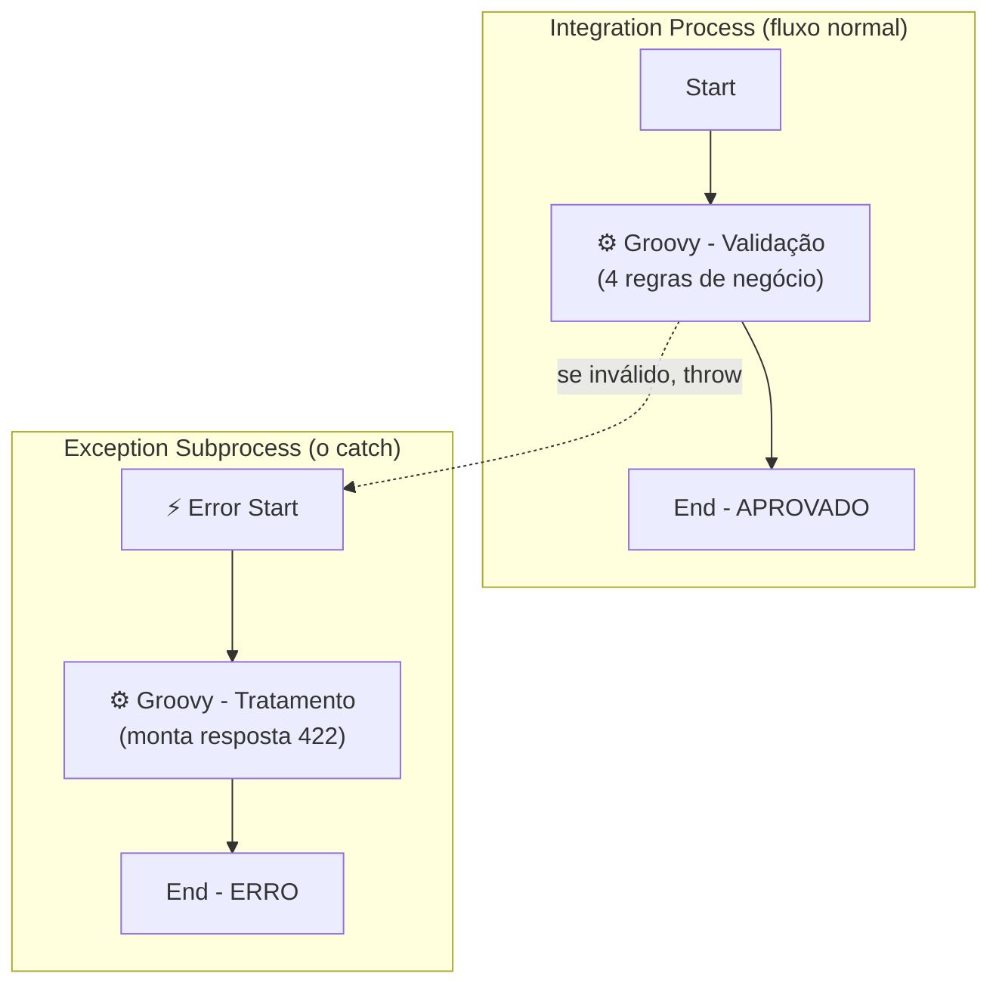
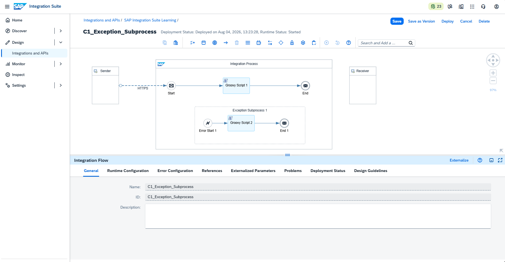
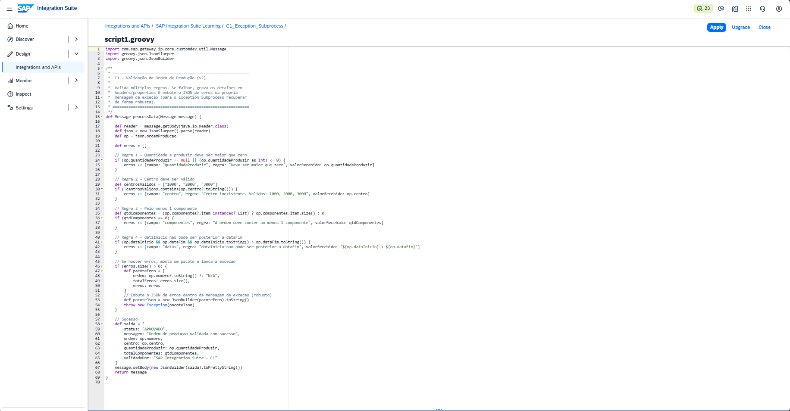
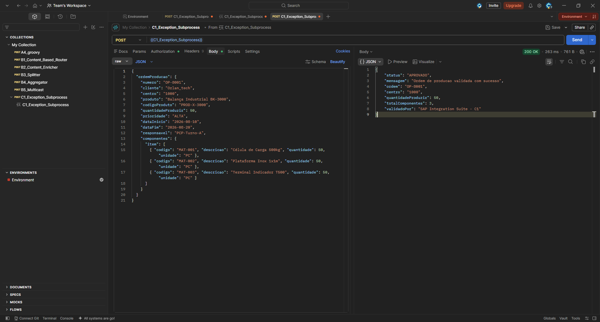
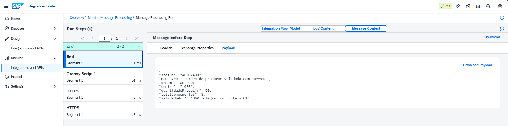
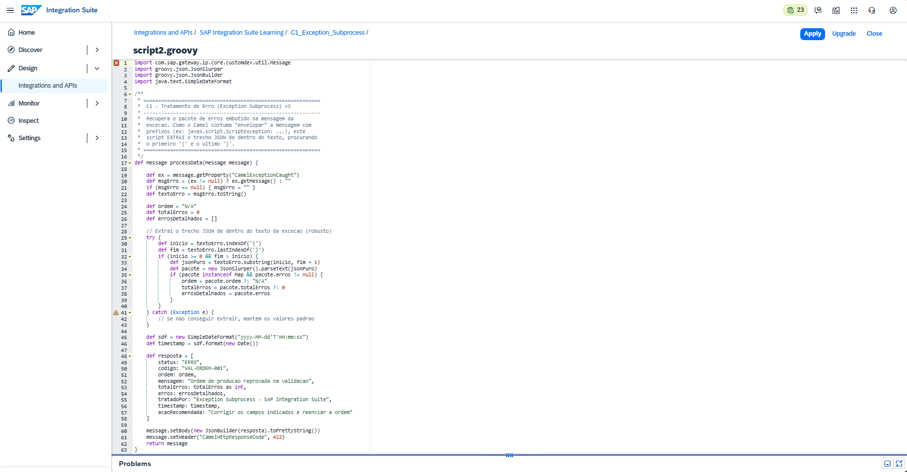
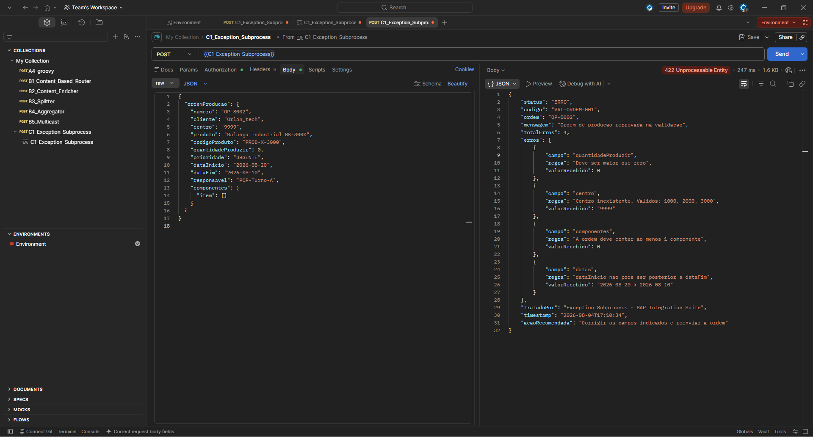
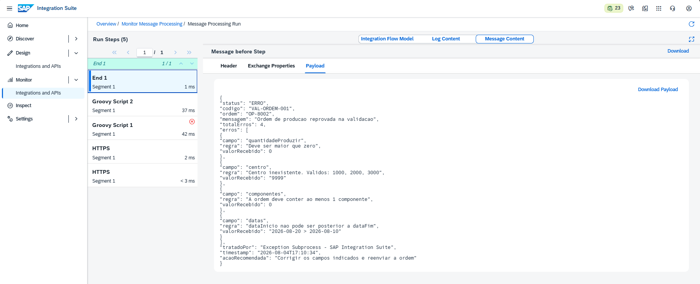

# 🧪 LAB10 — C1: Exception Subprocess

> **Bloco C — Resiliência e Erros** | Camada 1 (trilha oficial) 🥇
> Primeiro cenário do Bloco C: capturar e tratar erros de forma controlada, aplicando o padrão **Exception Subprocess** — o "try/catch" visual do SAP Integration Suite.

---

## 🎯 Objetivo

Nos blocos anteriores, quando algo falhava, o iFlow retornava um erro técnico bruto (500). O **Exception Subprocess** muda isso: ele **captura** qualquer erro do fluxo e permite devolver uma resposta **estruturada e amigável**, em vez de quebrar.

Os objetivos são:

- Aplicar o conceito de **tratamento de erros** (try/catch visual)
- Validar uma Ordem de Produção contra **múltiplas regras de negócio**
- Lançar uma exceção controlada (Groovy `throw`) quando a validação falha
- Capturar o erro no **Exception Subprocess** e retornar uma resposta `422` detalhada

---
## 🧠 O conceito — try/catch visual

O Exception Subprocess funciona como o `try/catch` das linguagens de programação:

| Programação (Java/Python) | SAP Integration Suite |
|---|---|
| `try { ... }` | **Integration Process** (fluxo normal) |
| código que pode falhar | valida a ordem; se falhar, faz `throw` |
| `catch (erro) { ... }` | **Exception Subprocess** (o "catch") |
| tratar o erro | captura e devolve resposta estruturada |

> 💡 Quando qualquer passo do fluxo principal falha, o CPI desvia automaticamente para o Exception Subprocess.
---

## 🏗️ Arquitetura



| Componente | Papel |
|---|---|
| **HTTPS Sender** | Recebe a ordem em JSON (endpoint `/c1exception`) |
| **Groovy — Validação** | Aplica as regras; se falhar, faz `throw` |
| **Exception Subprocess** | Captura o erro lançado |
| **Groovy — Tratamento** | Monta a resposta de erro estruturada (HTTP 422) |

---

## 🧾 As 4 regras de validação

| # | Regra | Erro se... |
|---|---|---|
| 1 | Quantidade a produzir | `quantidadeProduzir` ≤ 0 |
| 2 | Centro válido | centro não for 1000, 2000 ou 3000 |
| 3 | Componentes | lista de itens vazia |
| 4 | Datas | `dataInicio` posterior a `dataFim` |

---

## 🧩 Os dois caminhos

### ✅ Caminho de sucesso — Ordem válida (OP-8001)

**Entrada:**
```json
{
  "ordemProducao": {
    "numero": "OP-8001",
    "cliente": "Orlan_tech",
    "centro": "1000",
    "quantidadeProduzir": 50,
    "dataInicio": "2026-08-10",
    "dataFim": "2026-08-20",
    "componentes": {
      "item": [
        { "codigo": "MAT-001", "descricao": "Célula de Carga 500kg", "quantidade": 50 },
        { "codigo": "MAT-002", "descricao": "Plataforma Inox 1x1m", "quantidade": 50 },
        { "codigo": "MAT-003", "descricao": "Terminal Indicador T500", "quantidade": 50 }
      ]
    }
  }
}
```

**Resposta (200 OK):**
```json
{
  "status": "APROVADO",
  "mensagem": "Ordem de producao validada com sucesso",
  "ordem": "OP-8001",
  "centro": "1000",
  "quantidadeProduzir": 50,
  "totalComponentes": 3,
  "validadoPor": "SAP Integration Suite - C1"
}
```

### ⚠️ Caminho de erro — Ordem inválida (OP-8002)

**Entrada (viola as 4 regras de propósito):**
```json
{
  "ordemProducao": {
    "numero": "OP-8002",
    "cliente": "Orlan_tech",
    "centro": "9999",
    "quantidadeProduzir": 0,
    "dataInicio": "2026-08-20",
    "dataFim": "2026-08-10",
    "componentes": { "item": [] }
  }
}
```

**Resposta (422 Unprocessable Entity) — tratada pelo Exception Subprocess:**
```json
{
  "status": "ERRO",
  "codigo": "VAL-ORDEM-001",
  "ordem": "OP-8002",
  "mensagem": "Ordem de producao reprovada na validacao",
  "totalErros": 4,
  "erros": [
    { "campo": "quantidadeProduzir", "regra": "Deve ser maior que zero", "valorRecebido": 0 },
    { "campo": "centro", "regra": "Centro inexistente. Validos: 1000, 2000, 3000", "valorRecebido": "9999" },
    { "campo": "componentes", "regra": "A ordem deve conter ao menos 1 componente", "valorRecebido": 0 },
    { "campo": "datas", "regra": "dataInicio nao pode ser posterior a dataFim", "valorRecebido": "2026-08-20 > 2026-08-10" }
  ],
  "tratadoPor": "Exception Subprocess - SAP Integration Suite",
  "acaoRecomendada": "Corrigir os campos indicados e reenviar a ordem"
}
```

---

## ⚙️ Passo a passo da construção

1. **iFlow** `C1_Exception_Subprocess` — Sender HTTPS `/c1exception`, CSRF desmarcado
2. **Groovy — Validação** no fluxo principal (Start → Groovy → End)
3. **Exception Subprocess** adicionado (caixa separada com Error Start)
4. **Groovy — Tratamento** dentro do Exception Subprocess (Error Start → Groovy → End)
5. **Save + Deploy** — Runtime Status **Started**

---

## 🐛 Troubleshooting (aprendizados reais)

### ❌ Problema 1 — Properties setadas antes do `throw` não chegam ao Exception
- **Sintoma:** os campos `ordem`, `totalErros` e `erros` vinham vazios na resposta.
- **Causa:** properties/headers gravados **antes** do `throw` nem sempre são propagados ao Exception Subprocess.
- **Solução:** **embutir o JSON dos erros na própria mensagem da exceção** — `throw new Exception(pacoteJson)` — e recuperá-lo no tratamento.

### ❌ Problema 2 — A mensagem da exceção vem "envelopada" pelo Camel
- **Sintoma:** mesmo embutindo o JSON, o parse falhava e os campos continuavam vazios.
- **Causa:** o Camel envolve a mensagem com prefixos (ex.: `javax.script.ScriptException: java.lang.Exception: {...}`), então a string não é um JSON puro.
- **Solução:** **extrair o trecho JSON** de dentro do texto, localizando o primeiro `{` e o último `}` (`indexOf` / `lastIndexOf`) antes de fazer o parse.

> 📚 **Lições-chave (caem em prova):**
> 1. O **Exception Subprocess** captura qualquer erro do fluxo principal (try/catch visual).
> 2. Dados para o tratamento devem ser **embutidos na mensagem da exceção**, não em properties.
> 3. A mensagem da exceção pode vir **envelopada** pelo Camel — extraia o JSON antes de parsear.
> 4. É possível controlar o status HTTP de retorno com o header `CamelHttpResponseCode` (ex.: 422).

---

## 📸 Evidências

### 1. iFlow com o Exception Subprocess
Fluxo principal (`Start → Groovy Validação → End`) e o Exception Subprocess (`Error Start → Groovy Tratamento → End`), deployado e **Started**.


### 2. Groovy — Validação (4 regras)
Script que valida a ordem e lança a exceção com o pacote de erros embutido.


---

### ✅ Caminho de sucesso (OP-8001)

**3. Postman — envio da ordem válida**


**4. Resultado — 200 OK (APROVADO)**


---

### ⚠️ Caminho de erro (OP-8002)

**5. Groovy — Tratamento (Exception Subprocess)**
Script que captura a exceção, extrai o JSON e monta a resposta 422.


**6. Postman — envio da ordem inválida**


**7. Resultado — 422 com os 4 erros tratados**


---

## ✅ Conclusão

O cenário C1 introduziu o **Exception Subprocess**, permitindo transformar falhas em respostas controladas. A partir da validação de uma Ordem de Produção contra quatro regras de negócio, o fluxo comprovou os dois caminhos: aprovação (200) para dados válidos e tratamento estruturado (422 com o detalhamento dos erros) para dados inválidos. Os dois troubleshootings — a perda de properties no `throw` e o envelopamento da mensagem pelo Camel — consolidaram um entendimento profundo de como o tratamento de erros funciona na prática, indo muito além do "caminho feliz".

**Recursos praticados:** Exception Subprocess · Error Start Event · Groovy (`throw` / `CamelExceptionCaught`) · Validação de regras de negócio · Controle de status HTTP (CamelHttpResponseCode) · Monitoring

**Bloco anterior:** [B5 — Multicast](./11-b5-multicast.md)

**Próximo cenário:** [C2 — Retry e Timeout](./13-c2-retry-timeout.md)
