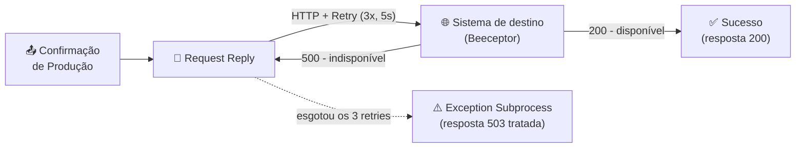
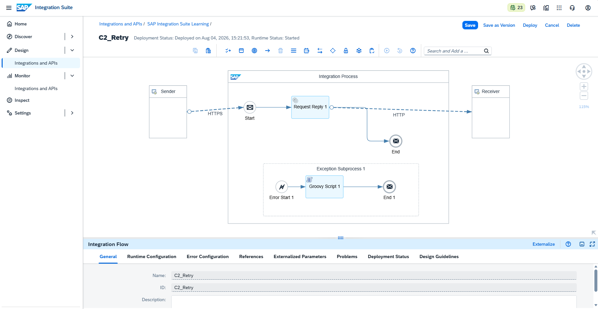
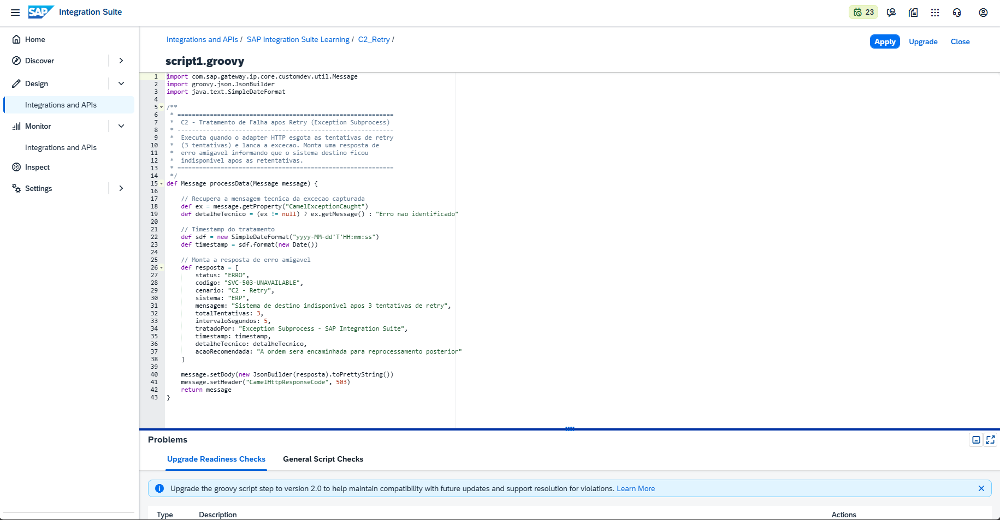
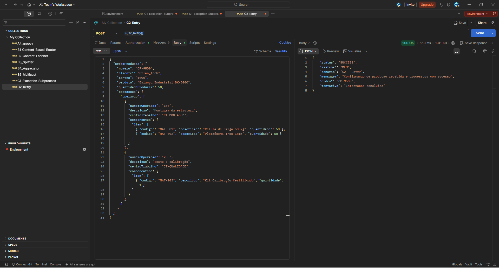
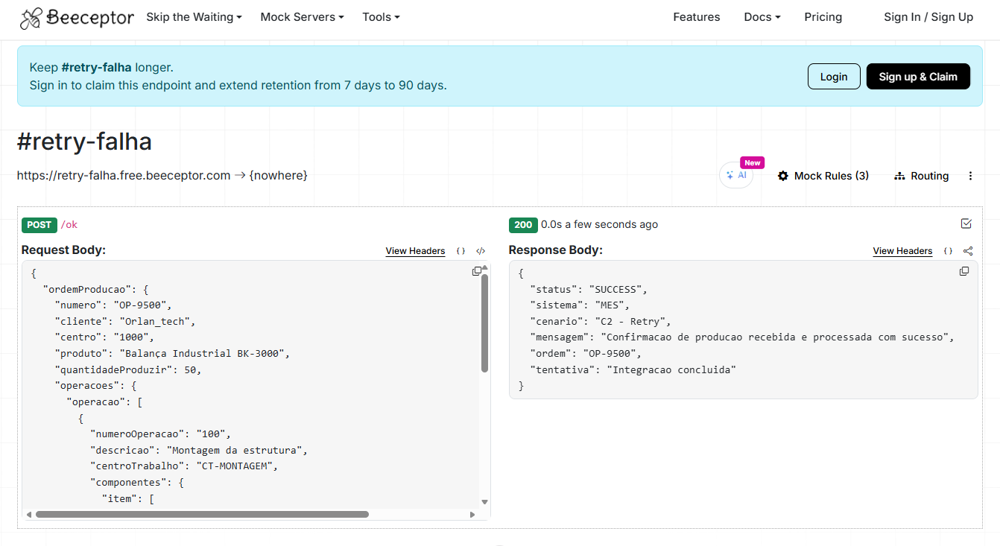
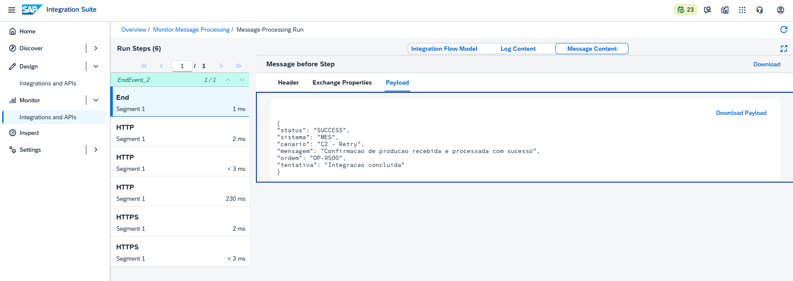
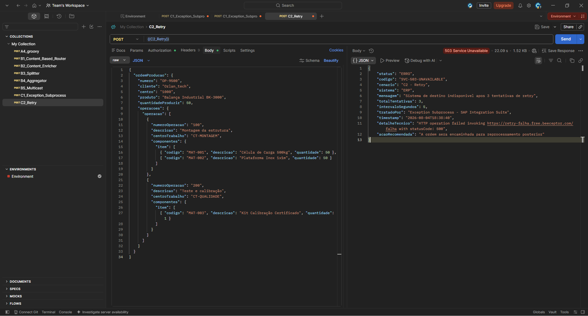
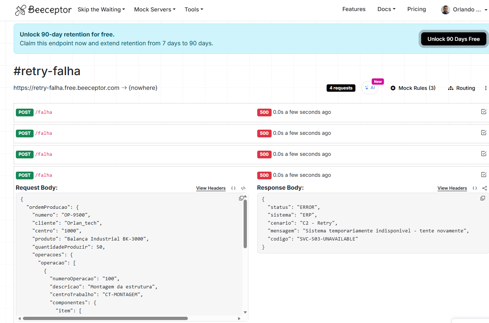
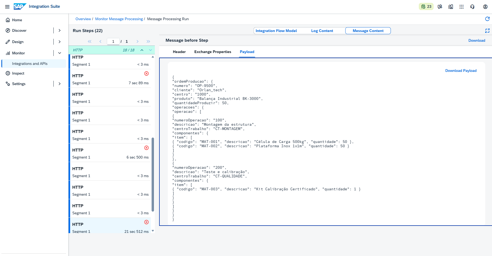

# 🧪 LAB11 — C2: Retry (HTTP Receiver Adapter)

> **Bloco C — Resiliência e Erros** | Camada 1 (trilha oficial) 🥇
> Segundo cenário do Bloco C: tratar **falhas temporárias** de comunicação, reenviando a mensagem automaticamente antes de desistir — o padrão **Retry**.

---

## 🎯 Objetivo

No C1 tratamos erros de **dados** (validação). No C2 tratamos erros **temporários** de comunicação: quando um sistema de destino está momentaneamente indisponível (rede oscilando, servidor sobrecarregado), o iFlow **tenta de novo** algumas vezes — porque muitas falhas são passageiras e a próxima tentativa pode funcionar.

Os objetivos são:

- Configurar o **retry nativo** do HTTP Receiver Adapter
- Reenviar automaticamente em caso de erro (código 500), com intervalo definido
- Combinar **Retry + Exception Subprocess** para tratar a falha após esgotar as tentativas
- Comprovar os dois desfechos: sucesso direto e falha após retry

---

## 🏗️ Arquitetura




| Componente | Papel |
|---|---|
| **HTTPS Sender** | Recebe a confirmação (endpoint `/c2retry`) |
| **Request Reply + HTTP** | Chama o destino com **retry** configurado |
| **Beeceptor** | Simula o destino: `/ok` responde 200, `/falha` responde 500 |
| **Exception Subprocess** | Trata a falha após o retry esgotar (resposta 503) |

---

## ⚙️ Configuração do Retry (aba Retry do adapter HTTP)

| Parâmetro | Valor |
|---|---|
| **Throw Exception On Failure** | ✔️ marcado |
| **Attach Error Details on Failure** | ✔️ marcado |
| **Retry on Error Response** | ✔️ marcado |
| **HTTP Error Response Codes** | `500` |
| **Retry Interval (seconds)** | `5` |
| **Retry Iterations** | `3` |

> 💡 **Limites do retry nativo:** máximo de **3 tentativas**, intervalo de até 60s, e o retry é **em memória** (não persiste). Ele dispara por **código de erro** (ex.: 500, 503) — não por timeout. Após esgotar, o Exception Subprocess é acionado **uma vez**.

---

## 🔬 Simulação com Beeceptor (dois comportamentos)

Para forçar os cenários de teste, foram criadas duas regras no mesmo endpoint:

| Path | Status | Uso |
|---|---|---|
| `/ok` | **200** | Simula o sistema disponível (sucesso direto) |
| `/falha` | **500** | Simula o sistema indisponível (dispara o retry) |

---

## 🧩 Os dois desfechos

### ✅ Caminho de sucesso — destino disponível (`/ok`)

**Resposta (200 OK, ~700ms):**
```json
{
  "status": "SUCCESS",
  "sistema": "MES",
  "cenario": "C2 - Retry",
  "mensagem": "Confirmacao de producao recebida e processada com sucesso",
  "ordem": "OP-9500",
  "tentativa": "Integracao concluida"
}
```

### ⚠️ Caminho de falha — destino indisponível (`/falha`)

O adapter tenta **4 vezes** (1 inicial + 3 retries), levando **~21 segundos**. Ao esgotar, o Exception Subprocess trata e retorna:

**Resposta (503 Service Unavailable, ~21s):**
```json
{
  "status": "ERRO",
  "codigo": "SVC-503-UNAVAILABLE",
  "cenario": "C2 - Retry",
  "sistema": "ERP",
  "mensagem": "Sistema de destino indisponivel apos 3 tentativas de retry",
  "totalTentativas": 3,
  "intervaloSegundos": 5,
  "tratadoPor": "Exception Subprocess - SAP Integration Suite",
  "detalheTecnico": "HTTP operation failed invoking .../falha with statusCode: 500",
  "acaoRecomendada": "A ordem sera encaminhada para reprocessamento posterior"
}
```

> 💡 **A prova do retry é o tempo:** uma chamada normal leva ~200 ms. Levar **~21 segundos** só é possível com 3 retries de 5s cada. No Monitor, os **Attachments** mostram vários pares request/response (um por tentativa) e o **Log com Trace** detalha cada retentativa.

---

## ⚙️ Passo a passo da construção

1. **iFlow** `C2_Retry` — Sender HTTPS `/c2retry`, CSRF desmarcado
2. **Request Reply** ligado a um Receiver **HTTP**
3. **Aba Retry** do adapter HTTP: 3 iterações, 5s, código 500
4. **Exception Subprocess** com Groovy de tratamento (resposta 503)
5. **Log Level: Trace** (Runtime Configuration) para evidenciar as tentativas
6. **Save + Deploy** — Runtime Status **Started**

---

## 🐛 Troubleshooting / Aprendizados

### ❌ A resposta de erro do backend não chegava ao chamador
- **Sintoma:** ao esgotar o retry, o Postman recebia a mensagem técnica do SAP (MPL ID), não o JSON de erro do backend.
- **Causa:** com **Throw Exception On Failure** marcado, o adapter lança uma exceção após o retry e descarta o corpo do backend.
- **Solução:** adicionar um **Exception Subprocess** que captura a exceção e monta uma resposta de erro amigável (503).

### 💡 Status "Completed" mesmo com falha do backend
- Após adicionar o Exception Subprocess, a execução aparece como **Completed** (não Failed), pois o erro foi **tratado** com sucesso. Antes do Exception, o mesmo cenário ficava **Failed**.

> 📚 **Lições-chave (caem em prova):**
> 1. O **HTTP Receiver Adapter** tem retry nativo: máx. **3 tentativas**, por **código de erro** (não por timeout), em memória.
> 2. Após esgotar o retry, o **Exception Subprocess** é acionado uma vez — use-o para tratar a falha.
> 3. Um iFlow com erro **tratado** termina como **Completed**; sem tratamento, fica **Failed**.

---

## 📸 Evidências

### 1. iFlow com Retry e Exception Subprocess
Fluxo `HTTPS → Request Reply (HTTP + retry) → End` com Exception Subprocess. Deployado e **Started**.


### 2. Groovy — Tratamento da falha após retry
Script que captura a exceção do retry esgotado e monta a resposta 503.


---

### ✅ Caminho de sucesso (`/ok`)

**3. Postman — envio funcionando (200)**


**4. Beeceptor — requisição recebida (/ok)**


**5. HTTP End — sucesso**


---

### ⚠️ Caminho de falha com retry (`/falha`)

**6. Postman — envio com falha (503 após ~21s)**


**7. Beeceptor — requisição de falha (/falha, 500)**


**8. HTTP — falha (retry esgotado)**


---

## ✅ Conclusão

O cenário C2 implementou o padrão **Retry** usando o recurso nativo do HTTP Receiver Adapter, reenviando automaticamente a confirmação de produção em caso de indisponibilidade temporária do destino. Combinado ao **Exception Subprocess**, o fluxo tratou a falha após esgotar as três tentativas, retornando uma resposta 503 estruturada em vez de um erro técnico bruto. Os dois desfechos foram comprovados: sucesso direto (~700ms) quando o destino responde 200, e falha tratada (~21s) quando o destino responde 500 repetidamente — sendo o tempo de execução a evidência mais eloquente do mecanismo de retry.

**Recursos praticados:** HTTP Receiver Adapter (Retry nativo) · Request Reply · Exception Subprocess · Groovy (tratamento) · Log Level Trace · Simulação com Beeceptor · Monitoring

**Cenário anterior:** [C1 — Exception Subprocess](./12-c1-exception-subprocess.md)

**Próximo cenário:** [C3 — Dead Letter / Reprocessamento](./14-c3-dead-letter.md)
