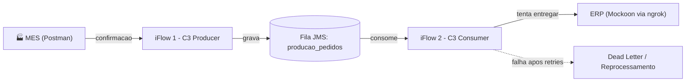

# 🧪 LAB13 — C3: Dead Letter com JMS (MES → ERP)

> **Bloco C — Resiliência e Erros** | Camada 1 (trilha oficial) 🥇
> Terceiro cenário do Bloco C: garantir a entrega de mensagens mesmo com o sistema de destino fora do ar, usando **filas JMS**, **retry assíncrono** e **Dead Letter** — o padrão de *guaranteed delivery*.

---

## 🎬 Demonstração

Vídeo do cenário completo: uma confirmação de produção do MES é enviada, o ERP fica indisponível, a mensagem entra em **retry assíncrono** na fila e, quando o ERP volta, é **reprocessada automaticamente** — sem perda de dados.

<!-- ▶️ COLE AQUI O LINK DO VÍDEO (user-attachments) OU ARRASTE O MP4 PELO GITHUB -->

> 💡 O tempo de execução do vídeo foi editado (trechos de espera acelerados) para melhor visualização do retry.

---

## 🎯 Objetivo

Nos cenários anteriores, as falhas eram tratadas de forma **síncrona** (o remetente esperava a resposta). No C3 introduzimos a **mensageria assíncrona (JMS)**: a mensagem é guardada numa fila e entregue de forma independente, garantindo que **nada se perca** mesmo quando o sistema de destino fica fora do ar por um longo período.

Os objetivos são:

- Implementar **desacoplamento assíncrono** com filas JMS
- Garantir a **entrega mesmo com o destino indisponível** (guaranteed delivery)
- Aplicar **retry assíncrono** (a evolução do retry síncrono do C2)
- Demonstrar o conceito de **Dead Letter** e o **reprocessamento** de mensagens
- Construir um ambiente de testes profissional com **Mockoon + ngrok**

---

## 🧩 Conceitos-chave

### O que é JMS?

**JMS (Java Message Service)** é um padrão de **mensageria assíncrona**. Em vez de o remetente esperar a resposta do destino (síncrono), a mensagem é colocada numa **fila** e processada de forma independente.

| | Síncrono (labs A/B) | Assíncrono (JMS, C3) |
|---|---|---|
| Comportamento | Espera a resposta na hora | Guarda na fila, entrega depois |
| Analogia | Ligação telefônica | Enviar uma carta pelo correio |
| Se o destino cai | Erro imediato, mensagem perdida | Mensagem fica segura na fila |

### O que é uma Fila (Queue)?

Uma **caixa que armazena mensagens temporariamente**, no padrão FIFO (primeiro a entrar, primeiro a sair). As mensagens ficam guardadas com segurança até serem consumidas.

### O que é Dead Letter?

Quando uma mensagem **falha repetidamente** ao ser entregue, após esgotar as tentativas de retry, ela é marcada como **Dead Letter** — uma mensagem "de quarentena" que pode ser investigada e **reprocessada** manualmente quando o problema for resolvido, em vez de ser descartada.

---

## 🏗️ Arquitetura

O padrão clássico usa **dois iFlows desacoplados** conectados por uma fila:



| Componente | Papel |
|---|---|
| **MES (Postman)** | Origem — envia a confirmação de produção |
| **C3_Producer** | Recebe (HTTPS), enriquece (Groovy) e grava na fila JMS |
| **Fila producao_pedidos** | Armazena as mensagens em trânsito (comprimidas e criptografadas) |
| **C3_Consumer** | Consome da fila (JMS Sender) e entrega ao ERP com retry |
| **ERP (Mockoon)** | Sistema de destino simulado, exposto via ngrok |

---

## 🔧 As ferramentas utilizadas

### 📮 SAP Message Queues (JMS)
Capability do Integration Suite ativada para este cenário (20 filas disponíveis no trial). Fornece as filas assíncronas usadas no desacoplamento.

### 🖥️ Mockoon (ERP simulado)
Servidor de mock **local** que simula o ERP. Foi criada uma rota **POST /erp** com resposta condicional:
- Resposta **200** (padrão): confirmação registrada com sucesso
- Resposta **500** (por regra): quando o corpo contém `erpStatus = INDISPONIVEL` (simula ERP com material bloqueado)

> 💡 O Mockoon roda em `localhost` — por isso precisou do ngrok para ser acessível pela nuvem.

### 🌐 ngrok (túnel público)
Como o SAP roda na **nuvem** e o Mockoon roda em **localhost**, o ngrok cria um **túnel seguro** que expõe o Mockoon local numa URL pública, permitindo que o SAP alcance o ERP simulado. Usa conexão outbound na porta 443 (sem alterar firewall).

```text
SAP (nuvem) → https://<subdominio>.ngrok-free.dev/erp → ngrok → localhost:3001 → Mockoon
```

---

## ⚙️ Configuração dos componentes

### C3_Producer (grava na fila)
- **Sender:** HTTPS, address `/c3producer`, CSRF desmarcado
- **Groovy:** enriquece a mensagem com metadados de rastreamento (ID, origem MES, status, timestamp)
- **Receiver JMS:** fila `producao_pedidos`, com **Compress** e **Encrypt Stored Message** ativos
- **Transaction Handling:** Required for JMS

### C3_Consumer (entrega ao ERP)
- **Sender:** JMS, fila `producao_pedidos` (consome as mensagens)
- **Request Reply → HTTP:** chama o ERP (URL do ngrok + `/erp`), com **Throw Exception On Failure** ativo
- **Retry (no adapter JMS):**
  - Retry Interval: 1 min
  - Exponential Backoff: ativo
  - Maximum Retry Interval: 60 min
  - **Dead-Letter Queue: ativo** ⭐

---

## 🧩 A mensagem enriquecida

O Groovy do Producer adiciona uma camada de rastreamento antes de gravar na fila:

**Entra (do MES):**
```json
{
  "confirmacaoProducao": {
    "ordem": "OP-9900",
    "material": "PROD-X-3000",
    "centro": "1000",
    "quantidadeConfirmada": 30,
    "turno": "A"
  }
}
```

**Sai enriquecida (para a fila):**
```json
{
  "rastreamento": {
    "idRastreamento": "TRK-a1b2c3d4",
    "origem": "MES",
    "statusIntegracao": "AGUARDANDO_ENTREGA_ERP",
    "recebidoEm": "2026-08-05T11:10:00",
    "filaDestino": "producao_pedidos"
  },
  "confirmacaoProducao": { "...": "..." }
}
```

---

## 🔒 Por que a resposta do Postman vem criptografada

Ao enviar a mensagem pelo Producer, a resposta que retorna ao Postman aparece com um **conteúdo aparentemente ilegível** (caracteres binários). Isso **não é um erro** — é a prova de que a segurança da fila está ativa.

O adapter JMS do Producer está configurado com **Compress** e **Encrypt Stored Message**. Antes de gravar a mensagem na fila, o SAP a **comprime** e **criptografa**, garantindo que os dados fiquem protegidos enquanto aguardam processamento. O eco dessa mensagem comprimida/encriptada é o que o Postman exibe.

```text
Mensagem enriquecida (JSON legível)
        ↓ Compress + Encrypt Stored Message
Conteúdo comprimido e criptografado na fila (ilegível)
        ↓ (eco ao Postman)
Resposta "estranha" no Postman = prova da criptografia ativa ✅
```

> 💡 **Segurança em ação:** a mensagem só é descomprimida e descriptografada quando o Consumer a consome para entregar ao ERP. Na fila, ela permanece protegida — importante em cenários com dados sensíveis (pedidos, confirmações, valores).

---

## 🎬 O processo executado (passo a passo do cenário)

1. **Fluxo normal:** o MES envia a confirmação → o Producer enriquece e grava na fila → o Consumer consome → entrega ao ERP (200) → mensagem sai da fila. ✅

2. **Falha (ERP fora do ar):** o Mockoon é **desligado** (simula o ERP caindo) → nova mensagem é enviada → o Producer grava na fila (200 na hora, pois é assíncrono) → o Consumer tenta entregar → falha (conexão recusada).

3. **Retry assíncrono:** a mensagem **volta para a fila** e o **Retry Count** aumenta (1, 2, ...), com o campo **Next Retry On** indicando a próxima tentativa. O SAP tenta reentregar automaticamente, de forma espaçada.

4. **Reprocessamento:** o Mockoon é **religado** (o ERP volta) → na próxima tentativa (ou reprocessamento manual), a mensagem é **entregue com sucesso** → a fila esvazia. **Nenhuma mensagem foi perdida.** 🎯

---

## 🐛 Troubleshooting (aprendizados reais)

### ❌ "Specify a valid queue name"
- **Causa:** o nome da fila usava um ponto (`producao.pedidos`).
- **Solução:** o SAP só aceita `[A-Za-z0-9_]` — trocar por underline: `producao_pedidos`.

### ❌ O Consumer marcava "Completed" mesmo com falha
- **Causa:** o adapter HTTP não lançava exceção ao receber erro do ERP.
- **Solução:** ativar **Throw Exception On Failure** no adapter HTTP do Consumer (para a falha disparar o retry do JMS).

### ❌ A fila exige transação
- **Causa:** cenários com JMS/Data Store exigem controle transacional.
- **Solução:** definir **Transaction Handling: Required for JMS** na Runtime Configuration.

### 💡 Regra por conteúdo (INDISPONIVEL) via túnel
- A resposta condicional do Mockoon (`erpStatus = INDISPONIVEL → 500`) funcionou perfeitamente em testes **locais** (localhost), mas apresentou inconsistência quando a requisição chegava **através do túnel ngrok** com o corpo completo enriquecido (relacionado a encoding/parsing).
- **Decisão de projeto:** para a demonstração do Dead Letter, optou-se pelo cenário de **queda do serviço** (desligar o Mockoon), que é **mais realista** — simula o ERP genuinamente fora do ar — e comprova o retry assíncrono e o reprocessamento de forma robusta.

> 📚 **Lições-chave (caem em prova):**
> 1. **JMS** provê mensageria assíncrona: recebe rápido, entrega quando possível, sem perder mensagens.
> 2. Nomes de fila só aceitam letras, números e underline.
> 3. Aggregator/JMS/Data Store exigem **Transaction Handling: Required for JMS**.
> 4. O **retry do JMS** é assíncrono (minutos/horas) — evolução do retry síncrono do C2 (segundos).
> 5. Após esgotar o retry, a mensagem vai para **Dead Letter** e pode ser reprocessada.

---

## 📸 Evidências

### 🏭 Producer (recebe do MES e grava na fila)

**1. iFlow C3_Producer + configuração da fila JMS**


**2. Groovy de enriquecimento**


**3. Postman — envio da confirmação (200, resposta criptografada)**


**4. Monitor — trace da entrada**


**5. Mensagem enriquecida (status AGUARDANDO_ENTREGA_ERP)**


**6. Fila com a mensagem em Waiting**


---

### 🔧 Ambiente (Mockoon + ngrok)

**7. Mockoon — rota /erp com as regras de resposta**


**8. ngrok — túnel público ativo**


---

### 📊 Consumer (consome da fila e entrega ao ERP)

**9. iFlow C3_Consumer + configuração de Retry (Dead-Letter Queue)**


**10. Fila com Retry Count subindo (retry assíncrono)**


**11. Monitor — execução do Consumer**


---

## ✅ Conclusão

O cenário C3 implementou o padrão de **Dead Letter com JMS**, garantindo a entrega de confirmações de produção do MES ao ERP mesmo diante da indisponibilidade prolongada do destino. Através do **desacoplamento assíncrono** (Producer → fila → Consumer), do **retry automático** e do **reprocessamento**, comprovou-se o conceito de *guaranteed delivery* — nenhuma mensagem é perdida. O ambiente de testes, montado com **Mockoon + ngrok**, simulou um ERP externo real de forma profissional, demonstrando também a capacidade de expor serviços locais para a nuvem de forma segura.

Este é o cenário mais completo de resiliência do bloco, combinando mensageria, retry assíncrono e recuperação — pilares de qualquer arquitetura de integração corporativa robusta.

**Recursos praticados:** SAP Message Queues (JMS) · JMS Sender/Receiver Adapters · Desacoplamento assíncrono · Retry assíncrono · Dead-Letter Queue · Groovy (enriquecimento) · Transaction Handling · Compress/Encrypt Stored Message · Mockoon (mock de API com regras) · ngrok (túnel público) · Monitoring/Trace

**Cenário anterior:** [C2 — Retry](./13-c2-retry-timeout.md)

**Próximo cenário:** [C4 — Data Store](./15-c4-data-store.md)
