# 🧪 LAB14 — D1: OData Adapter (Consulta Dinâmica ao S/4HANA)

> **Bloco D — Conectividade / Adapters** | Camada 1 (trilha oficial) 🥇
> Primeiro cenário do Bloco D: consumir uma fonte **OData** com **query dinâmica**, montando filtros, seleção de campos, ordenação e paginação a partir do request — o padrão de integração do SAP S/4HANA.

---

## 🎯 Objetivo

O **OData (Open Data Protocol)** é o **padrão de integração do SAP S/4HANA** — praticamente todas as APIs modernas do SAP são expostas via OData. Enquanto no B2 o OData foi usado como um lookup simples (Content Enricher), aqui o objetivo é **aprofundar** o protocolo, explorando seus recursos de consulta de forma **dinâmica**.

Os objetivos são:

- Consumir uma fonte OData V4 com o **OData Adapter**
- Montar uma **query dinâmica** a partir do request (o filtro vem do Postman)
- Aplicar os principais **query options**: `$filter`, `$select`, `$orderby`, `$top`, `$skip`
- Demonstrar filtros **combináveis e opcionais**

---

## 🧠 O conceito — Query Options do OData

O OData permite refinar a consulta diretamente na URL, através dos **system query options**:

| Query Option | Função | Exemplo |
|---|---|---|
| **$filter** | Filtra registros por condição | `Country eq 'Germany'` |
| **$select** | Escolhe quais campos retornar | `CustomerID,CompanyName,City` |
| **$orderby** | Ordena o resultado | `CompanyName asc` |
| **$top** | Limita a quantidade | `10` |
| **$skip** | Pula N registros (paginação) | `0` |

> 💡 O grande diferencial deste cenário: em vez de uma query **fixa**, o iFlow monta a query **sob medida** para cada requisição — combinando apenas os filtros que vierem preenchidos.

---

## 🏭 O cenário — Consulta avançada de clientes

Um portal comercial solicita clientes aplicando múltiplos critérios. O iFlow recebe esses critérios, monta a query OData correspondente e retorna os dados filtrados da base **Northwind V4**.

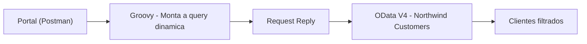

## 📋 Payload de entrada (robusto)

```json
{
  "consultaClientes": {
    "solicitante": "Portal-Comercial",
    "dataRequisicao": "2026-08-06",
    "filtros": {
      "pais": "Germany",
      "cidade": null,
      "nomeContem": null,
      "tituloContato": "Sales Representative"
    },
    "camposRetorno": ["CustomerID","CompanyName","ContactName","ContactTitle","City","Country","Phone"],
    "ordenacao": { "campo": "CompanyName", "direcao": "asc" },
    "paginacao": { "limite": 10, "pular": 0 }
  }
}
```

| Bloco | Função |
|---|---|
| **solicitante / dataRequisicao** | Rastreabilidade e auditoria |
| **filtros** | Critérios combináveis (país, cidade, nome, título) — todos opcionais |
| **camposRetorno** | Define o `$select` dinamicamente |
| **ordenacao** | Define o `$orderby` |
| **paginacao** | Define `$top` e `$skip` |

---

## 🏗️ Arquitetura e configuração

O fluxo tem três componentes principais: o Groovy que monta a query, o Request Reply e o adapter OData.

**iFlow + configuração do Processing (OData)**
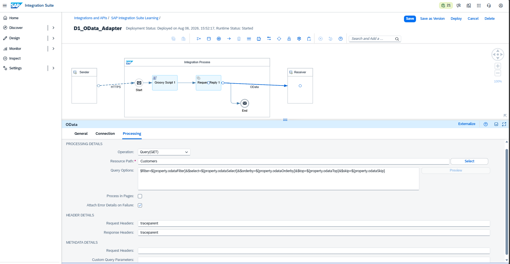

### 🔧 O Groovy que monta a query dinâmica

O coração do cenário: o Groovy lê os filtros do request e constrói os query options, incluindo **apenas o que foi preenchido**:

```groovy
def filtros = []
if (q.filtros?.pais)          filtros << "Country eq '${q.filtros.pais}'"
if (q.filtros?.cidade)        filtros << "City eq '${q.filtros.cidade}'"
if (q.filtros?.nomeContem)    filtros << "contains(CompanyName,'${q.filtros.nomeContem}')"
if (q.filtros?.tituloContato) filtros << "ContactTitle eq '${q.filtros.tituloContato}'"
def filterExpr = filtros.join(" and ")

def selectExpr = q.camposRetorno.join(",")
def orderbyExpr = "${q.ordenacao?.campo} ${q.ordenacao?.direcao}"
message.setProperty("odataFilter", filterExpr)
message.setProperty("odataSelect", selectExpr)
message.setProperty("odataOrderby", orderbyExpr)
// ... $top e $skip
```

### 🔧 Configuração do OData Adapter

| Parâmetro | Valor |
|---|---|
| **Address** | `https://services.odata.org/V4/Northwind/Northwind.svc` |
| **Proxy Type** | Internet |
| **Authentication** | None |
| **CSRF Protected** | Desmarcado |
| **Resource Path** | `Customers` |
| **Operation** | Query(GET) |
| **Query Options** | `$filter=${property.odataFilter}&$select=${property.odataSelect}&$orderby=${property.odataOrderby}&$top=${property.odataTop}&$skip=${property.odataSkip}` |

> 💡 O adapter substitui `${property.odataFilter}` pelo valor real montado pelo Groovy — é isso que torna a query **dinâmica**.

---

## 🧪 Teste 1 — Alemanha + Sales Representative

Filtro combinado: clientes da **Alemanha** que são **Sales Representative**.

**Query OData gerada:**
```text
Customers?$filter=Country eq 'Germany' and ContactTitle eq 'Sales Representative'
         &$select=CustomerID,CompanyName,ContactName,ContactTitle,City,Country,Phone
         &$orderby=CompanyName asc&$top=10&$skip=0
```

**Resultado:** retorna apenas os representantes de vendas alemães (Alfreds Futterkiste, Blauer See Delikatessen, Die Wandernde Kuh, Lehmanns Marktstand).

**Postman — envio (Germany + Sales Representative)**
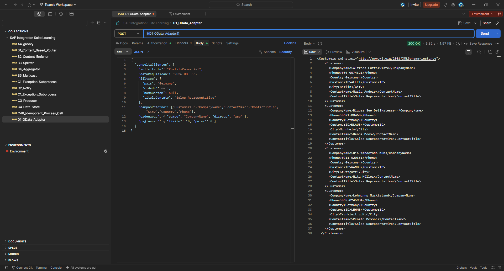

**HCIOData — entrada (query montada nas Exchange Properties)**
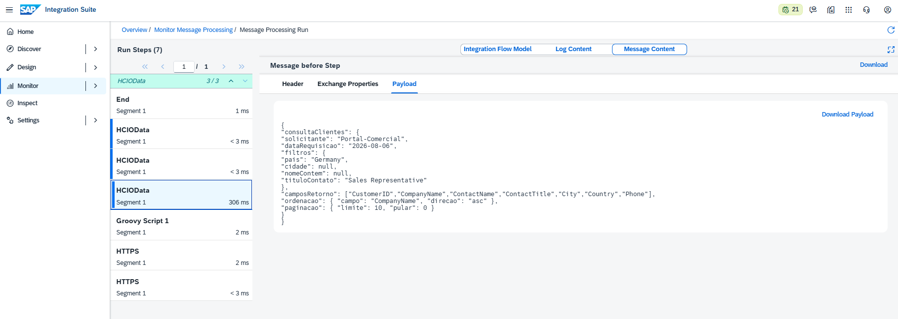

**Resultado no End (clientes alemães filtrados)**
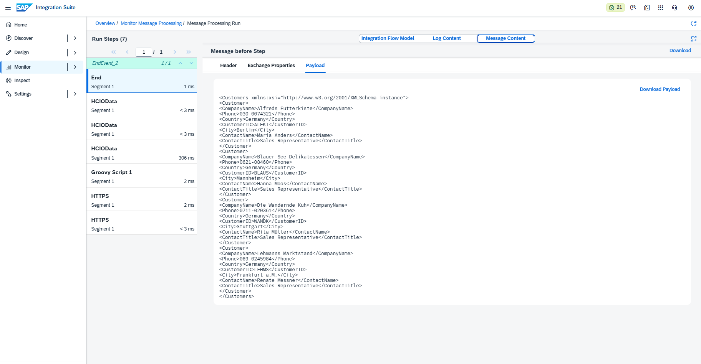

---

## 🧪 Teste 2 — França (somente país)

Apenas o filtro de país, ordenado por cidade. Mostra que a query se adapta quando **menos filtros** são enviados.

**Query OData gerada:**
```text
Customers?$filter=Country eq 'France'
         &$select=CustomerID,CompanyName,City,Country,Phone
         &$orderby=City asc&$top=10&$skip=0
```

**Postman — envio (France)**
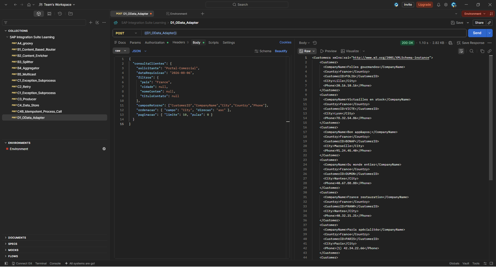

**HCIOData — entrada**
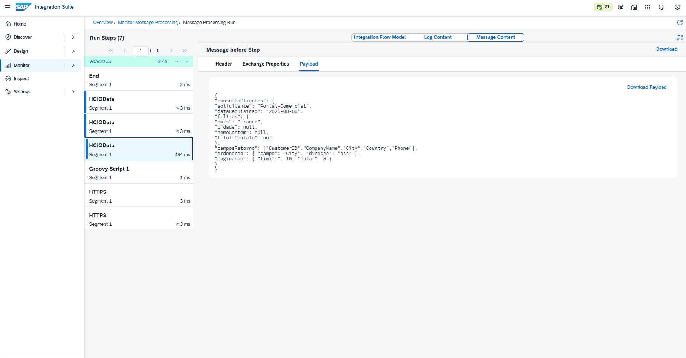

**Resultado no End (clientes franceses)**
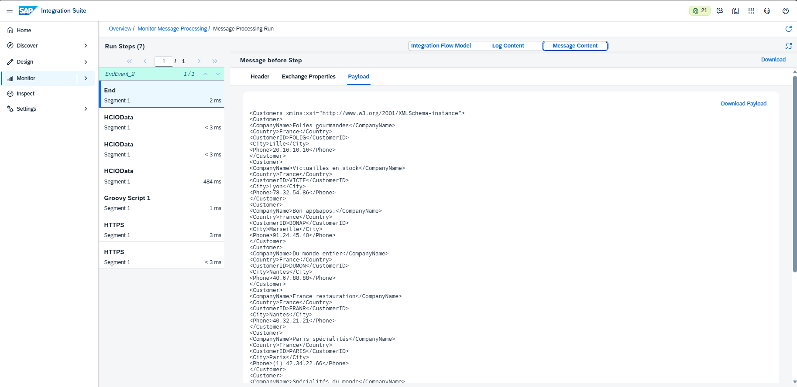

---

## 🧪 Teste 3 — Busca por nome (contains)

Sem filtro de país; busca por **nome parcial** usando a função `contains`. Demonstra a flexibilidade dos operadores OData.

**Query OData gerada:**
```text
Customers?$filter=contains(CompanyName,'Market')
         &$select=CustomerID,CompanyName,City,Country
         &$orderby=CompanyName asc&$top=10&$skip=0
```

**Resultado:** clientes com "Market" no nome (ex.: Bottom-Dollar Markets, Lehmanns Marktstand).

**Postman — envio (nome contém "Market")**
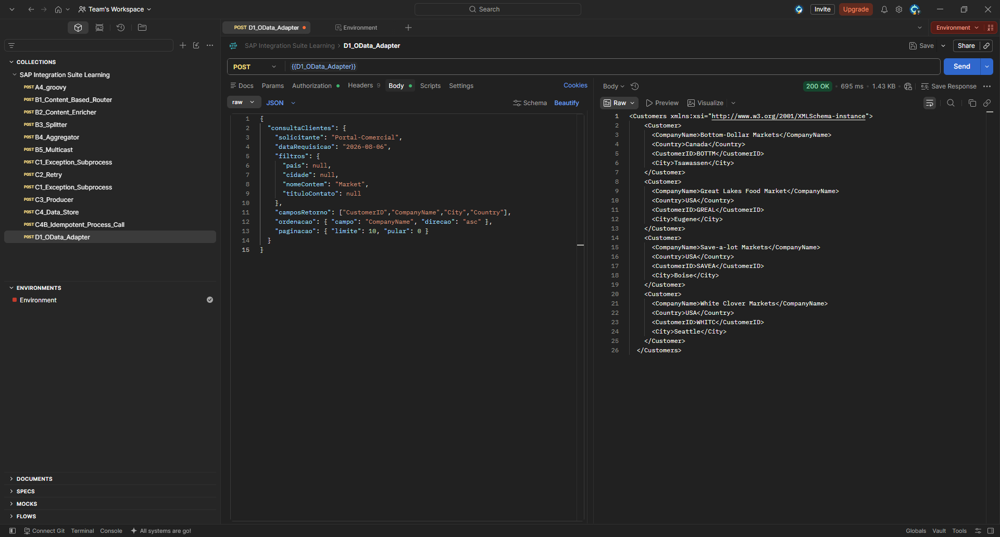

**HCIOData — entrada**
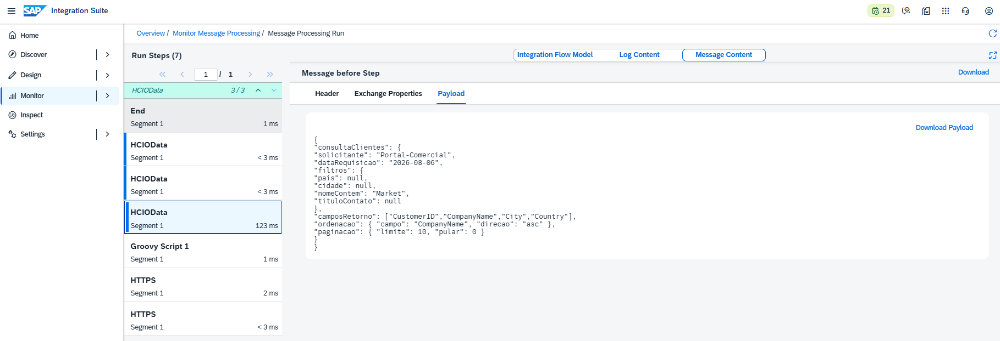

**Resultado no End (clientes com "Market")**
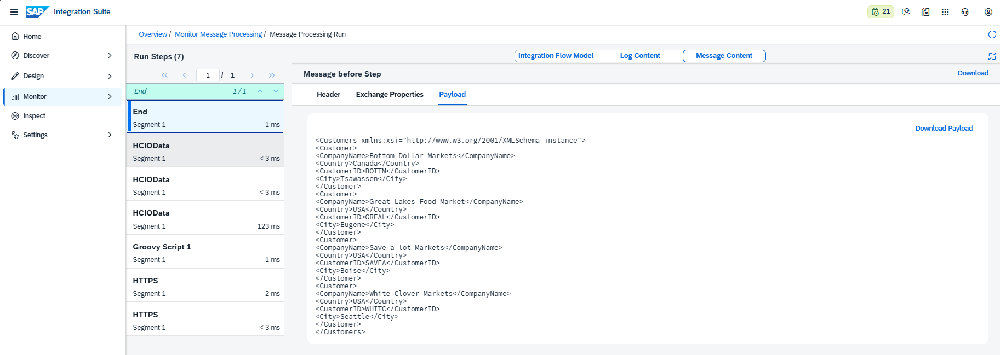

---

## 🔗 Validação dos dados (fonte pública)

A fonte OData utilizada é a **Northwind V4**, pública e disponível para consulta. Para validar os dados manualmente ou testar os filtros direto na URL:

- Base de clientes: `https://services.odata.org/V4/Northwind/Northwind.svc/Customers`
- Exemplo com filtro: `https://services.odata.org/V4/Northwind/Northwind.svc/Customers?$filter=Country eq 'Germany'`

> 💡 Qualquer pessoa pode abrir esses links no navegador e conferir que os dados retornados pelo iFlow correspondem exatamente à fonte — transparência total.

---

## 💡 Alternativas e recursos adicionais

- **Model Operation:** o OData Adapter oferece um assistente visual ("Model Operation") que conecta na fonte, lista as entidades e monta a query automaticamente. Útil para queries **fixas**; neste cenário optou-se pela query **dinâmica** (via properties) para maior flexibilidade.
- **Outros query options:** o OData ainda suporta `$expand` (dados relacionados), `$count` (contagem) e `$search` (busca textual), que podem enriquecer consultas mais complexas.

---

## ✅ Conclusão

O cenário D1 aprofundou o uso do **OData Adapter**, indo além de uma simples consulta: o iFlow monta **queries dinâmicas** a partir do request, combinando `$filter`, `$select`, `$orderby` e paginação de forma flexível. Os três testes comprovaram que o **mesmo iFlow** gera consultas diferentes conforme os critérios enviados — filtro por país, por título, ou busca parcial por nome. Como o OData é o padrão de integração do S/4HANA, dominar esse adapter e seus query options é essencial para qualquer integração no ecossistema SAP moderno.

**Recursos praticados:** OData V4 Adapter · Query dinâmica · `$filter` (combinado e `contains`) · `$select` · `$orderby` · `$top` / `$skip` · Groovy (montagem de query) · Request Reply · Monitoring/Exchange Properties

**Bloco anterior:** [C4 — Data Store & Idempotência](./15-c4-data-store.md)

**Próximo cenário:** [D2 — SOAP Adapter](./17-d2-soap-adapter.md)
