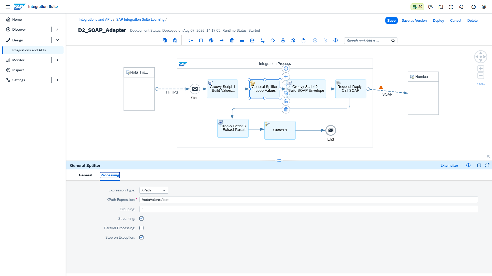
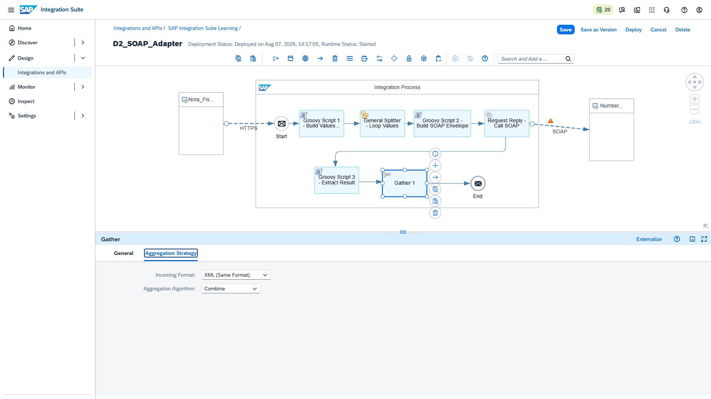
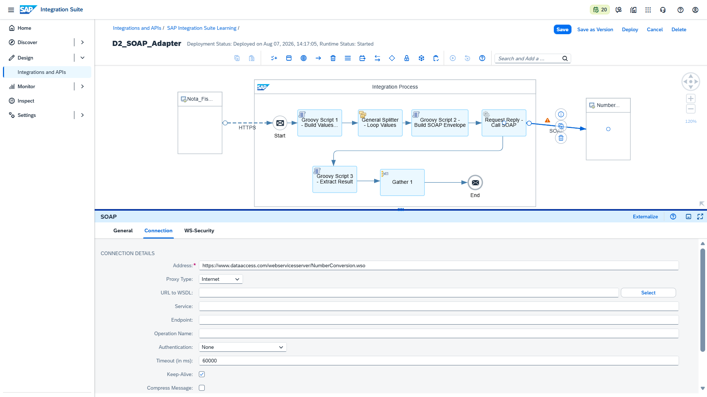
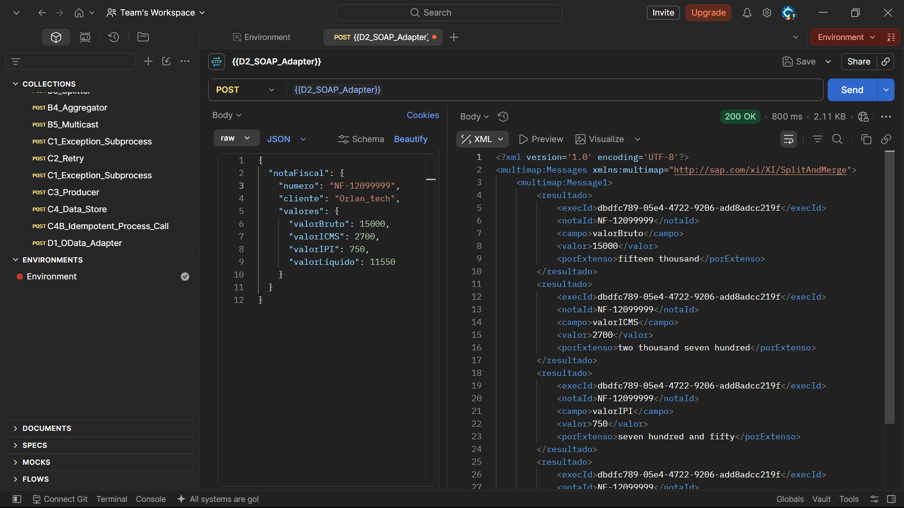
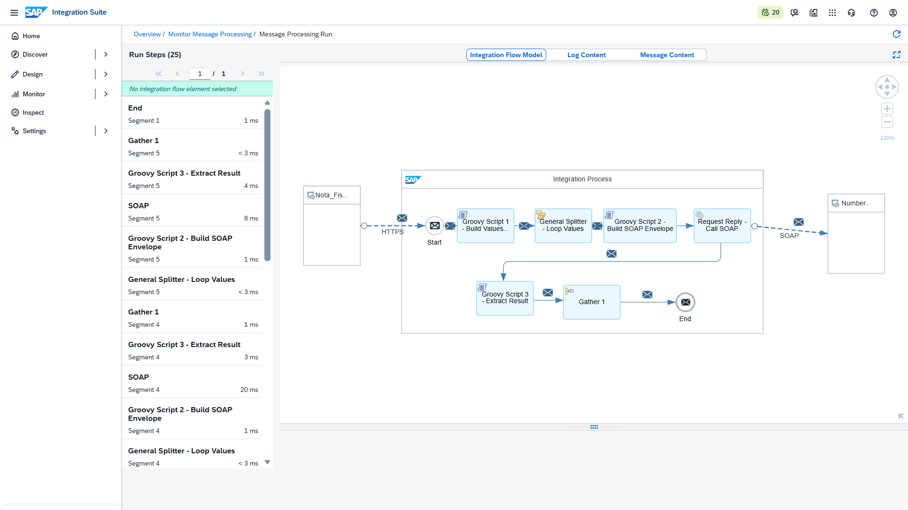
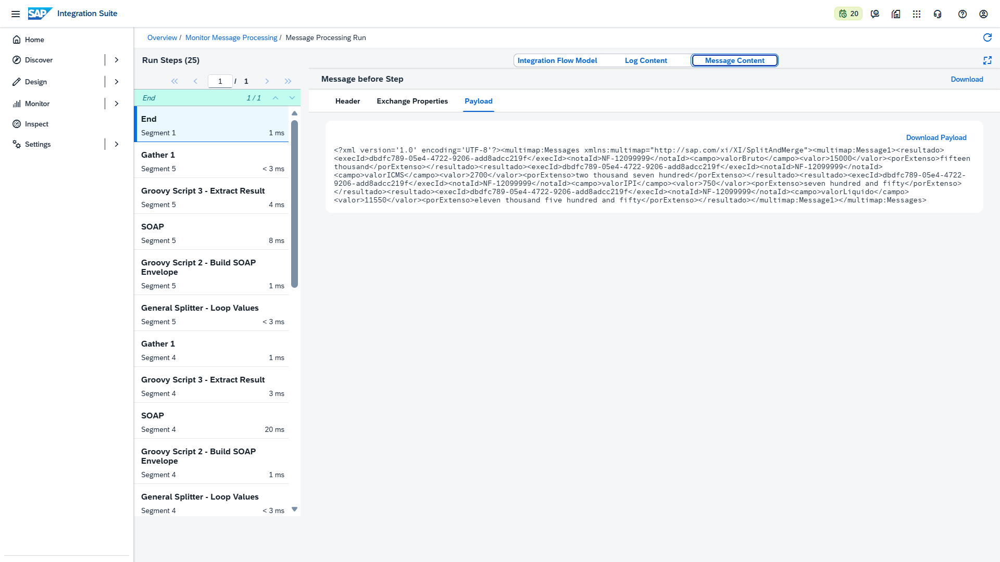

# 🧾 D2 — SOAP Adapter & Loop Splitter (Number Conversion)

> **Bloco:** D — Padrões de Integração Avançados
> **Cenário:** D2_SOAP_Adapter
> **iFlow técnico:** `D2_SOAP_Adapter`
> **Status:** ✅ Concluído e testado (200 OK)
> **Data de execução:** 07/08/2026

---

## 📌 Contexto de Negócio

Este cenário simula o enriquecimento de uma **Nota Fiscal** vinda de um sistema de origem (ex: MES/ERP), na qual os valores numéricos (`valorBruto`, `valorICMS`, `valorIPI`, `valorLiquido`) precisam ser convertidos para sua representação **por extenso**, prática comum em documentos fiscais e financeiros.

O objetivo técnico do laboratório é praticar o padrão **Split → Process → Gather**, integrando o CPI com um **Web Service SOAP externo público** (`NumberConversion` — dataaccess.com), consolidando as 4 respostas individuais em uma única resposta HTTP síncrona.

---

## 🏗️ Arquitetura do iFlow

```mermaid
flowchart LR
    A[Nota_Fiscal<br/>Sender] -->|HTTPS /d2soap<br/>User Role: ESBMessaging.send| B([Start])
    B --> C[Groovy Script 1<br/>Build Values List<br/>JSON → XML + execId]
    C --> D[General Splitter<br/>Loop Values<br/>XPath: //item]
    D --> E[Groovy Script 2<br/>Build SOAP Envelope]
    E --> F[Request Reply<br/>Call SOAP<br/>NumberConversion.wso]
    F --> G[Groovy Script 3<br/>Extract Result<br/>porExtenso]
    G --> H[Gather 1<br/>Aggregation Algorithm: Combine]
    H --> I([End])
    I -->|multimap:Messages| J[Resposta 200 OK<br/>ao Postman]
```



---

## ⚙️ Configuração passo a passo

### 1. Sender HTTPS

| Campo | Valor |
|---|---|
| Address | `/d2soap` |
| Authorization | `User Role` |
| User Role | `ESBMessaging.send` |

### 2. General Splitter — Loop Values

| Campo | Valor |
|---|---|
| Split Expression Type | XPath |
| XPath Expression | `//item` |

### 3. SOAP (SOAP 1.x) Receiver — Call SOAP

> ⚠️ **Ponto crítico do laboratório**: configurado em modo **Manual**, sem WSDL.

| Campo | Valor |
|---|---|
| Address | `https://www.dataaccess.com/webservicesserver/NumberConversion.wso` |
| URL to WSDL | *(vazio)* |
| Service | *(vazio)* |
| Endpoint | *(vazio)* |
| Operation Name | *(vazio)* |

O `SOAPAction` e o envelope SOAP são montados manualmente via Groovy Script 2 (ver código abaixo), eliminando a dependência do parsing automático do WSDL remoto.

### 4. Gather 1 — Aggregation Strategy

| Campo | Valor |
|---|---|
| Incoming Format | `XML (Same Format)` |
| Aggregation Algorithm | `Combine` |

> 📌 O **Gather** não exige Correlation Expression nem Last Message Condition — ele já sabe automaticamente qual Splitter está fechando (associação implícita dentro do mesmo processo síncrono).

---

## 🧑‍💻 Scripts Groovy

### Script 1 — Build Values List

```groovy
import com.sap.gateway.ip.core.customdev.util.Message
import groovy.json.JsonSlurper
import java.util.UUID

def Message processData(Message message) {
    def reader = message.getBody(java.io.Reader.class)
    def json = new JsonSlurper().parse(reader)
    def nf = json.notaFiscal
    def v = nf.valores
    def execId = UUID.randomUUID().toString()

    // Guarda dados da nota para uso posterior (Script 3 / correlação)
    message.setProperty("nfNumero", nf.numero?.toString())
    message.setProperty("nfCliente", nf.cliente?.toString())
    message.setProperty("execId", execId)

    // Monta XML com a lista de valores para o Splitter iterar
    def sb = new StringBuilder()
    sb.append("<notaValores>")
    sb.append("<item><campo>valorBruto</campo><valor>${v.valorBruto}</valor></item>")
    sb.append("<item><campo>valorICMS</campo><valor>${v.valorICMS}</valor></item>")
    sb.append("<item><campo>valorIPI</campo><valor>${v.valorIPI}</valor></item>")
    sb.append("<item><campo>valorLiquido</campo><valor>${v.valorLiquido}</valor></item>")
    sb.append("</notaValores>")

    message.setBody(sb.toString())
    message.setHeader("Content-Type", "application/xml")
    return message
}
```

### Script 2 — Build SOAP Envelope

```groovy
import com.sap.gateway.ip.core.customdev.util.Message
import groovy.util.XmlSlurper

def Message processData(Message message) {
    def body = message.getBody(String)
    def parsed = new XmlSlurper().parseText(body)

    // Localiza o nó <item> mesmo se vier aninhado
    def itemNode = (parsed.name() == 'item') ? parsed : parsed.depthFirst().find { it.name() == 'item' }

    def campo = itemNode.campo.text()
    def valor = itemNode.valor.text()

    message.setProperty("campoAtual", campo)
    message.setProperty("valorAtual", valor)

    // Apenas o conteúdo da operação SOAP - SEM soap:Envelope / soap:Body
    // O adapter SOAP 1.x do CPI já adiciona o envelope automaticamente
    def payload = """<NumberToWords xmlns="http://www.dataaccess.com/webservicesserver/">
  <ubiNum>${valor}</ubiNum>
</NumberToWords>"""

    message.setBody(payload.toString())
    message.setHeader("Content-Type", "text/xml; charset=UTF-8")
    message.setHeader("SOAPAction", "http://www.dataaccess.com/webservicesserver/NumberToWords")

    return message
}
```

### Script 3 — Extract Result

```groovy
import com.sap.gateway.ip.core.customdev.util.Message
import groovy.util.XmlSlurper

def Message processData(Message message) {
    def body = message.getBody(String)
    def resp = new XmlSlurper().parseText(body)
    def porExtenso = resp.depthFirst().find { it.name() == 'NumberToWordsResult' }?.text() ?: "N/A"

    def campo = message.getProperty("campoAtual") ?: "campo"
    def valor = message.getProperty("valorAtual") ?: "0"
    def nfNumero = message.getProperty("nfNumero") ?: "NF"
    def execId = message.getProperty("execId") ?: "SEM-EXEC-ID"

    def resultado = "<resultado><execId>${execId}</execId><notaId>${nfNumero}</notaId><campo>${campo}</campo><valor>${valor}</valor><porExtenso>${porExtenso.trim()}</porExtenso></resultado>"

    // Conversão explícita GString -> String "pura" - evita erro de conversão no Gather/CXF
    message.setBody(resultado.toString())
    return message
}
```

---

## 🧪 Teste (Postman)

**Request — POST `{{D2_SOAP_Adapter}}`**
```json
{
  "notaFiscal": {
    "numero": "NF-12099999",
    "cliente": "Orlan_tech",
    "valores": {
      "valorBruto": 15000,
      "valorICMS": 2700,
      "valorIPI": 750,
      "valorLiquido": 11550
    }
  }
}
```

**Response — 200 OK**
```xml
<multimap:Messages xmlns:multimap="http://sap.com/xi/XI/SplitAndMerge">
  <multimap:Message1>
    <resultado>
      <execId>dbdfc789-05e4-4722-9206-add8adcc219f</execId>
      <notaId>NF-12099999</notaId>
      <campo>valorBruto</campo>
      <valor>15000</valor>
      <porExtenso>fifteen thousand</porExtenso>
    </resultado>
    <resultado>
      <execId>dbdfc789-05e4-4722-9206-add8adcc219f</execId>
      <notaId>NF-12099999</notaId>
      <campo>valorICMS</campo>
      <valor>2700</valor>
      <porExtenso>two thousand seven hundred</porExtenso>
    </resultado>
    <resultado>
      <execId>dbdfc789-05e4-4722-9206-add8adcc219f</execId>
      <notaId>NF-12099999</notaId>
      <campo>valorIPI</campo>
      <valor>750</valor>
      <porExtenso>seven hundred and fifty</porExtenso>
    </resultado>
    <resultado>
      <execId>dbdfc789-05e4-4722-9206-add8adcc219f</execId>
      <notaId>NF-12099999</notaId>
      <campo>valorLiquido</campo>
      <valor>11550</valor>
      <porExtenso>eleven thousand five hundred and fifty</porExtenso>
    </resultado>
  </multimap:Message1>
</multimap:Messages>
```

---

## 📸 Evidências

> 📁 Pasta: [`evidences/lab15`](../evidences/lab15)

### 01 — iFlow completo + configuração do General Splitter

Visão geral do iFlow `D2_SOAP_Adapter` (Start → Script 1 → Splitter → Script 2 → SOAP → Script 3 → Gather → End) e a configuração do XPath `//item` no General Splitter, responsável por dividir a lista de 4 valores da Nota Fiscal em mensagens individuais para processamento paralelo.



### 02 — Configuração do Gather (Aggregation Strategy)

Configuração do componente `Gather 1`, responsável por consolidar as 4 respostas processadas (uma por valor da Nota Fiscal) em uma única resposta síncrona, com `Incoming Format: XML (Same Format)` e `Aggregation Algorithm: Combine`.



### 03 — Configuração da conexão SOAP (Manual, sem WSDL)

Configuração do canal Receiver `SOAP (SOAP 1.x)` apontando para o serviço público `NumberConversion.wso`, com os campos `URL to WSDL`, `Service`, `Endpoint` e `Operation Name` intencionalmente vazios (modo manual), evitando a dependência de leitura do WSDL remoto durante o startup do iFlow.



### 04 — Postman: envio e resposta 200 OK enriquecida

Requisição POST enviada ao endpoint `{{D2_SOAP_Adapter}}` com o payload da Nota Fiscal (4 valores) e resposta `200 OK` contendo os 4 resultados consolidados, cada um com o campo original, o valor numérico e a conversão `porExtenso` (idioma inglês, conforme retorno nativo do web service).



### 05 — Monitor: fluxo de mensagens no Trace

Visualização do `Integration Flow Model` no Monitor de Mensagens, mostrando o caminho percorrido pela mensagem: Start → Script 1 → Splitter → Script 2 → SOAP (call externa) → Script 3 → Gather → End, com destaque para os 4 ciclos de Splitter/SOAP/Script executados em sequência antes do fechamento pelo Gather.



### 06 — Message Content: resultado final enriquecido (step End)

Conteúdo do payload no step `End`, confirmando que a mensagem consolidada (`multimap:Messages`) contém os 4 registros `<resultado>` com os valores convertidos por extenso, exatamente como recebido pelo Postman — validando que o `Gather` entrega corretamente a resposta ao chamador HTTP síncrono original.



---

## 🔍 Troubleshooting & Lições Aprendidas

Durante a construção deste cenário, foram identificados e corrigidos 5 problemas técnicos relevantes, documentados aqui como referência para futuros desenvolvimentos:

### 1. `Could not find definition for service` (erro no Deploy)
**Causa:** o WSDL do serviço `NumberConversion.wso` expõe múltiplos bindings (SOAP 1.1, SOAP 1.2, HTTP) sob o mesmo `<service>`. O adapter SOAP (SOAP 1.x) do CPI suporta apenas SOAP 1.1, e a leitura remota do WSDL durante o startup falhava ao tentar casar Service/Endpoint automaticamente.
**Solução:** configurar o canal em modo manual — `URL to WSDL`, `Service`, `Endpoint` e `Operation Name` todos vazios, apenas com o campo `Address` preenchido. É "tudo ou nada": não é possível preencher só o `Operation Name` sem WSDL (o próprio validador do CPI bloqueia essa combinação).

### 2. `unable to resolve class groovy.xml.XmlSlurper`
**Causa:** o motor Groovy do SAP Cloud Integration roda em **Groovy 2.4.x**, e o pacote `groovy.xml.XmlSlurper` só existe a partir do Groovy 3.0+.
**Solução:** usar sempre `import groovy.util.XmlSlurper` (pacote legado, compatível com o runtime do CPI).

### 3. `No type converter available... GStringImpl → CxfPayload`
**Causa:** strings montadas com interpolação (`"""...${valor}..."""`) geram objetos `GStringImpl` em Groovy, que o Camel/CXF (usado pelo adapter SOAP) não sabe converter automaticamente.
**Solução:** sempre finalizar com `.toString()` explícito antes de `message.setBody(...)` quando o body for construído por interpolação de string.

### 4. `SoapFault: No such method: Envelope` (envelope duplicado)
**Causa:** o adapter SOAP (SOAP 1.x) do CPI já constrói automaticamente o `<soap:Envelope>`/`<soap:Body>` ao redor do conteúdo enviado. Como o Groovy também montava esse envelope manualmente, o resultado era um envelope SOAP aninhado dentro de outro, rejeitado pelo servidor.
**Solução:** o body enviado ao adapter deve conter **apenas** o elemento da operação (`<NumberToWords>...</NumberToWords>`), sem o wrapper `soap:Envelope`/`soap:Body`.

### 5. Aggregator retornava resposta desatualizada ao Postman
**Causa:** o componente **Aggregator** foi projetado para correlação **assíncrona** de mensagens independentes (com Data Store, Correlation Expression e Completion Timeout). Em um cenário HTTP **síncrono** (Split → processar em paralelo → devolver tudo na mesma resposta), o exchange principal aguardado pelo Sender HTTP não era necessariamente atualizado pelo Aggregator, resultando no body original (pré-Splitter) sendo devolvido ao chamador, mesmo com o processamento interno correto (visível no Trace).
**Solução:** substituir o `Aggregator` pelo componente **`Gather`**, que é o padrão correto do CPI para o EIP *Scatter-Gather* em cenários síncronos — ele já sabe qual Splitter está fechando e devolve a resposta consolidada diretamente ao Sender original.

> 💡 **Nota conceitual para o portfólio**: `Aggregator` ≠ `Gather`. Use `Aggregator` para correlacionar mensagens que chegam de forma assíncrona e independente ao longo do tempo (ex: múltiplos pedidos de sistemas diferentes). Use `Gather` quando o objetivo é dividir, processar em paralelo e devolver uma única resposta **na mesma chamada síncrona** que originou o Splitter.

---

## 🛠️ Ferramentas utilizadas

- **SAP Integration Suite** (Cloud Integration – Trial)
- **Postman** (collection `D2_SOAP_Adapter`, variáveis `{{base_url}}`/`{{clientid}}`/`{{clientsecret}}`)
- **Web Service público**: [NumberConversion – dataaccess.com](https://www.dataaccess.com/webservicesserver/numberconversion.wso?op=NumberToWords)


---

## ✅ Conclusão

O cenário D2 aprofundou o uso do **SOAP Adapter**, indo além de uma chamada simples: o iFlow integra com um Web Service SOAP público externo, usando o padrão **Split → Process → Gather** para processar múltiplos valores em paralelo e consolidar tudo em uma única resposta síncrona.

**Recursos praticados:** SOAP (SOAP 1.x) Receiver Adapter · Configuração Manual sem WSDL · General Splitter · Gather (Scatter-Gather síncrono) · Groovy Script (parsing XML, montagem de envelope SOAP, conversão de tipos)

**Bloco anterior:** ./16-d1-odata-adapter.md

**Próximo cenário:** [D3 – SFTP Adapter](./18

---

## 👤 Autor

**Orlando Caetano**
🔗 [LinkedIn](https://www.linkedin.com/in/orlando-caetano/) | 💻 [GitHub](https://github.com/OrlandoCaetano2026)
