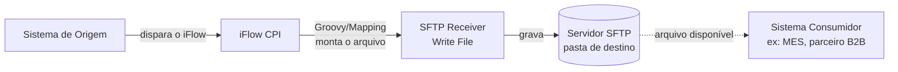
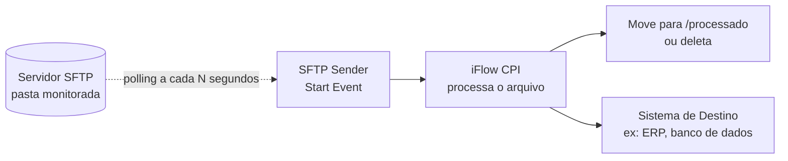
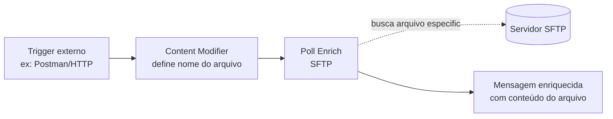

# 📁 D3 — SFTP Adapter (Integração de Arquivos)

> **Bloco:** D — Padrões de Integração Avançados
> **Cenário:** D3_SFTP_Producer + D3_SFTP_Consumer (2 iFlows independentes)
> **Status:** ✅ Producer concluído e testado | ⏳ Consumer em construção
> **Data de execução:** 07/08/2026

---

## 📌 Contexto de Negócio

Este cenário simula a **liberação de uma Ordem de Produção no SAP** e o envio dessa informação para um **sistema MES** (Manufacturing Execution System), reproduzindo um padrão real e extremamente comum na indústria: a troca de arquivos via **hot folder** entre ERP e MES.

Na prática de mercado, essa integração normalmente ocorre via IDoc **LOIPRO03** (segmentos `E1AFKOL` para o cabeçalho da ordem e `E1AFPOL` para os itens), disparado no momento da liberação da ordem de produção, ou através de arquivos estruturados em XML seguindo padrões como o **B2MML** (ISA-95), quando o MES não possui uma interface RFC/IDoc nativa — muitos sistemas MES (como Opcenter e PAS-X) utilizam justamente pastas monitoradas (hot folders) para esse tipo de integração.

Como não temos acesso a um sistema SAP backend real neste laboratório, o cenário foi adaptado para **simular esse fluxo usando HTTP como gatilho** (representando a liberação da ordem no SAP) e um **servidor SFTP público de teste** (SFTPCloud) como hot folder do MES.

---

## 🧠 Conceitos: as 3 formas de trabalhar com SFTP no CPI

Antes de detalhar a implementação, é importante entender as **três abordagens** possíveis com o adapter SFTP no SAP Integration Suite — cada uma resolve um problema diferente:

### 1️⃣ Receiver SFTP (o CPI **escreve** arquivos)

O CPI atua como cliente e **grava** um arquivo em um servidor SFTP remoto — normalmente como etapa final de um processo, entregando um resultado para outro sistema consumir.


**Uso típico:** SAP gera um arquivo (nota fiscal, ordem de produção, catálogo) e entrega para um parceiro ou MES externo buscar. **É o padrão que implementamos no D3_SFTP_Producer.**

### 2️⃣ Sender SFTP (o CPI **lê** arquivos via polling)

O CPI atua como cliente também, mas nessa direção ele **verifica periodicamente** (polling) uma pasta remota em busca de arquivos novos, processa e geralmente move/apaga o arquivo após o processamento.


**Uso típico:** MES gera confirmações de produção em arquivo, e o CPI periodicamente as busca para atualizar o SAP. **É o padrão que vamos implementar no D3_SFTP_Consumer.**

### 3️⃣ Poll Enrich + SFTP (leitura sob demanda, no meio do fluxo)

Um padrão mais moderno: em vez do SFTP ser o gatilho do processo, ele é usado **no meio** de um iFlow disparado por outro evento (ex: HTTP), buscando um arquivo específico para enriquecer a mensagem.


**Uso típico:** buscar uma tabela de referência ou configuração específica sob demanda, sem manter um polling constante.

> 💡 **Por que 2 iFlows separados?** Cada iFlow tem apenas **um** evento de início (Start Event). Como o Producer é disparado por **HTTP** (sob demanda) e o Consumer é disparado por **SFTP Polling** (automático, contínuo), não é possível combinar os dois no mesmo iFlow — isso reflete exatamente a realidade de dois sistemas fisicamente diferentes (SAP e MES), cada um com seu próprio ciclo de processamento.

---

## 🏗️ Arquitetura completa do cenário D3

```mermaid
flowchart TB
    subgraph P["D3_SFTP_Producer  ✅ Concluído"]
        A["Postman<br/>POST Ordem de Produção"] -->|"HTTPS /d3sftp/producer"| B(["Start"])
        B --> C["Groovy Script 1<br/>Build Order File<br/>JSON → XML"]
        C --> D(["End 1"])
        D -->|"SFTP Receiver"| E[["Write File"]]
    end

    E -.grava arquivo XML.-> S[("Servidor SFTP<br/>SFTPCloud<br/>/hotfolder/Inbound")]

    subgraph Cn["D3_SFTP_Consumer  ⏳ Em construção"]
        S -.>|"SFTP Sender<br/>Polling periódico"| F(["Start"])
        F --> G["Groovy Script<br/>Parse Order File<br/>+ Confirma Recebimento"]
        G --> H(["End"])
    end
    H -.move arquivo.-> M[("/hotfolder/Processed")]
```

---

## 🔧 D3_SFTP_Producer — Implementação Passo a Passo

### Passo 1 — Sender HTTPS

O ponto de entrada do iFlow simula o SAP disparando a liberação da ordem:

| Campo | Valor |
|---|---|
| Address | `/d3sftp/producer` |
| Authorization | `User Role` |
| User Role | `ESBMessaging.send` |

### Passo 2 — Groovy Script 1: Build Order File

Este script recebe o JSON da Ordem de Produção e converte para um arquivo XML, gerando também um nome de arquivo dinâmico baseado no número da ordem e timestamp:

```groovy
import com.sap.gateway.ip.core.customdev.util.Message
import groovy.json.JsonSlurper
import groovy.xml.MarkupBuilder
import java.time.LocalDateTime
import java.time.format.DateTimeFormatter

def Message processData(Message message) {
    def reader = message.getBody(java.io.Reader.class)
    def json = new JsonSlurper().parse(reader)
    def op = json.ordemProducao

    def timestamp = LocalDateTime.now().format(DateTimeFormatter.ofPattern("yyyyMMdd_HHmmss"))
    def fileName = "OP_${op.numeroOrdem}_${timestamp}.xml".toString()

    def writer = new StringWriter()
    def xml = new MarkupBuilder(writer)
    xml.ordemProducao {
        numeroOrdem(op.numeroOrdem)
        tipoOrdem(op.tipoOrdem)
        material(op.material)
        descricaoMaterial(op.descricaoMaterial)
        quantidade(op.quantidade)
        unidadeMedida(op.unidadeMedida)
        centroTrabalho(op.centroTrabalho)
        dataLiberacao(op.dataLiberacao)
        dataInicioBase(op.dataInicioBase)
        dataFimBase(op.dataFimBase)
        statusOrdem(op.statusOrdem)
        centro(op.centro)
        deposito(op.deposito)
        origem("SAP_ECC_SIMULADO")
        geradoEm(timestamp)
    }

    message.setBody(writer.toString())
    message.setHeader("CamelFileName", fileName)
    message.setProperty("fileName", fileName)
    message.setHeader("Content-Type", "application/xml")

    return message
}
```

> ⚠️ Repare no `.toString()` na linha do `fileName` — voltaremos a esse ponto na seção de Troubleshooting, pois essa correção só foi identificada depois do primeiro teste real.

### Passo 3 — SFTP Receiver: Write File

O `End 1` se conecta ao participante `Receiver` via adapter **SFTP**, gravando o arquivo gerado no hot folder do MES:

| Campo (aba Target) | Valor |
|---|---|
| Directory | `/hotfolder/Inbound` |
| File Name | *(deixado em branco — ver Troubleshooting)* |
| Address | `us-east-1.sftpcloud.io:22` |
| Proxy Type | `Internet` |
| Authentication | `User Name/Password` |
| Credential Name | `SFTPCloud_Credential` |

**Segurança configurada (Security Material):**

| Nome | Tipo | Finalidade |
|---|---|---|
| `SFTPCloud_Credential` | User Credentials | Usuário/senha de acesso ao servidor SFTP |
| `known.hosts` | SSH Known Hosts | Host key do servidor, obtido via **Connectivity Test → SSH** direto no CPI |


*Configuração do canal Receiver SFTP: diretório de destino `/hotfolder/Inbound` e autenticação via `User Name/Password` referenciando a credencial `SFTPCloud_Credential`.*

### Passo 4 — Teste no Postman

Com o iFlow implantado, disparamos a liberação da Ordem de Produção:

**Request — POST `{{D3_SFTP_Producer}}`**
```json
{
  "ordemProducao": {
    "numeroOrdem": "OP-00045210",
    "tipoOrdem": "PP01",
    "material": "MAT-GEN-001",
    "descricaoMaterial": "Balanca Industrial XPTO",
    "quantidade": 500,
    "unidadeMedida": "UN",
    "centroTrabalho": "CT-MONTAGEM-01",
    "dataLiberacao": "2026-08-07",
    "dataInicioBase": "2026-08-08T06:00:00",
    "dataFimBase": "2026-08-10T18:00:00",
    "statusOrdem": "LIBERADA",
    "centro": "1000",
    "deposito": "MES01"
  }
}
```


*Resposta `200 OK` retornando o próprio arquivo XML gerado pelo Groovy Script, confirmando que a conversão JSON → XML ocorreu com sucesso.*

### Passo 5 — Validação no Monitor (Trace)

No **Monitor → Message Processing**, acompanhamos o caminho completo da mensagem:


*`Integration Flow Model` mostrando o caminho percorrido: Start → Groovy Script 1 → End 1 → SFTP, sem erros nas 5 etapas do processamento.*

Analisando o conteúdo da mensagem em cada etapa, confirmamos a entrada (JSON) e a saída (XML) do Groovy Script:


*Payload JSON original da Ordem de Produção, recebido pelo Sender HTTPS antes do processamento.*


*Payload já convertido para XML pelo Groovy Script 1, imediatamente antes de ser gravado no servidor SFTP.*

---

## 🔍 Troubleshooting & Lições Aprendidas

### 1. `GStringImpl cannot be cast to class java.lang.String` (erro no header, não no body)

**Causa:** o header `CamelFileName`, usado pelo adapter SFTP para nomear o arquivo, foi montado com interpolação de string (`"OP_${op.numeroOrdem}_${timestamp}.xml"`), gerando um objeto `GStringImpl` em vez de `String` puro. Diferente dos erros do cenário D2 (que ocorriam no **body**), dessa vez o problema estava no **header** — o adapter SFTP não conseguiu usar esse valor para nomear o arquivo, resultando em `ClassCastException`.

**Solução:** aplicar `.toString()` explicitamente também em valores usados como **header**, não apenas no body:
```groovy
def fileName = "OP_${op.numeroOrdem}_${timestamp}.xml".toString()
```

> 💡 **Nota conceitual para o portfólio**: a regra "sempre finalizar com `.toString()` valores montados por interpolação de string" vale tanto para `message.setBody(...)` quanto para `message.setHeader(...)` — qualquer ponto onde o Camel/CPI espera um `java.lang.String` real pode falhar com `GStringImpl`.

### 2. Nome do arquivo gravado literalmente como `${header.CamelFileName}`

**Causa:** mesmo após corrigir o `.toString()`, o primeiro teste no servidor SFTP revelou um segundo problema: o campo **File Name** do canal Receiver estava preenchido manualmente com o texto `${header.CamelFileName}`, mas o adapter **gravou esse texto literal** como nome do arquivo, em vez de resolver a expressão.

Segundo a documentação oficial da SAP:
> *"If you do not enter a file name and the parameter remains blank, the content of the CamelFileName header is used as file name."*

**Solução:** deixar o campo **File Name** completamente **vazio** no canal SFTP Receiver — o CPI usa automaticamente o header `CamelFileName` já definido no Groovy Script, sem precisar (e sem dever) escrever a expressão manualmente nesse campo.

### 3. Conexão de linha direta entre Script e Receiver não é permitida

**Causa:** ao tentar conectar o `Groovy Script 1` diretamente ao participante `Receiver` (sem um elemento `End` entre eles), o editor do CPI não permite finalizar a conexão.

**Solução:** todo processo do Integration Process deve terminar em um elemento **`End`** antes de se conectar a um adapter externo (Receiver): `... → Groovy Script → End → (Adapter) → Receiver`, confirmado também no cenário `C3_Producer` (JMS) já documentado anteriormente no projeto.

### Confirmação final — arquivo corretamente nomeado no servidor

Após as correções, reenviamos o teste e validamos diretamente no painel do **SFTPCloud** — uma confirmação **externa** ao CPI, reforçando a credibilidade da evidência:


*Log de auditoria do servidor SFTP (`Directory activity`) mostrando a evolução: o primeiro arquivo (`upload`/`first-upload`) gravado com o bug (`${header.CamelFileName}`), e o arquivo seguinte (`upload`) já corretamente nomeado como `OP_OP-00045210_20260807_212845.xml`, confirmando a correção do File Name em branco.*

---

## ⏭️ Próxima etapa: D3_SFTP_Consumer

Com o Producer validado de ponta a ponta (incluindo a confirmação externa no servidor SFTP), o próximo passo é implementar o segundo iFlow do cenário: **D3_SFTP_Consumer**, que irá:

1. Usar o **Sender SFTP** com polling periódico na pasta `/hotfolder/Inbound`, filtrando arquivos `OP_*.xml`
2. Ler o arquivo XML da Ordem de Produção gravado pelo Producer
3. Processar via Groovy, simulando a "geração da ordem no MES" (enriquecendo com `statusIntegracao: ORDEM_RECEBIDA_MES`, `recebidoEm`, `idOrdemMES`)
4. Mover o arquivo processado para `/hotfolder/Processed`, evitando reprocessamento

*(Seção a ser complementada após a implementação e testes do Consumer.)*

---

## 🛠️ Ferramentas utilizadas

- **SAP Integration Suite** (Cloud Integration – Trial)
- **Postman** (collection `D3_SFTP_Producer`, variáveis `{{base_url}}`/`{{clientid}}`/`{{clientsecret}}`)
- **SFTPCloud** — servidor SFTP gratuito de teste (7 dias, sem cartão de crédito) — [sftpcloud.io](https://sftpcloud.io/)
---

## ✅ Conclusão

O cenário D3 introduziu a **integração de arquivos via SFTP**, simulando a liberação de uma Ordem de Produção no SAP e sua entrega para um sistema MES via hot folder — um padrão real e amplamente utilizado na indústria quando não há interface RFC/IDoc nativa disponível.

**Recursos praticados:** SFTP Receiver Adapter · Security Material (User Credentials + SSH Known Hosts) · Conectividade com servidor SFTP externo · Groovy Script (montagem de arquivo XML, geração de nome dinâmico) · Troubleshooting de conversão de tipos em headers

**Bloco anterior:** [D2 - Soap Adapter].(/17-d2-soap-adapter.md)

**Próximo cenário:** *(em construção — D3_SFTP_Consumer, parte 2 deste mesmo cenário)*
---

## 👤 Autor

**Orlando Caetano**
🔗 [LinkedIn](https://www.linkedin.com/in/orlando-caetano/) | 💻 [GitHub](https://github.com/OrlandoCaetano2026)
