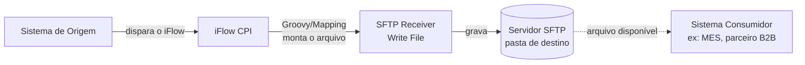
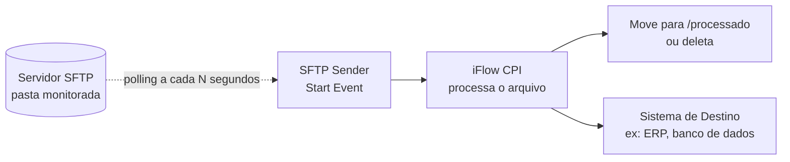
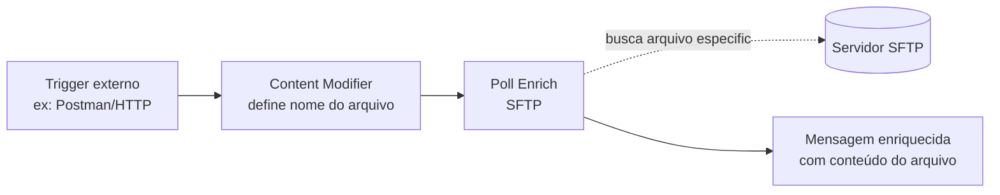

# 📁 D3 — SFTP Adapter (Integração de Arquivos)

> **Bloco:** D — Padrões de Integração Avançados
> **Cenário:** D3_SFTP_Producer (parte 1 concluída) + D3_SFTP_Consumer (próxima etapa)
> **iFlow técnico:** `D3_SFTP_Producer`
> **Status:** ✅ Producer concluído e testado (200 OK) | ⏳ Consumer a implementar
> **Data de execução:** 07/08/2026

---

## 📌 Contexto de Negócio

Este cenário simula a **liberação de uma Ordem de Produção no SAP** e o envio dessa informação para um **sistema MES** (Manufacturing Execution System), reproduzindo um padrão real e extremamente comum na indústria: a troca de arquivos via **hot folder** entre ERP e MES.

Na prática de mercado, essa integração normalmente ocorre via IDoc **LOIPRO03** (segmentos `E1AFKOL` para o cabeçalho da ordem e `E1AFPOL` para os itens), disparado no momento da liberação da ordem de produção, ou através de arquivos estruturados em XML seguindo padrões como o **B2MML** (ISA-95), quando o MES não possui uma interface RFC/IDoc nativa — muitos sistemas MES (como Opcenter e PAS-X) utilizam justamente pastas monitoradas (hot folders) para esse tipo de integração.

Como não temos acesso a um sistema SAP backend real neste laboratório, o cenário foi adaptado para **simular esse fluxo usando HTTP como gatilho** (representando a liberação da ordem no SAP) e um **servidor SFTP público de teste** (SFTPCloud) como hot folder do MES.

---

## 🧠 Conceitos: as 3 formas de trabalhar com SFTP no CPI

Antes de detalhar o cenário implementado, é importante entender as **três abordagens** possíveis com o adapter SFTP no SAP Integration Suite — cada uma resolve um problema diferente:

### 1️⃣ Receiver SFTP (o CPI **escreve** arquivos)

O CPI atua como cliente e **grava** um arquivo em um servidor SFTP remoto — normalmente como etapa final de um processo, entregando um resultado para outro sistema consumir.


**Uso típico:** SAP gera um arquivo (nota fiscal, ordem de produção, catálogo) e entrega para um parceiro ou MES externo buscar.

### 2️⃣ Sender SFTP (o CPI **lê** arquivos via polling)

O CPI atua como cliente também, mas nessa direção ele **verifica periodicamente** (polling) uma pasta remota em busca de arquivos novos, processa e geralmente move/apaga o arquivo após o processamento.


**Uso típico:** MES gera confirmações de produção em arquivo, e o CPI periodicamente as busca para atualizar o SAP.

### 3️⃣ Poll Enrich + SFTP (leitura sob demanda, no meio do fluxo)

Um padrão mais moderno: em vez do SFTP ser o gatilho do processo, ele é usado **no meio** de um iFlow disparado por outro evento (ex: HTTP), buscando um arquivo específico para enriquecer a mensagem.


**Uso típico:** buscar uma tabela de referência ou configuração específica sob demanda, sem manter um polling constante.

> 💡 **Neste laboratório, implementamos os padrões 1 e 2** (Receiver no Producer, Sender no Consumer), que juntos formam o clássico par **Producer/Consumer via arquivo** — já usado anteriormente no projeto com JMS (C3), agora com SFTP.

---

## 🏗️ Arquitetura completa do cenário D3

```mermaid
flowchart TB
    subgraph P["D3_SFTP_Producer  ✅ Concluído"]
        A["Postman<br/>POST Ordem de Produção"] -->|"HTTPS /d3sftp/producer"| B(["Start"])
        B --> C["Groovy Script 1<br/>Build Order File<br/>JSON → XML"]
        C --> D(["End 1"])
        D -->|"SFTP Receiver"| E[["Write File"]]
    end

    E -.grava arquivo XML.-> S[("Servidor SFTP<br/>SFTPCloud<br/>/hotfolder/Inbound")]

    subgraph Cn["D3_SFTP_Consumer  ⏳ Próxima etapa"]
        S -.>|"SFTP Sender<br/>Polling periódico"| F(["Start"])
        F --> G["Groovy Script<br/>Parse Order File<br/>+ Confirma Recebimento"]
        G --> H["Content Modifier<br/>Log: ORDEM_RECEBIDA_MES"]
        H --> I(["End"])
        I -.move arquivo.-> M[("/hotfolder/Processed")]
    end
```

---

## ⚙️ Configuração — D3_SFTP_Producer (implementado)

### 1. Sender HTTPS

| Campo | Valor |
|---|---|
| Address | `/d3sftp/producer` |
| Authorization | `User Role` |
| User Role | `ESBMessaging.send` |

### 2. Groovy Script 1 — Build Order File

```groovy
import com.sap.gateway.ip.core.customdev.util.Message
import groovy.json.JsonSlurper
import groovy.xml.MarkupBuilder
import java.time.LocalDateTime
import java.time.format.DateTimeFormatter

def Message processData(Message message) {
    def reader = message.getBody(java.io.Reader.class)
    def json = new JsonSlurper().parse(reader)
    def op = json.ordemProducao

    def timestamp = LocalDateTime.now().format(DateTimeFormatter.ofPattern("yyyyMMdd_HHmmss"))
    def fileName = "OP_${op.numeroOrdem}_${timestamp}.xml".toString()

    def writer = new StringWriter()
    def xml = new MarkupBuilder(writer)
    xml.ordemProducao {
        numeroOrdem(op.numeroOrdem)
        tipoOrdem(op.tipoOrdem)
        material(op.material)
        descricaoMaterial(op.descricaoMaterial)
        quantidade(op.quantidade)
        unidadeMedida(op.unidadeMedida)
        centroTrabalho(op.centroTrabalho)
        dataLiberacao(op.dataLiberacao)
        dataInicioBase(op.dataInicioBase)
        dataFimBase(op.dataFimBase)
        statusOrdem(op.statusOrdem)
        centro(op.centro)
        deposito(op.deposito)
        origem("SAP_ECC_SIMULADO")
        geradoEm(timestamp)
    }

    message.setBody(writer.toString())
    message.setHeader("CamelFileName", fileName)
    message.setProperty("fileName", fileName)
    message.setHeader("Content-Type", "application/xml")

    return message
}
```

### 3. SFTP Receiver — Write File

| Campo (aba Target) | Valor |
|---|---|
| Directory | `/hotfolder/Inbound` |
| File Name | `${header.CamelFileName}` |
| Address | `us-east-1.sftpcloud.io:22` |
| Proxy Type | `Internet` |
| Authentication | `User Name/Password` |
| Credential Name | `SFTPCloud_Credential` |

### 4. Segurança configurada (Security Material)

| Nome | Tipo | Finalidade |
|---|---|---|
| `SFTPCloud_Credential` | User Credentials | Usuário/senha de acesso ao servidor SFTP |
| `known.hosts` | SSH Known Hosts | Host key do servidor, obtido via **Connectivity Test → SSH** direto no CPI (evita erro de digitação e garante a chave completa) |

---

## 🧪 Teste (Postman)

**Request — POST `{{D3_SFTP_Producer}}`**
```json
{
  "ordemProducao": {
    "numeroOrdem": "OP-00045210",
    "tipoOrdem": "PP01",
    "material": "MAT-GEN-001",
    "descricaoMaterial": "Balanca Industrial XPTO",
    "quantidade": 500,
    "unidadeMedida": "UN",
    "centroTrabalho": "CT-MONTAGEM-01",
    "dataLiberacao": "2026-08-07",
    "dataInicioBase": "2026-08-08T06:00:00",
    "dataFimBase": "2026-08-10T18:00:00",
    "statusOrdem": "LIBERADA",
    "centro": "1000",
    "deposito": "MES01"
  }
}
```

**Response — 200 OK** *(retorna o próprio arquivo XML gravado, já que o processo é síncrono)*
```xml
<ordemProducao>
  <numeroOrdem>OP-00045210</numeroOrdem>
  <tipoOrdem>PP01</tipoOrdem>
  <material>MAT-GEN-001</material>
  <descricaoMaterial>Balanca Industrial XPTO</descricaoMaterial>
  <quantidade>500</quantidade>
  <unidadeMedida>UN</unidadeMedida>
  <centroTrabalho>CT-MONTAGEM-01</centroTrabalho>
  <dataLiberacao>2026-08-07</dataLiberacao>
  <dataInicioBase>2026-08-08T06:00:00</dataInicioBase>
  <dataFimBase>2026-08-10T18:00:00</dataFimBase>
  <statusOrdem>LIBERADA</statusOrdem>
  <centro>1000</centro>
  <deposito>MES01</deposito>
  <origem>SAP_ECC_SIMULADO</origem>
  <geradoEm>20260807_204712</geradoEm>
</ordemProducao>
```

---

## 📸 Evidências

> 📁 Pasta: [`evidences/lab16`](../evidences/lab16)

### 01 — Postman: envio e resposta 200 OK

Requisição POST enviada ao endpoint `{{D3_SFTP_Producer}}` com o payload JSON da Ordem de Produção liberada. A resposta `200 OK` retorna o próprio arquivo XML gerado pelo Groovy Script, confirmando que a conversão JSON → XML e a gravação no servidor SFTP ocorreram com sucesso.


### 02 — Monitor: fluxo de mensagens no Trace

Visualização do `Integration Flow Model` no Monitor de Mensagens, mostrando o caminho percorrido pela mensagem: Start → Groovy Script 1 → End 1 → SFTP (gravação no servidor externo), sem nenhum erro nas 5 etapas do processamento.


### 03 — Configuração da conexão SFTP Receiver

Configuração do canal Receiver SFTP, com o diretório de destino `/hotfolder/Inbound`, nome de arquivo dinâmico baseado no header `CamelFileName`, e autenticação via `User Name/Password` referenciando a credencial `SFTPCloud_Credential` armazenada no Security Material.


### 04 — Message Content: payload JSON recebido (antes do Groovy)

Conteúdo do payload recebido pelo Sender HTTPS, antes do processamento pelo Groovy Script — o JSON original da Ordem de Produção enviado via Postman.


### 05 — Message Content: payload XML final (antes da gravação SFTP)

Conteúdo do payload já convertido para XML pelo Groovy Script 1, imediatamente antes de ser gravado no servidor SFTP — confirmando a estrutura completa do arquivo da Ordem de Produção com todos os campos e o timestamp de geração.


---

## 🔍 Troubleshooting & Lições Aprendidas

### `GStringImpl cannot be cast to class java.lang.String` (erro no header, não no body)

**Causa:** o header `CamelFileName`, usado pelo adapter SFTP para nomear o arquivo, foi montado com interpolação de string (`"OP_${op.numeroOrdem}_${timestamp}.xml"`), gerando um objeto `GStringImpl` em vez de `String` puro. Diferente dos erros anteriores do D2 (que ocorriam no **body**), dessa vez o problema estava no **header** — o adapter SFTP não conseguiu usar esse valor para nomear o arquivo, resultando em `ClassCastException`.

**Solução:** aplicar `.toString()` explicitamente também em valores usados como **header**, não apenas no body:
```groovy
def fileName = "OP_${op.numeroOrdem}_${timestamp}.xml".toString()
```

> 💡 **Nota conceitual para o portfólio**: a regra "sempre finalizar com `.toString()` valores montados por interpolação de string" vale tanto para `message.setBody(...)` quanto para `message.setHeader(...)` — qualquer ponto onde o Camel/CPI espera um `java.lang.String` real pode falhar com `GStringImpl`.

### Conexão de linha direta entre Script e Receiver não é permitida

**Causa:** ao tentar conectar o `Groovy Script 1` diretamente ao participante `Receiver` (sem um elemento `End` entre eles), o editor do CPI não permite finalizar a conexão — o clique/arraste simplesmente não "gruda" no Receiver.

**Solução:** todo processo do Integration Process deve terminar em um elemento **`End`** antes de se conectar a um adapter externo (Receiver). O padrão correto é: `... → Groovy Script → End → (Adapter) → Receiver`, confirmado também no cenário `C3_Producer` (JMS) já documentado anteriormente no projeto.

---

## ⏭️ Próxima etapa: D3_SFTP_Consumer

Para completar o cenário de ponta a ponta, falta implementar o iFlow **D3_SFTP_Consumer**, que irá:
1. Usar o **Sender SFTP** com polling periódico na pasta `/hotfolder/Inbound`
2. Ler o arquivo XML da Ordem de Produção gravado pelo Producer
3. Processar via Groovy, simulando a "geração da ordem no MES" (enriquecendo com `statusIntegracao: ORDEM_RECEBIDA_MES`, `recebidoEm`, `idOrdemMES`)
4. Mover o arquivo processado para `/hotfolder/Processed`

---

## 🛠️ Ferramentas utilizadas

- **SAP Integration Suite** (Cloud Integration – Trial)
- **Postman** (collection `D3_SFTP_Producer`, variáveis `{{base_url}}`/`{{clientid}}`/`{{clientsecret}}`)
- **SFTPCloud** — servidor SFTP gratuito de teste (7 dias, sem cartão de crédito) — [sftpcloud.io](https://sftpcloud.io/)

---

## 👤 Autor

**Orlando Caetano**
🔗 [LinkedIn](https://www.linkedin.com/in/orlando-caetano/) | 💻 [GitHub](https://github.com/OrlandoCaetano2026)
