# 📁 D3 — SFTP Adapter (Integração de Arquivos)

> **Bloco:** D — Padrões de Integração Avançados
> **Cenário:** D3_SFTP_Producer + D3_SFTP_Consumer (2 iFlows independentes)
> **Status:** ✅ Concluído e testado de ponta a ponta
> **Data de execução:** 07 e 10/08/2026

---

## 📌 Contexto de Negócio

Este cenário simula a **liberação de uma Ordem de Produção no SAP** e o envio dessa informação para um **sistema MES** (Manufacturing Execution System), reproduzindo um padrão real e extremamente comum na indústria: a troca de arquivos via **hot folder** entre ERP e MES.

Na prática de mercado, essa integração normalmente ocorre via IDoc **LOIPRO03** (segmentos `E1AFKOL` para o cabeçalho da ordem e `E1AFPOL` para os itens), disparado no momento da liberação da ordem de produção, ou através de arquivos estruturados em XML seguindo padrões como o **B2MML** (ISA-95), quando o MES não possui uma interface RFC/IDoc nativa — muitos sistemas MES (como Opcenter e PAS-X) utilizam justamente pastas monitoradas (hot folders) para esse tipo de integração.

Como não temos acesso a um sistema SAP backend real neste laboratório, o cenário foi adaptado para **simular esse fluxo usando HTTP como gatilho** (representando a liberação da ordem no SAP) e um **servidor SFTP público de teste** (SFTPCloud) como hot folder do MES.

---

## 🧠 Conceitos: as 3 formas de trabalhar com SFTP no CPI

Antes de detalhar a implementação, é importante entender as **três abordagens** possíveis com o adapter SFTP no SAP Integration Suite — cada uma resolve um problema diferente:

### 1️⃣ Receiver SFTP (o CPI **escreve** arquivos)

O CPI atua como cliente e **grava** um arquivo em um servidor SFTP remoto — normalmente como etapa final de um processo, entregando um resultado para outro sistema consumir.

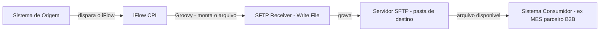

**Uso típico:** SAP gera um arquivo (nota fiscal, ordem de produção, catálogo) e entrega para um parceiro ou MES externo buscar. **É o padrão implementado no D3_SFTP_Producer.**

### 2️⃣ Sender SFTP (o CPI **lê** arquivos via polling)

O CPI atua como cliente também, mas nessa direção ele **verifica periodicamente** (polling) uma pasta remota em busca de arquivos novos, processa e geralmente move/apaga o arquivo após o processamento.

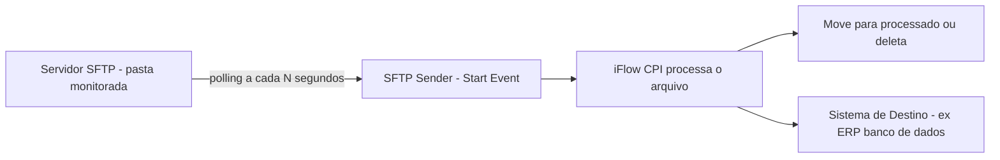

**Uso típico:** MES gera confirmações de produção em arquivo, e o CPI periodicamente as busca para atualizar o SAP. **É o padrão implementado no D3_SFTP_Consumer.**

### 3️⃣ Poll Enrich + SFTP (leitura sob demanda, no meio do fluxo)

Um padrão mais moderno: em vez do SFTP ser o gatilho do processo, ele é usado **no meio** de um iFlow disparado por outro evento (ex: HTTP), buscando um arquivo específico para enriquecer a mensagem.

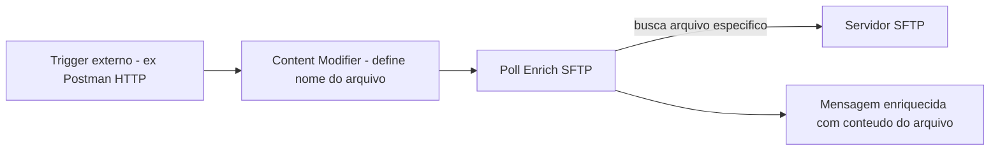

**Uso típico:** buscar uma tabela de referência ou configuração específica sob demanda, sem manter um polling constante. Não implementado neste laboratório, mas documentado aqui como referência conceitual.

> 💡 **Por que 2 iFlows separados?** Cada iFlow tem apenas **um** evento de início (Start Event). Como o Producer é disparado por **HTTP** (sob demanda) e o Consumer é disparado por **SFTP Polling** (automático, contínuo), não é possível combinar os dois no mesmo iFlow — isso reflete exatamente a realidade de dois sistemas fisicamente diferentes (SAP e MES), cada um com seu próprio ciclo de processamento.

---

## 🏗️ Arquitetura completa do cenário D3

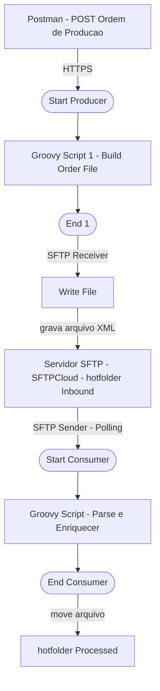

---

## 🔧 D3_SFTP_Producer — Implementação Passo a Passo

### Passo 1 — Sender HTTPS

O ponto de entrada do iFlow simula o SAP disparando a liberação da ordem:

| Campo | Valor |
|---|---|
| Address | `/d3sftp/producer` |
| Authorization | `User Role` |
| User Role | `ESBMessaging.send` |

### Passo 2 — Groovy Script 1: Build Order File

Este script recebe o JSON da Ordem de Produção e converte para um arquivo XML, gerando também um nome de arquivo dinâmico baseado no número da ordem e timestamp:

```groovy
import com.sap.gateway.ip.core.customdev.util.Message
import groovy.json.JsonSlurper
import groovy.xml.MarkupBuilder
import java.time.LocalDateTime
import java.time.format.DateTimeFormatter

def Message processData(Message message) {
    def reader = message.getBody(java.io.Reader.class)
    def json = new JsonSlurper().parse(reader)
    def op = json.ordemProducao

    def timestamp = LocalDateTime.now().format(DateTimeFormatter.ofPattern("yyyyMMdd_HHmmss"))
    def fileName = "OP_${op.numeroOrdem}_${timestamp}.xml".toString()

    def writer = new StringWriter()
    def xml = new MarkupBuilder(writer)
    xml.ordemProducao {
        numeroOrdem(op.numeroOrdem)
        tipoOrdem(op.tipoOrdem)
        material(op.material)
        descricaoMaterial(op.descricaoMaterial)
        quantidade(op.quantidade)
        unidadeMedida(op.unidadeMedida)
        centroTrabalho(op.centroTrabalho)
        dataLiberacao(op.dataLiberacao)
        dataInicioBase(op.dataInicioBase)
        dataFimBase(op.dataFimBase)
        statusOrdem(op.statusOrdem)
        centro(op.centro)
        deposito(op.deposito)
        origem("SAP_ECC_SIMULADO")
        geradoEm(timestamp)
    }

    message.setBody(writer.toString())
    message.setHeader("CamelFileName", fileName)
    message.setProperty("fileName", fileName)
    message.setHeader("Content-Type", "application/xml")

    return message
}
```

### Passo 3 — SFTP Receiver: Write File

O `End 1` se conecta ao participante `Receiver` via adapter **SFTP**, gravando o arquivo gerado no hot folder do MES:

| Campo (aba Target) | Valor |
|---|---|
| Directory | `/hotfolder/Inbound` |
| File Name | *(deixado em branco — ver Troubleshooting)* |
| Address | `us-east-1.sftpcloud.io:22` |
| Proxy Type | `Internet` |
| Authentication | `User Name/Password` |
| Credential Name | `SFTPCloud_Credential` |

**Segurança configurada (Security Material):**

| Nome | Tipo | Finalidade |
|---|---|---|
| `SFTPCloud_Credential` | User Credentials | Usuário/senha de acesso ao servidor SFTP |
| `known.hosts` | SSH Known Hosts | Host key do servidor, obtido via **Connectivity Test → SSH** direto no CPI |

<a href="../evidences/lab16/03-sftp-receiver-connection-config.png" target="_blank">
  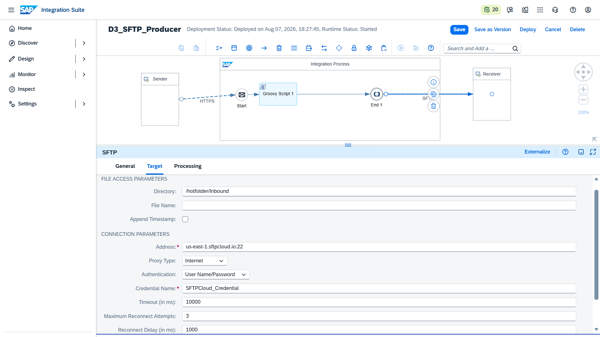
</a>

*Configuração do canal Receiver SFTP: diretório de destino `/hotfolder/Inbound` e autenticação via `User Name/Password` referenciando a credencial `SFTPCloud_Credential`.*

### Passo 4 — Teste no Postman

Com o iFlow implantado, disparamos a liberação da Ordem de Produção:

**Request — POST `{{D3_SFTP_Producer}}`**
```json
{
  "ordemProducao": {
    "numeroOrdem": "OP-00045210",
    "tipoOrdem": "PP01",
    "material": "MAT-GEN-001",
    "descricaoMaterial": "Balanca Industrial XPTO",
    "quantidade": 500,
    "unidadeMedida": "UN",
    "centroTrabalho": "CT-MONTAGEM-01",
    "dataLiberacao": "2026-08-07",
    "dataInicioBase": "2026-08-08T06:00:00",
    "dataFimBase": "2026-08-10T18:00:00",
    "statusOrdem": "LIBERADA",
    "centro": "1000",
    "deposito": "MES01"
  }
}
```

<a href="../evidences/lab16/01-postman-producer-200-ok-xml.png" target="_blank">
  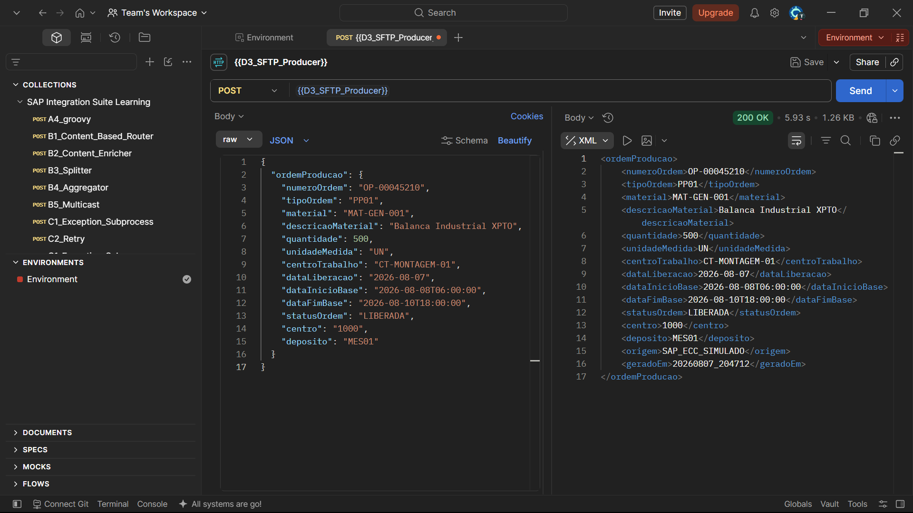
</a>

*Resposta `200 OK` retornando o próprio arquivo XML gerado pelo Groovy Script, confirmando que a conversão JSON → XML ocorreu com sucesso.*

### Passo 5 — Validação no Monitor (Trace)

No **Monitor → Message Processing**, acompanhamos o caminho completo da mensagem:

<a href="../evidences/lab16/02-monitor-trace-message-flow.png" target="_blank">
  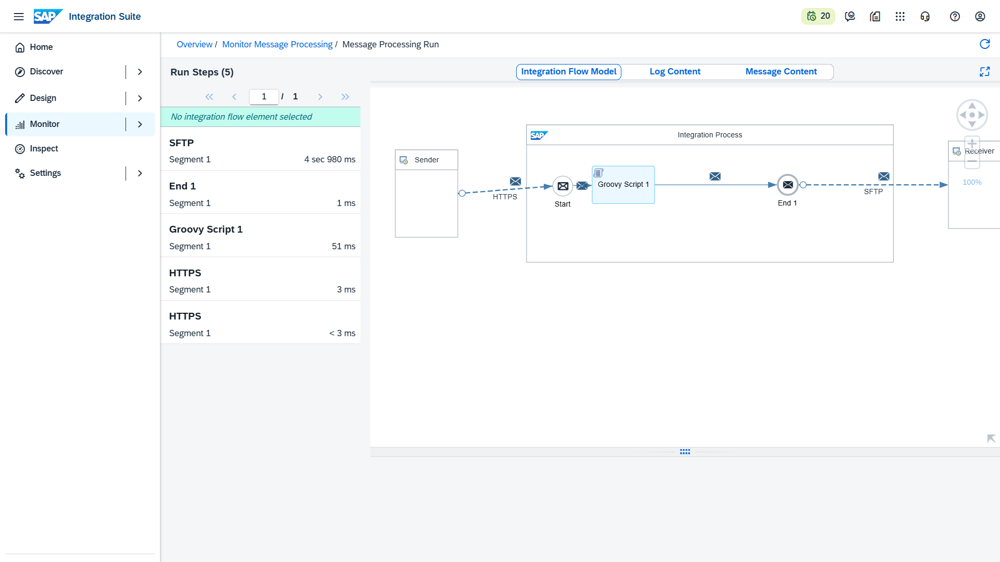
</a>

*`Integration Flow Model` mostrando o caminho percorrido: Start → Groovy Script 1 → End 1 → SFTP, sem erros nas 5 etapas do processamento.*

Analisando o conteúdo da mensagem em cada etapa, confirmamos a entrada (JSON) e a saída (XML) do Groovy Script:

<a href="../evidences/lab16/04-message-content-http-request-json.png" target="_blank">
  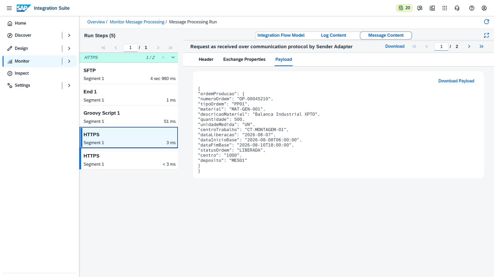
</a>

*Payload JSON original da Ordem de Produção, recebido pelo Sender HTTPS antes do processamento.*

<a href="../evidences/lab16/05-message-content-sftp-final-xml.png" target="_blank">
  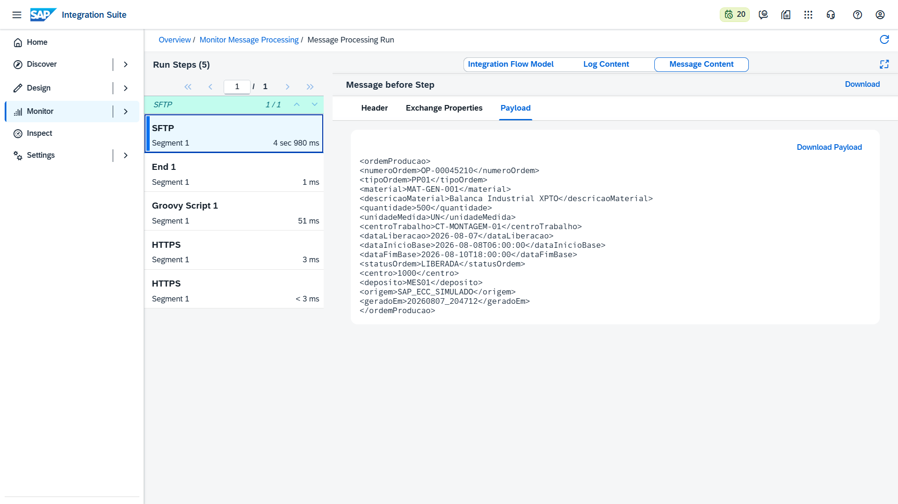
</a>

*Payload já convertido para XML pelo Groovy Script 1, imediatamente antes de ser gravado no servidor SFTP.*

---

## 🔍 Troubleshooting & Lições Aprendidas — Producer

### 1. `GStringImpl cannot be cast to class java.lang.String` (erro no header, não no body)

**Causa:** o header `CamelFileName`, usado pelo adapter SFTP para nomear o arquivo, foi montado com interpolação de string (`"OP_${op.numeroOrdem}_${timestamp}.xml"`), gerando um objeto `GStringImpl` em vez de `String` puro. Diferente dos erros do cenário D2 (que ocorriam no **body**), dessa vez o problema estava no **header** — o adapter SFTP não conseguiu usar esse valor para nomear o arquivo, resultando em `ClassCastException`.

**Solução:** aplicar `.toString()` explicitamente também em valores usados como **header**, não apenas no body:
```groovy
def fileName = "OP_${op.numeroOrdem}_${timestamp}.xml".toString()
```

### 2. Nome do arquivo gravado literalmente como `${header.CamelFileName}`

**Causa:** mesmo após corrigir o `.toString()`, o primeiro teste no servidor SFTP revelou um segundo problema: o campo **File Name** do canal Receiver estava preenchido manualmente com o texto `${header.CamelFileName}`, mas o adapter **gravou esse texto literal** como nome do arquivo, em vez de resolver a expressão.

Segundo a documentação oficial da SAP: *"If you do not enter a file name and the parameter remains blank, the content of the CamelFileName header is used as file name."*

**Solução:** deixar o campo **File Name** completamente **vazio** no canal SFTP Receiver — o CPI usa automaticamente o header `CamelFileName` já definido no Groovy Script.

### 3. Conexão de linha direta entre Script e Receiver não é permitida

**Causa:** ao tentar conectar o `Groovy Script 1` diretamente ao participante `Receiver` (sem um elemento `End` entre eles), o editor do CPI não permite finalizar a conexão.

**Solução:** todo processo do Integration Process deve terminar em um elemento **`End`** antes de se conectar a um adapter externo (Receiver): `... → Groovy Script → End → (Adapter) → Receiver`.

### Confirmação final — arquivo corretamente nomeado no servidor

Após as correções, reenviamos o teste e validamos diretamente no painel do **SFTPCloud** — uma confirmação **externa** ao CPI, reforçando a credibilidade da evidência:

<a href="../evidences/lab16/06-sftpcloud-directory-activity-confirmed.png" target="_blank">
  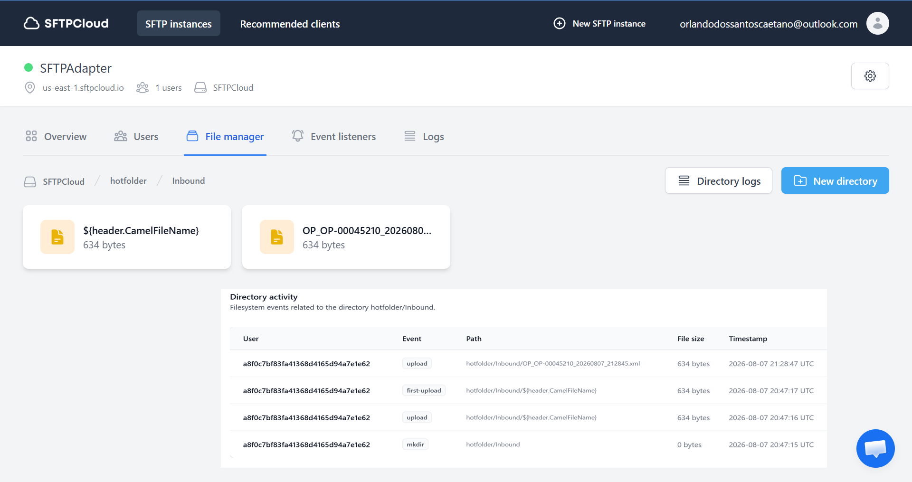
</a>

*Log de auditoria do servidor SFTP (`Directory activity`) mostrando a evolução: o primeiro arquivo gravado com o bug (`${header.CamelFileName}`), e o arquivo seguinte já corretamente nomeado como `OP_OP-00045210_20260807_212845.xml`, confirmando a correção do File Name em branco.*

---

## 🔧 D3_SFTP_Consumer — Implementação Passo a Passo

Com o Producer validado de ponta a ponta, avançamos para o segundo iFlow do cenário: o **Consumer**, que simula o sistema MES monitorando o hot folder e processando automaticamente cada Ordem de Produção recebida.

### Passo 1 — Sender SFTP (Start Event via Polling)

Diferente do Producer — onde o HTTP era o gatilho —, aqui o **próprio SFTP é quem inicia o processo**. O CPI assume o papel de cliente que fica verificando periodicamente a pasta do hot folder, sem depender de nenhum disparo externo (Postman, por exemplo).

**Aba Source** — define de onde e quais arquivos ler:

| Campo | Valor |
|---|---|
| Directory | `/hotfolder/Inbound` |
| Regex Filtering | Desmarcado |
| File Name | `OP_*.xml` |
| Address | `us-east-1.sftpcloud.io:22` |
| Proxy Type | `Internet` |
| Authentication | `User Name/Password` |
| Credential Name | `SFTPCloud_Credential` |

<a href="../evidences/lab16/07-sftp-sender-source-config.png" target="_blank">
  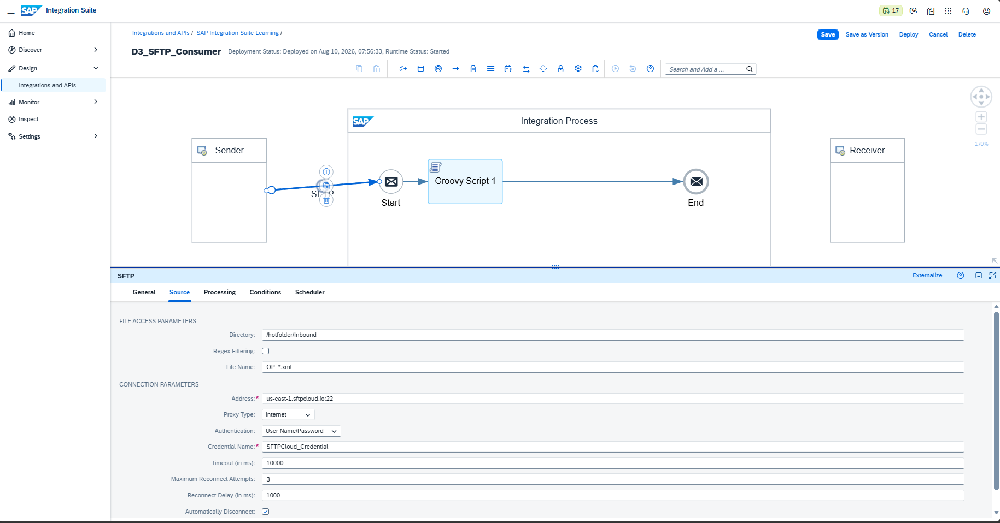
</a>

*Configuração da aba Source do canal Sender SFTP: o filtro `File Name: OP_*.xml` garante que apenas arquivos gerados pelo Producer sejam processados, ignorando qualquer outro arquivo (como o resíduo com nome incorreto `${header.CamelFileName}` que ficou órfão na pasta durante o troubleshooting do Producer). O Directory aponta para a mesma pasta `/hotfolder/Inbound` onde o Producer grava os arquivos, fechando a ponte entre os dois iFlows.*

**Aba Processing** — define o comportamento após o processamento:

| Campo | Valor |
|---|---|
| Read Lock Strategy | `None` |
| Empty File Handling | `Process Empty File` |
| Max. Messages per Poll | `20` |
| Lock Timeout (in min) | `15` |
| Post-Processing | `Move File` |
| Archive Directory | `/hotfolder/Processed` |

<a href="../evidences/lab16/08-sftp-sender-processing-config.png" target="_blank">
  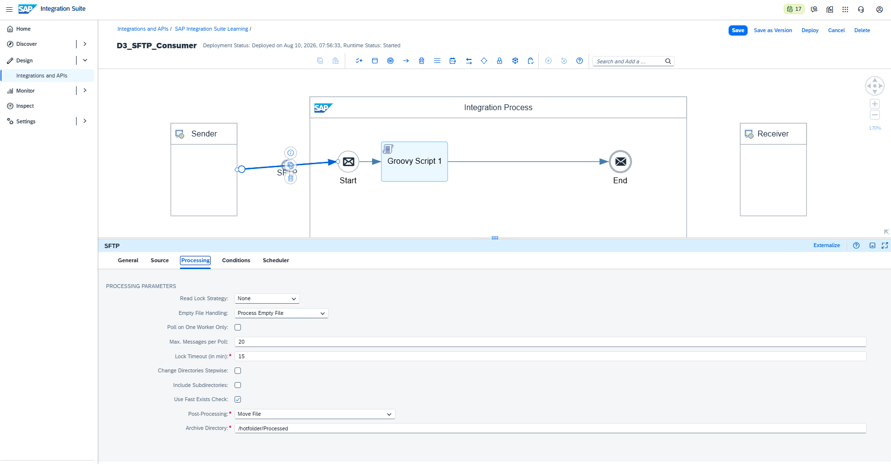
</a>

*Configuração da aba Processing: o campo `Post-Processing: Move File` com `Archive Directory: /hotfolder/Processed` garante que, após o processamento bem-sucedido, o arquivo seja automaticamente removido da pasta de entrada e movido para a pasta de processados — evitando reprocessamento do mesmo arquivo em ciclos futuros de polling.*

**Aba Scheduler** — define a frequência do polling:

| Campo | Valor |
|---|---|
| Schedule to Recur | `Daily` |
| Every | `10 sec` |
| Between | `00:00` e `24:00` |
| Time Zone | `(UTC 0:00) Greenwich Mean Time (Etc/GMT)` |

<a href="../evidences/lab16/09-sftp-sender-scheduler-config.png" target="_blank">
  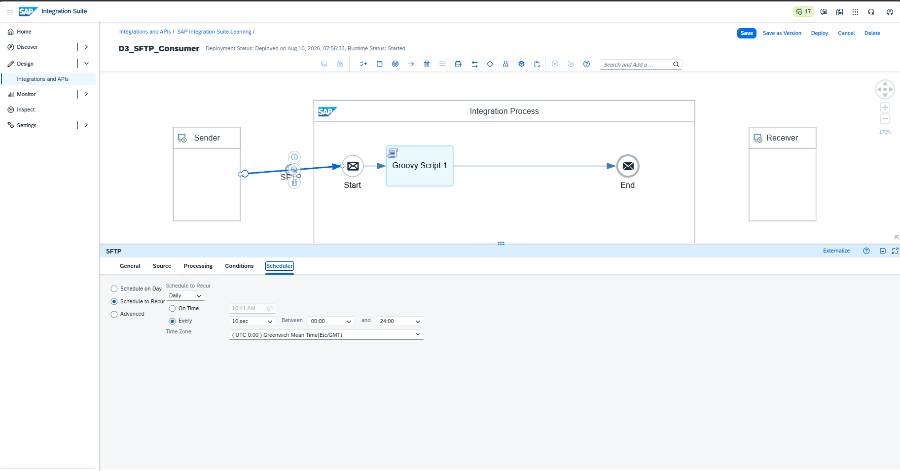
</a>

*Configuração da aba Scheduler: o iFlow verifica a pasta `/hotfolder/Inbound` a cada 10 segundos, durante as 24 horas do dia — simulando o comportamento contínuo de vigilância que um conector real de MES manteria sobre o hot folder.*

### Passo 2 — Groovy Script: Parse e Enriquecer

Este script lê o XML da Ordem de Produção (gerado pelo Producer), faz o parse do conteúdo e simula a confirmação de recebimento pelo MES, adicionando três campos de rastreabilidade: um identificador próprio do MES (`idOrdemMES`), o status da integração e o timestamp de recebimento.

```groovy
import com.sap.gateway.ip.core.customdev.util.Message
import groovy.util.XmlSlurper

def Message processData(Message message) {
    def body = message.getBody(String)
    def op = new XmlSlurper().parseText(body)

    def recebidoEm = new Date().format("yyyy-MM-dd'T'HH:mm:ss")
    def idOrdemMES = "MES-${op.numeroOrdem.text()}".toString()

    def sb = new StringBuilder()
    sb.append("<ordemProducaoMES>")
    sb.append("<idOrdemMES>${idOrdemMES}</idOrdemMES>")
    sb.append("<numeroOrdemSAP>${op.numeroOrdem.text()}</numeroOrdemSAP>")
    sb.append("<material>${op.material.text()}</material>")
    sb.append("<descricaoMaterial>${op.descricaoMaterial.text()}</descricaoMaterial>")
    sb.append("<quantidade>${op.quantidade.text()}</quantidade>")
    sb.append("<centroTrabalho>${op.centroTrabalho.text()}</centroTrabalho>")
    sb.append("<statusIntegracao>ORDEM_RECEBIDA_MES</statusIntegracao>")
    sb.append("<recebidoEm>${recebidoEm}</recebidoEm>")
    sb.append("</ordemProducaoMES>")

    message.setBody(sb.toString())
    message.setHeader("Content-Type", "application/xml")

    return message
}
```

### Passo 3 — Conectar os elementos

`Sender → (SFTP) → Start → Groovy Script 1 → End`, sem adapter de saída — esse iFlow apenas consome, processa e finaliza, não precisando de um `Receiver` externo.

### Passo 4 — Validação no Monitor (Trace)

Com o iFlow implantado (`Deployment Status: Deployed`, `Runtime Status: Started`), o polling entrou em ação automaticamente e capturou o arquivo `OP_OP-00045210_...xml` que já estava aguardando na pasta desde o teste do Producer — sem qualquer disparo manual do nosso lado.

<a href="../evidences/lab16/10-monitor-trace-consumer-flow.png" target="_blank">
  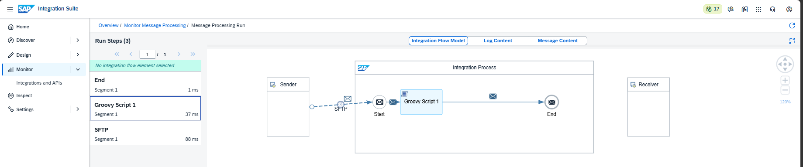
</a>

*`Integration Flow Model` do Consumer mostrando os 3 Run Steps do processamento: `SFTP` (leitura do arquivo, 88 ms) → `Groovy Script 1` (enriquecimento, 37 ms) → `End` (1 ms), todos concluídos com sucesso. A seta pontilhada entre Sender e Start confirma que o SFTP atuou como evento de início (polling), diferente da seta sólida usada nas conexões internas do processo.*

Analisando o conteúdo da mensagem **antes** do Groovy Script (ou seja, exatamente como foi lido do servidor SFTP):

<a href="../evidences/lab16/11-message-content-input-order-xml.png" target="_blank">
  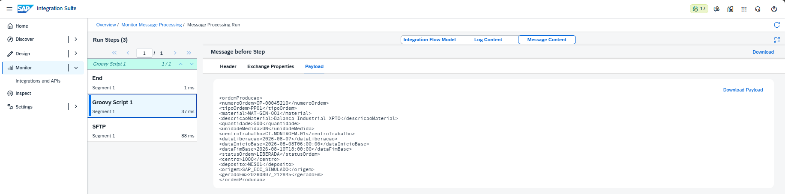
</a>

*Payload correspondente ao arquivo `OP_OP-00045210_...xml`, no formato original gerado pelo Producer (`<ordemProducao>` com os campos `numeroOrdem`, `material`, `quantidade`, etc.) — confirmando que o Consumer conseguiu ler corretamente o arquivo do hot folder.*

E o conteúdo final, já processado pelo Groovy Script e disponível no `End`:

<a href="../evidences/lab16/12-message-content-output-mes-enriched.png" target="_blank">
  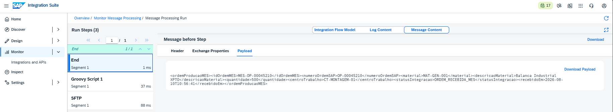
</a>

*Payload final `<ordemProducaoMES>` contendo o `idOrdemMES` gerado (`MES-OP-00045210`), o `numeroOrdemSAP` de referência cruzada, os dados replicados da ordem original, e os dois campos de rastreabilidade adicionados pelo MES: `statusIntegracao: ORDEM_RECEBIDA_MES` e `recebidoEm: 2026-08-10T10:56:41` — essa é a mensagem que, num cenário real, seria persistida no banco de dados do MES ou usada para disparar a próxima etapa do processo produtivo.*

### Passo 5 — Confirmação externa no servidor SFTP

Por fim, validamos diretamente no painel do **SFTPCloud** que o arquivo processado foi efetivamente movido da pasta de entrada para a pasta de processados, confirmando que a configuração `Post-Processing: Move File` funcionou como esperado:

<a href="../evidences/lab16/13-sftpcloud-processed-folder-confirmed.png" target="_blank">
  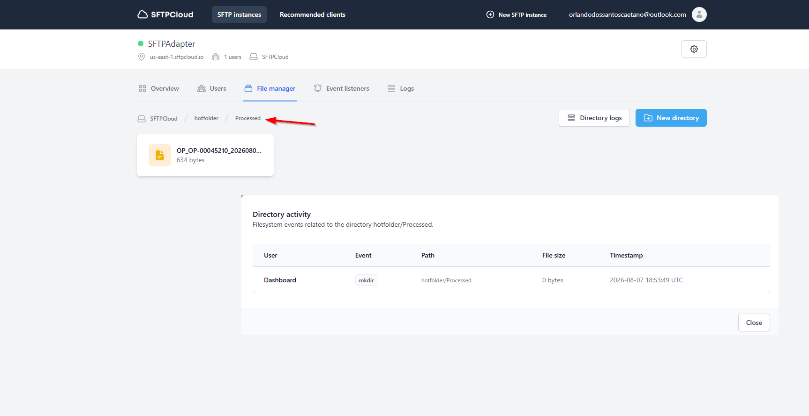
</a>

*File Manager do SFTPCloud navegando até `hotfolder/Processed`, exibindo o arquivo `OP_OP-00045210_2026080...` (634 bytes) já movido para essa pasta pelo Consumer. O painel `Directory activity` (log de auditoria do próprio servidor, independente do CPI) registra o evento `mkdir` de criação da pasta `hotfolder/Processed`, reforçando — com uma fonte externa ao SAP — que o ciclo completo Producer → hot folder → Consumer → arquivo processado funcionou de ponta a ponta.*

---

## 🔍 Troubleshooting & Lições Aprendidas — Consumer

### `MissingPropertyException: No such property: LocalDateTime`

**Causa:** ao colar o código do Groovy Script em formato de texto puro (sem os delimitadores de bloco de código), as linhas de `import` do início do script (incluindo `java.time.LocalDateTime` e `java.time.format.DateTimeFormatter`) acabaram se perdendo na colagem, restando apenas o corpo da função. Sem o import, a classe `LocalDateTime` deixou de ser reconhecida, gerando o erro em **14 tentativas consecutivas** de polling (uma a cada ciclo de 10 segundos).

**Solução:** reescrever o script eliminando a dependência de `java.time` e usando a API nativa e mais simples do Groovy/JDK para data, que não exige importação adicional:
```groovy
def recebidoEm = new Date().format("yyyy-MM-dd'T'HH:mm:ss")
```

> 💡 **Nota conceitual para o portfólio**: sempre que colar um script Groovy inteiro em uma ferramenta de chat ou editor de texto simples, revisar atentamente as primeiras linhas (imports) e a última linha (`return message`) — são os trechos mais suscetíveis a se perderem em copy-paste sem os marcadores de bloco de código.

### Arquivo órfão com nome inválido nunca é processado (comportamento esperado, não é bug)

Durante os testes, um arquivo remanescente do troubleshooting do Producer (`${header.CamelFileName}`, sem extensão `.xml` válida e fora do padrão `OP_*`) permaneceu na pasta `/hotfolder/Inbound` indefinidamente. Isso é o comportamento **correto**: o filtro `File Name: OP_*.xml` do Sender SFTP garante que apenas arquivos que sigam o padrão de nomenclatura esperado sejam capturados pelo polling, evitando que arquivos indevidos ou corrompidos sejam processados. A limpeza desse tipo de arquivo deve ser feita manualmente (ou via uma rotina de limpeza periódica, fora do escopo deste laboratório).

---

## ✅ Conclusão

O cenário D3 cobriu de ponta a ponta a **integração de arquivos via SFTP**, simulando a liberação de uma Ordem de Produção no SAP e sua entrega e confirmação de recebimento por um sistema MES via hot folder — um padrão real e amplamente utilizado na indústria quando não há interface RFC/IDoc nativa disponível. Foram implementados dois iFlows independentes (Producer e Consumer), refletindo a arquitetura real de dois sistemas distintos operando de forma assíncrona através de um ponto de integração compartilhado (o servidor SFTP).

**Recursos praticados:** SFTP Receiver Adapter · SFTP Sender Adapter com Polling · Post-Processing (Move File) · Security Material (User Credentials + SSH Known Hosts) · Conectividade com servidor SFTP externo · Groovy Script (montagem e parse de arquivo XML, geração de nome dinâmico, enriquecimento de mensagem) · Troubleshooting de conversão de tipos em headers e de imports Groovy

**Bloco anterior:** ./17-d2-soap-adapter.md

**Próximo cenário:** ./19-d4-processdirect.md

---

## 🛠️ Ferramentas utilizadas

- **SAP Integration Suite** (Cloud Integration – Trial)
- **Postman** (collection `D3_SFTP_Producer`, variáveis `{{base_url}}`/`{{clientid}}`/`{{clientsecret}}`)
- **SFTPCloud** — servidor SFTP gratuito de teste (7 dias, sem cartão de crédito) — [sftpcloud.io](https://sftpcloud.io/)

---

## 👤 Autor

**Orlando Caetano**
🔗 [LinkedIn](https://www.linkedin.com/in/orlando-caetano/) | 💻 [GitHub](https://github.com/OrlandoCaetano2026)
