# 🔗 D4 — ProcessDirect Adapter (Comunicação Interna entre iFlows)

> **Bloco:** D — Padrões de Integração Avançados
> **Cenário:** D4_ProcessDirect_Main + D4_ProcessDirect_VendorValidation (2 iFlows independentes)
> **Status:** ✅ Concluído e testado de ponta a ponta (3 cenários de negócio validados)
> **Data de execução:** 10/08/2026

---

## 📌 Contexto de Negócio

Este cenário simula a **criação de um Pedido de Compras no SAP MM**, aplicando duas regras reais de validação de fornecedor antes de permitir que o pedido siga adiante — exatamente como o SAP faz nativamente ao criar uma cotação ou pedido de compras:

> *"When a quotation or purchase order is created, the system checks whether a quality info record is required and available for the combination of material and vendor. The system also checks whether the vendor and material-vendor combination is blocked or released."*

Foram simulados dois mecanismos distintos de bloqueio, ambos conceitos reais do SAP:

1. **Bloqueio de Compras (Purchasing Block)** — fornecedor bloqueado a nível de Organização de Compras (campo `LFM1-SPERM` no cadastro do fornecedor).
2. **Bloqueio de Qualidade (Quality Info Record / QIR)** — fornecedor bloqueado por qualidade para um material específico, reproduzindo a mensagem real do SAP **"Vendor blocked for quality reasons, Message no. 06884"**, controlada via transações `QI01`/`QI02`.

Em vez de fixar essas regras dentro de um Groovy Script, a lógica de validação foi isolada em um **iFlow separado e reutilizável**, que consulta um banco de dados externo real (PostgreSQL, hospedado no Neon) — refletindo como, em projetos reais, esse tipo de regra de negócio compartilhada costuma ser centralizada e reutilizada por múltiplos fluxos de integração.

> 💡 **Observação de escopo:** originalmente, havia um cenário **D5 — JDBC Adapter** planejado separadamente. Como este cenário já combina **ProcessDirect + JDBC** de forma realista e robusta, o D5 foi incorporado ao D4, e o roadmap do projeto foi atualizado — não haverá mais um cenário D5 isolado.

---

## 🧠 Conceito: O que é o ProcessDirect Adapter?

Diferente de todos os adapters usados até agora neste projeto (HTTP, SOAP, SFTP, JMS) — que lidam com comunicação **externa** (fora do tenant CPI) — o **ProcessDirect** é um adapter **exclusivamente interno**, usado apenas para comunicação **entre iFlows dentro do mesmo tenant**. Ele permite que um iFlow chame outro como se fosse uma sub-rotina reutilizável, de forma **síncrona**, sem que a mensagem saia do runtime do CPI (não é uma chamada HTTP real, não passa por rede externa).

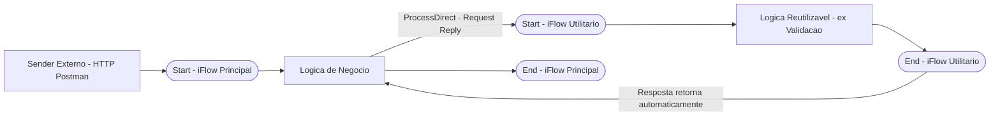

### Por que isso importa (e por que é relevante para a certificação)

| Conceito | Detalhe |
|---|---|
| **Endereçamento** | Não usa URL/host — usa um `Address` lógico (ex: `/vendorValidation`), único dentro do tenant |
| **Estilo de comunicação** | Sempre **síncrono** (Request-Reply) |
| **Performance** | Muito mais rápido que HTTP, pois nunca sai da JVM/rede interna |
| **Reuso** | O mesmo iFlow "utilitário" pode ser chamado por N iFlows diferentes |
| **Limitação** | Funciona apenas **dentro do mesmo tenant** — não serve para comunicação entre tenants ou sistemas externos |
| **Uso real de mercado** | Lógica de validação compartilhada, serviços centralizados de log/auditoria, quebra de iFlows grandes em módulos menores e testáveis |

### Por que 2 iFlows separados?

Cada iFlow tem exatamente **um** Evento de Início (Start Event). Como o `D4_ProcessDirect_Main` é disparado por **HTTP** (sob demanda, via Postman) e o `D4_ProcessDirect_VendorValidation` é disparado por **ProcessDirect** (uma chamada interna), eles não podem ser combinados em um único iFlow — o mesmo princípio arquitetural já aplicado no cenário D3 (SFTP Producer/Consumer).

---

## 🏗️ Arquitetura completa do cenário

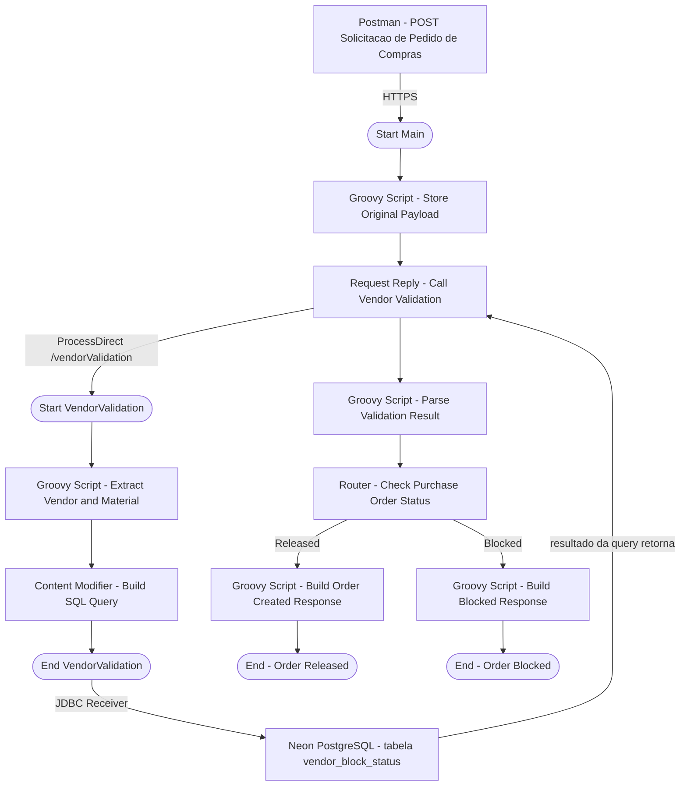

---

## 🔧 D4_ProcessDirect_Main — Configuração

### Passo 1 — Sender HTTPS

| Campo | Valor |
|---|---|
| Address | `/d4processdirect` |
| Authorization | `User Role` |
| User Role | `ESBMessaging.send` |

### Passo 2 — Groovy Script - Store Original Payload

Guarda o payload JSON de entrada como property, para poder ser reaproveitado depois na montagem da resposta final (tanto no ramo "Released" quanto no "Blocked"):

```groovy
import com.sap.gateway.ip.core.customdev.util.Message

def Message processData(Message message) {
    def body = message.getBody(String)
    message.setProperty("originalPayload", body)
    return message
}
```

### Passo 3 — Request Reply - Call Vendor Validation (ProcessDirect)

O step `Request Reply` chama o iFlow utilitário de forma síncrona via adapter **ProcessDirect**:

| Campo | Valor |
|---|---|
| Address | `/vendorValidation` |

> ⚠️ Esse endereço precisa ser **idêntico** ao configurado no lado Sender do `D4_ProcessDirect_VendorValidation` — caso contrário, a chamada falha com `No consumers available on endpoint`.

<a href="../evidences/lab17/01-iflow-main-processdirect-config.png" target="_blank">
  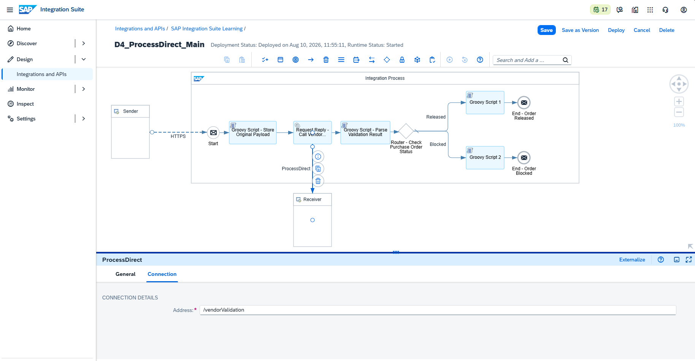
</a>

*Canvas completo do `D4_ProcessDirect_Main`, mostrando o fluxo completo (Start → Store Payload → Call Vendor Validation → Parse Result → Router → ramos Released/Blocked → respectivos End events), junto com a configuração do conector ProcessDirect apontando para `/vendorValidation`.*

### Passo 4 — Groovy Script - Parse Validation Result

Interpreta a resposta XML retornada pela consulta JDBC (executada dentro do iFlow utilitário) e decide se o Pedido de Compras pode ser criado:

```groovy
import com.sap.gateway.ip.core.customdev.util.Message
import groovy.util.XmlSlurper

def Message processData(Message message) {
    def body = message.getBody(String)
    def response = new XmlSlurper().parseText(body)
    def row = response.Statement1_response.row

    def purchasingBlock = row.purchasing_block.text() == "t"
    def qualityBlock = row.quality_block.text() == "t"
    def blockReason = row.block_reason.text()
    def canCreateOrder = !purchasingBlock && !qualityBlock

    message.setProperty("purchasingBlock", purchasingBlock)
    message.setProperty("qualityBlock", qualityBlock)
    message.setProperty("blockReason", blockReason)
    message.setProperty("canCreateOrder", canCreateOrder)

    return message
}
```

> 📌 Repare no caminho de navegação `response.Statement1_response.row` — o adapter JDBC sempre envelopa a resposta de um SELECT dentro de um elemento `<NomeDoStatement>_response>` (nesse caso, `Statement1_response`), e não em um `<row>` direto sob `<root>`. Esse é um detalhe importante do protocolo de mensagem **XML SQL Format** usado pelo adapter JDBC.

### Passo 5 — Router - Check Purchase Order Status

| Rota | Condição |
|---|---|
| **Released** | `${property.canCreateOrder} = 'true'` |
| **Blocked** | Caso contrário (rota padrão) |

<a href="../evidences/lab17/02-router-check-purchase-order-status-config.png" target="_blank">
  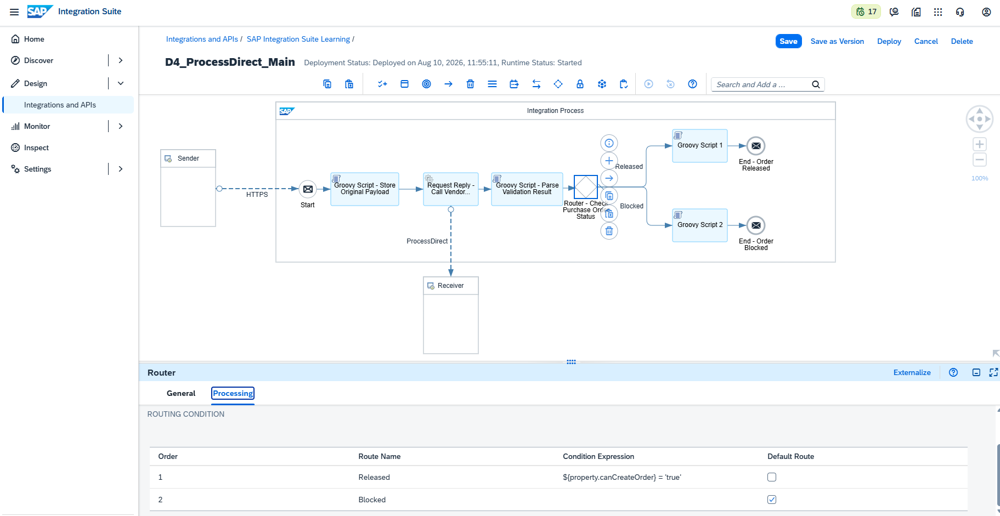
</a>

*Configuração do Router mostrando as duas rotas: `Released` (condição baseada na property `canCreateOrder`) e `Blocked` (rota padrão/otherwise), direcionando o fluxo da mensagem para o respectivo Groovy Script final e End event.*

### Passo 6 — Groovy Script - Build Order Created Response (rota Released)

```groovy
import com.sap.gateway.ip.core.customdev.util.Message
import groovy.json.JsonSlurper
import groovy.json.JsonBuilder

def Message processData(Message message) {
    def originalPayload = message.getProperty("originalPayload")
    def json = new JsonSlurper().parseText(originalPayload)

    def result = [
        purchaseOrder: [
            status: "CREATED",
            vendor: json.fornecedor,
            material: json.material,
            message: "Purchase Order created successfully"
        ]
    ]

    message.setBody(new JsonBuilder(result).toString())
    message.setHeader("Content-Type", "application/json")
    return message
}
```

### Passo 7 — Groovy Script - Build Blocked Response (rota Blocked)

```groovy
import com.sap.gateway.ip.core.customdev.util.Message
import groovy.json.JsonSlurper
import groovy.json.JsonBuilder

def Message processData(Message message) {
    def originalPayload = message.getProperty("originalPayload")
    def json = new JsonSlurper().parseText(originalPayload)
    def blockReason = message.getProperty("blockReason")

    def result = [
        purchaseOrder: [
            status: "BLOCKED",
            vendor: json.fornecedor,
            material: json.material,
            blockReason: blockReason
        ]
    ]

    message.setBody(new JsonBuilder(result).toString())
    message.setHeader("Content-Type", "application/json")
    return message
}
```

---

## 🔧 D4_ProcessDirect_VendorValidation — Configuração

Este é o iFlow "utilitário" reutilizável, responsável por consultar o status de bloqueio do fornecedor diretamente no banco de dados.

### Passo 1 — ProcessDirect Sender

| Campo | Valor |
|---|---|
| Address | `/vendorValidation` |

> 📌 Nota: o endereço do ProcessDirect deve seguir uma sintaxe estilo path, começando com `/` (ex: `/vendorValidation`) — uma sintaxe estilo `direct:nome` (comum em URIs Apache Camel puro) **não é aceita** pelo validador do CPI e gera erro em tempo de design.

### Passo 2 — Groovy Script - Extract Vendor and Material

```groovy
import com.sap.gateway.ip.core.customdev.util.Message
import groovy.json.JsonSlurper

def Message processData(Message message) {
    def reader = message.getBody(java.io.Reader.class)
    def json = new JsonSlurper().parse(reader)
    def vendor = json.fornecedor?.toString()
    def material = json.material?.toString()

    message.setProperty("vendor", vendor)
    message.setProperty("material", material)

    return message
}
```

<a href="../evidences/lab17/03-iflow-vendorvalidation-processdirect-config.png" target="_blank">
  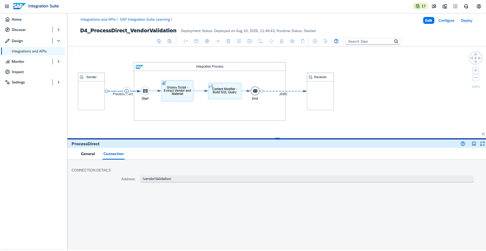
</a>

*Canvas completo do `D4_ProcessDirect_VendorValidation` (Start → Extract Vendor/Material → Build SQL Query → End → JDBC Receiver), junto com a configuração do Sender ProcessDirect, confirmando que o endereço `/vendorValidation` bate exatamente com o chamado a partir do iFlow Principal.*

### Passo 3 — Content Modifier - Build SQL Query

Em vez de montar a instrução XML SQL dentro de um Groovy Script (o que se mostrou muito propenso a erro devido a problemas de escape de aspas), a query foi movida para um **Content Modifier**, onde o XML é digitado literalmente no editor visual — eliminando qualquer risco de erro de escape de aspas:

```xml
<root>
  <Statement1>
    SELECT
      <table>vendor_block_status</table>
      <access>
        <vendor_id/>
        <material/>
        <purchasing_block/>
        <quality_block/>
        <block_reason/>
      </access>
      <key>
        <vendor_id>${property.vendor}</vendor_id>
        <material>${property.material}</material>
      </key>
    </vendor_block_status>
  </Statement1>
</root>
```

<a href="../evidences/lab17/04-content-modifier-build-sql-query-config.png" target="_blank">
  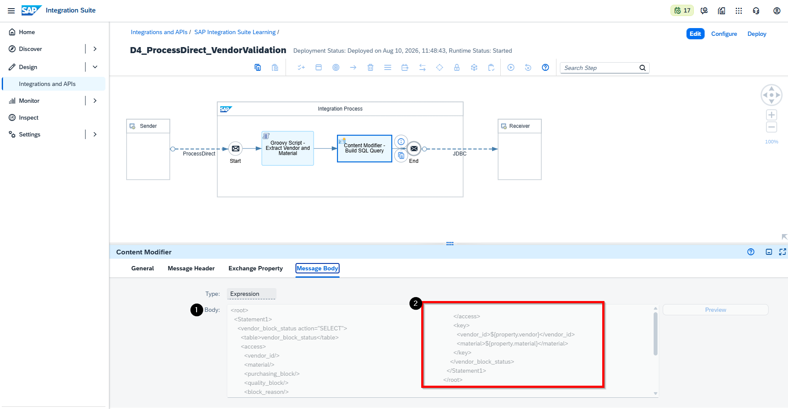
</a>

*Body do Content Modifier configurado com a instrução no formato XML SQL Format, seguindo a estrutura definida pela SAP: um elemento nomeado com base na tabela alvo (`vendor_block_status`) carregando o atributo obrigatório `action="SELECT"`, um elemento `<table>` (deve ser o primeiro filho), um bloco `<access>` listando as colunas a serem retornadas, e um bloco `<key>` definindo a condição WHERE, preenchido dinamicamente com `${property.vendor}` e `${property.material}`.*

### Passo 4 — JDBC Receiver

| Campo | Valor |
|---|---|
| JDBC Data Source Alias | `NeonDB_FornecedorBloqueio` |

**Security Material configurado:**

| Nome | Tipo | Finalidade |
|---|---|---|
| `NeonDB_FornecedorBloqueio` | JDBC Data Source | Conexão PostgreSQL (Cloud) com o banco de dados hospedado no Neon |

---

## 🗄️ Setup do Banco de Dados (Neon PostgreSQL)

```sql
CREATE TABLE vendor_block_status (
    vendor_id VARCHAR(10) NOT NULL,
    material VARCHAR(20) NOT NULL,
    vendor_name VARCHAR(100),
    purchasing_block BOOLEAN NOT NULL DEFAULT FALSE,
    quality_block BOOLEAN NOT NULL DEFAULT FALSE,
    block_reason VARCHAR(200)
);

INSERT INTO vendor_block_status (vendor_id, material, vendor_name, purchasing_block, quality_block, block_reason) VALUES
('1000200', 'MAT-GEN-001', 'Metalurgica Sul Industria Ltda', TRUE, FALSE, 'Vendor blocked at Purchasing Organization level (LFM1-SPERM)'),
('1000450', 'MAT-GEN-002', 'Componentes Norte S.A.', TRUE, FALSE, 'Vendor blocked at Purchasing Organization level (LFM1-SPERM)'),
('1000350', 'MAT-GEN-003', 'Aco Forte Metalurgica Ltda', FALSE, TRUE, 'Vendor blocked for quality reasons (QIR) for this material - SAP Message 06884'),
('1000100', 'MAT-GEN-001', 'Fornecedor Confiavel Ltda', FALSE, FALSE, NULL),
('1000500', 'MAT-GEN-004', 'Industria Precisao Ltda', FALSE, FALSE, NULL);
```

---

## 🧪 Cenário de Teste 1 — Fornecedor Bloqueado (Bloqueio de Compras)

**Request — POST `{{D4_ProcessDirect_Main}}`**
```json
{
  "fornecedor": "1000200",
  "material": "MAT-GEN-001"
}
```

<a href="../evidences/lab17/05-postman-purchasing-block-200-ok.png" target="_blank">
  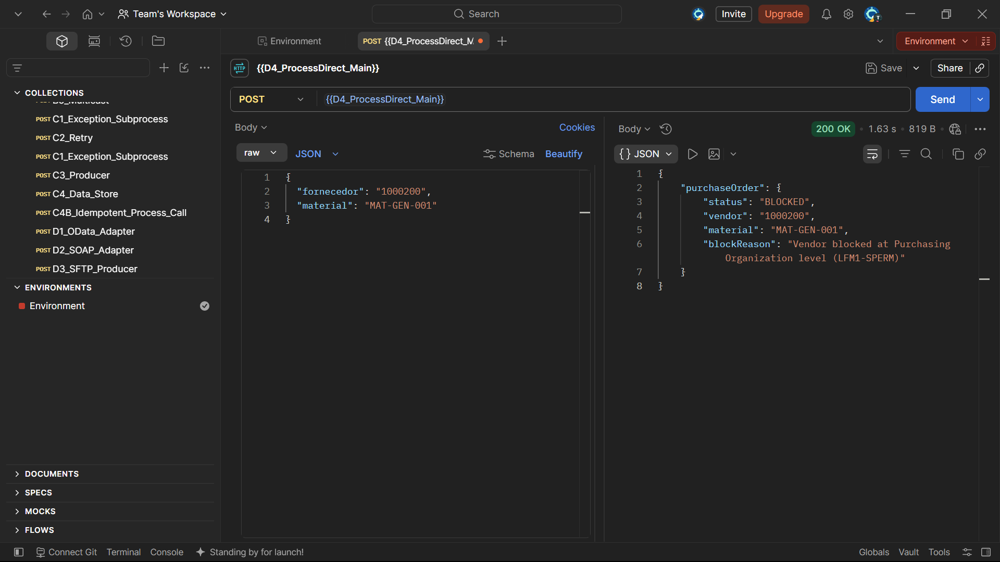
</a>

*Resposta `200 OK` do Postman para o fornecedor `1000200`, retornando `"status": "BLOCKED"` com `blockReason: "Vendor blocked at Purchasing Organization level (LFM1-SPERM)"` — batendo exatamente com o dado pré-carregado no banco para essa combinação fornecedor/material.*

<a href="../evidences/lab17/06-monitor-trace-main-purchasing-block.png" target="_blank">
  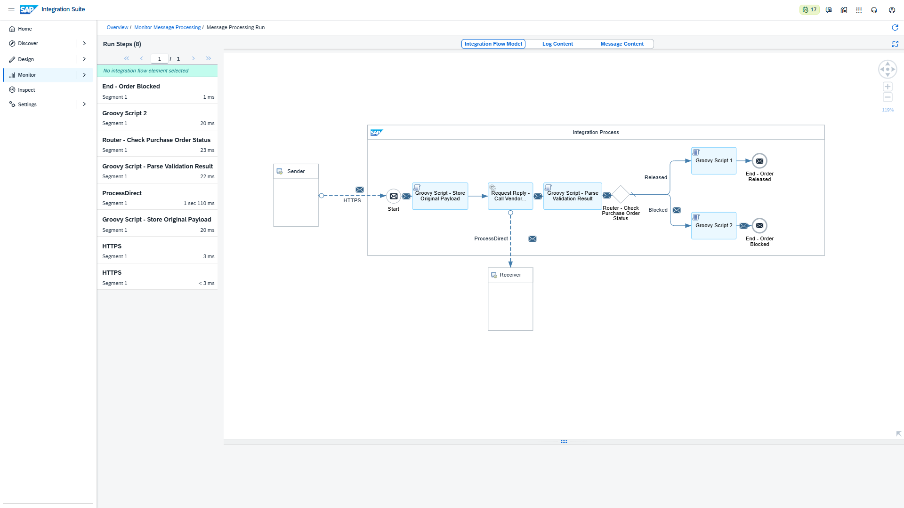
</a>

*`Integration Flow Model` do `D4_ProcessDirect_Main`, mostrando o caminho percorrido pela mensagem: Start → Store Original Payload → Call Vendor Validation (ProcessDirect) → Parse Validation Result → Router → rota **Blocked** → Build Blocked Response → End - Order Blocked.*

<a href="../evidences/lab17/07-monitor-trace-vendorvalidation-purchasing-block.png" target="_blank">
  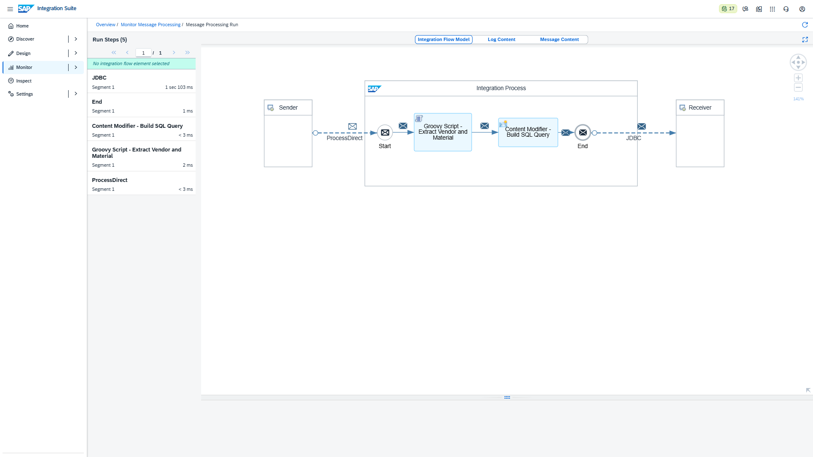
</a>

*`Integration Flow Model` do `D4_ProcessDirect_VendorValidation`, confirmando que a chamada ProcessDirect foi recebida corretamente, a query SQL foi montada e enviada via JDBC, e o resultado bruto da consulta retornado pelo PostgreSQL (`purchasing_block: t`, `quality_block: f`) antes de ser enviado de volta ao iFlow Principal.*

<a href="../evidences/lab17/08-message-content-end-purchasing-block.png" target="_blank">
  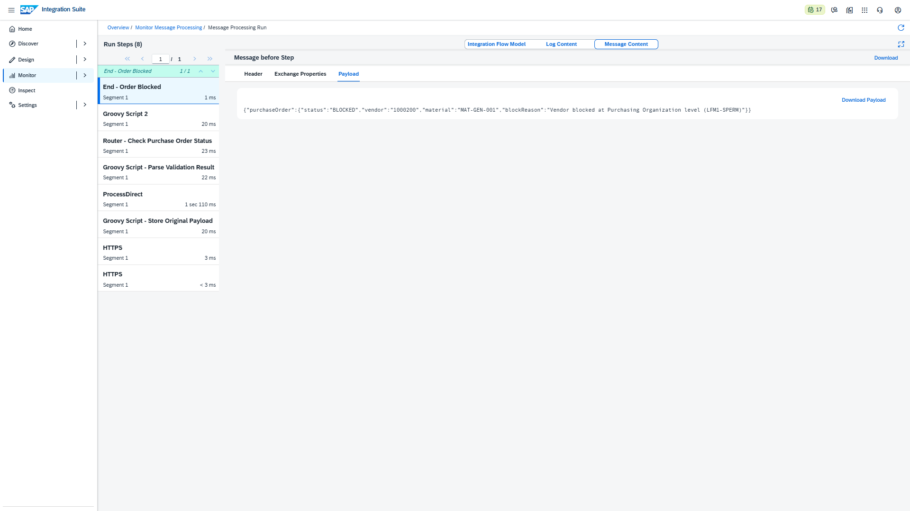
</a>

*Payload final no step `End - Order Blocked`, confirmando que a resposta JSON entregue ao Postman bate exatamente com a regra de negócio aplicada (fornecedor bloqueado a nível de Organização de Compras).*

---

## 🧪 Cenário de Teste 2 — Fornecedor Bloqueado (Quality Info Record / QIR)

**Request — POST `{{D4_ProcessDirect_Main}}`**
```json
{
  "fornecedor": "1000350",
  "material": "MAT-GEN-003"
}
```

<a href="../evidences/lab17/09-postman-quality-block-200-ok.png" target="_blank">
  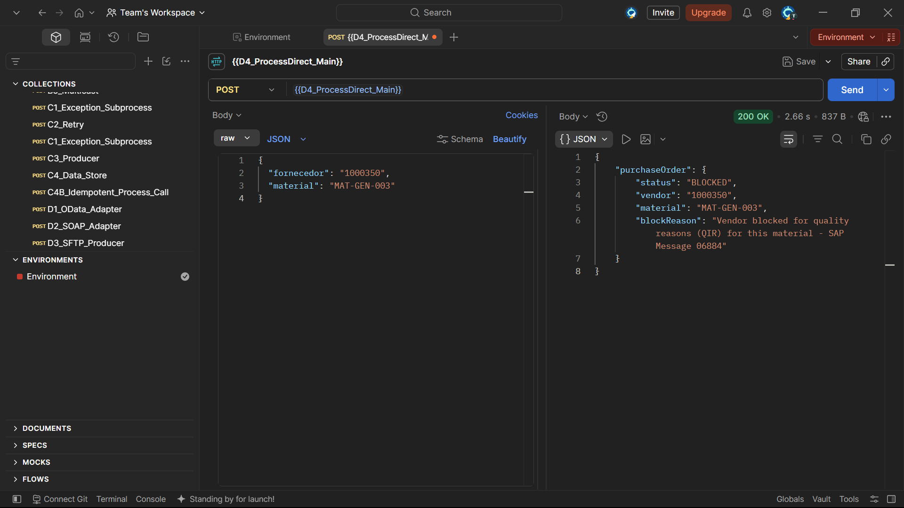
</a>

*Resposta `200 OK` do Postman para o fornecedor `1000350`, retornando `"status": "BLOCKED"` com `blockReason: "Vendor blocked for quality reasons (QIR) for this material - SAP Message 06884"` — reproduzindo a mensagem real do SAP disparada quando um Quality Info Record bloqueia uma combinação fornecedor/material.*

<a href="../evidences/lab17/10-monitor-trace-main-quality-block.png" target="_blank">
  
</a>

*`Integration Flow Model` do `D4_ProcessDirect_Main` confirmando que a mesma rota **Blocked** foi corretamente acionada para esse fornecedor, dessa vez por causa da restrição de qualidade em vez da restrição de compras — demonstrando que a lógica do Router avalia corretamente as duas condições de bloqueio através da property única `canCreateOrder`.*

<a href="../evidences/lab17/11-monitor-trace-vendorvalidation-quality-block.png" target="_blank">
  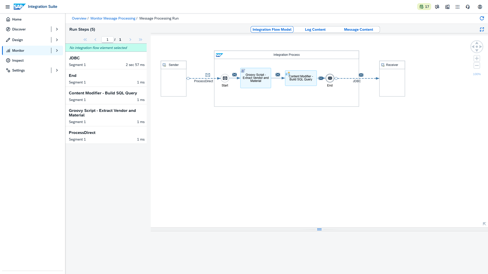
</a>

*Trace do `D4_ProcessDirect_VendorValidation` mostrando o resultado da consulta JDBC para o fornecedor `1000350` / material `MAT-GEN-003`: `purchasing_block: f`, `quality_block: t` — confirmando que o banco de dados armazena e retorna corretamente flags independentes para cada tipo de bloqueio.*

<a href="../evidences/lab17/12-message-content-end-quality-block.png" target="_blank">
  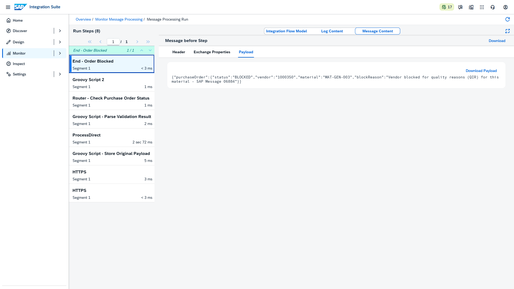
</a>

*Payload final no `End - Order Blocked`, confirmando que o motivo correto de bloqueio (relacionado à qualidade) foi propagado até a resposta JSON final.*

---

## 🧪 Cenário de Teste 3 — Pedido Liberado (caminho positivo)

**Request — POST `{{D4_ProcessDirect_Main}}`**
```json
{
  "fornecedor": "1000100",
  "material": "MAT-GEN-001"
}
```

<a href="../evidences/lab17/13-postman-order-released-200-ok.png" target="_blank">
  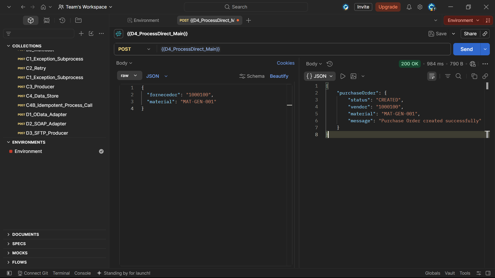
</a>

*Resposta `200 OK` do Postman para o fornecedor `1000100`, retornando `"status": "CREATED"` com a mensagem de sucesso `"Purchase Order created successfully"` — confirmando que essa combinação fornecedor/material não possui nenhum bloqueio ativo no banco de dados.*

<a href="../evidences/lab17/14-monitor-trace-main-order-released.png" target="_blank">
  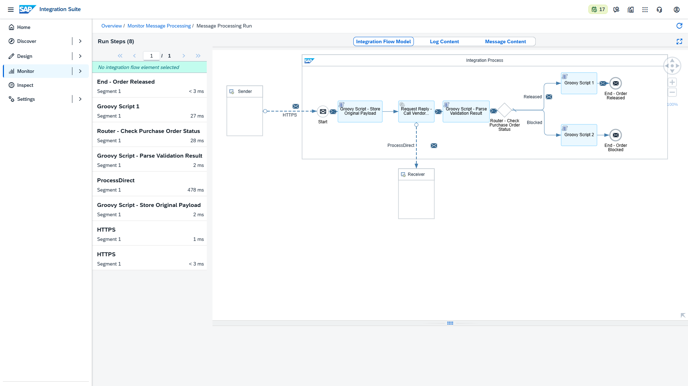
</a>

*`Integration Flow Model` do `D4_ProcessDirect_Main` mostrando a mensagem corretamente roteada pelo ramo **Released** dessa vez — Router → Build Order Created Response → End - Order Released — validando que o Router distingue corretamente entre fornecedores bloqueados e liberados.*

<a href="../evidences/lab17/15-monitor-trace-vendorvalidation-order-released.png" target="_blank">
  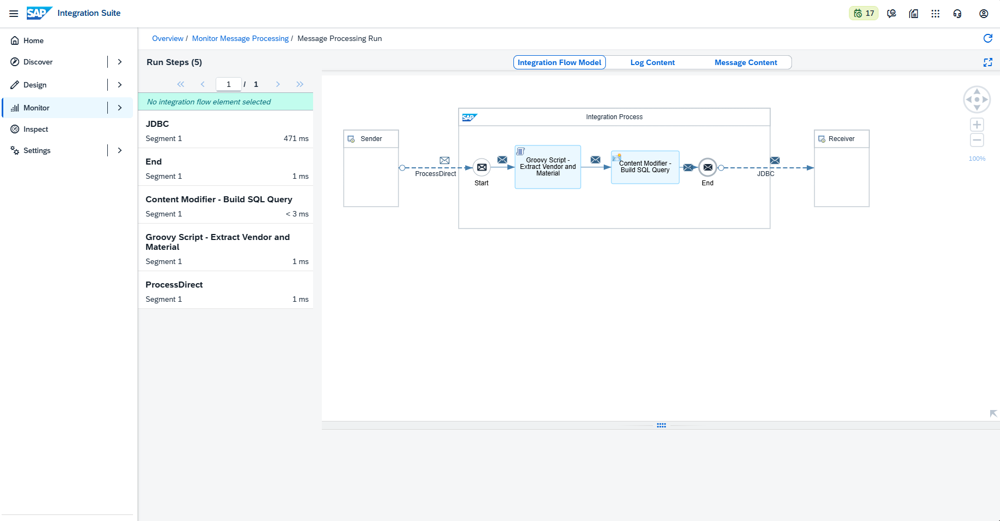
</a>

*Trace do `D4_ProcessDirect_VendorValidation` confirmando o resultado da consulta JDBC para o fornecedor `1000100` / material `MAT-GEN-001`: tanto `purchasing_block` quanto `quality_block` retornados como `f` (falso), e `block_reason` vazio — exatamente a condição necessária para `canCreateOrder` avaliar como `true`.*

<a href="../evidences/lab17/16-message-content-end-order-released.png" target="_blank">
  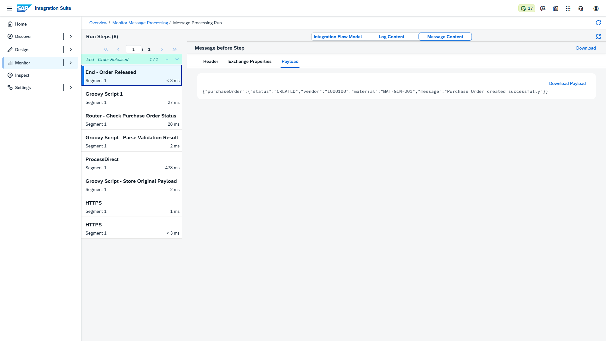
</a>

*Payload final no `End - Order Released`, confirmando a resposta completa do caminho feliz entregue ao Postman.*

---

## 📊 Referência — Status da Tabela do Banco de Dados

Como uma evidência final, externa ao tenant CPI, o conteúdo completo da tabela `vendor_block_status` foi capturado diretamente do SQL Editor do Neon, confirmando a fonte de dados usada em todos os três cenários de teste:

<a href="../evidences/lab17/17-neon-database-vendor-block-status-table.png" target="_blank">
  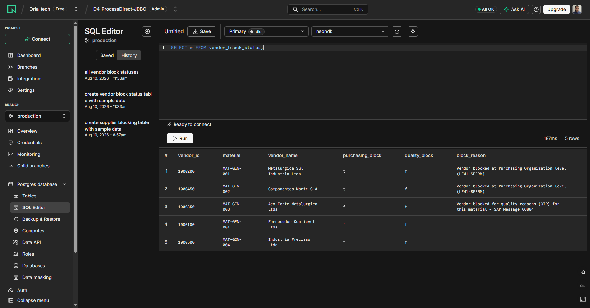
</a>

*`SELECT * FROM vendor_block_status;` executado no SQL Editor do Neon, mostrando as 5 combinações fornecedor/material pré-carregadas usadas nos cenários de teste — 2 com bloqueio de compras, 1 com bloqueio de qualidade (QIR) e 2 totalmente liberadas — servindo como fonte única de verdade consultada em tempo real pelo iFlow `D4_ProcessDirect_VendorValidation` durante cada teste.*

---

## 🔍 Troubleshooting & Lições Aprendidas

### 1. `Address should begin with alphanumeric or '/' character`

**Causa:** o endereço do ProcessDirect foi inicialmente configurado como `direct:validaFornecedor`, seguindo a convenção de URI pura do Apache Camel (`esquema:nome`). O adapter ProcessDirect do CPI, no entanto, exige um endereço estilo path.

**Solução:** usar um endereço estilo path, como `/vendorValidation`.

### 2. `JDBCException: Input XML contains missing action attribute`

**Causa:** o formato XML SQL Format exige uma estrutura específica: um elemento (qualquer nome) diretamente sob o elemento de statement, carregando o atributo **`action`** (ex: `action="SELECT"`), com `<table>` como seu primeiro filho, seguido de `<access>` (colunas a retornar) e `<key>` (colunas da condição WHERE). Várias iterações falharam porque o atributo `action` foi escrito ora como texto solto, ora com nomes de tag de abertura/fechamento não coincidentes.

**Solução:** mover a montagem da instrução SQL do Groovy (concatenação de strings, propensa a erros de escape de aspas) para um **Content Modifier**, onde o XML pode ser digitado literalmente com caracteres `<` `>` reais, com os placeholders de property (`${property.vendor}`) resolvidos automaticamente pelo runtime do CPI — eliminando o problema de escape pela raiz.

### 3. `Content is not allowed in prolog` (SAXParseException)

**Causa:** o step `Groovy Script - Extract Vendor and Material` estava, por engano, usando `XmlSlurper` (feito para interpretar XML) para analisar um payload **JSON** — o parser travou logo no primeiro caractere (`{`), que não é um XML válido.

**Solução:** confirmar que o parser correto é usado em cada etapa: `JsonSlurper` para payloads JSON (requisição HTTP de entrada), e `XmlSlurper` apenas para payloads XML (respostas de consulta JDBC).

### 4. Router selecionando o ramo errado apesar dos dados corretos no banco

**Causa:** o adapter JDBC envelopa a resposta de um SELECT dentro de um elemento chamado `<NomeDoStatement>_response` (nesse caso, `<Statement1_response>`), e não em um `<row>` direto sob `<root>`. O `Groovy Script - Parse Validation Result` estava navegando o XML como `response.row`, sem considerar esse nível intermediário — fazendo com que `purchasing_block`/`quality_block` sempre resolvessem como strings vazias, e `canCreateOrder` incorretamente assumisse `true` por padrão.

**Solução:** corrigir o caminho de navegação para `response.Statement1_response.row`, batendo com a estrutura real do XML retornado pelo adapter JDBC.

> 💡 **Nota para o portfólio:** esse é um detalhe sutil, porém importante, do formato XML SQL Format — sempre inspecionar o payload real de resposta do JDBC no Trace do Monitor antes de escrever a lógica de parsing, em vez de assumir que a resposta espelha a estrutura da requisição.

---

## ✅ Conclusão

O cenário D4 combinou dois adapters em um único caso de negócio realista: o **ProcessDirect**, demonstrando reuso interno e síncrono de lógica de negócio entre iFlows, e o **JDBC**, demonstrando conectividade real com banco de dados para validar regras de bloqueio de fornecedor antes de permitir a criação de um Pedido de Compras — espelhando o comportamento real do SAP MM em torno de Bloqueios de Compras e Quality Info Records (QIR). Conforme combinado, esse escopo unificado substitui o que originalmente estava planejado como um cenário separado D5 — JDBC Adapter.

**Recursos praticados:** ProcessDirect Adapter (Sender & Request-Reply) · JDBC Receiver Adapter · Protocolo de mensagem XML SQL Format · Configuração de JDBC Data Source (PostgreSQL Cloud) · Content Modifier para montagem dinâmica de SQL · Router (decisão multi-ramo) · Groovy Script (parsing JSON/XML, montagem de resposta) · Troubleshooting da estrutura de resposta do JDBC e regras de endereçamento do adapter

**Cenário anterior:** ./18-d3-sftp-adapter.md

---

## 🛠️ Ferramentas utilizadas

- **SAP Integration Suite** (Cloud Integration – Trial)
- **Postman** (collection `D4_ProcessDirect_Main`, variáveis `{{base_url}}`/`{{clientid}}`/`{{clientsecret}}`)
- **Neon** — banco de dados PostgreSQL serverless gratuito — [neon.tech](https://neon.tech/)

---

## 👤 Autor

**Orlando Caetano**
🔗 [LinkedIn](https://www.linkedin.com/in/orlando-caetano/) | 💻 [GitHub](https://github.com/OrlandoCaetano2026)
