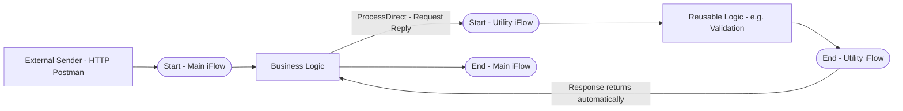
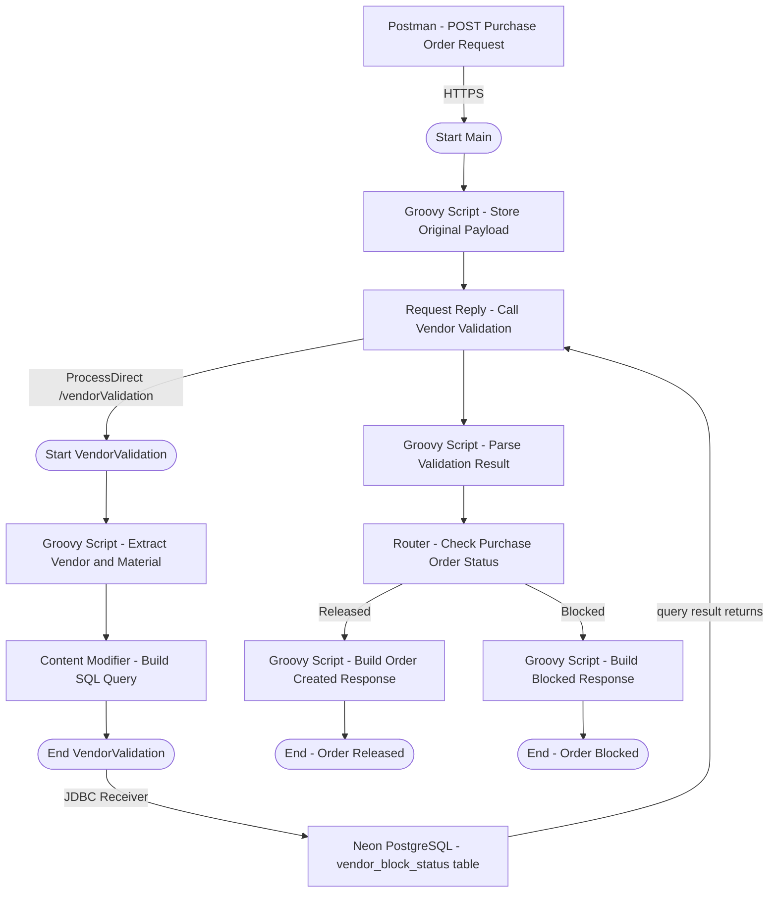

# 🔗 D4 — ProcessDirect Adapter (Internal iFlow-to-iFlow Communication)

> **Block:** D — Advanced Integration Patterns
> **Scenario:** D4_ProcessDirect_Main + D4_ProcessDirect_VendorValidation (2 independent iFlows)
> **Status:** ✅ Completed and tested end-to-end (3 business scenarios validated)
> **Execution date:** 10/08/2026

---

## 📌 Business Context

This scenario simulates the **creation of a Purchase Order in SAP MM**, applying two real-world vendor validation rules before allowing the order to proceed — exactly as SAP does natively when a quotation or purchase order is created:

> *"When a quotation or purchase order is created, the system checks whether a quality info record is required and available for the combination of material and vendor. The system also checks whether the vendor and material-vendor combination is blocked or released."*

Two distinct blocking mechanisms were simulated, both real SAP concepts:

1. **Purchasing Block** — vendor blocked at the Purchasing Organization level (`LFM1-SPERM` field in the vendor master record).
2. **Quality Block (Quality Info Record / QIR)** — vendor blocked for quality reasons for a specific material, reproducing the real SAP error message **"Vendor blocked for quality reasons, Message no. 06884"**, controlled via transactions `QI01`/`QI02`.

Instead of hardcoding these rules inside a Groovy Script, the validation logic was isolated into a **separate, reusable iFlow** that queries a real external database (PostgreSQL, hosted on Neon) — reflecting how, in real projects, this kind of shared business rule is typically centralized and reused across multiple integration flows.

> 💡 **Scope note:** originally, a dedicated **D5 — JDBC Adapter** scenario was planned separately. Since this scenario already combines **ProcessDirect + JDBC** in a realistic, robust way, D5 was merged into D4, and the project roadmap was updated accordingly (no standalone D5 scenario going forward).

---

## 🧠 Concept: What is the ProcessDirect Adapter?

Unlike every other adapter used so far in this project (HTTP, SOAP, SFTP, JMS) — which handle **external** communication (outside the CPI tenant) — **ProcessDirect** is an **internal-only** adapter, exclusive to communication **between iFlows within the same tenant**. It allows one iFlow to call another as if it were a reusable sub-routine, **synchronously**, without the message ever leaving the CPI runtime (no real HTTP call, no external network hop).



### Why it matters (and why it's relevant for certification)

| Concept | Detail |
|---|---|
| **Addressing** | No URL/host — uses a logical `Address` (e.g. `/vendorValidation`), unique within the tenant |
| **Communication style** | Always **synchronous** (Request-Reply) |
| **Performance** | Much faster than HTTP, since it never leaves the JVM/internal network |
| **Reuse** | The same "utility" iFlow can be called by N different iFlows |
| **Limitation** | Works only **within the same tenant** — not suitable for cross-tenant or external system communication |
| **Real-world usage** | Shared validation logic, centralized logging/audit services, breaking large iFlows into smaller, testable modules |

### Why 2 separate iFlows?

Each iFlow has exactly **one Start Event**. Since `D4_ProcessDirect_Main` is triggered by **HTTP** (on demand, from Postman) and `D4_ProcessDirect_VendorValidation` is triggered by **ProcessDirect** (an internal call), they cannot be combined into a single iFlow — the same architectural principle already applied in the D3 (SFTP Producer/Consumer) scenario.

---

## 🏗️ Full Scenario Architecture



---

## 🔧 D4_ProcessDirect_Main — Configuration

### Step 1 — HTTPS Sender

| Field | Value |
|---|---|
| Address | `/d4processdirect` |
| Authorization | `User Role` |
| User Role | `ESBMessaging.send` |

### Step 2 — Groovy Script - Store Original Payload

Keeps the incoming JSON payload available as a property, so it can be reused later to build the final response (both for the "Released" and "Blocked" branches):

```groovy
import com.sap.gateway.ip.core.customdev.util.Message

def Message processData(Message message) {
    def body = message.getBody(String)
    message.setProperty("originalPayload", body)
    return message
}
```

### Step 3 — Request Reply - Call Vendor Validation (ProcessDirect)

The `Request Reply` step calls the utility iFlow synchronously via the **ProcessDirect** adapter:

| Field | Value |
|---|---|
| Address | `/vendorValidation` |

> ⚠️ This address must be **identical** to the one configured on the Sender side of `D4_ProcessDirect_VendorValidation` — otherwise the call fails with `No consumers available on endpoint`.

<a href="../evidences/lab17/01-iflow-main-processdirect-config.png" target="_blank">
  
</a>

*Full canvas of `D4_ProcessDirect_Main`, showing the complete flow (Start → Store Payload → Call Vendor Validation → Parse Result → Router → Released/Blocked branches → respective End events), together with the ProcessDirect connector configuration pointing to `/vendorValidation`.*

### Step 4 — Groovy Script - Parse Validation Result

Interprets the XML response returned by the JDBC query (executed inside the utility iFlow) and decides whether the Purchase Order can be created:

```groovy
import com.sap.gateway.ip.core.customdev.util.Message
import groovy.util.XmlSlurper

def Message processData(Message message) {
    def body = message.getBody(String)
    def response = new XmlSlurper().parseText(body)
    def row = response.Statement1_response.row

    def purchasingBlock = row.purchasing_block.text() == "t"
    def qualityBlock = row.quality_block.text() == "t"
    def blockReason = row.block_reason.text()
    def canCreateOrder = !purchasingBlock && !qualityBlock

    message.setProperty("purchasingBlock", purchasingBlock)
    message.setProperty("qualityBlock", qualityBlock)
    message.setProperty("blockReason", blockReason)
    message.setProperty("canCreateOrder", canCreateOrder)

    return message
}
```

> 📌 Note the navigation path `response.Statement1_response.row` — the JDBC adapter always wraps a SELECT response inside a `<StatementName>_response>` element (in this case, `Statement1_response`), not a plain `<row>` directly under `<root>`. This is a key detail of the **XML SQL Format** message protocol used by the JDBC adapter.

### Step 5 — Router - Check Purchase Order Status

| Route | Condition |
|---|---|
| **Released** | `${property.canCreateOrder} = 'true'` |
| **Blocked** | Otherwise (default route) |

<a href="../evidences/lab17/02-router-check-purchase-order-status-config.png" target="_blank">
  
</a>

*Router configuration showing the two routes: `Released` (condition based on the `canCreateOrder` property) and `Blocked` (default/otherwise route), directing the message flow to the corresponding final Groovy Script and End event.*

### Step 6 — Groovy Script - Build Order Created Response (Released route)

```groovy
import com.sap.gateway.ip.core.customdev.util.Message
import groovy.json.JsonSlurper
import groovy.json.JsonBuilder

def Message processData(Message message) {
    def originalPayload = message.getProperty("originalPayload")
    def json = new JsonSlurper().parseText(originalPayload)

    def result = [
        purchaseOrder: [
            status: "CREATED",
            vendor: json.fornecedor,
            material: json.material,
            message: "Purchase Order created successfully"
        ]
    ]

    message.setBody(new JsonBuilder(result).toString())
    message.setHeader("Content-Type", "application/json")
    return message
}
```

### Step 7 — Groovy Script - Build Blocked Response (Blocked route)

```groovy
import com.sap.gateway.ip.core.customdev.util.Message
import groovy.json.JsonSlurper
import groovy.json.JsonBuilder

def Message processData(Message message) {
    def originalPayload = message.getProperty("originalPayload")
    def json = new JsonSlurper().parseText(originalPayload)
    def blockReason = message.getProperty("blockReason")

    def result = [
        purchaseOrder: [
            status: "BLOCKED",
            vendor: json.fornecedor,
            material: json.material,
            blockReason: blockReason
        ]
    ]

    message.setBody(new JsonBuilder(result).toString())
    message.setHeader("Content-Type", "application/json")
    return message
}
```

---

## 🔧 D4_ProcessDirect_VendorValidation — Configuration

This is the reusable "utility" iFlow, responsible for querying the vendor block status directly in the database.

### Step 1 — ProcessDirect Sender

| Field | Value |
|---|---|
| Address | `/vendorValidation` |

> 📌 Note: the ProcessDirect address must follow a path-style syntax, starting with `/` (e.g. `/vendorValidation`) — a `direct:name` style syntax (common in plain Apache Camel URIs) is **not accepted** by the CPI validator and triggers a design-time error.

### Step 2 — Groovy Script - Extract Vendor and Material

```groovy
import com.sap.gateway.ip.core.customdev.util.Message
import groovy.json.JsonSlurper

def Message processData(Message message) {
    def reader = message.getBody(java.io.Reader.class)
    def json = new JsonSlurper().parse(reader)
    def vendor = json.fornecedor?.toString()
    def material = json.material?.toString()

    message.setProperty("vendor", vendor)
    message.setProperty("material", material)

    return message
}
```

<a href="../evidences/lab17/03-iflow-vendorvalidation-processdirect-config.png" target="_blank">
  
</a>

*Full canvas of `D4_ProcessDirect_VendorValidation` (Start → Extract Vendor/Material → Build SQL Query → End → JDBC Receiver), together with the ProcessDirect Sender configuration, confirming the `/vendorValidation` address matches the one called from the Main iFlow.*

### Step 3 — Content Modifier - Build SQL Query

Instead of building the XML SQL statement inside a Groovy Script (which proved highly error-prone due to string escaping issues), the query was moved to a **Content Modifier**, where the XML is typed literally in the visual editor — eliminating any risk of quote-escaping mistakes:

```xml
<root>
  <Statement1>
    SELECT
      <table>vendor_block_status</table>
      <access>
        <vendor_id/>
        <material/>
        <purchasing_block/>
        <quality_block/>
        <block_reason/>
      </access>
      <key>
        <vendor_id>${property.vendor}</vendor_id>
        <material>${property.material}</material>
      </key>
    </vendor_block_status>
  </Statement1>
</root>
```

<a href="../evidences/lab17/04-content-modifier-build-sql-query-config.png" target="_blank">
  
</a>

*Content Modifier body configured with the XML SQL Format statement, following the SAP-defined structure: an element named after the target table (`vendor_block_status`) carrying the mandatory `action="SELECT"` attribute, a `<table>` element (must be the first child), an `<access>` block listing the columns to be returned, and a `<key>` block defining the WHERE condition, dynamically filled with `${property.vendor}` and `${property.material}`.*

### Step 4 — JDBC Receiver

| Field | Value |
|---|---|
| JDBC Data Source Alias | `NeonDB_FornecedorBloqueio` |

**Security Material configured:**

| Name | Type | Purpose |
|---|---|---|
| `NeonDB_FornecedorBloqueio` | JDBC Data Source | PostgreSQL (Cloud) connection to the Neon-hosted database |

---

## 🗄️ Database Setup (Neon PostgreSQL)

```sql
CREATE TABLE vendor_block_status (
    vendor_id VARCHAR(10) NOT NULL,
    material VARCHAR(20) NOT NULL,
    vendor_name VARCHAR(100),
    purchasing_block BOOLEAN NOT NULL DEFAULT FALSE,
    quality_block BOOLEAN NOT NULL DEFAULT FALSE,
    block_reason VARCHAR(200)
);

INSERT INTO vendor_block_status (vendor_id, material, vendor_name, purchasing_block, quality_block, block_reason) VALUES
('1000200', 'MAT-GEN-001', 'Metalurgica Sul Industria Ltda', TRUE, FALSE, 'Vendor blocked at Purchasing Organization level (LFM1-SPERM)'),
('1000450', 'MAT-GEN-002', 'Componentes Norte S.A.', TRUE, FALSE, 'Vendor blocked at Purchasing Organization level (LFM1-SPERM)'),
('1000350', 'MAT-GEN-003', 'Aco Forte Metalurgica Ltda', FALSE, TRUE, 'Vendor blocked for quality reasons (QIR) for this material - SAP Message 06884'),
('1000100', 'MAT-GEN-001', 'Fornecedor Confiavel Ltda', FALSE, FALSE, NULL),
('1000500', 'MAT-GEN-004', 'Industria Precisao Ltda', FALSE, FALSE, NULL);
```

---

## 🧪 Test Scenario 1 — Vendor Blocked (Purchasing Block)

**Request — POST `{{D4_ProcessDirect_Main}}`**
```json
{
  "fornecedor": "1000200",
  "material": "MAT-GEN-001"
}
```

<a href="../evidences/lab17/05-postman-purchasing-block-200-ok.png" target="_blank">
  
</a>

*Postman response `200 OK` for vendor `1000200`, returning `"status": "BLOCKED"` with `blockReason: "Vendor blocked at Purchasing Organization level (LFM1-SPERM)"` — matching exactly the data pre-loaded in the database for this vendor/material combination.*

<a href="../evidences/lab17/06-monitor-trace-main-purchasing-block.png" target="_blank">
  
</a>

*`D4_ProcessDirect_Main` Integration Flow Model, showing the message path: Start → Store Original Payload → Call Vendor Validation (ProcessDirect) → Parse Validation Result → Router → **Blocked** route → Build Blocked Response → End - Order Blocked.*

<a href="../evidences/lab17/07-monitor-trace-vendorvalidation-purchasing-block.png" target="_blank">
  
</a>

*`D4_ProcessDirect_VendorValidation` Integration Flow Model, confirming the ProcessDirect call was received correctly, the SQL query was built and sent via JDBC, and the raw query result returned from PostgreSQL (`purchasing_block: t`, `quality_block: f`) before being sent back to the Main iFlow.*

<a href="../evidences/lab17/08-message-content-end-purchasing-block.png" target="_blank">
  
</a>

*Final payload at the `End - Order Blocked` step, confirming the JSON response delivered to Postman matches exactly the business rule applied (vendor blocked at Purchasing Organization level).*

---

## 🧪 Test Scenario 2 — Vendor Blocked (Quality Info Record / QIR)

**Request — POST `{{D4_ProcessDirect_Main}}`**
```json
{
  "fornecedor": "1000350",
  "material": "MAT-GEN-003"
}
```

<a href="../evidences/lab17/09-postman-quality-block-200-ok.png" target="_blank">
  
</a>

*Postman response `200 OK` for vendor `1000350`, returning `"status": "BLOCKED"` with `blockReason: "Vendor blocked for quality reasons (QIR) for this material - SAP Message 06884"` — reproducing the real SAP error message triggered when a Quality Info Record blocks a vendor-material combination.*

<a href="../evidences/lab17/10-monitor-trace-main-quality-block.png" target="_blank">
  
</a>

*`D4_ProcessDirect_Main` Integration Flow Model confirming the same **Blocked** route was correctly triggered for this vendor, this time due to the quality restriction rather than the purchasing restriction — demonstrating that the Router logic correctly evaluates both blocking conditions through the single `canCreateOrder` property.*

<a href="../evidences/lab17/11-monitor-trace-vendorvalidation-quality-block.png" target="_blank">
  
</a>

*`D4_ProcessDirect_VendorValidation` trace showing the JDBC query result for vendor `1000350` / material `MAT-GEN-003`: `purchasing_block: f`, `quality_block: t` — confirming the database correctly stores and returns independent flags for each type of block.*

<a href="../evidences/lab17/12-message-content-end-quality-block.png" target="_blank">
  
</a>

*Final payload at `End - Order Blocked`, confirming the correct block reason (quality-related) was propagated all the way to the final JSON response.*

---

## 🧪 Test Scenario 3 — Order Released (happy path)

**Request — POST `{{D4_ProcessDirect_Main}}`**
```json
{
  "fornecedor": "1000100",
  "material": "MAT-GEN-001"
}
```

<a href="../evidences/lab17/13-postman-order-released-200-ok.png" target="_blank">
  
</a>

*Postman response `200 OK` for vendor `1000100`, returning `"status": "CREATED"` with the success message `"Purchase Order created successfully"` — confirming this vendor/material combination has no active blocks in the database.*

<a href="../evidences/lab17/14-monitor-trace-main-order-released.png" target="_blank">
  
</a>

*`D4_ProcessDirect_Main` Integration Flow Model showing the message correctly routed through the **Released** branch this time — Router → Build Order Created Response → End - Order Released — validating that the Router properly distinguishes between blocked and released vendors.*

<a href="../evidences/lab17/15-monitor-trace-vendorvalidation-order-released.png" target="_blank">
  
</a>

*`D4_ProcessDirect_VendorValidation` trace confirming the JDBC query result for vendor `1000100` / material `MAT-GEN-001`: both `purchasing_block` and `quality_block` returned as `f` (false), and `block_reason` empty — the exact condition required for `canCreateOrder` to evaluate to `true`.*

<a href="../evidences/lab17/16-message-content-end-order-released.png" target="_blank">
  
</a>

*Final payload at `End - Order Released`, confirming the complete happy-path response delivered to Postman.*

---

## 📊 Reference — Database Table Status

As a final piece of evidence, external to the CPI tenant, the full contents of the `vendor_block_status` table were captured directly from the Neon SQL Editor, confirming the data source used throughout all three test scenarios:

<a href="../evidences/lab17/17-neon-database-vendor-block-status-table.png" target="_blank">
  
</a>

*`SELECT * FROM vendor_block_status;` executed in the Neon SQL Editor, showing all 5 pre-loaded vendor/material combinations used across the test scenarios — 2 with purchasing block, 1 with quality block (QIR), and 2 fully released — serving as the single source of truth queried live by the `D4_ProcessDirect_VendorValidation` iFlow during every test.*

---

## 🔍 Troubleshooting & Lessons Learned

### 1. `Address should begin with alphanumeric or '/' character`

**Cause:** the ProcessDirect address was initially configured as `direct:validaFornecedor`, following the plain Apache Camel URI convention (`scheme:name`). The CPI's ProcessDirect adapter, however, requires a path-style address.

**Solution:** use a path-style address instead, e.g. `/vendorValidation`.

### 2. `JDBCException: Input XML contains missing action attribute`

**Cause:** the XML SQL Format requires a specific structure: an element (any name) directly under the statement element, carrying the **`action`** attribute (e.g. `action="SELECT"`), with `<table>` as its first child, followed by `<access>` (columns to return) and `<key>` (WHERE condition columns). Several iterations failed because the `action` attribute was either written as loose text, or the opening/closing tag names didn't match.

**Solution:** move the SQL statement construction from Groovy (string concatenation, prone to quote-escaping errors) to a **Content Modifier**, where the XML can be typed literally with real `<` `>` characters, with property placeholders (`${property.vendor}`) resolved automatically by the CPI runtime — eliminating the escaping problem at its root.

### 3. `Content is not allowed in prolog` (SAXParseException)

**Cause:** the `Groovy Script - Extract Vendor and Material` step was mistakenly using `XmlSlurper` (intended for parsing XML) to parse a **JSON** payload — the parser choked on the very first character (`{`), which is not valid XML.

**Solution:** confirm the correct parser is used at each step: `JsonSlurper` for JSON payloads (incoming HTTP request), and `XmlSlurper` only for XML payloads (JDBC query responses).

### 4. Router selecting the wrong branch despite correct database data

**Cause:** the JDBC adapter wraps a SELECT response inside an element named `<StatementName>_response` (in this case, `<Statement1_response>`), not a bare `<row>` directly under `<root>`. The `Groovy Script - Parse Validation Result` was navigating the XML as `response.row`, missing that intermediate level — causing `purchasing_block`/`quality_block` to always resolve as empty strings, and `canCreateOrder` to incorrectly default to `true`.

**Solution:** correct the navigation path to `response.Statement1_response.row`, matching the actual XML structure returned by the JDBC adapter.

> 💡 **Portfolio note:** this is a subtle but important detail of the XML SQL Format — always inspect the actual JDBC response payload in the Monitor trace before writing the parsing logic, rather than assuming the response mirrors the request structure.

---

## ✅ Conclusion

The D4 scenario combined two adapters in a single, realistic business case: **ProcessDirect**, demonstrating internal, synchronous iFlow-to-iFlow reuse of business logic, and **JDBC**, demonstrating live database connectivity to validate vendor blocking rules before allowing a Purchase Order to be created — mirroring the real SAP MM behavior around Purchasing Blocks and Quality Info Records (QIR). As agreed, this merged scope replaces what was originally planned as a separate D5 — JDBC Adapter scenario.

**Skills practiced:** ProcessDirect Adapter (Sender & Request-Reply) · JDBC Receiver Adapter · XML SQL Format message protocol · JDBC Data Source configuration (PostgreSQL Cloud) · Content Modifier for dynamic SQL construction · Router (multi-branch decision) · Groovy Script (JSON/XML parsing, response building) · Troubleshooting of JDBC response structure and adapter addressing rules

**Previous scenario:** ./18-d3-sftp-adapter.md

---

## 🛠️ Tools Used

- **SAP Integration Suite** (Cloud Integration – Trial)
- **Postman** (collection `D4_ProcessDirect_Main`, variables `{{base_url}}`/`{{clientid}}`/`{{clientsecret}}`)
- **Neon** — free-tier serverless PostgreSQL database — [neon.tech](https://neon.tech/)

---

## 👤 Author

**Orlando Caetano**
🔗 [LinkedIn](https://www.linkedin.com/in/orlando-caetano/) | 💻 [GitHub](https://github.com/OrlandoCaetano2026)
