# 🔐 E0 + E1 + E12 — API Management: Ativação, API Proxy e Basic Authentication com Key Value Map

> **Bloco:** E — API Management
> **Cenários:** E0 (Ativação da capability + API Provider), E1 (API Proxy), E12 (Policy: Basic Authentication com KVM criptografado)
> **Status:** ✅ Concluído e testado de ponta a ponta
> **Data de execução:** 11/08/2026

---

## 📌 Contexto de Negócio

Este cenário marca a entrada no **Bloco E — API Management**, uma capability do SAP Integration Suite completamente diferente do que praticamos nos Blocos A-D (Cloud Integration/CPI). Enquanto o CPI é responsável por **construir** a lógica de integração (iFlows), o **API Management** é responsável por **expor, proteger e governar** essas integrações como APIs públicas e controladas — inclusive reaproveitando os próprios iFlows já construídos.

O objetivo prático deste laboratório foi pegar o iFlow **D1_OData_Adapter** (já construído e testado no Bloco D) e expô-lo através de um **API Proxy**, aplicando uma primeira camada de segurança: a Policy **Basic Authentication**, que faz o Proxy se autenticar **sozinho** junto ao backend real (o iFlow), sem exigir nada do consumidor externo — e, mais importante, armazenando essas credenciais de forma **criptografada** através de um **Key Value Map (KVM)**, seguindo a prática recomendada de segurança para não deixar segredos em texto puro dentro de qualquer configuração.

---

## 🧠 Conceito: Arquitetura do API Management

A capability API Management funciona em camadas, com 3 componentes centrais:

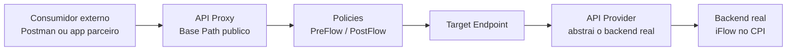

- **API Provider**: guarda o endereço e a forma de autenticação para alcançar um backend real (no nosso caso, o próprio tenant Cloud Integration). Criado uma única vez por tenant/backend.
- **API Proxy**: é a "API" propriamente dita, com um endereço público (Base Path) e um endereço de destino (Target Endpoint) — normalmente referenciando um API Provider.
- **Policies**: passos de processamento aplicados ao Proxy, organizados em 4 categorias (Traffic Management, Mediation, Security, Custom), executados em uma ordem fixa dentro de **Flows** (PreFlow sempre primeiro, PostFlow sempre por último).

Um ponto conceitual importante fixado neste cenário: as Policies podem ser aplicadas em **dois pontos diferentes** do fluxo, com propósitos opostos:

| Onde aplicar | Direção | Propósito |
|---|---|---|
| **Proxy Endpoint → PreFlow** | Entrada (consumidor → Proxy) | Proteger o Proxy de quem o chama (ex: Verify API Key, OAuth) |
| **Target Endpoint → PreFlow** | Saída (Proxy → backend) | Autenticar o Proxy junto ao backend real (ex: Basic Authentication) |

Neste cenário, usamos o **Target Endpoint → PreFlow**, pois o objetivo era resolver a autenticação do Proxy com o backend — não ainda proteger o Proxy de consumidores externos (isso será tratado no próximo cenário, com Verify API Key).

---

## 🏗️ Arquitetura completa do cenário

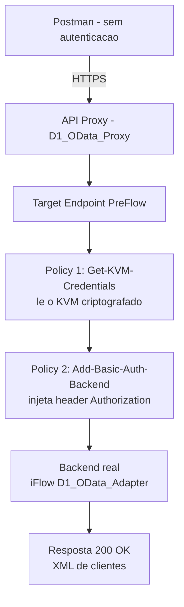

---

## 🔧 E0 — Ativação da Capability e Criação do API Provider

### Passo 1 — Ativar o API Management no tenant

No Integration Suite: **Home → Capabilities → Add Capabilities → Manage APIs** → marcar **API Modelling** (padrão) e **Developer Hub** → **Review → Activate**.

> ⚠️ **Ponto de atenção descoberto durante o troubleshooting**: ativar a capability aqui **não é suficiente**. É necessário também acessar **Settings → Runtimes** e clicar em **Classic API Management → Activate** para de fato provisionar o runtime — sem isso, o menu de API Management nunca aparece, mesmo com a capability marcada como "Active".

### Passo 2 — Atribuir a Role Collection necessária

No **BTP Cockpit → Subaccount → Security → Users**, atribua ao seu usuário a role:
```
APIManagement.SelfService.Administrator
```

<a href="../evidences/lab18/02-cockpit-user-role-collection-apimanagement.png" target="_blank">
  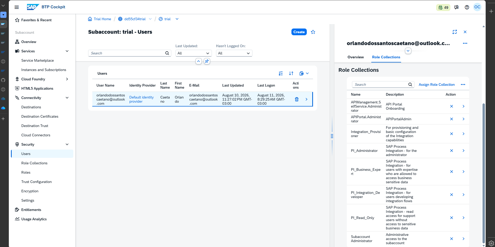
</a>

*Tela do BTP Cockpit confirmando a atribuição da Role Collection `APIManagement.SelfService.Administrator` ao usuário — pré-requisito obrigatório sem o qual o provisionamento do Classic API Management trava indefinidamente com a mensagem "step faltando", independentemente de quantas vezes a capability seja reativada.*

### Passo 3 — Criar a Service Instance (Process Integration Runtime)

No **BTP Cockpit → Instances and Subscriptions → Create**:

| Campo | Valor |
|---|---|
| Service | `Process Integration Runtime` |
| Plan | `api` |
| Instance Name | `CPI_API_Instance` |
| Roles | Todas exceto as de Security (`SecurityMaterialEdit`, `SecurityMaterialDownload`, `SecurityArtifactTransport`) |
| Grant-types | `Client Credentials` |

<a href="../evidences/lab18/01-cockpit-cpi-api-instance-service-key.png" target="_blank">
  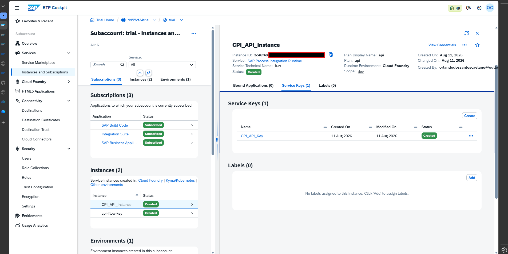
</a>

*Service Key gerada para a instância `CPI_API_Instance`, fornecendo as credenciais (`clientid`, `clientsecret`, `tokenurl`) que serão usadas na autenticação OAuth2 Client Credentials do API Provider — Client Secret e Instance ID borrados por segurança.*

<a href="../evidences/lab18/03-cockpit-service-marketplace-process-integration-runtime.png" target="_blank">
  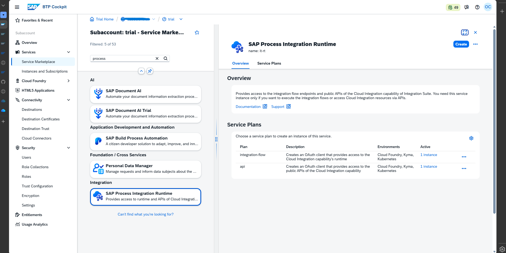
</a>

*Service Marketplace do BTP Cockpit, confirmando a disponibilidade do serviço `Process Integration Runtime` usado para gerar as credenciais de conexão entre o API Management e o Cloud Integration.*

### Passo 4 — Criar o API Provider

Em **Configure → APIs → API Providers → Create**:

| Campo | Valor |
|---|---|
| Name | `CPI_Backend_Provider` |
| Type | `Cloud Integration` |
| Cloud Integration Management Host | `<tenant>.it-cpitrial0X.cfapps.us10-001.hana.ondemand.com` *(sem `https://`, sem `-rt`)* |
| Port | `443` |
| Authentication | `OAuth2ClientCredentials` |
| Client ID | *(da Service Key)* |
| Client Secret | *(da Service Key)* |
| Token URL | `<tenant>.authentication.us10.hana.ondemand.com/oauth/token` |

<a href="../evidences/lab18/04-api-provider-cpi-backend-provider-connection.png" target="_blank">
  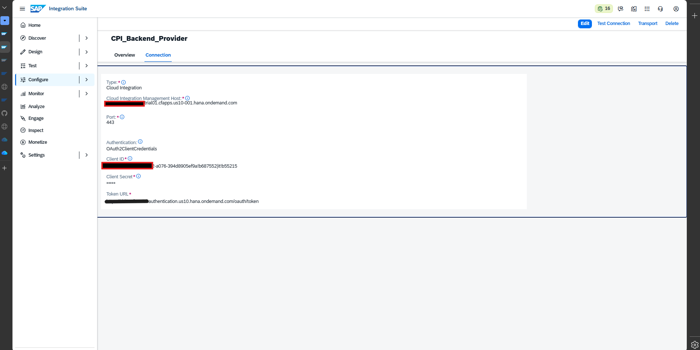
</a>

*Configuração da aba Connection do API Provider `CPI_Backend_Provider`, com Type `Cloud Integration` e Authentication `OAuth2ClientCredentials` — Host, Client ID e Token URL borrados por conterem o identificador do tenant.*

> 💡 **Nota de troubleshooting**: o botão "Test Connection" desta tela retornou `500 Internal Server Error` mesmo com a configuração tecnicamente correta — um comportamento conhecido e relatado na comunidade SAP como um falso negativo desta tela específica. A validação real e confiável da conexão só veio depois, ao criar o API Proxy com sucesso e obter respostas reais do backend.

---

## 🔧 E1 — Criação do API Proxy

Em **Configure → APIs → API Proxies → Create**, selecionando a opção **URL** (conexão manual e universal ao backend, em vez de depender do mecanismo de "Discover" — que não retornou resultados para iFlows com Sender HTTPS genérico, funcionando de forma confiável apenas para iFlows com adapter OData Sender nativo):

| Campo | Valor |
|---|---|
| Name | `D1_OData_Proxy` |
| Title | `D1 OData Proxy` |
| API Base Path | `/v1/d1odata` |
| Host Alias | *(padrão sugerido pelo sistema)* |
| Target Endpoint (URL) | `https://<tenant>.it-cpitrial0X-rt.cfapps.us10-001.hana.ondemand.com/http/d1odata` |

<a href="../evidences/lab18/05-api-proxy-d1-odata-proxy-overview.png" target="_blank">
  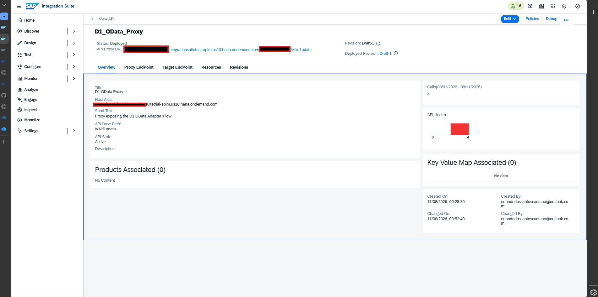
</a>

*Tela de visão geral do `D1_OData_Proxy` após o primeiro deploy bem-sucedido, mostrando `Status: Deployed`, a API Proxy URL pública gerada e o Host Alias — dados sensíveis do tenant borrados.*

<a href="../evidences/lab18/06-api-proxy-target-endpoint-config.png" target="_blank">
  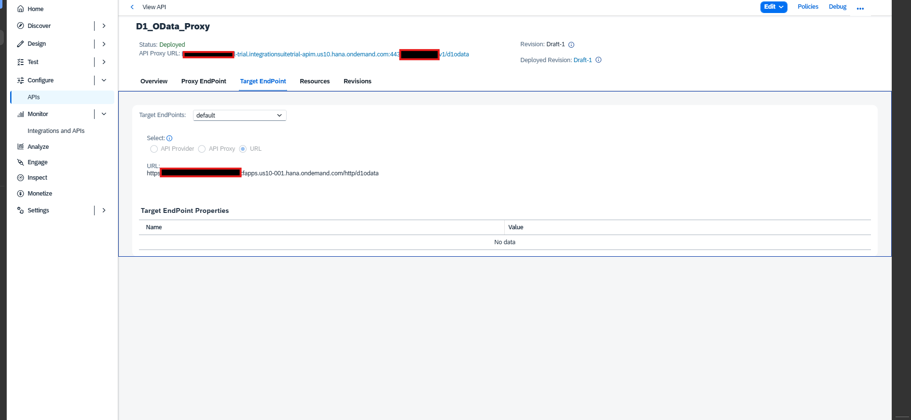
</a>

*Configuração da aba Target EndPoint, apontando para o endereço real de runtime do iFlow `D1_OData_Adapter` — URL borrada por conter o identificador do tenant.*

<a href="../evidences/lab18/07-monitor-d1-odata-adapter-endpoint.png" target="_blank">
  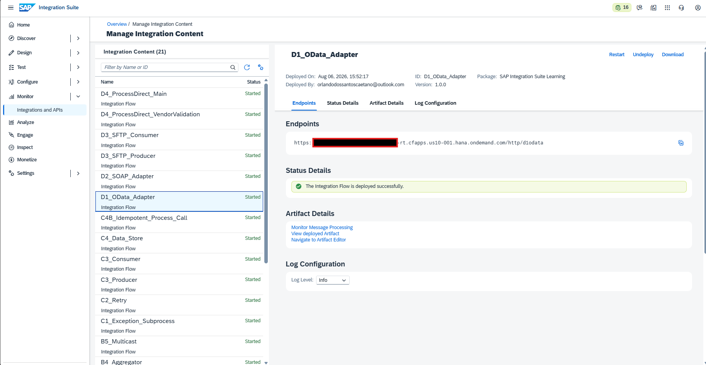
</a>

*Tela de Endpoints do iFlow `D1_OData_Adapter` no Monitor do Cloud Integration, usada para confirmar o endereço real e correto de runtime a ser utilizado no Target Endpoint do Proxy.*

### Primeiro teste — confirmando o comportamento esperado (sem Policy ainda)

<a href="../evidences/lab18/08-postman-proxy-401-unauthorized.png" target="_blank">
  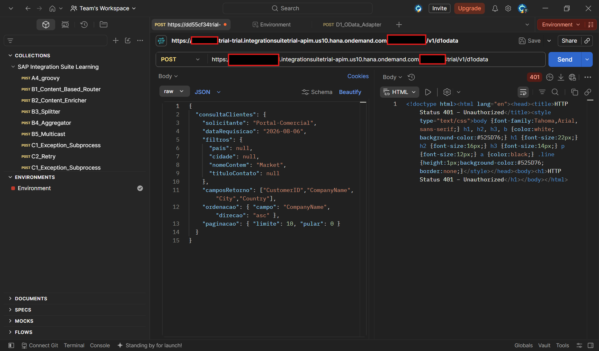
</a>

*Primeira chamada ao Proxy recém-criado, sem nenhuma Policy configurada ainda: o backend (iFlow) rejeita a chamada com `401 Unauthorized`, pois exige Basic Auth e o Proxy, por padrão, apenas repassa a requisição sem injetar nenhuma credencial. Este resultado confirma exatamente o comportamento esperado nesta etapa, e é o gatilho que justifica a necessidade da Policy de Basic Authentication implementada a seguir.*

Para efeito de comparação, o mesmo iFlow chamado **diretamente** (sem passar pelo Proxy), com Basic Auth preenchido no Postman, retorna corretamente:

<a href="../evidences/lab18/09-postman-iflow-direct-200-ok.png" target="_blank">
  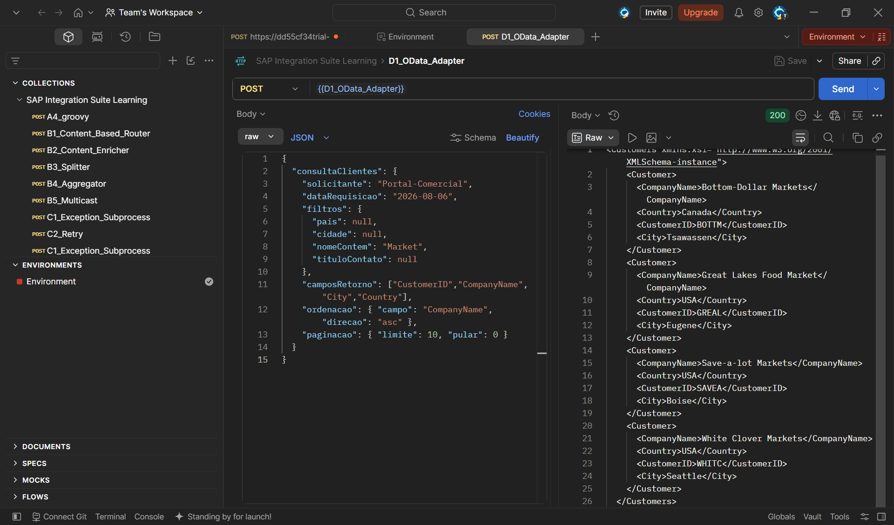
</a>

*Chamada direta ao iFlow `D1_OData_Adapter` (sem passar pelo Proxy), com Basic Auth preenchido manualmente no Postman — retorna `200 OK`, confirmando que o backend está funcional e que a credencial correta é de fato Basic Auth.*

---

## 🔧 E12 — Policy Basic Authentication com Key Value Map Criptografado

### Por que usar um Key Value Map em vez de credenciais literais na Policy

A forma mais simples de resolver o 401 seria escrever o usuário e senha **diretamente** dentro do XML da Policy Basic Authentication. Tecnicamente funciona, mas é uma prática de segurança inaceitável — qualquer pessoa com acesso de leitura à configuração do Proxy veria as credenciais em texto puro. A prática recomendada, documentada oficialmente pela SAP, é armazenar segredos em um **Key Value Map (KVM) criptografado**, e fazer a Policy apenas **referenciar** esses valores por variável, nunca escrevê-los diretamente.

### Passo 1 — Criar o Key Value Map

Em **Configure → Key Value Maps → Create**:

| Campo | Valor |
|---|---|
| Name | `KVM_D1_Backend_Credentials` |
| Encrypted | ✅ marcado |

Entradas adicionadas (uma por uma, com "Encrypt Key Value" marcado em cada):

| Key | Value |
|---|---|
| `UserID` | *(Client ID do backend)* |
| `Password` | *(Client Secret do backend)* |

> ⚠️ **Ponto de atenção**: a tela de criação de KVM pela interface **não oferece opção de escolher o Scope** (escopo de visibilidade). O sistema cria o KVM automaticamente no escopo `environment`, mesmo sem indicar isso visualmente — esse detalhe foi a causa raiz de um dos bugs mais difíceis de diagnosticar deste laboratório (ver seção de Troubleshooting).

### Passo 2 — Criar a Policy "Get-KVM-Credentials" (lê o KVM)

Em **Configure → APIs → D1_OData_Proxy → Policies**, selecionar **`TargetEndpoint: default → PreFlow`** e adicionar a Policy **Key Value Map Operations**:

```xml
<KeyValueMapOperations mapIdentifier="KVM_D1_Backend_Credentials" async="false" continueOnError="false" enabled="true" xmlns="http://www.sap.com/apimgmt">
    <Get assignTo="private.myusername" index="1">
        <Key>
            <Parameter>UserID</Parameter>
        </Key>
    </Get>
    <Get assignTo="private.mypassword" index="1">
        <Key>
            <Parameter>Password</Parameter>
        </Key>
    </Get>
    <Scope>environment</Scope>
</KeyValueMapOperations>
```

<a href="../evidences/lab18/11-policy-get-kvm-credentials-xml.png" target="_blank">
  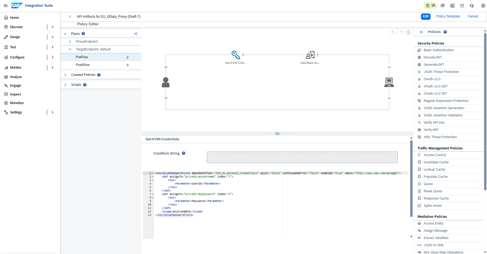
</a>

*XML final e funcional da Policy `Get-KVM-Credentials`. Não contém nenhum dado sensível — apenas nomes de variáveis e parâmetros, já que os valores reais permanecem criptografados dentro do KVM em todo momento.*

**Explicação linha a linha:**

| Elemento | Função |
|---|---|
| `mapIdentifier="KVM_D1_Backend_Credentials"` | Nome do KVM a ser consultado |
| `async="false"` | Executa de forma síncrona — garante que a leitura termine antes do próximo step iniciar |
| `<Get assignTo="private.myusername" index="1">` | Lê um valor do KVM e guarda em uma variável temporária chamada `private.myusername` |
| `<Key><Parameter>UserID</Parameter></Key>` | Nome exato da chave a ser lida no KVM (deve bater com o cadastrado, incluindo maiúsculas/minúsculas) |
| Prefixo `private.` nas variáveis | Convenção de segurança do API Management: variáveis com esse prefixo não aparecem em logs de trace/debug, mesmo depois de descriptografadas em memória |
| `<Scope>environment</Scope>` | Escopo de busca do KVM — precisa bater com o escopo real em que o KVM foi criado |

### Passo 3 — Criar a Policy "Add-Basic-Auth-Backend" (injeta o header Authorization)

Logo após a Policy anterior, no mesmo `TargetEndpoint: default → PreFlow`, adicionar a Policy **Basic Authentication**:

```xml
<BasicAuthentication async='false' continueOnError='false' enabled='true' xmlns='http://www.sap.com/apimgmt'>
    <Operation>Encode</Operation>
    <IgnoreUnresolvedVariables>false</IgnoreUnresolvedVariables>
    <User ref='private.myusername'></User>
    <Password ref='private.mypassword'></Password>
    <AssignTo createNew='true'>request.header.Authorization</AssignTo>
</BasicAuthentication>
```

<a href="../evidences/lab18/12-policy-add-basic-auth-backend-xml.png" target="_blank">
  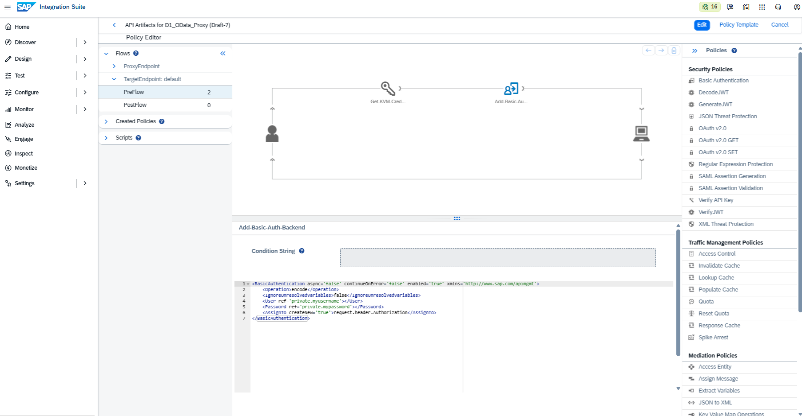
</a>

*XML final e funcional da Policy `Add-Basic-Auth-Backend`. Também sem dados sensíveis — o `ref=` aponta apenas para o nome das variáveis criadas pela Policy anterior, nunca para valores literais.*

**Explicação linha a linha:**

| Elemento | Função |
|---|---|
| `<Operation>Encode</Operation>` | Instrui a Policy a **codificar** usuário/senha em Base64 e montar o header `Authorization: Basic ...` (o oposto, `Decode`, serviria para interpretar um header já recebido) |
| `<User ref='private.myusername'>` | **Não** é o nome da chave do KVM — é uma referência (`ref=`) à variável criada pela Policy `Get-KVM-Credentials` na etapa anterior |
| `<AssignTo createNew='true'>request.header.Authorization</AssignTo>` | Define onde o resultado (o header Basic Auth codificado) será colocado — direto no header `Authorization` da requisição de saída para o backend |

### Passo 4 — Confirmar a ordem de execução

As duas Policies precisam necessariamente executar nesta ordem, dentro do mesmo `PreFlow`:
1. `Get-KVM-Credentials` (lê e cria as variáveis)
2. `Add-Basic-Auth-Backend` (consome as variáveis já criadas)

### Passo 5 — Deploy e teste final

<a href="../evidences/lab18/10-postman-proxy-basicauth-kvm-200-ok.png" target="_blank">
  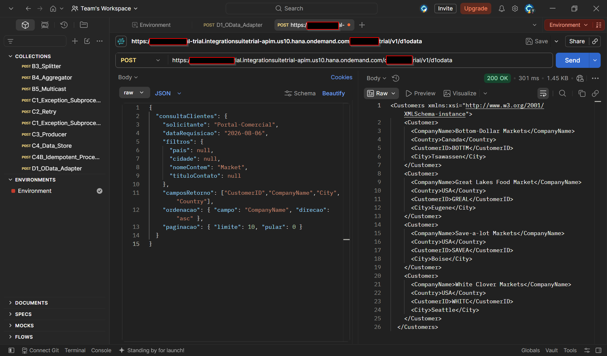
</a>

*Resultado final: chamada ao Proxy **sem qualquer autenticação** do lado do Postman (`Authorization: No Auth`), retornando `200 OK` com o XML de clientes — idêntico ao resultado obtido na chamada direta ao iFlow. O Proxy agora resolve toda a autenticação com o backend de forma autônoma, lendo as credenciais do KVM criptografado e injetando o header Basic Auth automaticamente antes de repassar a chamada.*

---

## 🔍 Troubleshooting & Lições Aprendidas

Este cenário foi o mais desafiador do projeto até o momento, exigindo o diagnóstico de **5 causas distintas** em sequência antes de atingir o resultado funcional. Documentado aqui em detalhe por seu alto valor de aprendizado.

### 1. Capability ativada, mas menu de API Management não aparece

**Causa:** ativar a capability em "Add Capabilities" registra apenas a intenção — o provisionamento real do runtime só é disparado ao acessar **Settings → Runtimes → Classic API Management → Activate**, um passo adicional não claramente documentado.

**Solução:** sempre completar esse segundo passo de ativação explícita do runtime.

### 2. Provisionamento trava com mensagem de permissão faltando

**Causa:** falta a Role Collection `APIManagement.SelfService.Administrator` atribuída ao usuário no BTP Cockpit — sem ela, o sistema nunca completa o provisionamento, independentemente de quantas vezes a página seja recarregada ou o cache limpo.

**Solução:** atribuir a role no Cockpit → Security → Users, antes de tentar novamente.

### 3. Test Connection do API Provider retorna 500 Internal Server Error

**Causa:** comportamento conhecido desta tela específica, relatado por outros usuários da comunidade SAP como um falso negativo — a conexão real, testada de forma indireta (criando o Proxy e chamando o backend), funciona corretamente mesmo com esse erro no botão de teste.

**Solução:** não bloquear o progresso por esse erro específico; validar a conexão real criando o Proxy e testando via Postman.

### 4. Ordem das Policies invertida no PreFlow

**Causa:** ao adicionar duas Policies em sequência, a ordem de execução no fluxo pode não corresponder à ordem de criação — é necessário confirmar visualmente e reordenar manualmente (setas de mover) quando necessário.

**Sintoma:** erro `Unresolved variable: private.myusername`, pois a Policy que usa a variável executava antes da Policy que a cria.

### 5. Mismatch de Scope entre o KVM e a Policy (causa raiz mais sutil)

**Causa:** a interface de criação de Key Value Maps não oferece a opção de escolher o Scope (escopo de visibilidade) — o sistema cria automaticamente no escopo `environment`, sem indicar isso na tela. A Policy `Get-KVM-Credentials`, por sua vez, estava configurada com `<Scope>apiproxy</Scope>` (um valor de exemplo herdado do template padrão da própria SAP). Como os dois escopos são espaços de armazenamento completamente distintos, a Policy nunca encontrava as chaves reais, deixando as variáveis `private.myusername`/`private.mypassword` permanentemente vazias — sem gerar um erro imediato e claro, apenas propagando o problema para a Policy seguinte (Basic Authentication), que só então acusava `Unresolved variable`.

**Solução:** alterar o `<Scope>` da Policy `Get-KVM-Credentials` de `apiproxy` para `environment`, alinhando com o escopo real onde o KVM foi criado.

> 💡 **Nota conceitual para o portfólio**: sempre que uma Policy de leitura de KVM não apresentar erro explícito, mas a variável seguinte aparecer como "Unresolved", suspeitar de **mismatch de Scope** ou de **diferença de maiúsculas/minúsculas no nome da chave** (`Parameter`) — ambos falham silenciosamente, sem mensagem de erro na própria Policy de leitura.

### Erro adicional identificado e corrigido: nomes de chave com case sensitivity diferente

**Causa:** o KVM foi criado com as chaves `UserID` e `Password` (conforme sugerido no exemplo inicial de documentação), mas a Policy de leitura inicialmente buscava por `username` e `password` (minúsculo) — como a correspondência é sensível a maiúsculas/minúsculas, a busca nunca encontrava as chaves reais.

**Solução:** ajustar o `<Parameter>` da Policy para usar exatamente `UserID` e `Password`, respeitando a grafia cadastrada no KVM.

---

## ✅ Conclusão

Este cenário unificou três marcos do Bloco E: a ativação completa da capability API Management (E0), a criação do primeiro API Proxy expondo um iFlow já existente do Bloco D (E1), e a implementação de uma Policy de segurança para autenticação do Proxy junto ao backend, com armazenamento seguro de credenciais via Key Value Map criptografado (E12). A jornada de troubleshooting, embora extensa, resultou em um conjunto valioso de lições sobre o funcionamento interno do runtime de API Management, escopo de Key Value Maps e a ordem de execução de Policies — conhecimento diretamente aplicável tanto à certificação quanto a projetos reais de consultoria SAP.

**Recursos praticados:** Ativação de capability API Management · Role Collections no BTP Cockpit · Process Integration Runtime (Service Instance/Key) · API Provider (Cloud Integration, OAuth2ClientCredentials) · API Proxy (criação via URL) · Target Endpoint · Policy Editor · Key Value Map Operations · Basic Authentication Policy · Key Value Map criptografado · Troubleshooting de Scope e case-sensitivity

**Cenário anterior:** ./19-d4-processdirect.md

**Próximo cenário:** ./21-e2-verify-api-key.md

---

## 🛠️ Ferramentas utilizadas

- **SAP Integration Suite** (Cloud Integration + API Management – Trial)
- **BTP Cockpit** (Subaccount, Instances and Subscriptions, Security/Users)
- **Postman** (testes de chamada direta ao iFlow e via Proxy)

---

## 👤 Autor

**Orlando Caetano**
🔗 [LinkedIn](https://www.linkedin.com/in/orlando-caetano/) | 💻 [GitHub](https://github.com/OrlandoCaetano2026)
