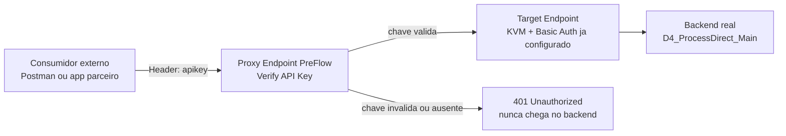
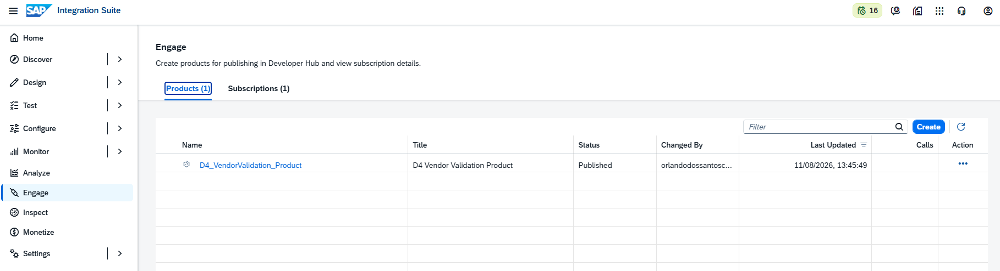
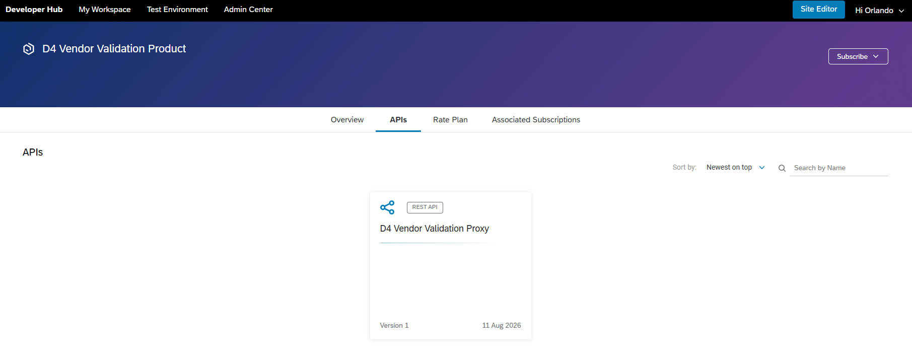
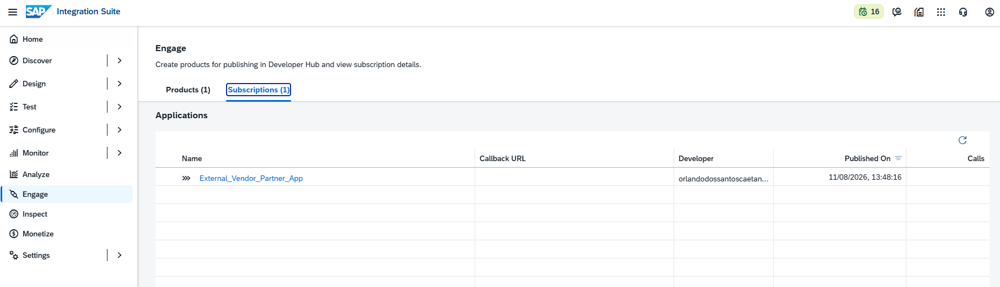
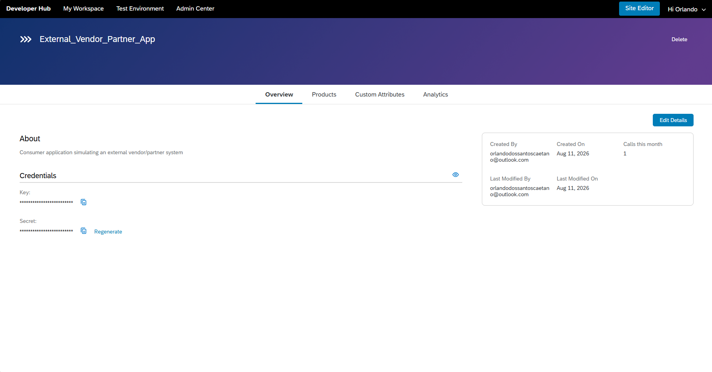
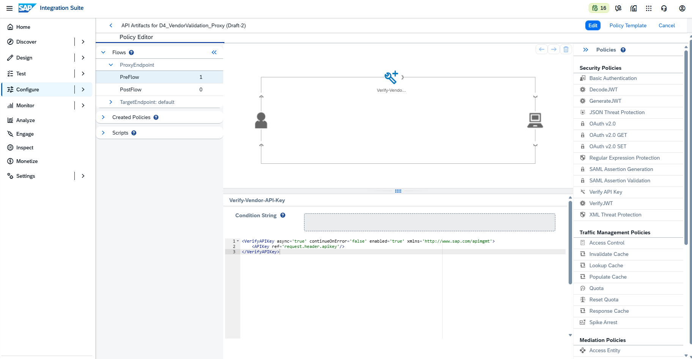
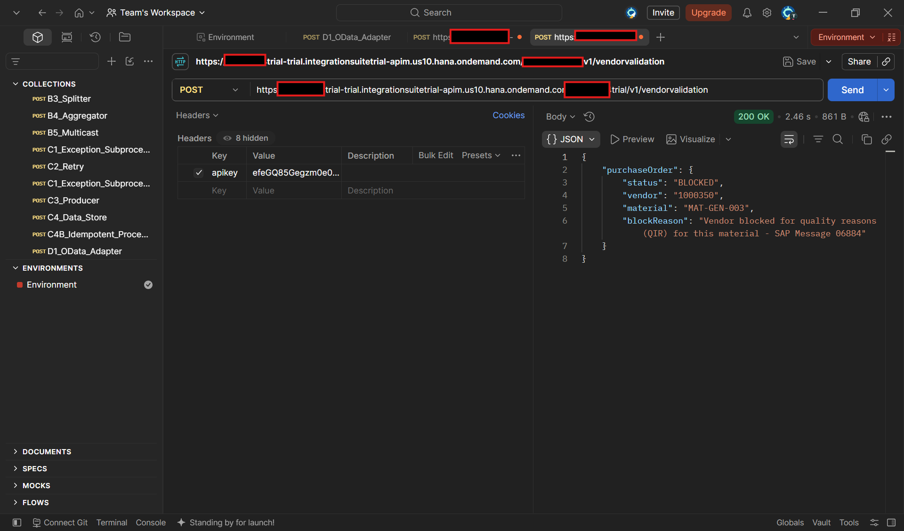
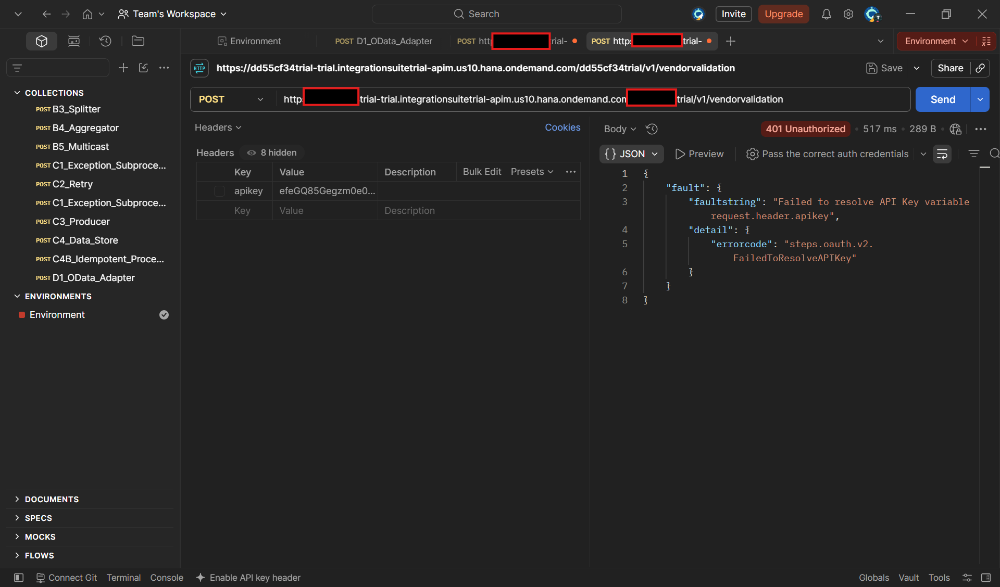

# 🔑 E2 — API Management: Policy Verify API Key

> **Bloco:** E — API Management
> **Cenário:** E2 (Policy: Verify API Key) — protege o Proxy contra consumidores externos não autorizados
> **Status:** ✅ Concluído e testado de ponta a ponta
> **Data de execução:** 11/08/2026

---

## 📌 Contexto de Negócio

O cenário anterior ([E0+E1+E12](./20-e-api-management-proxy-basic-auth.md)) resolveu a autenticação do **Proxy com o backend** — o `D4_VendorValidation_Proxy` já consegue se autenticar sozinho junto ao iFlow `D4_ProcessDirect_Main`, usando credenciais criptografadas em um Key Value Map. Mas havia um problema em aberto: **qualquer pessoa na internet**, sem nenhuma credencial, conseguia chamar esse Proxy livremente.

Este cenário resolve exatamente essa lacuna, protegendo o **lado do consumidor**: agora, apenas aplicações previamente registradas — cada uma com sua própria **API Key** — conseguem consumir o serviço de validação de fornecedor. Isso reflete um padrão extremamente comum em consultoria SAP real: uma multinacional expondo um serviço centralizado (como a validação de bloqueio de fornecedor) para múltiplas filiais ou sistemas parceiros, cada um identificado e controlado individualmente por sua própria chave — permitindo, por exemplo, revogar o acesso de uma filial específica sem afetar as demais.

---

## 🧠 Conceito: Verify API Key

Diferente da Policy **Basic Authentication** (aplicada no cenário anterior, no **Target Endpoint**, para autenticar o Proxy junto ao backend), a Policy **Verify API Key** é aplicada no **Proxy Endpoint → PreFlow** — ou seja, na porta de **entrada**, antes mesmo de qualquer outra Policy ser executada.



### Pré-requisito: a API Key nasce de um fluxo específico, não é gerada avulsa

Diferente do que parece à primeira vista, uma API Key não é criada isoladamente — ela é o resultado de uma cadeia de 3 objetos do API Management, todos interligados:

1. **API Product**: agrupa um ou mais API Proxies (no nosso caso, o `D4_VendorValidation_Proxy`), definindo o que pode ser consumido.
2. **Developer App**: representa o consumidor/aplicação externa (no nosso caso, `External_Vendor_Partner_App`, simulando um sistema parceiro).
3. **Subscription**: a vinculação entre o App e o Product — é essa vinculação que faz o sistema gerar automaticamente a **Consumer Key** (API Key) e o **Consumer Secret**.

Esses três objetos são gerenciados em duas telas diferentes do Integration Suite: o **Product** é criado em **Engage** (dentro do próprio Integration Suite), enquanto o **App** é criado no **Developer Hub** — um portal separado, com URL própria, acessado por um tile no canto superior direito da tela.

---

## 🔧 Passo 1 — Criar o novo API Proxy (backend: D4_ProcessDirect_Main)

Para não repetir o mesmo backend do cenário anterior, este Proxy expõe o iFlow `D4_ProcessDirect_Main` (validação de bloqueio de fornecedor — Purchasing Block e Quality Info Record/QIR), um cenário de negócio mais rico do que uma simples consulta de leitura.

Em **Configure → APIs → API Proxies → Create → URL**:

| Campo | Valor |
|---|---|
| Name | `D4_VendorValidation_Proxy` |
| Title | `D4 Vendor Validation Proxy` |
| API Base Path | `/v1/vendorvalidation` |
| Target Endpoint (URL) | `https://<tenant>.it-cpitrial06-rt.cfapps.us10-001.hana.ondemand.com/http/d4processdirect` |

A mesma combinação de Policies **Get-KVM-Credentials + Add-Basic-Auth-Backend** (validada no cenário anterior) foi replicada no `TargetEndpoint → PreFlow` deste novo Proxy, reaproveitando o KVM já criado — já que a credencial de autenticação com o backend é a mesma para todo o tenant. O teste direto confirmou o funcionamento de ponta a ponta antes de avançar para a proteção do consumidor:

```json
{
  "purchaseOrder": {
    "status": "BLOCKED",
    "vendor": "1000350",
    "material": "MAT-GEN-003",
    "blockReason": "Vendor blocked for quality reasons (QIR) for this material - SAP Message 06884"
  }
}
```

---

## 🔧 Passo 2 — Criar o API Product

Em **Engage → Products → Create**:

| Campo | Valor |
|---|---|
| Name | `D4_VendorValidation_Product` |
| Display Name | `D4 Vendor Validation Product` |
| Approval Type | `Automatic` |
| APIs | `D4_VendorValidation_Proxy` |
| Permission | `Public` (visível a todos os developers) |

> ⚠️ **Ponto de atenção descoberto no troubleshooting**: o botão **Publish** falhou repetidamente com um erro genérico, sem detalhes (`Show Details` não retornava nenhuma informação adicional). A causa raiz era a ausência de um **Rate Plan** vinculado ao Product — em algumas versões do Integration Suite, isso é um pré-requisito obrigatório para a publicação, mesmo que o plano seja gratuito e sem qualquer limite.

Rate Plan criado em **Monetize → Rate Plans → Create**:

| Campo | Valor |
|---|---|
| Name | `Free_Plan` |
| Product | `D4_VendorValidation_Product` |
| Basic Charge | `0` |
| Rate per API Call | `0.0` |
| API Calls From/To | `0` a `unlimited` |

Após vincular o `Free_Plan` na aba **Rate Plans** do Product, o **Publish** foi concluído com sucesso:

<a href="../evidences/lab19/01-engage-product-published-status.png" target="_blank">
  
</a>

*Tela `Engage → Products`, confirmando `D4_VendorValidation_Product` com `Status: Published`, após a criação e vinculação do Rate Plan `Free_Plan` — passo que havia sido o responsável pela falha silenciosa da publicação nas tentativas anteriores.*

---

## 🔧 Passo 3 — Acessar o Developer Hub e criar o Developer App

### Ativação de acesso ao Developer Hub (troubleshooting em cascata)

Diferente do restante do Integration Suite, o Developer Hub é um **portal separado**, acessado por um tile próprio no canto superior direito da tela (ícone de grade ⊞). O acesso a esse portal exigiu, ao todo, **5 Role Collections** distintas atribuídas ao usuário no BTP Cockpit, descobertas em sequência através de mensagens de erro específicas do próprio portal a cada tentativa de login:

| Ordem | Role Collection | Mensagem de erro que revelou a necessidade |
|---|---|---|
| 1 | `APIManagement.SelfService.Administrator` | Necessária desde o cenário E0, para o provisionamento do runtime clássico |
| 2 | `AuthGroup.API.Admin` | *"Manages Users and applications in SAP API Management developer hub"* |
| 3 | `AuthGroup.API.ApplicationDeveloper` | *"Application Developer in SAP API Management developer hub"* |
| 4 | `AuthGroup.SelfService.Admin` | *"Please assign the AuthGroup.SelfService.Admin role to yourself and log in again"* |

Somente após a atribuição de todas as roles, em sequência, com logout/login entre cada uma, o portal exibiu a tela completa de **"My Workspace"**.

### Criando o Developer App

Em **Developer Hub → My Workspace → Applications → Create**:

| Campo | Valor |
|---|---|
| Title | `External_Vendor_Partner_App` |
| Description | `Consumer application simulating an external vendor/partner system` |
| Products | `D4 Vendor Validation Product` |

<a href="../evidences/lab19/02-developer-hub-product-apis-tab.png" target="_blank">
  
</a>

*Página do produto `D4 Vendor Validation Product` dentro do Developer Hub, aba **APIs**, exibindo o card do `D4 Vendor Validation Proxy` disponível para assinatura — confirmando que o Product publicado no Passo 2 já está visível e consumível no portal do desenvolvedor.*

<a href="../evidences/lab19/03-engage-subscriptions-application-list.png" target="_blank">
  
</a>

*Tela `Engage → Subscriptions` no Integration Suite, confirmando (do lado administrativo) que o App `External_Vendor_Partner_App` foi criado e vinculado ao Product com sucesso — o mesmo vínculo visto do lado do desenvolvedor no Developer Hub.*

<a href="../evidences/lab19/07-developer-hub-app-credentials.png" target="_blank">
  
</a>

*Página de detalhes do App `External_Vendor_Partner_App`, exibindo a seção **Credentials** com a **Key** (Consumer Key) e o **Secret** (Consumer Secret) gerados automaticamente pelo sistema, ambos mascarados por padrão na interface — é a Key que será usada na Policy Verify API Key.*

---

## 🔧 Passo 4 — Aplicar a Policy Verify API Key no Proxy

Em **Configure → APIs → D4_VendorValidation_Proxy → Policies**, selecionando **`ProxyEndpoint → PreFlow`** (a porta de entrada, do lado do consumidor — diferente do `TargetEndpoint`, usado no cenário anterior para autenticação com o backend), adicionar a Policy **Verify API Key**, nomeada `Verify-Vendor-API-Key`:

```xml
<VerifyAPIKey async='true' continueOnError='false' enabled='true' xmlns='http://www.sap.com/apimgmt'>
    <APIKey ref='request.header.apikey'/>
</VerifyAPIKey>
```

<a href="../evidences/lab19/04-policy-verify-api-key-xml.png" target="_blank">
  
</a>

*Policy Editor mostrando a Policy `Verify-Vendor-API-Key` adicionada ao `ProxyEndpoint → PreFlow` (visível na árvore à esquerda) e seu XML final. O atributo `ref='request.header.apikey'` instrui a Policy a procurar a chave de autenticação no header HTTP chamado `apikey`, enviado pelo consumidor em cada requisição — diferente da Policy Basic Authentication do cenário anterior, aqui não há nenhum valor de credencial armazenado; a Policy apenas valida o que o consumidor envia contra as chaves ativas geradas pelo Developer Hub.*

---

## 🧪 Testes — Antes e Depois da proteção

### Com a API Key correta no header

**Request — POST**, com header `apikey` preenchido com a Consumer Key gerada para o `External_Vendor_Partner_App`:

<a href="../evidences/lab19/05-postman-proxy-apikey-200-ok.png" target="_blank">
  
</a>

*Requisição ao Proxy com o header `apikey` corretamente preenchido, retornando `200 OK` com o resultado da validação de fornecedor (`status: BLOCKED`, motivo QIR) — confirmando que a mensagem atravessou com sucesso as três camadas de proteção: Verify API Key (entrada) → Get-KVM-Credentials + Basic Authentication (saída para o backend) → D4_ProcessDirect_Main.*

### Sem a API Key no header (teste de rejeição)

<a href="../evidences/lab19/06-postman-proxy-401-missing-apikey.png" target="_blank">
  
</a>

*Mesma requisição, desta vez com o header `apikey` desmarcado/ausente, retornando `401 Unauthorized` com a mensagem `"Failed to resolve API Key variable request.header.apikey"` (`errorcode: steps.oauth.v2.FailedToResolveAPIKey`) — confirmando que a Policy bloqueia corretamente a chamada antes mesmo de qualquer tentativa de acesso ao backend, protegendo o serviço de consumidores não identificados.*

---

## 🔍 Troubleshooting & Lições Aprendidas

### 1. Publish do API Product falha silenciosamente sem detalhes de erro

**Causa:** ausência de um Rate Plan vinculado ao Product. O erro exibido era genérico, sem informação técnica útil mesmo ao expandir "Show Details".

**Solução:** criar um Rate Plan simples (Basic Charge = 0, Rate per API Call = 0.0, sem limite de chamadas) em **Monetize → Rate Plans**, e vinculá-lo ao Product antes de tentar publicar novamente.

### 2. Botão de criação de Application não aparece na tela "Engage → Subscriptions"

**Causa:** essa tela do Integration Suite é apenas uma **visualização administrativa** das Subscriptions já existentes — a criação de fato do App acontece em um portal completamente separado, o **Developer Hub**, acessado por um tile próprio.

**Solução:** localizar o tile "Developer Hub" no ícone de grade (⊞), no canto superior direito da tela do Integration Suite.

### 3. Acesso ao Developer Hub bloqueado em cascata, exigindo múltiplas Role Collections

**Causa:** o portal exige, ao todo, 4 Role Collections diferentes (além da já atribuída no E0), cada uma revelada apenas através de uma mensagem de erro específica exibida após a tentativa de login anterior ser corrigida — não há uma lista única e antecipada de todos os pré-requisitos.

**Solução:** seguir a sequência de mensagens de erro do próprio portal, atribuindo cada Role Collection indicada no BTP Cockpit e refazendo o login, até a tela completa do "My Workspace" ser exibida.

> 💡 **Nota conceitual para o portfólio**: este cenário demonstrou, na prática, a separação de responsabilidades entre o **Integration Suite** (onde administradores criam Proxies, Products e Policies) e o **Developer Hub** (onde consumidores/desenvolvedores externos se inscrevem em Products e obtêm suas próprias chaves) — um padrão arquitetural típico de portais de API corporativos, incluindo o SAP Business Accelerator Hub usado em cenários B2B reais.

---

## ✅ Conclusão

Este cenário completou o ciclo de segurança de ponta a ponta do Proxy `D4_VendorValidation_Proxy`, iniciado no cenário anterior: agora, tanto a **entrada** (consumidor → Proxy, via Verify API Key) quanto a **saída** (Proxy → backend, via KVM + Basic Authentication) estão protegidas, cada uma com o mecanismo apropriado ao seu propósito. Foi também a primeira vez no projeto em que o fluxo de **API Product → Developer App → Subscription** foi percorrido de ponta a ponta, incluindo a navegação entre o Integration Suite e o Developer Hub — dois portais distintos que, juntos, formam a experiência completa de gestão de API do SAP Integration Suite.

**Recursos praticados:** API Product (criação, Rate Plan, Publish) · Developer Hub (Role Collections, Applications, Subscriptions) · Policy Verify API Key · Consumer Key / Consumer Secret · Troubleshooting de publicação de Product e acesso ao Developer Hub

**Cenário anterior:** ./20-e-api-management-proxy-basic-auth.md

---

## 🛠️ Ferramentas utilizadas

- **SAP Integration Suite** (API Management – Trial)
- **SAP Developer Hub** (portal de gestão de Apps e Subscriptions)
- **BTP Cockpit** (atribuição de Role Collections)
- **Postman** (testes com e sem header `apikey`)

---

## 👤 Autor

**Orlando Caetano**
🔗 [LinkedIn](https://www.linkedin.com/in/orlando-caetano/) | 💻 [GitHub](https://github.com/OrlandoCaetano2026)
