# 🔐 E3 — API Management: OAuth 2.0 Client Credentials com Scopes Diferenciados

> **Bloco:** E — API Management
> **Cenário:** E3 (Policy: OAuth) — cenário robusto com escrita via API, servidor de tokens próprio e permissões diferenciadas por Scope
> **Status:** ✅ Concluído e testado de ponta a ponta (4 cenários de permissão validados)
> **Data de execução:** 11 e 12/08/2026

---

## 📌 Contexto de Negócio

Os cenários anteriores ([E0+E1+E12](./20-e-api-management-proxy-basic-auth.md) e [E2](./21-e2-verify-api-key.md)) resolveram a autenticação do Proxy com o backend (Basic Authentication + KVM) e a proteção contra consumidores não identificados (Verify API Key). Este cenário evolui significativamente o nível de segurança e realismo de negócio, introduzindo três elementos novos:

1. **OAuth 2.0 (Client Credentials)** no lugar de uma API Key estática — o consumidor passa a receber um **token temporário**, que expira automaticamente, em vez de uma chave permanente.
2. **A primeira operação de escrita via API do projeto** — um novo iFlow (`E3_VendorOverride`) capaz de **atualizar** (UPDATE) o status de bloqueio de um fornecedor diretamente no banco de dados, simulando a ação de um time de Compliance liberando um fornecedor previamente bloqueado.
3. **Scopes diferenciados** — dois tipos de consumidor (um Fornecedor externo e um time de Compliance interno) recebem tokens com **permissões diferentes**: o Fornecedor só pode consultar (`vendor.read`), enquanto o Compliance pode consultar e também liberar bloqueios (`vendor.read` + `vendor.write`).

Este é o cenário mais próximo de uma implementação real de mercado no projeto até aqui: reflete exatamente o tipo de arquitetura usada em portais de fornecedores, gateways de nota fiscal eletrônica e integrações B2B, onde múltiplos parceiros externos consomem o mesmo conjunto de serviços, cada um com um nível de permissão apropriado ao seu papel de negócio.

---

## 🧠 Conceito: por que OAuth 2.0 em vez de API Key?

### A analogia do prédio comercial

Uma **API Key** (usada no cenário E2) funciona como uma **chave física** de um prédio: ela abre a porta indefinidamente, até que alguém troque a fechadura manualmente. Se essa chave vazar, quem a possui tem acesso permanente.

O **OAuth 2.0** funciona como uma **portaria com crachás temporários**: o visitante (aplicação consumidora) se identifica na portaria (o servidor de tokens) apresentando um documento (Client ID + Client Secret), recebe um crachá que só vale por um tempo curto (no nosso caso, 1799 segundos, aproximadamente 30 minutos), e precisa retornar à portaria para obter um novo crachá quando o anterior expira. Se um crachá vazar, o estrago é limitado ao tempo restante de validade — diferente de uma chave física que continuaria funcionando para sempre.

### O fluxo escolhido: Client Credentials Grant

Existem várias formas de obter um token OAuth (Authorization Code, Implicit, Password, Client Credentials). Para este cenário, foi escolhido o fluxo **Client Credentials**, que é o padrão indicado para comunicação **servidor a servidor**, sem um usuário humano envolvido — exatamente o caso de duas empresas diferentes trocando dados automaticamente:

> *"The OAuth 2.0 client credentials grant flow permits a web service (confidential client) to use its own credentials, instead of impersonating a user, to authenticate when calling another web service... commonly used for server-to-server interactions."*

### Scopes: controlando não apenas quem entra, mas o que cada um pode fazer

Voltando à analogia: além do crachá temporário, este cenário introduz **dois tipos de crachá** — um crachá simples (azul), que só permite consultar informações, e um crachá completo (dourado), que também permite realizar alterações. Tecnicamente, isso é implementado através de **Scopes** — atributos anexados ao token que a Policy de validação verifica antes de autorizar uma ação específica.

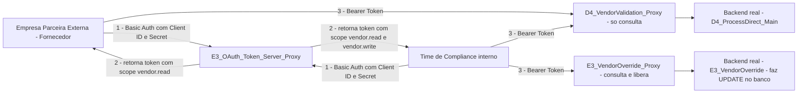

---

## 🏗️ Fase 1 — Primeira operação de escrita via API: o iFlow E3_VendorOverride

### Por que uma operação de escrita muda o jogo

Todos os cenários anteriores do projeto (A1 a E2) realizaram apenas **leituras** de dados — consultas OData, chamadas SOAP, leitura de arquivos, e SELECTs no banco via JDBC. Este é o primeiro cenário em que uma chamada de API efetivamente **modifica** um dado persistente (o status de bloqueio de um fornecedor no PostgreSQL), o que exige um cuidado adicional de segurança: nem todo consumidor deveria ter esse poder, daí a necessidade dos Scopes diferenciados implementados nas fases seguintes.

### Arquitetura do iFlow

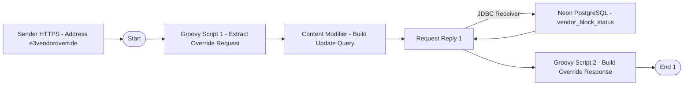

### Groovy Script 1 — Extract Override Request

```groovy
import com.sap.gateway.ip.core.customdev.util.Message
import groovy.json.JsonSlurper

def Message processData(Message message) {
    def reader = message.getBody(java.io.Reader.class)
    def json = new JsonSlurper().parse(reader)
    def vendor = json.fornecedor?.toString()
    def material = json.material?.toString()

    message.setProperty("vendor", vendor)
    message.setProperty("material", material)

    return message
}
```

### Content Modifier — Build Update Query

Seguindo o mesmo formato **XML SQL Format** já validado nos cenários D4 e E2 para operações de leitura (SELECT), aplicado agora a uma operação de escrita (UPDATE):

```xml
<root>
  <Statement1>
    UPDATE
      <table>vendor_block_status</table>
      <access>
        <purchasing_block>false</purchasing_block>
        <quality_block>false</quality_block>
        <block_reason></block_reason>
      </access>
      <key>
        <vendor_id>${property.vendor}</vendor_id>
        <material>${property.material}</material>
      </key>
    </vendor_block_status>
  </Statement1>
</root>
```

O padrão do formato permanece idêntico ao usado em consultas SELECT: um elemento com o atributo `action` (agora `UPDATE` em vez de `SELECT`), o elemento `<table>` como primeiro filho, seguido de `<access>` — que, diferente do SELECT (onde os elementos ficavam vazios, apenas indicando quais colunas retornar), aqui contém os **novos valores** a serem gravados — e `<key>`, definindo a condição WHERE que identifica qual registro atualizar.

### Groovy Script 2 — Build Override Response

```groovy
import com.sap.gateway.ip.core.customdev.util.Message
import groovy.json.JsonBuilder

def Message processData(Message message) {
    def vendor = message.getProperty("vendor")
    def material = message.getProperty("material")

    def result = [
        vendorOverride: [
            status: "UNBLOCKED",
            vendor: vendor,
            material: material,
            message: "Vendor block successfully removed by Compliance team"
        ]
    ]

    message.setBody(new JsonBuilder(result).toString())
    message.setHeader("Content-Type", "application/json")
    return message
}
```

### Validação com quatro pontos de prova cruzada

Para garantir que o UPDATE realmente funcionou (e não apenas retornou uma resposta de sucesso sem efeito real no banco), o teste desta fase foi estruturado em quatro etapas de confirmação encadeadas:

**1. Consulta inicial** ao `D4_ProcessDirect_Main` — fornecedor `1000350` retorna `status: BLOCKED`, motivo QIR.

**2. Execução do Override** via `E3_VendorOverride` — retorna `status: UNBLOCKED`.

<a href="../evidences/lab20/17-monitor-e3-vendoroverride-proxy-generated-update-sql.png" target="_blank">
  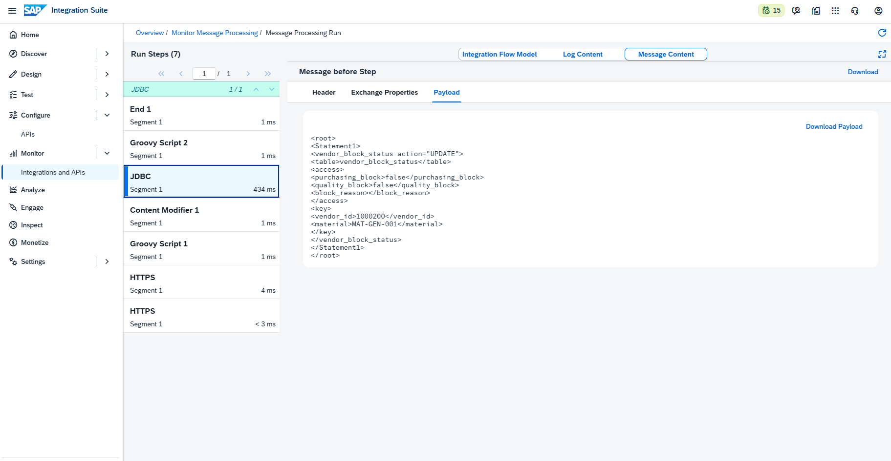
</a>

*Message Content do step JDBC no Monitor, exibindo o payload real enviado ao PostgreSQL: `UPDATE vendor_block_status SET purchasing_block=false, quality_block=false, block_reason='' WHERE vendor_id='1000200' AND material='MAT-GEN-001'` — confirmando que o Content Modifier gerou a instrução SQL corretamente a partir do template XML SQL Format.*

**3. Confirmação direta no banco** (fonte externa e independente do CPI):
```sql
SELECT * FROM vendor_block_status WHERE vendor_id = '1000350';
-- purchasing_block: f | quality_block: f | block_reason: (vazio)
```

**4. Nova consulta** ao `D4_ProcessDirect_Main` — o mesmo fornecedor agora retorna `status: CREATED`, confirmando que o bloqueio foi efetivamente removido.

<a href="../evidences/lab20/18-monitor-e3-vendoroverride-proxy-flow-model.png" target="_blank">
  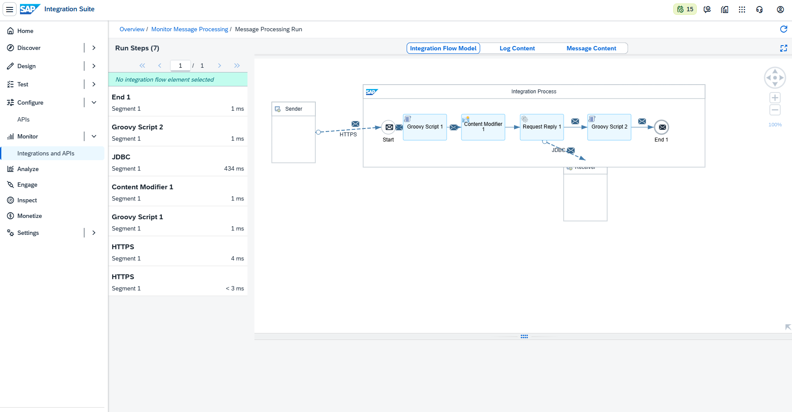
</a>

*Integration Flow Model exibindo a estrutura completa do processamento: Start → Groovy Script 1 → Content Modifier 1 → Request Reply 1 → (JDBC) → Groovy Script 2 → End 1. O uso do Request Reply (em vez de um envio final direto ao adapter) foi necessário para permitir que o processamento continuasse após a resposta do JDBC, montando a mensagem de confirmação de sucesso antes de finalizar o processo.*

---

## 🏗️ Fase 2 — O Servidor de Tokens (E3_OAuth_Token_Server_Proxy)

### Um Proxy sem backend real

Diferente de todos os Proxies anteriores do projeto, este não expõe nenhum iFlow — sua única função é **emitir tokens**. Por esse motivo, o Target Endpoint foi configurado apontando para um endereço fictício (`https://example.com`), já que essa versão do trial exige um valor preenchido no campo, mesmo que ele nunca seja de fato acionado (a Policy de geração de token responde e finaliza o processamento antes de a mensagem alcançar o Target Endpoint).

| Campo | Valor |
|---|---|
| Name | `E3_OAuth_Token_Server_Proxy` |
| API Base Path | `/v1/oauth/token` |
| Target Endpoint | `https://example.com` *(nunca efetivamente chamado)* |

### Policy: Generate-Vendor-Access-Token

Adicionada ao **Proxy Endpoint → PreFlow**:

```xml
<OAuthV2 async="false" continueOnError="false" enabled="true" xmlns="http://www.sap.com/apimgmt">
    <ExternalAuthorization>false</ExternalAuthorization>
    <GrantType>request.queryparam.grant_type</GrantType>
    <Operation>GenerateAccessToken</Operation>
    <GenerateResponse enabled="true"/>
    <SupportedGrantTypes>
        <GrantType>client_credentials</GrantType>
    </SupportedGrantTypes>
</OAuthV2>
```

<a href="../evidences/lab20/12-policy-generate-vendor-access-token-xml.png" target="_blank">
  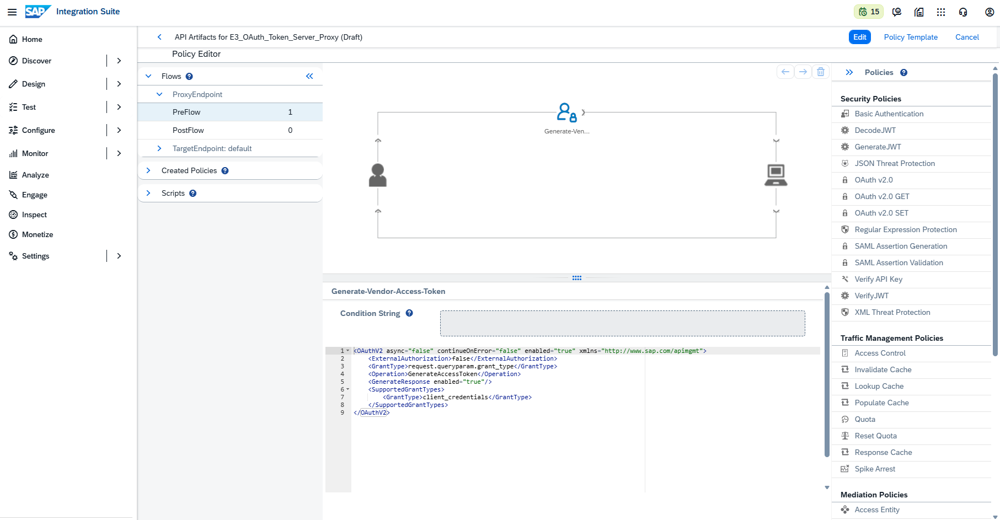
</a>

*Policy Editor do `E3_OAuth_Token_Server_Proxy`, exibindo a Policy `Generate-Vendor-Access-Token` com a operação `GenerateAccessToken`. O elemento `<GrantType>request.queryparam.grant_type</GrantType>` instrui a Policy a procurar o tipo de fluxo solicitado em um parâmetro de URL chamado `grant_type`, enquanto `<SupportedGrantTypes>` restringe o Proxy a aceitar apenas o fluxo `client_credentials`, coerente com o cenário de comunicação servidor-a-servidor.*

### Anatomia de uma requisição de token: dois lugares, dois propósitos

Uma dúvida legítima ao montar este teste no Postman foi entender por que parte da informação (`grant_type`) vai na URL, enquanto outra parte (Client ID e Client Secret) vai em um local diferente e "invisível" (o header HTTP).

| Informação | Onde vai | Por quê |
|---|---|---|
| `grant_type=client_credentials` | Query parameter da URL | Não é um segredo — é apenas uma instrução sobre qual tipo de operação está sendo solicitada. Pode ficar visível sem risco. |
| Client ID / Client Secret | Header `Authorization` (Basic Auth), montado automaticamente pelo Postman | São credenciais sensíveis — nunca devem aparecer em URLs, pois ficariam registradas em logs de servidor e históricos de navegação. O Header é o local apropriado do protocolo HTTP para esse tipo de dado. |

A Policy `OAuthV2`, ao não ter nenhuma configuração explícita de onde buscar usuário/senha, assume o comportamento padrão do protocolo OAuth: procura automaticamente no header `Authorization` (Basic Auth) — exatamente onde o Postman já havia posicionado o Client ID/Secret configurado na aba Authorization da requisição.

### Teste de emissão do token

**Request — POST**
```
{{E3_OAuth_Token_Server_Proxy}}?grant_type=client_credentials
```
Authorization: Basic Auth, Username = Consumer Key do `External_Vendor_Partner_App`, Password = Consumer Secret.

<a href="../evidences/lab20/13-postman-oauth-token-generated-200-ok.png" target="_blank">
  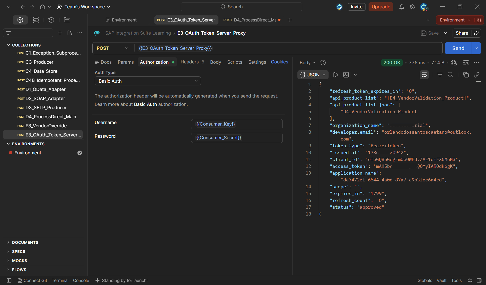
</a>

*Resposta `200 OK` da requisição de geração de token, exibindo o `access_token`, o `token_type: BearerToken`, `expires_in: 1799` (aproximadamente 30 minutos) e o `status: approved`. O campo `api_product_list` já reflete automaticamente quais Products o App consumidor tem direito de acessar — informação sensível, borrada nesta evidência.*

### Aplicando a verificação de token no Proxy de consulta

A Policy `Verify-Vendor-API-Key` (Verify API Key, do cenário E2) foi mantida no `D4_VendorValidation_Proxy`, porém **desativada** (`enabled="false"`), preservando o histórico do cenário anterior no mesmo Proxy. Uma nova Policy foi adicionada em seu lugar:

```xml
<OAuthV2 async="false" continueOnError="false" enabled="true" xmlns="http://www.sap.com/apimgmt">
    <ExternalAuthorization>false</ExternalAuthorization>
    <Operation>VerifyAccessToken</Operation>
</OAuthV2>
```

<a href="../evidences/lab20/14-policy-verify-vendor-access-token-xml.png" target="_blank">
  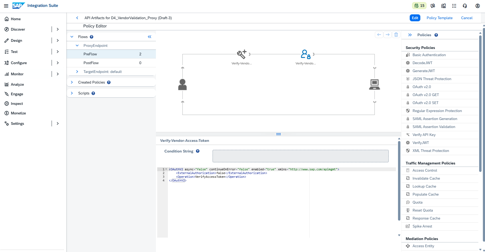
</a>

*Policy `Verify-Vendor-Access-Token` adicionada ao `D4_VendorValidation_Proxy`, operação `VerifyAccessToken` — responsável por validar que o Bearer Token enviado pelo consumidor é autêntico e ainda está dentro do prazo de validade.*

### Evidência espontânea: o token realmente expira

Durante os testes, uma pausa de aproximadamente 30 minutos entre a geração do token e sua utilização produziu, sem intenção, uma das evidências mais valiosas do cenário:

<a href="../evidences/lab20/15-postman-proxy-wrong-endpoint-401-html-error.png" target="_blank">
  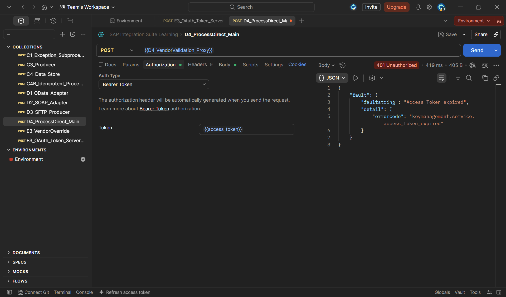
</a>

*Erro `"Access Token expired"` (`errorcode: keymanagement.service.access_token_expired`), obtido ao reutilizar um token gerado cerca de 30 minutos antes. Essa é a prova prática e não planejada da principal vantagem do OAuth sobre uma API Key estática: o token se torna inutilizável automaticamente após seu tempo de vida, sem qualquer ação manual de revogação.*

Gerando um novo token e repetindo a chamada, a resposta correta foi obtida:

<a href="../evidences/lab20/16-postman-proxy-oauth-200-ok-created.png" target="_blank">
  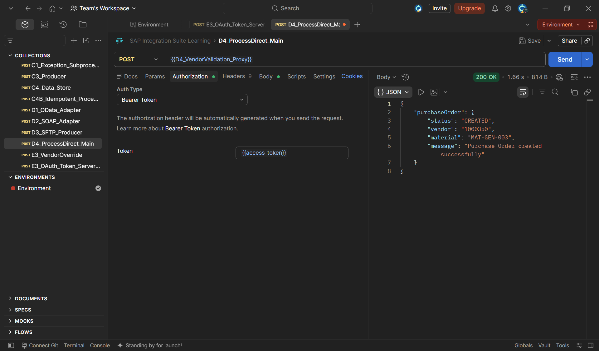
</a>

*Chamada bem-sucedida ao `D4_VendorValidation_Proxy` utilizando um Bearer Token recém-gerado e ainda válido, retornando `status: CREATED` — resultado consistente com o override realizado na Fase 1 para o mesmo fornecedor.*

---

## 🏗️ Fases 3 e 4 — Scopes Diferenciados: Fornecedor (leitura) vs. Compliance (leitura e escrita)

### Criando o Proxy de escrita e reaproveitando a autenticação de backend já validada

Um novo Proxy, `E3_VendorOverride_Proxy`, foi criado apontando para o iFlow `E3_VendorOverride` (Fase 1). As Policies `Get-KVM-Credentials` e `Add-Basic-Auth-Backend` — já validadas nos cenários anteriores — foram replicadas no `TargetEndpoint → PreFlow` deste novo Proxy, reaproveitando o mesmo Key Value Map (`KVM_D1_Backend_Credentials`), já que a credencial de autenticação com o backend é a mesma para todo o tenant.

| Campo | Valor |
|---|---|
| Name | `E3_VendorOverride_Proxy` |
| API Base Path | `/v1/vendoroverride` |
| Target Endpoint | `.../http/e3vendoroverride` |

### Configurando os Scopes nos dois API Products

O Scope é um atributo configurado diretamente no **API Product**, não na Policy — é o Product quem define, na prática, "o que o token emitido para este Product tem permissão de fazer".

| Product | Proxy vinculado | Scope |
|---|---|---|
| `D4_VendorValidation_Product` (já existente do E2) | `D4_VendorValidation_Proxy` | `vendor.read` |
| `E3_VendorOverride_Product` (novo) | `E3_VendorOverride_Proxy` | `vendor.write` |

<a href="../evidences/lab20/19-engage-e3-vendoroverride-product-overview-scope.png" target="_blank">
  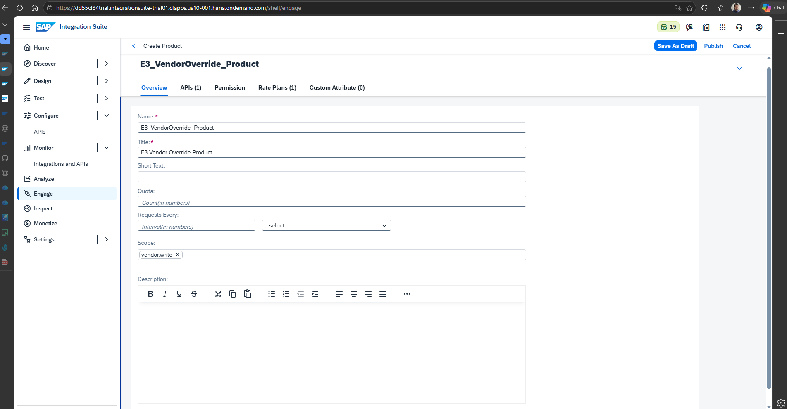
</a>

*Tela de criação do `E3_VendorOverride_Product`, aba Overview, com o campo `Scope: vendor.write` preenchido — este é o atributo que a Policy `VerifyAccessToken` (quando configurada para exigir um Scope específico) irá cobrar de qualquer token que tentar acessar este Product.*

<a href="../evidences/lab20/20-engage-products-list-published.png" target="_blank">
  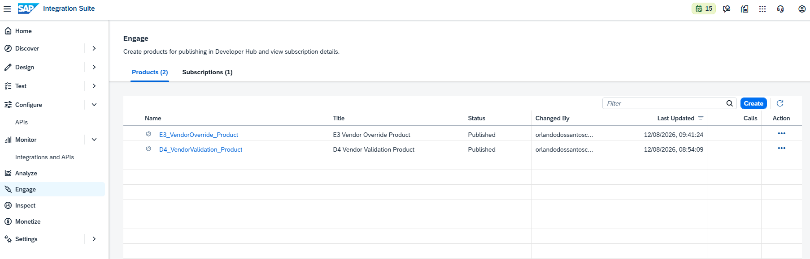
</a>

*Lista de Products em `Engage`, exibindo os dois já publicados (`E3_VendorOverride_Product` e `D4_VendorValidation_Product`), confirmados pelo toast "Product published successfully" — desta vez sem o erro silencioso enfrentado no cenário E2, já que o Rate Plan foi vinculado antes da primeira tentativa de publicação.*

### Protegendo o Proxy de escrita com exigência explícita de Scope

```xml
<OAuthV2 async="false" continueOnError="false" enabled="true" xmlns="http://www.sap.com/apimgmt">
    <ExternalAuthorization>false</ExternalAuthorization>
    <Operation>VerifyAccessToken</Operation>
    <Scope>vendor.write</Scope>
</OAuthV2>
```

A única diferença em relação à Policy usada no Proxy de consulta é a linha `<Scope>vendor.write</Scope>` — instruindo a Policy a não apenas validar que o token é autêntico, mas também que ele carrega especificamente essa permissão.

### Criando os dois consumidores: Fornecedor (já existente) e Compliance (novo)

O `External_Vendor_Partner_App`, criado no cenário E2, permanece assinando apenas o `D4_VendorValidation_Product` (`vendor.read`), representando o fornecedor externo com acesso apenas de consulta.

Um novo Developer App, `Compliance_Team_App`, foi criado assinando **ambos** os Products simultaneamente:

<a href="../evidences/lab20/21-developer-hub-compliance-app-create-review.png" target="_blank">
  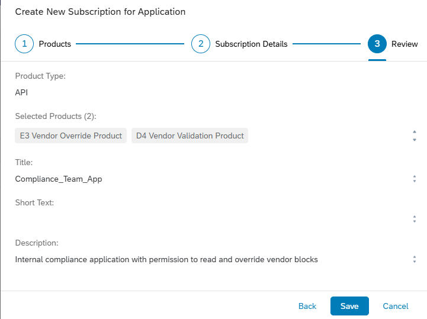
</a>

*Etapa final ("Review") da criação do `Compliance_Team_App` no Developer Hub, confirmando a seleção simultânea dos dois Products: `E3 Vendor Override Product` e `D4 Vendor Validation Product` — essa dupla assinatura é o que fará o token gerado para este App carregar ambos os Scopes.*

<a href="../evidences/lab20/22-developer-hub-compliance-app-credentials.png" target="_blank">
  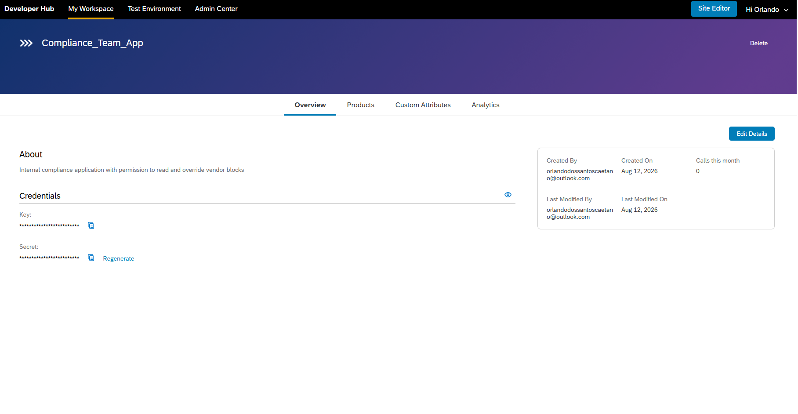
</a>

*Página de detalhes do `Compliance_Team_App`, exibindo a seção Credentials com Key e Secret gerados (mascarados por padrão) — essas credenciais serão usadas para obter o token com os dois Scopes.*

---

## 🧪 Os Quatro Testes — Prova Completa da Diferenciação de Permissões

### Teste 1 — Token do Compliance carrega os dois Scopes

**Request — POST** `{{E3_OAuth_Token_Server_Proxy}}?grant_type=client_credentials`, Basic Auth com `{{Compliance_Key}}` / `{{Compliance_Secret}}`.

<a href="../evidences/lab20/23-postman-compliance-token-generated-scope-read-write.png" target="_blank">
  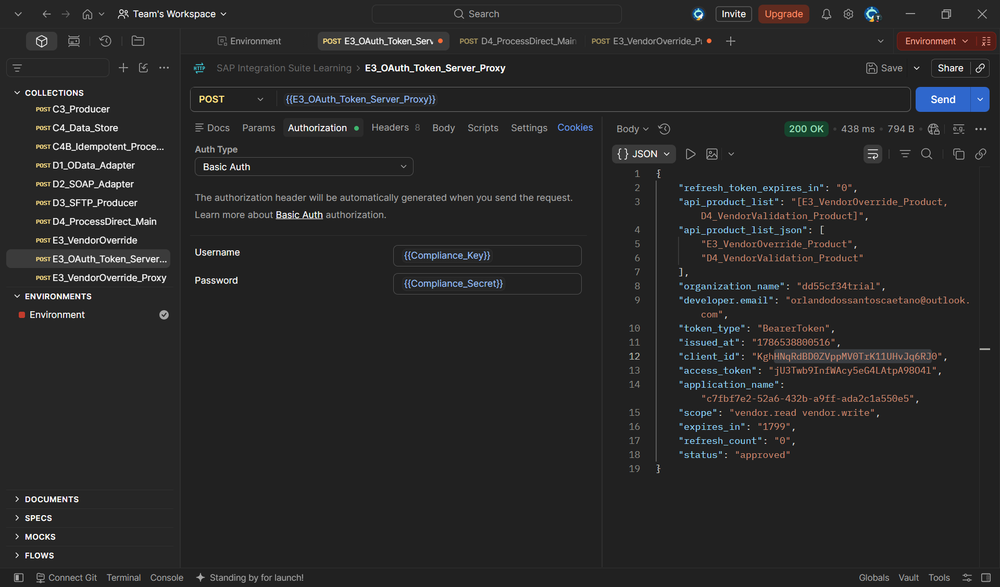
</a>

*Resposta confirmando `"scope": "vendor.read vendor.write"` e `"api_product_list": "[E3_VendorOverride_Product, D4_VendorValidation_Product]"` — o token do Compliance carrega, de fato, ambos os Products e ambos os Scopes, refletindo sua permissão ampliada.*

### Teste 2 — Token do Fornecedor carrega apenas o Scope de leitura

**Request** idêntica, trocando as credenciais para `{{Consumer_Key}}` / `{{Consumer_Secret}}` (`External_Vendor_Partner_App`).

<a href="../evidences/lab20/24-postman-vendor-token-generated-scope-read-only.png" target="_blank">
  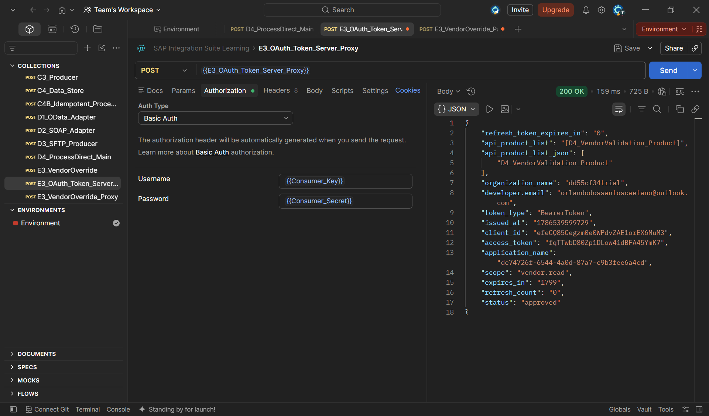
</a>

*Resposta confirmando `"scope": "vendor.read"` e `"api_product_list": "[D4_VendorValidation_Product]"` — apenas um Product listado, sem qualquer referência ao `E3_VendorOverride_Product`, já que este App nunca assinou aquele Product.*

### Teste 3 — Fornecedor tentando fazer Override (deve ser rejeitado)

**Request — POST** `{{E3_VendorOverride_Proxy}}`, Authorization Bearer Token = token do Fornecedor (Teste 2).

```json
{
  "fornecedor": "1000450",
  "material": "MAT-GEN-002"
}
```

<a href="../evidences/lab20/25-postman-vendor-override-401-no-product-match.png" target="_blank">
  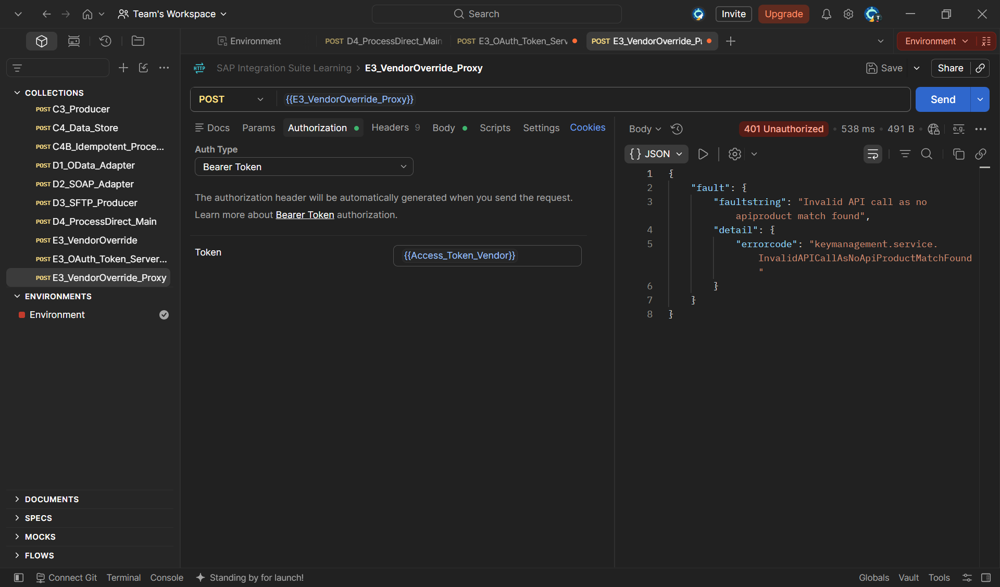
</a>

*Resposta `401 Unauthorized` com `"faultstring": "Invalid API call as no apiproduct match found"` (`errorcode: keymanagement.service.InvalidAPICallAsNoApiProductMatchFound"`). Este resultado, embora tenha o mesmo efeito prático de bloquear o acesso indevido, revela um detalhe técnico importante: a rejeição ocorreu na camada de **mapeamento Product-API** (o token do Fornecedor não pertence a nenhum App que tenha assinado um Product contendo este Proxy), e não especificamente na checagem de Scope — a verificação de Scope sequer chegou a ser avaliada, pois a requisição já havia sido barrada na etapa anterior. Isso demonstra que a arquitetura de API Management possui duas camadas independentes de controle de acesso operando em conjunto: primeiro a existência de uma associação válida entre o token e o Product que contém o recurso solicitado, e somente depois, se aplicável, a validação do Scope específico exigido pela Policy.*

### Teste 4 — Compliance fazendo o Override (deve ser autorizado)

**Request** idêntica, trocando o Bearer Token para o do Compliance (Teste 1).

<a href="../evidences/lab20/26-postman-compliance-override-200-ok.png" target="_blank">
  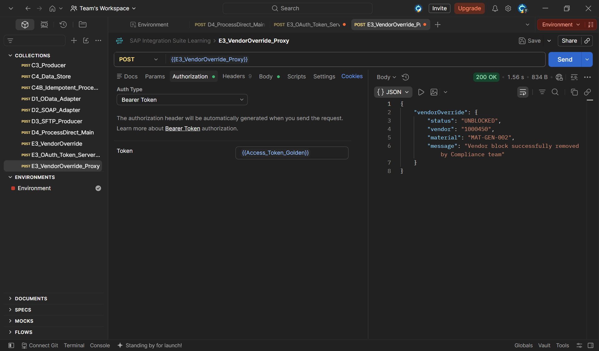
</a>

*Resposta `200 OK`, `"status": "UNBLOCKED"` — o time de Compliance, cujo token carrega o Scope `vendor.write` através da assinatura do `E3_VendorOverride_Product`, consegue realizar a operação de escrita com sucesso, completando a demonstração de que a mesma API é acessível de formas diferentes, dependendo estritamente da combinação de Products assinados por cada consumidor.*

### Resumo consolidado dos quatro testes

| # | Consumidor | Ação tentada | Scope do token | Resultado |
|---|---|---|---|---|
| 1 | Fornecedor | Consultar status (D4_VendorValidation) | `vendor.read` | ✅ 200 OK |
| 2 | Fornecedor | **Realizar Override (escrita)** | `vendor.read` | ❌ **401 — rejeitado** |
| 3 | Compliance | Consultar status | `vendor.read` + `vendor.write` | ✅ 200 OK |
| 4 | Compliance | **Realizar Override (escrita)** | `vendor.read` + `vendor.write` | ✅ **200 OK — autorizado** |

---

## 🔍 Troubleshooting & Lições Aprendidas

### 1. Groovy Script não abria no editor (erro "undefined could not be loaded")

**Causa:** falha momentânea de carregamento do editor web de scripts do CPI — não relacionada ao conteúdo do código.

**Solução:** fechar o modal de erro, desselecionar e reselecionar o elemento; se persistir, recarregar a página (F5).

### 2. Estrutura do iFlow não permitia um segundo Groovy Script após o JDBC

**Causa:** a conexão `End → (Adapter) → Receiver` representa um envio final do processo — não existe nenhum ponto de processamento após ela. Esse padrão funciona quando outro iFlow "pai" trata a resposta (como no `D4_ProcessDirect_VendorValidation`, chamado via ProcessDirect), mas não é adequado quando o próprio iFlow precisa continuar processando após receber a resposta do banco.

**Solução:** substituir o padrão `End → JDBC → Receiver` por `Request Reply → (JDBC) → Receiver`, permitindo que o processamento continue após a resposta, finalizando em um `Groovy Script` adicional e só então em um `End`.

### 3. `CredentialStoreCredentialNotFoundException` no JDBC

**Causa:** o campo JDBC Data Source Alias continha um valor digitado incorretamente (incluindo texto do próprio rótulo do campo, em vez de apenas o nome real do Data Source).

**Solução:** copiar o valor exato de um iFlow que já funciona corretamente (`D4_ProcessDirect_VendorValidation`), garantindo correspondência precisa com o nome cadastrado em Manage JDBC Data Sources.

### 4. `Invalid XML input` na instrução UPDATE

**Causa:** a mesma classe de erro já enfrentada nos cenários D2 e D4 — a tag de abertura da instrução SQL (`UPDATE`) foi digitada como texto solto, sem os caracteres `<` e `>` ao redor, quebrando a estrutura XML.

**Solução:** garantir que a tag de abertura seja um elemento XML real, com o atributo `action="UPDATE"`, validado programaticamente antes da aplicação em produção.

### 5. Chamada ao endpoint incorreto (iFlow direto em vez do Proxy)

**Causa:** ao testar o Bearer Token, a URL utilizada apontava para a variável do iFlow direto (`D4_ProcessDirect_Main`), que exige Basic Auth simples e não reconhece Bearer Tokens — apenas o Proxy (`D4_VendorValidation_Proxy`) possui a Policy `VerifyAccessToken` configurada.

**Solução:** sempre confirmar que a URL de teste aponta para o endereço do **Proxy** (API Management) quando o objetivo é testar uma Policy de segurança, e não para o endpoint do iFlow (Cloud Integration) diretamente.

> 💡 **Nota conceitual para o portfólio**: este cenário demonstrou, na prática, que o controle de acesso do API Management opera em múltiplas camadas independentes — a associação entre token e Product (validada primeiro) e o Scope específico exigido pela Policy (validado depois, apenas se a primeira camada for satisfeita). Um erro de "Product não encontrado" e um erro de "Scope insuficiente" podem, na prática, representar o mesmo resultado de negócio (acesso negado), mas têm causas técnicas distintas — uma distinção valiosa para diagnosticar problemas de autorização em ambientes reais.

---

## ✅ Conclusão

Este cenário elevou substancialmente o nível de sofisticação do portfólio, sendo o primeiro a combinar: escrita de dados via API (não apenas leitura), um servidor de tokens OAuth 2.0 próprio configurado do zero, e uma arquitetura de permissões diferenciadas por Scope, testada e comprovada através de quatro cenários de acesso distintos. A jornada também reforçou, na prática, a vantagem de segurança do OAuth sobre uma API Key estática — através de uma evidência real e não planejada de expiração de token — e revelou uma nuance técnica importante sobre as camadas independentes de controle de acesso no SAP API Management (mapeamento Product-API e verificação de Scope).

**Recursos praticados:** OAuth 2.0 Client Credentials Grant · Policy OAuthV2 (GenerateAccessToken e VerifyAccessToken) · Scopes de API Product · Múltiplos Developer Apps com diferentes níveis de permissão · Operação de escrita (UPDATE) via JDBC · Request Reply para continuidade de processamento pós-JDBC · Troubleshooting de estrutura de iFlow, XML SQL Format e mapeamento Product-API

**Cenário anterior:** [E2 — Verify API Key](./21-e2-verify-api-key.md)

---

## 🛠️ Ferramentas utilizadas

- **SAP Integration Suite** (Cloud Integration + API Management – Trial)
- **SAP Developer Hub** (gestão de Applications e Subscriptions)
- **Neon** — PostgreSQL serverless (primeira operação de escrita via API do projeto)
- **Postman** (testes com múltiplos tokens e Scopes distintos)

---

## 👤 Autor

**Orlando Caetano**
🔗 [LinkedIn](https://www.linkedin.com/in/orlando-caetano/) | 💻 [GitHub](https://github.com/OrlandoCaetano2026)
