# 📊 E4 + E5 — API Management: Quota Dinâmica por Rate Plan e Spike Arrest

> **Bloco:** E — API Management
> **Cenários:** E4 (Policy: Quota) — planos comerciais diferenciados (Free vs. Premium) com limite de chamadas resolvido dinamicamente · E5 (Policy: Spike Arrest) — proteção contra rajadas instantâneas de tráfego
> **Status:** ✅ Concluídos e testados, incluindo descobertas técnicas relevantes sobre o escopo de aplicação da Quota e o comportamento real do Spike Arrest
> **Data de execução:** 12/08/2026

> 💡 Os dois cenários foram documentados em um único arquivo por serem conceitualmente complementares — ambos são **Traffic Management Policies**, configurados no mesmo Proxy (`D4_VendorValidation_Proxy`), na mesma sequência de execução (`Spike Arrest` antes de `Quota`, conforme recomendação oficial da SAP), e compartilham o mesmo objetivo geral de controlar tráfego, ainda que sob dimensões diferentes: volume total acumulado (Quota) versus velocidade instantânea entre chamadas (Spike Arrest).

---

## 📌 Contexto de Negócio

O cenário [E3 — OAuth 2.0 e Scopes](./22-e3-oauth-scopes.md) diferenciou **o que** cada consumidor pode fazer (leitura apenas, ou leitura e escrita). Este cenário evolui a arquitetura de API Management para diferenciar **quanto** cada consumidor pode chamar, simulando uma situação extremamente comum em portais de fornecedores e marketplaces B2B reais: a comercialização de **níveis de plano** diferentes para parceiros externos, cada um com um volume de consumo contratado.

Dois perfis de fornecedor foram simulados:

| Perfil | Rate Plan | Quota configurada | Representa |
|---|---|---|---|
| Fornecedor pequeno | `Free_Plan` (já existente do cenário E2) | 5 chamadas / minuto | Parceiro testando a integração, ou com baixo volume de operações |
| Fornecedor grande | `Premium_Plan` (novo) | 100 chamadas / minuto | Parceiro com contrato comercial ampliado, volume de operações elevado |

O time de Compliance interno (`Compliance_Team_App`, já criado no E3) também foi incluído nos testes, revelando uma nuance técnica importante sobre como a Quota é efetivamente aplicada — detalhada na seção de resultados abaixo.

---

## 🧠 Conceito: Quota Dinâmica vs. Quota Fixa

A forma mais simples de implementar um limite de chamadas seria escrever o número diretamente na Policy (ex: "permitir 5 chamadas por minuto"), criando uma Policy separada para cada nível de plano. Essa abordagem, no entanto, não escala: a cada novo plano comercial criado, seria necessário duplicar a Policy inteira.

A **Quota Dinâmica** resolve isso com uma única Policy, que **lê o limite automaticamente do Product** ao qual o consumidor está vinculado através do seu token — o mesmo princípio usado por qualquer produto SaaS real (Netflix, AWS, etc., não têm "código diferente" por cliente; eles consultam o plano contratado e aplicam a regra correspondente).

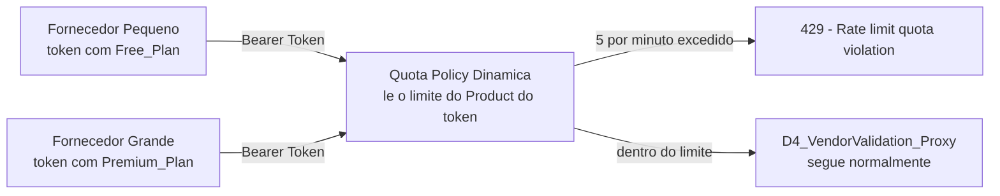

---

## 🏗️ Passo 1 — Criando o Rate Plan Premium

Em **Monetize → Rate Plans → Create**:

| Campo | Valor |
|---|---|
| Name | `Premium_Plan` |
| Product | `D4_VendorValidation_Product` *(seleção inicial no formulário — ver descoberta abaixo)* |
| Frequency | `Monthly` |
| Basic Charge | `0` |
| Rate per API Call | `0.0` |
| API Calls From/To | `0` a `unlimited` |

<a href="../evidences/lab21/01-monetize-premium-plan-rate-plan-config.png" target="_blank">
  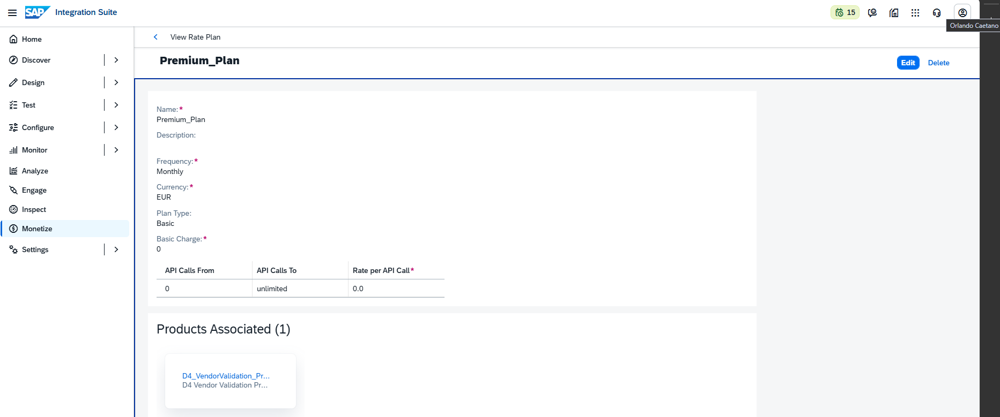
</a>

*Tela de criação do Rate Plan `Premium_Plan` em Monetize, sem cobrança comercial associada (Basic Charge e Rate per API Call zerados), já que o foco deste laboratório é demonstrar o controle de volume de chamadas, não a cobrança monetária em si.*

### Descoberta técnica: um Product só pode ter um Rate Plan vinculado

Ao tentar adicionar o `Premium_Plan` ao `D4_VendorValidation_Product` já existente — mantendo também o `Free_Plan` — a interface do Integration Suite **não permitiu**: o botão "Add" da aba Rate Plans do Product permanece desabilitado assim que já existe um Rate Plan vinculado. Essa é uma regra de negócio da própria plataforma: **a relação entre API Product e Rate Plan é de um para um**, não um para muitos.

**Solução adotada:** em vez de dois Rate Plans dentro do mesmo Product, foi criado um **segundo Product**, apontando para o **mesmo Proxy** e o **mesmo Scope** do Product original, porém vinculado ao `Premium_Plan`:

| Product | Proxy | Scope | Rate Plan |
|---|---|---|---|
| `D4_VendorValidation_Product` (já existente) | `D4_VendorValidation_Proxy` | `vendor.read` | `Free_Plan` |
| `D4_VendorValidation_Premium_Product` (novo) | `D4_VendorValidation_Proxy` (o mesmo) | `vendor.read` | `Premium_Plan` |

> 💡 **Nota conceitual para o portfólio**: essa é, de fato, a forma correta e recomendada de modelar planos comerciais distintos em uma plataforma de API Management — cada nível de plano corresponde a um Product diferente no catálogo (mesmo que todos apontem para o mesmo Proxy/recurso técnico por trás), não a uma variação de configuração dentro de um único Product.

<a href="../evidences/lab21/02-engage-d4-vendorvalidation-premium-product-overview.png" target="_blank">
  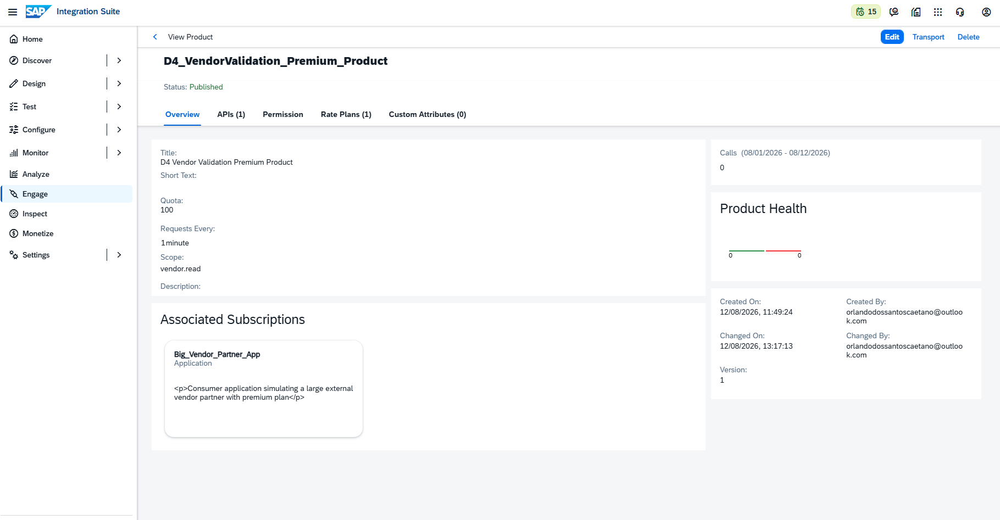
</a>

*Overview do novo Product `D4_VendorValidation_Premium_Product`, com o campo `Quota: 100` e `Requests Every: 1 minute` preenchidos — esses dois campos são a fonte de dados que a Policy de Quota Dinâmica irá consultar automaticamente em tempo de execução.*

<a href="../evidences/lab21/03-engage-d4-vendorvalidation-product-quota-free-config.png" target="_blank">
  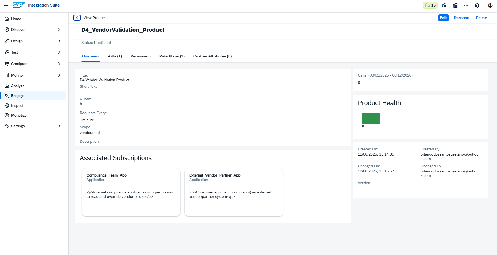
</a>

*Overview do Product original `D4_VendorValidation_Product`, revertido de volta ao `Free_Plan` após a tentativa inicial de reutilização, com `Quota: 5` e `Requests Every: 1 minute` — o plano de entrada, com volume de chamadas mais restrito.*

---

## 🏗️ Passo 2 — Criando o Consumidor "Fornecedor Grande"

Um novo Developer App foi criado no Developer Hub, assinando exclusivamente o Product Premium:

| Campo | Valor |
|---|---|
| Title | `Big_Vendor_Partner_App` |
| Products | `D4 Vendor Validation Premium Product` |

<a href="../evidences/lab21/04-developer-hub-big-vendor-partner-app-create.png" target="_blank">
  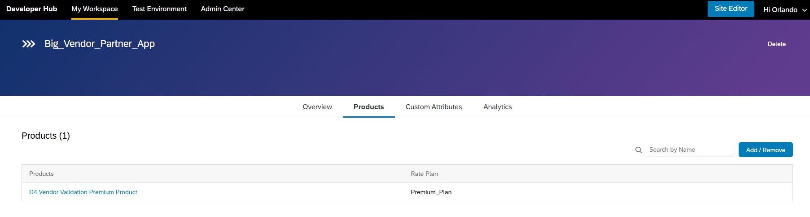
</a>

*Criação do `Big_Vendor_Partner_App` no Developer Hub, assinando o `D4_VendorValidation_Premium_Product` — este App representa, na simulação de negócio, um fornecedor de maior porte com contrato comercial ampliado.*

<a href="../evidences/lab21/05-developer-hub-big-vendor-partner-app-credentials.png" target="_blank">
  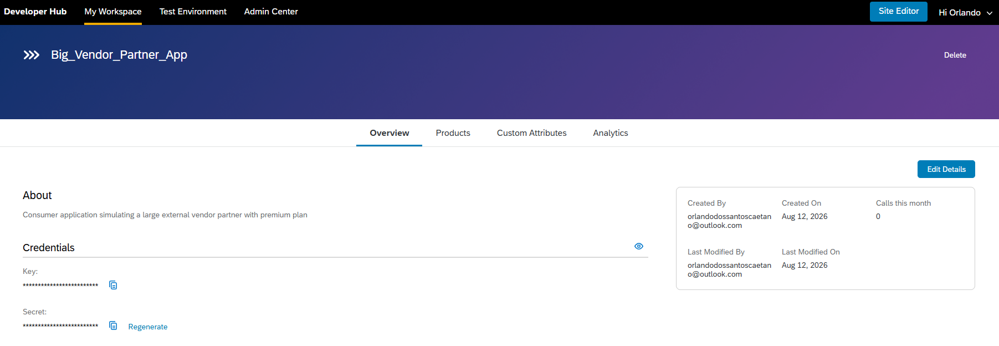
</a>

*Credenciais (Consumer Key e Secret, mascaradas por padrão) geradas para o `Big_Vendor_Partner_App`, usadas para obter tokens vinculados ao plano Premium.*

---

## 🏗️ Passo 3 — Configurando a Policy de Quota Dinâmica

A Policy foi adicionada ao `D4_VendorValidation_Proxy`, no `ProxyEndpoint → PreFlow`, posicionada **após** a Policy `Verify-Vendor-Access-Token` já existente (a Quota só deve ser avaliada depois que a identidade do consumidor for confirmada):

```xml
<Quota async="false" continueOnError="false" enabled="true" xmlns="http://www.sap.com/apimgmt">
    <Identifier ref="consumer_id"/>
    <Allow countRef="apiproduct.developer.quota.limit"/>
    <Interval ref="apiproduct.developer.quota.interval"/>
    <Distributed>true</Distributed>
    <Synchronous>true</Synchronous>
    <TimeUnit ref="apiproduct.developer.quota.timeunit"/>
</Quota>
```

<a href="../evidences/lab21/06-policy-quota-by-rate-plan-xml.png" target="_blank">
  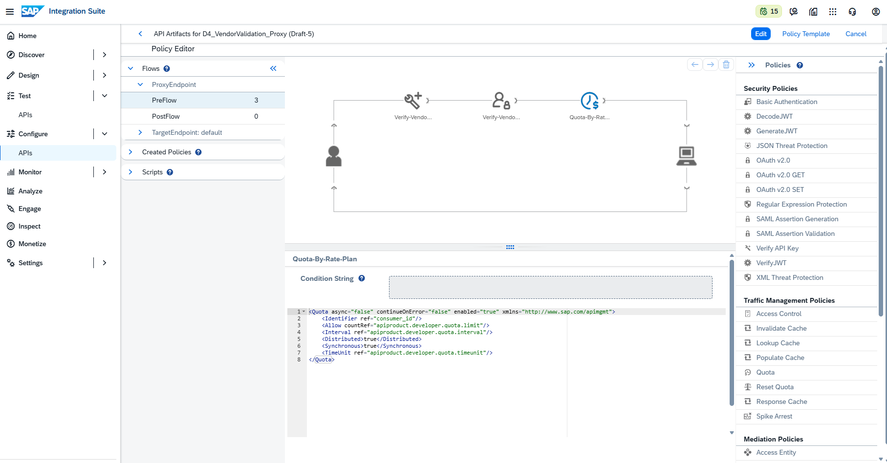
</a>

*Policy `Quota-By-Rate-Plan` no Policy Editor, posicionada no `ProxyEndpoint → PreFlow`, após as duas Policies de segurança já existentes (Verify API Key, desativada, e Verify Access Token, ativa) — a ordem de execução das Policies é sempre da esquerda para a direita no diagrama.*

### Explicando os elementos

| Elemento | Função |
|---|---|
| `<Identifier ref="consumer_id"/>` | Define que o contador de chamadas deve ser segregado por identidade do consumidor (obtida do token OAuth), não um único contador global compartilhado |
| `<Allow countRef="apiproduct.developer.quota.limit"/>` | Em vez de um número fixo, referencia dinamicamente o valor do campo **Quota** configurado no Product do consumidor |
| `<Interval ref="apiproduct.developer.quota.interval"/>` | Referencia dinamicamente o valor do campo **Requests Every** do Product |
| `<TimeUnit ref="apiproduct.developer.quota.timeunit"/>` | Referencia a unidade de tempo (minuto, hora, dia) selecionada junto ao campo Requests Every |
| `<Distributed>true</Distributed>` / `<Synchronous>true</Synchronous>` | Garantem que a contagem seja consistente mesmo em ambientes com múltiplas instâncias de processamento, sem condições de corrida |

Nenhum valor numérico é escrito diretamente na Policy — todos os limites são resolvidos em tempo de execução a partir da configuração de cada Product.

---

## 🧪 Testes Realizados

### Teste 1 — Fornecedor Free: bloqueio a partir da sexta chamada

Seis requisições consecutivas ao `D4_VendorValidation_Proxy`, com um token obtido através do `External_Vendor_Partner_App` (vinculado ao `D4_VendorValidation_Product`, Quota de 5/minuto):

<a href="../evidences/lab21/07-postman-vendor-free-plan-quota-exceeded-429.png" target="_blank">
  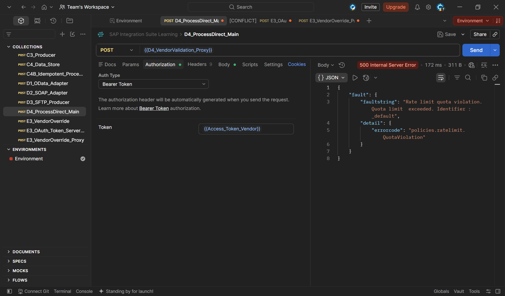
</a>

*Sexta chamada consecutiva retornando o erro `"Rate limit quota violation. Quota limit exceeded. Identifier : _default"` (`errorcode: policies.ratelimit.QuotaViolation`), enquanto as cinco chamadas anteriores haviam retornado `200 OK` normalmente — confirmando que o limite de 5 chamadas por minuto configurado no Product Free foi respeitado com precisão.*

> 📌 O rótulo `_default` exibido no campo `Identifier` da mensagem de erro é um texto genérico da própria mensagem de violação, não um indicativo de que o contador seja compartilhado entre consumidores diferentes — o Teste 2 confirma que os contadores são, de fato, segregados corretamente.

### Teste 2 — Fornecedor Premium: nenhum bloqueio dentro do limite de 100/minuto

A mesma sequência de seis chamadas rápidas, agora usando um token do `Big_Vendor_Partner_App` (vinculado ao `D4_VendorValidation_Premium_Product`, Quota de 100/minuto):

<a href="../evidences/lab21/08-postman-vendor-premium-plan-200-ok.png" target="_blank">
  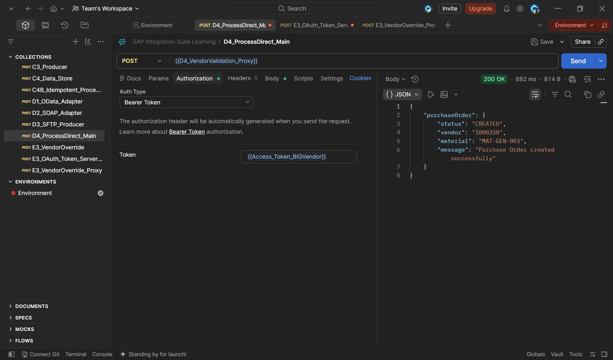
</a>

*Chamada bem-sucedida (`200 OK`, `status: CREATED`) utilizando o token do plano Premium — nenhuma das seis chamadas foi bloqueada, confirmando que o contador deste consumidor é independente do contador do Fornecedor Free, e que o limite de 100 chamadas por minuto está corretamente configurado e distante de ser atingido.*

<a href="../evidences/lab21/09-monitor-d4-processdirect-vendorvalidation-22-messages.png" target="_blank">
  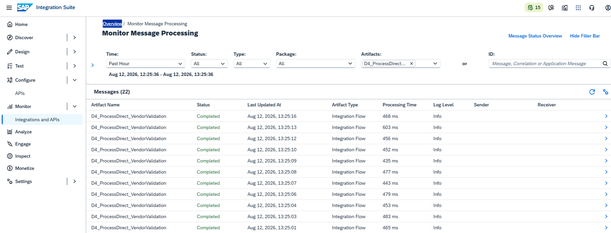
</a>

*Monitor de Mensagens do Cloud Integration, filtrado pelo iFlow `D4_ProcessDirect_VendorValidation`, exibindo 22 mensagens com status `Completed` processadas em poucos segundos — volume de chamadas consistente com o comportamento esperado do plano Premium, muito acima do que o plano Free permitiria sem bloqueio.*

### Teste 3 — Resultado inesperado: o token do Compliance também foi bloqueado

Ao testar o token do `Compliance_Team_App` (que carrega `api_product_list: [E3_VendorOverride_Product, D4_VendorValidation_Product]`, ou seja, os dois Products do cenário E3) contra o mesmo `D4_VendorValidation_Proxy`:

<a href="../evidences/lab21/10-postman-compliance-token-blocked-by-quota.png" target="_blank">
  
</a>

*A chamada com o token do Compliance retornou a mesma mensagem de `Rate limit quota violation` obtida no Teste 1, apesar de o Compliance ser um consumidor com Scope de escrita habilitado (`vendor.read vendor.write`) e, em princípio, um perfil de maior privilégio que o Fornecedor Free.*

### A explicação: a Quota está vinculada à relação Product-Proxy, não ao App como um todo

Investigando esse resultado, a causa é consistente com a arquitetura do SAP API Management: quando um token carrega múltiplos Products associados, a Policy de Quota identifica, dentre os Products do consumidor, **qual deles concede acesso ao Proxy específico sendo chamado** — e aplica a Quota configurada *nesse* Product, independentemente de o consumidor ter também outros Products com regras diferentes.

Como o `Compliance_Team_App` **não possui um Product próprio e exclusivo** para acessar o `D4_VendorValidation_Proxy` (ele utiliza o mesmo `D4_VendorValidation_Product` já usado pelo Fornecedor Free para essa finalidade — o único Product de sua lista que contém este Proxy específico), ele herda a mesma Quota de 5 chamadas por minuto ao realizar consultas de leitura, mesmo sendo, em termos de Scope, um consumidor com privilégios superiores.

Isso não compromete o propósito de negócio deste cenário: a atuação real do time de Compliance é a operação de **override** (escrita), realizada através do `E3_VendorOverride_Proxy`/`E3_VendorOverride_Product`, que não possui nenhuma Quota configurada e, portanto, não é afetada por esta limitação. Uma extensão natural e possível — não implementada neste cenário para não ampliar ainda mais seu escopo — seria criar um Product interno dedicado ao Compliance para consultas de leitura, sem Quota associada, caso o volume de consultas do time interno viesse a ser uma restrição real em um cenário de produção.

---

---

## 🏗️ E5 — Spike Arrest: Proteção Contra Rajadas Instantâneas

### Contexto de negócio

A Quota (E4) protege o negócio contra o **volume total** de chamadas de um consumidor ao longo de um período (5 por minuto, 100 por minuto). Mas existe um problema diferente que a Quota sozinha não resolve: e se um sistema do Fornecedor tiver um bug — um loop infinito, uma falha de retry mal configurada — e disparar, por exemplo, **10 chamadas no mesmo segundo**? Mesmo que o total ainda esteja dentro da Quota mensal contratada, esse pico instantâneo poderia sobrecarregar o backend momentaneamente.

A Policy **Spike Arrest** resolve exatamente esse cenário: ela não olha para o total acumulado, apenas para o **intervalo mínimo exigido entre uma chamada e a próxima**.

### Quota vs. Spike Arrest: a distinção central

| Aspecto | Quota (E4) | Spike Arrest (E5) |
|---|---|---|
| O que controla | Volume **total** num período longo (ex: 5 por minuto, 100 por dia) | **Velocidade/intervalo** entre chamadas consecutivas, em uma janela muito curta |
| Objetivo | Modelo comercial — limitar uso conforme plano contratado | Proteção técnica — evitar que uma rajada repentina (ou bug em loop) sobrecarregue o backend |
| Analogia | "Você contratou 5 corridas de táxi por dia" | "Não adianta chamar 5 táxis ao mesmo tempo no mesmo segundo — um de cada vez, com intervalo mínimo" |

A própria documentação oficial recomenda que, quando as duas Policies são usadas juntas, o **Spike Arrest deve ser posicionado antes da Quota** no fluxo de execução — reflexo dessa configuração no `D4_VendorValidation_Proxy`, onde a ordem final ficou: `Verify-Vendor-Access-Token → Spike-Arrest-Vendor → Quota-By-Rate-Plan`.

### Configuração da Policy

Adicionada ao `ProxyEndpoint → PreFlow`, posicionada entre a Policy de autenticação e a de Quota:

```xml
<SpikeArrest async="true" continueOnError="false" enabled="true" xmlns="http://www.sap.com/apimgmt">
    <Rate>1ps</Rate>
    <UseEffectiveCount>true</UseEffectiveCount>
</SpikeArrest>
```

<a href="../evidences/lab21/11-policy-spike-arrest-vendor-xml-1ps.png" target="_blank">
  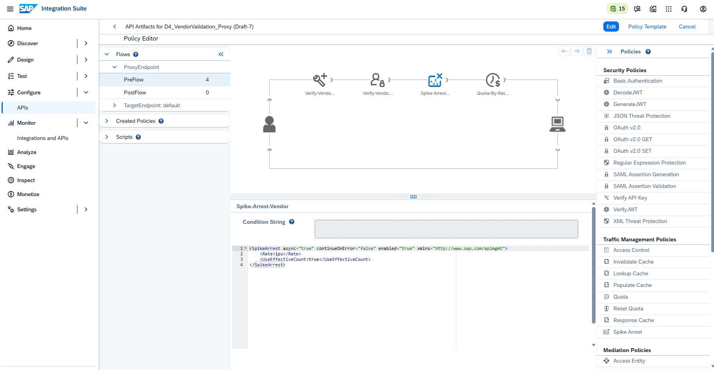
</a>

*Policy Editor do `D4_VendorValidation_Proxy`, exibindo o diagrama do `ProxyEndpoint → PreFlow` com as quatro Policies em sequência (Verify API Key, desativada; Verify Access Token; Spike Arrest; Quota), e o XML final da Policy `Spike-Arrest-Vendor` com `<Rate>1ps</Rate>` — configurado para permitir apenas uma chamada por período de referência, um valor propositalmente restritivo para tornar o bloqueio evidente mesmo em testes de baixo volume.*

| Elemento | Função |
|---|---|
| `<Rate>1ps</Rate>` | Define o limite de chamadas por segundo (`ps` = per second). O valor `1ps` foi escolhido deliberadamente baixo para o teste — em um cenário real, seria calibrado conforme a capacidade real do backend (ex: `30ps`) |
| `<UseEffectiveCount>true</UseEffectiveCount>` | Garante que, em ambientes com múltiplas instâncias de processamento, a contagem considere o tráfego agregado de todas elas, evitando que o limite seja multiplicado indevidamente |

### Ajuste de calibração durante os testes

Uma primeira tentativa de teste utilizou `<Rate>10ps</Rate>`, buscando validar o bloqueio através do Postman Collection Runner (50 iterações, delay de 0 ms). O resultado, no entanto, mostrou todas as 50 chamadas retornando `200 OK`, sem nenhum bloqueio.

**Causa:** o Collection Runner do Postman, mesmo configurado com delay zero, processa as requisições de forma sequencial (não literalmente simultânea), e o tempo real de rede e processamento do backend (em torno de 450-600 ms por chamada, conforme observado no Monitor) resultou em uma cadência efetiva de aproximadamente 1 chamada por segundo — bem abaixo do limite de `10ps` configurado, que nunca chegou a ser violado.

**Solução:** reduzir o Rate para um valor extremamente baixo (`1ps`), compatível com a velocidade real que o ambiente de teste consegue gerar, permitindo demonstrar o bloqueio sem depender de uma ferramenta de geração de carga mais sofisticada.

### Teste e resultado

Com a Policy calibrada em `1ps`, o mesmo teste via Collection Runner produziu o comportamento esperado: um padrão alternado de sucessos e bloqueios, dependendo do intervalo real entre cada chamada disparada pelo Runner.

<a href="../evidences/lab21/12-postman-runner-spike-arrest-mixed-200-500.png" target="_blank">
  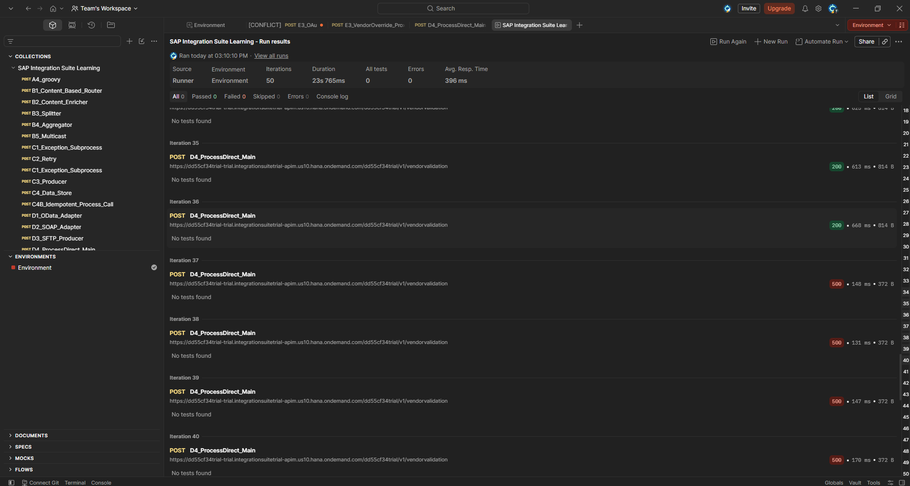
</a>

*Resultado do Collection Runner mostrando iterações consecutivas com respostas alternadas entre `200` (chamadas espaçadas por mais de um segundo da anterior) e `500` (chamadas que caíram dentro da mesma janela de tempo de uma chamada já processada) — confirmando visualmente que o Spike Arrest reage à proximidade temporal entre requisições, não ao volume total.*

<a href="../evidences/lab21/13-postman-spike-arrest-violation-500-detail.png" target="_blank">
  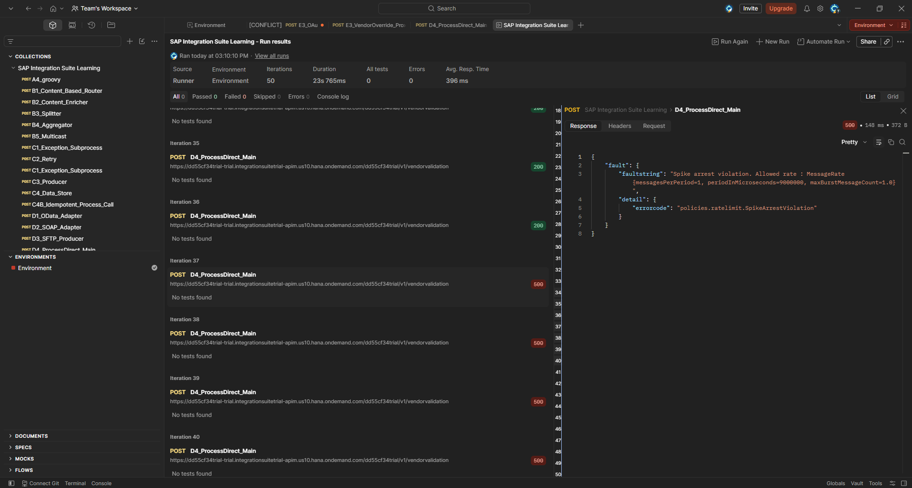
</a>

*Detalhe de uma das respostas bloqueadas: `"Spike arrest violation. Allowed rate : MessageRate{messagesPerPeriod=1, periodInMicroseconds=9000000, maxBurstMessageCount=1.0}"` (`errorcode: policies.ratelimit.SpikeArrestViolation`). Nota-se que o `periodInMicroseconds` reportado (9.000.000 microssegundos, equivalente a 9 segundos) é maior que o intervalo de 1 segundo sugerido pela notação `1ps` — uma particularidade de como a SAP calcula internamente a janela de referência da Policy, sem alterar o efeito prático observado de bloquear chamadas em rajada.*

<a href="../evidences/lab21/14-monitor-d4-processdirect-vendorvalidation-messages-varying-seconds.png" target="_blank">
  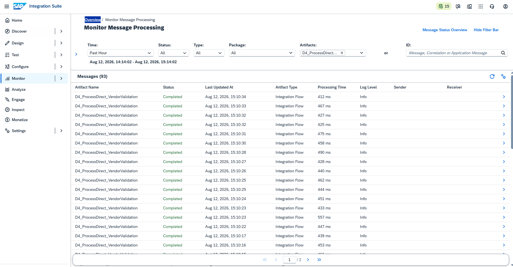
</a>

*Monitor de Mensagens filtrado pelo iFlow `D4_ProcessDirect_VendorValidation`, exibindo 93 mensagens processadas com sucesso (`Completed`), com timestamps de "Last Updated At" apresentando intervalos variados entre si — alguns segundos consecutivos (15:10:32, 15:10:31), outros com saltos de vários segundos (15:10:17 para 15:10:16, e depois um salto maior até a próxima). Essa variação reflete exatamente as chamadas que **conseguiram** passar pela Policy Spike Arrest, enquanto as que caíram dentro da mesma janela de bloqueio nunca chegaram a ser processadas pelo backend — nem sequer aparecem no Monitor, já que foram rejeitadas ainda na camada do API Management, antes de alcançar o Cloud Integration.*

### Uma alternativa de mercado para simular rajadas reais: Apache JMeter

O Postman, mesmo através do Collection Runner, tem uma limitação conhecida: sua execução é fundamentalmente sequencial (baseada em um único processo Node.js/Electron), o que impede a geração de tráfego verdadeiramente concorrente. Para cenários onde seja necessário simular uma rajada de requisições genuinamente simultâneas — como testes de carga e performance mais rigorosos — a ferramenta consolidada no mercado para esse propósito é o **Apache JMeter**, gratuita e de código aberto, projetada especificamente para orquestrar múltiplas "threads" (usuários virtuais) disparando requisições ao mesmo tempo, permitindo configurar cenários como "50 usuários simultâneos, cada um enviando uma chamada instantaneamente". Embora não tenha sido utilizada neste laboratório — já que o Postman Collection Runner se mostrou suficiente para demonstrar o comportamento da Policy —, o JMeter é a ferramenta recomendada para validações de Spike Arrest e testes de carga mais próximos de um cenário de produção real.

---

## 🔍 Troubleshooting & Lições Aprendidas

### 1. Um Product só pode ter um Rate Plan vinculado

**Causa:** regra de negócio da própria plataforma — o botão de adicionar um segundo Rate Plan a um Product já associado a um permanece desabilitado na interface.

**Solução:** modelar cada nível de plano comercial como um **Product distinto**, todos apontando para o mesmo Proxy/recurso técnico quando aplicável, em vez de tentar múltiplos Rate Plans dentro de um único Product.

### 2. `FailedToResolveQuotaIntervalReference` ao testar a Policy pela primeira vez

**Causa:** os campos **Quota** e **Requests Every** dos Products ainda estavam vazios no momento do primeiro teste — a Policy Dinâmica depende inteiramente desses valores estarem preenchidos no Product para resolver as referências `apiproduct.developer.quota.*`.

**Solução:** preencher os campos Quota/Requests Every em ambos os Products (Free e Premium) antes de testar a Policy.

### 3. Ordem obrigatória dos elementos no XML da Policy Quota

**Causa:** o schema (XSD) da Policy `Quota` exige uma sequência rígida de elementos, diferente da ordem intuitiva (`Interval → TimeUnit → Allow`). Foram necessárias três tentativas de reordenação até encontrar a sequência aceita: `Identifier → Allow → Interval → Distributed → Synchronous → TimeUnit`.

**Sintoma:** mensagens de erro do tipo `"Invalid content was found starting with element '<Interval>'. One of '<Identifier, MessageWeight, Allow>' is expected"` ao tentar publicar (Update) a Policy.

**Solução:** utilizar a própria mensagem de erro do editor como guia — ela indica exatamente quais elementos são esperados em cada ponto da sequência — em vez de assumir uma ordem lógica ou seguir exemplos genéricos sem validação prévia.

### 4. Consumidor com múltiplos Products sofre a Quota do Product específico que concede acesso ao recurso chamado

**Causa e detalhamento:** já descritos na análise do Teste 3, acima. Esta não é propriamente um erro de configuração, mas um comportamento de design da plataforma que precisa ser considerado ao planejar arquiteturas com consumidores que acumulam múltiplos Products.

> 💡 **Nota conceitual para o portfólio**: a Policy Quota do SAP API Management opera na relação **Product-Proxy**, não diretamente sobre a identidade do consumidor como um todo. Um mesmo Developer App, ao acessar diferentes Proxies através de diferentes Products, pode estar sujeito a diferentes Quotas (ou nenhuma), dependendo de qual Product concede acesso àquele recurso específico — um comportamento relevante ao desenhar arquiteturas de API com múltiplos níveis de consumidor compartilhando recursos entre si.

### 5. Ferramenta de teste (Postman Runner) não gera velocidade suficiente para violar um Rate configurado de forma realista

**Causa:** o Postman Collection Runner processa requisições de forma sequencial, e o tempo de rede/processamento naturalmente envolvido em cada chamada (450-600 ms neste ambiente) limita a cadência máxima prática a aproximadamente 1 chamada por segundo — insuficiente para violar um `Rate` configurado de forma realista para produção (ex: `10ps` ou `30ps`).

**Solução:** calibrar o `Rate` da Policy para um valor artificialmente baixo (`1ps`) durante o teste em ambiente de laboratório, compatível com a velocidade que a ferramenta de teste disponível consegue efetivamente gerar. Para testes de carga que necessitem simular Rates realistas de produção, recomenda-se uma ferramenta de geração de tráfego concorrente dedicada, como o Apache JMeter.

---

## ✅ Conclusão

Estes dois cenários introduziram, em conjunto, o controle de tráfego (Quota e Spike Arrest) como uma dimensão adicional de governança de API, complementar às dimensões de autenticação (E0-E2) e permissão por Scope (E3) já exploradas no projeto. A Quota, implementada com resolução dinâmica de valores a partir do Product do consumidor, reflete a prática recomendada de mercado para arquiteturas de API com múltiplos níveis de plano comercial — e sua investigação revelou uma característica de design pouco documentada da plataforma: a Quota é resolvida com base na relação entre o Product e o Proxy específico sendo chamado, não sobre a totalidade dos Products que um consumidor possui. O Spike Arrest, por sua vez, demonstrou na prática a distinção fundamental entre controlar **volume acumulado** e controlar **velocidade instantânea** de chamadas — dois problemas de negócio e de engenharia diferentes, ainda que frequentemente confundidos, resolvidos por Policies complementares na mesma cadeia de proteção do Proxy.

**Recursos praticados:** Policy Quota com resolução dinâmica (`apiproduct.developer.quota.*`) · Policy Spike Arrest · Modelagem de planos comerciais via múltiplos API Products apontando para o mesmo Proxy · Rate Plans (Monetize) · Múltiplos Developer Apps representando diferentes níveis de consumidor comercial · Postman Collection Runner para testes de volume · Troubleshooting de regras de associação Product-Rate Plan, de ordem de elementos em schema XML de Policy, de escopo de aplicação de Quota em consumidores com múltiplos Products, e de limitações de ferramentas de teste para simulação de rajadas de tráfego

**Cenário anterior:** [E3 — OAuth 2.0 e Scopes](./22-e3-oauth-scopes.md)

---

## 🛠️ Ferramentas utilizadas

- **SAP Integration Suite** (API Management – Trial)
- **SAP Developer Hub** (gestão de Applications)
- **Postman** (testes de volume de chamadas com múltiplos consumidores)

---

## 👤 Autor

**Orlando Caetano**
🔗 [LinkedIn](https://www.linkedin.com/in/orlando-caetano/) | 💻 [GitHub](https://github.com/OrlandoCaetano2026)
