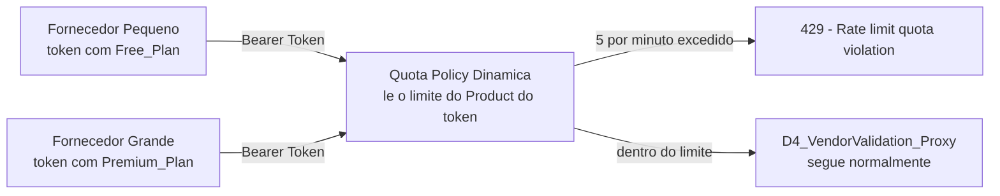

# 📊 E4 — API Management: Quota Dinâmica por Rate Plan

> **Bloco:** E — API Management
> **Cenário:** E4 (Policy: Quota) — planos comerciais diferenciados (Free vs. Premium) com limite de chamadas resolvido dinamicamente
> **Status:** ✅ Concluído e testado, incluindo uma descoberta técnica relevante sobre o escopo de aplicação da Quota
> **Data de execução:** 12/08/2026

---

## 📌 Contexto de Negócio

O cenário [E3 — OAuth 2.0 e Scopes](./22-e3-oauth-scopes.md) diferenciou **o que** cada consumidor pode fazer (leitura apenas, ou leitura e escrita). Este cenário evolui a arquitetura de API Management para diferenciar **quanto** cada consumidor pode chamar, simulando uma situação extremamente comum em portais de fornecedores e marketplaces B2B reais: a comercialização de **níveis de plano** diferentes para parceiros externos, cada um com um volume de consumo contratado.

Dois perfis de fornecedor foram simulados:

| Perfil | Rate Plan | Quota configurada | Representa |
|---|---|---|---|
| Fornecedor pequeno | `Free_Plan` (já existente do cenário E2) | 5 chamadas / minuto | Parceiro testando a integração, ou com baixo volume de operações |
| Fornecedor grande | `Premium_Plan` (novo) | 100 chamadas / minuto | Parceiro com contrato comercial ampliado, volume de operações elevado |

O time de Compliance interno (`Compliance_Team_App`, já criado no E3) também foi incluído nos testes, revelando uma nuance técnica importante sobre como a Quota é efetivamente aplicada — detalhada na seção de resultados abaixo.

---

## 🧠 Conceito: Quota Dinâmica vs. Quota Fixa

A forma mais simples de implementar um limite de chamadas seria escrever o número diretamente na Policy (ex: "permitir 5 chamadas por minuto"), criando uma Policy separada para cada nível de plano. Essa abordagem, no entanto, não escala: a cada novo plano comercial criado, seria necessário duplicar a Policy inteira.

A **Quota Dinâmica** resolve isso com uma única Policy, que **lê o limite automaticamente do Product** ao qual o consumidor está vinculado através do seu token — o mesmo princípio usado por qualquer produto SaaS real (Netflix, AWS, etc., não têm "código diferente" por cliente; eles consultam o plano contratado e aplicam a regra correspondente).



---

## 🏗️ Passo 1 — Criando o Rate Plan Premium

Em **Monetize → Rate Plans → Create**:

| Campo | Valor |
|---|---|
| Name | `Premium_Plan` |
| Product | `D4_VendorValidation_Product` *(seleção inicial no formulário — ver descoberta abaixo)* |
| Frequency | `Monthly` |
| Basic Charge | `0` |
| Rate per API Call | `0.0` |
| API Calls From/To | `0` a `unlimited` |

<a href="../evidences/lab21/01-monetize-premium-plan-rate-plan-config.png" target="_blank">
  
</a>

*Tela de criação do Rate Plan `Premium_Plan` em Monetize, sem cobrança comercial associada (Basic Charge e Rate per API Call zerados), já que o foco deste laboratório é demonstrar o controle de volume de chamadas, não a cobrança monetária em si.*

### Descoberta técnica: um Product só pode ter um Rate Plan vinculado

Ao tentar adicionar o `Premium_Plan` ao `D4_VendorValidation_Product` já existente — mantendo também o `Free_Plan` — a interface do Integration Suite **não permitiu**: o botão "Add" da aba Rate Plans do Product permanece desabilitado assim que já existe um Rate Plan vinculado. Essa é uma regra de negócio da própria plataforma: **a relação entre API Product e Rate Plan é de um para um**, não um para muitos.

**Solução adotada:** em vez de dois Rate Plans dentro do mesmo Product, foi criado um **segundo Product**, apontando para o **mesmo Proxy** e o **mesmo Scope** do Product original, porém vinculado ao `Premium_Plan`:

| Product | Proxy | Scope | Rate Plan |
|---|---|---|---|
| `D4_VendorValidation_Product` (já existente) | `D4_VendorValidation_Proxy` | `vendor.read` | `Free_Plan` |
| `D4_VendorValidation_Premium_Product` (novo) | `D4_VendorValidation_Proxy` (o mesmo) | `vendor.read` | `Premium_Plan` |

> 💡 **Nota conceitual para o portfólio**: essa é, de fato, a forma correta e recomendada de modelar planos comerciais distintos em uma plataforma de API Management — cada nível de plano corresponde a um Product diferente no catálogo (mesmo que todos apontem para o mesmo Proxy/recurso técnico por trás), não a uma variação de configuração dentro de um único Product.

<a href="../evidences/lab21/02-engage-d4-vendorvalidation-premium-product-overview.png" target="_blank">
  
</a>

*Overview do novo Product `D4_VendorValidation_Premium_Product`, com o campo `Quota: 100` e `Requests Every: 1 minute` preenchidos — esses dois campos são a fonte de dados que a Policy de Quota Dinâmica irá consultar automaticamente em tempo de execução.*

<a href="../evidences/lab21/03-engage-d4-vendorvalidation-product-quota-free-config.png" target="_blank">
  
</a>

*Overview do Product original `D4_VendorValidation_Product`, revertido de volta ao `Free_Plan` após a tentativa inicial de reutilização, com `Quota: 5` e `Requests Every: 1 minute` — o plano de entrada, com volume de chamadas mais restrito.*

---

## 🏗️ Passo 2 — Criando o Consumidor "Fornecedor Grande"

Um novo Developer App foi criado no Developer Hub, assinando exclusivamente o Product Premium:

| Campo | Valor |
|---|---|
| Title | `Big_Vendor_Partner_App` |
| Products | `D4 Vendor Validation Premium Product` |

<a href="../evidences/lab21/04-developer-hub-big-vendor-partner-app-create.png" target="_blank">
  
</a>

*Criação do `Big_Vendor_Partner_App` no Developer Hub, assinando o `D4_VendorValidation_Premium_Product` — este App representa, na simulação de negócio, um fornecedor de maior porte com contrato comercial ampliado.*

<a href="../evidences/lab21/05-developer-hub-big-vendor-partner-app-credentials.png" target="_blank">
  
</a>

*Credenciais (Consumer Key e Secret, mascaradas por padrão) geradas para o `Big_Vendor_Partner_App`, usadas para obter tokens vinculados ao plano Premium.*

---

## 🏗️ Passo 3 — Configurando a Policy de Quota Dinâmica

A Policy foi adicionada ao `D4_VendorValidation_Proxy`, no `ProxyEndpoint → PreFlow`, posicionada **após** a Policy `Verify-Vendor-Access-Token` já existente (a Quota só deve ser avaliada depois que a identidade do consumidor for confirmada):

```xml
<Quota async="false" continueOnError="false" enabled="true" xmlns="http://www.sap.com/apimgmt">
    <Identifier ref="consumer_id"/>
    <Allow countRef="apiproduct.developer.quota.limit"/>
    <Interval ref="apiproduct.developer.quota.interval"/>
    <Distributed>true</Distributed>
    <Synchronous>true</Synchronous>
    <TimeUnit ref="apiproduct.developer.quota.timeunit"/>
</Quota>
```

<a href="../evidences/lab21/06-policy-quota-by-rate-plan-xml.png" target="_blank">
  
</a>

*Policy `Quota-By-Rate-Plan` no Policy Editor, posicionada no `ProxyEndpoint → PreFlow`, após as duas Policies de segurança já existentes (Verify API Key, desativada, e Verify Access Token, ativa) — a ordem de execução das Policies é sempre da esquerda para a direita no diagrama.*

### Explicando os elementos

| Elemento | Função |
|---|---|
| `<Identifier ref="consumer_id"/>` | Define que o contador de chamadas deve ser segregado por identidade do consumidor (obtida do token OAuth), não um único contador global compartilhado |
| `<Allow countRef="apiproduct.developer.quota.limit"/>` | Em vez de um número fixo, referencia dinamicamente o valor do campo **Quota** configurado no Product do consumidor |
| `<Interval ref="apiproduct.developer.quota.interval"/>` | Referencia dinamicamente o valor do campo **Requests Every** do Product |
| `<TimeUnit ref="apiproduct.developer.quota.timeunit"/>` | Referencia a unidade de tempo (minuto, hora, dia) selecionada junto ao campo Requests Every |
| `<Distributed>true</Distributed>` / `<Synchronous>true</Synchronous>` | Garantem que a contagem seja consistente mesmo em ambientes com múltiplas instâncias de processamento, sem condições de corrida |

Nenhum valor numérico é escrito diretamente na Policy — todos os limites são resolvidos em tempo de execução a partir da configuração de cada Product.

---

## 🧪 Testes Realizados

### Teste 1 — Fornecedor Free: bloqueio a partir da sexta chamada

Seis requisições consecutivas ao `D4_VendorValidation_Proxy`, com um token obtido através do `External_Vendor_Partner_App` (vinculado ao `D4_VendorValidation_Product`, Quota de 5/minuto):

<a href="../evidences/lab21/07-postman-vendor-free-plan-quota-exceeded-429.png" target="_blank">
  
</a>

*Sexta chamada consecutiva retornando o erro `"Rate limit quota violation. Quota limit exceeded. Identifier : _default"` (`errorcode: policies.ratelimit.QuotaViolation`), enquanto as cinco chamadas anteriores haviam retornado `200 OK` normalmente — confirmando que o limite de 5 chamadas por minuto configurado no Product Free foi respeitado com precisão.*

> 📌 O rótulo `_default` exibido no campo `Identifier` da mensagem de erro é um texto genérico da própria mensagem de violação, não um indicativo de que o contador seja compartilhado entre consumidores diferentes — o Teste 2 confirma que os contadores são, de fato, segregados corretamente.

### Teste 2 — Fornecedor Premium: nenhum bloqueio dentro do limite de 100/minuto

A mesma sequência de seis chamadas rápidas, agora usando um token do `Big_Vendor_Partner_App` (vinculado ao `D4_VendorValidation_Premium_Product`, Quota de 100/minuto):

<a href="../evidences/lab21/08-postman-vendor-premium-plan-200-ok.png" target="_blank">
  
</a>

*Chamada bem-sucedida (`200 OK`, `status: CREATED`) utilizando o token do plano Premium — nenhuma das seis chamadas foi bloqueada, confirmando que o contador deste consumidor é independente do contador do Fornecedor Free, e que o limite de 100 chamadas por minuto está corretamente configurado e distante de ser atingido.*

<a href="../evidences/lab21/09-monitor-d4-processdirect-vendorvalidation-22-messages.png" target="_blank">
  
</a>

*Monitor de Mensagens do Cloud Integration, filtrado pelo iFlow `D4_ProcessDirect_VendorValidation`, exibindo 22 mensagens com status `Completed` processadas em poucos segundos — volume de chamadas consistente com o comportamento esperado do plano Premium, muito acima do que o plano Free permitiria sem bloqueio.*

### Teste 3 — Resultado inesperado: o token do Compliance também foi bloqueado

Ao testar o token do `Compliance_Team_App` (que carrega `api_product_list: [E3_VendorOverride_Product, D4_VendorValidation_Product]`, ou seja, os dois Products do cenário E3) contra o mesmo `D4_VendorValidation_Proxy`:

<a href="../evidences/lab21/10-postman-compliance-token-blocked-by-quota.png" target="_blank">
  
</a>

*A chamada com o token do Compliance retornou a mesma mensagem de `Rate limit quota violation` obtida no Teste 1, apesar de o Compliance ser um consumidor com Scope de escrita habilitado (`vendor.read vendor.write`) e, em princípio, um perfil de maior privilégio que o Fornecedor Free.*

### A explicação: a Quota está vinculada à relação Product-Proxy, não ao App como um todo

Investigando esse resultado, a causa é consistente com a arquitetura do SAP API Management: quando um token carrega múltiplos Products associados, a Policy de Quota identifica, dentre os Products do consumidor, **qual deles concede acesso ao Proxy específico sendo chamado** — e aplica a Quota configurada *nesse* Product, independentemente de o consumidor ter também outros Products com regras diferentes.

Como o `Compliance_Team_App` **não possui um Product próprio e exclusivo** para acessar o `D4_VendorValidation_Proxy` (ele utiliza o mesmo `D4_VendorValidation_Product` já usado pelo Fornecedor Free para essa finalidade — o único Product de sua lista que contém este Proxy específico), ele herda a mesma Quota de 5 chamadas por minuto ao realizar consultas de leitura, mesmo sendo, em termos de Scope, um consumidor com privilégios superiores.

Isso não compromete o propósito de negócio deste cenário: a atuação real do time de Compliance é a operação de **override** (escrita), realizada através do `E3_VendorOverride_Proxy`/`E3_VendorOverride_Product`, que não possui nenhuma Quota configurada e, portanto, não é afetada por esta limitação. Uma extensão natural e possível — não implementada neste cenário para não ampliar ainda mais seu escopo — seria criar um Product interno dedicado ao Compliance para consultas de leitura, sem Quota associada, caso o volume de consultas do time interno viesse a ser uma restrição real em um cenário de produção.

---

## 🔍 Troubleshooting & Lições Aprendidas

### 1. Um Product só pode ter um Rate Plan vinculado

**Causa:** regra de negócio da própria plataforma — o botão de adicionar um segundo Rate Plan a um Product já associado a um permanece desabilitado na interface.

**Solução:** modelar cada nível de plano comercial como um **Product distinto**, todos apontando para o mesmo Proxy/recurso técnico quando aplicável, em vez de tentar múltiplos Rate Plans dentro de um único Product.

### 2. `FailedToResolveQuotaIntervalReference` ao testar a Policy pela primeira vez

**Causa:** os campos **Quota** e **Requests Every** dos Products ainda estavam vazios no momento do primeiro teste — a Policy Dinâmica depende inteiramente desses valores estarem preenchidos no Product para resolver as referências `apiproduct.developer.quota.*`.

**Solução:** preencher os campos Quota/Requests Every em ambos os Products (Free e Premium) antes de testar a Policy.

### 3. Ordem obrigatória dos elementos no XML da Policy Quota

**Causa:** o schema (XSD) da Policy `Quota` exige uma sequência rígida de elementos, diferente da ordem intuitiva (`Interval → TimeUnit → Allow`). Foram necessárias três tentativas de reordenação até encontrar a sequência aceita: `Identifier → Allow → Interval → Distributed → Synchronous → TimeUnit`.

**Sintoma:** mensagens de erro do tipo `"Invalid content was found starting with element '<Interval>'. One of '<Identifier, MessageWeight, Allow>' is expected"` ao tentar publicar (Update) a Policy.

**Solução:** utilizar a própria mensagem de erro do editor como guia — ela indica exatamente quais elementos são esperados em cada ponto da sequência — em vez de assumir uma ordem lógica ou seguir exemplos genéricos sem validação prévia.

### 4. Consumidor com múltiplos Products sofre a Quota do Product específico que concede acesso ao recurso chamado

**Causa e detalhamento:** já descritos na análise do Teste 3, acima. Esta não é propriamente um erro de configuração, mas um comportamento de design da plataforma que precisa ser considerado ao planejar arquiteturas com consumidores que acumulam múltiplos Products.

> 💡 **Nota conceitual para o portfólio**: a Policy Quota do SAP API Management opera na relação **Product-Proxy**, não diretamente sobre a identidade do consumidor como um todo. Um mesmo Developer App, ao acessar diferentes Proxies através de diferentes Products, pode estar sujeito a diferentes Quotas (ou nenhuma), dependendo de qual Product concede acesso àquele recurso específico — um comportamento relevante ao desenhar arquiteturas de API com múltiplos níveis de consumidor compartilhando recursos entre si.

---

## ✅ Conclusão

Este cenário introduziu o controle de volume de chamadas (Quota) como uma dimensão adicional de governança de API, complementar às dimensões de autenticação (E0-E2) e permissão por Scope (E3) já exploradas no projeto. A implementação através de uma única Policy com resolução dinâmica de valores — em vez de Policies duplicadas por plano — reflete a prática recomendada de mercado para arquiteturas de API com múltiplos níveis de consumidor comercial. A investigação do comportamento inesperado do token do Compliance revelou, adicionalmente, uma característica de design pouco documentada da plataforma: a Quota é resolvida com base na relação entre o Product e o Proxy específico sendo chamado, não sobre a totalidade dos Products que um consumidor possui — um conhecimento valioso para o planejamento de arquiteturas de API mais complexas.

**Recursos praticados:** Policy Quota com resolução dinâmica (`apiproduct.developer.quota.*`) · Modelagem de planos comerciais via múltiplos API Products apontando para o mesmo Proxy · Rate Plans (Monetize) · Múltiplos Developer Apps representando diferentes níveis de consumidor comercial · Troubleshooting de regras de associação Product-Rate Plan, de ordem de elementos em schema XML de Policy, e de escopo de aplicação de Quota em consumidores com múltiplos Products

**Cenário anterior:** [E3 — OAuth 2.0 e Scopes](./22-e3-oauth-scopes.md)

---

## 🛠️ Ferramentas utilizadas

- **SAP Integration Suite** (API Management – Trial)
- **SAP Developer Hub** (gestão de Applications)
- **Postman** (testes de volume de chamadas com múltiplos consumidores)

---

## 👤 Autor

**Orlando Caetano**
🔗 [LinkedIn](https://www.linkedin.com/in/orlando-caetano/) | 💻 [GitHub](https://github.com/OrlandoCaetano2026)
