## 🏭 E6+E7 — MES Order Status Backend com HTTPS e Data Store

**Bloco:** E — API Management  
**Cenário:** Backend dedicado para E6 (JSON to XML) + E7 (Assign Message)  
**Status:** ✅ Concluído e testado de ponta a ponta  
**Data de execução:** 15/08/2026  
**iFlow:** `E6_E7_MES_OrderStatus_ProcessDirect`  
**Data Store:** `MES_OrderStatus_Store`

---

### 📌 Contexto de Negócio

Este cenário implementa um backend síncrono para registrar e consultar o status de ordens enviadas pelo sistema **MES** ao **SAP ERP**.

O processo utiliza o campo `idRastreamento` como chave técnica para acompanhar a mensagem durante seu ciclo de integração. O status é persistido no Data Store interno do SAP Cloud Integration e pode ser atualizado quando o processamento evolui, por exemplo, de `AGUARDANDO_ENTREGA_ERP` para `REPROCESSAMENTO_AGENDADO`.

O mesmo iFlow disponibiliza dois caminhos funcionais:

- **WRITE:** recebe um JSON, valida os dados e cria ou atualiza a entrada no Data Store.
- **GET:** extrai o identificador da URL, recupera o registro e adiciona o timestamp `consultadoEm` à resposta.

Também foram implementados tratamentos funcionais para consulta inexistente e operação HTTP inválida.

> 📌 Este documento cobre somente o backend no SAP Cloud Integration. A exposição no API Management, a transformação JSON para XML e o uso de Assign Message serão documentados no próximo cenário, com uma pasta de evidências própria iniciando novamente em `01`.

---

### 🧠 Conceito: acompanhamento de uma ordem por identificador de rastreamento

O `idRastreamento` funciona como um protocolo técnico da integração. Assim como uma ordem de produção ou um pedido possui um número que permite acompanhar seu processamento, a mensagem recebe um identificador próprio, como `TRK-58291`.

Esse identificador é utilizado nos dois sentidos:

1. No **WRITE**, o identificador se torna a chave da entrada no Data Store.
2. No **GET**, o identificador é extraído da URL e utilizado para recuperar exatamente a mesma entrada.

A utilização da mesma chave nos dois caminhos permite atualizar o estado da ordem sem criar registros duplicados.

---

### 🏗️ Arquitetura

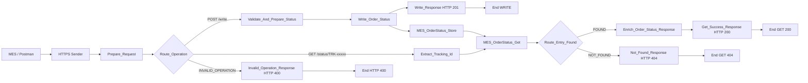

A implementação final utiliza um único HTTPS Sender com wildcard. O nome técnico `E6_E7_MES_OrderStatus_ProcessDirect` foi preservado no artefato, embora o canal de entrada efetivamente utilizado seja HTTPS.

---

## 🏗️ Fase 1 — Construção do iFlow e definição das rotas

### 1.1 Estrutura geral

O iFlow foi estruturado com três caminhos após o Router principal:

- `WRITE`, para persistência;
- `GET`, para consulta;
- `INVALID_OPERATION`, como rota default.

O desenho final ficou sem erros de validação na aba **Problems**.

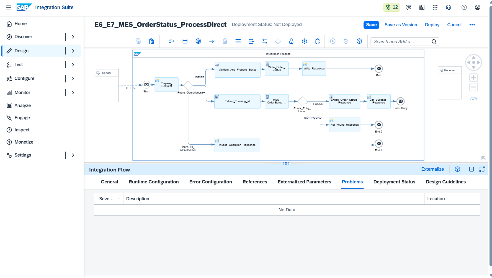

Após salvar e implantar o artefato, o runtime apresentou o iFlow com status `Started`, confirmando que o endpoint HTTPS estava disponível para os testes.

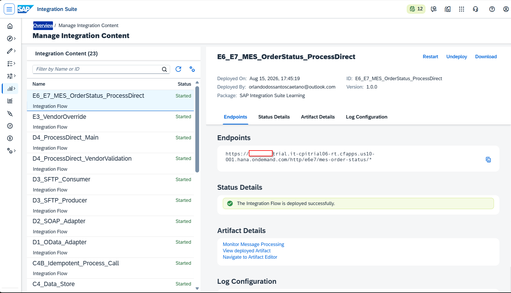

### 1.2 HTTPS Sender

O canal HTTPS foi configurado com o endereço:

```text
/e6e7/mes-order-status/*
```

Configurações principais:

```text
Authorization: User Role
User Role: ESBMessaging.send
CSRF Protected: desmarcado
```

O wildcard permite processar diferentes recursos no mesmo iFlow:

```text
POST /http/e6e7/mes-order-status/write
GET  /http/e6e7/mes-order-status/status/{idRastreamento}
```

### 1.3 Prepare_Request

O Content Modifier `Prepare_Request` registra o método e o caminho recebidos:

```text
requestMethod = ${header.CamelHttpMethod}
requestPath   = ${header.CamelHttpPath}
```

Essas properties apoiam o diagnóstico e a rastreabilidade. Para o roteamento efetivo, foram utilizados diretamente os headers HTTP disponibilizados pelo adapter.

### 1.4 Route_Operation

Condição da rota WRITE:

```text
${header.CamelHttpMethod} = 'POST' and ${header.CamelHttpPath} contains 'write'
```

Condição da rota GET:

```text
${header.CamelHttpMethod} = 'GET' and ${header.CamelHttpPath} contains 'status'
```

A terceira saída foi definida como **Default Route**, com o nome `INVALID_OPERATION`.

---

## 🏗️ Fase 2 — Implementação e teste do caminho WRITE

### 2.1 Payload de entrada

O primeiro teste utilizou o seguinte payload:

```json
{
  "idRastreamento": "TRK-58291",
  "numeroPedido": "4500001234",
  "origem": "MES",
  "destino": "ERP",
  "statusIntegracao": "AGUARDANDO_ENTREGA_ERP",
  "recebidoEm": "2026-08-15T17:20:00-03:00",
  "tentativasReprocessamento": 0,
  "filaDestino": "producao_pedidos"
}
```

### 2.2 Groovy `Validate_And_Prepare_Status`

O primeiro Groovy valida o JSON antes da persistência. O script:

- confirma que o body está preenchido;
- valida se o body contém um objeto JSON;
- verifica os campos obrigatórios;
- aceita corretamente `tentativasReprocessamento = 0`;
- normaliza `idRastreamento` para maiúsculas;
- converte a quantidade de tentativas para inteiro;
- rejeita valores negativos;
- cria a property `idRastreamento` utilizada pelo Data Store Write.

```groovy
import com.sap.gateway.ip.core.customdev.util.Message
import groovy.json.JsonSlurper
import groovy.json.JsonOutput

def Message processData(Message message) {

    def reader = message.getBody(java.io.Reader)

    if (reader == null) {
        throw new IllegalArgumentException(
            "O payload JSON de status do pedido nao foi informado."
        )
    }

    def json

    try {
        json = new JsonSlurper().parse(reader)
    } catch (Exception exception) {
        throw new IllegalArgumentException(
            "O payload informado nao possui um JSON valido."
        )
    }

    if (!(json instanceof Map)) {
        throw new IllegalArgumentException(
            "O payload deve ser um objeto JSON."
        )
    }

    def mandatoryFields = [
        "idRastreamento",
        "numeroPedido",
        "origem",
        "destino",
        "statusIntegracao",
        "recebidoEm",
        "tentativasReprocessamento",
        "filaDestino"
    ]

    def missingFields = mandatoryFields.findAll { field ->
        !json.containsKey(field) ||
        json[field] == null ||
        json[field].toString().trim().isEmpty()
    }

    if (!missingFields.isEmpty()) {
        throw new IllegalArgumentException(
            "Campos obrigatorios ausentes ou vazios: " +
            missingFields.join(", ")
        )
    }

    def trackingId = json.idRastreamento
        .toString()
        .trim()
        .toUpperCase()

    if (!(trackingId ==~ /^TRK-[A-Z0-9]+(?:-[A-Z0-9]+)*$/)) {
        throw new IllegalArgumentException(
            "Formato invalido para idRastreamento. " +
            "Utilize TRK- seguido do identificador."
        )
    }

    def retryCount

    try {
        retryCount = Integer.parseInt(
            json.tentativasReprocessamento.toString()
        )
    } catch (Exception ignored) {
        throw new IllegalArgumentException(
            "tentativasReprocessamento deve ser um numero inteiro."
        )
    }

    if (retryCount < 0) {
        throw new IllegalArgumentException(
            "tentativasReprocessamento nao pode ser negativo."
        )
    }

    json.idRastreamento = trackingId
    json.tentativasReprocessamento = retryCount

    message.setProperty("idRastreamento", trackingId)
    message.setHeader("Content-Type", "application/json")

    message.setBody(
        JsonOutput.prettyPrint(
            JsonOutput.toJson(json)
        )
    )

    return message
}
```

> 💡 A validação não utiliza `if (!json[field])`, pois o valor numérico `0` poderia ser interpretado incorretamente como ausência do campo.

### 2.3 Data Store Write

O step `Write_Order_Status` foi configurado assim:

```text
Data Store Name: MES_OrderStatus_Store
Visibility: Integration Flow
Entry ID: ${property.idRastreamento}
Encrypt Stored Message: marcado
Overwrite Existing Message: marcado
Expiration Period: 30 dias
```

A opção `Overwrite Existing Message` permite atualizar uma ordem existente usando o mesmo identificador, sem criar uma nova entrada.

### 2.4 Teste 1 — Criação do registro

A chamada foi executada no Postman com método `POST` e retornou `201 Created`.

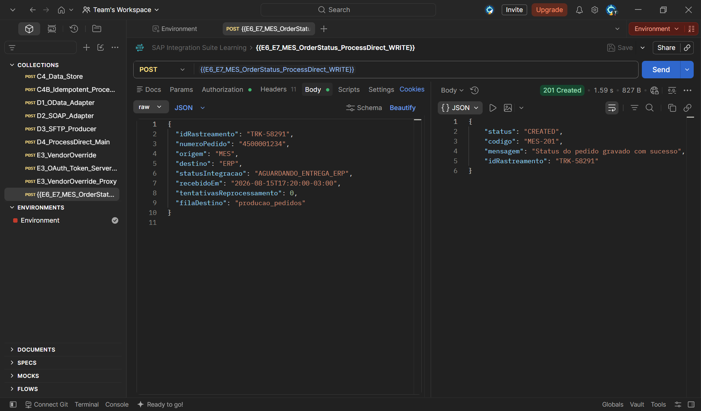

Resposta:

```json
{
  "status": "CREATED",
  "codigo": "MES-201",
  "mensagem": "Status do pedido gravado com sucesso",
  "idRastreamento": "TRK-58291"
}
```

Em **Manage Data Stores**, o Data Store `MES_OrderStatus_Store` passou a apresentar uma entrada com ID `TRK-58291`.

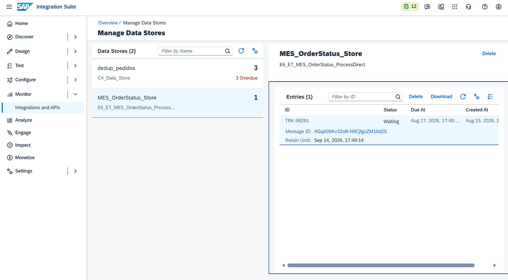

O Trace confirmou a execução exclusiva do caminho WRITE:

```text
HTTPS
→ Prepare_Request
→ Route_Operation
→ Validate_And_Prepare_Status
→ Write_Order_Status
→ Write_Response
→ End
```

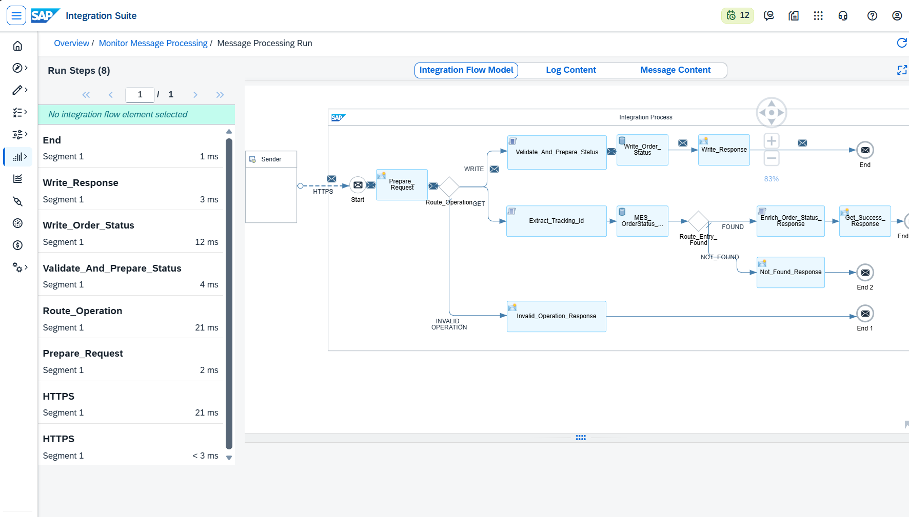

No **Message Content**, imediatamente antes do `Write_Order_Status`, foi possível verificar o JSON completo enviado para persistência.

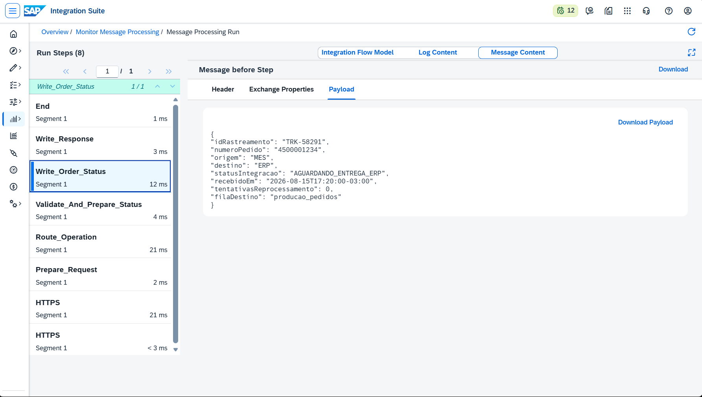

O conteúdo final criado pelo `Write_Response` também foi validado internamente no Trace.

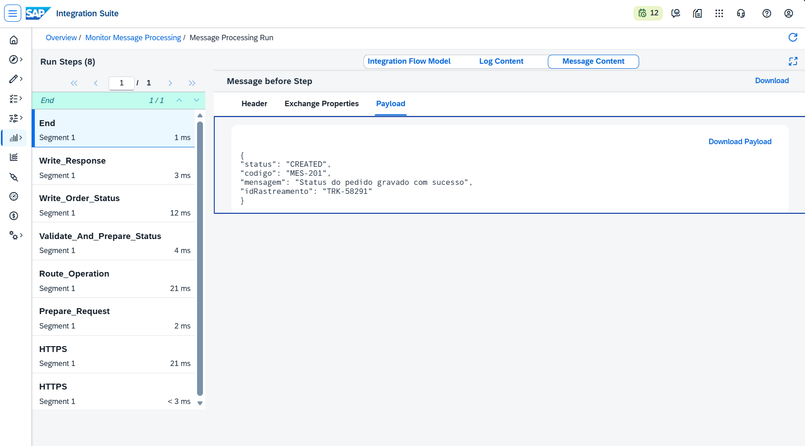

### 2.5 Teste 2 — Sobrescrita da mesma entrada

Para comprovar a atualização, o mesmo `idRastreamento` foi enviado novamente, alterando o status e a quantidade de tentativas:

```json
{
  "idRastreamento": "TRK-58291",
  "numeroPedido": "4500001234",
  "origem": "MES",
  "destino": "ERP",
  "statusIntegracao": "REPROCESSAMENTO_AGENDADO",
  "recebidoEm": "2026-08-15T17:20:00-03:00",
  "tentativasReprocessamento": 1,
  "filaDestino": "producao_pedidos"
}
```

O Postman retornou novamente `201 Created`.

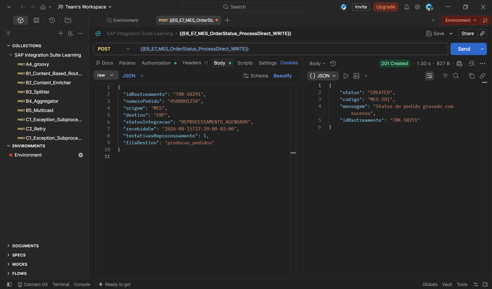

O Data Store permaneceu com apenas uma entrada, comprovando que `TRK-58291` foi sobrescrito e não duplicado.

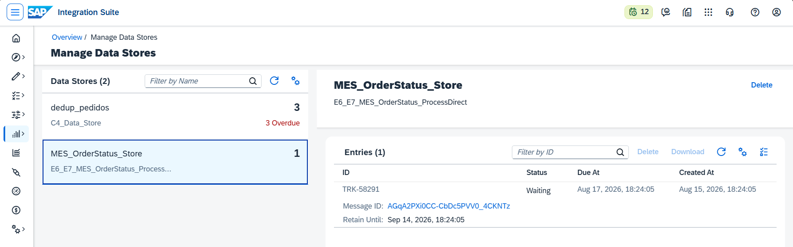

O Trace confirmou que o payload atualizado foi entregue ao Data Store Write com:

```json
"statusIntegracao": "REPROCESSAMENTO_AGENDADO",
"tentativasReprocessamento": 1
```

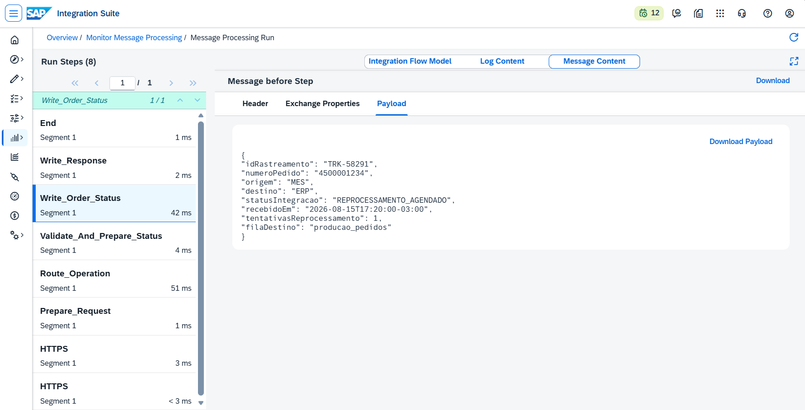

---

## 🏗️ Fase 3 — Implementação e teste do caminho GET

### 3.1 Extração do identificador da URL

A consulta utiliza o formato:

```http
GET /http/e6e7/mes-order-status/status/TRK-58291
```

O Groovy `Extract_Tracking_Id` considera `CamelHttpPath` e `CamelHttpUri`. Depois, procura diretamente um valor no padrão `TRK-...`.

```groovy
import com.sap.gateway.ip.core.customdev.util.Message
import java.net.URLDecoder
import java.nio.charset.StandardCharsets
import java.util.regex.Pattern

def Message processData(Message message) {

    def camelHttpPath = message.getHeader("CamelHttpPath", String)
    def camelHttpUri = message.getHeader("CamelHttpUri", String)

    def requestLocation = [
        camelHttpPath,
        camelHttpUri
    ].findAll { value ->
        value != null && !value.trim().isEmpty()
    }.join(" ")

    if (requestLocation.trim().isEmpty()) {
        throw new IllegalArgumentException(
            "O caminho ou URI HTTP nao foi disponibilizado pelo adapter."
        )
    }

    def decodedLocation

    try {
        decodedLocation = URLDecoder.decode(
            requestLocation,
            StandardCharsets.UTF_8.name()
        )
    } catch (Exception exception) {
        throw new IllegalArgumentException(
            "Nao foi possivel interpretar o caminho da requisicao."
        )
    }

    def matcher = Pattern
        .compile(/TRK-[A-Za-z0-9]+(?:-[A-Za-z0-9]+)*/)
        .matcher(decodedLocation)

    if (!matcher.find()) {
        throw new IllegalArgumentException(
            "Nao foi encontrado um idRastreamento valido na requisicao. " +
            "Formato esperado: TRK-xxxxx."
        )
    }

    def trackingId = matcher
        .group()
        .trim()
        .toUpperCase()

    message.setProperty("idRastreamento", trackingId)
    message.setHeader("X-Tracking-ID", trackingId)

    return message
}
```

### 3.2 Data Store Get

O step `MES_OrderStatus_Get` foi configurado assim:

```text
Data Store Name: MES_OrderStatus_Store
Visibility: Integration Flow
Entry ID: ${property.idRastreamento}
Delete On Completion: desmarcado
Throw Exception on Missing Entry: desmarcado
```

`Throw Exception on Missing Entry` permanece desmarcado para que a ausência do registro seja tratada como resposta funcional `404`, e não como erro técnico `500`.

### 3.3 Router FOUND e NOT_FOUND

Condição da rota FOUND:

```text
${header.SAP_DataStoreEntryFound} = 'true'
```

A rota `NOT_FOUND` foi definida como Default Route.

### 3.4 Enriquecimento da resposta

Quando o registro é encontrado, o Groovy `Enrich_Order_Status_Response` adiciona `consultadoEm` com o timestamp da consulta em UTC.

```groovy
import com.sap.gateway.ip.core.customdev.util.Message
import groovy.json.JsonSlurper
import groovy.json.JsonOutput
import java.time.Instant

def Message processData(Message message) {

    def reader = message.getBody(java.io.Reader)

    if (reader == null) {
        throw new IllegalStateException(
            "O Data Store Get nao retornou payload para enriquecimento."
        )
    }

    def json

    try {
        json = new JsonSlurper().parse(reader)
    } catch (Exception exception) {
        throw new IllegalStateException(
            "O conteudo recuperado do Data Store nao possui JSON valido."
        )
    }

    if (!(json instanceof Map)) {
        throw new IllegalStateException(
            "O conteudo recuperado do Data Store deve ser um objeto JSON."
        )
    }

    if (
        !json.containsKey("idRastreamento") ||
        json.idRastreamento == null ||
        json.idRastreamento.toString().trim().isEmpty()
    ) {
        throw new IllegalStateException(
            "O registro recuperado nao possui idRastreamento."
        )
    }

    json.consultadoEm = Instant.now().toString()

    message.setBody(
        JsonOutput.prettyPrint(
            JsonOutput.toJson(json)
        )
    )

    message.setHeader("Content-Type", "application/json")
    message.setHeader(
        "X-Tracking-ID",
        json.idRastreamento.toString()
    )

    return message
}
```

### 3.5 Teste 3 — Consulta de registro existente

A consulta ao identificador `TRK-58291` retornou `200 OK` com os valores atualizados no teste de sobrescrita.

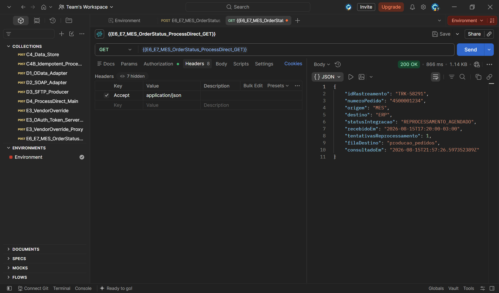

Resposta validada:

```json
{
  "idRastreamento": "TRK-58291",
  "numeroPedido": "4500001234",
  "origem": "MES",
  "destino": "ERP",
  "statusIntegracao": "REPROCESSAMENTO_AGENDADO",
  "recebidoEm": "2026-08-15T17:20:00-03:00",
  "tentativasReprocessamento": 1,
  "filaDestino": "producao_pedidos",
  "consultadoEm": "2026-08-15T21:57:26.597352389Z"
}
```

O resultado comprova em uma única chamada:

- extração correta de `TRK-58291` da URL;
- leitura da entrada no Data Store;
- recuperação dos valores sobrescritos;
- roteamento pelo caminho FOUND;
- geração dinâmica de `consultadoEm`;
- preservação de `filaDestino` para tratamento posterior no API Management.

O Trace apresentou o caminho GET e FOUND:

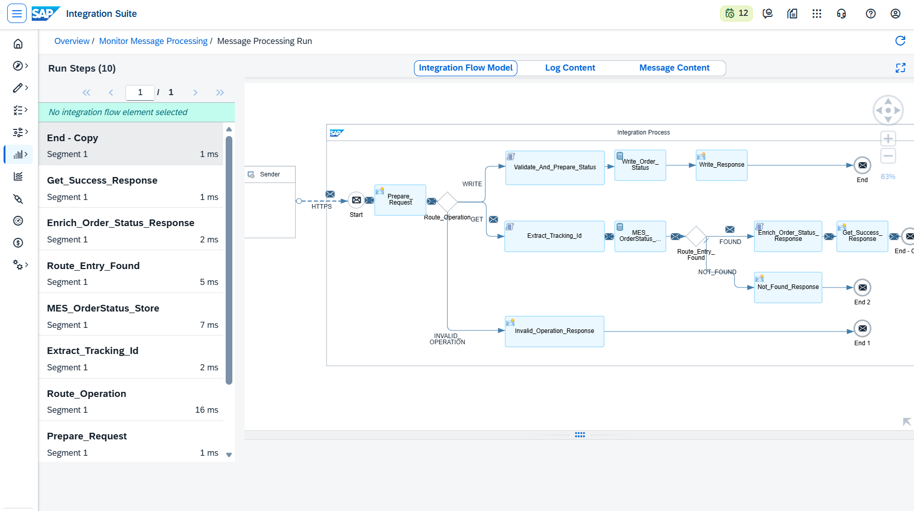

O Message Content confirmou o payload enriquecido antes da resposta final.

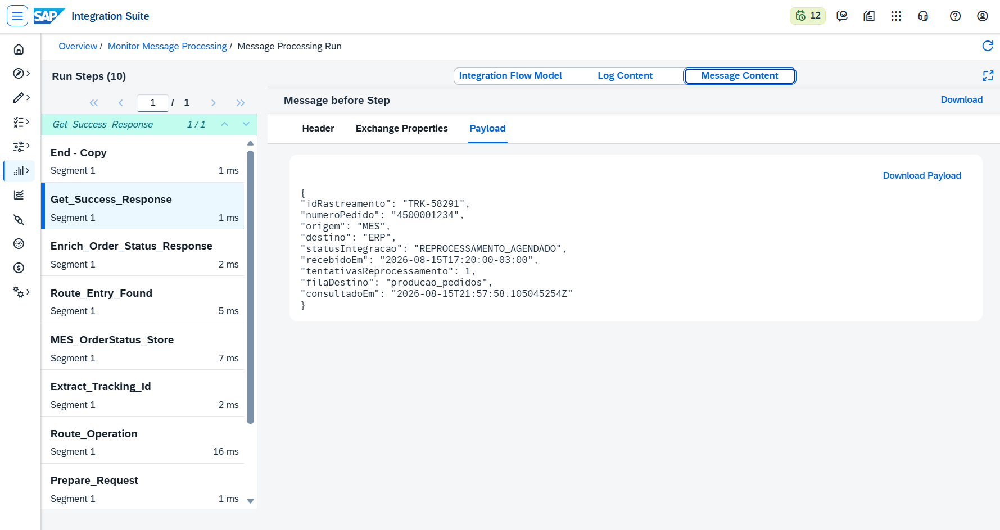

### 3.6 Teste 4 — Consulta de registro inexistente

Para testar a resposta negativa, foi consultado um identificador não persistido:

```http
GET /http/e6e7/mes-order-status/status/TRK-99999
```

O Postman recebeu `404 Not Found`, em vez de um erro técnico.

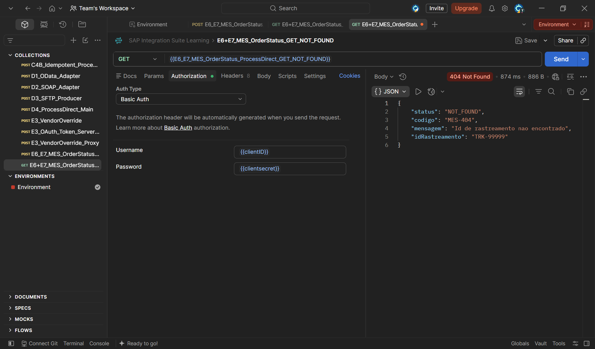

Resposta:

```json
{
  "status": "NOT_FOUND",
  "codigo": "MES-404",
  "mensagem": "Id de rastreamento nao encontrado",
  "idRastreamento": "TRK-99999"
}
```

O Trace confirmou o desvio para a rota `NOT_FOUND`:

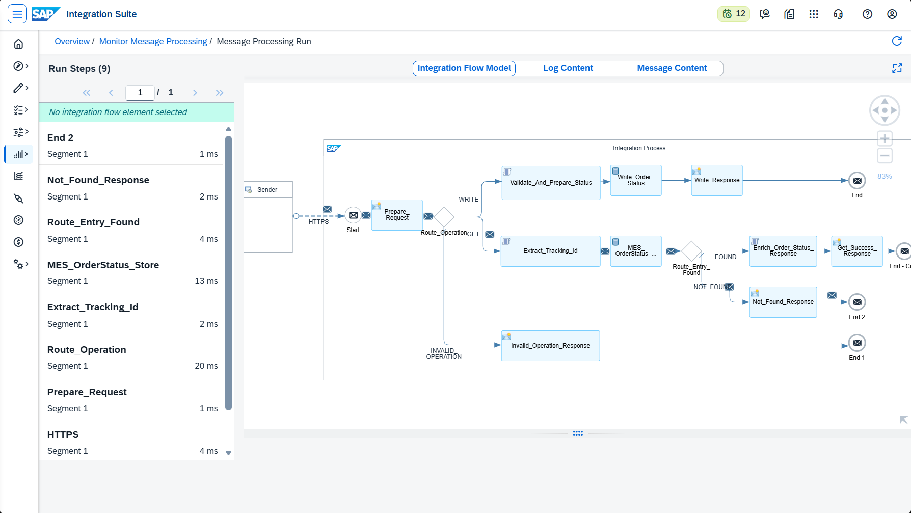

O conteúdo interno produzido pelo `Not_Found_Response` também foi validado:

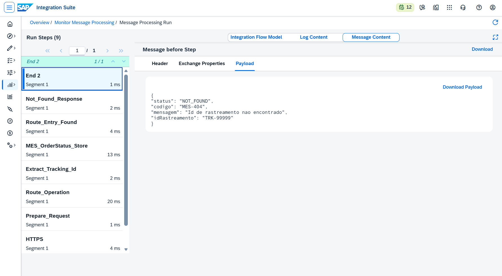

---

## 🏗️ Fase 4 — Tratamento de operação inválida

O Router principal possui uma rota default para métodos e caminhos que não correspondam aos contratos WRITE e GET.

O teste foi executado com:

```http
PUT /http/e6e7/mes-order-status/invalid
```

O retorno foi `400 Bad Request` com código funcional `MES-400`.

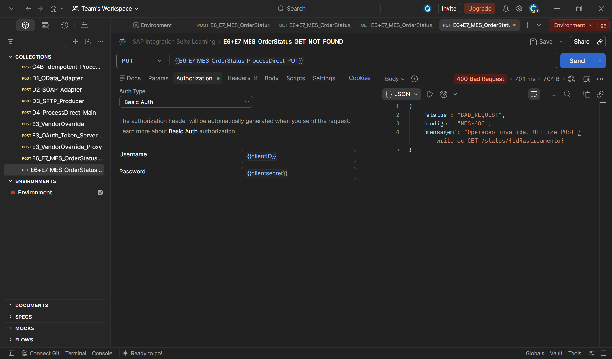

Resposta:

```json
{
  "status": "BAD_REQUEST",
  "codigo": "MES-400",
  "mensagem": "Operacao invalida. Utilize POST /write ou GET /status/{idRastreamento}"
}
```

O Trace comprovou que a chamada percorreu somente o caminho de operação inválida:

```text
HTTPS
→ Prepare_Request
→ Route_Operation
→ INVALID_OPERATION
→ Invalid_Operation_Response
→ End
```

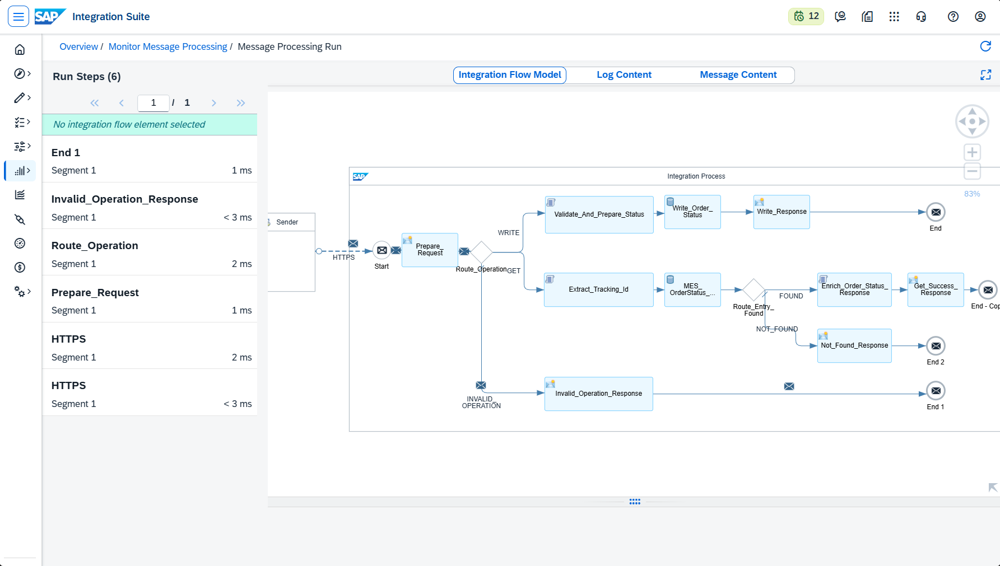

O Message Content confirmou o payload interno antes do retorno ao consumidor.

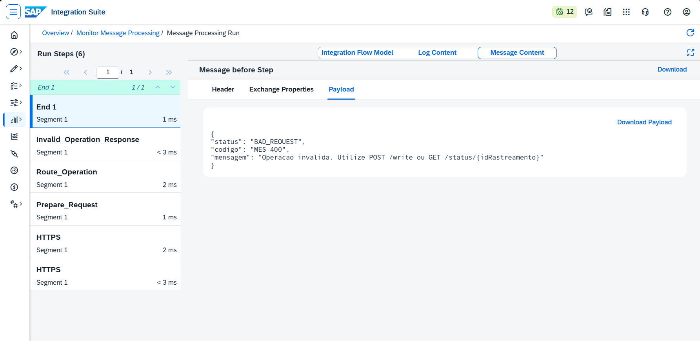

---

### 🧪 Resumo Consolidado dos Testes

| # | Cenário | Método e recurso | Resultado | Validação principal |
|---:|---|---|---|---|
| 1 | WRITE inicial | `POST /write` | ✅ `201 Created` | Entrada `TRK-58291` criada |
| 2 | WRITE com sobrescrita | `POST /write` | ✅ `201 Created` | Mesma entrada atualizada, sem duplicação |
| 3 | GET existente | `GET /status/TRK-58291` | ✅ `200 OK` | Dados atualizados e `consultadoEm` |
| 4 | GET inexistente | `GET /status/TRK-99999` | ✅ `404 Not Found` | Resposta funcional `MES-404` |
| 5 | Operação inválida | `PUT /invalid` | ✅ `400 Bad Request` | Resposta funcional `MES-400` |

---

### 🔍 Troubleshooting e Lições Aprendidas

#### 1. POST direcionado para INVALID_OPERATION

**Sintoma:** a chamada WRITE chegava ao iFlow, mas retornava `MES-400`.

**Causa:** a primeira condição do Router dependia de properties que não refletiam corretamente os headers usados pelo runtime.

**Solução:** utilizar diretamente:

```text
${header.CamelHttpMethod}
${header.CamelHttpPath}
```

#### 2. URL GET sem o segmento `/status/`

**Sintoma:** a consulta retornava `MES-400`.

**Causa:** a variável do Postman apontava para:

```text
.../mes-order-status/TRK-58291
```

**Solução:** ajustar para:

```text
.../mes-order-status/status/TRK-58291
```

#### 3. Erro 500 no `Extract_Tracking_Id`

**Sintoma:** `IllegalArgumentException` informando que o formato `/status/{idRastreamento}` era inválido.

**Causa:** a versão inicial do Groovy procurava literalmente `/status/` em `CamelHttpPath`, mas o HTTPS Adapter podia disponibilizar um path relativo diferente no runtime.

**Solução:** considerar `CamelHttpPath` e `CamelHttpUri` e localizar diretamente o padrão `TRK-...` por expressão regular.

#### 4. Valor zero em `tentativasReprocessamento`

**Risco:** uma verificação booleana simples poderia interpretar `0` como campo ausente.

**Solução:** validar com `containsKey`, `null` e string vazia, preservando `0` como valor inteiro válido.

#### 5. Data Store Get e resposta 404

**Risco:** com `Throw Exception on Missing Entry` habilitado, uma consulta inexistente produziria erro técnico e impediria o Router de gerar o `MES-404`.

**Solução:** manter a opção desmarcada e avaliar `SAP_DataStoreEntryFound` no Router.

---

### 🧠 Decisões Técnicas

#### Data Store interno

O cenário utiliza o Data Store interno do SAP Cloud Integration. Não há persistência em banco externo.

#### Visibilidade `Integration Flow`

WRITE e GET estão no mesmo iFlow. Por isso, a visibilidade foi mantida como `Integration Flow`.

#### Endpoint WRITE permanece interno

A futura API para o parceiro legado será voltada à consulta. O WRITE representa atualização interna do status e não será exposto ao parceiro.

#### `filaDestino` permanece no backend

O campo identifica a fila JMS utilizada no processamento e é útil ao time de Operações/Integração. No API Management, esse campo será removido ou ocultado para o consumidor legado sem permissão interna.

#### Separação entre backend e API Management

O laboratório atual comprova primeiro a persistência, consulta e os tratamentos funcionais. As policies E6 e E7 serão implementadas sobre um backend já validado, isolando problemas de integração dos problemas de transformação e governança da API.

---

### ✅ Conclusão

O backend `E6_E7_MES_OrderStatus_ProcessDirect` foi concluído e validado nos caminhos de criação, sobrescrita, leitura existente, leitura inexistente e operação inválida.

O cenário demonstrou na prática:

- roteamento por método e caminho HTTP;
- validação robusta de payload JSON;
- persistência e sobrescrita com Data Store;
- utilização de `idRastreamento` como chave técnica;
- consulta síncrona com enriquecimento de timestamp;
- respostas funcionais `201`, `200`, `404` e `400`;
- uso de Trace e Message Content para comprovar cada etapa executada.

O backend está preparado para a próxima etapa, na qual o API Management adicionará OAuth, Scopes diferenciados, Assign Message, correlação, mascaramento condicional de `filaDestino` e transformação JSON para XML.

**Recursos praticados:** HTTPS Sender · Router · Content Modifier · Groovy Script · Data Store Write · Data Store Get · Sobrescrita controlada · Tratamento HTTP · Trace · Message Content

**Cenário anterior:** [E4+E5 — Traffic Management com Quota e Spike Arrest](./23-e4-e5-quota-spike-arrest.md)  
**Próximo cenário:** [E6+E7 — API Management com JSON to XML e Assign Message](./25-e6-e7-api-management-xml-assign-message.md)

---

### 🛠️ Ferramentas utilizadas

- **SAP Integration Suite — Cloud Integration**
- **SAP Data Store**
- **Groovy**
- **Postman**
- **Visual Studio Code**
- **Git e GitHub**

---

### 👤 Autor / 📬 Contato

[](https://www.linkedin.com/in/orlando-caetano/)
[](https://github.com/OrlandoCaetano2026)

**Orlando Caetano**  
Especialista SAP • Integração • Inteligência Artificial  
Consultor SAP MM com know-how em PP, QM e WM

   

> 📌 Projeto de estudo e portfólio. Os cenários SAP MM, PP e QM são simulações educativas para prática de integração.
