## 🏭 E6+E7 — MES Order Status: Backend, Assign Message e JSON to XML

**Bloco:** E — API Management  
**Cenário:** Solução ponta a ponta para E6 (JSON to XML) + E7 (Assign Message)  
**Status:** ✅ Concluído e testado de ponta a ponta  
**Data de execução:** 15/08/2026  
**iFlow:** `E6_E7_MES_OrderStatus_ProcessDirect`  
**Data Store:** `MES_OrderStatus_Store`

---

### 📌 Contexto de Negócio

Este cenário implementa um backend síncrono para registrar e consultar o status de ordens enviadas pelo sistema **MES** ao **SAP ERP**.

O processo utiliza o campo `idRastreamento` como chave técnica para acompanhar a mensagem durante seu ciclo de integração. O status é persistido no Data Store interno do SAP Cloud Integration e pode ser atualizado quando o processamento evolui, por exemplo, de `AGUARDANDO_ENTREGA_ERP` para `REPROCESSAMENTO_AGENDADO`.

O mesmo iFlow disponibiliza dois caminhos funcionais:

- **WRITE:** recebe um JSON, valida os dados e cria ou atualiza a entrada no Data Store.
- **GET:** extrai o identificador da URL, recupera o registro e adiciona o timestamp `consultadoEm` à resposta.

Também foram implementados tratamentos funcionais para consulta inexistente e operação HTTP inválida.

> 📌 Este documento cobre somente o backend no SAP Cloud Integration. A exposição no API Management, a transformação JSON para XML e o uso de Assign Message serão documentados no próximo cenário, com uma pasta de evidências própria iniciando novamente em `01`.

---

### 🧠 Conceito: acompanhamento de uma ordem por identificador de rastreamento

O `idRastreamento` funciona como um protocolo técnico da integração. Assim como uma ordem de produção ou um pedido possui um número que permite acompanhar seu processamento, a mensagem recebe um identificador próprio, como `TRK-58291`.

Esse identificador é utilizado nos dois sentidos:

1. No **WRITE**, o identificador se torna a chave da entrada no Data Store.
2. No **GET**, o identificador é extraído da URL e utilizado para recuperar exatamente a mesma entrada.

A utilização da mesma chave nos dois caminhos permite atualizar o estado da ordem sem criar registros duplicados.

---

### 🏗️ Arquitetura

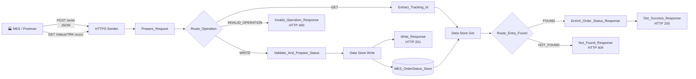

A implementação final utiliza um único HTTPS Sender com wildcard. O nome técnico `E6_E7_MES_OrderStatus_ProcessDirect` foi preservado no artefato, embora o canal de entrada efetivamente utilizado seja HTTPS.

---

## 🏗️ Fase 1 — Construção do iFlow e definição das rotas

### 1.1 Estrutura geral

O iFlow foi estruturado com três caminhos após o Router principal:

- `WRITE`, para persistência;
- `GET`, para consulta;
- `INVALID_OPERATION`, como rota default.

O desenho final ficou sem erros de validação na aba **Problems**.


Após salvar e implantar o artefato, o runtime apresentou o iFlow com status `Started`, confirmando que o endpoint HTTPS estava disponível para os testes.


### 1.2 HTTPS Sender

O canal HTTPS foi configurado com o endereço:

```text
/e6e7/mes-order-status/*
```

Configurações principais:

```text
Authorization: User Role
User Role: ESBMessaging.send
CSRF Protected: desmarcado
```

O wildcard permite processar diferentes recursos no mesmo iFlow:

```text
POST /http/e6e7/mes-order-status/write
GET  /http/e6e7/mes-order-status/status/{idRastreamento}
```

### 1.3 Prepare_Request

O Content Modifier `Prepare_Request` registra o método e o caminho recebidos:

```text
requestMethod = ${header.CamelHttpMethod}
requestPath   = ${header.CamelHttpPath}
```

Essas properties apoiam o diagnóstico e a rastreabilidade. Para o roteamento efetivo, foram utilizados diretamente os headers HTTP disponibilizados pelo adapter.

### 1.4 Route_Operation

Condição da rota WRITE:

```text
${header.CamelHttpMethod} = 'POST' and ${header.CamelHttpPath} contains 'write'
```

Condição da rota GET:

```text
${header.CamelHttpMethod} = 'GET' and ${header.CamelHttpPath} contains 'status'
```

A terceira saída foi definida como **Default Route**, com o nome `INVALID_OPERATION`.

---

## 🏗️ Fase 2 — Implementação e teste do caminho WRITE

### 2.1 Payload de entrada

O primeiro teste utilizou o seguinte payload:

```json
{
  "idRastreamento": "TRK-58291",
  "numeroPedido": "4500001234",
  "origem": "MES",
  "destino": "ERP",
  "statusIntegracao": "AGUARDANDO_ENTREGA_ERP",
  "recebidoEm": "2026-08-15T17:20:00-03:00",
  "tentativasReprocessamento": 0,
  "filaDestino": "producao_pedidos"
}
```

### 2.2 Groovy `Validate_And_Prepare_Status`

O primeiro Groovy valida o JSON antes da persistência. O script:

- confirma que o body está preenchido;
- valida se o body contém um objeto JSON;
- verifica os campos obrigatórios;
- aceita corretamente `tentativasReprocessamento = 0`;
- normaliza `idRastreamento` para maiúsculas;
- converte a quantidade de tentativas para inteiro;
- rejeita valores negativos;
- cria a property `idRastreamento` utilizada pelo Data Store Write.

```groovy
import com.sap.gateway.ip.core.customdev.util.Message
import groovy.json.JsonSlurper
import groovy.json.JsonOutput

def Message processData(Message message) {

    def reader = message.getBody(java.io.Reader)

    if (reader == null) {
        throw new IllegalArgumentException(
            "O payload JSON de status do pedido nao foi informado."
        )
    }

    def json

    try {
        json = new JsonSlurper().parse(reader)
    } catch (Exception exception) {
        throw new IllegalArgumentException(
            "O payload informado nao possui um JSON valido."
        )
    }

    if (!(json instanceof Map)) {
        throw new IllegalArgumentException(
            "O payload deve ser um objeto JSON."
        )
    }

    def mandatoryFields = [
        "idRastreamento",
        "numeroPedido",
        "origem",
        "destino",
        "statusIntegracao",
        "recebidoEm",
        "tentativasReprocessamento",
        "filaDestino"
    ]

    def missingFields = mandatoryFields.findAll { field ->
        !json.containsKey(field) ||
        json[field] == null ||
        json[field].toString().trim().isEmpty()
    }

    if (!missingFields.isEmpty()) {
        throw new IllegalArgumentException(
            "Campos obrigatorios ausentes ou vazios: " +
            missingFields.join(", ")
        )
    }

    def trackingId = json.idRastreamento
        .toString()
        .trim()
        .toUpperCase()

    if (!(trackingId ==~ /^TRK-[A-Z0-9]+(?:-[A-Z0-9]+)*$/)) {
        throw new IllegalArgumentException(
            "Formato invalido para idRastreamento. " +
            "Utilize TRK- seguido do identificador."
        )
    }

    def retryCount

    try {
        retryCount = Integer.parseInt(
            json.tentativasReprocessamento.toString()
        )
    } catch (Exception ignored) {
        throw new IllegalArgumentException(
            "tentativasReprocessamento deve ser um numero inteiro."
        )
    }

    if (retryCount < 0) {
        throw new IllegalArgumentException(
            "tentativasReprocessamento nao pode ser negativo."
        )
    }

    json.idRastreamento = trackingId
    json.tentativasReprocessamento = retryCount

    message.setProperty("idRastreamento", trackingId)
    message.setHeader("Content-Type", "application/json")

    message.setBody(
        JsonOutput.prettyPrint(
            JsonOutput.toJson(json)
        )
    )

    return message
}
```

> 💡 A validação não utiliza `if (!json[field])`, pois o valor numérico `0` poderia ser interpretado incorretamente como ausência do campo.

### 2.3 Data Store Write

O step `Write_Order_Status` foi configurado assim:

```text
Data Store Name: MES_OrderStatus_Store
Visibility: Integration Flow
Entry ID: ${property.idRastreamento}
Encrypt Stored Message: marcado
Overwrite Existing Message: marcado
Expiration Period: 30 dias
```

A opção `Overwrite Existing Message` permite atualizar uma ordem existente usando o mesmo identificador, sem criar uma nova entrada.

### 2.4 Teste 1 — Criação do registro

A chamada foi executada no Postman com método `POST` e retornou `201 Created`.


Resposta:

```json
{
  "status": "CREATED",
  "codigo": "MES-201",
  "mensagem": "Status do pedido gravado com sucesso",
  "idRastreamento": "TRK-58291"
}
```

Em **Manage Data Stores**, o Data Store `MES_OrderStatus_Store` passou a apresentar uma entrada com ID `TRK-58291`.


O Trace confirmou a execução exclusiva do caminho WRITE:

```text
HTTPS
→ Prepare_Request
→ Route_Operation
→ Validate_And_Prepare_Status
→ Write_Order_Status
→ Write_Response
→ End
```


No **Message Content**, imediatamente antes do `Write_Order_Status`, foi possível verificar o JSON completo enviado para persistência.


O conteúdo final criado pelo `Write_Response` também foi validado internamente no Trace.


### 2.5 Teste 2 — Sobrescrita da mesma entrada

Para comprovar a atualização, o mesmo `idRastreamento` foi enviado novamente, alterando o status e a quantidade de tentativas:

```json
{
  "idRastreamento": "TRK-58291",
  "numeroPedido": "4500001234",
  "origem": "MES",
  "destino": "ERP",
  "statusIntegracao": "REPROCESSAMENTO_AGENDADO",
  "recebidoEm": "2026-08-15T17:20:00-03:00",
  "tentativasReprocessamento": 1,
  "filaDestino": "producao_pedidos"
}
```

O Postman retornou novamente `201 Created`.


O Data Store permaneceu com apenas uma entrada, comprovando que `TRK-58291` foi sobrescrito e não duplicado.


O Trace confirmou que o payload atualizado foi entregue ao Data Store Write com:

```json
"statusIntegracao": "REPROCESSAMENTO_AGENDADO",
"tentativasReprocessamento": 1
```


---

## 🏗️ Fase 3 — Implementação e teste do caminho GET

### 3.1 Extração do identificador da URL

A consulta utiliza o formato:

```http
GET /http/e6e7/mes-order-status/status/TRK-58291
```

O Groovy `Extract_Tracking_Id` considera `CamelHttpPath` e `CamelHttpUri`. Depois, procura diretamente um valor no padrão `TRK-...`.

```groovy
import com.sap.gateway.ip.core.customdev.util.Message
import java.net.URLDecoder
import java.nio.charset.StandardCharsets
import java.util.regex.Pattern

def Message processData(Message message) {

    def camelHttpPath = message.getHeader("CamelHttpPath", String)
    def camelHttpUri = message.getHeader("CamelHttpUri", String)

    def requestLocation = [
        camelHttpPath,
        camelHttpUri
    ].findAll { value ->
        value != null && !value.trim().isEmpty()
    }.join(" ")

    if (requestLocation.trim().isEmpty()) {
        throw new IllegalArgumentException(
            "O caminho ou URI HTTP nao foi disponibilizado pelo adapter."
        )
    }

    def decodedLocation

    try {
        decodedLocation = URLDecoder.decode(
            requestLocation,
            StandardCharsets.UTF_8.name()
        )
    } catch (Exception exception) {
        throw new IllegalArgumentException(
            "Nao foi possivel interpretar o caminho da requisicao."
        )
    }

    def matcher = Pattern
        .compile(/TRK-[A-Za-z0-9]+(?:-[A-Za-z0-9]+)*/)
        .matcher(decodedLocation)

    if (!matcher.find()) {
        throw new IllegalArgumentException(
            "Nao foi encontrado um idRastreamento valido na requisicao. " +
            "Formato esperado: TRK-xxxxx."
        )
    }

    def trackingId = matcher
        .group()
        .trim()
        .toUpperCase()

    message.setProperty("idRastreamento", trackingId)
    message.setHeader("X-Tracking-ID", trackingId)

    return message
}
```

### 3.2 Data Store Get

O step `MES_OrderStatus_Get` foi configurado assim:

```text
Data Store Name: MES_OrderStatus_Store
Visibility: Integration Flow
Entry ID: ${property.idRastreamento}
Delete On Completion: desmarcado
Throw Exception on Missing Entry: desmarcado
```

`Throw Exception on Missing Entry` permanece desmarcado para que a ausência do registro seja tratada como resposta funcional `404`, e não como erro técnico `500`.

### 3.3 Router FOUND e NOT_FOUND

Condição da rota FOUND:

```text
${header.SAP_DataStoreEntryFound} = 'true'
```

A rota `NOT_FOUND` foi definida como Default Route.

### 3.4 Enriquecimento da resposta

Quando o registro é encontrado, o Groovy `Enrich_Order_Status_Response` adiciona `consultadoEm` com o timestamp da consulta em UTC.

```groovy
import com.sap.gateway.ip.core.customdev.util.Message
import groovy.json.JsonSlurper
import groovy.json.JsonOutput
import java.time.Instant

def Message processData(Message message) {

    def reader = message.getBody(java.io.Reader)

    if (reader == null) {
        throw new IllegalStateException(
            "O Data Store Get nao retornou payload para enriquecimento."
        )
    }

    def json

    try {
        json = new JsonSlurper().parse(reader)
    } catch (Exception exception) {
        throw new IllegalStateException(
            "O conteudo recuperado do Data Store nao possui JSON valido."
        )
    }

    if (!(json instanceof Map)) {
        throw new IllegalStateException(
            "O conteudo recuperado do Data Store deve ser um objeto JSON."
        )
    }

    if (
        !json.containsKey("idRastreamento") ||
        json.idRastreamento == null ||
        json.idRastreamento.toString().trim().isEmpty()
    ) {
        throw new IllegalStateException(
            "O registro recuperado nao possui idRastreamento."
        )
    }

    json.consultadoEm = Instant.now().toString()

    message.setBody(
        JsonOutput.prettyPrint(
            JsonOutput.toJson(json)
        )
    )

    message.setHeader("Content-Type", "application/json")
    message.setHeader(
        "X-Tracking-ID",
        json.idRastreamento.toString()
    )

    return message
}
```

### 3.5 Teste 3 — Consulta de registro existente

A consulta ao identificador `TRK-58291` retornou `200 OK` com os valores atualizados no teste de sobrescrita.


Resposta validada:

```json
{
  "idRastreamento": "TRK-58291",
  "numeroPedido": "4500001234",
  "origem": "MES",
  "destino": "ERP",
  "statusIntegracao": "REPROCESSAMENTO_AGENDADO",
  "recebidoEm": "2026-08-15T17:20:00-03:00",
  "tentativasReprocessamento": 1,
  "filaDestino": "producao_pedidos",
  "consultadoEm": "2026-08-15T21:57:26.597352389Z"
}
```

O resultado comprova em uma única chamada:

- extração correta de `TRK-58291` da URL;
- leitura da entrada no Data Store;
- recuperação dos valores sobrescritos;
- roteamento pelo caminho FOUND;
- geração dinâmica de `consultadoEm`;
- preservação de `filaDestino` para tratamento posterior no API Management.

O Trace apresentou o caminho GET e FOUND:


O Message Content confirmou o payload enriquecido antes da resposta final.


### 3.6 Teste 4 — Consulta de registro inexistente

Para testar a resposta negativa, foi consultado um identificador não persistido:

```http
GET /http/e6e7/mes-order-status/status/TRK-99999
```

O Postman recebeu `404 Not Found`, em vez de um erro técnico.


Resposta:

```json
{
  "status": "NOT_FOUND",
  "codigo": "MES-404",
  "mensagem": "Id de rastreamento nao encontrado",
  "idRastreamento": "TRK-99999"
}
```

O Trace confirmou o desvio para a rota `NOT_FOUND`:


O conteúdo interno produzido pelo `Not_Found_Response` também foi validado:


---

## 🏗️ Fase 4 — Tratamento de operação inválida

O Router principal possui uma rota default para métodos e caminhos que não correspondam aos contratos WRITE e GET.

O teste foi executado com:

```http
PUT /http/e6e7/mes-order-status/invalid
```

O retorno foi `400 Bad Request` com código funcional `MES-400`.


Resposta:

```json
{
  "status": "BAD_REQUEST",
  "codigo": "MES-400",
  "mensagem": "Operacao invalida. Utilize POST /write ou GET /status/{idRastreamento}"
}
```

O Trace comprovou que a chamada percorreu somente o caminho de operação inválida:

```text
HTTPS
→ Prepare_Request
→ Route_Operation
→ INVALID_OPERATION
→ Invalid_Operation_Response
→ End
```


O Message Content confirmou o payload interno antes do retorno ao consumidor.


---

## 🏗️ Fase 5 — Criação do API Proxy

Com o backend validado, a camada de exposição foi criada no **SAP API Management**. O objetivo dessa fase foi manter o endpoint WRITE interno e publicar somente a consulta de status para consumidores autorizados.

### 5.1 API Proxy

O Proxy foi criado a partir da URL do backend HTTPS do Cloud Integration.

**Name**

```text
E6_E7_MES_OrderStatus_Legacy_Proxy
```

**Title**

```text
E6+E7 MES Order Status Legacy API
```

**Short Text**

```text
MES order status inquiry with XML response for legacy consumers.
```

**API Base Path**

```text
/v1/mesorderstatus
```

**Target Endpoint**

```text
https://<cpi-runtime-host>/http/e6e7/mes-order-status
```

O Target Endpoint foi mantido sem o identificador de rastreamento. O sufixo recebido pelo Proxy é preservado dinamicamente:

```text
Proxy:  /v1/mesorderstatus/status/TRK-58291
Target: /http/e6e7/mes-order-status/status/TRK-58291
```

A visão geral do artefato registrou o nome técnico, o título, o Base Path e o estado ativo da API.

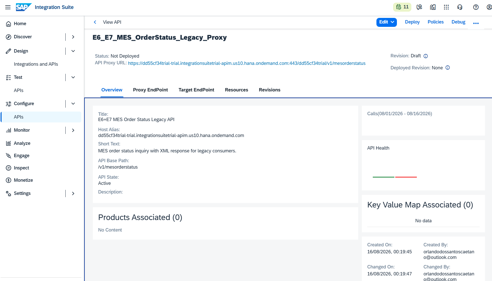

A aba Target Endpoint confirmou o destino HTTPS do backend E6+E7.

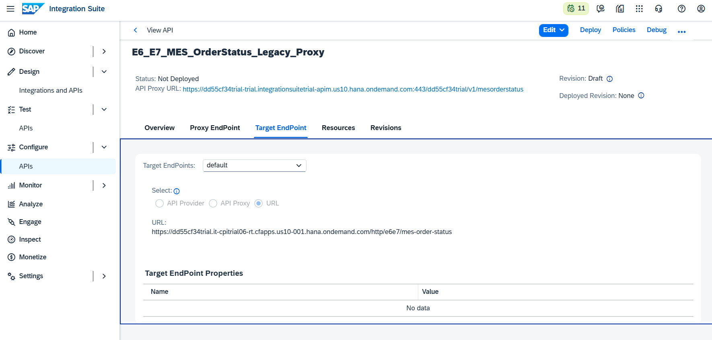

### 5.2 Recurso GET

No contrato público foi criado apenas o recurso de consulta:

**Tag**

```text
GetMESOrderStatus
```

**Path Prefix**

```text
/status/{idRastreamento}
```

**Operation**

```text
GET
```

**Description**

```text
MES order status inquiry with XML response for legacy consumers.
```

O método POST do backend não foi adicionado ao Product nem ao recurso público. Dessa forma, o caminho WRITE continua restrito à atualização interna do status.

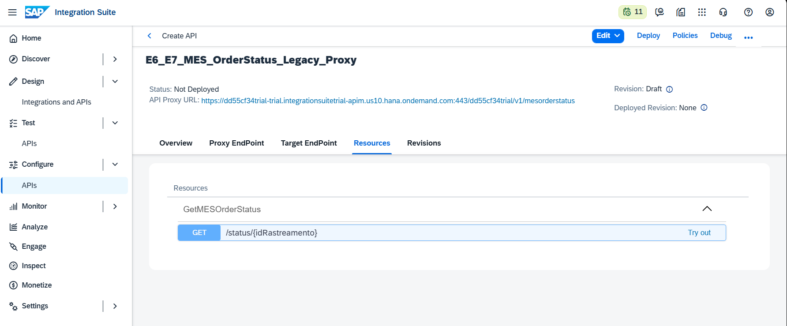

---

## 🏗️ Fase 6 — Autenticação técnica entre API Management e Cloud Integration

O endpoint HTTPS do Cloud Integration exige credenciais com autorização equivalente a `ESBMessaging.send`. Para evitar credenciais em texto aberto nas policies, foi reutilizada a KVM:

```text
KVM_D1_Backend_Credentials
```

A KVM existente possui as chaves:

```text
UserID
Password
```

Como o parser do tenant aceitou apenas uma operação `Get` por policy, a leitura foi separada em duas policies.

### 6.1 Recuperação do UserID

A primeira policy lê a chave `UserID` e atribui o valor a uma variável privada.

```xml
<KeyValueMapOperations xmlns="http://www.sap.com/apimgmt" async="false" continueOnError="false" enabled="true" mapIdentifier="KVM_D1_Backend_Credentials">
    <Get assignTo="private.e6e7.backend.clientid">
        <Key>
            <Parameter>UserID</Parameter>
        </Key>
    </Get>
</KeyValueMapOperations>
```


### 6.2 Recuperação do Password

A segunda policy lê a chave `Password`.

```xml
<KeyValueMapOperations xmlns="http://www.sap.com/apimgmt" async="false" continueOnError="false" enabled="true" mapIdentifier="KVM_D1_Backend_Credentials">
    <Get assignTo="private.e6e7.backend.clientsecret">
        <Key>
            <Parameter>Password</Parameter>
        </Key>
    </Get>
</KeyValueMapOperations>
```


### 6.3 Geração do header Basic Authentication

A terceira policy utiliza as variáveis privadas para gerar o header de autenticação técnica do backend.

```xml
<BasicAuthentication xmlns="http://www.sap.com/apimgmt" async="false" continueOnError="false" enabled="true">
    <Operation>Encode</Operation>
    <IgnoreUnresolvedVariables>false</IgnoreUnresolvedVariables>
    <User ref="private.e6e7.backend.clientid"/>
    <Password ref="private.e6e7.backend.clientsecret"/>
    <AssignTo createNew="false">request.header.Authorization</AssignTo>
</BasicAuthentication>
```

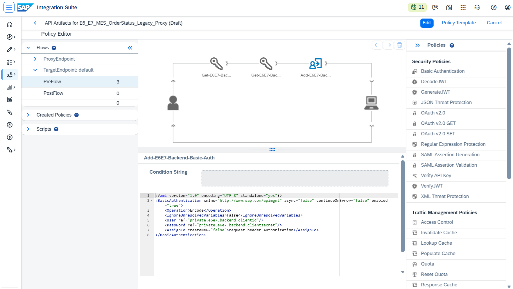

A ordem final no `TargetEndpoint → PreFlow → Incoming Request` ficou:

```text
Get-E6E7-Backend-ClientId
→ Get-E6E7-Backend-ClientSecret
→ Add-E6E7-Backend-Basic-Auth
```

### 6.4 Baseline do Proxy

Antes de aplicar OAuth, mascaramento ou transformação, o Proxy foi testado retornando o JSON original do backend.

O resultado `200 OK` comprovou:

- composição correta do path;
- leitura das credenciais da KVM;
- criação do Basic Authentication;
- acesso ao iFlow;
- recuperação da entrada no Data Store;
- preservação do campo `filaDestino` antes do controle de visibilidade.

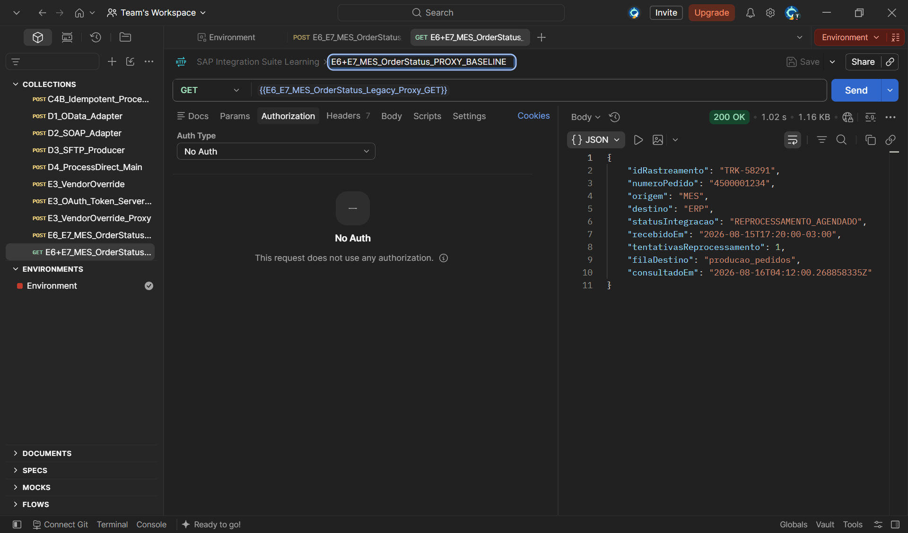

---

## 🏗️ Fase 7 — Products, Rate Plans e Developer Apps

Para diferenciar consumidores legados de consumidores internos, foram criados dois API Products e dois Developer Apps. Cada Product recebeu scopes próprios e foi associado a um Rate Plan.

### 7.1 Product legado

**Name**

```text
E6_E7_MES_OrderStatus_Legacy_Product
```

**Title**

```text
E6+E7 MES Order Status Legacy Product
```

**Short Text**

```text
XML-based MES order status query for legacy consumers.
```

**Scope**

```text
mesorderstatus.read
```

O Product foi publicado com uma API associada e um Rate Plan ativo.

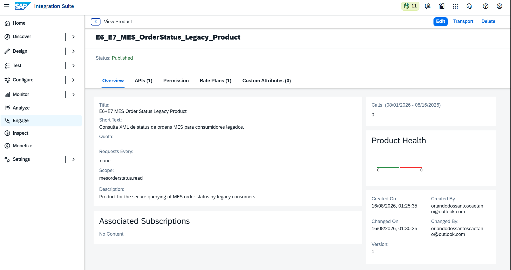

### 7.2 Product interno

**Name**

```text
E6_E7_MES_OrderStatus_Internal_Product
```

**Title**

```text
E6+E7 MES Order Status Internal Product
```

**Short Text**

```text
Complete MES order status query for Operations and Integration teams.
```

**Scopes**

```text
mesorderstatus.read
mesorderstatus.internal
```

**Description**

```text
Internal product for complete MES order status queries, including technical information intended for Operations and Integration teams.
```

O Product interno foi publicado com a mesma API e o mesmo Rate Plan, mas recebeu o scope adicional para informação técnica.

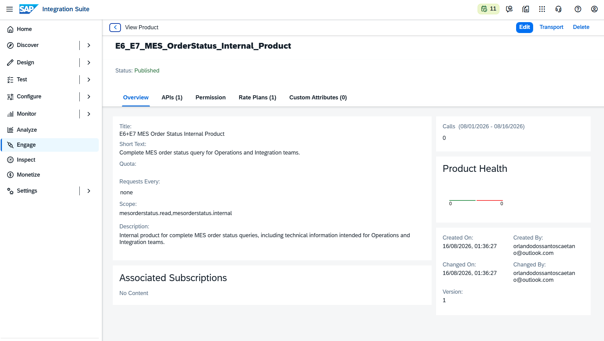

### 7.3 Developer App legado

O App legado foi associado exclusivamente ao Legacy Product.

**Title**

```text
MES Legacy Partner Application
```

**Description**

```text
OAuth client application for legacy MES consumers accessing XML-based order status responses.
```

As credenciais foram geradas pelo Developer Hub e mantidas mascaradas nas evidências.

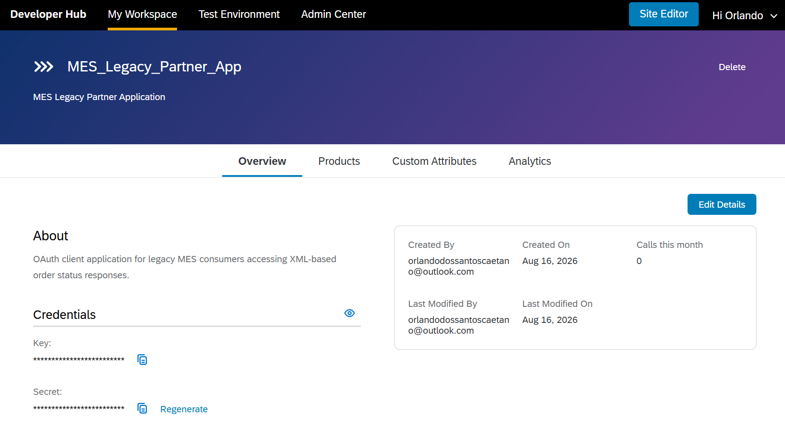

### 7.4 Developer App interno

O App interno foi associado exclusivamente ao Internal Product.

**Title**

```text
MES_Ops_Integration_App
```

**Description**

```text
OAuth client application for Operations and Integration teams accessing complete MES order status responses, including internal technical information.
```

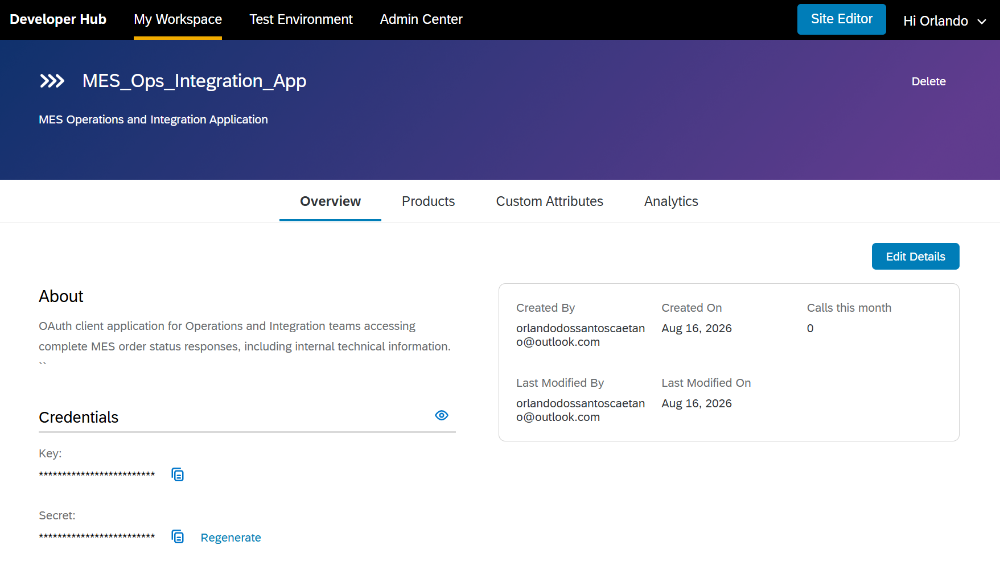

---

## 🏗️ Fase 8 — OAuth 2.0 Client Credentials

O Proxy foi protegido com uma policy `OAuthV2` no `ProxyEndpoint → PreFlow → Incoming Request`.

```xml
<OAuthV2 xmlns="http://www.sap.com/apimgmt" async="false" continueOnError="false" enabled="true">
    <Operation>VerifyAccessToken</Operation>
</OAuthV2>
```

A geração dos tokens utilizou o grant:

```text
client_credentials
```

### 8.1 Token do consumidor legado

O App legado solicitou somente:

```text
mesorderstatus.read
```

O Postman recebeu `200 OK` e armazenou o token em variável de ambiente para evitar exposição direta nas chamadas protegidas.

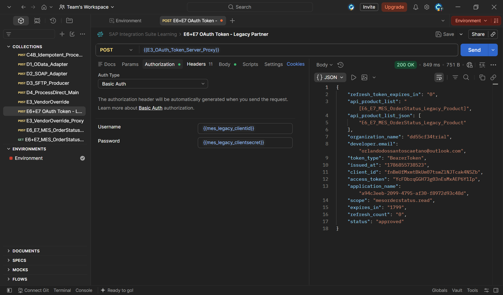

### 8.2 Token do consumidor interno

O App interno solicitou:

```text
mesorderstatus.read mesorderstatus.internal
```

O retorno confirmou o Internal Product, os dois scopes e o status aprovado.

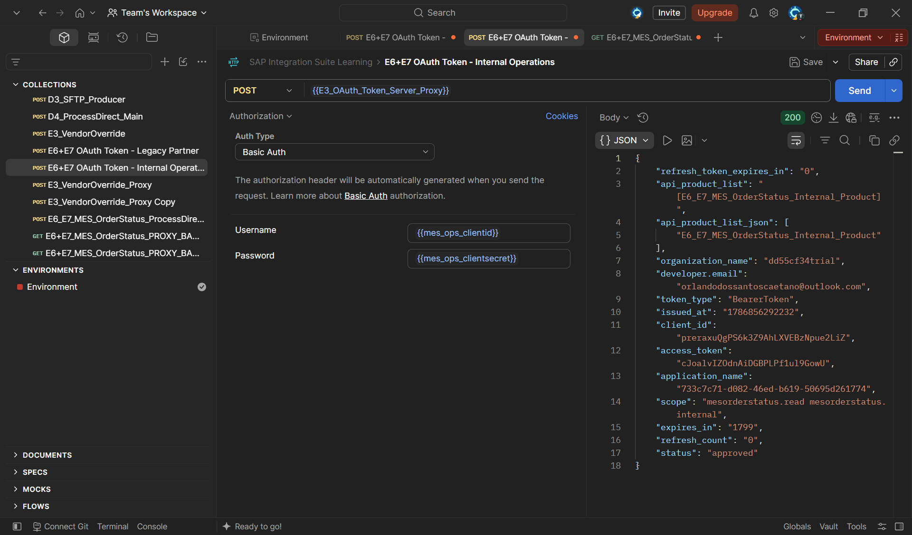

### 8.3 Separação entre Bearer Token e Basic Authentication

Após a validação OAuth, o header `Authorization` ainda carregava o Bearer Token do consumidor. O backend CPI, porém, exige Basic Authentication. Para impedir que o token externo fosse encaminhado ao backend, foi adicionada uma policy Assign Message no `TargetEndpoint → PreFlow → Incoming Request`.

```xml
<AssignMessage xmlns="http://www.sap.com/apimgmt" async="false" continueOnError="false" enabled="true">
    <Remove>
        <Headers>
            <Header name="Authorization"/>
        </Headers>
    </Remove>
    <IgnoreUnresolvedVariables>true</IgnoreUnresolvedVariables>
    <AssignTo createNew="false" type="request"/>
</AssignMessage>
```

A sequência técnica passou a ser:

```text
ProxyEndpoint valida Bearer Token
→ TargetEndpoint remove Authorization Bearer
→ Basic Authentication cria Authorization Basic
→ CPI recebe a credencial técnica correta
```

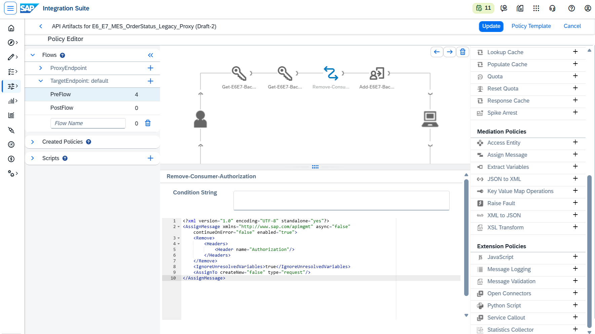

O novo teste legado retornou `200 OK` em JSON, agora com OAuth ativo e autenticação técnica funcionando simultaneamente.

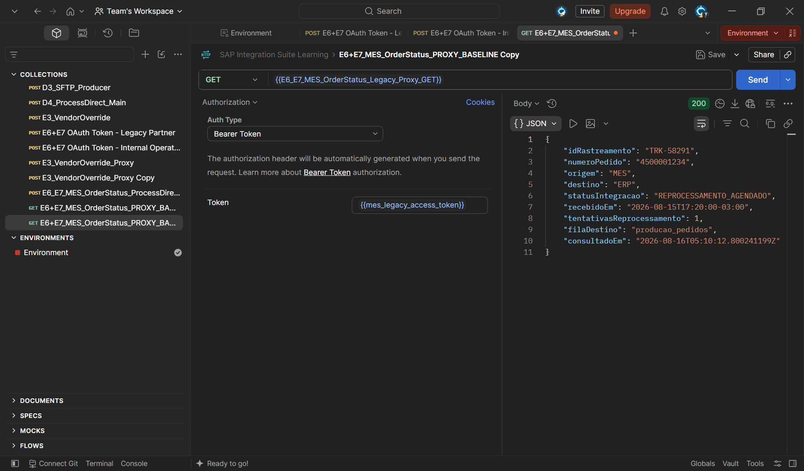

---

## 🏗️ Fase 9 — E7 Assign Message e rastreabilidade

No `ProxyEndpoint → PreFlow → Incoming Request`, foi adicionada uma policy Assign Message após a validação OAuth.

```xml
<AssignMessage xmlns="http://www.sap.com/apimgmt" async="false" continueOnError="false" enabled="true">
    <Set>
        <Headers>
            <Header name="X-Correlation-ID">{messageid}</Header>
        </Headers>
    </Set>
    <IgnoreUnresolvedVariables>false</IgnoreUnresolvedVariables>
    <AssignTo createNew="false" type="request"/>
</AssignMessage>
```

A policy cria um identificador de correlação com base no `messageid`, permitindo relacionar a chamada do consumidor, a execução do Proxy e o processamento do backend.

A ordem do PreFlow ficou:

```text
Verify-E6E7-Access-Token
→ Add-E6E7-Correlation-ID
```

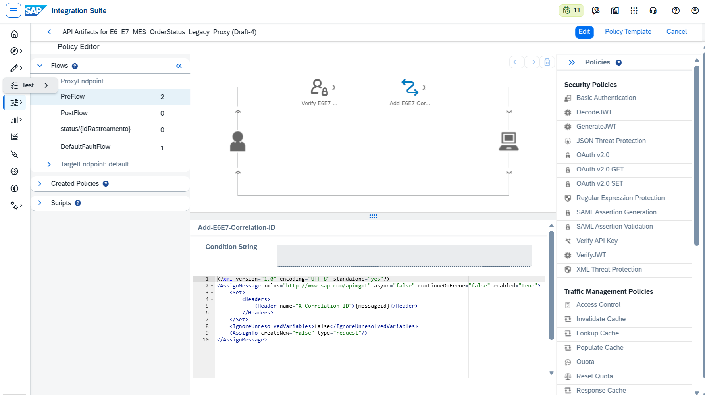

---

## 🏗️ Fase 10 — Controle condicional de `filaDestino`

O campo `filaDestino` representa informação técnica de infraestrutura e deve ser exibido apenas ao consumidor com scope interno.

Como a remoção precisava ocorrer dentro do payload JSON, foi usado um JavaScript no `ProxyEndpoint → PostFlow → Outgoing Response`.

### 10.1 Script Resource

O recurso foi importado em `Scripts` com o nome:

```text
remove-internal-queue-field.js
```

Versão final do script:

```javascript
var scope = context.getVariable("scope") || "";
var responseContent = context.getVariable("response.content");

if (responseContent) {
    var payload = JSON.parse(responseContent);
    var hasInternalScope =
        scope.split(/\s+/).indexOf("mesorderstatus.internal") !== -1;

    if (!hasInternalScope) {
        delete payload.filaDestino;
    }

    context.setVariable(
        "response.content",
        JSON.stringify(payload)
    );

    context.setVariable(
        "response.header.X-Data-Visibility",
        hasInternalScope ? "INTERNAL" : "LEGACY"
    );
}
```

### 10.2 Policy JavaScript

O nome técnico foi reduzido para evitar conflito com policies antigas:

```text
Remove-E6E7-Internal
```

A policy referencia o Script Resource:

```xml
<Javascript xmlns="http://www.sap.com/apimgmt" async="false" continueOnError="false" enabled="true" timeLimit="200">
    <ResourceURL>jsc://remove-internal-queue-field.js</ResourceURL>
</Javascript>
```

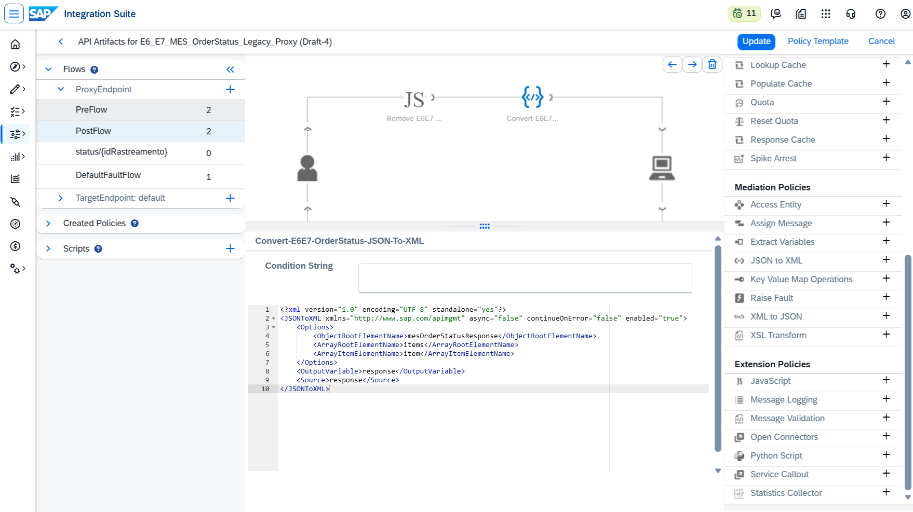

A lógica final é:

```text
scope contém mesorderstatus.internal
→ mantém filaDestino
→ X-Data-Visibility = INTERNAL
```

```text
scope não contém mesorderstatus.internal
→ remove filaDestino
→ X-Data-Visibility = LEGACY
```

---

## 🏗️ Fase 11 — E6 JSON to XML

Após o controle de visibilidade, o payload é convertido de JSON para XML.

A policy foi criada no `ProxyEndpoint → PostFlow → Outgoing Response`, depois do JavaScript.

**Policy Name**

```text
Convert-E6E7-OrderStatus-JSON-XML
```

```xml
<JSONToXML xmlns="http://www.sap.com/apimgmt" async="false" continueOnError="false" enabled="true">
    <Options>
        <ObjectRootElementName>mesOrderStatusResponse</ObjectRootElementName>
        <ArrayRootElementName>items</ArrayRootElementName>
        <ArrayItemElementName>item</ArrayItemElementName>
    </Options>
    <OutputVariable>response</OutputVariable>
    <Source>response</Source>
</JSONToXML>
```

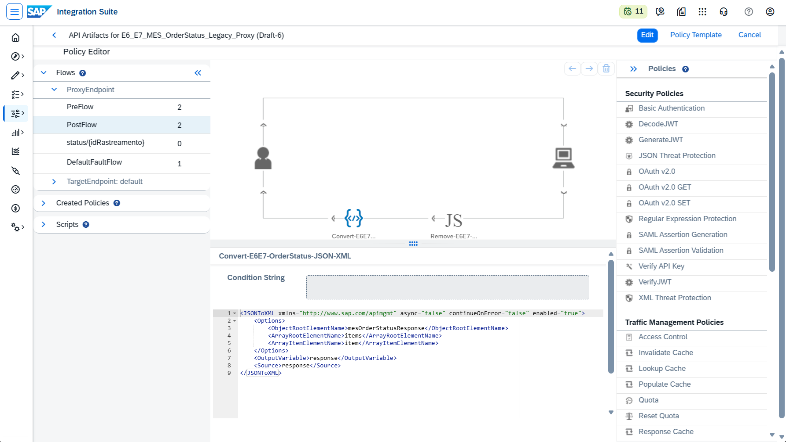

A ordem final no fluxo de resposta ficou:

```text
Backend retorna JSON
→ Remove-E6E7-Internal avalia o scope
→ Convert-E6E7-OrderStatus-JSON-XML converte o conteúdo resultante
→ consumidor recebe XML
```

A posição no **Outgoing Response** é essencial, pois a variável `response` só existe depois que o backend devolve o payload.

---

## 🧪 Fase 12 — Testes finais por perfil de consumidor

### 12.1 Legacy Partner

A chamada foi executada com:

```text
Bearer Token: {{mes_legacy_access_token}}
Accept: application/xml
```

O retorno foi `200 OK` em XML e não apresentou o elemento `filaDestino`.

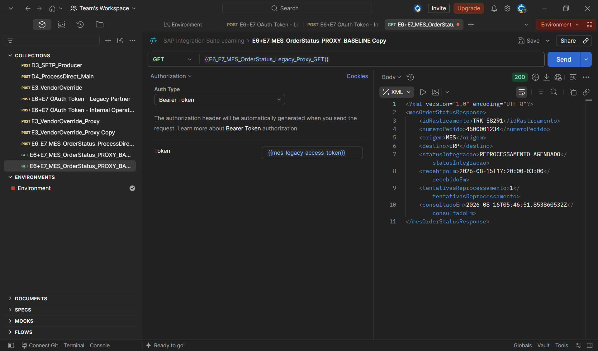

A resposta validou:

- token associado ao Legacy Product;
- scope `mesorderstatus.read`;
- autenticação técnica no backend;
- recuperação do status no Data Store;
- remoção do campo interno;
- conversão JSON para XML;
- preservação dos demais campos.

### 12.2 Internal Operations

A chamada interna utilizou:

```text
Bearer Token: {{mes_ops_access_token}}
Accept: application/xml
```

O retorno foi `200 OK` e preservou:

```xml
<filaDestino>producao_pedidos</filaDestino>
```

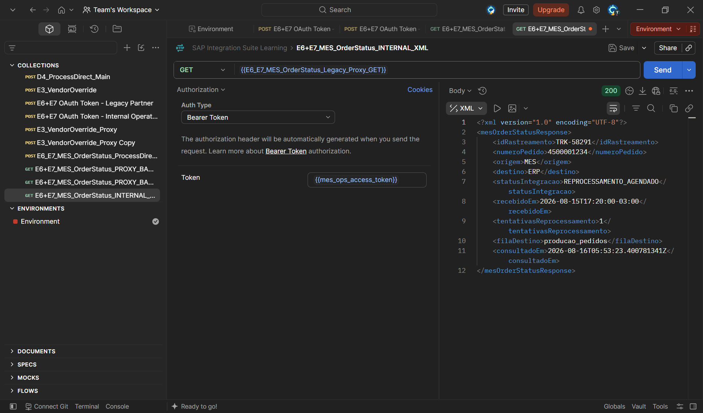

O resultado confirmou que o scope `mesorderstatus.internal` foi reconhecido pela variável de fluxo `scope` e que a resposta interna permaneceu completa.

---

### 🧪 Resumo Consolidado dos Testes

| # | Camada | Cenário | Resultado | Validação principal |
|---:|---|---|---|---|
| 1 | Cloud Integration | WRITE inicial | ✅ `201 Created` | Entrada `TRK-58291` criada |
| 2 | Cloud Integration | WRITE com sobrescrita | ✅ `201 Created` | Mesma entrada atualizada sem duplicação |
| 3 | Cloud Integration | GET existente | ✅ `200 OK` | Recuperação e `consultadoEm` |
| 4 | Cloud Integration | GET inexistente | ✅ `404 Not Found` | Resposta funcional `MES-404` |
| 5 | Cloud Integration | Operação inválida | ✅ `400 Bad Request` | Resposta funcional `MES-400` |
| 6 | API Management | Proxy baseline | ✅ `200 OK` JSON | KVM, Basic Auth e backend |
| 7 | API Management | OAuth legado | ✅ `200 OK` JSON | Bearer validado e Basic recriado |
| 8 | API Management | XML legado | ✅ `200 OK` XML | `filaDestino` removido |
| 9 | API Management | XML interno | ✅ `200 OK` XML | `filaDestino` preservado |

---

### 🔍 Troubleshooting e Lições Aprendidas

#### 1. POST direcionado para INVALID_OPERATION

**Sintoma:** a chamada WRITE chegava ao iFlow, mas retornava `MES-400`.

**Causa:** a primeira condição do Router dependia de properties que não refletiam corretamente os headers usados pelo runtime.

**Solução:** utilizar diretamente `CamelHttpMethod` e `CamelHttpPath`.

#### 2. URL GET sem o segmento `/status/`

**Sintoma:** a consulta retornava `MES-400`.

**Solução:** ajustar a URL para incluir `/status/TRK-58291`.

#### 3. Erro 500 no `Extract_Tracking_Id`

**Causa:** o Groovy inicial procurava literalmente `/status/` em `CamelHttpPath`.

**Solução:** considerar `CamelHttpPath` e `CamelHttpUri` e localizar o padrão `TRK-...` por expressão regular.

#### 4. Valor zero em `tentativasReprocessamento`

**Risco:** uma verificação booleana simples poderia interpretar `0` como campo ausente.

**Solução:** validar por `containsKey`, `null` e string vazia.

#### 5. Parser das KVM policies

**Sintomas:** erro de parse com `DisplayName`, múltiplos `Get` e posicionamento de `Scope`.

**Solução final:**

- remover `DisplayName`;
- criar uma KVM policy por chave;
- omitir `Scope`, utilizando o padrão do ambiente;
- usar os nomes reais `UserID` e `Password`.

#### 6. `UnresolvedVariable` no Basic Authentication

**Causa:** as policies buscavam `clientid` e `clientsecret`, mas a KVM possuía `UserID` e `Password`.

**Solução:** corrigir somente os parâmetros de busca e manter as variáveis privadas usadas pelo Basic Authentication.

#### 7. OAuth retornando `401` no backend

**Causa:** o Bearer Token do consumidor era encaminhado ao CPI no header `Authorization`.

**Solução:** remover o Bearer no Target PreFlow e gerar um novo Authorization Basic.

#### 8. `Source response is not available`

**Causa:** JavaScript e JSON to XML foram inicialmente adicionados no Incoming Request do PostFlow.

**Solução:** recriar as duas policies no `ProxyEndpoint → PostFlow → Outgoing Response`.

#### 9. Erro de deploy com `jsc://maincode.js`

**Causa:** uma policy JavaScript antiga permaneceu em Created Policies, mesmo após ser removida do fluxo.

**Solução:** excluir a policy órfã e manter somente a policy atual apontando para `jsc://remove-internal-queue-field.js`.

#### 10. App interno recebendo resposta mascarada

**Causa:** o JavaScript consultava uma variável de scope incorreta.

**Solução:** utilizar diretamente:

```javascript
context.getVariable("scope")
```

---

### 🧠 Decisões Técnicas

#### Um único documento e laboratório

A construção do backend e a implementação do API Management representam uma única jornada E6+E7. Por isso, o documento e o `lab22` foram mantidos, com evidências sequenciais de `01` a `39`.

#### Data Store interno

O cenário utiliza o Data Store do SAP Cloud Integration, sem persistência externa.

#### Endpoint WRITE interno

O Product expõe somente `GET /status/{idRastreamento}`. O WRITE permanece interno.

#### Products separados

A separação entre Legacy Product e Internal Product impede que o parceiro legado obtenha o scope interno.

#### Dupla autenticação

O consumidor usa OAuth Bearer até o Proxy. O Proxy usa Basic Authentication técnico até o Cloud Integration.

#### Controle de visibilidade antes da transformação

O campo `filaDestino` é removido enquanto o payload ainda está em JSON. Somente depois o payload resultante é convertido para XML.

---

### ✅ Conclusão

O cenário E6+E7 foi concluído de ponta a ponta, integrando Cloud Integration e API Management em uma solução única de consulta de status de ordens MES.

A implementação demonstrou:

- HTTPS Sender com roteamento por método e caminho;
- gravação, sobrescrita e leitura por Data Store;
- validação e enriquecimento com Groovy;
- API Proxy com recurso GET controlado;
- KVM e Basic Authentication para o backend;
- OAuth 2.0 Client Credentials;
- Products, Rate Plans e Developer Apps separados;
- Assign Message para correlação e substituição controlada do Authorization;
- JavaScript para remoção condicional de informação interna;
- JSON to XML no fluxo de resposta;
- contrato XML distinto para parceiro legado e time interno.

O resultado final atende aos dois perfis:

```text
Legacy Partner
→ mesorderstatus.read
→ XML sem filaDestino
```

```text
Internal Operations
→ mesorderstatus.read + mesorderstatus.internal
→ XML com filaDestino
```

**Recursos praticados:** HTTPS Sender · Router · Content Modifier · Groovy · Data Store · API Proxy · KVM · Basic Authentication · OAuth 2.0 · API Product · Rate Plan · Developer App · Assign Message · JavaScript · JSON to XML

**Cenário anterior:** [E4+E5 — Traffic Management com Quota e Spike Arrest](./23-e4-e5-quota-spike-arrest.md)  
**Próximo cenário:** [E10 — API Analytics](./25-e10-api-analytics.md)

---

### 🛠️ Ferramentas utilizadas

- **SAP Integration Suite — Cloud Integration**
- **SAP Integration Suite — API Management**
- **SAP Data Store**
- **Groovy**
- **JavaScript**
- **Postman**
- **Visual Studio Code**
- **Git e GitHub**

---

### 👤 Autor / 📬 Contato

[](https://www.linkedin.com/in/orlando-caetano/)
[](https://github.com/OrlandoCaetano2026)

**Orlando Caetano**  
Especialista SAP • Integração • Inteligência Artificial  
Consultor SAP MM com know-how em PP, QM e WM

   

> 📌 Projeto de estudo e portfólio. Os cenários SAP MM, PP e QM são simulações educativas para prática de integração.
