## 📊 E10 — API Analytics: Monitoramento Operacional do MES Order Status

**Bloco:** E — API Management  
**Cenário:** E10 — API Analytics  
**Status:** ✅ Concluído e testado  
**Data de execução:** 16/08/2026  
**API Proxy analisado:** `E6_E7_MES_OrderStatus_Legacy_Proxy`  
**Custom View:** `MES_Order_Status`

---

### 📌 Contexto de Negócio

Após a criação do backend MES Order Status e da exposição segura pelo SAP API Management, tornou-se necessário acompanhar como a API estava sendo consumida e como os diferentes resultados apareciam na camada analítica.

O cenário E10 utiliza o Proxy `E6_E7_MES_OrderStatus_Legacy_Proxy`, desenvolvido no cenário E6+E7, para gerar tráfego positivo e negativo de forma controlada. Em seguida, os eventos são analisados nos painéis **Overview**, **Health** e **Usage** do SAP API Management.

A proposta simula uma necessidade operacional real: o time de Integração precisa identificar volume, sucesso, falhas de autenticação, registros inexistentes, erros técnicos, latência do backend e consumo associado aos Developer Apps.

> 📌 Este laboratório não cria um novo iFlow ou API Proxy. O E10 reutiliza a API E6+E7 já implantada e transforma suas chamadas em indicadores de observabilidade.

---

### 🎯 Objetivos

- Gerar tráfego controlado por diferentes perfis e resultados HTTP.
- Confirmar o registro das chamadas no API Analytics.
- Filtrar os indicadores pelo Proxy E6+E7.
- Comparar chamadas bem-sucedidas e falhas.
- Analisar a distribuição de respostas `2xx`, `4xx` e `5xx`.
- Avaliar erros de backend e erros de policies.
- Analisar o tempo médio do backend e do Proxy.
- Relacionar consumo, desenvolvedores e subscriptions.
- Identificar limitações de metadados em clientes técnicos como o Postman.
- Criar uma Custom View operacional com granularidade por hora.

---

### 🧠 Conceito: Analytics como camada de operação da API

O API Analytics transforma as chamadas processadas pelo API Management em indicadores de operação. Cada request pode contribuir com informações como:

- API Proxy utilizado;
- horário da chamada;
- resultado de sucesso ou falha;
- família do código HTTP;
- tempo de processamento no Proxy;
- tempo de resposta do Target Endpoint;
- erros de policies;
- desenvolvedor ou aplicação identificada;
- dados de plataforma, User-Agent, sistema operacional e dispositivo, quando disponíveis.

Essa visão permite separar problemas de natureza diferente:

```text
2xx
→ processamento bem-sucedido
```

```text
4xx
→ erro funcional ou falha de autenticação/autorização
```

```text
5xx
→ erro técnico no Proxy, policy ou backend
```

No contexto MES, o Analytics permite observar se a API está respondendo corretamente às consultas de status e se eventuais falhas estão relacionadas ao consumidor, ao contrato ou à infraestrutura.

---

### 🏗️ Arquitetura do cenário

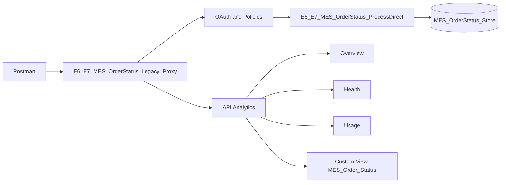

O Postman gera chamadas com resultados distintos. O API Proxy registra os eventos analíticos ao mesmo tempo em que valida OAuth, aplica as policies e encaminha as chamadas ao Cloud Integration.

---

## 🏗️ Fase 1 — Preparação do laboratório

### 1.1 Artefatos reutilizados

O cenário reutiliza os seguintes artefatos concluídos no E6+E7:

```text
API Proxy: E6_E7_MES_OrderStatus_Legacy_Proxy
```

```text
Backend: E6_E7_MES_OrderStatus_ProcessDirect
```

```text
Legacy Product: E6_E7_MES_OrderStatus_Legacy_Product
```

```text
Internal Product: E6_E7_MES_OrderStatus_Internal_Product
```

```text
Legacy App: MES_Legacy_Partner_App
```

```text
Internal App: MES_Ops_Integration_App
```

### 1.2 Estratégia de geração de tráfego

Foram preparados cinco grupos de chamadas:

1. Legacy Partner com token válido e resposta `200`.
2. Internal Operations com token válido e resposta `200`.
3. Consulta de rastreamento inexistente com resposta `404`.
4. Chamada sem Access Token com resposta `401`.
5. Chamada com Access Token inválido com resposta `401`.

A quantidade final observada no Analytics não foi limitada apenas à carga planejada, pois o período também continha chamadas de construção e troubleshooting do Proxy.

---

## 🧪 Fase 2 — Geração de tráfego controlado

### 2.1 Tráfego Legacy Partner com sucesso

A primeira requisição utilizou o token do App legado:

```text
{{mes_legacy_access_token}}
```

O endpoint consultou o registro existente `TRK-58291` e retornou `200 OK` em XML, sem o campo interno `filaDestino`.

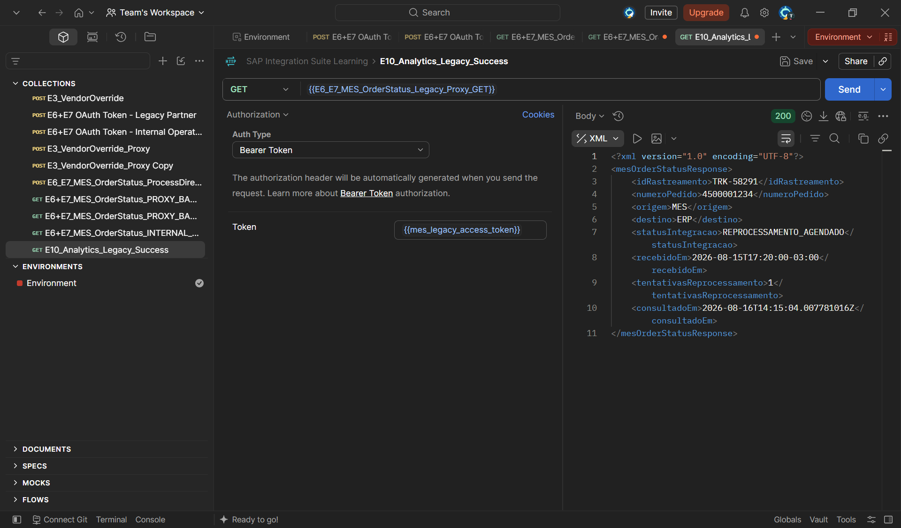

Essa chamada representa o comportamento esperado de um consumidor externo autorizado somente com:

```text
mesorderstatus.read
```

### 2.2 Tráfego Internal Operations com sucesso

A segunda requisição utilizou:

```text
{{mes_ops_access_token}}
```

O retorno foi `200 OK` em XML e preservou:

```xml
<filaDestino>producao_pedidos</filaDestino>
```

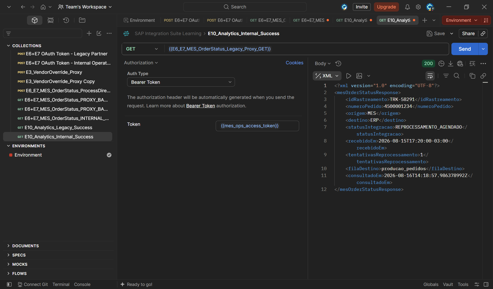

Esse resultado confirma o consumo interno com os scopes:

```text
mesorderstatus.read
mesorderstatus.internal
```

### 2.3 Consulta de rastreamento inexistente

Para gerar um erro funcional, foi consultado:

```text
TRK-99999
```

O Bearer Token permaneceu válido, mas o Data Store não possuía a entrada solicitada. O backend respondeu com:

```text
HTTP 404 Not Found
codigo: MES-404
```

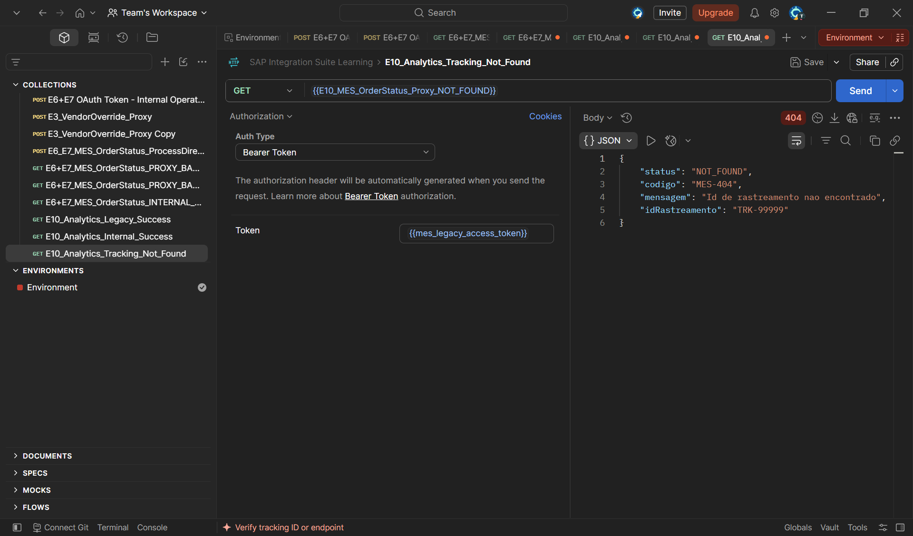

Esse teste é importante porque diferencia uma falha funcional de uma falha de segurança. O consumidor foi autenticado, o Proxy chegou ao backend e somente o recurso de negócio não foi encontrado.

### 2.4 Chamada sem Access Token

A requisição foi executada com:

```text
Authorization: No Auth
```

A policy `Verify-E6E7-Access-Token` interrompeu a chamada antes do Target Endpoint e retornou:

```text
HTTP 401 Unauthorized
```

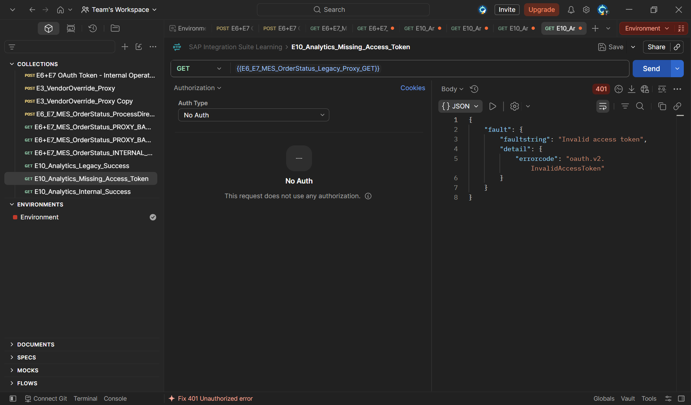

O erro evidencia que a proteção OAuth está ativa no ProxyEndpoint.

### 2.5 Chamada com Access Token inválido

O último grupo utilizou deliberadamente:

```text
invalid-token-e10-analytics
```

O resultado foi `401 Unauthorized`, com erro de gerenciamento de token inválido.

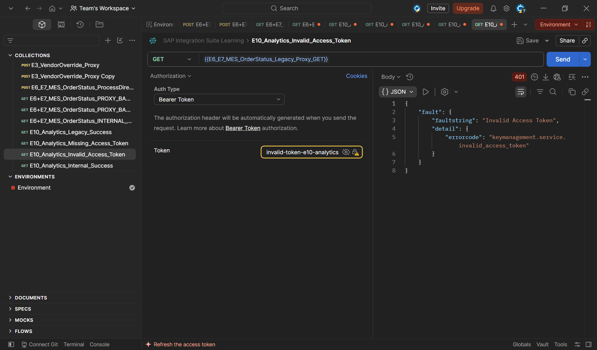

Embora ausência de token e token inválido produzam a mesma família `4xx`, as causas operacionais são diferentes:

- sem token: o consumidor não enviou credencial;
- token inválido: o consumidor enviou uma credencial não reconhecida ou expirada.

---

## 📈 Fase 3 — Overview: volume de chamadas

### 3.1 Filtro pelo API Proxy

Na área:

```text
Analyze → Overview
```

foi aplicado o filtro:

```text
E6_E7_MES_OrderStatus_Legacy_Proxy
```

O gráfico filtrado apresentou:

```text
Cumulative: 32
Success: 17
Failure: 15
```

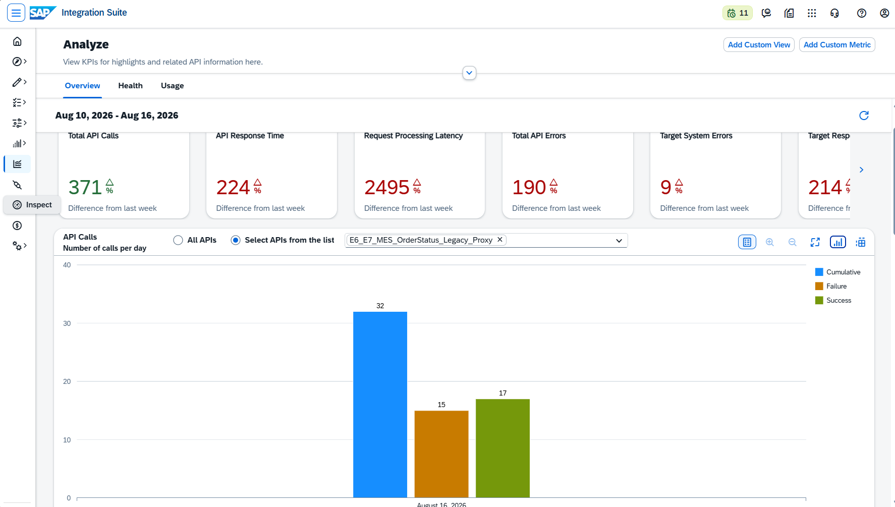

Os 32 eventos incluem a carga controlada e chamadas adicionais realizadas durante construção e troubleshooting no mesmo período.

### 3.2 Visualização tabular

A representação tabular confirmou os valores para 16 de agosto de 2026:

| Indicador | Valor |
|---|---:|
| Chamadas acumuladas | 32 |
| Sucessos | 17 |
| Falhas | 15 |

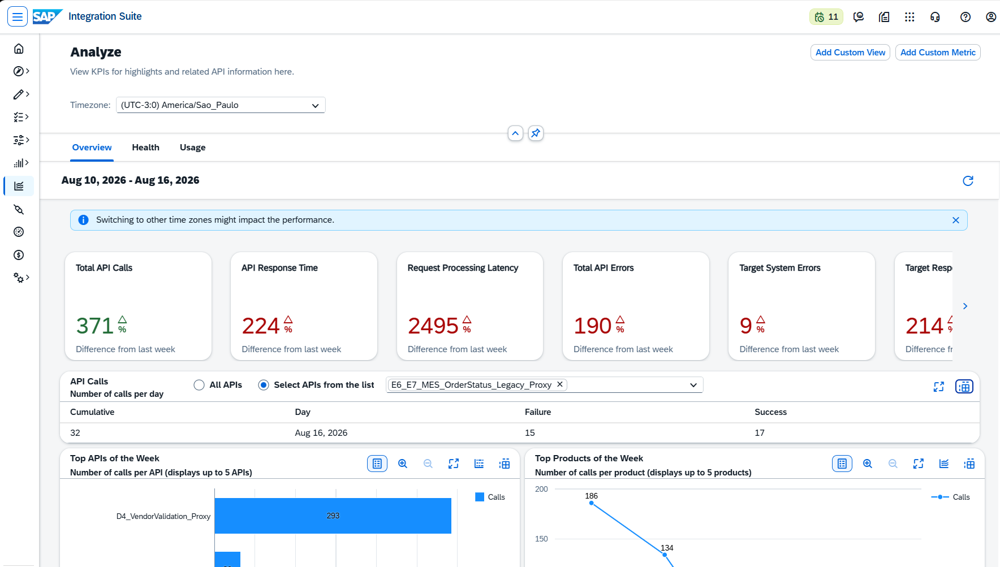

As taxas observadas foram:

```text
Success rate = 17 / 32 = 53.1%
```

```text
Failure rate = 15 / 32 = 46.9%
```

A taxa de falha elevada é coerente com um laboratório que gerou intencionalmente respostas `401` e `404`, além de conter falhas técnicas do período de configuração.

---

## 🩺 Fase 4 — Health: códigos HTTP e falhas

### 4.1 Distribuição de códigos de resposta

Na aba:

```text
Analyze → Health
```

foi mantido o filtro do Proxy E6+E7.

A distribuição observada foi:

| Família HTTP | Chamadas | Percentual |
|---|---:|---:|
| `2xx` | 17 | 53,1% |
| `4xx` | 12 | 37,5% |
| `5xx` | 3 | 9,4% |

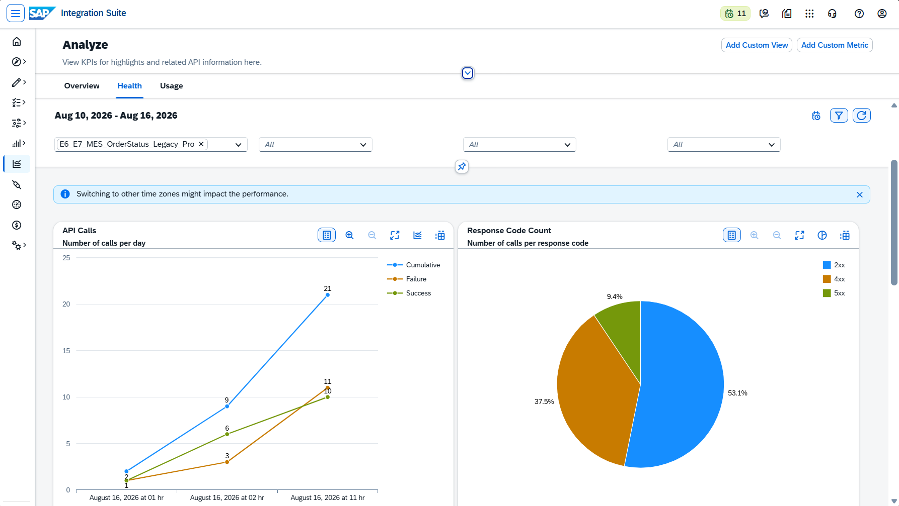

Interpretação:

- `2xx`: consultas válidas e autenticadas;
- `4xx`: tracking inexistente e falhas OAuth;
- `5xx`: erros técnicos gerados durante implementação e troubleshooting.

A soma fecha o volume total:

```text
17 + 12 + 3 = 32
```

### 4.2 Erros do backend e comportamento de cache

A tabela de response codes confirmou novamente:

```text
2xx = 17
4xx = 12
5xx = 3
```

O painel também apresentou Backend Error Call Count e Cache Response.

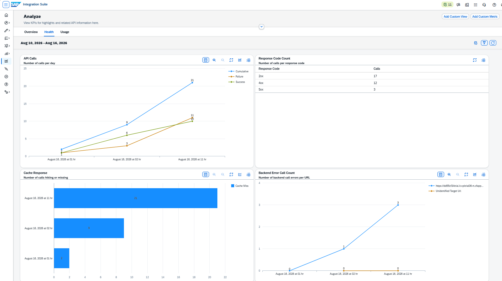

Foram observados erros de backend concentrados nos períodos de implementação. As 32 chamadas apareceram como **Cache Miss**, comportamento esperado porque nenhuma policy de Response Cache foi configurada para esse Proxy.

### 4.3 Tempos médios e policy errors

Os indicadores de desempenho apresentaram:

```text
Average Backend Response Time: 133.55 ms
```

```text
Average Proxy Response Time: 53.58 ms
```

```text
Proxy Error Call Count: 11
```

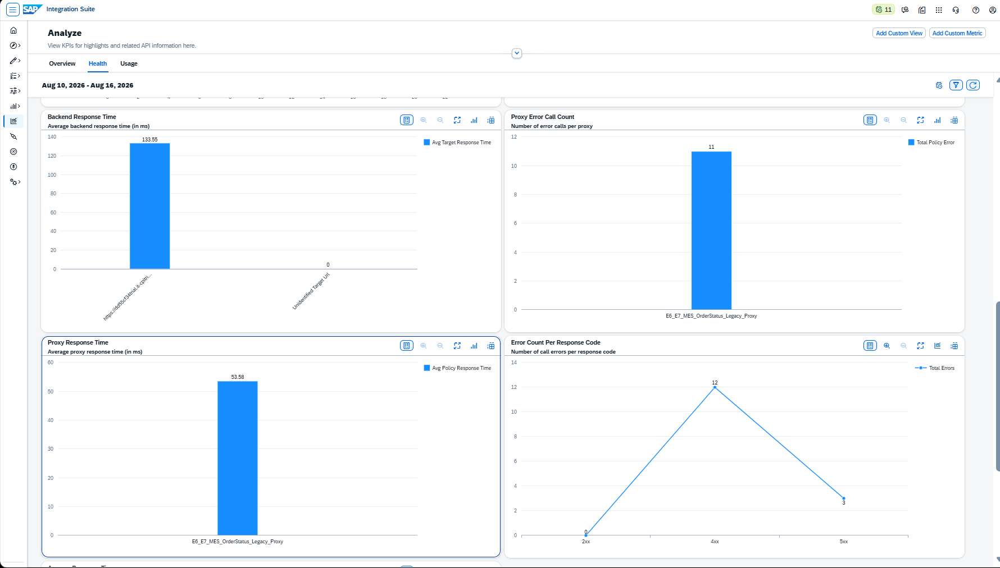

A maior parcela do tempo médio está no backend, que precisa acessar o Cloud Integration, localizar o registro no Data Store e montar a resposta. O Proxy adiciona o custo de processamento associado a:

- OAuth;
- leitura da KVM;
- Basic Authentication;
- Assign Message;
- JavaScript;
- JSON to XML.

Os policy errors incluem principalmente rejeições OAuth e tentativas realizadas durante a configuração do Proxy.

---

## 👥 Fase 5 — Usage: desenvolvedores, subscriptions e clientes

### 5.1 Developer Engagement

Na aba:

```text
Analyze → Usage
```

foram observados:

```text
Orlando Caetano: 68.7%
Unidentified Developer: 31.3%
```

Também apareceram entre as subscriptions recentes:

```text
MES_Ops_Integration_App
MES_Legacy_Partner_App
```

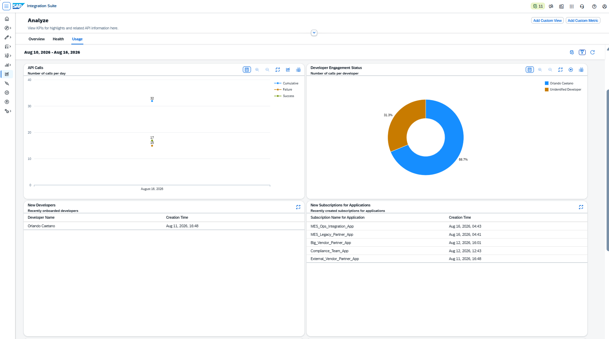

As chamadas autenticadas podem ser relacionadas ao desenvolvedor e aos Apps cadastrados. Requisições rejeitadas antes da identificação completa do consumidor, como chamadas sem token ou com token inválido, podem aparecer como `Unidentified Developer`.

### 5.2 Metadados técnicos não identificados

Os painéis de Browser, User Agent, Operating System e Device Type exibiram:

```text
Unidentified Platform Name
Unidentified User Agents Name
Unidentified OS Family Name
Unidentified Device Type
```

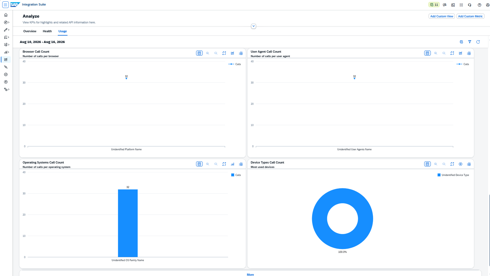

Essa limitação não impede a contabilização de volume, erros e desempenho. O resultado demonstra que consumidores técnicos, como o Postman, podem não fornecer ou não ser classificados pelos mesmos metadados normalmente disponíveis em chamadas originadas de navegadores.

---

## 🛠️ Fase 6 — Custom View operacional

### 6.1 Criação da Custom View

Foi criada uma visão personalizada com o nome:

```text
MES_Order_Status
```

O objetivo foi concentrar uma métrica operacional do Proxy E6+E7 em uma visão reutilizável.

### 6.2 Configuração do gráfico

O gráfico personalizado foi configurado com:

**Title**

```text
E6+E7 MES Order Status API Call Volume
```

**Description**

```text
Total API call volume for the E6+E7 MES Order Status Legacy Proxy during the selected period.
```

**Dimension**

```text
API Name
```

**Measure**

```text
Calls
```

**Aggregation**

```text
Sum
```

**Granularity**

```text
Hour
```

**Filter**

```text
ApiProxy = E6_E7_MES_OrderStatus_Legacy_Proxy
```

A dimensão foi combinada com granularidade por hora, permitindo visualizar a concentração do tráfego no período.

### 6.3 Resultado da Custom View

O gráfico apresentou:

| Horário | Chamadas |
|---|---:|
| 01h | 2 |
| 02h | 9 |
| 11h | 21 |
| **Total** | **32** |

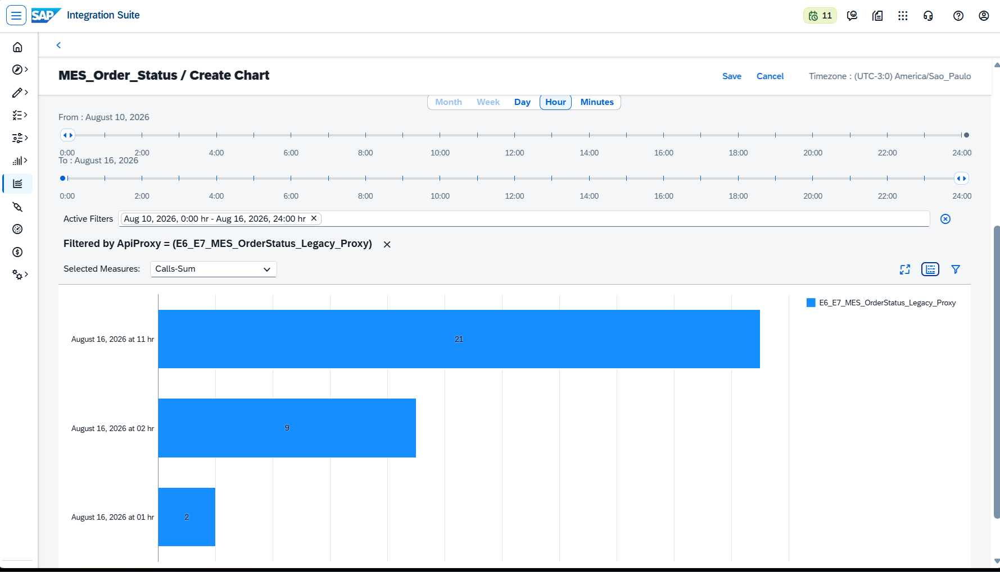

A Custom View demonstra como o SAP API Management pode ser adaptado para uma visão operacional específica, sem depender somente dos painéis padrão. A concentração de 21 chamadas às 11h corresponde ao período de geração controlada do tráfego do E10.

---

### 🧪 Resumo Consolidado

| Área | Indicador | Resultado |
|---|---|---:|
| Overview | Total do Proxy | 32 chamadas |
| Overview | Sucessos | 17 |
| Overview | Falhas | 15 |
| Health | `2xx` | 17 |
| Health | `4xx` | 12 |
| Health | `5xx` | 3 |
| Health | Backend Response Time | 133,55 ms |
| Health | Proxy Response Time | 53,58 ms |
| Health | Policy Errors | 11 |
| Usage | Developer identificado | 68,7% |
| Usage | Developer não identificado | 31,3% |
| Custom View | Chamadas às 01h | 2 |
| Custom View | Chamadas às 02h | 9 |
| Custom View | Chamadas às 11h | 21 |

---

### 🔍 Lições Aprendidas

#### 1. O período analítico inclui troubleshooting

O Analytics registra todas as chamadas processadas no intervalo selecionado. Por isso, o volume real pode ser maior que a carga planejada.

#### 2. Erro funcional e erro técnico devem ser separados

Um `404` para tracking inexistente é diferente de um `5xx` causado por policy ou backend. Ambos são falhas no gráfico agregado, mas exigem ações operacionais distintas.

#### 3. Respostas OAuth aparecem como `4xx`

Chamadas sem token e com token inválido contribuem para a taxa de falha, mas comprovam que a proteção do Proxy está funcionando.

#### 4. Backend e Proxy possuem tempos distintos

A separação entre Backend Response Time e Proxy Response Time ajuda a localizar onde está a maior parcela da latência.

#### 5. Policy errors não significam necessariamente indisponibilidade

No laboratório, parte dos policy errors foi produzida intencionalmente por rejeições OAuth e parte ocorreu durante a configuração.

#### 6. Metadados de cliente podem permanecer não identificados

O Analytics continua útil mesmo quando chamadas técnicas não fornecem informações reconhecidas de navegador, sistema operacional ou dispositivo.

#### 7. Custom Views simplificam a operação

Uma visão personalizada permite destacar o Proxy e a granularidade mais relevantes ao processo monitorado.

---

### ✅ Conclusão

O cenário E10 demonstrou o uso do SAP API Analytics para acompanhar uma API de integração MES de forma operacional.

A execução comprovou:

- geração controlada de tráfego positivo e negativo;
- filtro por API Proxy;
- análise de sucesso e falha;
- distribuição de códigos HTTP;
- identificação de erros de backend e policies;
- análise de tempos médios;
- relacionamento com desenvolvedores e subscriptions;
- limitações de metadados em clientes técnicos;
- criação de Custom View com distribuição horária.

O E10 encerra o Bloco E com uma visão completa do ciclo de API Management:

```text
Construir
→ Expor
→ Proteger
→ Transformar
→ Consumir
→ Monitorar
```

**Recursos praticados:** API Analytics · Overview · Health · Usage · API Proxy Filter · HTTP Response Codes · Backend Response Time · Proxy Response Time · Developer Engagement · Subscriptions · Custom View

**Cenário anterior:** [E6+E7 — MES Order Status: Backend, Assign Message e JSON to XML](./24-e6-e7-mes-order-status-backend.md)  
**Próximo bloco:** Bloco F — Segurança

---

### 🛠️ Ferramentas utilizadas

- **SAP Integration Suite — API Management**
- **SAP API Analytics**
- **Postman**
- **SAP Integration Suite — Cloud Integration**
- **Visual Studio Code**
- **Git e GitHub**

---

### 👤 Autor / 📬 Contato

[](https://www.linkedin.com/in/orlando-caetano/)
[](https://github.com/OrlandoCaetano2026)

**Orlando Caetano**  
Especialista SAP • Integração • Inteligência Artificial  
Consultor SAP MM com know-how em PP, QM e WM

   

> 📌 Projeto de estudo e portfólio. Os cenários SAP MM, PP e QM são simulações educativas para prática de integração.
