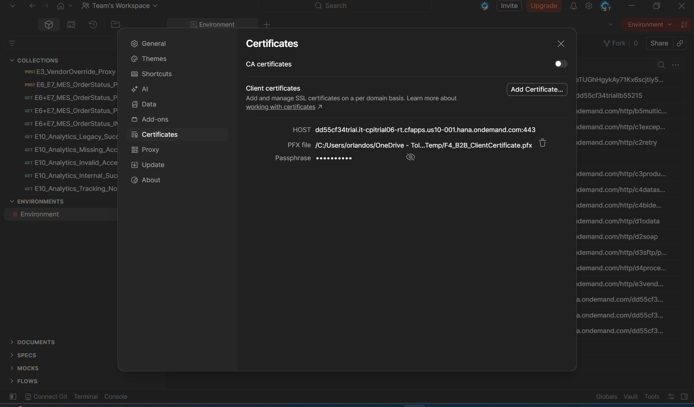
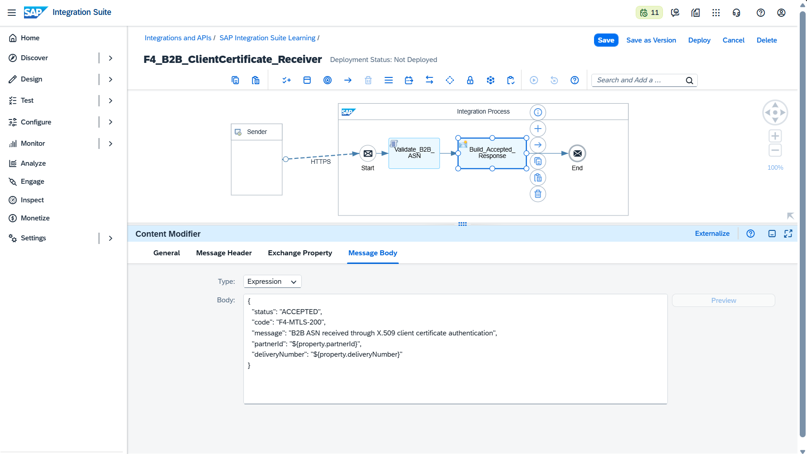
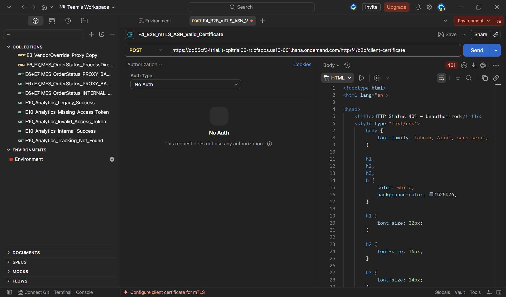
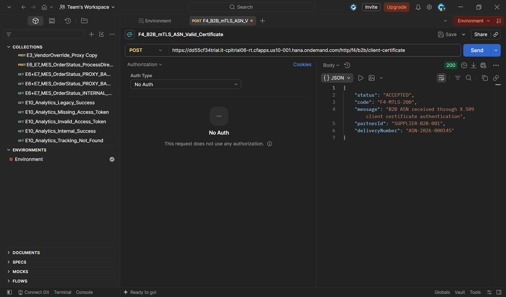
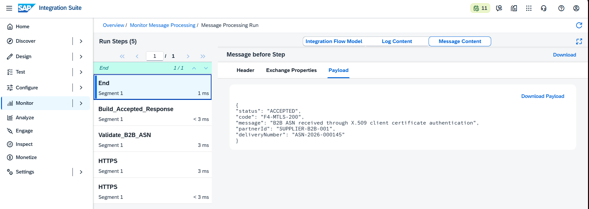
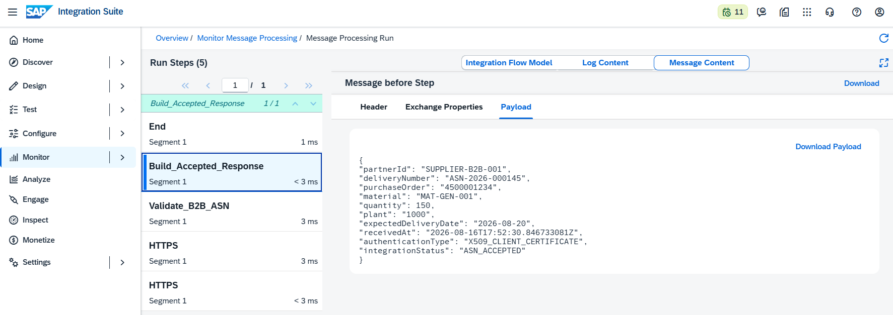
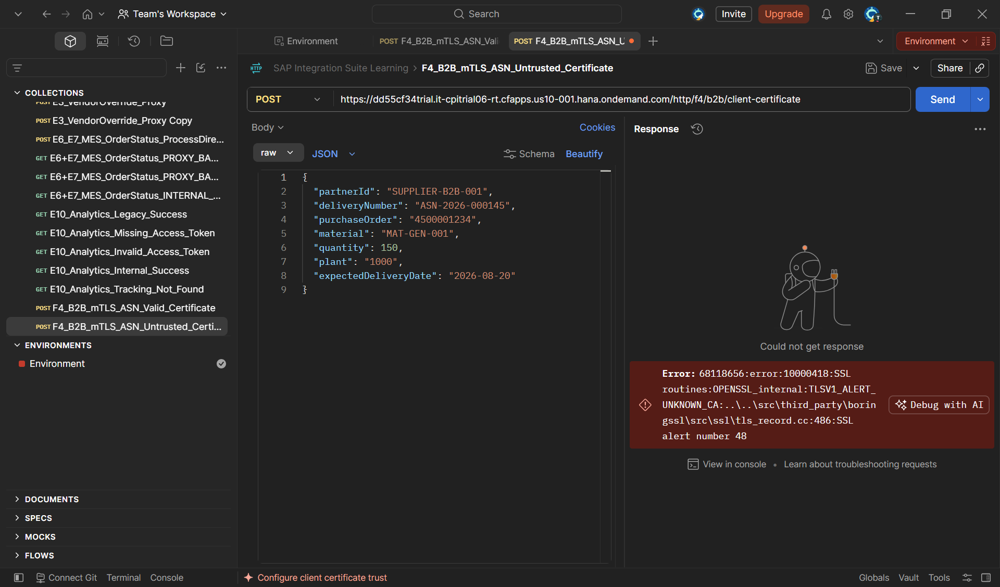

## 🔐 F4 — B2B Client Certificate Authentication e Mutual TLS

**Bloco:** F — Segurança Transversal  
**Cenário:** F4 — Security Material, Client Certificate Authentication e mTLS  
**Status:** ✅ Concluído e testado de ponta a ponta  
**Data de execução:** 16/08/2026  
**iFlow:** `F4_B2B_ClientCertificate_Receiver`  
**Service Instance:** `F4_B2B_mTLS_Instance`  
**Service Key:** `F4_B2B_ClientCertificate_Key`

---

### 📌 Contexto de Negócio

Este laboratório simula uma comunicação B2B na qual um fornecedor envia um **Advance Shipping Notification (ASN)** para o SAP Integration Suite antes da entrega física dos materiais vinculados a um pedido de compra.

Em um cenário produtivo, uma comunicação entre empresas não deve depender apenas de usuário e senha. O sistema parceiro precisa apresentar uma identidade técnica forte, verificável e vinculada a uma autorização específica. Para atender a esse requisito, o cenário utiliza um certificado cliente X.509 e autenticação por **mutual TLS**, também chamada de mTLS.

O parceiro B2B é simulado pelo Postman. O Postman apresenta um certificado cliente durante a negociação TLS, enquanto o endpoint HTTPS do Cloud Integration valida se o certificado é confiável e se está associado a uma Service Key autorizada com a role `ESBMessaging.send`.

Somente depois da autenticação e autorização no transporte o payload ASN chega ao iFlow para validação e processamento.

---

### 🎯 Objetivos

- Criar uma Service Instance exclusiva para o cenário F4.
- Criar uma Service Key do tipo Certificate.
- Extrair o certificado público e a chave privada da Service Key sem expor os valores.
- Gerar um arquivo PFX protegido por senha para uso no Postman.
- Configurar o certificado cliente para o host do runtime Cloud Integration.
- Criar um endpoint HTTPS protegido pela role `ESBMessaging.send`.
- Validar um payload ASN B2B com Groovy.
- Comprovar a rejeição da chamada sem certificado.
- Comprovar a rejeição TLS de um certificado autoassinado e não confiável.
- Comprovar o sucesso com o certificado válido e autorizado.
- Demonstrar que autenticação TLS ocorre antes da execução do iFlow.

---

### 🧠 Conceito: TLS comum e mutual TLS

Em uma chamada HTTPS convencional, o servidor apresenta um certificado e o cliente valida a identidade do servidor.

```text
Cliente
→ valida o certificado do servidor
→ estabelece conexão HTTPS
```

No mutual TLS, os dois lados apresentam identidade criptográfica:

```text
Servidor apresenta certificado ao cliente
Cliente apresenta certificado ao servidor
Ambos validam a cadeia de confiança
Conexão TLS é estabelecida
```

No cenário implementado:

```text
Postman
→ apresenta certificado cliente X.509
→ SAP Load Balancer valida a cadeia
→ Process Integration Runtime localiza a Service Key correspondente
→ role ESBMessaging.send autoriza o endpoint
→ iFlow recebe e processa o ASN
```

O PFX utilizado pelo Postman contém:

- certificado cliente;
- chave privada correspondente;
- cadeia adicional de certificados;
- proteção por passphrase.

A chave privada e o arquivo PFX são materiais sensíveis e não devem ser armazenados no GitHub.

---

### 🏗️ Arquitetura

```mermaid
flowchart LR
    A["B2B Supplier - Postman"] -->|"Client Certificate X.509"| B["SAP Load Balancer"]
    B --> C["Certificate Service Key"]
    C --> D["Role ESBMessaging.send"]
    D --> E["HTTPS Sender"]
    E --> F["Validate_B2B_ASN"]
    F --> G["Build_Accepted_Response"]
    G --> H["HTTP 200 - ASN Accepted"]
```



A autenticação ocorre antes da execução do Integration Flow. Certificados ausentes, não confiáveis ou não autorizados impedem o processamento do payload.

---

## 🏗️ Fase 1 — Isolamento da identidade técnica

Para não impactar credenciais e cenários anteriores, foi criada uma Service Instance exclusiva.

**Service**

```text
SAP Process Integration Runtime
```

**Plan**

```text
integration-flow
```

**Runtime Environment**

```text
Cloud Foundry
```

**Space**

```text
dev
```

**Instance Name**

```text
F4_B2B_mTLS_Instance
```

A separação evita que alterações de role, rotação ou exclusão do certificado afetem a Service Instance `cpi-iflow-key`, já utilizada por outros laboratórios.

---

## 🏗️ Fase 2 — Certificate Service Key

Na nova Service Instance, foi criada uma Service Key específica.

**Service Key Name**

```text
F4_B2B_ClientCertificate_Key
```

**Key Type**

```text
Certificate
```

**Role**

```text
ESBMessaging.send
```

**Validity**

```text
365 days
```

**Key Size**

```text
2048 bits
```

A Service Key gerou uma estrutura protegida contendo certificado, chave privada e dados técnicos de conexão. O arquivo JSON baixado não foi incluído no repositório nem usado como evidência, pois contém material criptográfico sensível.

---

## 🏗️ Fase 3 — Preparação segura do certificado cliente

### 3.1 Diretório temporário

Os arquivos foram mantidos fora do repositório Git, no diretório local:

```text
C:\Users\orlandos\OneDrive - Toledo do Brasil\SAP\Sap_Integration_Suite_Files\F4-mTLS-Temp
```

O diretório recebeu:

```text
F4_B2B_ClientCertificate_Key.json
F4_B2B_ClientCertificate.pem
F4_B2B_ClientCertificate_PrivateKey.pem
F4_B2B_ClientCertificate.pfx
```

### 3.2 Estrutura real do JSON

O JSON da Service Key possuía uma propriedade principal chamada `oauth`. Os campos foram acessados em:

```powershell
$serviceKey.oauth.certificate
```

```powershell
$serviceKey.oauth.key
```

O certificado e a chave privada foram gravados em arquivos PEM separados.

### 3.3 Geração do PFX sem privilégio administrativo

Como a máquina corporativa não permitia instalar OpenSSL com privilégio administrativo, foi utilizada a biblioteca Python `cryptography` instalada no perfil do usuário.

```powershell
python -m pip install --user cryptography
```

O script carregou a cadeia PEM, a chave privada e produziu um arquivo PFX protegido por senha. Foram identificados três certificados na cadeia e o arquivo final foi gerado com tamanho maior que zero.

> ⚠️ O JSON da Service Key, a chave privada, os arquivos PEM e o PFX não devem ser enviados ao GitHub, anexados à documentação ou exibidos em evidências.

---

## 🏗️ Fase 4 — Configuração do certificado no Postman

O PFX foi associado ao host do runtime do Cloud Integration.

**Host**

```text
dd55cf34trial.it-cpitrial06-rt.cfapps.us10-001.hana.ondemand.com
```

**Port**

```text
443
```

**PFX File**

```text
F4_B2B_ClientCertificate.pfx
```

A passphrase permaneceu mascarada. A configuração por host garante que o Postman apresente automaticamente o certificado quando uma conexão TLS é iniciada para o runtime.



A evidência demonstra o host, a porta, o PFX associado e a passphrase protegida, sem revelar a chave privada.

---

## 🏗️ Fase 5 — Implementação do iFlow

### 5.1 Identificação do artefato

**Name**

```text
F4_B2B_ClientCertificate_Receiver
```

**Description**

```text
Receives B2B advance shipping notifications using X.509 client certificate authentication.
```

### 5.2 HTTPS Sender

**Address**

```text
/f4/b2b/client-certificate
```

**Authorization**

```text
User Role
```

**User Role**

```text
ESBMessaging.send
```

**CSRF Protected**

```text
Disabled
```

O CSRF foi mantido desabilitado porque será estudado separadamente no cenário F5.

### 5.3 Estrutura do fluxo

```text
HTTPS Sender
→ Validate_B2B_ASN
→ Build_Accepted_Response
→ End
```



A evidência mostra o endpoint HTTPS, o Groovy de validação e o Content Modifier responsável pela resposta de sucesso.

---

## 💻 Fase 6 — Validação do payload ASN

### 6.1 Payload de entrada

```json
{
  "partnerId": "SUPPLIER-B2B-001",
  "deliveryNumber": "ASN-2026-000145",
  "purchaseOrder": "4500001234",
  "material": "MAT-GEN-001",
  "quantity": 150,
  "plant": "1000",
  "expectedDeliveryDate": "2026-08-20"
}
```

### 6.2 Groovy `Validate_B2B_ASN`

O script valida:

- JSON bem formado;
- payload em formato de objeto;
- presença dos campos obrigatórios;
- quantidade numérica;
- quantidade maior que zero.

Depois da validação, o script adiciona:

```text
receivedAt
```

```text
authenticationType = X509_CLIENT_CERTIFICATE
```

```text
integrationStatus = ASN_ACCEPTED
```

Código final:

```groovy
import com.sap.gateway.ip.core.customdev.util.Message
import groovy.json.JsonOutput
import groovy.json.JsonSlurper
import java.time.Instant

def Message processData(Message message) {
    def reader = message.getBody(java.io.Reader)
    def payload

    try {
        payload = new JsonSlurper().parse(reader)
    } catch (Exception exception) {
        throw new IllegalArgumentException(
            "Invalid JSON payload received from B2B partner."
        )
    }

    if (!(payload instanceof Map)) {
        throw new IllegalArgumentException(
            "The ASN payload must be a JSON object."
        )
    }

    def requiredFields = [
        "partnerId",
        "deliveryNumber",
        "purchaseOrder",
        "material",
        "quantity",
        "plant",
        "expectedDeliveryDate"
    ]

    def missingFields = requiredFields.findAll { field ->
        !payload.containsKey(field) ||
        payload[field] == null ||
        payload[field].toString().trim().isEmpty()
    }

    if (!missingFields.isEmpty()) {
        throw new IllegalArgumentException(
            "Missing or empty mandatory fields: ${missingFields.join(', ')}"
        )
    }

    def quantity

    try {
        quantity = new BigDecimal(payload.quantity.toString())
    } catch (Exception ignored) {
        throw new IllegalArgumentException(
            "Field quantity must be numeric."
        )
    }

    if (quantity <= 0) {
        throw new IllegalArgumentException(
            "Field quantity must be greater than zero."
        )
    }

    payload.quantity = quantity
    payload.receivedAt = Instant.now().toString()
    payload.authenticationType = "X509_CLIENT_CERTIFICATE"
    payload.integrationStatus = "ASN_ACCEPTED"

    message.setProperty(
        "partnerId",
        payload.partnerId.toString()
    )

    message.setProperty(
        "deliveryNumber",
        payload.deliveryNumber.toString()
    )

    message.setBody(
        JsonOutput.prettyPrint(
            JsonOutput.toJson(payload)
        )
    )

    message.setHeader(
        "Content-Type",
        "application/json"
    )

    return message
}
```

### 6.3 Resposta de sucesso

O Content Modifier utiliza as properties criadas pelo Groovy.

```json
{
  "status": "ACCEPTED",
  "code": "F4-MTLS-200",
  "message": "B2B ASN received through X.509 client certificate authentication",
  "partnerId": "${property.partnerId}",
  "deliveryNumber": "${property.deliveryNumber}"
}
```

---

## 🧪 Fase 7 — Testes de autenticação e confiança

### 7.1 Teste sem certificado cliente

A associação do certificado foi temporariamente removida do Postman. A requisição permaneceu com:

```text
Authorization: No Auth
```

O runtime respondeu:

```text
HTTP 401 Unauthorized
```



Retorno HTTPS:

```html
<!doctype html>
<html lang="en">
<head>
    <title>HTTP Status 401 – Unauthorized</title>
</head>
<body>
    <h1>HTTP Status 401 – Unauthorized</h1>
</body>
</html>
```

Interpretação:

```text
Authentication: No Auth
Client Certificate: Not presented
HTTP Status: 401 Unauthorized
Integration Flow Execution: Not started
ASN Payload Processing: Not executed
```

A rejeição ocorreu antes da execução do Integration Flow. Portanto, o erro não foi produzido pelo Groovy nem pelo payload ASN.

### 7.2 Teste com certificado válido

O PFX válido foi configurado novamente para o host do runtime. A requisição continuou usando:

```text
Authorization: No Auth
```

A única credencial apresentada foi o certificado cliente.

O resultado foi:

```text
HTTP 200 OK
```

```json
{
  "status": "ACCEPTED",
  "code": "F4-MTLS-200",
  "message": "B2B ASN received through X.509 client certificate authentication",
  "partnerId": "SUPPLIER-B2B-001",
  "deliveryNumber": "ASN-2026-000145"
}
```



A evidência mostra `No Auth`, retorno `200` e resposta de negócio. O certificado não aparece no body porque participa do handshake TLS, antes da criação da mensagem HTTP processada pelo iFlow.

### 7.3 Processamento interno bem-sucedido

O monitoramento confirmou a execução completa:

```text
HTTPS
→ Validate_B2B_ASN
→ Build_Accepted_Response
→ End
```



O Message Content no final do fluxo confirmou a resposta `F4-MTLS-200` antes do retorno ao Postman.

### 7.4 Payload validado e enriquecido

Após o Groovy, o payload continha os dados do ASN e os campos de integração adicionados pelo iFlow.



Conteúdo relevante:

```json
{
  "partnerId": "SUPPLIER-B2B-001",
  "deliveryNumber": "ASN-2026-000145",
  "purchaseOrder": "4500001234",
  "material": "MAT-GEN-001",
  "quantity": 150,
  "plant": "1000",
  "expectedDeliveryDate": "2026-08-20",
  "receivedAt": "2026-08-16T17:52:30.846733081Z",
  "authenticationType": "X509_CLIENT_CERTIFICATE",
  "integrationStatus": "ASN_ACCEPTED"
}
```

### 7.5 Teste com certificado não confiável

Para testar a confiança TLS, foi criado localmente um certificado autoassinado com uso estendido de Client Authentication. O certificado não foi associado a nenhuma Service Key e sua CA não era confiável para o load balancer SAP.

O Postman apresentou o PFX não confiável ao mesmo endpoint.

Resultado:

```text
TLSV1_ALERT_UNKNOWN_CA
SSL alert number 48
```



Interpretação:

```text
Authentication: X.509 Client Certificate
Certificate Status: Untrusted / Unknown CA
TLS Result: Handshake rejected
TLS Alert: UNKNOWN_CA
SSL Alert Number: 48
HTTP Status: Not generated
Integration Flow Execution: Not started
ASN Payload Processing: Not executed
```

Nesse teste não houve status HTTP porque o handshake TLS foi encerrado antes da criação da requisição HTTP.

---

### 🧪 Resumo Consolidado dos Testes

| Teste | Certificado cliente | Resultado | iFlow executado |
|---|---|---|---|
| Sem certificado | Não apresentado | `401 Unauthorized` | Não |
| Certificado não confiável | Autoassinado / Unknown CA | Handshake TLS rejeitado | Não |
| Certificado válido | Gerado pela Certificate Service Key | `200 OK` | Sim |

A comparação demonstra duas verificações distintas:

1. **Confiança TLS:** o certificado precisa pertencer a uma cadeia aceita pelo load balancer.
2. **Autorização:** o certificado válido precisa estar associado à Service Key e à role `ESBMessaging.send`.

---

### 🔍 Troubleshooting e Lições Aprendidas

#### 1. Campos do certificado aninhados em `oauth`

A primeira tentativa de extração utilizou:

```powershell
$serviceKey.certificate
```

O arquivo PEM resultou com zero bytes. A inspeção dos nomes das propriedades revelou que `certificate` e `key` estavam sob `oauth`.

Correção:

```powershell
$serviceKey.oauth.certificate
```

```powershell
$serviceKey.oauth.key
```

#### 2. OpenSSL indisponível na máquina corporativa

O OpenSSL não estava instalado e a instalação exigia credencial administrativa.

Solução:

```text
Python cryptography instalada com --user
```

Isso permitiu gerar e validar o PFX no perfil do usuário, sem instalação global.

#### 3. Senha invisível no terminal

O método `getpass` não exibe caracteres, pontos ou asteriscos. A ausência visual é comportamento esperado para proteger a senha.

#### 4. Senhas do PFX não coincidentes

A primeira execução falhou porque a senha e a confirmação eram diferentes. O script interrompeu a criação do PFX, evitando gerar um arquivo com senha desconhecida.

#### 5. Sem certificado gera HTTP 401

Sem certificado, a conexão HTTPS foi estabelecida, mas nenhuma identidade autorizada foi associada à chamada. O runtime retornou `401 Unauthorized`.

#### 6. Certificado não confiável falha antes do HTTP

O certificado autoassinado foi rejeitado com `UNKNOWN_CA`. Como o handshake TLS não foi concluído, não houve status HTTP nem Message Processing Log do iFlow.

#### 7. O certificado não aparece no JSON

O certificado é processado no transporte TLS. O body da API contém apenas a mensagem de negócio. A comprovação técnica depende da comparação controlada entre ausência, certificado inválido e certificado válido.

---

### 🧠 Decisões Técnicas

#### Service Instance exclusiva

A criação de `F4_B2B_mTLS_Instance` isolou roles, credenciais e ciclo de vida do certificado, evitando impacto nos cenários existentes.

#### Certificate Service Key gerada pela SAP

Foi utilizada uma chave do tipo Certificate para garantir compatibilidade com o runtime e com a cadeia de confiança esperada pelo load balancer.

#### No Auth no Postman

Os testes não utilizaram Basic Auth, Bearer Token ou API Key. Isso isolou a variável analisada: a presença do certificado cliente.

#### CSRF tratado separadamente

O endpoint F4 não utiliza CSRF. O tema será implementado no cenário F5 com token e sessão reais.

#### Materiais privados fora do GitHub

Os seguintes arquivos permanecem fora do repositório:

```text
Service Key JSON
Private Key PEM
Certificate PEM
PFX
Passwords
```

#### Testes negativos antes do processamento

A ausência e o certificado não confiável foram bloqueados antes do Groovy. Esse comportamento reduz superfície de ataque e evita que mensagens não autenticadas consumam o processamento de negócio.

---

### ✅ Conclusão

O cenário F4 demonstrou autenticação inbound B2B baseada em certificado X.509 e mutual TLS no SAP Integration Suite.

A implementação comprovou:

- criação isolada de Service Instance e Certificate Service Key;
- geração de material X.509;
- preparação segura de PEM e PFX;
- configuração do certificado cliente no Postman;
- endpoint HTTPS protegido por role;
- rejeição sem certificado;
- rejeição TLS de CA não confiável;
- aceitação do certificado válido;
- processamento do ASN somente após autenticação;
- validação e enriquecimento do payload com Groovy;
- ausência de credenciais HTTP adicionais no teste positivo.

O resultado final pode ser resumido assim:

```text
Sem certificado
→ 401 Unauthorized
```

```text
Certificado não confiável
→ TLS UNKNOWN_CA
```

```text
Certificado válido e autorizado
→ 200 OK
→ ASN_ACCEPTED
```

**Recursos praticados:** Security Material · Service Instance · Certificate Service Key · X.509 · PEM · PFX · Client Certificate Authentication · Mutual TLS · User Role · ESBMessaging.send · Groovy · Postman Certificates · TLS Trust Chain

**Cenário anterior:** [E10 — API Analytics: Monitoramento Operacional do MES Order Status](./25-e10-api-analytics.md)  
**Próximo cenário:** [F5 — CSRF Token Validation](./27-f5-csrf-token-validation.md)

---

### 🛠️ Ferramentas utilizadas

- **SAP BTP Cockpit**
- **SAP Integration Suite — Cloud Integration**
- **SAP Process Integration Runtime**
- **Postman**
- **Python**
- **cryptography**
- **PowerShell**
- **Visual Studio Code**
- **Git e GitHub**

---

### 👤 Autor / 📬 Contato

[](https://www.linkedin.com/in/orlando-caetano/)
[](https://github.com/OrlandoCaetano2026)

**Orlando Caetano**  
Especialista SAP • Integração • Inteligência Artificial  
Consultor SAP MM com know-how em PP, QM e WM

   

> 📌 Projeto de estudo e portfólio. Os cenários SAP MM, PP e QM são simulações educativas para prática de integração.
