## 🛡️ F5 — CSRF Token Validation em Alteração de Pedido de Compra SAP MM

**Bloco:** F — Segurança Transversal  
**Cenário:** F5 — CSRF Token Validation  
**Status:** ✅ Concluído e testado de ponta a ponta  
**Data de execução:** 16/08/2026  
**iFlow:** `F5_MM_PurchaseOrder_CSRF_Protected_API`  
**Endpoint:** `/f5/mm/purchase-order`

---

### 📌 Contexto de Negócio

Este laboratório simula uma aplicação de Compras alterando dados de um item de pedido de compra SAP MM. A operação modifica quantidade, preço líquido e data de entrega, portanto precisa ser protegida não apenas por autenticação, mas também por um token CSRF vinculado à sessão ativa.

O processo utiliza um pedido de compra genérico:

```text
Purchase Order: 4500001234
Item: 00010
Material: MAT-GEN-001
Plant: 1000
```

A alteração simulada aumenta a quantidade de `100` para `150` unidades e o preço líquido de `350.00` para `400.00 BRL`, motivada por aumento da necessidade de produção.

O consumidor primeiro solicita um token CSRF por meio de uma chamada GET com o header `X-CSRF-Token: Fetch`. O runtime retorna um token e cookies de sessão. Somente um POST que apresente o token e os cookies correspondentes pode alcançar o Integration Flow e processar a alteração.

> 📌 O F5 foi implementado de forma isolada com Basic Authentication para facilitar o entendimento de token, cookie e sessão. Um cenário futuro de hardening combinará mTLS e CSRF na mesma operação protegida.

---

### 🎯 Objetivos

- Habilitar a proteção CSRF no HTTPS Sender.
- Buscar um token CSRF real no runtime do Cloud Integration.
- Preservar os cookies vinculados à sessão.
- Comprovar que Basic Authentication não substitui CSRF.
- Rejeitar POST sem token CSRF.
- Rejeitar POST com token inválido.
- Rejeitar token válido sem os cookies da sessão.
- Aceitar a alteração somente com token e sessão válidos.
- Validar o payload de alteração do pedido de compra com Groovy.
- Demonstrar os caminhos `GET_FETCH`, `POST_CHANGE` e `INVALID_METHOD`.
- Retornar respostas funcionais `200`, `403` e `405`.
- Diferenciar rejeição no runtime de erro ou processamento dentro do iFlow.

---

### 🧠 Conceito: autenticação, sessão e proteção CSRF

Basic Authentication comprova a credencial técnica utilizada para acessar o endpoint. Entretanto, uma operação modificadora também precisa provar que foi iniciada dentro de uma sessão válida e consciente.

```text
Basic Authentication
→ autentica o consumidor
```

```text
CSRF Token + Session Cookie
→ protegem a operação modificadora dentro da sessão
```

A validação do POST ocorre nesta ordem:

```text
1. Runtime valida Basic Authentication
2. Runtime valida X-CSRF-Token
3. Runtime relaciona o token aos cookies da sessão
4. Somente depois o iFlow é iniciado
5. Router direciona a operação POST
6. Groovy valida o payload SAP MM
7. Content Modifier produz a resposta funcional
```

Se o token estiver ausente, inválido ou desacoplado da sessão, o runtime retorna `403 Forbidden` antes de criar um Message Processing Log para o iFlow.

---

### 🏗️ Arquitetura

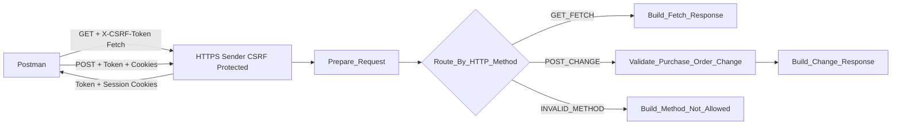

A chamada especial de Fetch é tratada pelo runtime CSRF antes do caminho funcional GET. Um GET comum, sem `X-CSRF-Token: Fetch`, é encaminhado ao iFlow e permite visualizar a rota `GET_FETCH` no monitoramento.

---

## 🏗️ Fase 1 — Criação e configuração do iFlow

### 1.1 Identificação do artefato

**Name**

```text
F5_MM_PurchaseOrder_CSRF_Protected_API
```

**Description**

```text
Protects SAP MM purchase order changes using session-bound CSRF token validation.
```

### 1.2 HTTPS Sender

**Address**

```text
/f5/mm/purchase-order
```

**Authorization**

```text
User Role
```

**User Role**

```text
ESBMessaging.send
```

**CSRF Protected**

```text
Enabled
```

O flag `CSRF Protected` habilita a validação nativa do runtime para operações modificadoras como POST, PUT, PATCH e DELETE.

### 1.3 Estrutura do processo

```text
HTTPS Sender
→ Prepare_Request
→ Route_By_HTTP_Method
   ├── GET_FETCH
   │   → Build_Fetch_Response
   │   → End
   ├── POST_CHANGE
   │   → Validate_Purchase_Order_Change
   │   → Build_Change_Response
   │   → End
   └── INVALID_METHOD
       → Build_Method_Not_Allowed
       → End
```

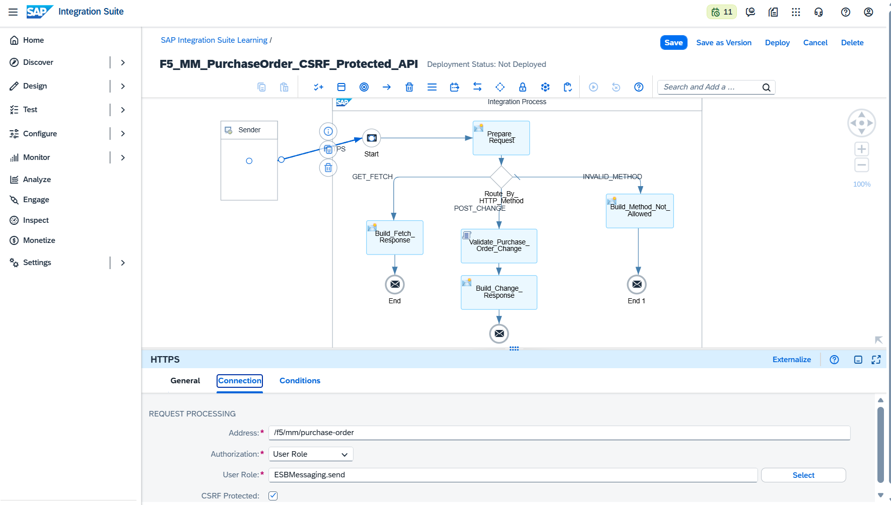

A evidência mostra o flag CSRF ativo, o endpoint HTTPS e as três rotas implementadas.

---

## 🏗️ Fase 2 — Preparação da mensagem e roteamento

### 2.1 `Prepare_Request`

O Content Modifier registra o método HTTP recebido para facilitar rastreabilidade e diagnóstico.

**Exchange Property**

```text
requestMethod
```

**Source Type**

```text
Expression
```

**Source Value**

```text
${header.CamelHttpMethod}
```

**Data Type**

```text
java.lang.String
```

### 2.2 `Route_By_HTTP_Method`

O Router separa os caminhos GET, POST e método inválido.

**GET_FETCH — Expression Type**

```text
Non-XML
```

**GET_FETCH — Condition**

```text
${header.CamelHttpMethod} = 'GET'
```

**POST_CHANGE — Expression Type**

```text
Non-XML
```

**POST_CHANGE — Condition**

```text
${header.CamelHttpMethod} = 'POST'
```

**INVALID_METHOD**

```text
Default Route
```

O tipo `Non-XML` é obrigatório porque as condições utilizam Camel Simple, não XPath.

---

## 🏗️ Fase 3 — Caminho GET

### 3.1 Fetch real do token CSRF

A requisição especial utiliza:

```http
GET /http/f5/mm/purchase-order
X-CSRF-Token: Fetch
```

A autenticação permanece Basic Auth. O runtime responde antes de executar o caminho funcional GET do iFlow.

Headers relevantes retornados:

```text
x-csrf-token
set-cookie: JSESSIONID
set-cookie: __VCAP_ID_META__
set-cookie: __VCAP_ID__
```

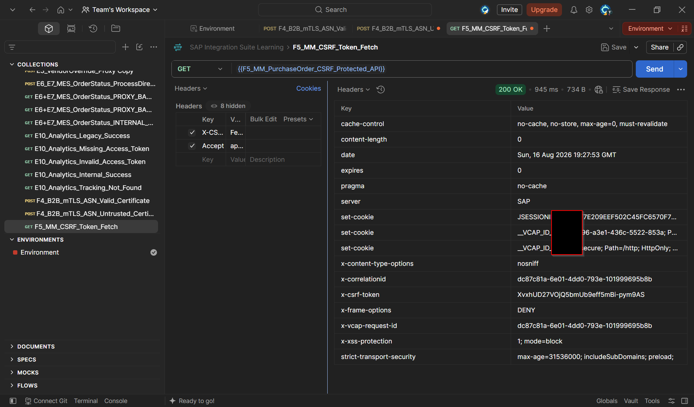

Os valores de token, cookies, correlation ID e request ID foram parcialmente mascarados na evidência. Os nomes dos headers e a existência da sessão permanecem visíveis.

O Postman salva o token em uma variável de ambiente por meio do Post-response Script:

```javascript
const csrfToken = pm.response.headers.get("x-csrf-token");

if (csrfToken) {
    pm.environment.set("f5_csrf_token", csrfToken);
    console.log("F5 CSRF token saved successfully.");
} else {
    console.error("X-CSRF-Token was not returned.");
}
```

O Postman administra os cookies no Cookie Jar do domínio.

### 3.2 `Build_Fetch_Response`

O GET comum, sem o header especial `X-CSRF-Token: Fetch`, entra no iFlow e percorre `GET_FETCH`.

**HTTP Response Code**

```text
200
```

**Content-Type**

```text
application/json
```

**Body**

```json
{
  "status": "CSRF_TOKEN_FETCH_READY",
  "code": "F5-CSRF-FETCH-200",
  "message": "Use the X-CSRF-Token response header and session cookie in the modifying request."
}
```

A chamada GET comum retornou a resposta funcional configurada.

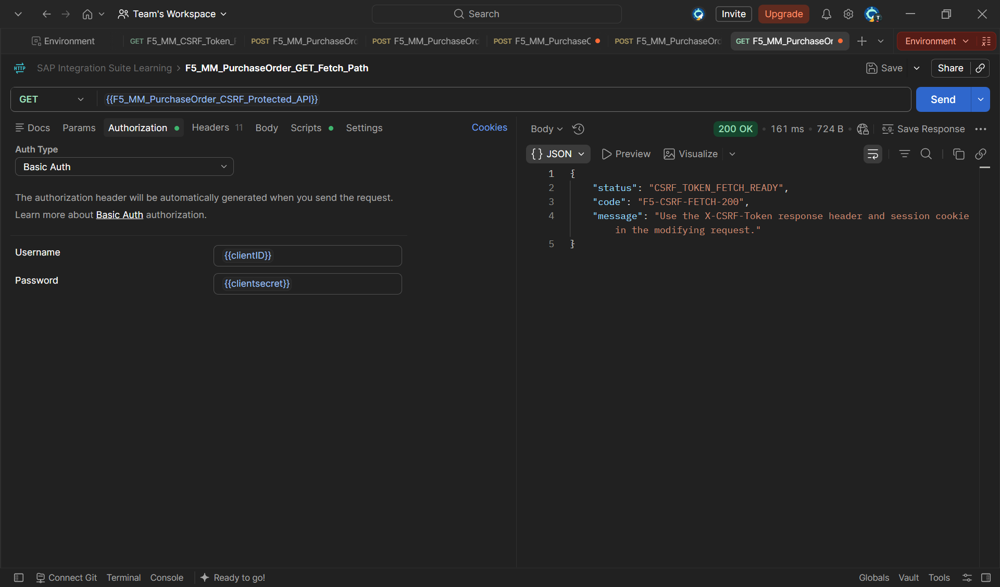

O monitoramento mostrou somente os seis steps do caminho GET:

```text
HTTPS
→ Prepare_Request
→ Route_By_HTTP_Method
→ GET_FETCH
→ Build_Fetch_Response
→ End
```

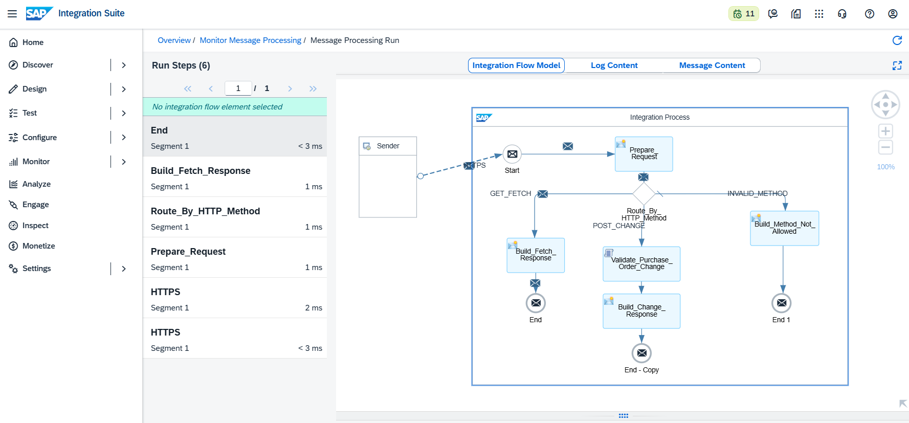

O Message Content confirmou o payload interno antes do retorno.

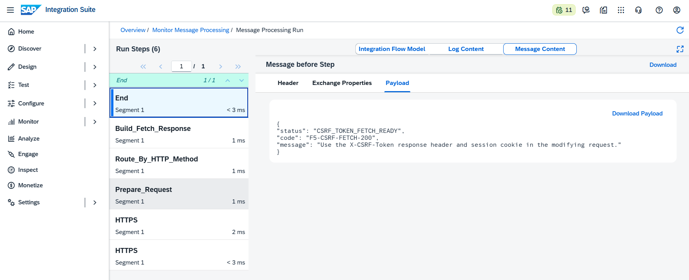

---

## 💻 Fase 4 — Caminho POST e validação SAP MM

### 4.1 Payload de alteração

```json
{
  "purchaseOrder": "4500001234",
  "item": "00010",
  "material": "MAT-GEN-001",
  "plant": "1000",
  "previousQuantity": 100,
  "newQuantity": 150,
  "previousNetPrice": 350.00,
  "newNetPrice": 400.00,
  "currency": "BRL",
  "deliveryDate": "2026-08-25",
  "changeReason": "PRODUCTION_REQUIREMENT_INCREASE",
  "changedBy": "MM-PURCHASING-USER"
}
```

### 4.2 `Validate_Purchase_Order_Change`

O Groovy é executado somente depois que o runtime aceita autenticação, token e cookies.

Validações implementadas:

- JSON bem formado;
- objeto JSON;
- campos obrigatórios;
- quantidades numéricas;
- preços numéricos;
- nova quantidade maior que zero;
- novo preço líquido maior que zero.

Enriquecimentos:

```text
changedAt
securityControl = CSRF_TOKEN_VALIDATED
integrationStatus = PURCHASE_ORDER_CHANGE_ACCEPTED
```

Código final:

```groovy
import com.sap.gateway.ip.core.customdev.util.Message
import groovy.json.JsonOutput
import groovy.json.JsonSlurper
import java.time.Instant

def Message processData(Message message) {

    def reader = message.getBody(java.io.Reader)
    def payload

    try {
        payload = new JsonSlurper().parse(reader)
    } catch (Exception exception) {
        throw new IllegalArgumentException(
            "Invalid JSON payload received for purchase order change."
        )
    }

    if (!(payload instanceof Map)) {
        throw new IllegalArgumentException(
            "The purchase order change payload must be a JSON object."
        )
    }

    def requiredFields = [
        "purchaseOrder",
        "item",
        "material",
        "plant",
        "previousQuantity",
        "newQuantity",
        "previousNetPrice",
        "newNetPrice",
        "currency",
        "deliveryDate",
        "changeReason",
        "changedBy"
    ]

    def missingFields = requiredFields.findAll { field ->
        !payload.containsKey(field) ||
        payload[field] == null ||
        payload[field].toString().trim().isEmpty()
    }

    if (!missingFields.isEmpty()) {
        throw new IllegalArgumentException(
            "Missing or empty mandatory fields: ${missingFields.join(', ')}"
        )
    }

    def previousQuantity
    def newQuantity
    def previousNetPrice
    def newNetPrice

    try {
        previousQuantity =
            new BigDecimal(payload.previousQuantity.toString())

        newQuantity =
            new BigDecimal(payload.newQuantity.toString())

        previousNetPrice =
            new BigDecimal(payload.previousNetPrice.toString())

        newNetPrice =
            new BigDecimal(payload.newNetPrice.toString())
    } catch (Exception ignored) {
        throw new IllegalArgumentException(
            "Quantity and price fields must contain valid numeric values."
        )
    }

    if (newQuantity <= 0) {
        throw new IllegalArgumentException(
            "The new purchase order quantity must be greater than zero."
        )
    }

    if (newNetPrice <= 0) {
        throw new IllegalArgumentException(
            "The new net price must be greater than zero."
        )
    }

    payload.previousQuantity = previousQuantity
    payload.newQuantity = newQuantity
    payload.previousNetPrice = previousNetPrice
    payload.newNetPrice = newNetPrice
    payload.changedAt = Instant.now().toString()
    payload.securityControl = "CSRF_TOKEN_VALIDATED"
    payload.integrationStatus = "PURCHASE_ORDER_CHANGE_ACCEPTED"

    message.setProperty(
        "purchaseOrder",
        payload.purchaseOrder.toString()
    )

    message.setProperty(
        "item",
        payload.item.toString()
    )

    message.setProperty(
        "newQuantity",
        payload.newQuantity.toString()
    )

    message.setProperty(
        "newNetPrice",
        payload.newNetPrice.toString()
    )

    message.setBody(
        JsonOutput.prettyPrint(
            JsonOutput.toJson(payload)
        )
    )

    message.setHeader(
        "Content-Type",
        "application/json"
    )

    return message
}
```

### 4.3 `Build_Change_Response`

**HTTP Response Code**

```text
200
```

**Content-Type**

```text
application/json
```

**Body Type**

```text
Expression
```

**Body**

```json
{
  "status": "UPDATED",
  "code": "F5-CSRF-200",
  "message": "Purchase order change accepted with a valid CSRF token and session.",
  "purchaseOrder": "${property.purchaseOrder}",
  "item": "${property.item}",
  "newQuantity": "${property.newQuantity}",
  "newNetPrice": "${property.newNetPrice}"
}
```

---

## 🧪 Fase 5 — Testes negativos de CSRF

### 5.1 POST sem token CSRF

O POST foi enviado com Basic Authentication e cookies existentes, mas com `X-CSRF-Token` desativado.

Resultado:

```text
HTTP 403 Forbidden
```

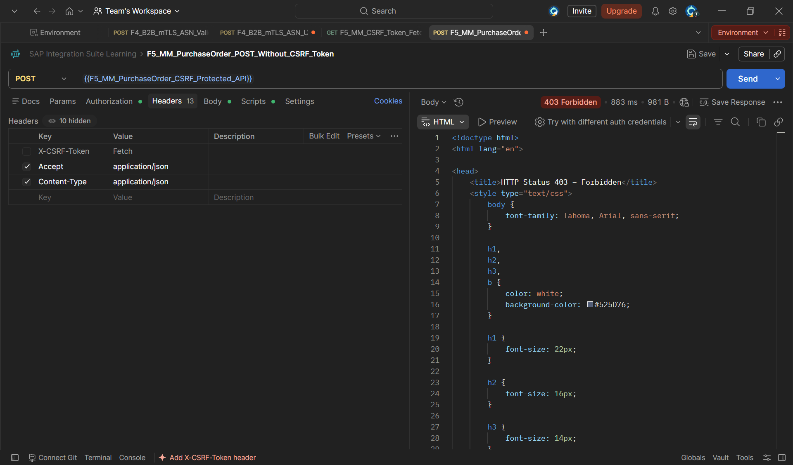

A mensagem não apareceu no Monitor do CPI porque o runtime bloqueou a chamada antes do Integration Flow.

### 5.2 POST com token inválido

Foi enviado:

```text
X-CSRF-Token: invalid-csrf-token-f5
```

Resultado:

```text
HTTP 403 Forbidden
```

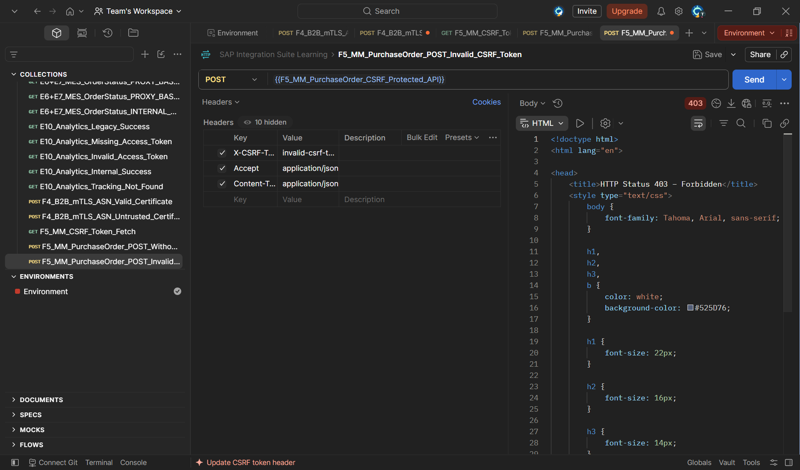

A presença de cookies não compensou o token inválido.

### 5.3 Remoção dos cookies de sessão

Para provar o vínculo entre token e sessão, os cookies do domínio foram removidos do Cookie Jar:

```text
JSESSIONID
__VCAP_ID_META__
__VCAP_ID__
```

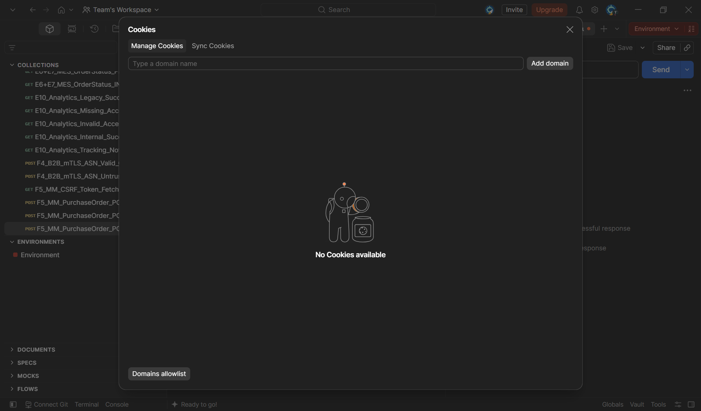

### 5.4 Token válido sem cookie

O POST foi enviado com `{{f5_csrf_token}}`, mas sem os cookies correspondentes.

Resultado:

```text
HTTP 403 Forbidden
```

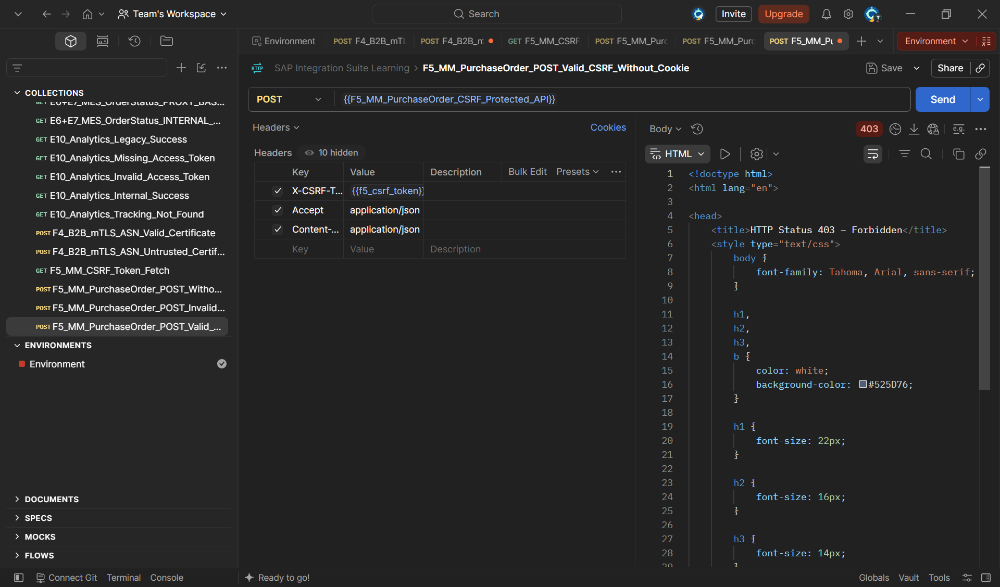

Esse teste comprova que o token não é uma credencial independente. O token pertence ao contexto de sessão no qual foi emitido.

---

## ✅ Fase 6 — POST com token e sessão válidos

Após um novo Fetch, o Postman recebeu um novo token e recriou os cookies. O POST foi enviado com:

```text
Basic Authentication válida
X-CSRF-Token: {{f5_csrf_token}}
JSESSIONID da mesma sessão
Cookies __VCAP da mesma sessão
```

Resultado:

```text
HTTP 200 OK
```

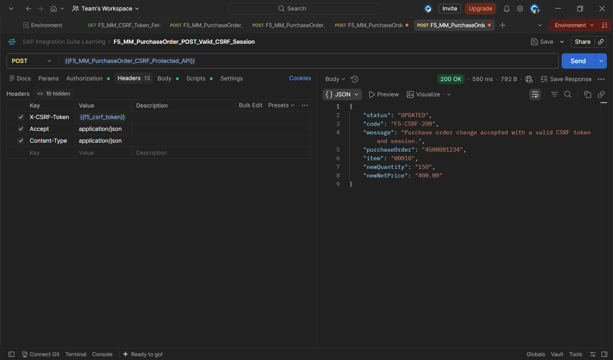

Resposta:

```json
{
  "status": "UPDATED",
  "code": "F5-CSRF-200",
  "message": "Purchase order change accepted with a valid CSRF token and session.",
  "purchaseOrder": "4500001234",
  "item": "00010",
  "newQuantity": "150",
  "newNetPrice": "400.00"
}
```

### 6.1 Caminho POST executado

O Monitor apresentou sete steps:

```text
HTTPS
→ Prepare_Request
→ Route_By_HTTP_Method
→ POST_CHANGE
→ Validate_Purchase_Order_Change
→ Build_Change_Response
→ End
```

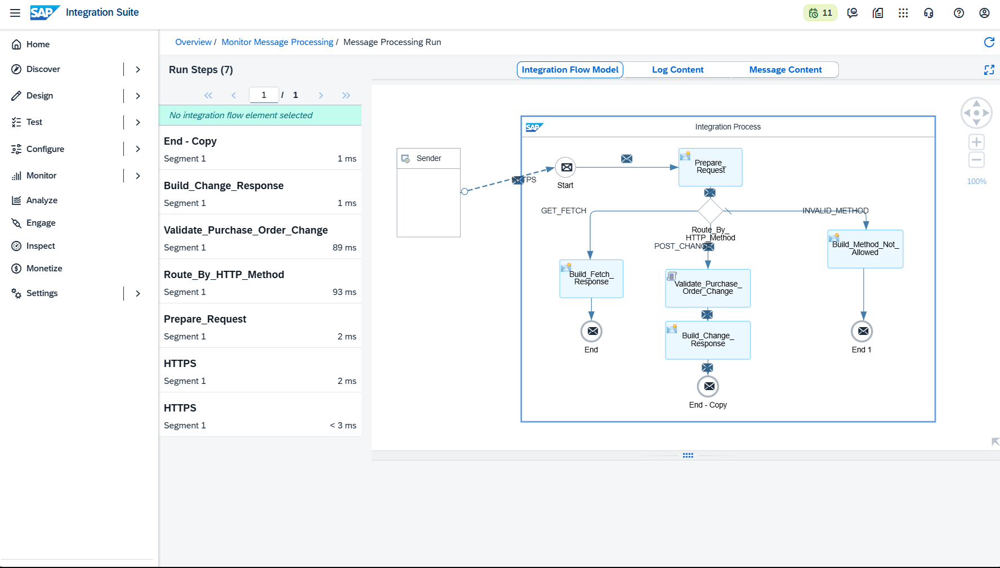

### 6.2 Payload validado

Antes do `Build_Change_Response`, o payload continha os dados da alteração e os campos de segurança:

```text
securityControl = CSRF_TOKEN_VALIDATED
integrationStatus = PURCHASE_ORDER_CHANGE_ACCEPTED
changedAt = timestamp UTC
```

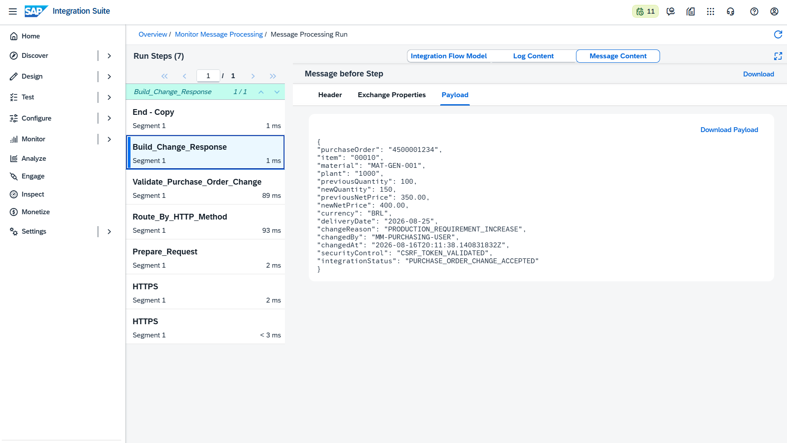

### 6.3 Resposta interna

Antes do End, o Message Content mostrou a resposta final construída pelo iFlow.

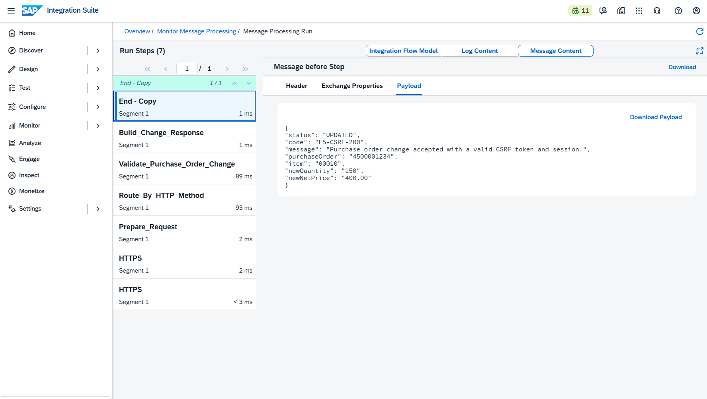

---

## 🏗️ Fase 7 — Método não permitido

### 7.1 `Build_Method_Not_Allowed`

**HTTP Response Code**

```text
405
```

**Content-Type**

```text
application/json
```

**Body**

```json
{
  "status": "METHOD_NOT_ALLOWED",
  "code": "F5-CSRF-405",
  "message": "Only GET for CSRF token fetch and POST for purchase order change are supported."
}
```

### 7.2 PUT com CSRF válido

Como PUT é modificador, o teste utilizou token e cookies válidos. Assim, a chamada passou pela proteção CSRF e chegou à rota default.

Resultado:

```text
HTTP 405 Method Not Allowed
```

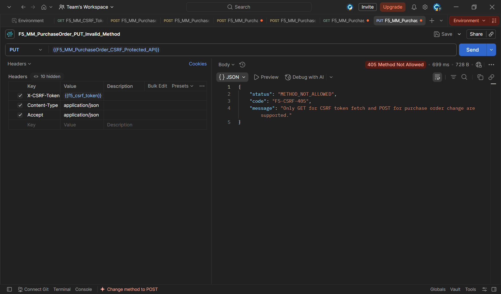

### 7.3 Caminho `INVALID_METHOD`

O Monitor comprovou:

```text
HTTPS
→ Prepare_Request
→ Route_By_HTTP_Method
→ INVALID_METHOD
→ Build_Method_Not_Allowed
→ End
```

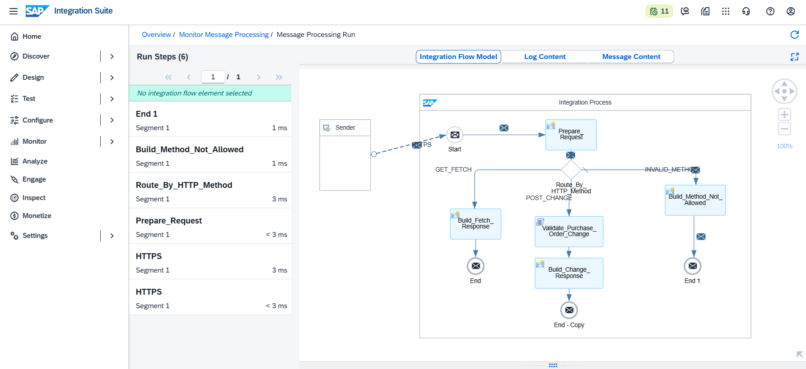

### 7.4 Resposta interna 405

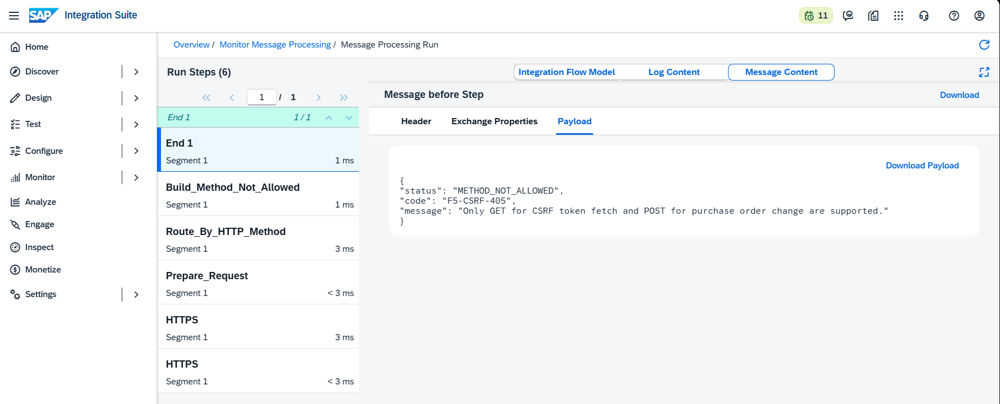

---

### 🧪 Resumo Consolidado dos Testes

| Teste | Basic Auth | Token CSRF | Cookies da sessão | Resultado | iFlow executado |
|---|---|---|---|---|---|
| Fetch do token | Válida | `Fetch` | Criados | `200` | Não, tratado pelo runtime |
| POST sem token | Válida | Ausente | Presentes | `403` | Não |
| POST token inválido | Válida | Inválido | Presentes | `403` | Não |
| POST token válido sem cookie | Válida | Válido | Ausentes | `403` | Não |
| POST token e sessão válidos | Válida | Válido | Presentes | `200` | Sim, `POST_CHANGE` |
| GET comum | Válida | Ausente | Irrelevante | `200` | Sim, `GET_FETCH` |
| PUT com CSRF válido | Válida | Válido | Presentes | `405` | Sim, `INVALID_METHOD` |

---

### 🔍 Troubleshooting e Lições Aprendidas

#### 1. Fetch retorna headers e body vazio

A chamada com `X-CSRF-Token: Fetch` foi atendida pelo runtime antes do Integration Flow. O resultado apresentou `content-length: 0`, token e cookies, sem executar `Build_Fetch_Response`.

#### 2. Testes 403 não aparecem no Monitor

POST sem token, com token inválido ou sem cookie foi bloqueado pelo HTTPS Sender antes do iFlow. Por isso, nenhuma execução foi criada no Monitor Message Processing.

#### 3. Token válido não funciona sem sessão

O token está vinculado aos cookies emitidos no mesmo Fetch. Remover `JSESSIONID` e cookies `__VCAP` torna o token inutilizável para a operação modificadora.

#### 4. Router interpretado como XPath

No primeiro POST aceito pelo CSRF, o iFlow retornou `500` com:

```text
XPathException: expected "<name>", found "{"
```

Causa: as condições Camel Simple estavam configuradas como XML/XPath.

Correção:

```text
Expression Type: Non-XML
```

```text
${header.CamelHttpMethod} = 'GET'
${header.CamelHttpMethod} = 'POST'
```

#### 5. GET Fetch e GET funcional são diferentes

```text
GET + X-CSRF-Token: Fetch
→ runtime emite token e cookies
→ iFlow não executa
```

```text
GET sem Fetch
→ iFlow executa GET_FETCH
→ Build_Fetch_Response retorna JSON
```

#### 6. PUT precisa passar pelo CSRF antes do Router

Para visualizar `INVALID_METHOD`, foi necessário enviar PUT com token e cookies válidos. Sem CSRF válido, o runtime retornaria `403` antes do Router.

#### 7. Valores sensíveis devem ser mascarados

Tokens, cookies, correlation IDs e request IDs foram parcialmente ocultados nas evidências. Valores completos não devem ser publicados no GitHub.

---

### 🧠 Decisões Técnicas

#### Cenário SAP MM

A alteração de pedido de compra representa uma operação modificadora realista, adequada para demonstrar CSRF.

#### F5 isolado de mTLS

O laboratório utiliza Basic Authentication para reduzir variáveis durante o estudo de token e sessão. A combinação mTLS + CSRF ficará para hardening futuro.

#### Proteção nativa no HTTPS Sender

A geração e validação de token não foram implementadas manualmente. O runtime gerencia o controle CSRF, reduzindo risco de implementação incorreta.

#### Cookie Jar do Postman

O Postman administra automaticamente os cookies. A remoção manual foi usada somente para comprovar o vínculo da sessão.

#### Três rotas funcionais

O iFlow foi desenhado para demonstrar GET, POST e Default Route, permitindo estudar o Router além do requisito mínimo de CSRF.

---

### ✅ Conclusão

O cenário F5 demonstrou proteção CSRF real em uma operação de alteração de pedido de compra SAP MM.

A implementação comprovou:

- emissão real de token CSRF;
- criação de cookies de sessão;
- vínculo entre token e sessão;
- rejeição de POST sem token;
- rejeição de token inválido;
- rejeição de token válido sem cookie;
- aceitação somente com token e sessão correspondentes;
- validação de dados do pedido de compra;
- enriquecimento do payload com estado de segurança;
- roteamento GET, POST e método inválido;
- tratamento funcional `405 Method Not Allowed`;
- bloqueio antecipado antes do processamento do iFlow.

O comportamento final pode ser resumido assim:

```text
Basic Auth sem CSRF
→ 403 Forbidden
```

```text
Token válido sem sessão
→ 403 Forbidden
```

```text
Token + sessão válidos
→ POST_CHANGE
→ F5-CSRF-200
→ PURCHASE_ORDER_CHANGE_ACCEPTED
```

**Recursos praticados:** CSRF Protected HTTPS Sender · X-CSRF-Token · Session Cookies · JSESSIONID · Basic Authentication · Router · Camel Simple · Groovy · Content Modifier · SAP MM Purchase Order Change · HTTP 200 · HTTP 403 · HTTP 405

**Cenário anterior:** [F4 — B2B Client Certificate Authentication e Mutual TLS](./26-f4-b2b-client-certificate-mtls.md)  
**Próximo cenário:** [F6 — API Threat Protection](./28-f6-api-threat-protection.md)

---

### 🛠️ Ferramentas utilizadas

- **SAP Integration Suite — Cloud Integration**
- **Postman**
- **SAP BTP Process Integration Runtime**
- **Groovy**
- **Visual Studio Code**
- **Git e GitHub**

---

### 👤 Autor / 📬 Contato

[](https://www.linkedin.com/in/orlando-caetano/)
[](https://github.com/OrlandoCaetano2026)

**Orlando Caetano**  
Especialista SAP • Integração • Inteligência Artificial  
Consultor SAP MM com know-how em PP, QM e WM

   

> 📌 Projeto de estudo e portfólio. Os cenários SAP MM, PP e QM são simulações educativas para prática de integração.
