## 🛡️ F6 — API Threat Protection para Confirmação de Fornecedor SAP MM

**Bloco:** F — Segurança Transversal  
**Cenário:** F6 — API Threat Protection  
**Status:** ✅ Concluído e testado de ponta a ponta  
**Data de execução:** 17/08/2026  
**Backend iFlow:** `F6_MM_SupplierConfirmation_Backend`  
**API Proxy:** `F6_MM_SupplierConfirmation_ThreatProtection_Proxy`  
**Documento:** `28-f6-api-threat-protection.md`

---

### 📌 Contexto de Negócio

Este laboratório simula o recebimento de uma confirmação de fornecedor relacionada a um pedido de compra SAP MM. O fornecedor informa quantidades confirmadas, preços líquidos e datas de entrega de itens do pedido.

O serviço aceita mensagens JSON e XML, mas não deve confiar apenas na autenticação do consumidor. Um consumidor autenticado também pode enviar uma estrutura excessivamente profunda, arrays ou listas infladas, strings desproporcionais ou conteúdo compatível com padrões de injeção.

Por esse motivo, o API Management foi colocado na frente do backend Cloud Integration para validar o conteúdo antes que a mensagem alcance o processamento interno.

```text
Fornecedor / Postman
→ SAP API Management
→ JSON, XML e Regular Expression Protection
→ autenticação técnica APIM → CPI
→ backend SAP MM
```

O objeto de negócio utilizado foi:

```text
Purchase Order: 4500001234
Supplier: SUPPLIER-1000
Plant: 1000
Currency: BRL
```

---

### 🎯 Objetivos

- Criar um backend Cloud Integration capaz de receber JSON e XML.
- Expor o backend por um API Proxy com recursos separados `/json` e `/xml`.
- Manter as credenciais do backend protegidas em Key Value Map.
- Impedir que os sufixos públicos `/json` e `/xml` sejam enviados ao endpoint CPI.
- Validar profundidade, quantidade de elementos e comprimento de strings em JSON.
- Validar profundidade, filhos e comprimento de texto em XML.
- Detectar padrões suspeitos em campos de negócio JSON e XML.
- Comprovar que mensagens rejeitadas não alcançam o backend.
- Preservar o processamento de mensagens legítimas.
- Padronizar erros de Regex Protection em `400 Bad Request`.
- Ocultar nomes internos de policies, regex e detalhes do runtime.
- Manter um correlation ID na resposta segura.

---

## 🧠 Conceitos de segurança aplicados

### Defesa em profundidade

Autenticação e autorização respondem quem pode chamar uma API. Threat Protection analisa o conteúdo apresentado por esse consumidor.

```text
API Key, OAuth ou mTLS
→ identidade e autorização
```

```text
Quota e Spike Arrest
→ volume e velocidade de chamadas
```

```text
JSON/XML Threat Protection
→ complexidade estrutural do payload
```

```text
Regular Expression Protection
→ padrões suspeitos em conteúdo selecionado
```

A SAP posiciona API Management como uma camada para segurança, governança e proteção de backends, incluindo JSON Threat Protection, XML Threat Protection, validação e políticas de controle de tráfego.

Referência oficial: [API Management — SAP Help Portal](https://help.sap.com/docs/integration-suite/isuite-integrations-and-apis/api-management)

### Limitação importante

Regular Expression Protection é uma camada complementar. A policy não substitui:

- validação por schema;
- validação funcional no backend;
- parametrização de comandos de banco de dados;
- escaping contextual de saída;
- princípio do menor privilégio;
- autenticação e autorização;
- limite global de tamanho da requisição;
- Web Application Firewall quando exigido pela arquitetura.

O backend nunca deve construir SQL mediante concatenação direta de valores recebidos do consumidor.

---

## 🏗️ Arquitetura final

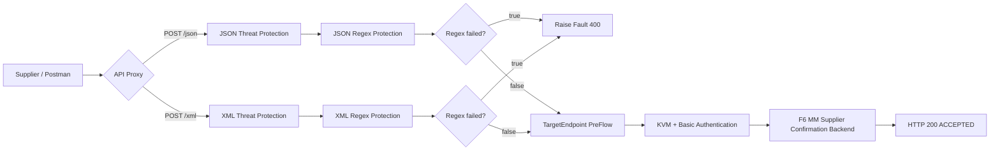
```mermaid
flowchart LR
    A["Supplier / Postman"] --> B{"API Proxy"}
    B -->|"POST /json"| C["JSON Threat Protection"]
    C --> D["JSON Regex Protection"]
    B -->|"POST /xml"| E["XML Threat Protection"]
    E --> F["XML Regex Protection"]
    D --> G{"Regex failed?"}
    F --> H{"Regex failed?"}
    G -->|"true"| I["Raise Fault 400"]
    H -->|"true"| I
    G -->|"false"| J["TargetEndpoint PreFlow"]
    H -->|"false"| J
    J --> K["KVM + Basic Authentication"]
    K --> L["F6 MM Supplier Confirmation Backend"]
    L --> M["HTTP 200 ACCEPTED"]
```

---

# 1. Backend Cloud Integration

## 1.1 Identificação

**Name**

```text
F6_MM_SupplierConfirmation_Backend
```

**ID**

```text
F6_MM_SupplierConfirmation_Backend
```

**Description**

```text
Processes SAP MM supplier confirmations after API threat protection validation.
```

## 1.2 Endpoint HTTPS

**Address**

```text
/f6/mm/supplier-confirmation
```

**Authorization**

```text
User Role
```

**User Role**

```text
ESBMessaging.send
```

**CSRF Protected**

```text
Disabled
```

O CSRF foi mantido desabilitado porque o objetivo do F6 era isolar proteção estrutural e proteção de conteúdo. CSRF foi praticado separadamente no F5.

## 1.3 Estrutura do iFlow

```text
HTTPS Sender
→ Validate_Supplier_Confirmation
→ Build_Accepted_Response
→ End
```

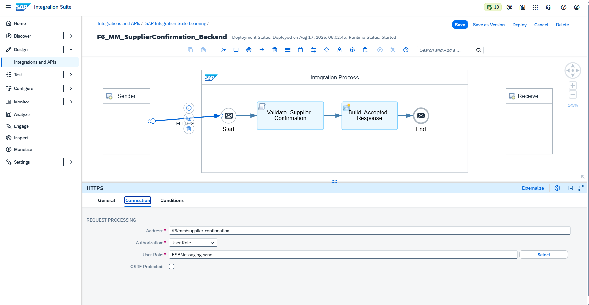

## 1.4 Groovy `ValidateSupplierConfirmation.groovy`

O script:

1. lê o body como String;
2. identifica JSON ou XML pelo Content-Type ou primeiro caractere;
3. valida que o payload não está vazio;
4. interpreta JSON com `JsonSlurper`;
5. interpreta XML com `XmlSlurper`;
6. extrai `supplierId` e `purchaseOrder`;
7. exige pedido com exatamente dez dígitos;
8. cria properties de rastreabilidade;
9. preserva o body original.

```groovy
import com.sap.gateway.ip.core.customdev.util.Message
import groovy.json.JsonSlurper
import groovy.util.XmlSlurper
import java.time.Instant

def Message processData(Message message) {

    String body = message.getBody(String)
    String contentType =
        message.getHeader("Content-Type", String) ?: ""

    if (!body || body.trim().isEmpty()) {
        throw new IllegalArgumentException(
            "Supplier confirmation payload cannot be empty."
        )
    }

    String payloadFormat
    String supplierId
    String purchaseOrder

    if (
        contentType.toLowerCase().contains("json") ||
        body.trim().startsWith("{")
    ) {
        payloadFormat = "JSON"
        def payload

        try {
            payload = new JsonSlurper().parseText(body)
        } catch (Exception exception) {
            throw new IllegalArgumentException(
                "Invalid JSON supplier confirmation payload."
            )
        }

        if (!(payload instanceof Map)) {
            throw new IllegalArgumentException(
                "The JSON supplier confirmation must be an object."
            )
        }

        supplierId =
            payload.supplier?.supplierId?.toString()?.trim()

        purchaseOrder =
            payload.purchaseOrder?.toString()?.trim()

    } else if (
        contentType.toLowerCase().contains("xml") ||
        body.trim().startsWith("<")
    ) {
        payloadFormat = "XML"
        def payload

        try {
            payload = new XmlSlurper(
                false,
                false
            ).parseText(body)
        } catch (Exception exception) {
            throw new IllegalArgumentException(
                "Invalid XML supplier confirmation payload."
            )
        }

        supplierId =
            payload.supplier.supplierId.text()?.trim()

        purchaseOrder =
            payload.purchaseOrder.text()?.trim()

    } else {
        throw new IllegalArgumentException(
            "Unsupported payload format. Use JSON or XML."
        )
    }

    if (!supplierId) {
        throw new IllegalArgumentException(
            "Field supplierId is mandatory."
        )
    }

    if (!purchaseOrder) {
        throw new IllegalArgumentException(
            "Field purchaseOrder is mandatory."
        )
    }

    if (!(purchaseOrder ==~ /\d{10}/)) {
        throw new IllegalArgumentException(
            "Field purchaseOrder must contain exactly 10 digits."
        )
    }

    message.setProperty("supplierId", supplierId)
    message.setProperty("purchaseOrder", purchaseOrder)
    message.setProperty("payloadFormat", payloadFormat)
    message.setProperty(
        "securityValidation",
        "APIM_THREAT_PROTECTION_PASSED"
    )
    message.setProperty(
        "processedAt",
        Instant.now().toString()
    )

    return message
}
```

## 1.5 Resposta do backend

```json
{
  "status": "ACCEPTED",
  "code": "F6-THREAT-200",
  "message": "Supplier confirmation accepted after API threat protection validation.",
  "supplierId": "${property.supplierId}",
  "purchaseOrder": "${property.purchaseOrder}",
  "payloadFormat": "${property.payloadFormat}",
  "securityValidation": "${property.securityValidation}",
  "processedAt": "${property.processedAt}"
}
```

## 1.6 Baselines diretos

O JSON válido respondeu `200 OK` diretamente no CPI.

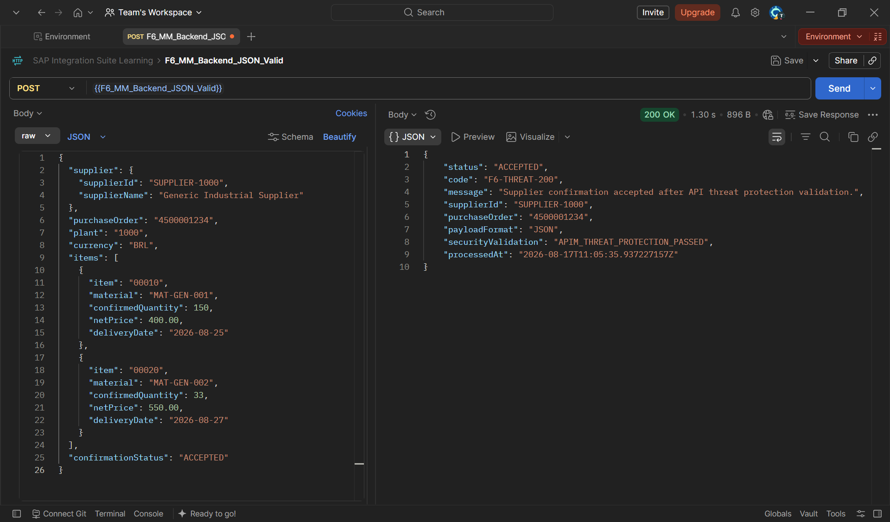

O XML válido também respondeu `200 OK`, com `payloadFormat: XML`.

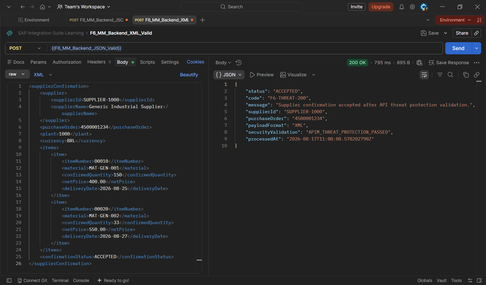

Esses testes estabeleceram o comportamento do backend antes das policies.

---

# 2. API Proxy

## 2.1 Identificação

**Name**

```text
F6_MM_SupplierConfirmation_ThreatProtection_Proxy
```

**Title**

```text
F6 SAP MM Supplier Confirmation Threat Protection API
```

**Short Text**

```text
Protects SAP MM supplier confirmation payloads against JSON, XML, and content-level threats.
```

**API Base Path**

```text
/v1/f6/mm/supplier-confirmation
```

**Resources**

```text
POST /json
POST /xml
```

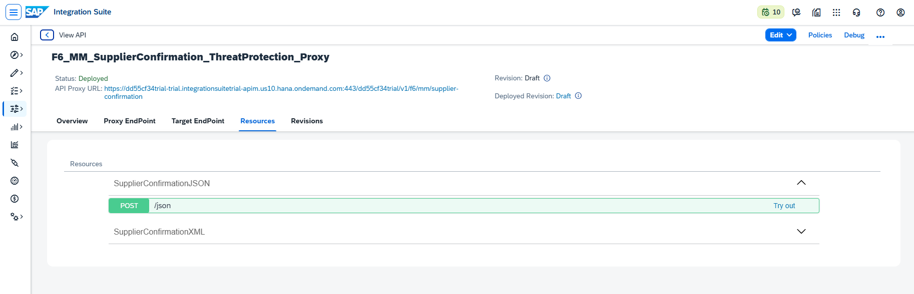

## 2.2 TargetEndpoint PreFlow

O backend exige Basic Authentication. A credencial não foi colocada no Proxy XML nem enviada pelo consumidor. O TargetEndpoint recupera os dados de uma KVM e cria o header técnico.

Ordem:

```text
1. Set-F6-Backend-Path
2. Get-F6-Backend-UserID
3. Get-F6-Backend-Password
4. Add-F6-Backend-Basic-Auth
```

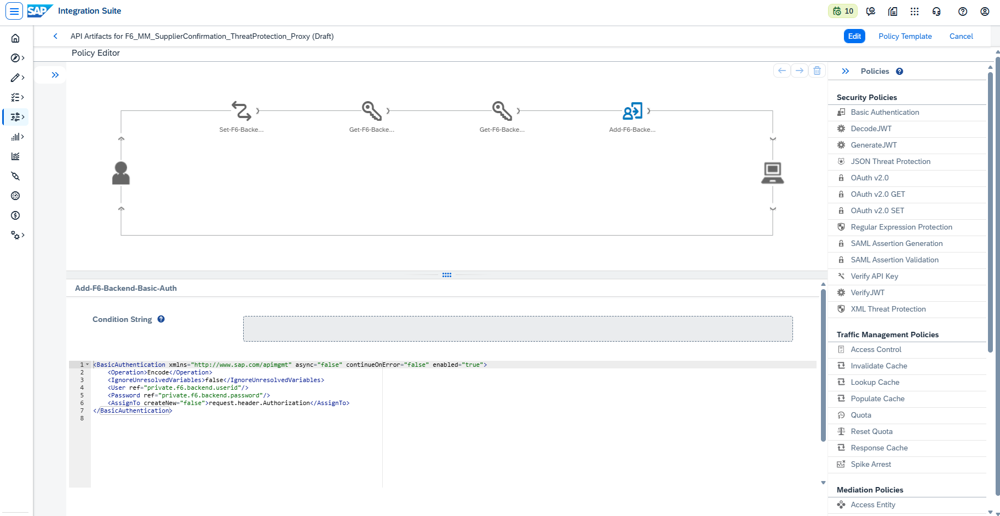

### `Set-F6-Backend-Path`

```xml
<AssignMessage xmlns="http://www.sap.com/apimgmt" async="false" continueOnError="false" enabled="true">
    <AssignVariable>
        <Name>target.copy.pathsuffix</Name>
        <Value>false</Value>
    </AssignVariable>
    <IgnoreUnresolvedVariables>true</IgnoreUnresolvedVariables>
    <AssignTo createNew="false" type="request"/>
</AssignMessage>
```

Essa policy impede que `/json` ou `/xml` seja anexado ao endpoint CPI.

### KVM UserID

```xml
<KeyValueMapOperations xmlns="http://www.sap.com/apimgmt" async="false" continueOnError="false" enabled="true" mapIdentifier="KVM_D1_Backend_Credentials">
    <Get assignTo="private.f6.backend.userid">
        <Key>
            <Parameter>UserID</Parameter>
        </Key>
    </Get>
</KeyValueMapOperations>
```

### KVM Password

```xml
<KeyValueMapOperations xmlns="http://www.sap.com/apimgmt" async="false" continueOnError="false" enabled="true" mapIdentifier="KVM_D1_Backend_Credentials">
    <Get assignTo="private.f6.backend.password">
        <Key>
            <Parameter>Password</Parameter>
        </Key>
    </Get>
</KeyValueMapOperations>
```

### Basic Authentication

```xml
<BasicAuthentication xmlns="http://www.sap.com/apimgmt" async="false" continueOnError="false" enabled="true">
    <Operation>Encode</Operation>
    <IgnoreUnresolvedVariables>false</IgnoreUnresolvedVariables>
    <User ref="private.f6.backend.userid"/>
    <Password ref="private.f6.backend.password"/>
    <AssignTo createNew="false">request.header.Authorization</AssignTo>
</BasicAuthentication>
```

## 2.3 Baseline pelo Proxy

O JSON válido atravessou o Proxy antes das policies de Threat Protection e retornou `200 OK`.

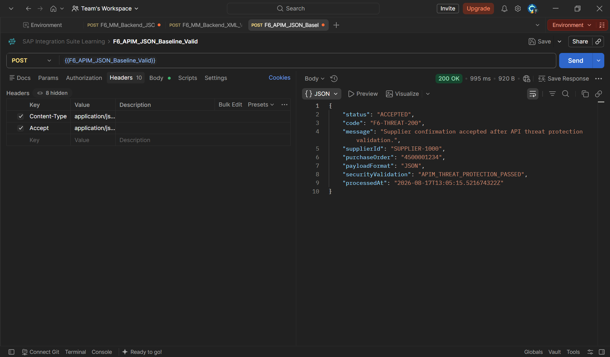

---

# 3. JSON Threat Protection

A policy foi anexada exclusivamente ao Conditional Flow `json`, no Incoming Request.

Referência oficial: [JSON Threat Protection — SAP Help Portal](https://help.sap.com/docs/integration-suite/isuite-integrations-and-apis/json-threat-protection)

## 3.1 Configuração

```xml
<JSONThreatProtection xmlns="http://www.sap.com/apimgmt" async="false" continueOnError="false" enabled="true">
    <ArrayElementCount>10</ArrayElementCount>
    <ContainerDepth>6</ContainerDepth>
    <ObjectEntryCount>15</ObjectEntryCount>
    <ObjectEntryNameLength>40</ObjectEntryNameLength>
    <Source>request</Source>
    <StringValueLength>200</StringValueLength>
</JSONThreatProtection>
```

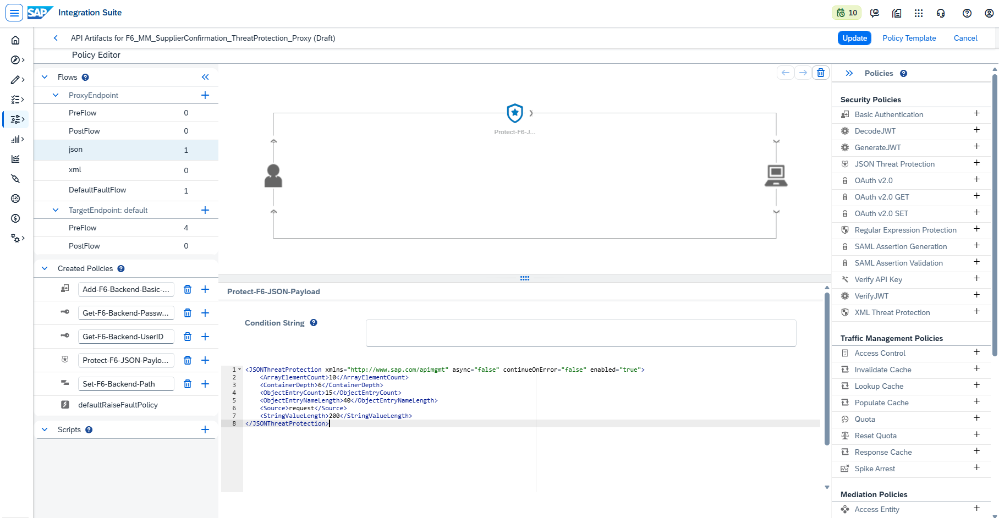

## 3.2 Significado dos limites

- `ArrayElementCount = 10`: cada array aceita no máximo dez elementos.
- `ContainerDepth = 6`: limita objetos e arrays aninhados.
- `ObjectEntryCount = 15`: limita propriedades por objeto.
- `ObjectEntryNameLength = 40`: limita o tamanho do nome de propriedade.
- `StringValueLength = 200`: limita strings individuais.
- `Source = request`: analisa a mensagem de entrada.
- `continueOnError = false`: falhas estruturais encerram imediatamente o fluxo.

A SAP informa que JSON Threat Protection limita arrays, profundidade, quantidade de entradas, nomes e strings, e deve ser usada em operações modificadoras como POST ou PUT.

## 3.3 Regressão legítima

O JSON válido continuou retornando `200 OK` depois da policy.

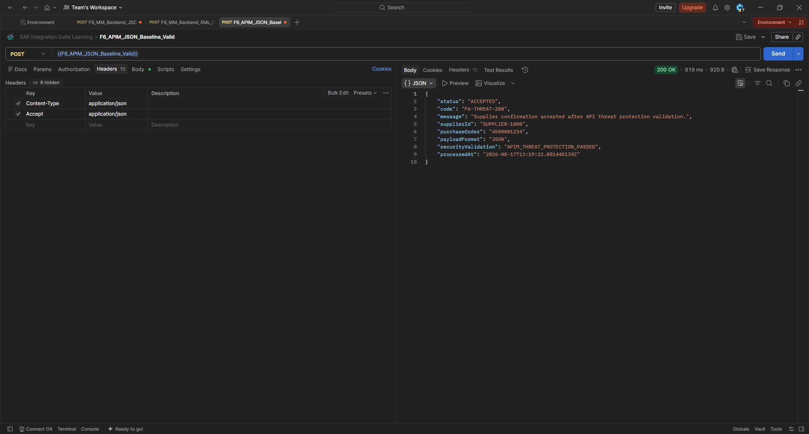

## 3.4 Profundidade excessiva

O teste com estrutura profundamente aninhada foi rejeitado com:

```text
Exceeded container depth
```

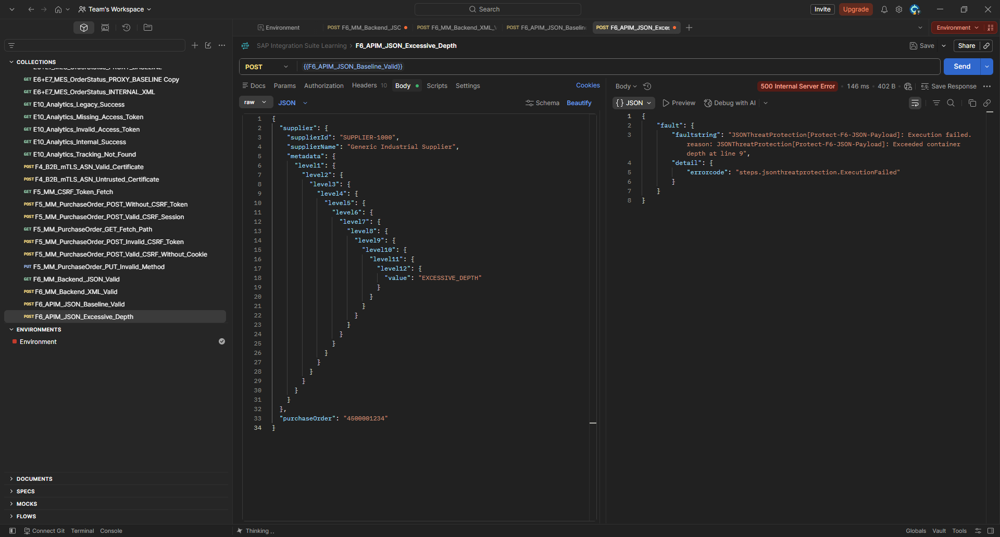

## 3.5 Array acima do limite

Um array com 11 itens ultrapassou `ArrayElementCount = 10`.

```text
Exceeded array element count
```

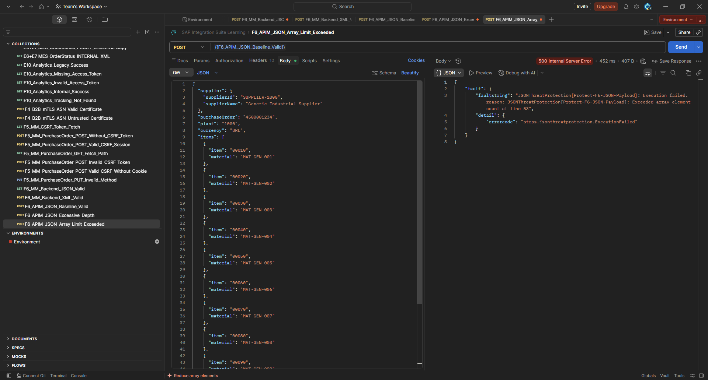

## 3.6 String acima do limite

O `supplierName` com mais de 200 caracteres foi bloqueado.

```text
Exceeded string value length
```

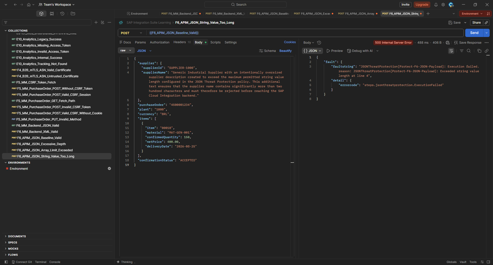

---

# 4. XML Threat Protection

A policy foi anexada exclusivamente ao Conditional Flow `xml`.

Referência oficial: [XML Threat Protection — SAP Help Portal](https://help.sap.com/docs/integration-suite/isuite-integrations-and-apis/xml-threat-protection)

## 4.1 Configuração final

```xml
<XMLThreatProtection xmlns="http://www.sap.com/apimgmt" async="false" continueOnError="false" enabled="true">
    <NameLimits>
        <Element>50</Element>
        <Attribute>40</Attribute>
        <NamespacePrefix>20</NamespacePrefix>
        <ProcessingInstructionTarget>20</ProcessingInstructionTarget>
    </NameLimits>
    <Source>request</Source>
    <StructureLimits>
        <NodeDepth>8</NodeDepth>
        <AttributeCountPerElement>5</AttributeCountPerElement>
        <NamespaceCountPerElement>3</NamespaceCountPerElement>
        <ChildCount includeComment="true" includeElement="true" includeProcessingInstruction="true" includeText="true">20</ChildCount>
    </StructureLimits>
    <ValueLimits>
        <Text>300</Text>
        <Attribute>100</Attribute>
        <NamespaceURI>200</NamespaceURI>
        <Comment>200</Comment>
        <ProcessingInstructionData>200</ProcessingInstructionData>
    </ValueLimits>
</XMLThreatProtection>
```

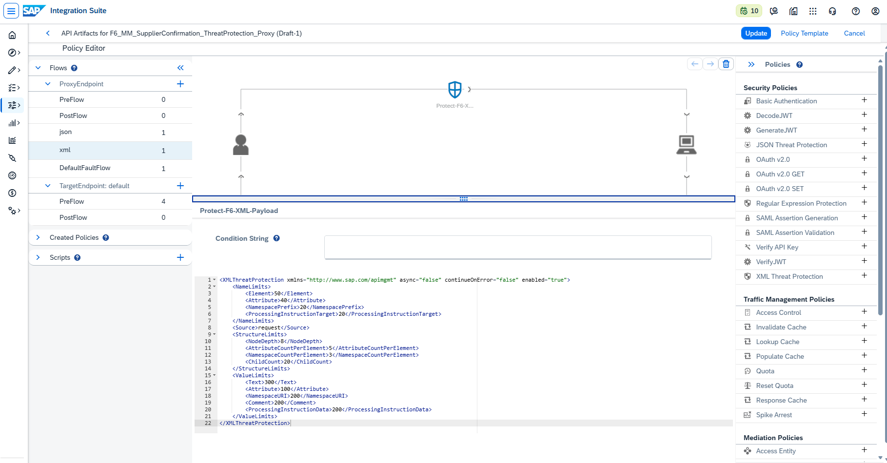

A SAP documenta que `ChildCount` pode explicitar se comentários, elementos, processing instructions e text nodes entram na contagem. Essa definição explícita também resolveu o erro de schema encontrado durante a configuração.

## 4.2 Regressão legítima

O XML válido foi aceito e identificado como `payloadFormat: XML`.

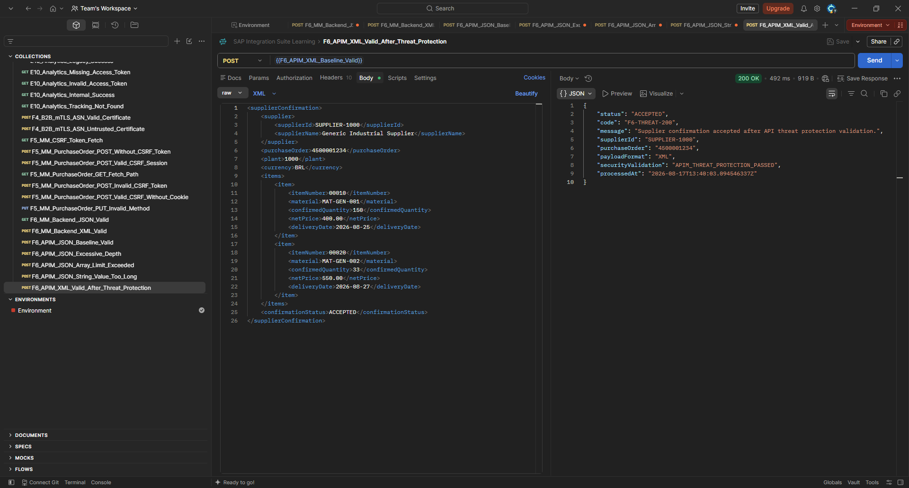

## 4.3 Profundidade excessiva

A estrutura acima de oito níveis foi rejeitada.

```text
Node depth exceeded 8
```

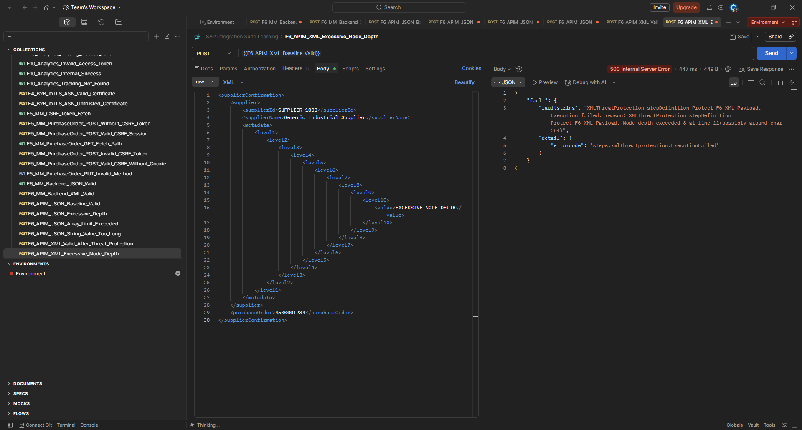

## 4.4 Excesso de filhos

O elemento `<items>` com 21 filhos ultrapassou `ChildCount = 20`.

```text
Children count exceeded 20
```

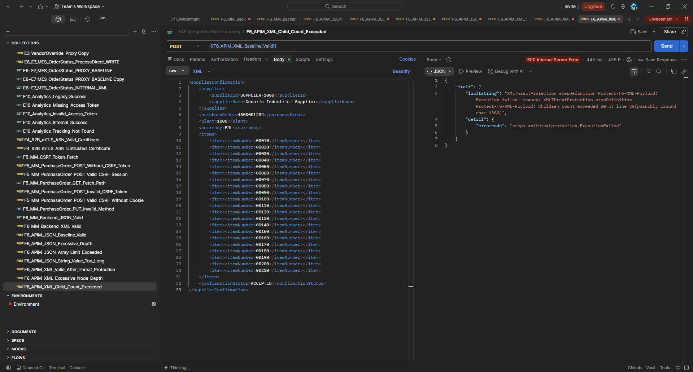

## 4.5 Texto acima do limite

Um `supplierName` acima de 300 caracteres foi bloqueado.

```text
Text length exceeded 300
```

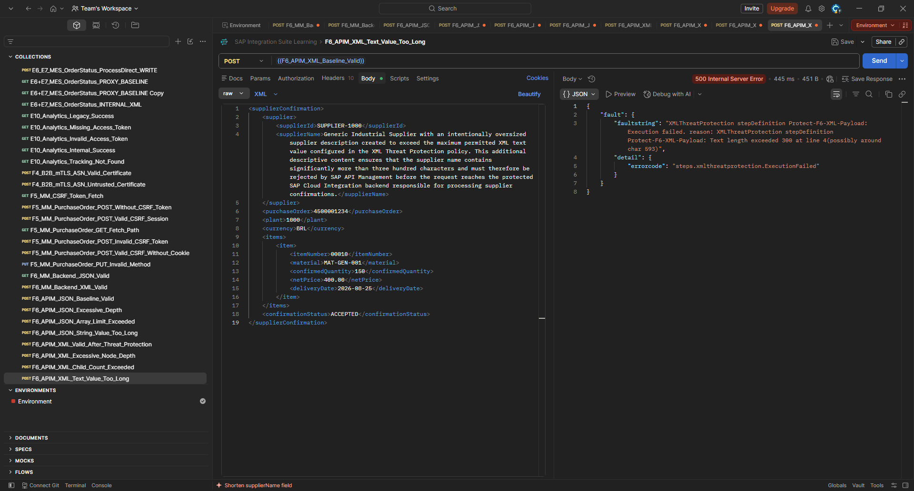

---

# 5. Regular Expression Protection

A policy procura padrões suspeitos em campos específicos do payload. A SAP permite análise de URI, query parameters, headers, variables, JSONPath e XPath, usando padrões compatíveis com `java.util.regex`.

Referência oficial: [Regular Expression Protection — SAP Help Portal](https://help.sap.com/docs/integration-suite/isuite-integrations-and-apis/regular-expression-protection)

## 5.1 JSON Regex Protection

O campo selecionado foi:

```text
$.supplier.supplierName
```

A policy final utiliza padrões para comandos SQL e conteúdo semelhante a script.

```xml
<RegularExpressionProtection xmlns="http://www.sap.com/apimgmt" async="false" continueOnError="true" enabled="true">
    <IgnoreUnresolvedVariables>false</IgnoreUnresolvedVariables>
    <Source>request</Source>
    <JSONPayload>
        <JSONPath>
            <Expression>$.supplier.supplierName</Expression>
            <Pattern>(?i).*((drop\s+table)|(delete\s+from)|(insert\s+into)|(update\s+.+\s+set)|(shutdown)|(&lt;script[^&gt;]*&gt;)).*</Pattern>
        </JSONPath>
    </JSONPayload>
</RegularExpressionProtection>
```

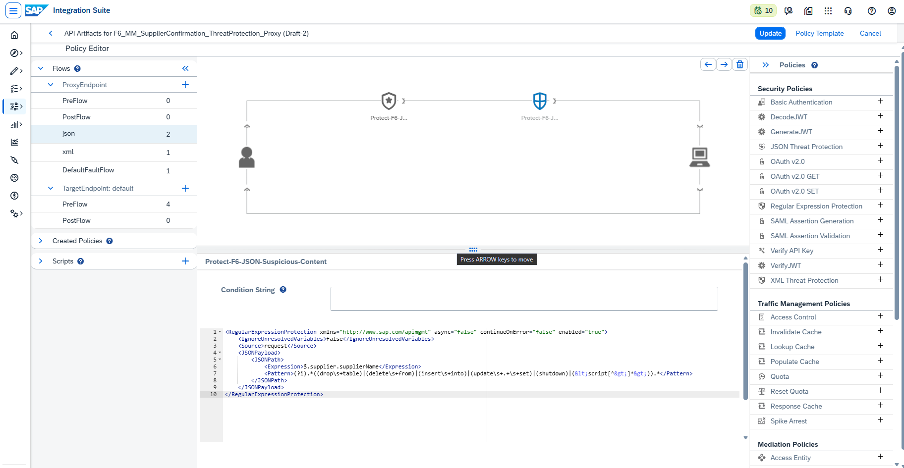

## 5.2 XML Regex Protection

O campo selecionado foi:

```text
/supplierConfirmation/supplier/supplierName/text()
```

A policy XML foi reduzida durante o troubleshooting para provar a detecção de `DELETE` no XPath e depois usada na validação final.

```xml
<RegularExpressionProtection xmlns="http://www.sap.com/apimgmt" async="false" continueOnError="true" enabled="true">
    <IgnoreUnresolvedVariables>false</IgnoreUnresolvedVariables>
    <Source>request</Source>
    <XMLPayload>
        <Namespaces/>
        <XPath>
            <Expression>/supplierConfirmation/supplier/supplierName/text()</Expression>
            <Type>string</Type>
            <Pattern>(.*)(DELETE)(.*)</Pattern>
        </XPath>
    </XMLPayload>
</RegularExpressionProtection>
```

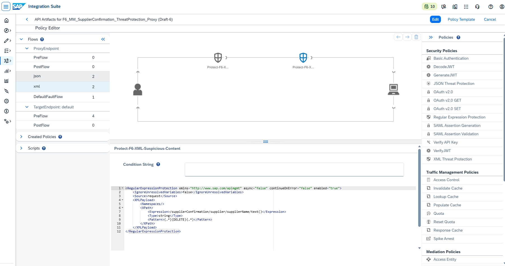

## 5.3 SQL suspeito em JSON

```text
Generic Supplier DROP TABLE suppliers
```

A policy detectou a ameaça.

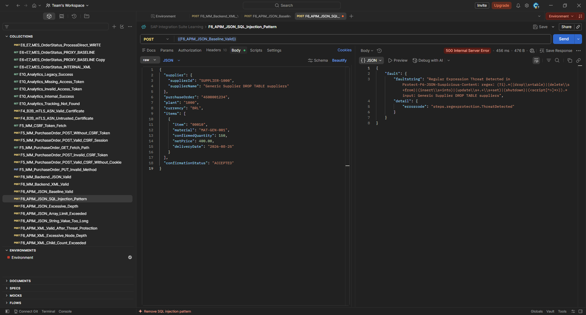

## 5.4 SQL suspeito em XML

```text
Generic Supplier DELETE FROM purchase_orders
```

O teste final usou corretamente o endpoint `/xml`, acionando o Conditional Flow XML.

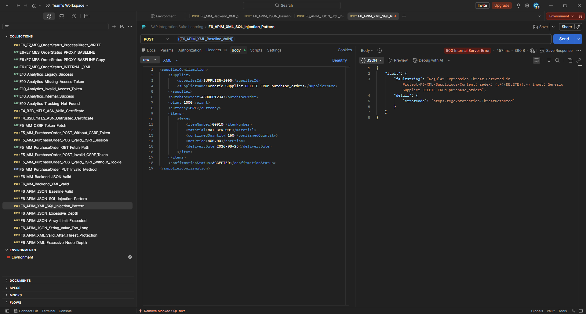

## 5.5 Tag script em JSON

```text
Generic Supplier <script>alert(1)</script>
```

A Regex Protection identificou o conteúdo.

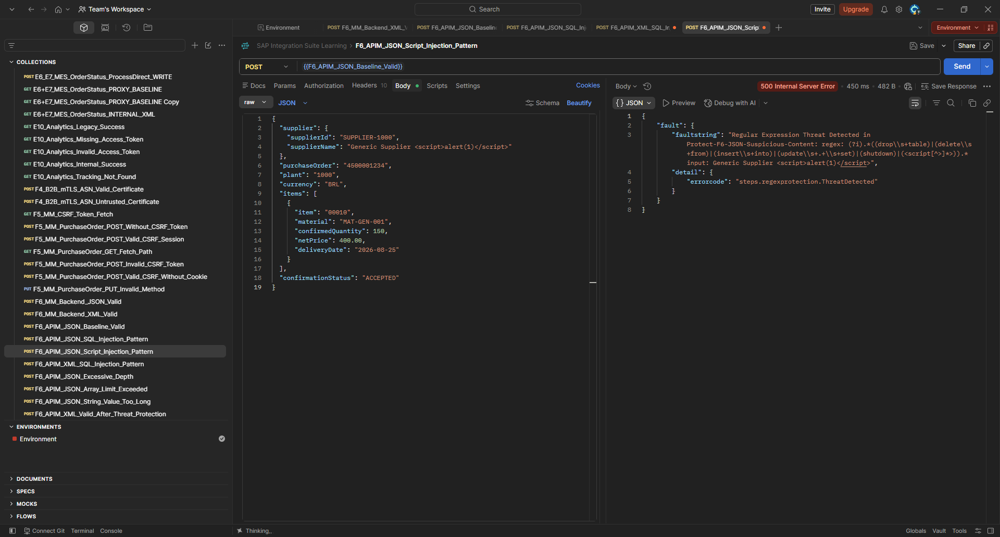

---

# 6. Resposta segura com Raise Fault condicional

## 6.1 Problema identificado

Com `continueOnError="false"`, a Regex Protection interrompia imediatamente o fluxo e devolvia `500 Internal Server Error`, contendo:

- nome interno da policy;
- regex configurada;
- conteúdo que correspondeu ao padrão;
- código técnico `steps.regexprotection.ThreatDetected`.

Esse retorno comprova o bloqueio, mas expõe detalhes desnecessários e classifica uma rejeição de request como falha interna.

## 6.2 Abordagens testadas

Foram avaliadas:

1. Assign Message no `DefaultFaultFlow`.
2. Raise Fault no `DefaultFaultFlow` Outgoing Response.
3. Raise Fault no `DefaultFaultFlow` Incoming Request.
4. Reutilização de `defaultRaiseFaultPolicy`.
5. Policy customizada anexada ao `DefaultFaultFlow`.

Mesmo com revisões implantadas, o runtime preservou o fault nativo das Regex Protection policies.

## 6.3 Solução final

A solução funcional foi:

```text
Regular Expression Protection
→ continueOnError = true
→ variável failed é preenchida
→ Raise Fault condicional executa
→ HTTP 400 seguro
```

### Raise Fault

```xml
<RaiseFault xmlns="http://www.sap.com/apimgmt" async="false" continueOnError="false" enabled="true">
    <FaultResponse>
        <Set>
            <Headers>
                <Header name="Content-Type">application/json</Header>
                <Header name="Cache-Control">no-store</Header>
            </Headers>
            <Payload contentType="application/json">
{
  "status": "REJECTED",
  "code": "F6-THREAT-400",
  "message": "The supplier confirmation payload violated an API security policy.",
  "correlationId": "{messageid}"
}
            </Payload>
            <StatusCode>400</StatusCode>
            <ReasonPhrase>Bad Request</ReasonPhrase>
        </Set>
    </FaultResponse>
    <IgnoreUnresolvedVariables>true</IgnoreUnresolvedVariables>
</RaiseFault>
```

### Condição JSON

```text
regularexpressionprotection.Protect-F6-JSON-Suspicious-Content.failed = true
```

### Condição XML

```text
regularexpressionprotection.Protect-F6-XML-Suspicious-Content.failed = true
```

A condição específica por policy evita que a falha de um fluxo influencie o outro.

## 6.4 Configuração JSON final

```text
1. Protect-F6-JSON-Payload
2. Protect-F6-JSON-Suspicious-Content
3. Raise-F6-Standardized-Security-Fault
```

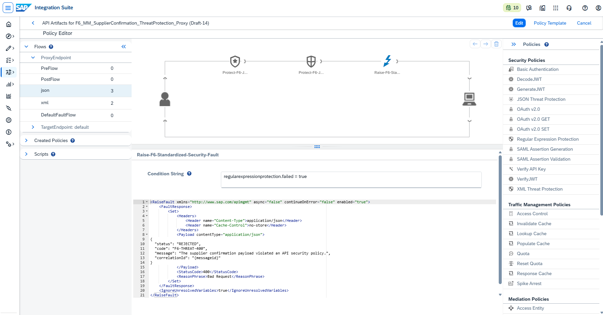

## 6.5 Resposta segura JSON

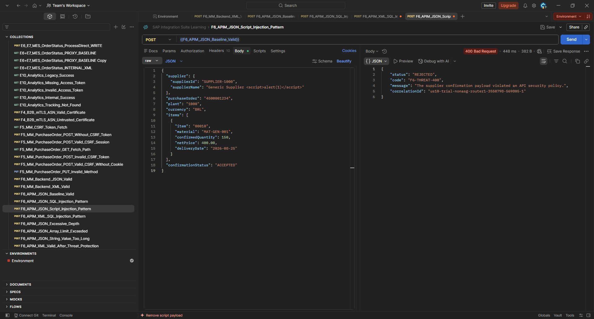

```json
{
  "status": "REJECTED",
  "code": "F6-THREAT-400",
  "message": "The supplier confirmation payload violated an API security policy.",
  "correlationId": "..."
}
```

## 6.6 Configuração XML final

```text
1. Protect-F6-XML-Payload
2. Protect-F6-XML-Suspicious-Content
3. Raise-F6-Standardized-Security-Fault
```

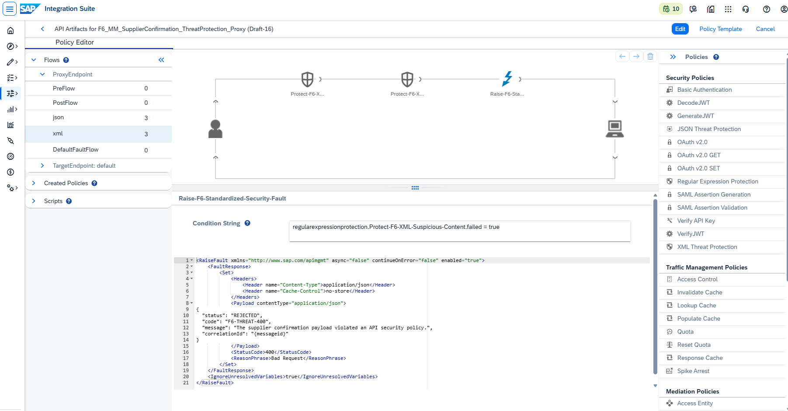

## 6.7 Resposta segura XML

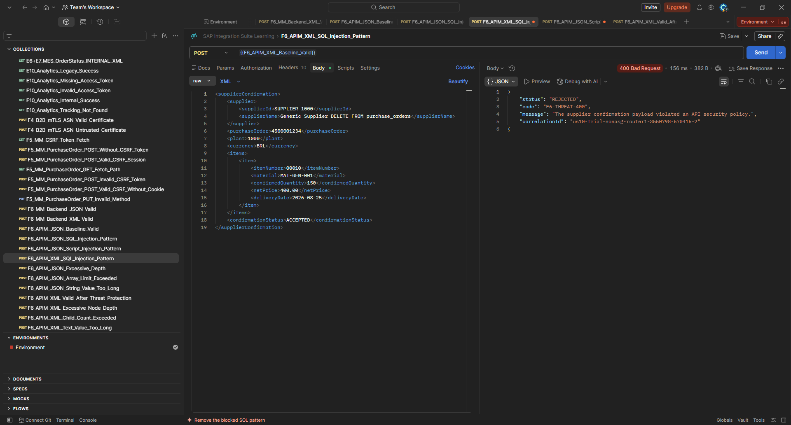

A SAP recomenda FaultRules ou DefaultFaultRule para padrões comuns de erro e Raise Fault para códigos e mensagens customizados. Neste tenant, o tratamento inline condicional foi a alternativa que comprovadamente interceptou a falha da Regex Protection.

Referência oficial: [Handling Faults using FaultRules and DefaultFaultRule — SAP Help Portal](https://help.sap.com/docs/integration-suite/isuite-integrations-and-apis/handling-faults-using-faultrules-and-defaultfaultrule)

Referência complementar: [Create a Policy — SAP Help Portal](https://help.sap.com/docs/sap-api-management/sap-api-management/create-policy?locale=en-US)

---

# 7. Resumo dos testes

| Teste | Recurso | Controle | Resultado | Backend CPI |
|---|---|---|---|---|
| JSON válido direto | CPI | Groovy | `200` | Executado |
| XML válido direto | CPI | Groovy | `200` | Executado |
| JSON válido pelo Proxy | `/json` | JSON Threat | `200` | Executado |
| XML válido pelo Proxy | `/xml` | XML Threat | `200` | Executado |
| JSON profundidade excessiva | `/json` | ContainerDepth | Rejeitado | Não executado |
| JSON array com 11 itens | `/json` | ArrayElementCount | Rejeitado | Não executado |
| JSON string acima de 200 | `/json` | StringValueLength | Rejeitado | Não executado |
| XML profundidade acima de 8 | `/xml` | NodeDepth | Rejeitado | Não executado |
| XML com 21 filhos | `/xml` | ChildCount | Rejeitado | Não executado |
| XML texto acima de 300 | `/xml` | Text | Rejeitado | Não executado |
| JSON `DROP TABLE` | `/json` | Regex | Rejeitado | Não executado |
| XML `DELETE FROM` | `/xml` | Regex | `400` seguro | Não executado |
| JSON `<script>` | `/json` | Regex | `400` seguro | Não executado |

---

# 8. Troubleshooting detalhado

## 8.1 Conditional Flow não executado

Os primeiros testes de profundidade JSON retornaram `200` porque a variável do Postman apontava para o Base Path sem `/json`.

```text
URL sem /json
→ Conditional Flow json não executado
→ backend recebeu o payload
```

Correção:

```text
.../supplier-confirmation/json
```

O mesmo ocorreu no teste Regex XML, inicialmente enviado ao endpoint JSON.

```text
Endpoint JSON
→ policy Regex XML não executada
→ 200
```

```text
Endpoint XML
→ policy Regex XML executada
→ ameaça detectada
```

## 8.2 Payload inicial não excedeu profundidade efetiva

O primeiro JSON aninhado ainda permaneceu dentro da contagem efetiva do engine. O payload foi ampliado para doze níveis, produzindo `Exceeded container depth`.

## 8.3 XML Threat Protection não salvava

Erro:

```text
Attribute includeText must appear on element ChildCount
```

Correção:

```xml
<ChildCount includeComment="true" includeElement="true" includeProcessingInstruction="true" includeText="true">20</ChildCount>
```

## 8.4 XML malformado na policy Regex

Ocorreram erros por:

- fechamento `</Xpath>` incompatível com `<XPath>`;
- caractere `<` sobrando após a policy;
- tentativa de usar `<Variable>` em posição não aceita pelo schema do tenant.

A configuração final voltou ao formato oficial:

```text
XMLPayload
→ Namespaces
→ XPath
→ Expression
→ Type
→ Pattern
```

## 8.5 DefaultFaultFlow não substituiu o fault nativo

Assign Message e Raise Fault no DefaultFaultFlow não alteraram a resposta `500` da Regex Protection.

A solução foi manter o fluxo normal ativo com:

```xml
continueOnError="true"
```

E executar o Raise Fault com uma condição baseada na variável específica da policy.

## 8.6 Raise Fault incondicional bloqueava conteúdo válido

Quando o Condition String ficou vazio, até o XML legítimo recebeu `400`.

Correção:

```text
regularexpressionprotection.<policy-name>.failed = true
```

Isso garantiu:

```text
Legítimo → failed = false → 200
Suspeito → failed = true → 400
```

---

# 9. Boas práticas SAP aplicadas

## 9.1 Policies no recurso correto

A JSON Threat Protection foi aplicada somente a `/json`, e a XML Threat Protection somente a `/xml`. Isso evita tentar interpretar XML como JSON ou JSON como XML.

A SAP permite selecionar Flow e stream da policy e recomenda vincular a policy ao ponto de execução apropriado.

Referência: [Create a Policy — SAP Help Portal](https://help.sap.com/docs/sap-api-management/sap-api-management/create-policy?locale=en-US)

## 9.2 Validar no Incoming Request

Todas as protections foram aplicadas antes do TargetEndpoint. O backend não consome recursos processando mensagens rejeitadas.

## 9.3 Usar Source request

```xml
<Source>request</Source>
```

Isso torna explícito que a mensagem do consumidor deve ser analisada.

## 9.4 Limites proporcionais ao contrato

Os limites foram definidos acima do payload legítimo e abaixo de estruturas abusivas. Em produção, os números precisam ser derivados do contrato real e de testes de volume, sem usar valores arbitrários.

## 9.5 Não expor credenciais

O consumidor não recebe nem envia a credencial técnica do CPI. UserID e Password são lidos de KVM e atribuídos a variáveis `private.*`.

## 9.6 Não expor detalhes internos

A resposta customizada não revela:

- regex;
- nome da policy;
- limite violado;
- linha do payload;
- stack trace;
- credencial de backend.

O correlation ID permite investigação operacional sem expor implementação.

## 9.7 Cache-Control no fault

```text
Cache-Control: no-store
```

Evita armazenamento intermediário de respostas de segurança.

## 9.8 Regressão após cada policy

Após adicionar uma proteção, o payload legítimo foi novamente testado. Isso reduz falsos positivos e comprova que a policy protege sem interromper o happy path.

## 9.9 Defesa em profundidade

A própria documentação oficial de segurança da SAP lista JSON Threat Protection, XML Threat Protection, Message Validation e Regular Expression Protection como controles complementares.

Referência: [Security Aspects of Data, Data Flow for API Management — SAP Help Portal](https://help.sap.com/docs/integration-suite/sap-integration-suite/security-aspects-of-data-data-flow-for-api-management)

---

# 10. Recomendações para produção

- Aplicar OAuth 2.0, API Key ou mTLS além de Threat Protection.
- Limitar tamanho global de request no gateway ou infraestrutura.
- Definir schemas JSON e XSD e usar Message Validation quando aplicável.
- Manter regex simples, revisadas e testadas para evitar ReDoS.
- Não registrar bodies sensíveis integralmente em produção.
- Registrar correlation ID e policy outcome em logging seguro.
- Criar alertas para crescimento de rejeições por tipo de ameaça.
- Revisar limites quando o contrato de API mudar.
- Versionar Proxy e policies em pipeline CI/CD.
- Transportar conteúdo entre ambientes, evitando edição manual em produção.
- Implementar testes automatizados positivos e negativos.
- Não tratar Regex Protection como mecanismo único contra SQL injection ou XSS.
- Parametrizar qualquer acesso a banco de dados no backend.
- Definir resposta de erro consistente com o API Guideline corporativo.

---

### ✅ Conclusão

O cenário F6 demonstrou que o SAP API Management pode proteger um backend Cloud Integration contra mensagens estruturalmente abusivas e conteúdo correspondente a padrões suspeitos.

Foram comprovados:

- backend JSON e XML;
- Proxy com dois recursos condicionais;
- mediação segura de credenciais APIM → CPI;
- JSON Threat Protection;
- XML Threat Protection;
- Regular Expression Protection em JSONPath e XPath;
- rejeição por profundidade;
- rejeição por quantidade de elementos;
- rejeição por comprimento de conteúdo;
- detecção de SQL-like patterns;
- detecção de script-like patterns;
- preservação de mensagens legítimas;
- resposta padronizada `400` para Regex Protection;
- correlation ID sem exposição de detalhes internos;
- bloqueio antes do backend.

```text
Payload válido
→ policy aprova
→ backend executa
→ F6-THREAT-200
```

```text
Payload estruturalmente abusivo
→ JSON/XML Threat Protection rejeita
→ backend não executa
```

```text
Conteúdo suspeito
→ Regex Protection marca failed
→ Raise Fault condicional
→ F6-THREAT-400
→ backend não executa
```

**Recursos praticados:** API Proxy · Conditional Flows · JSON Threat Protection · XML Threat Protection · Regular Expression Protection · JSONPath · XPath · Raise Fault · Key Value Map · Basic Authentication · Assign Message · Secure Fault Response · SAP MM Supplier Confirmation

**Cenário anterior:** [F5 — CSRF Token Validation](./27-f5-csrf-token-validation.md)  
**Próximo cenário:** [F7 — PGP Message-Level Security](./29-f7-pgp-message-level-security.md)

---

## 📚 Referências oficiais SAP

- [API Management](https://help.sap.com/docs/integration-suite/isuite-integrations-and-apis/api-management)
- [Classic API Management](https://help.sap.com/docs/integration-suite/isuite-integrations-and-apis/classic-api-management)
- [JSON Threat Protection](https://help.sap.com/docs/integration-suite/isuite-integrations-and-apis/json-threat-protection)
- [XML Threat Protection](https://help.sap.com/docs/integration-suite/isuite-integrations-and-apis/xml-threat-protection)
- [Regular Expression Protection](https://help.sap.com/docs/integration-suite/isuite-integrations-and-apis/regular-expression-protection)
- [Handling Faults using FaultRules and DefaultFaultRule](https://help.sap.com/docs/integration-suite/isuite-integrations-and-apis/handling-faults-using-faultrules-and-defaultfaultrule)
- [Create a Policy](https://help.sap.com/docs/sap-api-management/sap-api-management/create-policy?locale=en-US)
- [Security Aspects for API Management](https://help.sap.com/docs/integration-suite/sap-integration-suite/security-aspects-of-data-data-flow-for-api-management)

---

### 🛠️ Ferramentas utilizadas

- SAP Integration Suite — Cloud Integration
- SAP Integration Suite — API Management
- SAP BTP Process Integration Runtime
- Postman
- Groovy
- Visual Studio Code
- Git e GitHub

---

### 👤 Autor / 📬 Contato

[](https://www.linkedin.com/in/orlando-caetano/)
[](https://github.com/OrlandoCaetano2026)

**Orlando Caetano**  
Especialista SAP • Integração • Inteligência Artificial  
Consultor SAP MM com know-how em PP, QM e WM

> 📌 Projeto de estudo e portfólio. Os cenários SAP MM, PP e QM são simulações educativas para prática de integração.
