## 🔐 F7 — OpenPGP Message-Level Security para Confirmação de Pedido de Compra SAP MM

**Bloco:** F — Segurança Transversal  
**Cenário:** F7 — PGP Message-Level Security  
**Status:** ✅ Concluído e validado de ponta a ponta  
**Data de execução:** 17/08/2026  
**Producer:** `F7_MM_PGP_SupplierConfirmation_Producer`  
**Consumer:** `F7_MM_PGP_SupplierConfirmation_Consumer`  
**Documento:** `29-f7-pgp-message-level-security.md`

---

### 📌 Visão executiva

Este laboratório implementa segurança em nível de mensagem com OpenPGP para uma confirmação de pedido de compra SAP MM em um cenário B2B. O documento funcional é validado no Cloud Integration, assinado digitalmente com a chave privada do emissor e criptografado com a chave pública do destinatário.

No fluxo de entrada, o Consumer descriptografa a mensagem com a chave privada do destinatário, exige uma assinatura digital e verifica se a assinatura corresponde ao emissor autorizado. Somente depois dessas verificações o JSON SAP MM é disponibilizado para validação funcional.

```text
JSON SAP MM
→ validação funcional
→ assinatura digital do Sender
→ criptografia para o Supplier
→ mensagem OpenPGP armored
→ descriptografia pelo Supplier
→ verificação da assinatura do Sender
→ validação funcional do JSON recuperado
→ resposta F7-PGP-200
```

A proteção permanece associada ao conteúdo mesmo quando a mensagem é armazenada, transferida por arquivo, transmitida por SFTP, colocada em uma fila ou encaminhada por outro middleware. Esse comportamento diferencia segurança em nível de mensagem de segurança restrita ao canal de transporte.

A SAP documenta que OpenPGP no Cloud Integration permite criptografar uma mensagem ou assinar e criptografar uma mensagem. O runtime utiliza PGP public e secret keyrings para localizar as chaves de criptografia, descriptografia, assinatura e verificação.  
Referência oficial: [How OpenPGP Works — SAP Help Portal](https://help.sap.com/docs/integration-suite/isuite-integrations-and-apis/how-openpgp-works)

---

## 🎯 Objetivos técnicos

- Implementar criptografia OpenPGP para uma confirmação de pedido de compra SAP MM.
- Assinar digitalmente a mensagem antes da criptografia.
- Separar as responsabilidades criptográficas do Sender e do Supplier.
- Administrar public e secret keys no tenant do SAP Integration Suite.
- Usar AES-256 para criptografia do conteúdo e SHA-512 para assinatura.
- Gerar uma mensagem ASCII armored adequada ao transporte textual.
- Exigir assinatura no PGP Decryptor.
- Validar o User ID do signatário permitido.
- Recuperar e validar o JSON original após a descriptografia.
- Calcular SHA-256 do documento normalizado para rastreabilidade.
- Comprovar a rejeição de mensagem adulterada.
- Comprovar a rejeição de mensagem criptografada sem assinatura.
- Comprovar a rejeição de mensagem produzida com chave de assinatura diferente da autorizada.
- Demonstrar que mensagens rejeitadas não alcançam a validação funcional SAP MM.

---

## 🧠 Fundamentos de segurança aplicados

### Segurança do canal e segurança da mensagem

| Controle | Objeto protegido | Persistência da proteção |
|---|---|---|
| TLS | Conexão entre dois pontos | Termina quando a sessão TLS termina |
| mTLS | Conexão e identidade dos endpoints | Termina quando a sessão TLS termina |
| OpenPGP | Conteúdo da mensagem | Permanece durante armazenamento, encaminhamento e transporte |

Em uma arquitetura de produção, esses controles podem coexistir:

```text
mTLS
+ autenticação e autorização da API
+ OpenPGP Message-Level Security
+ validação funcional
+ monitoramento e auditoria
```

### Criptografia

A criptografia fornece confidencialidade. O Producer utiliza a public key do destinatário, e somente a secret key correspondente pode recuperar o conteúdo.

```text
Producer
→ Public Key do Supplier
→ mensagem criptografada
```

```text
Consumer
→ Secret Key do Supplier
→ mensagem descriptografada
```

### Assinatura digital

A assinatura digital fornece comprovação criptográfica da origem e proteção contra alterações posteriores à assinatura.

```text
Producer
→ Secret Key do Sender
→ assinatura digital
```

```text
Consumer
→ Public Key do Sender
→ verificação da assinatura
```

### Integrity Protected Data Packet

O PGP Encryptor foi configurado com `Integrity Protected Data Packet`. A SAP descreve essa opção como um formato que adiciona um hash ao pacote criptografado para elevar o nível de proteção contra modificação do conteúdo.  
Referência oficial: [Define PGP Encryptor — SAP Help Portal](https://help.sap.com/docs/integration-suite/isuite-integrations-and-apis/define-pgp-encryptor)

---

# 1. Arquitetura da solução

## 1.1 Fluxo Producer

```text
HTTPS Sender
→ ValidatePOConfirmation.groovy
→ Sign_And_Encrypt_PO_Confirmation
→ Prepare_PGP_Response
→ End
```

Responsabilidades:

| Componente | Responsabilidade |
|---|---|
| HTTPS Sender | Receber o JSON SAP MM autenticado |
| ValidatePOConfirmation.groovy | Validar estrutura, campos obrigatórios e valores funcionais |
| PGP Encryptor | Assinar com a secret key do Sender e criptografar com a public key do Supplier |
| Prepare_PGP_Response | Definir status HTTP, media type e nome do arquivo armored |
| End | Retornar a mensagem OpenPGP ao consumidor |

## 1.2 Fluxo Consumer

```text
HTTPS Sender
→ Decrypt_And_Verify_PO_Confirmation
→ Validate_Decrypted_PO_Confirmation
→ Build_Verified_Response
→ End
```

Responsabilidades:

| Componente | Responsabilidade |
|---|---|
| HTTPS Sender | Receber a mensagem OpenPGP armored |
| PGP Decryptor | Descriptografar com a secret key do Supplier e verificar a assinatura do Sender |
| ValidateDecryptedPOConfirmation.groovy | Validar o JSON SAP MM recuperado e calcular seu SHA-256 |
| Build_Verified_Response | Construir a resposta funcional e os status de segurança |
| End | Retornar `F7-PGP-200` |

## 1.3 Modelo B2B

| Papel | User ID PGP | Material usado | Finalidade |
|---|---|---|---|
| Emissor autorizado | `F7 Sender B2B Signing` | Secret key | Assinar no Producer |
| Emissor autorizado | `F7 Sender B2B Signing` | Public key | Verificar assinatura no Consumer |
| Destinatário | `F7 Supplier B2B Encryption` | Public key | Criptografar no Producer |
| Destinatário | `F7 Supplier B2B Encryption` | Secret key | Descriptografar no Consumer |

---

# 2. Gerenciamento das chaves OpenPGP

Os pares de chaves foram gerados fora do repositório Git e importados para o gerenciamento de PGP Keys do SAP Integration Suite. Foram usados User IDs genéricos para impedir a exposição de nomes reais de organizações nas evidências e no portfólio.

| Chave | Tipo disponível | Estado | Uso no laboratório |
|---|---|---|---|
| `F7 Sender B2B Signing` | `Secret,Public` | `Valid` | Assinatura e verificação |
| `F7 Supplier B2B Encryption` | `Secret,Public` | `Valid` | Criptografia e descriptografia |

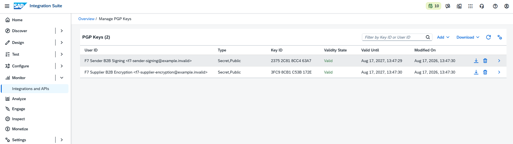

**Evidência 01:** a captura apresenta o gerenciamento de PGP Keys com dois User IDs distintos. As duas entradas possuem materiais `Secret,Public`, Key IDs diferentes, estado `Valid` e validade definida. Nenhuma passphrase nem conteúdo de chave privada é exibido. A separação dos User IDs representa duas identidades B2B e permite atribuir responsabilidades diferentes para assinatura e criptografia.

A SAP exige que secret keys importadas estejam protegidas por passphrase e aceita keyrings ASCII armored ou binários.  
Referências oficiais: [Deploying a PGP Secret Keyring](https://help.sap.com/docs/integration-suite/isuite-integrations-and-apis/deploying-pgp-secret-keyring) e [Deploying a PGP Public Keyring](https://help.sap.com/docs/integration-suite/isuite-integrations-and-apis/deploying-pgp-public-keyring)

### Boas práticas de governança das chaves

- Não versionar secret keys, passphrases ou diretórios de ferramentas PGP.
- Armazenar cópias privadas somente em repositório seguro de segredos.
- Registrar Key ID, fingerprint, proprietário, finalidade e validade.
- Definir processo de rotação antes da expiração.
- Usar User IDs específicos por parceiro e finalidade.
- Revogar ou remover chaves comprometidas.
- Separar chaves de assinatura de chaves de criptografia em cenários produtivos de maior criticidade.
- Limitar acesso administrativo ao gerenciamento de PGP Keys.

---

# 3. Documento funcional SAP MM

O payload representa uma confirmação de pedido de compra com envelope de integração, cabeçalho do pedido e confirmações por item.

## 3.1 Campos de cabeçalho

| Campo JSON | Referência SAP MM | Valor do teste | Significado |
|---|---|---|---|
| `ebeln` | EBELN | `4500001234` | Número do pedido de compra |
| `bsart` | BSART | `NB` | Tipo de documento de compras |
| `lifnr` | LIFNR | `0000100000` | Número do fornecedor |
| `ekorg` | EKORG | `1000` | Organização de compras |
| `ekgrp` | EKGRP | `001` | Grupo de compradores |
| `bukrs` | BUKRS | `1000` | Empresa |
| `waers` | WAERS | `BRL` | Moeda do documento |

## 3.2 Campos dos itens

| Campo JSON | Referência SAP MM | Significado |
|---|---|---|
| `ebelp` | EBELP | Item do pedido de compra |
| `matnr` | MATNR | Material |
| `werks` | WERKS | Centro |
| `lgort` | LGORT | Depósito |
| `menge` | MENGE | Quantidade confirmada |
| `meins` | MEINS | Unidade de medida |
| `netpr` | NETPR | Preço líquido |
| `peinh` | PEINH | Unidade de preço |
| `eindt` | EINDT | Data de entrega |
| `etens` | ETENS | Sequência de confirmação |
| `ebtyp` | EBTYP | Categoria da confirmação |

## 3.3 Payload positivo

```json
{
  "messageHeader": {
    "messageId": "PGP-CONF-2026-000001",
    "creationDateTime": "2026-08-17T16:30:00Z",
    "senderSystem": "S4HANA_SENDER",
    "receiverSystem": "SUPPLIER_B2B_1000",
    "messageType": "PURCHASE_ORDER_CONFIRMATION"
  },
  "purchaseOrderHeader": {
    "ebeln": "4500001234",
    "bsart": "NB",
    "lifnr": "0000100000",
    "ekorg": "1000",
    "ekgrp": "001",
    "bukrs": "1000",
    "waers": "BRL"
  },
  "purchaseOrderConfirmation": {
    "confirmationReference": "CONF-SUP-2026-000145",
    "confirmationDate": "2026-08-17",
    "confirmationStatus": "ACCEPTED",
    "items": [
      {
        "ebelp": "00010",
        "matnr": "MAT-GEN-001",
        "werks": "1000",
        "lgort": "0001",
        "menge": 150,
        "meins": "PC",
        "netpr": 400.00,
        "peinh": 1,
        "eindt": "2026-08-25",
        "etens": "0001",
        "ebtyp": "AB"
      },
      {
        "ebelp": "00020",
        "matnr": "MAT-GEN-002",
        "werks": "1000",
        "lgort": "0001",
        "menge": 33,
        "meins": "PC",
        "netpr": 550.00,
        "peinh": 1,
        "eindt": "2026-08-27",
        "etens": "0001",
        "ebtyp": "AB"
      }
    ]
  }
}
```

---

# 4. Producer: assinatura e criptografia

## 4.1 Identificação

| Propriedade | Valor |
|---|---|
| Name | `F7_MM_PGP_SupplierConfirmation_Producer` |
| ID | `F7_MM_PGP_SupplierConfirmation_Producer` |
| Description | `Signs and encrypts SAP MM purchase order confirmations using OpenPGP message-level security.` |
| HTTPS Address | `/f7/mm/pgp/supplier-confirmation/encrypt` |
| Authorization | `User Role` |
| User Role | `ESBMessaging.send` |
| CSRF Protected | `Disabled` |

## 4.2 Validação do JSON no Producer

O Groovy valida:

- presença de `messageHeader`, `purchaseOrderHeader` e `purchaseOrderConfirmation`;
- campos obrigatórios em cada seção;
- `EBELN` e `LIFNR` com dez dígitos;
- pelo menos um item;
- `EBELP` com cinco dígitos;
- `MENGE`, `NETPR` e `PEINH` numéricos e maiores que zero;
- normalização do JSON;
- cálculo do SHA-256 do payload normalizado;
- properties de identificação e seleção das chaves.

### Groovy completo do Producer

```groovy
import com.sap.gateway.ip.core.customdev.util.Message
import groovy.json.JsonOutput
import groovy.json.JsonSlurper
import java.security.MessageDigest
import java.time.Instant

def Message processData(Message message) {

    Reader bodyReader = message.getBody(Reader)

    if (bodyReader == null) {
        throw new IllegalArgumentException(
            "SAP MM purchase order confirmation payload cannot be empty."
        )
    }

    def payload

    try {
        payload = new JsonSlurper().parse(bodyReader)
    } catch (Exception exception) {
        throw new IllegalArgumentException(
            "Invalid JSON received for SAP MM purchase order confirmation."
        )
    }

    if (!(payload instanceof Map)) {
        throw new IllegalArgumentException(
            "The purchase order confirmation payload must be a JSON object."
        )
    }

    def requiredHeaderFields = [
        "messageId",
        "creationDateTime",
        "senderSystem",
        "receiverSystem",
        "messageType"
    ]

    def requiredPurchaseOrderFields = [
        "ebeln",
        "bsart",
        "lifnr",
        "ekorg",
        "ekgrp",
        "bukrs",
        "waers"
    ]

    def requiredConfirmationFields = [
        "confirmationReference",
        "confirmationDate",
        "confirmationStatus",
        "items"
    ]

    validateSection(
        payload.messageHeader,
        "messageHeader",
        requiredHeaderFields
    )

    validateSection(
        payload.purchaseOrderHeader,
        "purchaseOrderHeader",
        requiredPurchaseOrderFields
    )

    validateSection(
        payload.purchaseOrderConfirmation,
        "purchaseOrderConfirmation",
        requiredConfirmationFields
    )

    String messageId =
        payload.messageHeader.messageId
            ?.toString()
            ?.trim()

    String ebeln =
        payload.purchaseOrderHeader.ebeln
            ?.toString()
            ?.trim()

    String lifnr =
        payload.purchaseOrderHeader.lifnr
            ?.toString()
            ?.trim()

    String confirmationReference =
        payload.purchaseOrderConfirmation
            .confirmationReference
            ?.toString()
            ?.trim()

    if (!(ebeln ==~ /\d{10}/)) {
        throw new IllegalArgumentException(
            "Field purchaseOrderHeader.ebeln must contain exactly 10 digits."
        )
    }

    if (!(lifnr ==~ /\d{10}/)) {
        throw new IllegalArgumentException(
            "Field purchaseOrderHeader.lifnr must contain exactly 10 digits."
        )
    }

    def items = payload.purchaseOrderConfirmation.items

    if (!(items instanceof List) || items.isEmpty()) {
        throw new IllegalArgumentException(
            "Field purchaseOrderConfirmation.items must contain at least one item."
        )
    }

    items.eachWithIndex { item, index ->

        def requiredItemFields = [
            "ebelp",
            "matnr",
            "werks",
            "lgort",
            "menge",
            "meins",
            "netpr",
            "peinh",
            "eindt",
            "etens",
            "ebtyp"
        ]

        validateSection(
            item,
            "purchaseOrderConfirmation.items[${index}]",
            requiredItemFields
        )

        if (!(item.ebelp.toString() ==~ /\d{5}/)) {
            throw new IllegalArgumentException(
                "Field ebelp at item index ${index} must contain exactly 5 digits."
            )
        }

        BigDecimal menge
        BigDecimal netpr
        BigDecimal peinh

        try {
            menge = new BigDecimal(item.menge.toString())
            netpr = new BigDecimal(item.netpr.toString())
            peinh = new BigDecimal(item.peinh.toString())
        } catch (Exception ignored) {
            throw new IllegalArgumentException(
                "Fields menge, netpr, and peinh must contain valid numeric values at item index ${index}."
            )
        }

        if (menge <= 0) {
            throw new IllegalArgumentException(
                "Field menge must be greater than zero at item index ${index}."
            )
        }

        if (netpr <= 0) {
            throw new IllegalArgumentException(
                "Field netpr must be greater than zero at item index ${index}."
            )
        }

        if (peinh <= 0) {
            throw new IllegalArgumentException(
                "Field peinh must be greater than zero at item index ${index}."
            )
        }
    }

    String normalizedBody = JsonOutput.prettyPrint(
        JsonOutput.toJson(payload)
    )

    String originalPayloadSha256 =
        calculateSha256(normalizedBody)

    message.setProperty("messageId", messageId)
    message.setProperty("ebeln", ebeln)
    message.setProperty("lifnr", lifnr)
    message.setProperty(
        "confirmationReference",
        confirmationReference
    )
    message.setProperty(
        "itemCount",
        items.size().toString()
    )
    message.setProperty(
        "originalPayloadSha256",
        originalPayloadSha256
    )
    message.setProperty(
        "pgpSenderUserId",
        "F7 Sender B2B Signing"
    )
    message.setProperty(
        "pgpRecipientUserId",
        "F7 Supplier B2B Encryption"
    )
    message.setProperty(
        "validatedAt",
        Instant.now().toString()
    )

    message.setBody(normalizedBody)
    message.setHeader("Content-Type", "application/json")

    return message
}


def validateSection(
    def section,
    String sectionName,
    List<String> requiredFields
) {

    if (!(section instanceof Map)) {
        throw new IllegalArgumentException(
            "Section ${sectionName} is mandatory and must be a JSON object."
        )
    }

    def missingFields = requiredFields.findAll { field ->

        if (!section.containsKey(field)) {
            return true
        }

        def value = section[field]

        if (value == null) {
            return true
        }

        if (value instanceof List) {
            return value.isEmpty()
        }

        return value.toString().trim().isEmpty()
    }

    if (!missingFields.isEmpty()) {
        throw new IllegalArgumentException(
            "Missing or empty fields in ${sectionName}: ${missingFields.join(', ')}"
        )
    }
}


def String calculateSha256(String content) {

    MessageDigest digest =
        MessageDigest.getInstance("SHA-256")

    byte[] hash = digest.digest(
        content.getBytes("UTF-8")
    )

    return hash.collect { byteValue ->
        String.format(
            "%02x",
            byteValue & 0xff
        )
    }.join()
}
```

A leitura com `Reader` evita o parsing de uma cópia integral adicional do body e atende à recomendação do Script Check para processamento por streaming.

## 4.3 Configuração do PGP Encryptor

| Parâmetro | Valor configurado | Finalidade técnica |
|---|---|---|
| Signatures | `Including` | Incluir assinatura digital |
| Content Encryption Algorithm | `AES` | Criptografar o conteúdo com algoritmo simétrico forte |
| Secret Key Length | `256` | Usar AES-256 |
| Compression Algorithm | `ZIP` | Compactar antes da criptografia |
| Armored | `Enabled` | Produzir saída textual ASCII armored |
| Integrity Protected Data Packet | `Enabled` | Detectar modificação do conteúdo criptografado |
| Encryption Key User ID | `${property.pgpRecipientUserId}` | Selecionar a public key do destinatário |
| Signature Algorithm | `SHA-512` | Criar o digest usado na assinatura |
| Signer Key User ID | `${property.pgpSenderUserId}` | Selecionar a secret key do emissor |

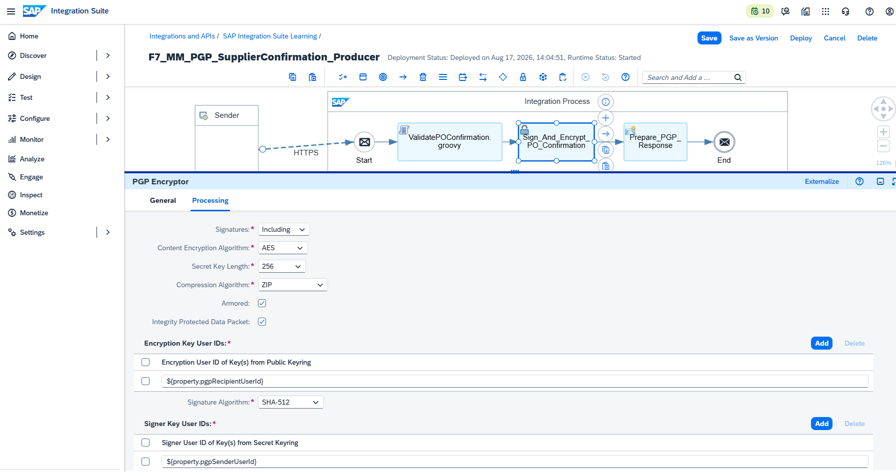

**Evidência 02:** a captura apresenta a aba `Processing` do PGP Encryptor. A assinatura foi configurada como `Including`, a criptografia utiliza AES com chave de 256 bits, a compactação utiliza ZIP e a saída está em formato armored. A opção `Integrity Protected Data Packet` está habilitada. Os User IDs de criptografia e assinatura são derivados de exchange properties, reduzindo o risco de seleção de chave por conteúdo controlado pelo consumidor.

A SAP recomenda algoritmos de assinatura fortes e informa que algoritmos antigos, como SHA-1 e MD5, permanecem disponíveis principalmente por compatibilidade.  
Referência oficial: [Define PGP Encryptor — SAP Help Portal](https://help.sap.com/docs/integration-suite/isuite-integrations-and-apis/define-pgp-encryptor)

## 4.4 Configuração da resposta

| Header | Tipo | Valor |
|---|---|---|
| `CamelHttpResponseCode` | Constant | `200` |
| `Content-Type` | Constant | `application/pgp-encrypted` |
| `Content-Disposition` | Expression | `attachment; filename="${property.messageId}.asc"` |

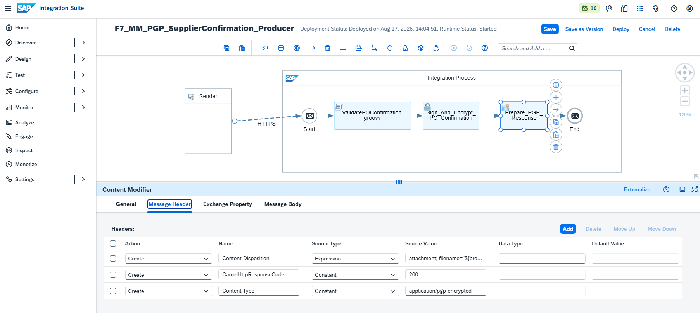

**Evidência 03:** a captura mostra que o Producer preserva o body produzido pelo PGP Encryptor e define somente os headers HTTP. O `Content-Type` identifica o conteúdo como OpenPGP, e o `Content-Disposition` fornece um nome de arquivo baseado no `messageId`. Nenhum Message Body adicional foi configurado no Content Modifier, evitando a substituição acidental do bloco criptografado.

## 4.5 Teste positivo do Producer

| Elemento validado | Resultado observado |
|---|---|
| Operação | `POST` |
| Entrada | Confirmação de pedido de compra em JSON |
| Pedido | `4500001234` |
| Fornecedor | `0000100000` |
| Itens | `00010` e `00020` |
| Resultado HTTP | `200 OK` |
| Formato da resposta | OpenPGP ASCII armored |
| Dados SAP MM legíveis na resposta | Não |

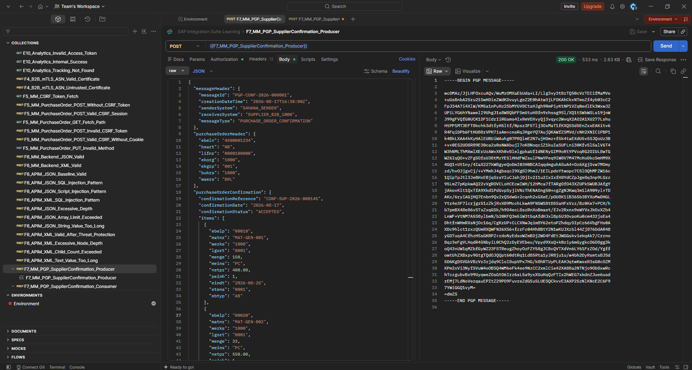

**Evidência 04:** no lado esquerdo do Postman está o JSON enviado ao Producer, contendo o envelope de integração, o pedido `4500001234`, o fornecedor `0000100000` e dois itens. No lado direito, a resposta `200 OK` contém apenas o bloco delimitado por `BEGIN PGP MESSAGE` e `END PGP MESSAGE`. Os campos `ebeln`, `lifnr`, `matnr`, `menge` e `netpr` não permanecem legíveis, comprovando que o payload foi protegido antes de sair do Integration Flow.

## 4.6 Caminho processado


**Evidência 05:** o Integration Flow Model apresenta todos os steps executados no Producer. O documento foi recebido pelo HTTPS Sender, validado pelo Groovy, assinado e criptografado pelo PGP Encryptor, preparado para resposta HTTP e entregue ao End. A execução completa confirma que a proteção OpenPGP integrou o caminho normal do cenário.

## 4.7 Conteúdo antes da criptografia

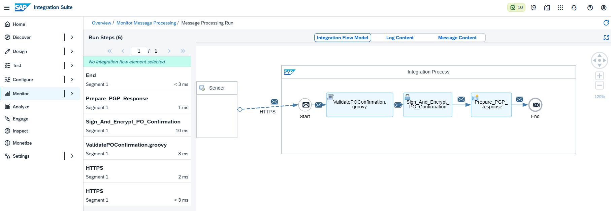

**Evidência 06:** o Message Content após o Groovy e antes do PGP Encryptor mostra o JSON funcional em texto legível. A captura contém dados do pedido, fornecedor, organização de compras, empresa, moeda, itens, materiais, quantidades, preços e datas de entrega. Essa evidência estabelece o estado do documento imediatamente antes da assinatura e da criptografia.

## 4.8 Conteúdo após a criptografia

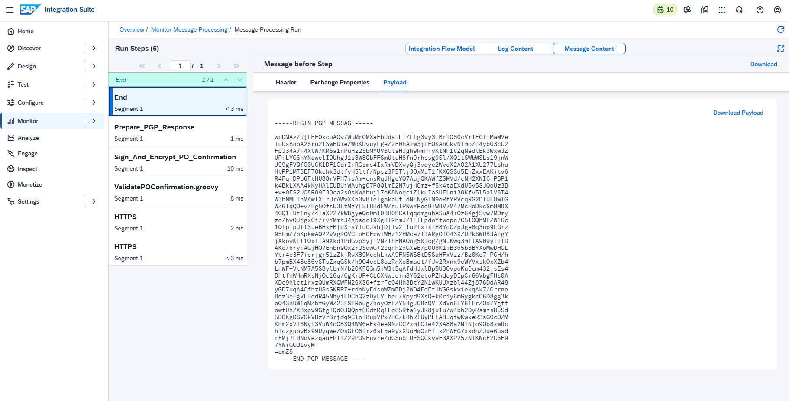

**Evidência 07:** o Message Content no final do Producer contém somente a representação OpenPGP armored. A comparação com a evidência 06 demonstra a transformação de um JSON SAP MM legível em uma mensagem criptograficamente protegida.

```text
Antes do PGP Encryptor
→ JSON SAP MM legível

Depois do PGP Encryptor
→ mensagem OpenPGP assinada e criptografada
```

---

# 5. Consumer: descriptografia e verificação

## 5.1 Identificação

| Propriedade | Valor |
|---|---|
| Name | `F7_MM_PGP_SupplierConfirmation_Consumer` |
| ID | `F7_MM_PGP_SupplierConfirmation_Consumer` |
| Description | `Decrypts and verifies OpenPGP-protected SAP MM purchase order confirmations.` |
| HTTPS Address | `/f7/mm/pgp/supplier-confirmation/decrypt` |
| Authorization | `User Role` |
| User Role | `ESBMessaging.send` |
| CSRF Protected | `Disabled` |

## 5.2 Configuração do PGP Decryptor

| Parâmetro | Valor | Efeito |
|---|---|---|
| Signatures | `Required` | Rejeitar mensagens sem assinatura |
| Signer Key User ID | `F7 Sender B2B Signing` | Aceitar somente assinatura verificável do Sender autorizado |
| Chave de descriptografia | Selecionada pelo recipient Key ID da mensagem | Usar a secret key correspondente do Supplier |

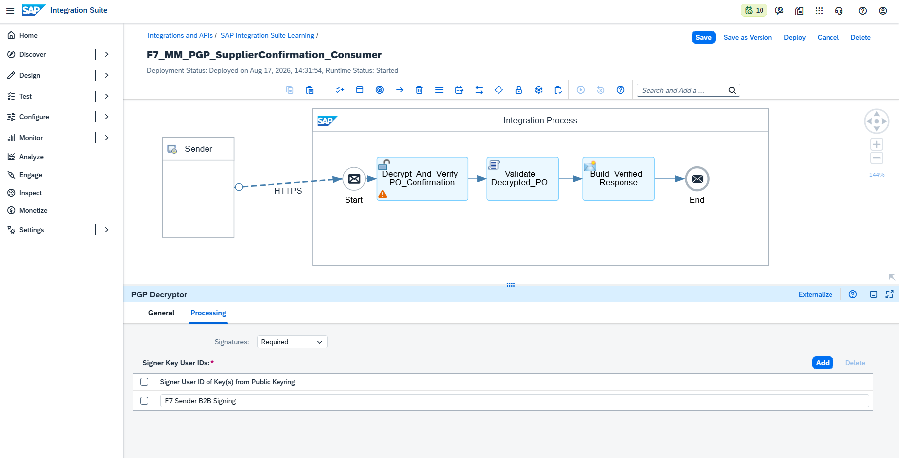

**Evidência 08:** a captura apresenta o Consumer implantado e a aba `Processing` do PGP Decryptor. `Signatures` está definido como `Required`, e o User ID permitido é `F7 Sender B2B Signing`. Isso impede que uma mensagem apenas criptografada seja tratada como válida e restringe a verificação ao emissor configurado.

A SAP documenta que o Decryptor usa a referência contida na mensagem para selecionar a secret key de descriptografia e pode exigir que ao menos uma assinatura seja verificável por uma public key associada a um User ID permitido.  
Referência oficial: [Define PGP Decryptor — SAP Help Portal](https://help.sap.com/docs/integration-suite/isuite-integrations-and-apis/define-pgp-decryptor)

## 5.3 Validação do JSON recuperado

O Groovy do Consumer valida novamente o conteúdo após o PGP Decryptor. Essa segunda validação é necessária porque segurança criptográfica não substitui validação funcional.

### Groovy completo do Consumer

```groovy
import com.sap.gateway.ip.core.customdev.util.Message
import groovy.json.JsonOutput
import groovy.json.JsonSlurper
import java.security.MessageDigest
import java.time.Instant

def Message processData(Message message) {

    Reader bodyReader = message.getBody(Reader)

    if (bodyReader == null) {
        throw new IllegalArgumentException(
            "The decrypted SAP MM purchase order confirmation payload cannot be empty."
        )
    }

    def payload

    try {
        payload = new JsonSlurper().parse(bodyReader)
    } catch (Exception exception) {
        throw new IllegalArgumentException(
            "The decrypted OpenPGP content is not a valid JSON payload."
        )
    }

    if (!(payload instanceof Map)) {
        throw new IllegalArgumentException(
            "The decrypted purchase order confirmation must be a JSON object."
        )
    }

    validateSection(
        payload.messageHeader,
        "messageHeader",
        [
            "messageId",
            "creationDateTime",
            "senderSystem",
            "receiverSystem",
            "messageType"
        ]
    )

    validateSection(
        payload.purchaseOrderHeader,
        "purchaseOrderHeader",
        [
            "ebeln",
            "bsart",
            "lifnr",
            "ekorg",
            "ekgrp",
            "bukrs",
            "waers"
        ]
    )

    validateSection(
        payload.purchaseOrderConfirmation,
        "purchaseOrderConfirmation",
        [
            "confirmationReference",
            "confirmationDate",
            "confirmationStatus",
            "items"
        ]
    )

    String messageId =
        payload.messageHeader.messageId
            ?.toString()
            ?.trim()

    String messageType =
        payload.messageHeader.messageType
            ?.toString()
            ?.trim()

    String ebeln =
        payload.purchaseOrderHeader.ebeln
            ?.toString()
            ?.trim()

    String lifnr =
        payload.purchaseOrderHeader.lifnr
            ?.toString()
            ?.trim()

    String confirmationReference =
        payload.purchaseOrderConfirmation
            .confirmationReference
            ?.toString()
            ?.trim()

    String confirmationStatus =
        payload.purchaseOrderConfirmation
            .confirmationStatus
            ?.toString()
            ?.trim()

    if (messageType != "PURCHASE_ORDER_CONFIRMATION") {
        throw new IllegalArgumentException(
            "Field messageHeader.messageType must be PURCHASE_ORDER_CONFIRMATION."
        )
    }

    if (!(ebeln ==~ /\d{10}/)) {
        throw new IllegalArgumentException(
            "Field purchaseOrderHeader.ebeln must contain exactly 10 digits."
        )
    }

    if (!(lifnr ==~ /\d{10}/)) {
        throw new IllegalArgumentException(
            "Field purchaseOrderHeader.lifnr must contain exactly 10 digits."
        )
    }

    def items = payload.purchaseOrderConfirmation.items

    if (!(items instanceof List) || items.isEmpty()) {
        throw new IllegalArgumentException(
            "Field purchaseOrderConfirmation.items must contain at least one item."
        )
    }

    items.eachWithIndex { item, index ->

        validateSection(
            item,
            "purchaseOrderConfirmation.items[${index}]",
            [
                "ebelp",
                "matnr",
                "werks",
                "lgort",
                "menge",
                "meins",
                "netpr",
                "peinh",
                "eindt",
                "etens",
                "ebtyp"
            ]
        )

        if (!(item.ebelp.toString() ==~ /\d{5}/)) {
            throw new IllegalArgumentException(
                "Field ebelp at item index ${index} must contain exactly 5 digits."
            )
        }

        validatePositiveNumber(item.menge, "menge", index)
        validatePositiveNumber(item.netpr, "netpr", index)
        validatePositiveNumber(item.peinh, "peinh", index)
    }

    String normalizedBody = JsonOutput.prettyPrint(
        JsonOutput.toJson(payload)
    )

    String decryptedPayloadSha256 =
        calculateSha256(normalizedBody)

    message.setProperty("messageId", messageId)
    message.setProperty("ebeln", ebeln)
    message.setProperty("lifnr", lifnr)
    message.setProperty(
        "confirmationReference",
        confirmationReference
    )
    message.setProperty(
        "confirmationStatus",
        confirmationStatus
    )
    message.setProperty(
        "itemCount",
        items.size().toString()
    )
    message.setProperty(
        "decryptedPayloadSha256",
        decryptedPayloadSha256
    )
    message.setProperty("signatureStatus", "VALID")
    message.setProperty("encryptionStatus", "DECRYPTED")
    message.setProperty("integrityStatus", "VALID")
    message.setProperty(
        "messageSecurity",
        "PGP_DECRYPTED_AND_VERIFIED"
    )
    message.setProperty(
        "processedAt",
        Instant.now().toString()
    )

    message.setBody(normalizedBody)
    message.setHeader("Content-Type", "application/json")

    return message
}


def validateSection(
    def section,
    String sectionName,
    List<String> requiredFields
) {

    if (!(section instanceof Map)) {
        throw new IllegalArgumentException(
            "Section ${sectionName} is mandatory and must be a JSON object."
        )
    }

    def missingFields = requiredFields.findAll { field ->

        if (!section.containsKey(field)) {
            return true
        }

        def value = section[field]

        if (value == null) {
            return true
        }

        if (value instanceof List) {
            return value.isEmpty()
        }

        return value.toString().trim().isEmpty()
    }

    if (!missingFields.isEmpty()) {
        throw new IllegalArgumentException(
            "Missing or empty fields in ${sectionName}: ${missingFields.join(', ')}"
        )
    }
}


def validatePositiveNumber(
    def value,
    String fieldName,
    int itemIndex
) {

    BigDecimal number

    try {
        number = new BigDecimal(value.toString())
    } catch (Exception ignored) {
        throw new IllegalArgumentException(
            "Field ${fieldName} must contain a valid numeric value at item index ${itemIndex}."
        )
    }

    if (number <= 0) {
        throw new IllegalArgumentException(
            "Field ${fieldName} must be greater than zero at item index ${itemIndex}."
        )
    }
}


def String calculateSha256(String content) {

    MessageDigest digest =
        MessageDigest.getInstance("SHA-256")

    byte[] hash = digest.digest(
        content.getBytes("UTF-8")
    )

    return hash.collect { byteValue ->
        String.format(
            "%02x",
            byteValue & 0xff
        )
    }.join()
}
```

## 5.4 Resposta de sucesso

```json
{
  "status": "DECRYPTED_AND_VERIFIED",
  "code": "F7-PGP-200",
  "message": "SAP MM purchase order confirmation decrypted and verified successfully.",
  "messageId": "${property.messageId}",
  "ebeln": "${property.ebeln}",
  "lifnr": "${property.lifnr}",
  "confirmationReference": "${property.confirmationReference}",
  "confirmationStatus": "${property.confirmationStatus}",
  "itemCount": "${property.itemCount}",
  "signatureStatus": "${property.signatureStatus}",
  "encryptionStatus": "${property.encryptionStatus}",
  "integrityStatus": "${property.integrityStatus}",
  "messageSecurity": "${property.messageSecurity}",
  "decryptedPayloadSha256": "${property.decryptedPayloadSha256}",
  "processedAt": "${property.processedAt}"
}
```

## 5.5 Teste positivo do Consumer

| Elemento validado | Resultado observado |
|---|---|
| Entrada | Mensagem OpenPGP armored |
| Resultado HTTP | `200 OK` |
| Status | `DECRYPTED_AND_VERIFIED` |
| Código | `F7-PGP-200` |
| Assinatura | `VALID` |
| Criptografia | `DECRYPTED` |
| Integridade | `VALID` |
| Pedido recuperado | `4500001234` |
| Fornecedor recuperado | `0000100000` |
| Itens recuperados | `2` |

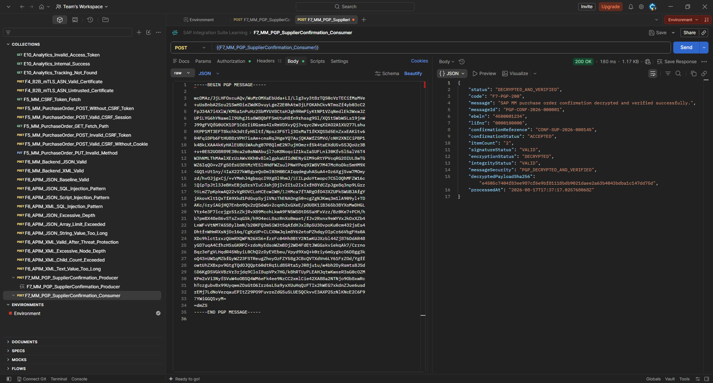

**Evidência 09:** o Postman apresenta o bloco OpenPGP enviado ao Consumer e a resposta `200 OK`. A resposta contém `F7-PGP-200`, o pedido `4500001234`, o fornecedor `0000100000`, dois itens e os status `VALID`, `DECRYPTED` e `VALID`. O resultado comprova que a secret key correta foi localizada, a mensagem foi descriptografada, a assinatura foi verificada e o JSON recuperado passou pela validação funcional.

## 5.6 Processamento do Consumer

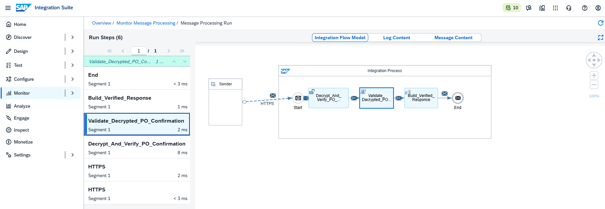

**Evidência 10:** o Integration Flow Model mostra a execução completa do Consumer. A mensagem atravessa o PGP Decryptor, o Groovy de validação e o Content Modifier responsável pela resposta. A execução dos steps posteriores ao Decryptor diferencia esse cenário positivo das rejeições documentadas nos testes negativos.

## 5.7 Mensagem criptografada na entrada

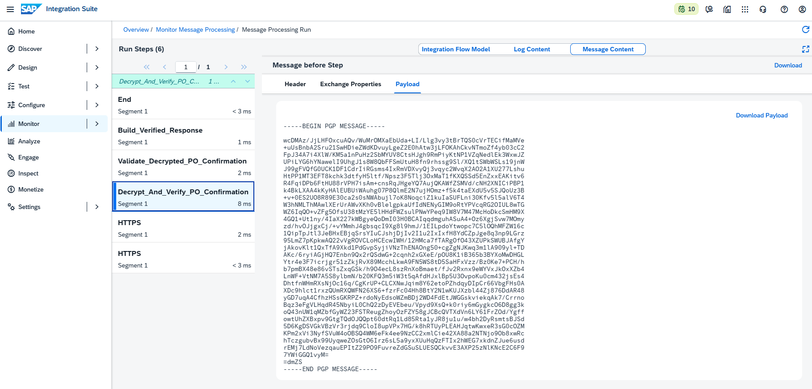

**Evidência 11:** o `Message before Step` do PGP Decryptor contém o bloco OpenPGP armored completo. O JSON SAP MM ainda não está disponível em texto aberto nesse ponto. A captura comprova que a descriptografia ocorre dentro do componente de segurança, e não no HTTPS Sender ou em um script customizado.

## 5.8 Resposta verificada no End

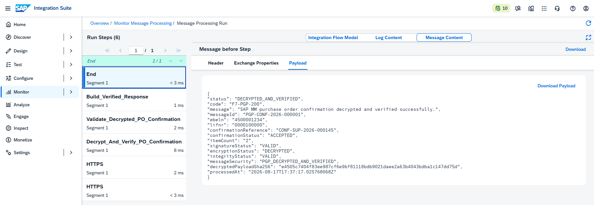

**Evidência 12:** o Message Content no final do Consumer contém a resposta funcional consolidada, incluindo `DECRYPTED_AND_VERIFIED`, `F7-PGP-200`, dados do pedido, referência da confirmação, quantidade de itens, status da assinatura, status da descriptografia, status de integridade, marcador de segurança, SHA-256 do payload recuperado e timestamp de processamento.

---

# 6. Teste negativo: mensagem adulterada

## 6.1 Objetivo

Comprovar que uma alteração no conteúdo protegido impede a recuperação do documento e interrompe o fluxo antes da validação SAP MM.

A mensagem positiva foi copiada e um caractere do conteúdo armored foi alterado, preservando os delimitadores:

```text
-----BEGIN PGP MESSAGE-----
...
-----END PGP MESSAGE-----
```

## 6.2 Resultado no Postman

| Elemento | Resultado |
|---|---|
| Entrada | Mensagem OpenPGP adulterada |
| Envelope armored | Preservado |
| Resultado HTTP | `500 Internal Server Error` |
| Resposta `F7-PGP-200` | Não produzida |
| JSON SAP MM recuperado | Não |

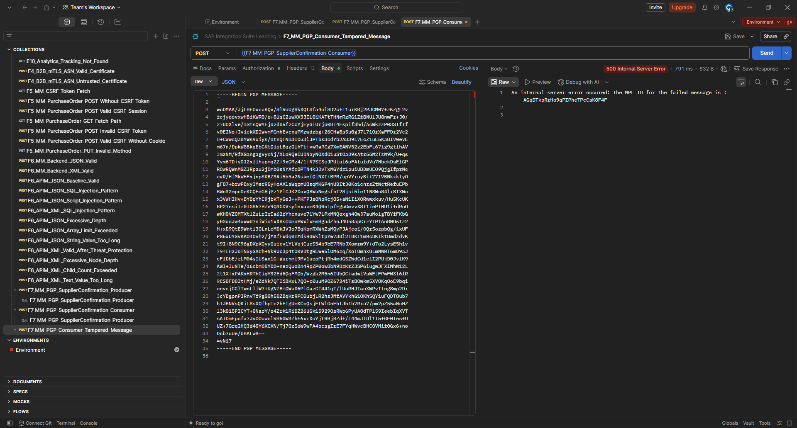

**Evidência 13:** o Postman envia a mensagem adulterada ao Consumer e recebe `500 Internal Server Error`. A resposta contém o MPL ID da execução, mas não contém `DECRYPTED_AND_VERIFIED`, dados do pedido ou status de segurança válidos. A mensagem foi rejeitada antes de produzir qualquer resposta funcional.

## 6.3 Status no Monitor

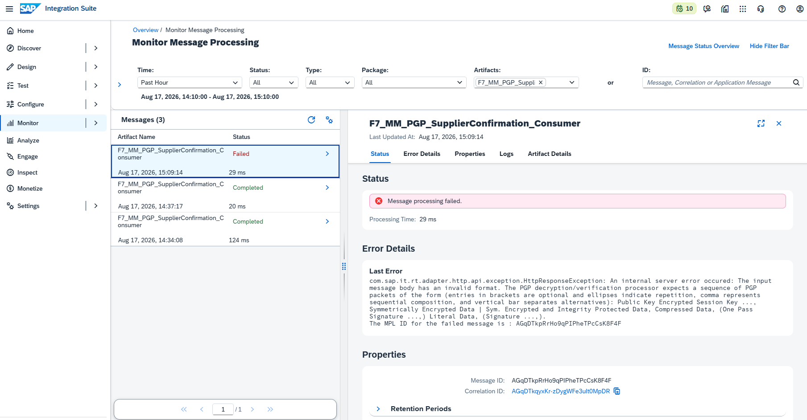

**Evidência 14:** o Monitor registra a execução do Consumer como `Failed`. A tela apresenta o erro técnico, Message ID e Correlation ID, permitindo relacionar a falha observada no Postman ao processamento interno do Cloud Integration.

## 6.4 Ponto de interrupção

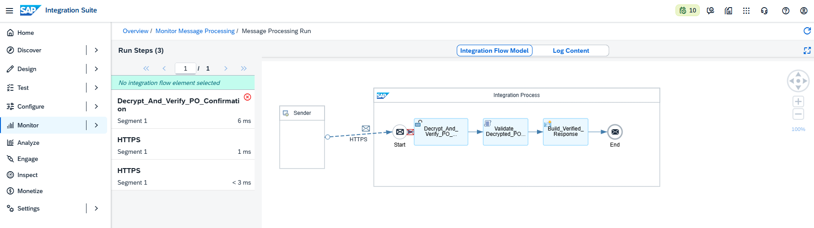

**Evidência 15:** o Integration Flow Model mostra somente o HTTPS Sender e o PGP Decryptor entre os Run Steps. O erro está associado a `Decrypt_And_Verify_PO_Confirmation`. O Groovy `Validate_Decrypted_PO_Confirmation` e o `Build_Verified_Response` não foram executados, impedindo que dados adulterados chegassem à lógica SAP MM.

---

# 7. Teste negativo: mensagem criptografada sem assinatura

## 7.1 Producer temporário

Foi criada uma cópia isolada do Producer para gerar uma mensagem criptografada sem assinatura. O Producer principal não foi alterado.

| Propriedade | Valor |
|---|---|
| Name | `F7_MM_PGP_Unsigned_Message_Test_Producer` |
| Endpoint | `/f7/mm/pgp/supplier-confirmation/encrypt-unsigned` |
| Finalidade | Gerar mensagem criptografada com `Signatures: None` |

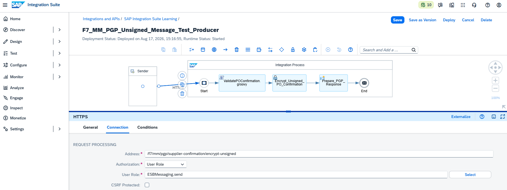

**Evidência 16:** a captura mostra o Producer temporário implantado e iniciado, com endpoint próprio. A separação evita regressão no fluxo positivo e torna explícito que o artefato existe somente para o teste negativo.

## 7.2 Encryptor sem assinatura

| Parâmetro | Valor |
|---|---|
| Signatures | `None` |
| Content Encryption Algorithm | `AES` |
| Secret Key Length | `256` |
| Compression Algorithm | `ZIP` |
| Armored | `Enabled` |
| Integrity Protected Data Packet | `Enabled` |
| Encryption Key User ID | `${property.pgpRecipientUserId}` |

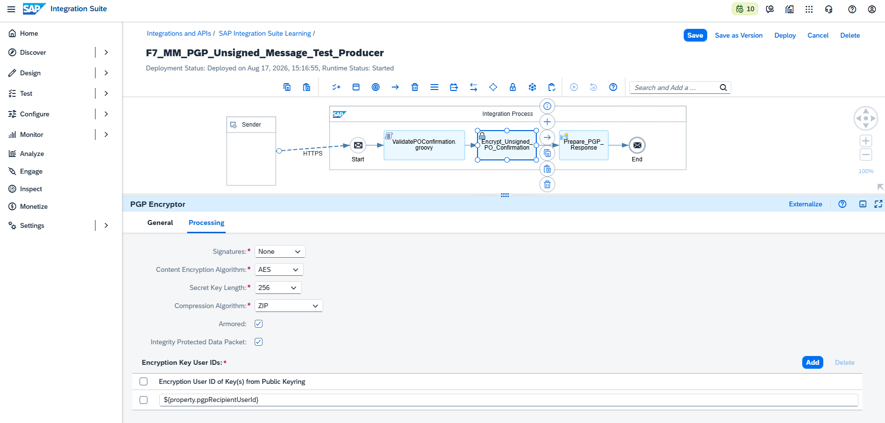

**Evidência 17:** a aba `Processing` mostra que a assinatura foi desativada enquanto a criptografia AES-256, compactação ZIP, saída armored e pacote de integridade permaneceram ativos. A mensagem resultante continua confidencial, mas não possui uma identidade criptográfica verificável.

## 7.3 Geração da mensagem unsigned

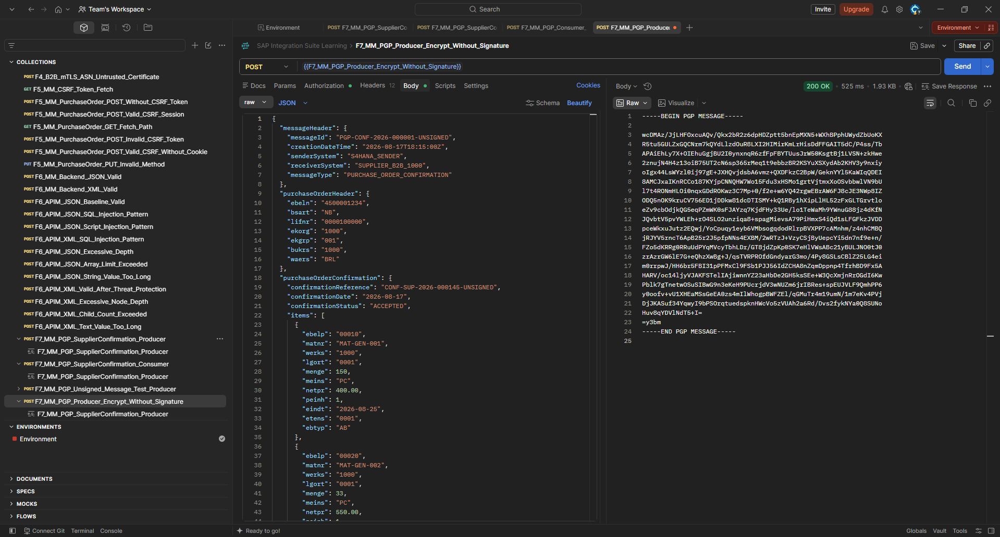

**Evidência 18:** o Postman envia um JSON identificado com `UNSIGNED` ao Producer temporário e recebe `200 OK` com um bloco OpenPGP completo. A geração bem-sucedida comprova que a mensagem é criptografada e transportável, embora a assinatura tenha sido omitida pela configuração do Encryptor.

## 7.4 Rejeição no Consumer

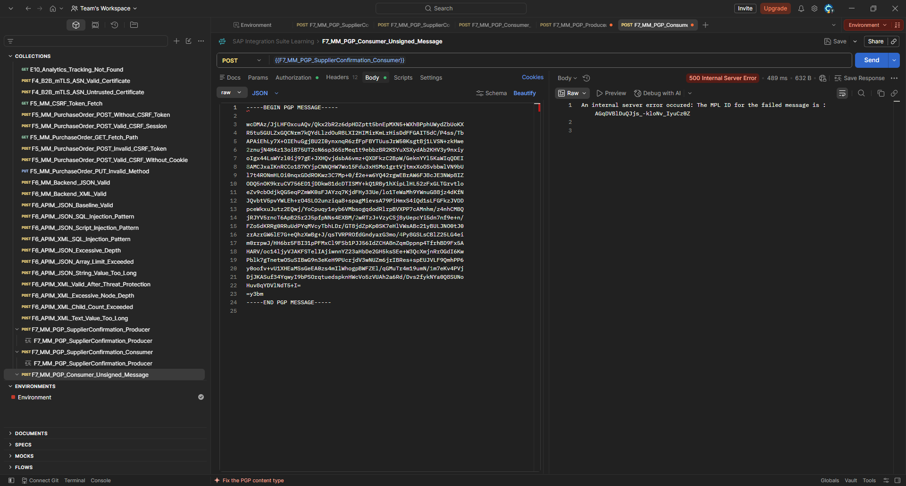

**Evidência 19:** a mensagem unsigned é enviada ao Consumer principal, que responde `500 Internal Server Error`. A resposta positiva `F7-PGP-200` não é produzida. O MPL ID permite localizar a execução no Monitor.

## 7.5 Causa explícita

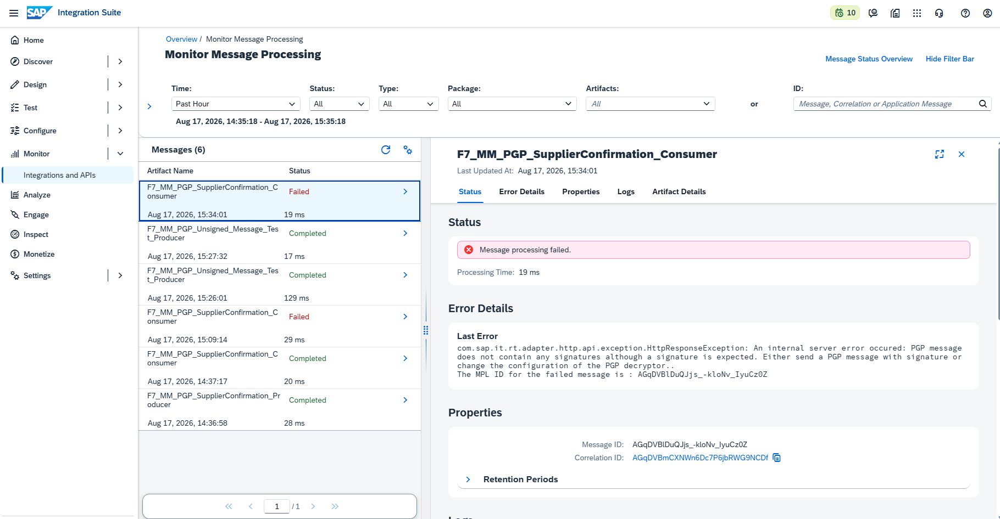

**Evidência 20:** o Monitor apresenta explicitamente que a mensagem PGP não contém assinatura embora uma assinatura seja esperada. O erro orienta enviar uma mensagem com assinatura ou alterar a configuração do Decryptor. No cenário, a configuração não deve ser flexibilizada porque a exigência de assinatura faz parte do contrato de segurança B2B.

## 7.6 Fluxo interrompido

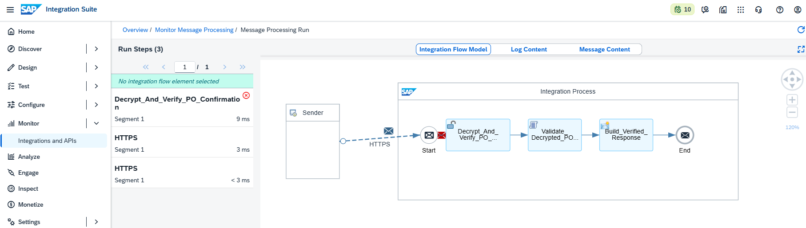

**Evidência 21:** o Integration Flow Model registra a falha no PGP Decryptor. O Groovy e a resposta funcional não são executados, comprovando que uma mensagem confidencial, mas sem autenticidade verificável, não é aceita pelo processo.

## 7.7 Conteúdo recebido

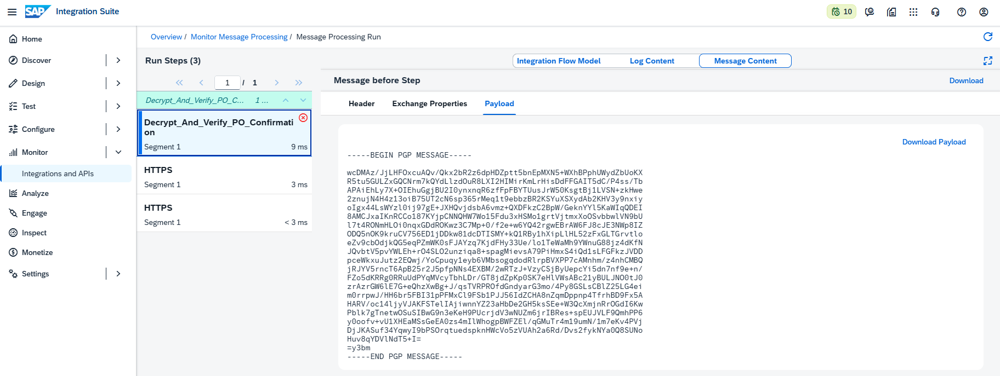

**Evidência 22:** o `Message before Step` mostra um bloco OpenPGP armored completo antes do Decryptor. A captura comprova que o HTTPS Sender recebeu e encaminhou a mensagem. A rejeição ocorreu no controle de assinatura do componente PGP.

---

# 8. Teste negativo: chave de assinatura diferente da autorizada

## 8.1 Objetivo e cautela interpretativa

O Consumer permite somente:

```text
F7 Sender B2B Signing
```

Foi criado um Producer alternativo que utilizou:

```text
F7 Supplier B2B Encryption
```

como chave de assinatura. O runtime rejeitou a mensagem no PGP Decryptor. Entretanto, a mensagem técnica apresentada pela SAP foi genérica e descreveu falha de validação da estrutura OpenPGP. Por isso, o documento registra o resultado observado sem afirmar que o texto do erro declarou literalmente “unauthorized signer”.

## 8.2 Producer alternativo

| Parâmetro | Valor |
|---|---|
| Name | `F7_MM_PGP_Unauthorized_Signer_Test_Producer` |
| Signatures | `Including` |
| Content Encryption Algorithm | `AES` |
| Secret Key Length | `256` |
| Compression Algorithm | `ZIP` |
| Armored | `Enabled` |
| Integrity Protected Data Packet | `Enabled` |
| Encryption Key User ID | `${property.pgpRecipientUserId}` |
| Signature Algorithm | `SHA-512` |
| Signer Key User ID | `F7 Supplier B2B Encryption` |

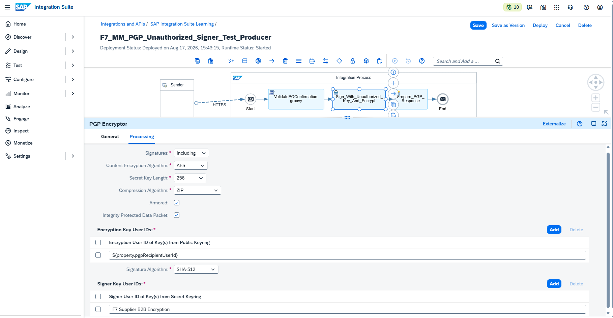

**Evidência 23:** a captura consolida o artefato implantado e a configuração do PGP Encryptor. A mensagem é criptografada para o destinatário esperado, mas assinada com `F7 Supplier B2B Encryption`, diferente do User ID autorizado no Consumer.

## 8.3 Geração da mensagem

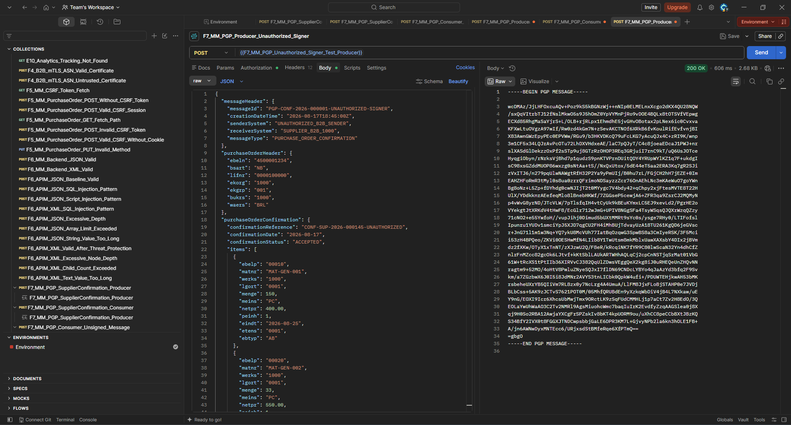

**Evidência 24:** o Postman envia o JSON identificado como `UNAUTHORIZED-SIGNER` ao Producer alternativo. O retorno `200 OK` contém uma mensagem OpenPGP armored completa, comprovando que o artefato conseguiu assinar e criptografar usando a configuração alternativa.

## 8.4 Rejeição no Consumer

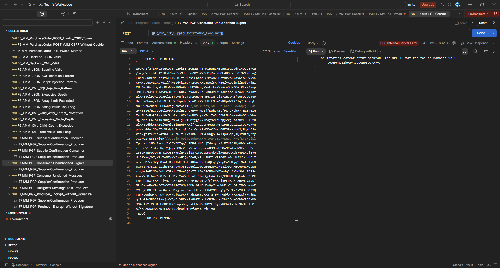

**Evidência 25:** a mensagem é enviada ao Consumer principal e resulta em `500 Internal Server Error`. Não são retornados `F7-PGP-200`, `DECRYPTED_AND_VERIFIED` ou os status positivos de segurança.

## 8.5 Falha de validação OpenPGP

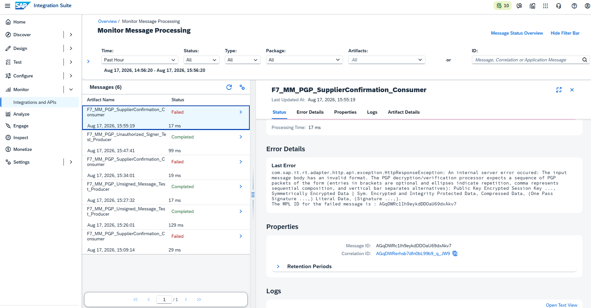

**Evidência 26:** o Monitor registra o Consumer como `Failed` e apresenta uma mensagem genérica indicando que o body não correspondeu à sequência de pacotes OpenPGP esperada pelo PGP Decryptor. O nome da evidência permanece neutro porque a mensagem técnica não identifica textualmente o signatário como não autorizado.

## 8.6 Interrupção no PGP Decryptor

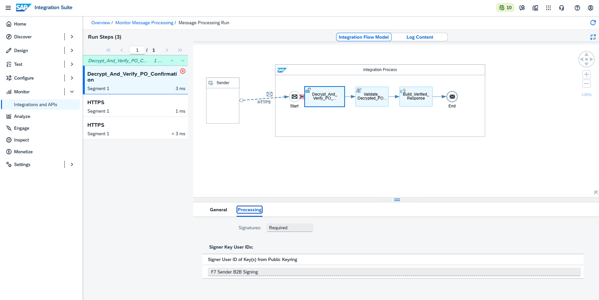

**Evidência 27:** o Integration Flow Model mostra a interrupção no PGP Decryptor e somente três Run Steps executados. A configuração visível exige assinatura e apresenta `F7 Sender B2B Signing` como User ID permitido. O Groovy de validação e a resposta funcional não foram executados.

---

# 9. Matriz consolidada de testes

| Cenário | Criptografia | Assinatura | Condição especial | Resultado | Ponto final |
|---|---|---|---|---|---|
| Mensagem positiva | Válida | Sender autorizado | Documento íntegro | `200 F7-PGP-200` | End do Consumer |
| Mensagem adulterada | Conteúdo alterado | Original afetada | Um caractere modificado | Rejeitada | PGP Decryptor |
| Mensagem unsigned | Válida | Ausente | Consumer exige `Required` | Rejeitada | PGP Decryptor |
| Chave de assinatura alternativa | Válida | Chave diferente | Consumer permite apenas Sender | Rejeitada | PGP Decryptor |

# 10. Troubleshooting

## 10.1 Python 3.13 e PGPy

O pacote PGPy utilizado inicialmente dependia do módulo `imghdr`, removido do Python 3.13. A compatibilidade foi restabelecida localmente com uma redistribuição do módulo. Essa dependência ocorreu somente na geração local das chaves, não no runtime SAP.

## 10.2 User ID gravado dentro da chave

Renomear os arquivos `.asc` não altera o User ID e o e-mail gravados na chave OpenPGP. Os pares foram regenerados com identificadores genéricos:

```text
F7 Sender B2B Signing
f7-sender-signing@example.invalid
```

```text
F7 Supplier B2B Encryption
f7-supplier-encryption@example.invalid
```

## 10.3 Warning do HTTPS Sender para o PGP Decryptor

O editor apresentou um Design Guideline warning indicando que o HTTPS Sender poderia não entregar uma mensagem binária ao PGP Decryptor. O teste real com `Content-Type: application/pgp-encrypted` e body ASCII armored funcionou. Nenhum conversor adicional foi inserido antes do Decryptor.

## 10.4 Arquivos salvos em pasta de outro laboratório

Algumas respostas do Postman foram inicialmente salvas em `F4-mTLS-Temp`. Os arquivos foram movidos para `F7-PGP-Temp` para manter separação de materiais temporários por cenário.

## 10.5 Mensagem adulterada

A alteração de um caractere no conteúdo armored preservou os delimitadores externos, mas produziu uma mensagem rejeitada pelo Decryptor. O erro foi classificado como formato OpenPGP inválido antes da validação SAP MM.

## 10.6 Mensagem sem assinatura

O erro do runtime foi explícito: a mensagem não continha assinatura embora uma assinatura fosse esperada. Esse resultado confirmou diretamente a aplicação de `Signatures: Required`.

## 10.7 Chave de assinatura alternativa

O Producer alternativo concluiu a geração da mensagem, mas o Consumer rejeitou o conteúdo com erro genérico relacionado à sequência de pacotes OpenPGP. O documento evita atribuir ao runtime uma mensagem literal sobre signatário não autorizado que não foi apresentada na tela.

---

# 11. Boas práticas aplicadas

## 11.1 User IDs obtidos por exchange properties

O PGP Encryptor usa:

```text
${property.pgpRecipientUserId}
${property.pgpSenderUserId}
```

A SAP alerta para implicações de segurança quando o User ID da chave é derivado de headers influenciáveis por adapters ou consumidores. Exchange properties internas reduzem esse risco.  
Referência oficial: [Define PGP Encryptor — SAP Help Portal](https://help.sap.com/docs/integration-suite/isuite-integrations-and-apis/define-pgp-encryptor)

## 11.2 Algoritmos fortes

| Uso | Algoritmo |
|---|---|
| Criptografia de conteúdo | AES-256 |
| Assinatura | SHA-512 |
| Hash funcional de rastreabilidade | SHA-256 |

## 11.3 Assinatura obrigatória

O Consumer foi configurado com `Signatures: Required`. Uma mensagem apenas criptografada não é suficiente para o processo B2B, pois confidencialidade não comprova a origem.

## 11.4 Defesa em profundidade

PGP não substitui:

- TLS ou mTLS;
- autenticação e autorização;
- validação de schema;
- validação funcional;
- controle de replay;
- monitoramento;
- rotação de chaves;
- governança de parceiros.

## 11.5 Validação após a descriptografia

O JSON recuperado é validado novamente pelo Consumer. Uma assinatura válida comprova origem e integridade, mas não garante que os valores atendam às regras do processo SAP MM.

## 11.6 Retenção mínima de dados sensíveis

Secret keys, passphrases e arquivos temporários não devem ser gravados no GitHub. Em produção, payloads descriptografados não devem ser registrados integralmente em Trace, exceto durante troubleshooting controlado e com dados não sensíveis.

## 11.7 Rotação e expiração

A operação produtiva deve prever:

- período de sobreposição entre chave antiga e nova;
- distribuição controlada das public keys;
- atualização antes da expiração;
- revogação em caso de comprometimento;
- identificação clara do parceiro e da finalidade;
- testes de regressão após a troca.

---

# 12. Recomendações adicionais para produção

- Combinar OpenPGP com mTLS para proteger canal e conteúdo.
- Usar uma chave de assinatura dedicada ao Sender e uma chave de criptografia dedicada ao Supplier.
- Não reutilizar a mesma secret key para múltiplas finalidades ou parceiros.
- Definir expiração compatível com a política corporativa.
- Automatizar alertas de expiração de chaves.
- Usar aliases e properties externalizadas por ambiente sem permitir controle pelo caller.
- Proteger diretórios temporários e limpar arquivos descriptografados.
- Implementar prevenção de replay usando `messageId`, timestamp e store de idempotência.
- Validar `creationDateTime` contra uma janela de aceitação.
- Registrar correlation ID sem registrar conteúdo sensível.
- Criar tratamento controlado de exceção para evitar respostas técnicas genéricas HTTP 500.
- Executar testes negativos após cada rotação de chave.
- Transportar artefatos por pipeline, evitando alterações manuais em produção.
- Manter inventário de fingerprints compartilhado com cada parceiro B2B.

---

# 13. Conclusão

O cenário demonstrou segurança OpenPGP em nível de mensagem para uma confirmação de pedido de compra SAP MM.

No caminho positivo:

```text
JSON validado
→ assinatura com a secret key do Sender
→ criptografia com a public key do Supplier
→ mensagem OpenPGP armored
→ descriptografia com a secret key do Supplier
→ verificação com a public key do Sender
→ validação SAP MM
→ F7-PGP-200
```

Nos caminhos negativos:

```text
Mensagem adulterada
→ rejeitada no PGP Decryptor
```

```text
Mensagem sem assinatura
→ rejeitada porque Signatures = Required
```

```text
Mensagem produzida com chave de assinatura diferente
→ rejeitada no PGP Decryptor
```

O laboratório comprova que confidencialidade, autenticidade, integridade e validação funcional são controles distintos e complementares. O backend somente recebe dados funcionais após o sucesso das verificações criptográficas.

**Recursos praticados:** OpenPGP · PGP Public Keyring · PGP Secret Keyring · PGP Encryptor · PGP Decryptor · AES-256 · SHA-512 · SHA-256 · ASCII Armor · Integrity Protected Data Packet · Groovy · JSON Streaming · SAP MM Purchase Order Confirmation · B2B Security

**Cenário anterior:** [F6 — API Threat Protection](./28-f6-api-threat-protection.md)  
**Próximo cenário:** [F8 — SAML e Principal Propagation](./30-f8-saml-principal-propagation.md)

---

## 📚 Referências oficiais SAP

- [How OpenPGP Works](https://help.sap.com/docs/integration-suite/isuite-integrations-and-apis/how-openpgp-works)
- [Define PGP Encryptor](https://help.sap.com/docs/integration-suite/isuite-integrations-and-apis/define-pgp-encryptor)
- [Define PGP Decryptor](https://help.sap.com/docs/integration-suite/isuite-integrations-and-apis/define-pgp-decryptor)
- [Deploying a PGP Public Keyring](https://help.sap.com/docs/integration-suite/isuite-integrations-and-apis/deploying-pgp-public-keyring)
- [Deploying a PGP Secret Keyring](https://help.sap.com/docs/integration-suite/isuite-integrations-and-apis/deploying-pgp-secret-keyring)
- [Define Security-Related Steps](https://help.sap.com/docs/integration-suite/isuite-integrations-and-apis/define-security-related-steps)

---

### 🛠️ Ferramentas utilizadas

- SAP Integration Suite — Cloud Integration
- SAP BTP Process Integration Runtime
- SAP Integration Suite PGP Key Management
- Postman
- Python 3.13
- PGPy
- PowerShell
- Groovy
- Visual Studio Code
- Git e GitHub

---

### 👤 Autor / 📬 Contato

[](https://www.linkedin.com/in/orlando-caetano/)
[](https://github.com/OrlandoCaetano2026)

**Orlando Caetano**  
Especialista SAP • Integração • Inteligência Artificial  
Consultor SAP MM com know-how em PP, QM e WM

> 📌 Projeto de estudo e portfólio. Os cenários SAP MM, PP e QM são simulações educativas para prática de integração.
