# F8 — Authentication Context, Technical User SAML Bearer e End-User Principal Propagation

## 🧾 Perfil técnico

| Campo | Detalhe |
|---|---|
| Bloco | F — Segurança |
| Cenários | F8A — Authentication Context Capture · F8B — Technical User OAuth 2.0 SAML Bearer · F8C — End-User Principal Propagation Exploration |
| Nível | Avançado |
| Tecnologias principais | SAP Integration Suite, Cloud Integration, Groovy, XML Digital Signer, WSO2 Identity Server, SAP Cloud Identity Services, SAP BTP Cloud Foundry, Approuter, XSUAA e Destination Service |
| Domínio funcional | SAP MM — Purchase Requisition |
| Padrões praticados | OAuth 2.0 Client Credentials, RFC 7522, RFC 7662, RFC 7523, SAML 2.0, JWT e autorização baseada em grupos |
| Objetivo | Demonstrar como uma integração identifica, autentica, propaga e autoriza uma identidade técnica ou humana sem confiar em informações controladas pelo consumidor |
| Resultado global | F8A e F8B concluídos com sucesso; F8C concluiu autenticação humana no BTP e identificou um boundary de confiança que impediu a propagação ao runtime gerenciado do Cloud Integration |

---

## 🎯 Visão executiva

Este documento consolida três etapas progressivas de identidade e autorização no SAP Integration Suite.

O **F8A** estabelece o baseline de segurança. O cenário confirma que uma chamada autenticada por OAuth 2.0 Client Credentials representa um cliente técnico, não um usuário humano. O iFlow também detecta tentativas de identity spoofing por headers customizados e rejeita esses valores como fonte confiável de identidade.

O **F8B** implementa o perfil OAuth 2.0 SAML Bearer de forma independente de fornecedor, utilizando o WSO2 Identity Server como Authorization Server externo. O SAP Integration Suite constrói uma assertion SAML, assina o XML com uma chave privada do Keystore, troca a assertion por um access token, introspecta o token e aplica uma política de autorização para operações de consulta e aprovação de Purchase Requisitions.

O **F8C** amplia a investigação para um usuário humano real. O cenário provisiona grupos e usuários no SAP Cloud Identity Services, implanta um Approuter no SAP BTP Cloud Foundry, configura XSUAA e Destination Service e comprova o login interativo de Buyer e Purchasing Manager. A etapa final, encaminhar essa identidade até o iFlow mantendo simultaneamente a autenticação técnica exigida pelo runtime do Cloud Integration, não foi concluída no ambiente trial. Quatro abordagens foram analisadas, permitindo localizar precisamente o boundary de confiança entre a XSUAA controlada pela aplicação e o serviço gerenciado `it-rt`.

O valor técnico do conjunto está na progressão:

1. Não confiar em identidade declarada pelo cliente.
2. Estabelecer confiança criptográfica por assertion assinada.
3. Validar o token emitido por um Authorization Server.
4. Separar autenticação de autorização.
5. Compreender quando principal propagation depende de um domínio de confiança compartilhado.
6. Documentar limitações arquiteturais sem mascará-las como sucesso funcional.

---

## 🏗️ Arquitetura consolidada

O diagrama abaixo apresenta a evolução dos três cenários. O F8A estabelece o baseline de confiança, o F8B implementa a federação técnica por SAML Bearer e o F8C investiga a propagação de um usuário humano autenticado no SAP BTP.

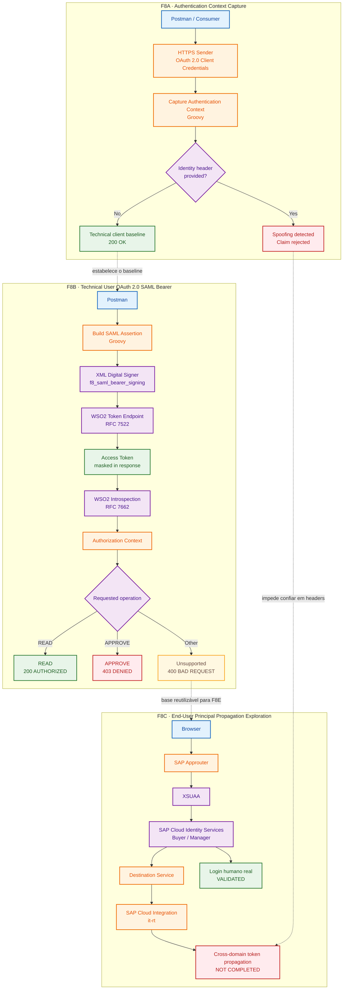
```mermaid
flowchart TB
    classDef entry fill:#e3f2fd,stroke:#1565c0,color:#0d47a1,stroke-width:2px
    classDef cpi fill:#fff3e0,stroke:#ef6c00,color:#e65100,stroke-width:2px
    classDef security fill:#f3e5f5,stroke:#7b1fa2,color:#4a148c,stroke-width:2px
    classDef success fill:#e8f5e9,stroke:#2e7d32,color:#1b5e20,stroke-width:2px
    classDef warning fill:#fff8e1,stroke:#f9a825,color:#6d4c41,stroke-width:2px
    classDef denied fill:#ffebee,stroke:#c62828,color:#b71c1c,stroke-width:2px

    subgraph F8A["F8A · Authentication Context Capture"]
        A1["Postman / Consumer"]:::entry
        A2["HTTPS Sender<br/>OAuth 2.0 Client Credentials"]:::cpi
        A3["Capture Authentication Context<br/>Groovy"]:::cpi
        A4{"Identity header<br/>provided?"}:::security
        A5["Technical client baseline<br/>200 OK"]:::success
        A6["Spoofing detected<br/>Claim rejected"]:::denied
        A1 --> A2 --> A3 --> A4
        A4 -->|No| A5
        A4 -->|Yes| A6
    end

    subgraph F8B["F8B · Technical User OAuth 2.0 SAML Bearer"]
        B1["Postman"]:::entry
        B2["Build SAML Assertion<br/>Groovy"]:::cpi
        B3["XML Digital Signer<br/>f8_saml_bearer_signing"]:::security
        B4["WSO2 Token Endpoint<br/>RFC 7522"]:::security
        B5["Access Token<br/>masked in response"]:::success
        B6["WSO2 Introspection<br/>RFC 7662"]:::security
        B7["Authorization Context"]:::cpi
        B8{"Requested operation"}:::security
        B9["READ<br/>200 AUTHORIZED"]:::success
        B10["APPROVE<br/>403 DENIED"]:::denied
        B11["Unsupported<br/>400 BAD REQUEST"]:::warning
        B1 --> B2 --> B3 --> B4 --> B5 --> B6 --> B7 --> B8
        B8 -->|READ| B9
        B8 -->|APPROVE| B10
        B8 -->|Other| B11
    end

    subgraph F8C["F8C · End-User Principal Propagation Exploration"]
        C1["Browser"]:::entry
        C2["SAP Approuter"]:::cpi
        C3["XSUAA"]:::security
        C4["SAP Cloud Identity Services<br/>Buyer / Manager"]:::security
        C5["Destination Service"]:::cpi
        C6["SAP Cloud Integration<br/>it-rt"]:::cpi
        C7["Login humano real<br/>VALIDATED"]:::success
        C8["Cross-domain token propagation<br/>NOT COMPLETED"]:::denied
        C1 --> C2 --> C3 --> C4
        C4 --> C7
        C4 --> C5 --> C6 --> C8
    end

    A5 -. "estabelece o baseline" .-> B1
    A6 -. "impede confiar em headers" .-> C8
    B11 -. "base reutilizável para F8E" .-> C1
```

### Leitura da arquitetura

- **F8A:** comprova que Client Credentials representa um cliente técnico e que headers controlados pelo consumidor não são identidade confiável.
- **F8B:** estabelece uma cadeia criptográfica controlada entre CPI e WSO2, incluindo emissão, introspecção e autorização.
- **F8C:** valida o login humano real no BTP, mas identifica um boundary de confiança antes do CPI que impede concluir a propagação cross-domain no ambiente testado.

---

## 📚 Fundamentos

### Authentication Context

Authentication Context é o conjunto de informações confiáveis que o runtime disponibiliza sobre a autenticação de uma chamada. Em OAuth 2.0 Client Credentials, o principal representa uma aplicação ou cliente técnico. Nenhum usuário humano participa do grant.

### Identity spoofing

Identity spoofing ocorre quando o consumidor envia um valor como `X-Authenticated-User`, `X-Principal` ou `X-User` e tenta tratá-lo como identidade confiável. O valor pode ser útil como dado de negócio ou correlação, mas não substitui uma prova criptográfica emitida por um Identity Provider ou Authorization Server.

### Technical User Propagation

Technical User Propagation envia ao sistema de destino uma identidade fixa de serviço. O principal não muda conforme a pessoa que iniciou a operação. O F8B pratica esse modelo com `f8.technical.purchasing.user`.

### End-User Principal Propagation

End-User Principal Propagation preserva a identidade do usuário humano autenticado ao atravessar componentes intermediários. O backend deve confiar no emissor, no token e no mecanismo de delegação. O simples encaminhamento de um nome, e-mail ou header não caracteriza principal propagation seguro.

### RFC 7522

O perfil SAML 2.0 Bearer para OAuth 2.0 permite utilizar uma assertion SAML como authorization grant. O Authorization Server valida assinatura, issuer, subject, audience, recipient e janela temporal antes de emitir um access token.

### RFC 7662

Token Introspection permite consultar se um token está ativo e recuperar metadados como subject, client e escopo. A introspecção não substitui a política de autorização do recurso protegido.

### RFC 7523

O JWT Profile for OAuth 2.0 permite usar um JWT como grant ou autenticação de cliente. Em cenários entre clientes e resource servers diferentes, o trust e as autorizações de cross-consumption precisam estar corretamente estabelecidos.

---

# 🅰️ F8A — Authentication Context Capture

## 1. Objetivo

O F8A responde duas perguntas:

1. Qual identidade o CPI consegue afirmar quando a chamada usa Client Credentials?
2. O que acontece se o consumidor tentar declarar uma identidade humana por header?

O cenário deve provar que:

- o principal autenticado é técnico;
- o usuário humano não é exposto como parte do Client Credentials grant;
- headers controlados pelo consumidor não são aceitos como identidade;
- a resposta não expõe tokens ou credenciais.

## 2. iFlow

**Artifact Name**

```text
F8A_MM_Authenticated_Principal_Capture
```

**Title**

```text
F8A - Authentication Context Capture
```

**Short Text**

```text
Captures the inbound technical authentication context and rejects untrusted identity claims.
```

## 3. Fluxo

```text
HTTPS Sender
    |
    v
Capture_Authentication_Context
    |
    v
Build_Context_Response
    |
    v
End Message
```

## 4. HTTPS Sender

| Campo | Configuração |
|---|---|
| Address | `/f8a/mm/authenticated-principal` |
| Authorization | `User Role` |
| User Role | `ESBMessaging.send` |
| CSRF Protected | Desabilitado para o GET de laboratório |

## 5. Runtime Configuration

Os headers foram liberados para que o iFlow pudesse detectar a tentativa de spoofing. Liberar um header não significa confiar no seu valor.

```text
X-Authenticated-User|X-Principal|X-User
```

## 6. Groovy — `Capture_Authentication_Context`

```groovy
import com.sap.gateway.ip.core.customdev.util.Message
import java.time.Instant

def Message processData(Message message) {
    String claimedUser = message.getHeader(
        "X-Authenticated-User",
        String
    )?.trim()

    String claimedPrincipal = message.getHeader(
        "X-Principal",
        String
    )?.trim()

    String claimedUserAlternative = message.getHeader(
        "X-User",
        String
    )?.trim()

    boolean spoofingAttemptDetected = (
        claimedUser != null ||
        claimedPrincipal != null ||
        claimedUserAlternative != null
    )

    message.setProperty(
        "technicalPrincipal",
        "TECHNICAL_CLIENT"
    )

    message.setProperty(
        "authenticatedPrincipal",
        "NOT_EXPOSED_BY_RUNTIME"
    )

    message.setProperty(
        "claimedPrincipalDetected",
        spoofingAttemptDetected
    )

    message.setProperty(
        "claimedPrincipalAccepted",
        false
    )

    message.setProperty(
        "claimedPrincipalValue",
        claimedUser ?: claimedPrincipal ?: claimedUserAlternative ?: "NOT_PROVIDED"
    )

    message.setProperty(
        "securityNote",
        "Identity claims transmitted through consumer-controlled HTTP headers are not trusted without cryptographic proof."
    )

    message.setProperty(
        "capturedAt",
        Instant.now().toString()
    )

    return message
}
```

## 7. Content Modifier — resposta

```json
{
  "scenario": "F8A_AUTHENTICATION_CONTEXT_CAPTURE",
  "technicalPrincipal": "${property.technicalPrincipal}",
  "authenticatedPrincipal": "${property.authenticatedPrincipal}",
  "claimedPrincipalDetected": ${property.claimedPrincipalDetected},
  "claimedPrincipalAccepted": ${property.claimedPrincipalAccepted},
  "claimedPrincipalValue": "${property.claimedPrincipalValue}",
  "securityNote": "${property.securityNote}",
  "capturedAt": "${property.capturedAt}"
}
```

## 8. Teste baseline

A chamada usa credenciais técnicas válidas e não envia headers de identidade.

Resultado esperado:

```json
{
  "scenario": "F8A_AUTHENTICATION_CONTEXT_CAPTURE",
  "technicalPrincipal": "TECHNICAL_CLIENT",
  "authenticatedPrincipal": "NOT_EXPOSED_BY_RUNTIME",
  "claimedPrincipalDetected": false,
  "claimedPrincipalAccepted": false,
  "claimedPrincipalValue": "NOT_PROVIDED"
}
```

## 9. Teste de spoofing

Headers de exemplo:

```text
X-Authenticated-User: buyer.user@example.invalid
X-Principal: purchasing.manager@example.invalid
```

Resultado esperado:

```json
{
  "scenario": "F8A_AUTHENTICATION_CONTEXT_CAPTURE",
  "technicalPrincipal": "TECHNICAL_CLIENT",
  "authenticatedPrincipal": "NOT_EXPOSED_BY_RUNTIME",
  "claimedPrincipalDetected": true,
  "claimedPrincipalAccepted": false,
  "claimedPrincipalValue": "buyer.user@example.invalid"
}
```

## 10. Evidências do F8A

### Evidência 01 — iFlow F8A implantado

A captura apresenta o iFlow `F8A_MM_Authenticated_Principal_Capture` implantado, com HTTPS Sender, Groovy de captura do contexto e Content Modifier responsável pela resposta diagnóstica.

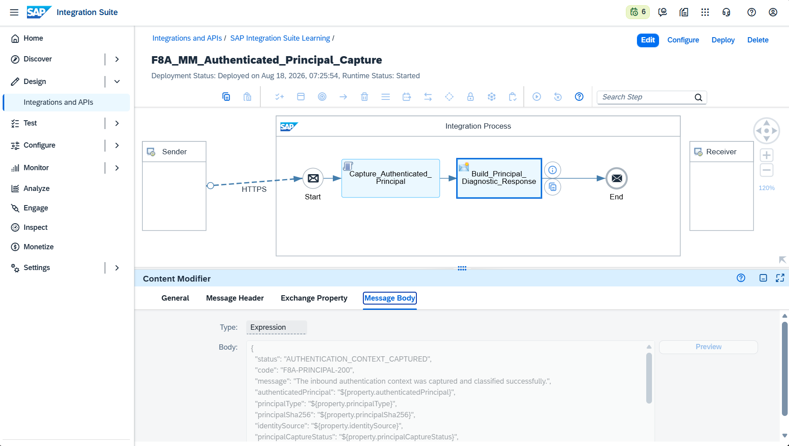

**O que esta evidência comprova:** A evidência comprova que o baseline de autenticação foi implementado no runtime do SAP Cloud Integration antes da execução dos testes de spoofing.

### Evidência 02 — Runtime Configuration do F8A

A captura mostra os Allowed Headers `X-Authenticated-User`, `X-Principal` e `X-User` configurados no iFlow.

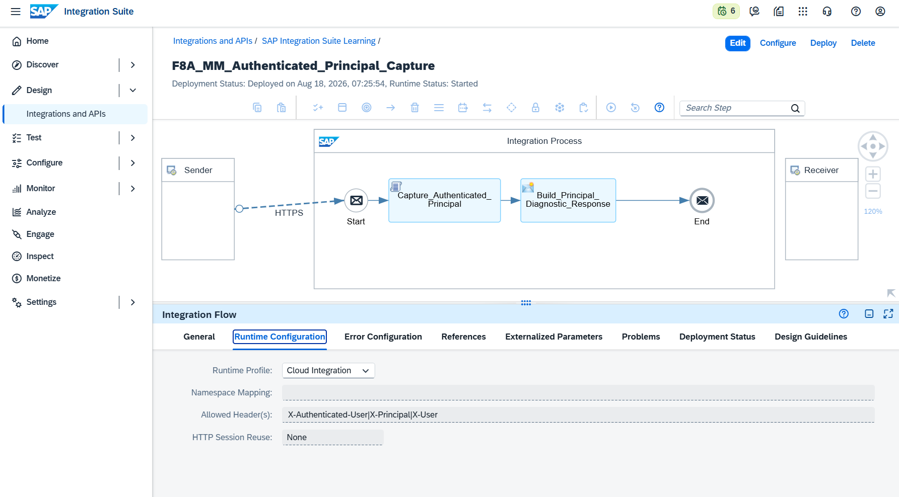

**O que esta evidência comprova:** Os headers foram liberados para detecção e diagnóstico. A configuração não transforma os valores recebidos em identidade confiável.

### Evidência 03 — Baseline com cliente técnico

A chamada Postman retorna `200 OK` sem identidade humana declarada, classificando o chamador como cliente técnico.

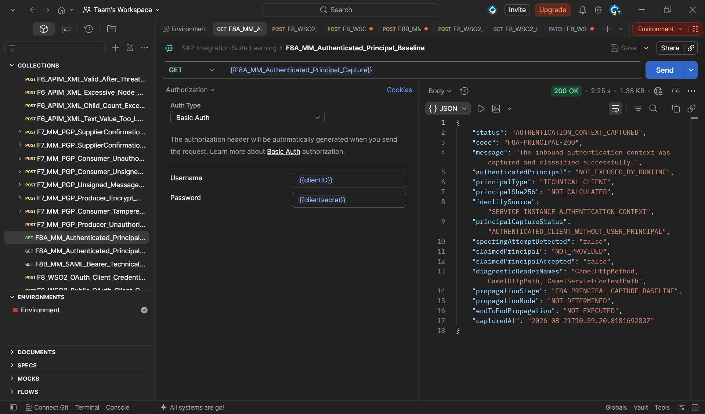

**O que esta evidência comprova:** A evidência confirma que OAuth 2.0 Client Credentials autentica a aplicação e não expõe um usuário humano.

### Evidência 04 — Tentativa de spoofing rejeitada

A chamada envia um principal por header e a resposta marca a tentativa como detectada, mantendo `claimedPrincipalAccepted=false`.

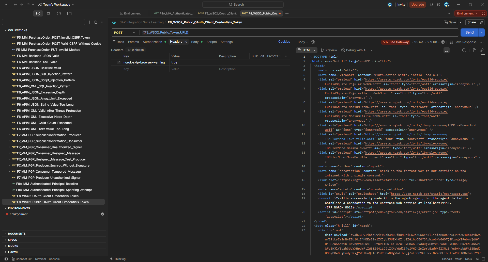

**O que esta evidência comprova:** A captura comprova o comportamento fail-closed: o valor é observado para auditoria, mas não é aceito como principal confiável.

## 11. Conclusão do F8A

| Verificação | Resultado |
|---|---|
| Client Credentials representa usuário humano | Não |
| Principal técnico identificado | Sim |
| Header customizado aceito como identidade | Não |
| Tentativa de spoofing detectada | Sim |
| Credencial ou token integral exposto | Não |

O F8A define a regra de segurança aplicada aos próximos cenários: uma identidade só será confiável quando derivada de um mecanismo de autenticação verificável, não de um valor informado pelo consumidor.

---

# 🅱️ F8B — Technical User OAuth 2.0 SAML Bearer

## 1. Objetivo

O F8B implementa uma cadeia de autenticação e autorização para um usuário técnico de compras:

1. Construir uma assertion SAML 2.0.
2. Assinar a assertion no CPI.
3. Trocar a assertion por um access token no WSO2.
4. Introspectar o token.
5. Aplicar autorização por operação.
6. Nunca expor o access token completo ao consumidor.

## 2. Justificativa da implementação vendor-neutral

O laboratório utiliza WSO2 como Authorization Server externo. A implementação usa Groovy, XML Digital Signer e HTTP Receiver para praticar diretamente os elementos do RFC 7522, independentemente de uma integração pré-configurada para um produto específico.

Essa abordagem torna visíveis os seguintes controles:

- issuer;
- subject;
- audience;
- recipient;
- tempo de validade;
- assinatura XML;
- client authentication no token endpoint;
- introspecção;
- decisão de autorização.

## 3. Ambiente WSO2

| Item | Configuração |
|---|---|
| Produto | WSO2 Identity Server 7.0.0 |
| Execução | Local com JDK 17 portátil |
| Porta HTTPS | `9443` |
| Exposição | ngrok HTTPS |
| OAuth Application | `F8 SAP Integration Suite SAML Bearer Client` |
| Grants | Client Credentials e SAML2 Bearer |
| Usuário técnico | `f8.technical.purchasing.user` |
| Grupo | `F8_PURCHASING_BUYERS` |
| Assertion Issuer | `F8 SAP Integration Suite SAML Assertion Issuer` |

## 4. Modelo de autorização

| Grupo | READ | APPROVE |
|---|---:|---:|
| `F8_PURCHASING_BUYERS` | Permitido | Negado |
| `F8_PURCHASING_MANAGERS` | Permitido | Permitido |

No F8B, o usuário técnico pertence ao grupo Buyers. Portanto:

- READ deve ser autorizado;
- APPROVE deve ser negado;
- outra operação deve ser rejeitada como não suportada.

## 5. Key Pair de assinatura

| Campo | Valor |
|---|---|
| Alias | `f8_saml_bearer_signing` |
| Algoritmo da chave | RSA 3072 |
| Algoritmo de assinatura do certificado | SHA512withRSA |
| Common Name | `f8.technical.purchasing.user` |

O certificado público foi exportado do Keystore do SAP Integration Suite e importado no truststore do WSO2. Além do truststore, o WSO2 recebeu uma Connection/Identity Provider que associa o Issuer da assertion ao certificado confiável.

## 6. Evidências de preparação do WSO2

### Evidência 05 — WSO2 Identity Server disponível

A tela inicial do WSO2 confirma que o Authorization Server local está ativo e acessível para a preparação do cenário SAML Bearer.

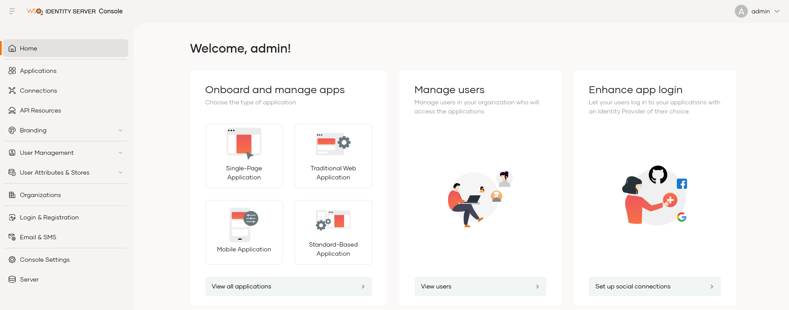

**O que esta evidência comprova:** A evidência estabelece o ambiente externo utilizado para emissão e introspecção de tokens.

### Evidência 06 — Grupos de compras criados

A captura apresenta `F8_PURCHASING_BUYERS` e `F8_PURCHASING_MANAGERS` no WSO2.

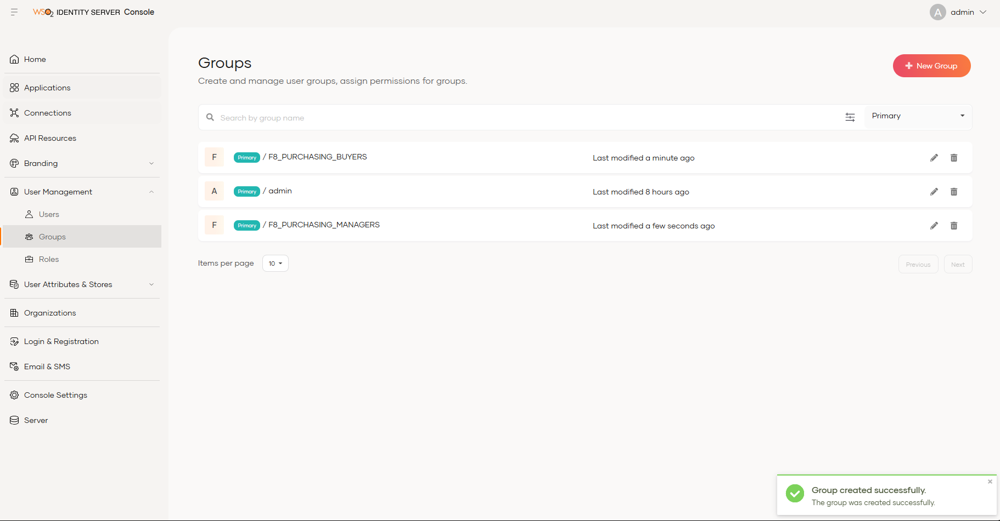

**O que esta evidência comprova:** Os grupos materializam a segregação de funções entre consulta e aprovação de Purchase Requisitions.

### Evidência 07 — Usuários de negócio criados

A tela lista os usuários `buyer.user` e `purchasing.manager`.

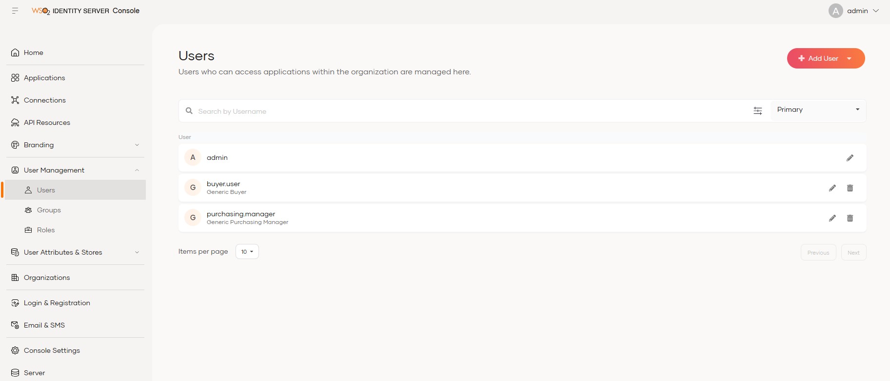

**O que esta evidência comprova:** A evidência prepara a evolução do cenário para autorização por identidade real no F8E, além do usuário técnico utilizado no F8B.

### Evidência 08 — OAuth Application criada

A captura mostra a aplicação OAuth 2.0/OpenID Connect criada no WSO2, com Client Secret mascarado.

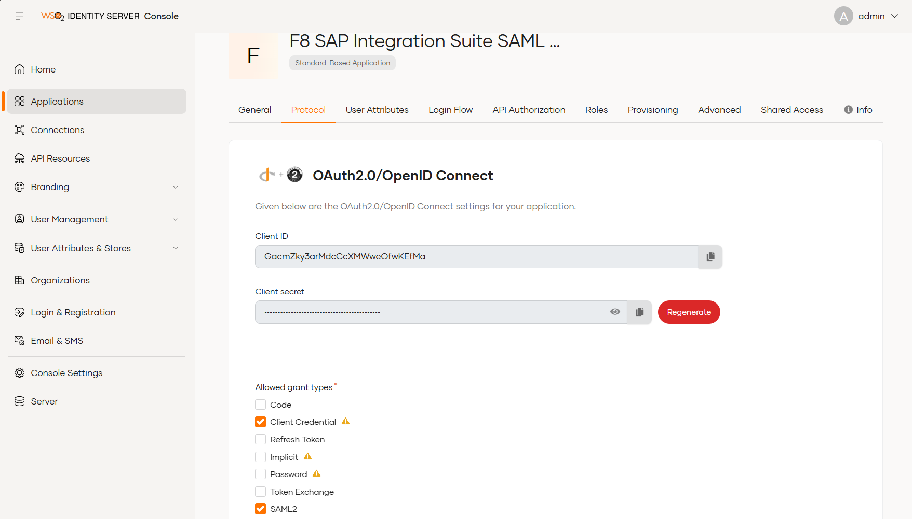

**O que esta evidência comprova:** A aplicação representa o cliente do SAP Integration Suite perante o Authorization Server. O Client ID visível não é reproduzido no texto por não ser necessário ao entendimento.

### Evidência 09 — SAML2 Bearer Grant habilitado

A configuração da aplicação mostra os grants Client Credential e SAML2 habilitados.

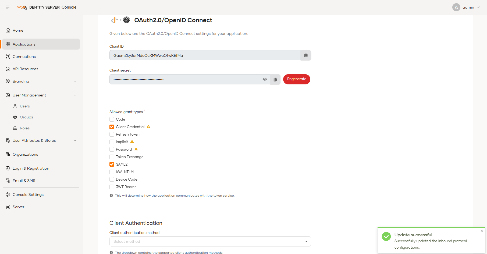

**O que esta evidência comprova:** A evidência comprova que o WSO2 está apto a receber uma assertion SAML como authorization grant.

### Evidência 10 — Baseline OAuth do WSO2

A chamada Postman obtém um token por Client Credentials diretamente no WSO2.

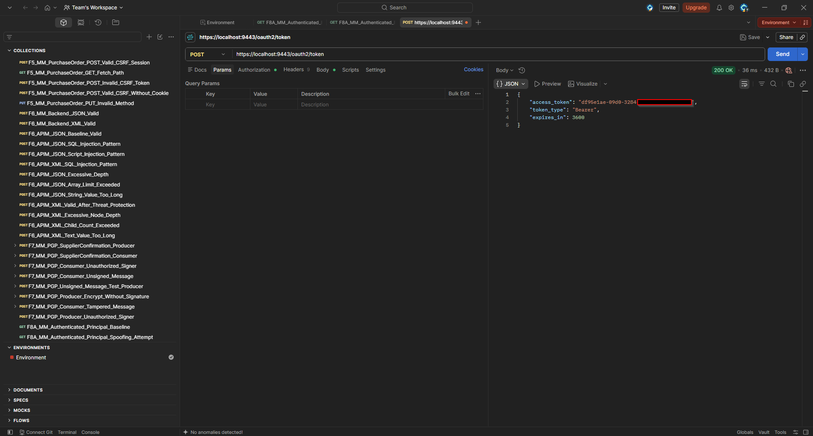

**O que esta evidência comprova:** O teste isola e valida o OAuth client antes da introdução da assertion SAML, reduzindo variáveis durante o troubleshooting.

### Evidência 11 — Túnel HTTPS do ngrok ativo

A captura mostra o ngrok encaminhando um endpoint HTTPS público para `https://localhost:9443`.

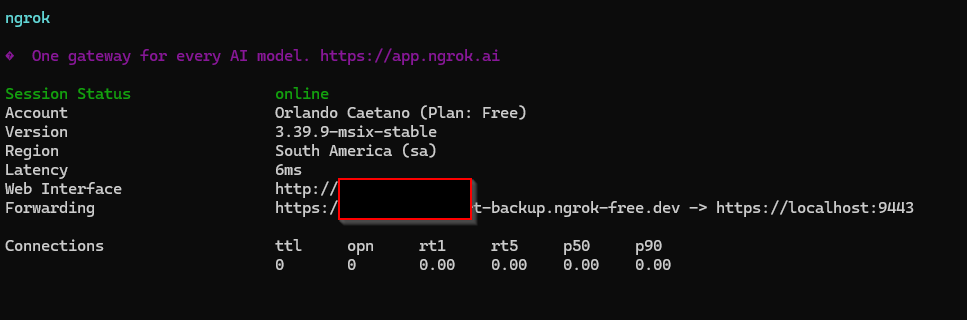

**O que esta evidência comprova:** O túnel permite que o tenant SAP Integration Suite alcance o WSO2 executado localmente sem expor credenciais na documentação.

### Evidência 12 — Token endpoint público validado

A chamada Postman ao endpoint público do ngrok retorna `200 OK` e um token com conteúdo protegido na captura.

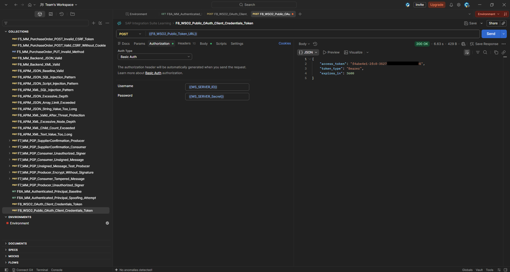

**O que esta evidência comprova:** A evidência comprova conectividade externa e funcionamento do token endpoint antes de o CPI consumir o serviço.

### Evidência 13 — Key Pair de assinatura criado

A captura apresenta o alias `f8_saml_bearer_signing`, chave RSA 3072 e algoritmo SHA512withRSA no Keystore do CPI.

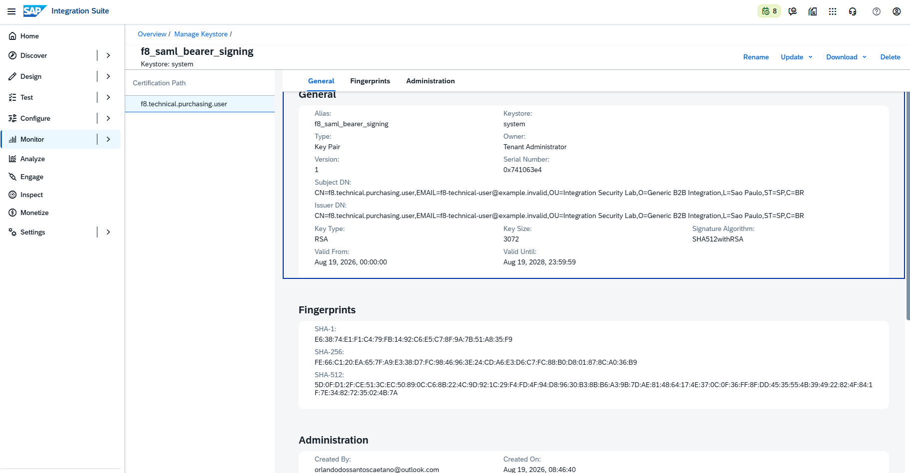

**O que esta evidência comprova:** A chave privada permanece no ambiente gerenciado. Apenas o certificado público é exportado para estabelecer confiança no WSO2.

### Evidência 14 — Issuer, certificado e alias validados

A Identity Provider Management API retorna `200 OK`; os testes confirmam Connection habilitada, Issuer e Token Endpoint Alias configurados.

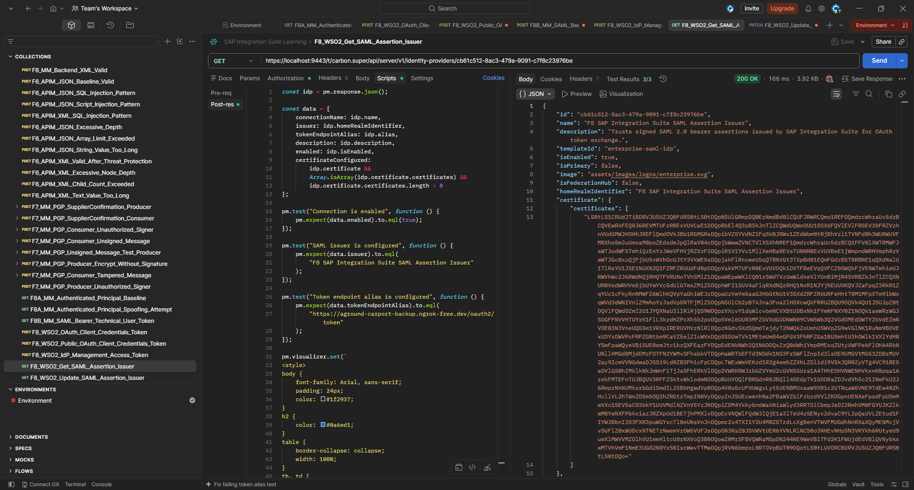

**O que esta evidência comprova:** A cadeia Base64 exibida representa certificado público. O documento não transcreve esse conteúdo para evitar ruído e exposição desnecessária.

---

## F8B.1 — SAML Bearer Token Exchange

### 1. Fluxo

```text
HTTPS Sender
    |
    v
Build_SAML_Bearer_Assertion
    |
    v
Sign_SAML_Bearer_Assertion
    |
    v
Prepare_OAuth_Token_Request
    |
    v
Request Reply — WSO2 Token Endpoint
    |
    v
Validate_OAuth_Token_Response
    |
    v
Build Response
```

### 2. Construção da assertion

```groovy
import com.sap.gateway.ip.core.customdev.util.Message
import java.time.Instant
import java.time.temporal.ChronoUnit
import java.util.UUID

def Message processData(Message message) {
    Instant now = Instant.now()
    Instant notBefore = now.minus(30, ChronoUnit.SECONDS)
    Instant notOnOrAfter = now.plus(5, ChronoUnit.MINUTES)

    String assertionId = "_${UUID.randomUUID()}"
    String issuer = "F8 SAP Integration Suite SAML Assertion Issuer"
    String subject = "f8.technical.purchasing.user"
    String tokenServiceUrl = message.getProperty("wso2TokenServiceUrl")?.toString()

    if (!tokenServiceUrl) {
        throw new IllegalStateException(
            "The externalized parameter wso2TokenServiceUrl is required."
        )
    }

    String assertion = """<saml2:Assertion xmlns:saml2="urn:oasis:names:tc:SAML:2.0:assertion" ID="${assertionId}" IssueInstant="${now}" Version="2.0">
    <saml2:Issuer>${escapeXml(issuer)}</saml2:Issuer>
    <saml2:Subject>
        <saml2:NameID Format="urn:oasis:names:tc:SAML:1.1:nameid-format:unspecified">${escapeXml(subject)}</saml2:NameID>
        <saml2:SubjectConfirmation Method="urn:oasis:names:tc:SAML:2.0:cm:bearer">
            <saml2:SubjectConfirmationData NotOnOrAfter="${notOnOrAfter}" Recipient="${escapeXml(tokenServiceUrl)}"/>
        </saml2:SubjectConfirmation>
    </saml2:Subject>
    <saml2:Conditions NotBefore="${notBefore}" NotOnOrAfter="${notOnOrAfter}">
        <saml2:AudienceRestriction>
            <saml2:Audience>${escapeXml(tokenServiceUrl)}</saml2:Audience>
        </saml2:AudienceRestriction>
    </saml2:Conditions>
    <saml2:AuthnStatement AuthnInstant="${now}">
        <saml2:AuthnContext>
            <saml2:AuthnContextClassRef>urn:oasis:names:tc:SAML:2.0:ac:classes:PreviousSession</saml2:AuthnContextClassRef>
        </saml2:AuthnContext>
    </saml2:AuthnStatement>
</saml2:Assertion>"""

    message.setProperty("samlAssertionId", assertionId)
    message.setProperty("samlIssuer", issuer)
    message.setProperty("samlSubject", subject)
    message.setProperty("samlAudience", tokenServiceUrl)
    message.setProperty("samlRecipient", tokenServiceUrl)
    message.setProperty("samlIssueInstant", now.toString())
    message.setProperty("samlNotBefore", notBefore.toString())
    message.setProperty("samlNotOnOrAfter", notOnOrAfter.toString())
    message.setProperty("samlKeyPairAlias", "f8_saml_bearer_signing")
    message.setProperty("assertionStatus", "BUILT_NOT_SIGNED")

    message.setHeader("Content-Type", "application/xml")
    message.setBody(assertion)

    return message
}

def String escapeXml(String value) {
    if (value == null) {
        return ""
    }

    return value
        .replace("&", "&amp;")
        .replace("<", "&lt;")
        .replace(">", "&gt;")
        .replace("\"", "&quot;")
        .replace("'", "&apos;")
}
```

### 3. XML Digital Signer

#### Processing

| Campo | Valor |
|---|---|
| Private Key Alias | `f8_saml_bearer_signing` |
| Signature Algorithm | SHA512/RSA |
| Digest Algorithm | SHA256 |
| Signature Type | Enveloped XML Signature |
| Parent Node | Specified by Name and Namespace |
| Name | `Assertion` |
| Namespace | `urn:oasis:names:tc:SAML:2.0:assertion` |
| X.509 Certificate Chain | Habilitado |

#### Advanced

| Campo | Valor |
|---|---|
| Canonicalization Method | Exclusive XML Canonicalization 1.0 |
| Transform Method | Exclusive XML Canonicalization 1.0 |
| Namespace Prefix | `ds` |
| Output Encoding | UTF-8 |
| Exclude XML Declaration | Habilitado |
| Disallow DOCTYPE Declaration | Habilitado |

### 4. Preparação do token request

```groovy
import com.sap.gateway.ip.core.customdev.util.Message
import java.net.URLEncoder

def Message processData(Message message) {
    String signedAssertion = message.getBody(String)
    String grantType = "urn:ietf:params:oauth:grant-type:saml2-bearer"

    if (!signedAssertion?.trim()) {
        throw new SecurityException(
            "The signed SAML assertion is empty."
        )
    }

    String requestBody = [
        "grant_type=${URLEncoder.encode(grantType, 'UTF-8')}",
        "assertion=${URLEncoder.encode(signedAssertion, 'UTF-8')}"
    ].join("&")

    message.setProperty("oauthGrantType", grantType)
    message.setProperty("assertionStatus", "SIGNED_READY_FOR_EXCHANGE")
    message.setHeader("Content-Type", "application/x-www-form-urlencoded")
    message.setBody(requestBody)

    return message
}
```

### 5. Validação da resposta do token endpoint

```groovy
import com.sap.gateway.ip.core.customdev.util.Message
import groovy.json.JsonSlurper

def Message processData(Message message) {
    String responseBody = message.getBody(String)
    def tokenResponse = new JsonSlurper().parseText(responseBody)

    String accessToken = tokenResponse.access_token?.toString()
    String tokenType = tokenResponse.token_type?.toString()
    String expiresIn = tokenResponse.expires_in?.toString()

    if (!accessToken) {
        throw new SecurityException(
            "The token exchange did not return a valid access token."
        )
    }

    message.setProperty("accessTokenRaw", accessToken)
    message.setProperty("accessTokenMasked", maskToken(accessToken))
    message.setProperty("tokenType", tokenType ?: "NOT_PROVIDED")
    message.setProperty("expiresInSeconds", expiresIn ?: "NOT_PROVIDED")
    message.setProperty("tokenExchangeStatus", "SAML_BEARER_TOKEN_ISSUED")
    message.setProperty("accessTokenExposed", false)

    return message
}

def String maskToken(String token) {
    if (!token || token.length() < 12) {
        return "***MASKED***"
    }

    return token.substring(0, 6) + "..." + token.substring(token.length() - 4)
}
```

### 6. Resposta sanitizada

```json
{
  "scenario": "F8B_SAML_BEARER_TOKEN_EXCHANGE",
  "tokenExchangeStatus": "SAML_BEARER_TOKEN_ISSUED",
  "samlSubject": "f8.technical.purchasing.user",
  "accessTokenMasked": "${property.accessTokenMasked}",
  "tokenType": "${property.tokenType}",
  "expiresInSeconds": "${property.expiresInSeconds}",
  "accessTokenExposed": false
}
```

### 7. Evidências F8B.1

#### Evidência 15 — SAML Bearer Token Exchange concluído

A resposta Postman confirma `SAML_BEARER_TOKEN_ISSUED`, o subject técnico e o access token mascarado.

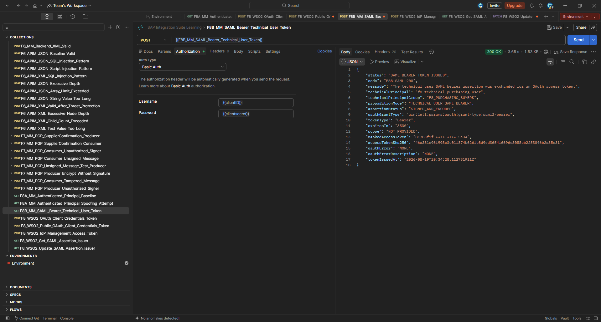

**O que esta evidência comprova:** A evidência comprova o resultado funcional externo do RFC 7522 sem expor o token integral.

#### Evidência 16 — Processamento interno do Token Exchange

O Monitor do CPI apresenta a construção da assertion, assinatura XML, preparação do request, chamada ao WSO2 e validação da resposta.

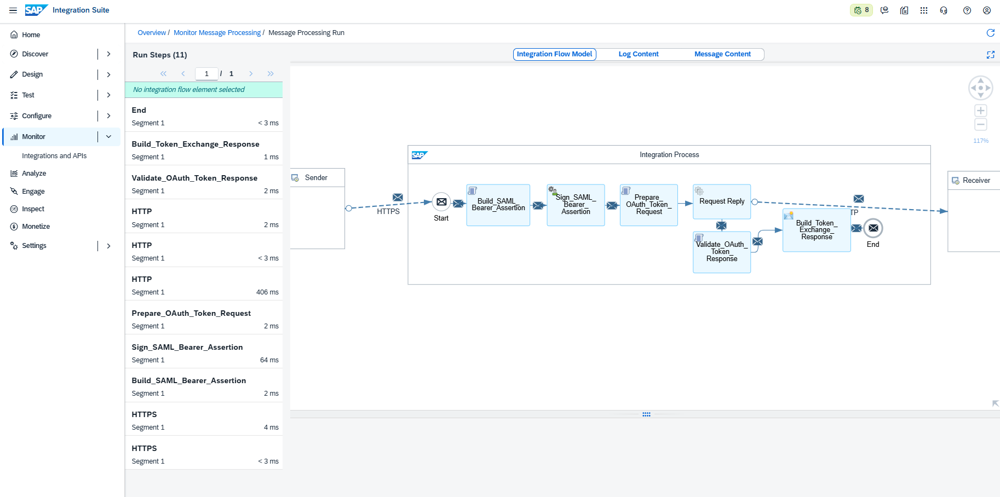

**O que esta evidência comprova:** A captura comprova que o token não foi simulado no Postman; o fluxo completo foi executado dentro do SAP Integration Suite.

---

## F8B.2 — OAuth 2.0 Token Introspection

### 1. Objetivo

Validar que o token emitido:

- está ativo;
- pertence ao subject esperado;
- foi emitido para o client esperado;
- pode alimentar uma decisão de autorização;
- permanece oculto na resposta pública.

### 2. Configuração do WSO2

```toml
[[resource.access_control]]
context="(.*)/oauth2/introspect(.*)"
http_method="all"
secure=true
allowed_auth_handlers="BasicClientAuthentication"
```

### 3. Preparação do introspection request

```groovy
import com.sap.gateway.ip.core.customdev.util.Message
import java.net.URLEncoder

def Message processData(Message message) {
    String accessToken = message.getProperty("accessTokenRaw")?.toString()

    if (!accessToken) {
        throw new SecurityException(
            "No access token is available to introspect."
        )
    }

    message.setHeader("Content-Type", "application/x-www-form-urlencoded")
    message.setBody(
        "token=${URLEncoder.encode(accessToken, 'UTF-8')}"
    )

    return message
}
```

### 4. Validação da introspecção

```groovy
import com.sap.gateway.ip.core.customdev.util.Message
import groovy.json.JsonSlurper

def Message processData(Message message) {
    String responseBody = message.getBody(String)
    def introspection = new JsonSlurper().parseText(responseBody)

    boolean active = introspection.active == true
    String subject = introspection.sub?.toString() ?: introspection.username?.toString()
    String clientId = introspection.client_id?.toString()

    if (!active) {
        throw new SecurityException(
            "The introspected access token is not active."
        )
    }

    if (!subject) {
        throw new SecurityException(
            "The introspection response does not contain a subject."
        )
    }

    message.setProperty("tokenActive", active.toString())
    message.setProperty("introspectionSubject", subject)
    message.setProperty("introspectionClientId", clientId ?: "NOT_PROVIDED")
    message.setProperty("tokenIntrospectionStatus", "VALIDATED")
    message.setProperty("accessTokenExposed", false)

    return message
}
```

### 5. Resposta esperada

```json
{
  "scenario": "F8B_TOKEN_INTROSPECTION",
  "tokenIntrospectionStatus": "VALIDATED",
  "tokenActive": "true",
  "introspectionSubject": "f8.technical.purchasing.user",
  "accessTokenExposed": false
}
```

### 6. Evidências F8B.2

#### Evidência 17 — iFlow ampliado com Token Introspection

A captura apresenta o iFlow F8B com um segundo Request Reply e os scripts de preparação e validação da introspecção.

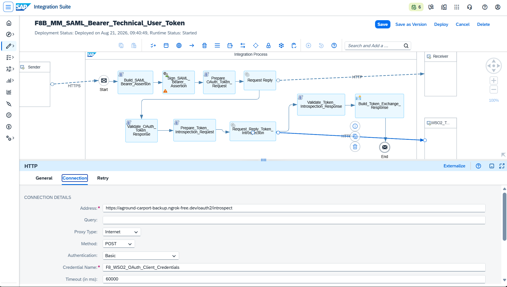

**O que esta evidência comprova:** A evidência demonstra a evolução arquitetural: o token emitido não é usado para autorização sem validação posterior de atividade e subject.

#### Evidência 18 — Token Introspection validada

A resposta Postman confirma token ativo, subject técnico validado e access token não exposto.

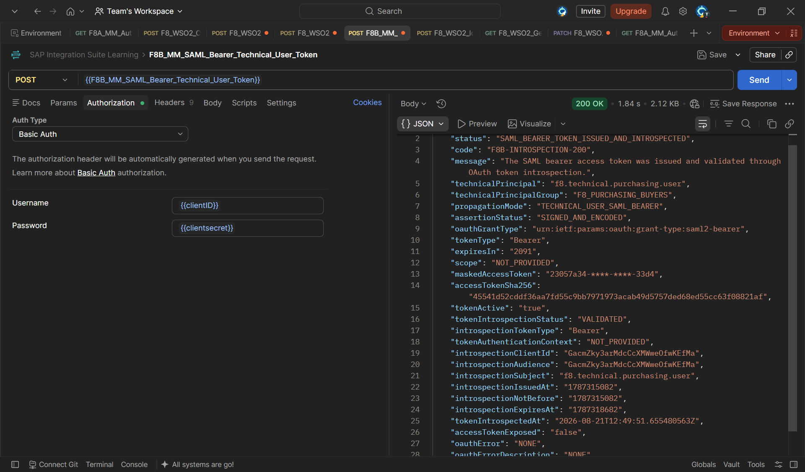

**O que esta evidência comprova:** A captura comprova o resultado funcional do RFC 7662 utilizado como entrada da política de autorização.

#### Evidência 19 — Processamento interno da Introspection

O Monitor apresenta token exchange e introspection na mesma execução, incluindo os dois Request Reply.

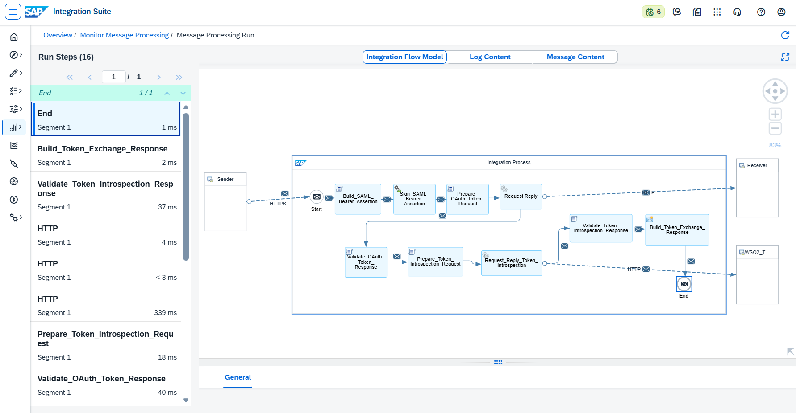

**O que esta evidência comprova:** A evidência comprova a cadeia completa e os tempos de processamento antes da autorização do recurso protegido.

---

## F8B.3 — Protected Resource Authorization

### 1. Objetivo

Demonstrar que autenticação bem-sucedida não implica permissão irrestrita. O access token ativo alimenta uma política de negócio específica para Purchase Requisitions.

### 2. Operações suportadas

```text
X-F8-Operation: READ
```

```text
X-F8-Operation: APPROVE
```

### 3. Fluxo

```text
Validate_Token_Introspection_Response
    |
    v
Prepare_Authorization_Context
    |
    v
Router_Authorization_Operation
    |-- AUTHORIZED
    |-- DENIED
    `-- UNSUPPORTED
```

### 4. Preparação do contexto de autorização

```groovy
import com.sap.gateway.ip.core.customdev.util.Message
import java.time.Instant

def Message processData(Message message) {
    String requestedOperation = message.getHeader(
        "X-F8-Operation",
        String
    )?.trim()?.toUpperCase()

    String tokenActive = message.getProperty("tokenActive")?.toString()?.trim()
    String tokenStatus = message.getProperty("tokenIntrospectionStatus")?.toString()?.trim()
    String subject = message.getProperty("introspectionSubject")?.toString()?.trim()

    if (!requestedOperation) {
        requestedOperation = "NOT_PROVIDED"
    }

    if (!tokenActive?.equalsIgnoreCase("true")) {
        throw new SecurityException(
            "Authorization cannot continue because the token is not active."
        )
    }

    if (!tokenStatus?.equalsIgnoreCase("VALIDATED")) {
        throw new SecurityException(
            "Authorization cannot continue because token introspection was not validated."
        )
    }

    String requiredGroup
    String decision
    String reason
    String operationDescription

    switch (requestedOperation) {
        case "READ":
            requiredGroup = "F8_PURCHASING_BUYERS"
            operationDescription = "Read SAP MM purchase requisitions"
            decision = "AUTHORIZED"
            reason = "The technical purchasing user is authorized to read purchase requisitions."
            break

        case "APPROVE":
            requiredGroup = "F8_PURCHASING_MANAGERS"
            operationDescription = "Approve SAP MM purchase requisitions"
            decision = "DENIED"
            reason = "The technical purchasing user does not belong to the managers group."
            break

        default:
            requiredGroup = "NOT_APPLICABLE"
            operationDescription = "Unsupported protected resource operation"
            decision = "UNSUPPORTED"
            reason = "Only READ and APPROVE are supported."
    }

    message.setProperty("requestedOperation", requestedOperation)
    message.setProperty("operationDescription", operationDescription)
    message.setProperty("protectedResource", "SAP_MM_PURCHASE_REQUISITIONS")
    message.setProperty("requiredGroup", requiredGroup)
    message.setProperty("authorizationDecision", decision)
    message.setProperty("authorizationReason", reason)
    message.setProperty("authorizationSubject", subject ?: "NOT_PROVIDED")
    message.setProperty("authorizationEvaluatedAt", Instant.now().toString())
    message.setProperty("authorizationPolicy", "F8B_PURCHASE_REQUISITION_GROUP_POLICY")

    return message
}
```

### 5. Condições do Router

**READ autorizado**

```text
${property.authorizationDecision} = 'AUTHORIZED'
```

**APPROVE negado**

```text
${property.authorizationDecision} = 'DENIED'
```

**Default**

```text
UNSUPPORTED
```

### 6. Matriz de resultados

| Subject | Grupo | Operação | HTTP | Decisão |
|---|---|---|---:|---|
| `f8.technical.purchasing.user` | Buyers | READ | 200 | AUTHORIZED |
| `f8.technical.purchasing.user` | Buyers | APPROVE | 403 | DENIED |
| `f8.technical.purchasing.user` | Buyers | DELETE | 400 | UNSUPPORTED |

### 7. Evidências F8B.3 — Protected Resource Authorization

A sequência abaixo preserva os pares de evidência externa e interna. O Postman comprova o contrato HTTP observado pelo consumidor, enquanto o Monitor do CPI comprova a rota realmente executada.

#### Evidência 20 — iFlow final de autorização

A captura apresenta `Prepare_Authorization_Context`, o Router e as rotas Authorized, Denied e Unsupported.

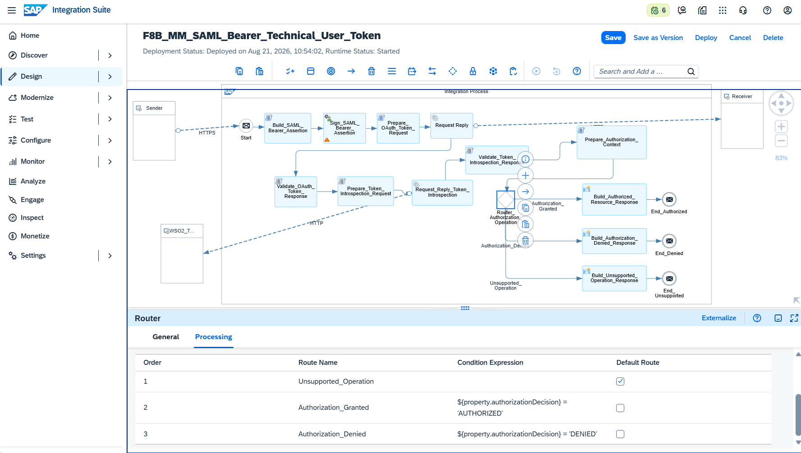

**O que esta evidência comprova:** A evidência comprova a separação entre autenticação, validação do token e decisão de autorização baseada na operação solicitada.

#### Evidência 21 — READ autorizado

A chamada Postman com operação READ retorna `200 OK`, decisão `AUTHORIZED` e o recurso de Purchase Requisition.

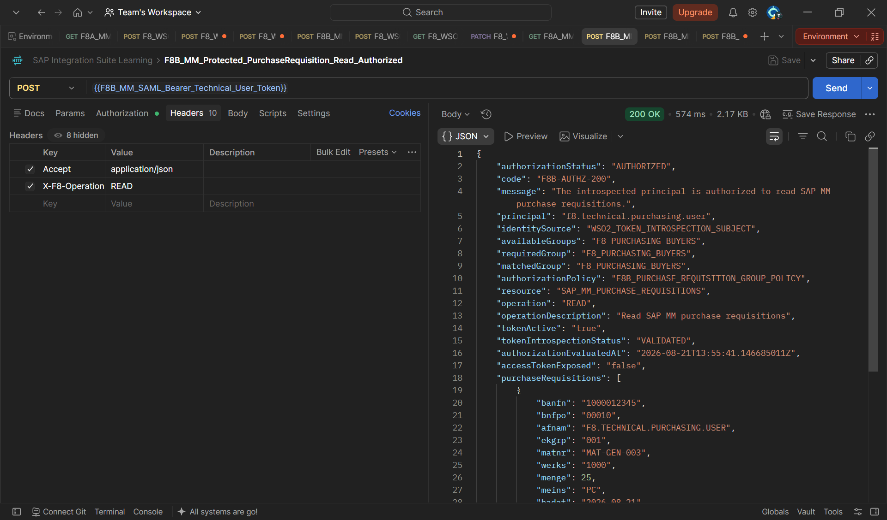

**O que esta evidência comprova:** A captura comprova que o grupo Buyer atende à política necessária para consulta.

#### Evidência 22 — Caminho interno de autorização

O Monitor do CPI mostra a rota `Authorization_Granted` percorrida.

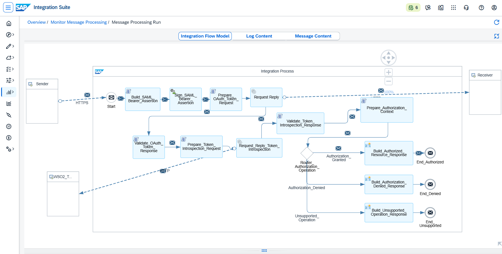

**O que esta evidência comprova:** O par com a evidência 21 confirma tanto o resultado externo quanto o caminho interno efetivamente executado.

#### Evidência 23 — APPROVE negado

A chamada Postman com operação APPROVE retorna `403 Forbidden` e identifica a ausência do grupo Manager.

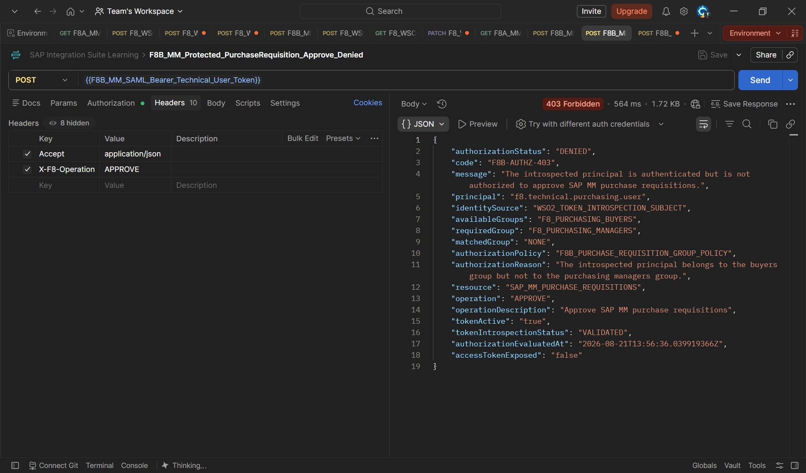

**O que esta evidência comprova:** A evidência comprova menor privilégio: um token válido de Buyer não recebe permissão de aprovação.

#### Evidência 24 — Caminho interno de negação

O Monitor mostra o processamento pela rota `Authorization_Denied`.

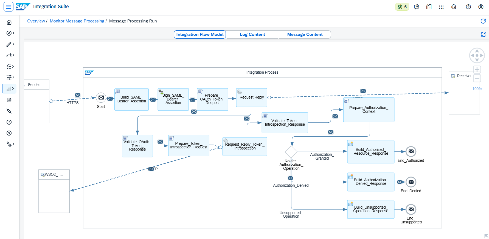

**O que esta evidência comprova:** O par com a evidência 23 confirma que o 403 foi produzido pela política de autorização do iFlow.

#### Evidência 25 — Operação não suportada rejeitada

A chamada Postman com DELETE retorna `400 Bad Request` e informa as operações permitidas.

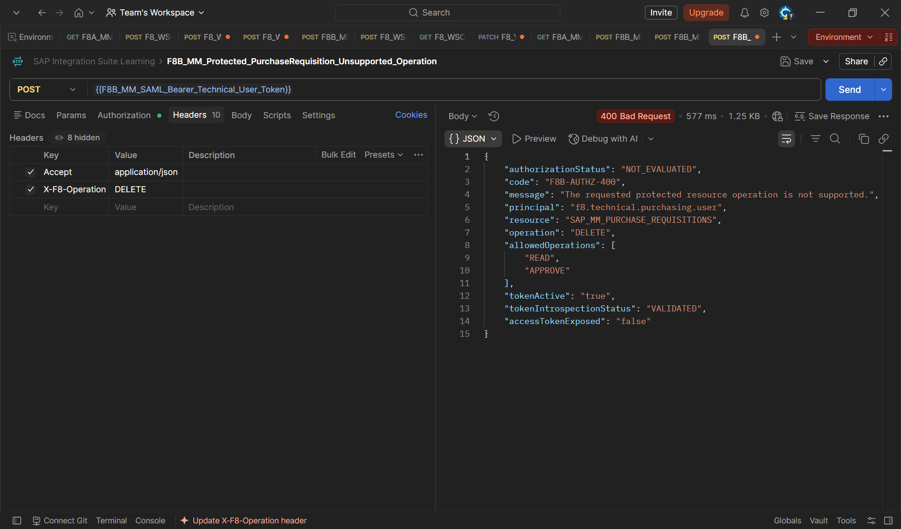

**O que esta evidência comprova:** A evidência comprova validação explícita da interface protegida e rejeição de operações fora do contrato.

#### Evidência 26 — Caminho interno de operação não suportada

O Monitor apresenta a rota `Unsupported_Operation`.

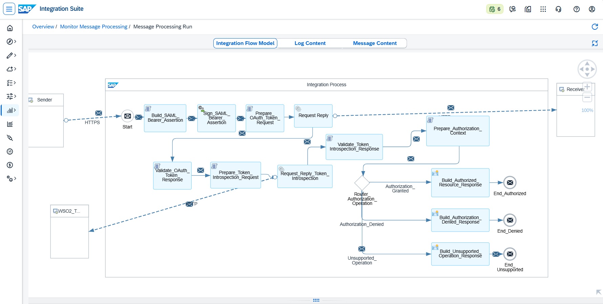

**O que esta evidência comprova:** O par com a evidência 25 confirma o caminho default do Router e o tratamento controlado da operação inválida.

### 8. Conclusão do F8B

| Controle | Resultado |
|---|---|
| Assertion SAML construída | Validado |
| Assertion assinada com chave do CPI | Validado |
| WSO2 confia no Issuer/certificado | Validado |
| Access token emitido | Validado |
| Access token mascarado | Validado |
| Introspection ativa | Validado |
| Subject técnico reconhecido | Validado |
| READ autorizado | Validado |
| APPROVE negado para Buyer | Validado |
| Operação não suportada rejeitada | Validado |

O F8B comprova uma cadeia completa de confiança federada para um usuário técnico. O próximo estágio lógico é tornar o subject variável por usuário e aplicar a matriz completa de Buyers e Managers.

---

# 🅲 F8C — End-User Principal Propagation Exploration

## 1. Motivação

O F8B usa um subject técnico fixo. O F8C investiga se o usuário humano autenticado no SAP BTP pode chegar ao CPI e ser reutilizado como subject da assertion SAML, preservando a identidade de ponta a ponta.

O cenário foi intencionalmente mais robusto do que um header simulado. A meta era aprender e testar:

- SAP Cloud Identity Services;
- login humano real;
- grupos Buyer e Manager;
- Approuter;
- XSUAA;
- Destination Service;
- Cloud Foundry CLI;
- token forwarding;
- OAuth2JWTBearer;
- boundary de confiança com o runtime do CPI.

## 2. Personas

| Persona | Regra de negócio | Grupo IAS |
|---|---|---|
| Buyer | Consultar Purchase Requisitions | `F8_Purchasing_Buyers` |
| Purchasing Manager | Consultar e aprovar Purchase Requisitions | `F8_Purchasing_Buyers` e `F8_Purchasing_Managers` |

## 3. Fase 1 — Avaliação do Default Identity Provider

Usuários foram inicialmente avaliados no BTP Cockpit. O Default Identity Provider do trial não ofereceu um fluxo utilizável para os usuários manuais do laboratório:

- não foi possível definir senha diretamente;
- o convite esperado não foi recebido;
- o menu não oferecia um mecanismo adequado de ativação;
- usar aliases de e-mail não resolveria o problema do fluxo de ativação;
- acessar a área geral de trial poderia criar outro Global Account e foi evitado.

A decisão foi utilizar o SAP Cloud Identity Services, que fornece administração explícita de usuários, grupos e ativação.

## 4. Fase 2 — SAP Cloud Identity Services

**Tenant**

```text
a5ugaikdz.trial-accounts.ondemand.com
```

Foram criados os grupos:

```text
F8_Purchasing_Buyers
```

```text
F8_Purchasing_Managers
```

A seguinte matriz foi configurada:

| Usuário de teste | Grupos |
|---|---|
| Buyer | Buyers |
| Purchasing Manager | Buyers e Managers |

O primeiro acesso ao Admin Console exigiu a ativação da senha do ambiente IAS. Essa credencial é independente da autenticação administrativa do BTP Cockpit.

## 5. Fase 3 — Cloud Foundry CLI

Foi utilizado o Cloud Foundry CLI portátil, adequado ao computador corporativo sem privilégios administrativos.

**Org**

```text
dd55cf34trial
```

**Space**

```text
dev
```

A cota de memória disponível foi suficiente para o Approuter.

## 6. Fase 4 — Projeto Approuter

Estrutura:

```text
f8c-approuter/
├── package.json
├── manifest.yml
├── xs-app.json
├── xs-security.json
└── webapp/
    └── index.html
```

### `package.json`

```json
{
  "name": "f8c-approuter",
  "version": "1.0.0",
  "description": "F8C End-User Principal Propagation Approuter for SAP Integration Suite Learning.",
  "engines": {
    "node": "^22"
  },
  "dependencies": {
    "@sap/approuter": "^22"
  },
  "scripts": {
    "start": "node node_modules/@sap/approuter/approuter.js"
  }
}
```

### `manifest.yml`

```yaml
applications:
- name: f8c-approuter
  memory: 256M
  buildpacks:
    - nodejs_buildpack
  services:
    - f8c-xsuaa
    - f8c-destination-service
```

### `xs-app.json`

```json
{
  "welcomeFile": "/index.html",
  "authenticationMethod": "route",
  "routes": [
    {
      "source": "^/f8c/(.*)$",
      "target": "/http/f8c/$1",
      "destination": "f8c-cpi-destination",
      "authenticationType": "xsuaa"
    },
    {
      "source": "^/(.*)$",
      "target": "/$1",
      "localDir": "webapp",
      "authenticationType": "xsuaa"
    }
  ]
}
```

### `xs-security.json`

```json
{
  "xsappname": "f8c-purchase-requisition",
  "tenant-mode": "dedicated",
  "description": "XSUAA security descriptor for F8C End-User Principal Propagation scenario.",
  "scopes": [
    {
      "name": "$XSAPPNAME.Buyer",
      "description": "Allows reading SAP MM purchase requisitions."
    },
    {
      "name": "$XSAPPNAME.Manager",
      "description": "Allows approving SAP MM purchase requisitions."
    }
  ],
  "attributes": [],
  "role-templates": [
    {
      "name": "PurchasingBuyer",
      "description": "Purchasing buyer role template.",
      "scope-references": [
        "$XSAPPNAME.Buyer"
      ]
    },
    {
      "name": "PurchasingManager",
      "description": "Purchasing manager role template.",
      "scope-references": [
        "$XSAPPNAME.Buyer",
        "$XSAPPNAME.Manager"
      ]
    }
  ],
  "role-collections": [
    {
      "name": "F8_Purchasing_Buyers",
      "description": "Role collection for SAP MM purchase requisition buyers.",
      "role-template-references": [
        "$XSAPPNAME.PurchasingBuyer"
      ]
    },
    {
      "name": "F8_Purchasing_Managers",
      "description": "Role collection for SAP MM purchase requisition managers.",
      "role-template-references": [
        "$XSAPPNAME.PurchasingManager"
      ]
    }
  ],
  "oauth2-configuration": {
    "redirect-uris": [
      "https://f8c-approuter.cfapps.us10-001.hana.ondemand.com/**",
      "https://*.cfapps.us10-001.hana.ondemand.com/**"
    ]
  }
}
```

## 7. Fase 5 — Serviços BTP

Foram utilizados:

| Serviço | Offering | Plano |
|---|---|---|
| `f8c-xsuaa` | xsuaa | application |
| `f8c-destination-service` | destination | lite |

O Approuter foi vinculado aos dois serviços.

A Destination utilizada foi:

```text
f8c-cpi-destination
```

## 8. Fase 6 — Correções durante o deploy

### JSON com BOM

O PowerShell 5.1 gravou arquivos com BOM em uma tentativa inicial. O CF CLI não conseguiu interpretar o JSON de configuração. Os arquivos foram regravados sem BOM e validados.

### Node.js indisponível

O buildpack não oferecia a versão 20 solicitada inicialmente. O projeto foi adaptado para Node.js 22.

### Versão inexistente do Approuter

A versão fixada inicialmente não existia no registry. A dependência foi ajustada para a faixa `^22`.

### Redirect URI

O login falhou até a inclusão explícita de `oauth2-configuration.redirect-uris` no security descriptor.

### Destination desconhecida

O Approuter não iniciou enquanto o Destination Service não estava criado e vinculado.

### Variável antiga `destinations`

Uma variável de ambiente antiga com placeholder persistiu mesmo após ser removida do manifesto. Ela foi removida explicitamente com `cf unset-env`.

## 9. Fase 7 — Login humano real

Após as correções:

- o Approuter iniciou;
- o XSUAA redirecionou para autenticação;
- o Buyer conseguiu autenticar;
- o Purchasing Manager conseguiu autenticar em uma sessão separada;
- a página protegida foi exibida.

Esse resultado conclui com sucesso a parte de autenticação interativa do F8C.

## 10. Fase 8 — Adaptação do iFlow F8B

Em vez de criar o F8C do zero, o iFlow F8B foi copiado e adaptado.

**Artifact Name**

```text
F8C_MM_EndUser_Principal_Propagation
```

Foi adicionado o script:

```text
Extract_XSUAA_JWT_Principal
```

A intenção era:

1. recuperar o JWT do usuário humano;
2. validar issuer e expiração;
3. extrair e-mail, username e scopes;
4. preencher `realUserSubject` e `realUserGroups`;
5. construir a assertion SAML com subject dinâmico;
6. manter o fluxo WSO2 já validado no F8B.

## 11. Tentativa 1 — `NoAuthentication` + `HTML5.ForwardAuthToken`

### Hipótese

O Approuter encaminharia o JWT do usuário no header Authorization até o CPI.

### Resultado

```text
HTTP 401 Unauthorized
```

```text
Bearer error="unauthorized_user", error_description="Bad credentials"
```

### Diagnóstico

O JWT foi emitido para o client e os scopes da aplicação F8C. O HTTPS Sender do CPI protege o endpoint por um contexto do runtime gerenciado do Cloud Integration. O token da aplicação não continha a autorização esperada para esse resource server.

### Conclusão

Encaminhar diretamente o access token da aplicação não tornou o token automaticamente válido para o CPI.

## 12. Tentativa 2 — Basic Authentication no destino

### Hipótese

A Destination usaria Client ID e Client Secret da Service Key do CPI para autenticar a chamada técnica. O JWT humano seria transportado em outro header.

### Validação do cliente técnico

Um teste direto com `curl` e as credenciais corretas comprovou que o cliente técnico conseguia alcançar o iFlow. Sem o header humano, o Groovy gerava o erro esperado:

```text
No forwarded XSUAA user token was found in X-Forwarded-User-Token.
```

Isso provou:

- Client ID e Client Secret estavam válidos;
- o HTTPS Sender aceitou o cliente técnico;
- o iFlow foi executado;
- faltava apenas transportar a identidade humana por um canal confiável.

## 13. Tentativa 3 — Middleware customizado

### Hipótese

O `beforeRequestHandler` copiaria o Authorization da sessão para `X-Forwarded-User-Token` antes de a Destination aplicar Basic Authentication.

### Implementação experimental

```javascript
var approuter = require("@sap/approuter");
var ar = approuter();

ar.beforeRequestHandler.use("/f8c", function (req, res, next) {
    console.log("MIDDLEWARE_EXECUTED: path=" + req.path);

    var incomingAuthorizationHeader = req.headers["authorization"];

    console.log(
        "MIDDLEWARE_AUTH_HEADER_PRESENT: " +
        (incomingAuthorizationHeader ? "true" : "false")
    );

    if (incomingAuthorizationHeader) {
        req.headers["x-forwarded-user-token"] = incomingAuthorizationHeader;
        console.log("MIDDLEWARE_TOKEN_COPIED: true");
    }

    next();
});

ar.start();
```

### Logs

```text
MIDDLEWARE_EXECUTED: path=undefined
MIDDLEWARE_AUTH_HEADER_PRESENT: false
```

### Causa

O browser mantém a autenticação pela sessão/cookie. O Authorization usado para o destino é construído em uma etapa posterior do processamento interno do Approuter. O hook executa antes desse momento e, por isso, não possui o JWT esperado.

### Conclusão

O hook documentado não resolveu a necessidade de obter o JWT da sessão no ponto correto do proxy outbound.

## 14. Tentativa 4 — `OAuth2JWTBearer`

### Hipótese

A Destination trocaria o JWT do usuário por um token adequado ao sistema de destino.

### Configuração avaliada

| Campo | Valor |
|---|---|
| Authentication | `OAuth2JWTBearer` |
| Client ID | Service Key do CPI, omitida por segurança |
| Client Secret | Omitido por segurança |
| Token Service URL | XSUAA token endpoint do subaccount |
| Token Service URL Type | Dedicated |

### Incompatibilidade inicial

Ao manter `HTML5.ForwardAuthToken=true`, o Approuter retornou:

```text
ForwardAuthToken parameter cannot be used in destinations with authentication type not equal NoAuthentication
```

A propriedade foi removida.

### Resultado sem ForwardAuthToken

```text
HTTP 403 Forbidden
```

O Monitor do CPI apresentou:

```text
Messages (0)
```

### Diagnóstico

A chamada foi bloqueada antes de chegar ao iFlow. O JWT Bearer flow exige uma relação de confiança e autorizações entre a aplicação de origem e o serviço de destino. A aplicação F8C utiliza a instância `f8c-xsuaa`, enquanto o Cloud Integration utiliza o runtime gerenciado identificado pelo serviço `it-rt`.

A configuração necessária do lado do serviço gerenciado não estava disponível ao projeto no ambiente trial testado.

## 15. Alternativa analisada e descartada — JavaScript/header

Uma aplicação de browser poderia consultar informações do usuário logado e enviar um header com nome ou e-mail.

A alternativa foi descartada porque:

- o header seria controlado pelo cliente;
- o backend precisaria confiar em um valor não assinado;
- o modelo reintroduziria o mesmo spoofing demonstrado no F8A;
- isso não caracterizaria principal propagation seguro.

## 16. Diagnóstico consolidado do F8C

| Abordagem | Resultado | Camada de bloqueio | Conclusão |
|---|---|---|---|
| NoAuthentication + ForwardAuthToken | 401 | Proteção do endpoint CPI | Token da aplicação não é automaticamente válido para `it-rt` |
| Basic Authentication | Cliente técnico aceito | iFlow executado | JWT humano continuava ausente |
| Middleware customizado | Authorization ausente | Pipeline do Approuter | Hook executa antes do token outbound esperado |
| OAuth2JWTBearer + ForwardAuthToken | 500 de configuração | Approuter | Configurações incompatíveis |
| OAuth2JWTBearer sem ForwardAuthToken | 403, `Messages (0)` | Destination/XSUAA antes do CPI | Trust/cross-consumption limitado no ambiente testado |
| Header via browser | Não implementado | Design de segurança | Descartado por spoofing |

## 17. O que o F8C comprovou

| Verificação | Resultado |
|---|---|
| SAP Cloud Identity Services configurado | Validado |
| Grupos Buyer e Manager criados | Validado |
| Usuários humanos autenticados | Validado |
| Approuter implantado | Validado |
| XSUAA vinculada | Validado |
| Destination Service vinculada | Validado |
| Login humano real | Validado |
| Autenticação técnica no CPI | Validado |
| Propagação humana até o CPI | Não concluída |
| Causa do bloqueio localizada | Validado |

## 18. Limite da conclusão

A conclusão deve ser expressa com precisão:

> No ambiente trial e na arquitetura testada, a aplicação controlava uma instância XSUAA própria, enquanto o SAP Cloud Integration utilizava um runtime gerenciado com boundary de confiança distinto. O laboratório não encontrou uma configuração suportada e disponível ao projeto que permitisse trocar ou encaminhar o token humano ao CPI mantendo os requisitos de autenticação do endpoint. O resultado não prova que principal propagation é impossível em todos os ambientes SAP; prova que a configuração necessária não estava acessível no ambiente e no desenho testados.

## 19. Relação com o F8B

O F8B foi bem-sucedido porque o projeto controlava os dois lados da confiança:

- a chave de assinatura no CPI;
- o certificado confiado no WSO2;
- o Issuer;
- o token endpoint;
- o usuário e os grupos;
- a política de autorização.

Essa governança explícita permitiu usar uma assertion assinada como ponte entre os componentes.

## 20. Evidências do F8C

Conforme decisão do cenário, o F8C é documentado como exploração arquitetural e **não referencia imagens nesta seção**. A pasta reservada ao próximo documento permanece livre para o F8E. O diagnóstico do F8C é sustentado pelos resultados e logs registrados durante a execução, sem criar links para evidências que não fazem parte do conjunto aprovado de 26 imagens do F8A/F8B.

## 21. Próxima evolução

O próximo cenário deve reutilizar o F8B e trocar o subject fixo por usuários existentes no WSO2:

```text
buyer.user
```

```text
purchasing.manager
```

Matriz pretendida:

| Usuário | READ | APPROVE |
|---|---:|---:|
| `buyer.user` | 200 | 403 |
| `purchasing.manager` | 200 | 200 |

Essa evolução fecha a autorização por grupos sem depender da propagação cross-domain bloqueada no F8C.

---

# 🔧 Troubleshooting consolidado

## 1. WSO2 truststore password

**Sintoma**

```text
Keystore was tampered with, or password was incorrect
```

**Causa raiz**

A senha é case-sensitive.

**Solução**

Utilizar a credencial correta de forma segura, sem armazená-la em documentação ou Git.

## 2. Identity Provider ausente

**Sintoma**

```text
Identity provider is null
```

**Causa raiz**

O certificado estava no truststore, mas não existia uma Connection/Identity Provider associando o Issuer à confiança.

**Solução**

Criar a Connection SAML e associar o certificado confiável.

## 3. Token Endpoint Alias ausente

**Sintoma**

```text
Token Endpoint alias has not been configured in the Identity Provider
```

**Causa raiz**

Alias não configurado.

**Solução**

Configurar o alias da Connection. No laboratório, a API REST foi utilizada devido a uma falha da UI.

## 4. Endpoint de introspecção incorreto

**Sintoma**

```text
Missing grant_type parameter value
```

**Causa raiz**

A requisição foi enviada ao token endpoint.

**Solução**

Usar `/oauth2/introspect` com `token=<access_token>`.

## 5. JSON com BOM

**Sintoma**

O `cf create-service` não interpreta o arquivo corretamente.

**Causa raiz**

PowerShell 5.1 gravou BOM.

**Solução**

Salvar o arquivo sem BOM e validar o JSON antes de executar o CF CLI.

## 6. Node.js não disponível

**Sintoma**

```text
no match found for ^20.0.0
```

**Causa raiz**

O buildpack disponível não oferecia Node.js 20.

**Solução**

Usar Node.js 22.

## 7. Versão inexistente do Approuter

**Sintoma**

```text
No matching version found for @sap/approuter@17.3.0
```

**Solução**

Usar a faixa validada `^22`.

## 8. OAuth redirect URI

**Sintoma**

```text
Authorization Request Error
```

**Causa raiz**

Redirect URI não configurado no security descriptor.

**Solução**

Adicionar `oauth2-configuration.redirect-uris`, atualizar o serviço XSUAA e restage do app.

## 9. Destination desconhecida

**Sintoma**

```text
Route references unknown destination
```

**Causa raiz**

Destination Service não estava vinculado ao Approuter.

**Solução**

Criar e bindar `f8c-destination-service` e executar restage.

## 10. Placeholder persistente

**Sintoma**

```text
getaddrinfo ENOTFOUND <runtime-host>
```

**Causa raiz**

Variável de ambiente antiga permaneceu no Cloud Foundry.

**Solução**

```powershell
cf unset-env f8c-approuter destinations
cf restage f8c-approuter
```

## 11. Credenciais invertidas

**Sintoma**

```text
401 Unauthorized
Bad credentials
```

**Causa raiz**

Client ID e Client Secret foram inicialmente inseridos em campos invertidos ou copiados com placeholders.

**Solução**

Reobter a Service Key, usar campos corretos e nunca copiar `<` e `>` dos exemplos.

## 12. ForwardAuthToken incompatível

**Sintoma**

```text
ForwardAuthToken parameter cannot be used in destinations with authentication type not equal NoAuthentication
```

**Solução**

Não combinar `ForwardAuthToken` com `OAuth2JWTBearer`.

## 13. Middleware sem Authorization

**Sintoma**

```text
MIDDLEWARE_AUTH_HEADER_PRESENT: false
```

**Causa raiz**

O hook executou antes da criação do Authorization outbound pelo Approuter.

**Solução**

Abandonar essa abordagem para captura de token da sessão.

## 14. OAuth2JWTBearer bloqueado antes do CPI

**Sintoma**

```text
HTTP 403 Forbidden
```

```text
Messages (0)
```

**Causa raiz**

Trust/cross-consumption necessário não estava disponível na arquitetura trial testada.

**Solução**

Documentar o boundary e utilizar um padrão controlável, como o SAML Bearer praticado no F8B, para a próxima evolução.

---

# ✅ Boas práticas aplicadas

- Não confiar em identidade informada por header do consumidor.
- Separar autenticação de autorização.
- Utilizar chave dedicada para assinatura da assertion.
- Limitar a janela temporal da assertion.
- Validar issuer, subject, audience e recipient.
- Não expor access token integral nas respostas.
- Usar introspection antes da autorização do recurso.
- Rejeitar operações não suportadas explicitamente.
- Aplicar menor privilégio na matriz Buyers e Managers.
- Manter o comportamento fail-closed.
- Não mascarar limitação arquitetural como sucesso.
- Não incluir secrets em evidências, documentos ou repositório.
- Preferir mecanismos suportados e controláveis nos diferentes boundaries de confiança.

---

# 🏭 Recomendações para produção

1. Utilizar Identity Provider corporativo e trust formal entre os componentes.
2. Avaliar o mecanismo de principal propagation suportado para os serviços SAP específicos envolvidos.
3. Não transportar identidade humana por header sem assinatura e validação.
4. Manter chaves privadas em Keystore gerenciado e aplicar rotação.
5. Configurar clocks sincronizados para validação temporal de assertions.
6. Restringir token e introspection endpoints por rede e credencial.
7. Usar observabilidade com correlation ID, sem registrar tokens.
8. Revisar escopos, role collections e grupos de negócio periodicamente.
9. Separar ambientes de desenvolvimento, qualidade e produção.
10. Realizar testes negativos de issuer, audience, assinatura, expiração e replay.
11. Tratar a decisão de autorização no resource server ou policy enforcement point adequado.
12. Para cenários cross-domain, envolver equipes de BTP Security, Identity e integração desde o desenho.

---

# 📊 Matriz comparativa

| Critério | F8A | F8B | F8C |
|---|---|---|---|
| Tipo de identidade | Cliente técnico | Usuário técnico federado | Usuário humano |
| Login interativo | Não | Não | Sim |
| Prova criptográfica | Credencial OAuth do client | Assertion SAML assinada | JWT/XSUAA |
| Authorization Server | Runtime SAP | WSO2 | XSUAA / IAS |
| Token introspection | Não | Sim | Não alcançada no CPI |
| Autorização funcional | Não | Sim | Planejada, não concluída |
| Resultado | Concluído | Concluído | Exploração concluída |
| Principal propagation | Não aplicável | Técnica | Não concluída cross-domain |
| Reaproveitamento | Baseline de segurança | Base do F8E | Aprendizado de arquitetura BTP |

---

# 🧠 Aprendizados principais

1. OAuth Client Credentials não representa uma pessoa.
2. Headers customizados não são prova de identidade.
3. Uma assertion assinada permite estabelecer confiança explícita.
4. Um token ativo não concede automaticamente todas as operações.
5. A política de autorização deve refletir grupos e responsabilidades de negócio.
6. Login humano real e principal propagation são problemas diferentes.
7. O Approuter pode autenticar o usuário sem que o backend aceite automaticamente o mesmo token.
8. Um serviço gerenciado pode ter boundary de confiança diferente da aplicação.
9. Status HTTP deve ser analisado junto com logs, Monitor e camada de origem.
10. Uma exploração malsucedida pode produzir um diagnóstico arquitetural útil e reutilizável.

---

# 📎 Recursos praticados

OAuth 2.0 Client Credentials · OAuth 2.0 SAML Bearer Assertion · OAuth 2.0 Token Introspection · JWT Bearer Grant · SAML 2.0 · XML Digital Signature · WSO2 Identity Server · SAP Cloud Identity Services · SAP BTP Cloud Foundry · Approuter · XSUAA · Destination Service · Cloud Foundry CLI · Groovy · SAP Integration Suite · Purchase Requisition Authorization · Identity Federation · Principal Propagation

---

## 🔗 Navegação

**Cenário anterior:** [F7 — PGP Message-Level Security](./29-f7-pgp-message-level-security.md)

**Próximo cenário:** [F8E — Group-Based Authorization with Real Users](./31-f8e-group-based-authorization-real-users.md)

---

## 📖 Referências

- [RFC 7522 — SAML 2.0 Bearer Assertion Profiles for OAuth 2.0](https://www.rfc-editor.org/rfc/rfc7522)
- [RFC 7662 — OAuth 2.0 Token Introspection](https://www.rfc-editor.org/rfc/rfc7662)
- [RFC 7523 — JSON Web Token Profile for OAuth 2.0](https://www.rfc-editor.org/rfc/rfc7523)
- [SAP Help Portal — SAP Integration Suite](https://help.sap.com/docs/integration-suite)
- [SAP Help Portal — SAP Cloud Identity Services](https://help.sap.com/docs/cloud-identity-services)
- [SAP Help Portal — SAP BTP](https://help.sap.com/docs/btp)
- [SAP Application Router](https://www.npmjs.com/package/@sap/approuter)
- [WSO2 Identity Server Documentation](https://is.docs.wso2.com/)

---

## 👤 Autor / 📇 Contato

[LinkedIn](https://www.linkedin.com/in/orlando-caetano) `Orlando Caetano` · [GitHub](https://github.com/OrlandoCaetano2026) `OrlandoCaetano2026`

**Orlando Caetano**  
Especialista SAP · Integração · Inteligência Artificial  
Consultor SAP MM com know-how em PP, QM e WM

> 📌 Projeto de estudo e portfólio. Os cenários SAP MM, PP e QM apresentados são simulações educativas para prática de integração e segurança.
