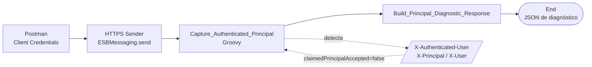
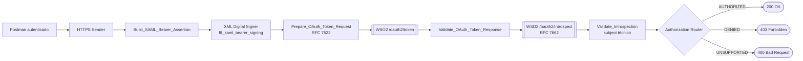
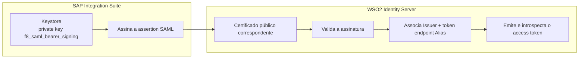
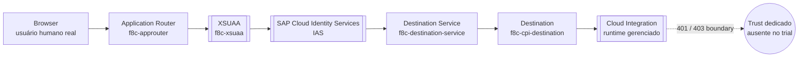
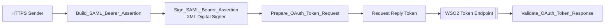
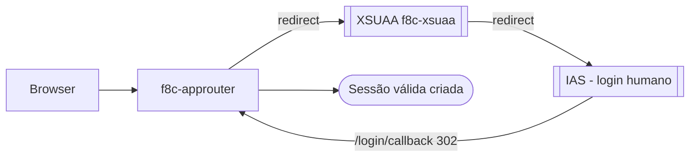

### 🔐 F8 — Authentication Context, Technical User SAML Bearer e End-User Principal Propagation (SAP MM)

**Bloco:** F — Segurança Transversal**Cenário:** F8A + F8B + F8C — SAML Bearer e Propagação de Identidade**Status:** ✅ F8A e F8B concluídos e validados · 🔎 F8C investigação arquitetural (sem evidências)**Data de execução:** 21/08/2026**iFlow F8A:** F8A\_MM\_Authenticated\_Principal\_Capture**iFlow F8B:** F8B\_MM\_SAML\_Bearer\_Technical\_User\_Token**Documento:** 30-f8-authentication-context-technical-user-saml-bearer.md

#### 📌 Visão executiva
  
Este laboratório constrói uma cadeia completa de autenticação, confiança federada e autorização entre o **SAP Integration Suite** e o **WSO2 Identity Server**, e depois investiga a propagação de identidade de um **usuário humano real** até o Cloud Integration. Ele parte de uma constatação central: uma chamada inbound autenticada por **OAuth Client Credentials** comprova a identidade da *aplicação cliente*, mas não entrega automaticamente um *usuário humano confiável* ao Integration Flow.

A jornada foi dividida em três atos que se conectam como uma narrativa técnica única:

- **F8A — Authentication Context Capture:** estabelece a linha de base. Classifica o contexto inbound, comprova a ausência de um principal humano no fluxo Client Credentials e rejeita tentativas de *identity spoofing* por headers HTTP. É o ato que fixa a premissa de segurança: *identidade sem prova criptográfica não é identidade confiável*.
- **F8B — Technical User OAuth 2.0 SAML Bearer:** entrega a prova criptográfica. Cria uma assertion SAML 2.0 de curta duração, assina o XML com uma private key protegida no Keystore, troca a assertion por um access token OAuth no WSO2 (RFC 7522), introspecta o token (RFC 7662) e aplica autorização funcional a um recurso protegido de SAP MM.
- **F8C — End-User Principal Propagation (Investigação):** tenta o passo seguinte — trocar o usuário técnico por um humano real via SAP Cloud Identity Services (IAS), Application Router e XSUAA. O login interativo foi validado de ponta a ponta, mas a propagação até o runtime gerenciado do CPI encontrou um **boundary arquitetural** no ambiente trial, aqui documentado como troubleshooting honesto, sem evidências.

Ao final, quatro controles distintos ficam comprovados em F8A/F8B — **autenticação do caller**, **confiança federada**, **token exchange** e **autorização funcional** — enquanto o F8C mapeia com precisão *onde* e *por que* a propagação de identidade humana exige um relacionamento de confiança dedicado.

#### 🎯 Objetivos técnicos
- Classificar o contexto de autenticação inbound e distinguir principal técnico de principal humano.
- Comprovar que headers declarados pelo caller não constituem identidade autenticada.
- Construir e assinar uma assertion SAML 2.0 com private key protegida no Keystore.
- Trocar a assertion por um access token OAuth conforme o perfil SAML Bearer (RFC 7522).
- Introspectar o token emitido conforme RFC 7662, validando atividade, tipo e subject.
- Aplicar autorização funcional por grupo a um recurso protegido de SAP MM.
- Comprovar READ autorizado, APPROVE negado e operação não suportada rejeitada.
- Investigar a propagação de identidade humana real via IAS, Application Router e XSUAA.
- Documentar o boundary arquitetural encontrado na propagação end-user até o CPI gerenciado.
- Registrar todo o troubleshooting sem expor segredos, tokens ou identidades reais.

#### 🧠 Fundamentos de segurança aplicados

##### Client Credentials não representa automaticamente um usuário humano
O grant Client Credentials autentica a *aplicação cliente*. No F8A, o runtime confirmou o acesso ao endpoint, mas não disponibilizou `SapAuthenticatedUserName` nem outro principal humano confiável. O contexto foi classificado como `TECHNICAL_CLIENT`.

##### Header declarado pelo caller não é identidade autenticada
Headers como `X-Authenticated-User`, `X-Principal` e `X-User` são dados controlados pelo consumidor. O laboratório permitiu esses headers apenas para *detectar* a tentativa, mas nunca os utilizou como fonte confiável de identidade.

##### SAML Bearer não é SAML Web SSO

<table>
<tr>
<th>  
OAuth 2.0 SAML Bearer
</th>
<th>  
SAML Web SSO
</th>
</tr>
<tr>
<td>  
Troca uma assertion por access token
</td>
<td>  
Cria uma sessão de login federado
</td>
</tr>
<tr>
<td>  
Não exige navegador
</td>
<td>  
Normalmente envolve navegador
</td>
</tr>
<tr>
<td>  
Usa token endpoint
</td>
<td>  
Usa SSO URL e ACS URL
</td>
</tr>
<tr>
<td>  
Adequado a chamadas backend
</td>
<td>  
Adequado a autenticação interativa
</td>
</tr>
</table>

##### Autenticação e autorização são controles diferentes

<table>
<tr>
<th>  
Controle
</th>
<th>  
Pergunta respondida
</th>
</tr>
<tr>
<td>  
Autenticação
</td>
<td>  
Quem ou qual aplicação apresentou a credencial?
</td>
</tr>
<tr>
<td>  
Introspecção
</td>
<td>  
O token está ativo e a qual contexto pertence?
</td>
</tr>
<tr>
<td>  
Autorização
</td>
<td>  
O principal pode executar a operação solicitada?
</td>
</tr>
</table>

  
Um token ativo não concede automaticamente todas as operações. O **403 Forbidden** do teste de aprovação comprova que o principal estava autenticado, mas não possuía o grupo funcional exigido.

##### Propagação de identidade humana exige trust dedicado
No F8C, o Application Router autentica o usuário humano contra o XSUAA e o IAS e cria uma sessão válida. Porém, o token resultante é emitido para o próprio XSUAA da aplicação. Para que o runtime gerenciado do Cloud Integration aceite essa identidade, é necessário um relacionamento de confiança explícito (*trust / cross-consumption*) entre o XSUAA controlado pela aplicação e o serviço gerenciado que expõe o endpoint do CPI.

## 1. Arquitetura da solução

### 1.1 F8A — Captura do contexto inbound



### 1.2 F8B — Technical User SAML Bearer, introspecção e autorização



### 1.3 F8B — Cadeia de confiança federada



### 1.4 F8C — Arquitetura pretendida de propagação end-user



### 1.5 Perfil técnico consolidado

<table>
<tr>
<th>  
Item
</th>
<th>  
Valor
</th>
</tr>
<tr>
<td>  
Integration Flow F8A
</td>
<td>  
F8A\_MM\_Authenticated\_Principal\_Capture
</td>
</tr>
<tr>
<td>  
Integration Flow F8B
</td>
<td>  
F8B\_MM\_SAML\_Bearer\_Technical\_User\_Token
</td>
</tr>
<tr>
<td>  
Endpoint F8A
</td>
<td>  
/f8a/mm/authenticated-principal
</td>
</tr>
<tr>
<td>  
Endpoint F8B
</td>
<td>  
/f8b/mm/saml-bearer/technical-user/token
</td>
</tr>
<tr>
<td>  
Authorization Server
</td>
<td>  
WSO2 Identity Server 7.0.0
</td>
</tr>
<tr>
<td>  
Java Runtime
</td>
<td>  
Eclipse Temurin JDK 17
</td>
</tr>
<tr>
<td>  
OAuth Grant
</td>
<td>  
urn:ietf:params:oauth:grant-type:saml2-bearer
</td>
</tr>
<tr>
<td>  
Technical Principal
</td>
<td>  
f8.technical.purchasing.user
</td>
</tr>
<tr>
<td>  
Buyers Group
</td>
<td>  
F8\_PURCHASING\_BUYERS
</td>
</tr>
<tr>
<td>  
Managers Group
</td>
<td>  
F8\_PURCHASING\_MANAGERS
</td>
</tr>
<tr>
<td>  
Key Pair Alias
</td>
<td>  
f8\_saml\_bearer\_signing
</td>
</tr>
<tr>
<td>  
Key Type / Size
</td>
<td>  
RSA / 3072 bits
</td>
</tr>
<tr>
<td>  
Certificate Signature Algorithm
</td>
<td>  
SHA512withRSA
</td>
</tr>
<tr>
<td>  
XML Signature / Digest
</td>
<td>  
SHA512/RSA · SHA256
</td>
</tr>
<tr>
<td>  
Protected Resource
</td>
<td>  
SAP\_MM\_PURCHASE\_REQUISITIONS
</td>
</tr>
<tr>
<td>  
Supported Operations
</td>
<td>  
READ, APPROVE
</td>
</tr>
</table>

  
O domínio ngrok utilizado no laboratório é temporário. Em produção, deve ser substituído por endpoint estável, certificado público confiável, controle de rede e disponibilidade compatível com o SLA da integração.

## 2. F8A — Authentication Context Capture

### 2.1 Estrutura e HTTPS Sender

<table>
<tr>
<th>  
Parâmetro
</th>
<th>  
Valor
</th>
</tr>
<tr>
<td>  
Address
</td>
<td>  
/f8a/mm/authenticated-principal
</td>
</tr>
<tr>
<td>  
Authorization / User Role
</td>
<td>  
User Role · ESBMessaging.send
</td>
</tr>
<tr>
<td>  
CSRF Protected
</td>
<td>  
Disabled
</td>
</tr>
<tr>
<td>  
Allowed Headers
</td>
<td>  
X-Authenticated-User \| X-Principal \| X-User (apenas para o teste de spoofing)
</td>
</tr>
</table>

### 2.2 Groovy — CaptureAuthenticatedPrincipal.groovy

O script lê os headers de identidade confiáveis do runtime, classifica o principal e **detecta** — sem aceitar — qualquer identidade declarada pelo caller.

```groovy
import com.sap.gateway.ip.core.customdev.util.Message
import java.security.MessageDigest
import java.time.Instant
def Message processData(Message message) {
    Map<String, Object> headers = message.getHeaders()
    String sapAuthenticatedUserName = readHeader(headers, "SapAuthenticatedUserName")
    String camelAuthenticatedUser = readHeader(headers, "CamelAuthenticatedUser")
    String servletRemoteUser = readServletRemoteUser(headers)
    String claimedPrincipal = getFirstAvailableHeader(
        headers,
        ["X-Authenticated-User", "X-Principal", "X-User"]
    )
    String authenticatedPrincipal = firstNonEmptyValue(
        [sapAuthenticatedUserName, camelAuthenticatedUser, servletRemoteUser]
    )
    String identitySource
    String principalType
    String principalCaptureStatus
    if (authenticatedPrincipal) {
        identitySource = determineIdentitySource(
            sapAuthenticatedUserName,
            camelAuthenticatedUser,
            servletRemoteUser
        )
        principalType = classifyPrincipal(authenticatedPrincipal)
        principalCaptureStatus = "AUTHENTICATED_PRINCIPAL_AVAILABLE"
    } else {
        authenticatedPrincipal = "NOT_EXPOSED_BY_RUNTIME"
        identitySource = "SERVICE_INSTANCE_AUTHENTICATION_CONTEXT"
        principalType = "TECHNICAL_CLIENT"
        principalCaptureStatus = "AUTHENTICATED_CLIENT_WITHOUT_USER_PRINCIPAL"
    }
    boolean claimedPrincipalProvided = claimedPrincipal != null && !claimedPrincipal.trim().isEmpty()
    String principalSha256 = authenticatedPrincipal == "NOT_EXPOSED_BY_RUNTIME"
        ? "NOT_CALCULATED"
        : calculateSha256(authenticatedPrincipal.toLowerCase())
    List<String> diagnosticHeaderNames = getDiagnosticHeaderNames(headers)
    message.setProperty("authenticatedPrincipal", authenticatedPrincipal)
    message.setProperty("principalType", principalType)
    message.setProperty("principalSha256", principalSha256)
    message.setProperty("identitySource", identitySource)
    message.setProperty("principalCaptureStatus", principalCaptureStatus)
    message.setProperty("spoofingAttemptDetected", claimedPrincipalProvided.toString())
    message.setProperty("claimedPrincipal", claimedPrincipalProvided ? claimedPrincipal : "NOT_PROVIDED")
    message.setProperty("claimedPrincipalAccepted", "false")
    message.setProperty(
        "diagnosticHeaderNames",
        diagnosticHeaderNames.isEmpty() ? "NONE" : diagnosticHeaderNames.join(", ")
    )
    message.setProperty("propagationStage", "F8A_PRINCIPAL_CAPTURE_BASELINE")
    message.setProperty("propagationMode", "NOT_DETERMINED")
    message.setProperty("endToEndPropagation", "NOT_EXECUTED")
    message.setProperty("capturedAt", Instant.now().toString())
    message.setHeader("Content-Type", "application/json")
    return message
}
def String readHeader(Map<String, Object> headers, String headerName) {
    Object headerValue = headers.get(headerName)
    if (headerValue == null) {
        return null
    }
    String normalizedValue = headerValue.toString().trim()
    return normalizedValue.isEmpty() ? null : normalizedValue
}
def String readServletRemoteUser(Map<String, Object> headers) {
    Object servletRequest = headers.get("CamelHttpServletRequest")
    if (servletRequest == null) {
        return null
    }
    try {
        String remoteUser = servletRequest.getRemoteUser()?.toString()?.trim()
        return remoteUser ? remoteUser : null
    } catch (Exception ignored) {
        return null
    }
}
def String getFirstAvailableHeader(Map<String, Object> headers, List<String> headerNames) {
    for (String headerName : headerNames) {
        String headerValue = readHeader(headers, headerName)
        if (headerValue) {
            return headerValue
        }
    }
    return null
}
def String firstNonEmptyValue(List<String> values) {
    return values.find { value -> value != null && !value.trim().isEmpty() }
}
def String determineIdentitySource(
    String sapAuthenticatedUserName,
    String camelAuthenticatedUser,
    String servletRemoteUser
) {
    if (sapAuthenticatedUserName) {
        return "SAP_AUTHENTICATED_USER_NAME"
    }
    if (camelAuthenticatedUser) {
        return "CAMEL_AUTHENTICATED_USER"
    }
    if (servletRemoteUser) {
        return "HTTPS_SERVLET_REMOTE_USER"
    }
    return "UNKNOWN"
}
def String classifyPrincipal(String authenticatedPrincipal) {
    String normalizedPrincipal = authenticatedPrincipal.toLowerCase()
    List<String> technicalPatterns = [
        "client", "service", "technical", "oauth", "runtime", "integration", "sb-"
    ]
    boolean technicalPatternDetected = technicalPatterns.any { pattern ->
        normalizedPrincipal.contains(pattern)
    }
    if (technicalPatternDetected) {
        return "TECHNICAL_CLIENT"
    }
    if (normalizedPrincipal.contains("@") && normalizedPrincipal.contains(".")) {
        return "HUMAN_USER_CANDIDATE"
    }
    return "AUTHENTICATED_PRINCIPAL"
}
def List<String> getDiagnosticHeaderNames(Map<String, Object> headers) {
    List<String> allowedHeaderNames = [
        "SapAuthenticatedUserName",
        "CamelAuthenticatedUser",
        "CamelHttpMethod",
        "CamelHttpPath",
        "CamelServletContextPath",
        "CamelHttpServletRequest"
    ]
    return allowedHeaderNames.findAll { headerName -> headers.containsKey(headerName) }
}
def String calculateSha256(String content) {
    MessageDigest digest = MessageDigest.getInstance("SHA-256")
    byte[] hash = digest.digest(content.getBytes("UTF-8"))
    return hash.collect { byteValue -> String.format("%02x", byteValue & 0xff) }.join()
}
```

### 2.3 Testes do F8A

<table>
<tr>
<th>  
Teste
</th>
<th>  
Entrada
</th>
<th>  
Resultado
</th>
</tr>
<tr>
<td>  
Baseline
</td>
<td>  
Client Credentials, sem headers de identidade
</td>
<td>  
TECHNICAL\_CLIENT, sem principal humano
</td>
</tr>
<tr>
<td>  
Spoofing
</td>
<td>  
X-Authenticated-User e X-Principal
</td>
<td>  
Detectado, mas claimedPrincipalAccepted=false
</td>
</tr>
</table>

## 3. Preparação do WSO2 Identity Server

### 3.1 Identidades e grupos

<table>
<tr>
<th>  
Identidade
</th>
<th>  
Buyers
</th>
<th>  
Managers
</th>
</tr>
<tr>
<td>  
buyer.user
</td>
<td>  
Sim
</td>
<td>  
Não
</td>
</tr>
<tr>
<td>  
purchasing.manager
</td>
<td>  
Sim
</td>
<td>  
Sim
</td>
</tr>
<tr>
<td>  
f8.technical.purchasing.user
</td>
<td>  
Sim
</td>
<td>  
Não
</td>
</tr>
</table>

### 3.2 Aplicação OAuth e Key Pair de assinatura

<table>
<tr>
<th>  
Parâmetro
</th>
<th>  
Configuração
</th>
</tr>
<tr>
<td>  
Application
</td>
<td>  
F8 SAP Integration Suite SAML Bearer Client
</td>
</tr>
<tr>
<td>  
Type / Protocol
</td>
<td>  
Standard-Based · OAuth 2.0/OpenID Connect
</td>
</tr>
<tr>
<td>  
Client Type
</td>
<td>  
Confidential
</td>
</tr>
<tr>
<td>  
Grants
</td>
<td>  
Client Credential, SAML2 (Password e Implicit desabilitados)
</td>
</tr>
<tr>
<td>  
Key Pair Alias
</td>
<td>  
f8\_saml\_bearer\_signing (CN = f8.technical.purchasing.user)
</td>
</tr>
<tr>
<td>  
Key / Signature
</td>
<td>  
RSA 3072 bits · SHA512withRSA
</td>
</tr>
<tr>
<td>  
Private Key
</td>
<td>  
Mantida exclusivamente no Keystore do SAP Integration Suite
</td>
</tr>
<tr>
<td>  
Public Certificate
</td>
<td>  
Importado no truststore do WSO2
</td>
</tr>
</table>

### 3.3 Trust lógico do Issuer

<table>
<tr>
<th>  
Campo
</th>
<th>  
Valor
</th>
</tr>
<tr>
<td>  
Connection / Issuer
</td>
<td>  
F8 SAP Integration Suite SAML Assertion Issuer
</td>
</tr>
<tr>
<td>  
Alias
</td>
<td>  
https://\<ngrok-domain\>/oauth2/token
</td>
</tr>
<tr>
<td>  
Trusted Certificate
</td>
<td>  
Certificado público do alias f8\_saml\_bearer\_signing
</td>
</tr>
</table>

  
O certificado público estabelece a confiança criptográfica; o Issuer e o Alias estabelecem a associação lógica usada pelo processador SAML Bearer do WSO2.

## 4. F8B.1 — SAML Bearer Token Exchange

### 4.1 Estrutura do fluxo



### 4.2 Groovy — BuildSAMLBearerAssertion.groovy

```groovy
import com.sap.gateway.ip.core.customdev.util.Message
import java.time.Instant
import java.time.temporal.ChronoUnit
import java.util.UUID
def Message processData(Message message) {
    Instant now = Instant.now()
    Instant notBefore = now.minus(30, ChronoUnit.SECONDS)
    Instant notOnOrAfter = now.plus(5, ChronoUnit.MINUTES)
    String assertionId = "_${UUID.randomUUID().toString()}"
    String issuer = "F8 SAP Integration Suite SAML Assertion Issuer"
    String subject = "f8.technical.purchasing.user"
    String tokenServiceUrl = "https://<ngrok-domain>/oauth2/token"
    String issueInstant = now.toString()
    String notBeforeValue = notBefore.toString()
    String notOnOrAfterValue = notOnOrAfter.toString()
    String assertion = """<saml2:Assertion xmlns:saml2="urn:oasis:names:tc:SAML:2.0:assertion" ID="${assertionId}" IssueInstant="${issueInstant}" Version="2.0">
    <saml2:Issuer>${escapeXml(issuer)}</saml2:Issuer>
    <saml2:Subject>
        <saml2:NameID Format="urn:oasis:names:tc:SAML:1.1:nameid-format:unspecified">${escapeXml(subject)}</saml2:NameID>
        <saml2:SubjectConfirmation Method="urn:oasis:names:tc:SAML:2.0:cm:bearer">
            <saml2:SubjectConfirmationData NotOnOrAfter="${notOnOrAfterValue}" Recipient="${escapeXml(tokenServiceUrl)}"/>
        </saml2:SubjectConfirmation>
    </saml2:Subject>
    <saml2:Conditions NotBefore="${notBeforeValue}" NotOnOrAfter="${notOnOrAfterValue}">
        <saml2:AudienceRestriction>
            <saml2:Audience>${escapeXml(tokenServiceUrl)}</saml2:Audience>
        </saml2:AudienceRestriction>
    </saml2:Conditions>
    <saml2:AuthnStatement AuthnInstant="${issueInstant}">
        <saml2:AuthnContext>
            <saml2:AuthnContextClassRef>urn:oasis:names:tc:SAML:2.0:ac:classes:PreviousSession</saml2:AuthnContextClassRef>
        </saml2:AuthnContext>
    </saml2:AuthnStatement>
    <saml2:AttributeStatement>
        <saml2:Attribute Name="userId">
            <saml2:AttributeValue xmlns:xsi="http://www.w3.org/2001/XMLSchema-instance" xsi:type="xs:string" xmlns:xs="http://www.w3.org/2001/XMLSchema">${escapeXml(subject)}</saml2:AttributeValue>
        </saml2:Attribute>
        <saml2:Attribute Name="email">
            <saml2:AttributeValue xmlns:xsi="http://www.w3.org/2001/XMLSchema-instance" xsi:type="xs:string" xmlns:xs="http://www.w3.org/2001/XMLSchema">f8-technical-user@example.invalid</saml2:AttributeValue>
        </saml2:Attribute>
        <saml2:Attribute Name="groups">
            <saml2:AttributeValue xmlns:xsi="http://www.w3.org/2001/XMLSchema-instance" xsi:type="xs:string" xmlns:xs="http://www.w3.org/2001/XMLSchema">F8_PURCHASING_BUYERS</saml2:AttributeValue>
        </saml2:Attribute>
    </saml2:AttributeStatement>
</saml2:Assertion>"""
    message.setProperty("samlAssertionId", assertionId)
    message.setProperty("samlIssuer", issuer)
    message.setProperty("samlSubject", subject)
    message.setProperty("samlAudience", tokenServiceUrl)
    message.setProperty("samlRecipient", tokenServiceUrl)
    message.setProperty("samlIssueInstant", issueInstant)
    message.setProperty("samlNotBefore", notBeforeValue)
    message.setProperty("samlNotOnOrAfter", notOnOrAfterValue)
    message.setProperty("samlKeyPairAlias", "f8_saml_bearer_signing")
    message.setProperty("tokenServiceUrl", tokenServiceUrl)
    message.setProperty("propagationMode", "TECHNICAL_USER_SAML_BEARER")
    message.setProperty("assertionStatus", "BUILT_NOT_SIGNED")
    message.setBody(assertion)
    message.setHeader("Content-Type", "application/xml")
    return message
}
def String escapeXml(String value) {
    if (value == null) {
        return ""
    }
    return value
        .replace("&", "&amp;")
        .replace("<", "&lt;")
        .replace(">", "&gt;")
        .replace("\"", "&quot;")
        .replace("'", "&apos;")
}
```

### 4.3 XML Digital Signer

<table>
<tr>
<th>  
Parâmetro
</th>
<th>  
Valor
</th>
</tr>
<tr>
<td>  
Private Key Alias
</td>
<td>  
f8\_saml\_bearer\_signing
</td>
</tr>
<tr>
<td>  
Signature / Digest
</td>
<td>  
SHA512/RSA · SHA256
</td>
</tr>
<tr>
<td>  
Signature Type
</td>
<td>  
Enveloped XML Signature
</td>
</tr>
<tr>
<td>  
Parent Node / Namespace
</td>
<td>  
Assertion · urn:oasis:names:tc:SAML:2.0:assertion
</td>
</tr>
<tr>
<td>  
Canonicalization
</td>
<td>  
Exclusive XML Canonicalization 1.0
</td>
</tr>
<tr>
<td>  
X.509 Chain / XML Declaration / DOCTYPE
</td>
<td>  
Enabled · Excluded · Disallowed
</td>
</tr>
</table>

### 4.4 Groovy — PrepareOAuthSAMLTokenRequest.groovy

```groovy
import com.sap.gateway.ip.core.customdev.util.Message
import java.nio.charset.StandardCharsets
import java.util.Base64
def Message processData(Message message) {
    String signedAssertion = message.getBody(String)
    if (!signedAssertion || signedAssertion.trim().isEmpty()) {
        throw new IllegalArgumentException("The signed SAML assertion cannot be empty.")
    }
    if (!signedAssertion.contains("<ds:Signature")) {
        throw new SecurityException("The SAML assertion does not contain an XML digital signature.")
    }
    String encodedAssertion = Base64
        .getUrlEncoder()
        .withoutPadding()
        .encodeToString(signedAssertion.getBytes(StandardCharsets.UTF_8))
    String grantType = "urn:ietf:params:oauth:grant-type:saml2-bearer"
    String formBody = "grant_type=${urlEncode(grantType)}&assertion=${urlEncode(encodedAssertion)}"
    message.setProperty("signedSamlAssertion", signedAssertion)
    message.setProperty("encodedAssertionLength", encodedAssertion.length().toString())
    message.setProperty("oauthGrantType", grantType)
    message.setProperty("assertionStatus", "SIGNED_AND_ENCODED")
    message.setProperty("tokenRequestPrepared", "true")
    message.setBody(formBody)
    message.setHeader("CamelHttpMethod", "POST")
    message.setHeader("Content-Type", "application/x-www-form-urlencoded")
    message.setHeader("Accept", "application/json")
    return message
}
def String urlEncode(String value) {
    return java.net.URLEncoder
        .encode(value, StandardCharsets.UTF_8.name())
        .replace("+", "%20")
}
```

## 5. F8B.2 — Token Introspection

### 5.1 Objetivo e configuração do WSO2

Confirmar, por meio do Authorization Server, que o token emitido está ativo, é do tipo Bearer, pertence ao cliente esperado, não expirou e representa o subject técnico da assertion.

```toml
[[resource.access_control]]
context = "(.*)/oauth2/introspect(.*)"
http_method = "all"
secure = true
allowed_auth_handlers = "BasicClientAuthentication"
```

### 5.2 Groovy — ValidateOAuthTokenResponse.groovy

```groovy
import com.sap.gateway.ip.core.customdev.util.Message
import groovy.json.JsonSlurper
import java.security.MessageDigest
import java.time.Instant
def Message processData(Message message) {
    Reader responseReader = message.getBody(Reader)
    String responseBody = responseReader != null ? responseReader.text : ""
    Integer responseCode = resolveHttpResponseCode(message)
    if (!responseBody || responseBody.trim().isEmpty()) {
        responseBody = "{}"
    }
    def responsePayload
    try {
        responsePayload = new JsonSlurper().parseText(responseBody)
    } catch (Exception ignored) {
        responsePayload = [
            error: "non_json_response",
            error_description: responseBody.take(500)
        ]
    }
    if (responseCode >= 400) {
        String oauthError = responsePayload.error?.toString()?.trim() ?: "oauth_token_exchange_failed"
        String oauthErrorDescription = responsePayload.error_description?.toString()?.trim()
            ?: "The WSO2 token endpoint rejected the SAML bearer assertion."
        message.setProperty("tokenExchangeStatus", "SAML_BEARER_TOKEN_REJECTED")
        message.setProperty("responseCode", responseCode.toString())
        message.setProperty("responseStatusCode", "F8B-SAML-400")
        message.setProperty("responseMessage", "The WSO2 token endpoint rejected the SAML bearer token exchange.")
        message.setProperty("oauthError", oauthError)
        message.setProperty("oauthErrorDescription", oauthErrorDescription)
        message.setProperty("tokenType", "NOT_ISSUED")
        message.setProperty("expiresIn", "NOT_PROVIDED")
        message.setProperty("scope", "NOT_PROVIDED")
        message.setProperty("internalAccessToken", "NOT_AVAILABLE")
        message.setProperty("maskedAccessToken", "NOT_ISSUED")
        message.setProperty("accessTokenSha256", "NOT_CALCULATED")
        message.setProperty("tokenIssuedAt", "NOT_ISSUED")
        message.setProperty("technicalPrincipal", "f8.technical.purchasing.user")
        message.setProperty("technicalPrincipalGroup", "F8_PURCHASING_BUYERS")
        message.setProperty("tokenIntrospectionStatus", "NOT_EXECUTED")
        message.setHeader("CamelHttpResponseCode", 400)
        message.setHeader("Content-Type", "application/json")
        return message
    }
    String accessToken = responsePayload.access_token?.toString()?.trim()
    String tokenType = responsePayload.token_type?.toString()?.trim()
    String expiresIn = responsePayload.expires_in?.toString()?.trim()
    String scope = responsePayload.scope?.toString()?.trim()
    if (!accessToken) {
        throw new SecurityException("The WSO2 response does not contain an access token.")
    }
    if (!tokenType?.equalsIgnoreCase("Bearer")) {
        throw new SecurityException("The WSO2 response does not contain a Bearer token.")
    }
    message.setProperty("tokenExchangeStatus", "SAML_BEARER_TOKEN_ISSUED")
    message.setProperty("responseCode", "200")
    message.setProperty("responseStatusCode", "F8B-SAML-200")
    message.setProperty("responseMessage", "The technical user SAML bearer assertion was exchanged for an OAuth access token.")
    message.setProperty("oauthError", "NONE")
    message.setProperty("oauthErrorDescription", "NONE")
    message.setProperty("tokenType", tokenType)
    message.setProperty("expiresIn", expiresIn ?: "NOT_PROVIDED")
    message.setProperty("scope", scope ?: "NOT_PROVIDED")
    message.setProperty("internalAccessToken", accessToken)
    message.setProperty("maskedAccessToken", maskToken(accessToken))
    message.setProperty("accessTokenSha256", calculateSha256(accessToken))
    message.setProperty("tokenIssuedAt", Instant.now().toString())
    message.setProperty("technicalPrincipal", "f8.technical.purchasing.user")
    message.setProperty("technicalPrincipalGroup", "F8_PURCHASING_BUYERS")
    message.setProperty("tokenIntrospectionStatus", "PENDING")
    message.setHeader("CamelHttpResponseCode", 200)
    message.setHeader("Content-Type", "application/json")
    return message
}
def Integer resolveHttpResponseCode(Message message) {
    Map<String, Object> headers = message.getHeaders()
    Object responseCode = headers.get("CamelHttpResponseCode")
    if (responseCode == null) {
        return 200
    }
    try {
        return Integer.parseInt(responseCode.toString())
    } catch (Exception ignored) {
        return 200
    }
}
def String maskToken(String token) {
    if (token.length() <= 12) {
        return "********"
    }
    return token.substring(0, 8) + "-****-****-" + token.substring(token.length() - 4)
}
def String calculateSha256(String content) {
    MessageDigest digest = MessageDigest.getInstance("SHA-256")
    byte[] hash = digest.digest(content.getBytes("UTF-8"))
    return hash.collect { byteValue -> String.format("%02x", byteValue & 0xff) }.join()
}
```

### 5.3 Groovy — PrepareTokenIntrospectionRequest.groovy

```groovy
import com.sap.gateway.ip.core.customdev.util.Message
import java.net.URLEncoder
import java.nio.charset.StandardCharsets
def Message processData(Message message) {
    String accessToken = message.getProperty("internalAccessToken")?.toString()?.trim()
    if (!accessToken || accessToken == "NOT_AVAILABLE") {
        throw new SecurityException("The internal access token is not available for introspection.")
    }
    String formBody = "token=" + URLEncoder.encode(accessToken, StandardCharsets.UTF_8.name())
    message.setBody(formBody)
    message.setHeader("CamelHttpMethod", "POST")
    message.setHeader("Content-Type", "application/x-www-form-urlencoded")
    message.setHeader("Accept", "application/json")
    message.setProperty("tokenIntrospectionStatus", "REQUEST_PREPARED")
    message.setProperty("introspectionRequestPrepared", "true")
    return message
}
```

### 5.4 Groovy — ValidateTokenIntrospectionResponse.groovy

O script exige token ativo, tipo Bearer e expiração futura, e **remove o token sensível** da memória após a validação (`clearSensitiveToken`).

```groovy
import com.sap.gateway.ip.core.customdev.util.Message
import groovy.json.JsonSlurper
import java.time.Instant
def Message processData(Message message) {
    Reader responseReader = message.getBody(Reader)
    String responseBody = responseReader != null ? responseReader.text : null
    if (!responseBody || responseBody.trim().isEmpty()) {
        clearSensitiveToken(message)
        throw new SecurityException("The WSO2 token introspection response cannot be empty.")
    }
    def introspectionResponse
    try {
        introspectionResponse = new JsonSlurper().parseText(responseBody)
    } catch (Exception exception) {
        clearSensitiveToken(message)
        throw new IllegalArgumentException("The WSO2 token introspection response is not valid JSON.")
    }
    boolean tokenActive = introspectionResponse.active == true ||
        introspectionResponse.active?.toString()?.equalsIgnoreCase("true")
    String tokenType = introspectionResponse.token_type?.toString()?.trim() ?: "NOT_PROVIDED"
    String authenticationContext = introspectionResponse.auth?.toString()?.trim() ?: "NOT_PROVIDED"
    String clientId = introspectionResponse.client_id?.toString()?.trim() ?: "NOT_PROVIDED"
    String audience = introspectionResponse.aud?.toString()?.trim() ?: "NOT_PROVIDED"
    String subject = resolveSubject(introspectionResponse)
    String issuedAt = introspectionResponse.iat?.toString()?.trim() ?: "NOT_PROVIDED"
    String notBefore = introspectionResponse.nbf?.toString()?.trim() ?: "NOT_PROVIDED"
    String expiresAt = introspectionResponse.exp?.toString()?.trim() ?: "NOT_PROVIDED"
    if (!tokenActive) {
        clearSensitiveToken(message)
        throw new SecurityException("The WSO2 introspection endpoint reported an inactive token.")
    }
    if (!tokenType.equalsIgnoreCase("Bearer")) {
        clearSensitiveToken(message)
        throw new SecurityException("The introspected token is not a Bearer token.")
    }
    if (expiresAt != "NOT_PROVIDED" && !isExpirationInFuture(expiresAt)) {
        clearSensitiveToken(message)
        throw new SecurityException("The introspected token has already expired.")
    }
    message.setProperty("tokenExchangeStatus", "SAML_BEARER_TOKEN_ISSUED_AND_INTROSPECTED")
    message.setProperty("responseCode", "200")
    message.setProperty("responseStatusCode", "F8B-INTROSPECTION-200")
    message.setProperty("responseMessage", "The SAML bearer access token was issued and validated through OAuth token introspection.")
    message.setProperty("tokenIntrospectionStatus", "VALIDATED")
    message.setProperty("tokenActive", "true")
    message.setProperty("introspectionTokenType", tokenType)
    message.setProperty("tokenAuthenticationContext", authenticationContext)
    message.setProperty("introspectionClientId", clientId)
    message.setProperty("introspectionAudience", audience)
    message.setProperty("introspectionSubject", subject)
    message.setProperty("introspectionIssuedAt", issuedAt)
    message.setProperty("introspectionNotBefore", notBefore)
    message.setProperty("introspectionExpiresAt", expiresAt)
    message.setProperty("tokenIntrospectedAt", Instant.now().toString())
    message.setProperty("accessTokenExposed", "false")
    clearSensitiveToken(message)
    message.setHeader("CamelHttpResponseCode", 200)
    message.setHeader("Content-Type", "application/json")
    return message
}
def String resolveSubject(def introspectionResponse) {
    List<String> candidates = [
        introspectionResponse.sub?.toString()?.trim(),
        introspectionResponse.username?.toString()?.trim(),
        introspectionResponse.user_name?.toString()?.trim()
    ]
    String subject = candidates.find { candidate -> candidate != null && !candidate.isEmpty() }
    return subject ?: "NOT_PROVIDED"
}
def boolean isExpirationInFuture(String expirationValue) {
    try {
        long expirationEpoch = Long.parseLong(expirationValue)
        return expirationEpoch > Instant.now().getEpochSecond()
    } catch (Exception ignored) {
        return true
    }
}
def void clearSensitiveToken(Message message) {
    message.setProperty("internalAccessToken", "REMOVED_AFTER_INTROSPECTION")
}
```

## 6. F8B.3 — Protected Resource Authorization

### 6.1 Política funcional

<table>
<tr>
<th>  
Operação
</th>
<th>  
Grupo exigido
</th>
<th>  
Buyers
</th>
<th>  
Managers
</th>
</tr>
<tr>
<td>  
READ
</td>
<td>  
F8\_PURCHASING\_BUYERS
</td>
<td>  
Autorizado
</td>
<td>  
Autorizado
</td>
</tr>
<tr>
<td>  
APPROVE
</td>
<td>  
F8\_PURCHASING\_MANAGERS
</td>
<td>  
Negado
</td>
<td>  
Autorizado
</td>
</tr>
<tr>
<td>  
Outro valor
</td>
<td>  
Não aplicável
</td>
<td>  
Não avaliado
</td>
<td>  
Não avaliado
</td>
</tr>
</table>

  
O technical user do F8B pertence somente a `F8_PURCHASING_BUYERS`. Por isso, READ retorna **200** e APPROVE retorna **403**.

### 6.2 Groovy — PrepareAuthorizationContext.groovy

```groovy
import com.sap.gateway.ip.core.customdev.util.Message
import java.time.Instant
def Message processData(Message message) {
    String requestedOperation = message.getHeader("X-F8-Operation", String)?.trim()?.toUpperCase()
    String tokenActive = message.getProperty("tokenActive")?.toString()?.trim()
    String tokenIntrospectionStatus = message.getProperty("tokenIntrospectionStatus")?.toString()?.trim()
    String introspectionSubject = message.getProperty("introspectionSubject")?.toString()?.trim()
    String expectedPrincipal = message.getProperty("technicalPrincipal")?.toString()?.trim()
    String availableGroupsValue = message.getProperty("technicalPrincipalGroup")?.toString()?.trim()
    if (!requestedOperation) {
        requestedOperation = "NOT_PROVIDED"
    }
    if (!tokenActive?.equalsIgnoreCase("true")) {
        throw new SecurityException("Authorization cannot continue because the introspected token is not active.")
    }
    if (!tokenIntrospectionStatus?.equalsIgnoreCase("VALIDATED")) {
        throw new SecurityException("Authorization cannot continue because token introspection was not validated.")
    }
    if (!introspectionSubject || introspectionSubject == "NOT_PROVIDED") {
        throw new SecurityException("Authorization cannot continue because the introspected subject is not available.")
    }
    if (!expectedPrincipal || !introspectionSubject.equalsIgnoreCase(expectedPrincipal)) {
        throw new SecurityException("The introspected subject does not match the expected technical principal.")
    }
    List<String> availableGroups = parseGroups(availableGroupsValue)
    String requiredGroup
    String authorizationDecision
    String authorizationReason
    String operationDescription
    switch (requestedOperation) {
        case "READ":
            requiredGroup = "F8_PURCHASING_BUYERS"
            operationDescription = "Read SAP MM purchase requisitions"
            if (availableGroups.contains("F8_PURCHASING_BUYERS") ||
                availableGroups.contains("F8_PURCHASING_MANAGERS")) {
                authorizationDecision = "AUTHORIZED"
                authorizationReason = "The introspected principal belongs to a group authorized to read SAP MM purchase requisitions."
            } else {
                authorizationDecision = "DENIED"
                authorizationReason = "The introspected principal does not belong to a group authorized to read SAP MM purchase requisitions."
            }
            break
        case "APPROVE":
            requiredGroup = "F8_PURCHASING_MANAGERS"
            operationDescription = "Approve SAP MM purchase requisitions"
            if (availableGroups.contains("F8_PURCHASING_MANAGERS")) {
                authorizationDecision = "AUTHORIZED"
                authorizationReason = "The introspected principal belongs to the purchasing managers group."
            } else {
                authorizationDecision = "DENIED"
                authorizationReason = "The introspected principal belongs to the buyers group but not to the purchasing managers group."
            }
            break
        default:
            requiredGroup = "NOT_APPLICABLE"
            operationDescription = "Unsupported protected resource operation"
            authorizationDecision = "UNSUPPORTED"
            authorizationReason = "The requested operation is not supported. Allowed operations are READ and APPROVE."
    }
    message.setProperty("requestedOperation", requestedOperation)
    message.setProperty("operationDescription", operationDescription)
    message.setProperty("protectedResource", "SAP_MM_PURCHASE_REQUISITIONS")
    message.setProperty("requiredGroup", requiredGroup)
    message.setProperty("availableGroups", availableGroups.isEmpty() ? "NONE" : availableGroups.join(","))
    message.setProperty("matchedGroup", resolveMatchedGroup(authorizationDecision, requiredGroup, availableGroups))
    message.setProperty("authorizationDecision", authorizationDecision)
    message.setProperty("authorizationReason", authorizationReason)
    message.setProperty("authorizationEvaluatedAt", Instant.now().toString())
    message.setProperty("identitySourceForAuthorization", "WSO2_TOKEN_INTROSPECTION_SUBJECT")
    message.setProperty("authorizationPolicy", "F8B_PURCHASE_REQUISITION_GROUP_POLICY")
    return message
}
def List<String> parseGroups(String groupsValue) {
    if (!groupsValue || groupsValue == "NOT_PROVIDED") {
        return []
    }
    return groupsValue
        .split("[,;|]")
        .collect { group -> group.trim().toUpperCase() }
        .findAll { group -> !group.isEmpty() }
}
def String resolveMatchedGroup(
    String authorizationDecision,
    String requiredGroup,
    List<String> availableGroups
) {
    if (authorizationDecision != "AUTHORIZED") {
        return "NONE"
    }
    if (availableGroups.contains(requiredGroup)) {
        return requiredGroup
    }
    if (requiredGroup == "F8_PURCHASING_BUYERS" &&
        availableGroups.contains("F8_PURCHASING_MANAGERS")) {
        return "F8_PURCHASING_MANAGERS"
    }
    return "NONE"
}
```

### 6.3 Router e códigos HTTP

<table>
<tr>
<th>  
Rota
</th>
<th>  
Condição
</th>
<th>  
Código
</th>
</tr>
<tr>
<td>  
Authorization\_Granted
</td>
<td>  
${property.authorizationDecision} = 'AUTHORIZED'
</td>
<td>  
200
</td>
</tr>
<tr>
<td>  
Authorization\_Denied
</td>
<td>  
${property.authorizationDecision} = 'DENIED'
</td>
<td>  
403
</td>
</tr>
<tr>
<td>  
Unsupported\_Operation
</td>
<td>  
Default Route
</td>
<td>  
400
</td>
</tr>
</table>

## 7. F8C — End-User Principal Propagation (Investigação Arquitetural)

Depois de comprovar a propagação de identidade **técnica** no F8B, o F8C tenta o passo seguinte e mais ambicioso: propagar a identidade de um **usuário humano real** até o Cloud Integration. O login interativo foi validado, mas a cadeia até o runtime gerenciado do CPI esbarrou num boundary arquitetural. Por decisão de escopo, o F8C é registrado como investigação técnica honesta, **sem evidências**, pois a pasta correspondente foi reservada para o próximo documento.

### 7.1 Objetivo e diferença em relação ao F8B

<table>
<tr>
<th>  
Dimensão
</th>
<th>  
F8B (concluído)
</th>
<th>  
F8C (investigação)
</th>
</tr>
<tr>
<td>  
Identidade propagada
</td>
<td>  
Usuário técnico (f8.technical.purchasing.user)
</td>
<td>  
Usuário humano real autenticado no IAS
</td>
</tr>
<tr>
<td>  
Mecanismo
</td>
<td>  
OAuth 2.0 SAML Bearer (RFC 7522)
</td>
<td>  
Login interativo OIDC via Application Router e XSUAA
</td>
</tr>
<tr>
<td>  
Navegador
</td>
<td>  
Não exigido
</td>
<td>  
Exigido (fluxo interativo)
</td>
</tr>
<tr>
<td>  
Ponto crítico
</td>
<td>  
Trust do certificado no WSO2
</td>
<td>  
Trust entre XSUAA da aplicação e runtime gerenciado do CPI
</td>
</tr>
<tr>
<td>  
Resultado
</td>
<td>  
Cadeia completa validada
</td>
<td>  
Login validado; propagação até o CPI não concluída
</td>
</tr>
</table>

### 7.2 Componentes provisionados

<table>
<tr>
<th>  
Componente
</th>
<th>  
Papel na arquitetura
</th>
</tr>
<tr>
<td>  
SAP Cloud Identity Services (IAS)
</td>
<td>  
Identity Provider corporativo — gerencia ativação e login do usuário real
</td>
</tr>
<tr>
<td>  
f8c-approuter
</td>
<td>  
Application Router que inicia o login OIDC e mantém a sessão (@sap/approuter 22.x)
</td>
</tr>
<tr>
<td>  
f8c-xsuaa
</td>
<td>  
Service instance XSUAA responsável pela autenticação OAuth/OIDC da aplicação
</td>
</tr>
<tr>
<td>  
f8c-destination-service
</td>
<td>  
Service instance de Destination usada pelo Approuter para resolver o backend
</td>
</tr>
<tr>
<td>  
f8c-cpi-destination
</td>
<td>  
Destination lógica que aponta para o endpoint do Cloud Integration
</td>
</tr>
<tr>
<td>  
Grupos de negócio (IAS)
</td>
<td>  
F8\_Purchasing\_Buyers · F8\_Purchasing\_Managers
</td>
</tr>
</table>

  
O runtime observado foi Node 22.x com Application Router 22.x sobre stack `cflinuxfs4`. Identificadores concretos de tenant, subaccount, client IDs, client secrets, e-mails de usuários reais e domínios temporários **não** são reproduzidos neste documento; qualquer segredo exposto nos testes deve ser considerado comprometido e rotacionado.

### 7.3 Motivação para SAP Cloud Identity Services (IAS)
Durante a preparação, observou-se que o **Default identity provider** do SAP BTP Cockpit não envia e-mails de convite para usuários criados manualmente, enquanto o **IAS** gerencia adequadamente o ciclo de ativação e envia as mensagens necessárias. O fluxo *Esqueceu a senha* do IAS Admin Console também funcionou para ativação administrativa. Por isso o IAS foi adotado como Identity Provider, aproximando o laboratório de um desenho corporativo realista.

### 7.4 Login interativo validado



Ao acessar a Route pública, o Application Router redirecionou o navegador ao XSUAA e, na sequência, ao IAS. Após a autenticação do usuário real, o callback `/login/callback` retornou **302** e uma sessão válida foi criada. A camada de autenticação humana (Browser → Approuter → XSUAA → IAS) ficou comprovadamente operacional.

### 7.5 Troubleshooting consolidado das tentativas de propagação

<table>
<tr>
<th>  
#
</th>
<th>  
Sintoma
</th>
<th>  
Causa
</th>
<th>  
Correção / Conclusão
</th>
</tr>
<tr>
<td>  
1
</td>
<td>  
Destination antiga reaparecendo
</td>
<td>  
Variável User-Provided `destinations` persistente com forwardAuthToken
</td>
<td>  
Remover a variável explicitamente e refazer o restage
</td>
</tr>
<tr>
<td>  
2
</td>
<td>  
Route references unknown destination
</td>
<td>  
Destination Service ausente ou não vinculado
</td>
<td>  
Criar e vincular a service instance de Destination
</td>
</tr>
<tr>
<td>  
3
</td>
<td>  
Binding removido no deploy
</td>
<td>  
Manifest reescrito somente com o XSUAA
</td>
<td>  
Manter XSUAA e Destination Service no manifest
</td>
</tr>
<tr>
<td>  
4
</td>
<td>  
401 no teste direto ao CPI
</td>
<td>  
Placeholders colados literalmente nas credenciais
</td>
<td>  
Usar valores reais e escapar caracteres especiais no shell
</td>
</tr>
<tr>
<td>  
5
</td>
<td>  
500 no teste direto ao CPI
</td>
<td>  
Basic Auth aceita, mas token de usuário ausente no Groovy
</td>
<td>  
Comprova que o request alcançou o iFlow após autenticação
</td>
</tr>
<tr>
<td>  
6
</td>
<td>  
Header de autorização ausente no middleware
</td>
<td>  
Authorization Bearer construído em estágio posterior do pipeline
</td>
<td>  
Estratégia de duplicação de JWT descartada
</td>
</tr>
<tr>
<td>  
7
</td>
<td>  
401 com token encaminhado (NoAuthentication)
</td>
<td>  
CPI não aceita o JWT do XSUAA da aplicação
</td>
<td>  
Necessário trust dedicado ao runtime gerenciado
</td>
</tr>
<tr>
<td>  
8
</td>
<td>  
403 com OAuth2JWTBearer
</td>
<td>  
Falta de trust e cross-consumption entre XSUAA e serviço gerenciado
</td>
<td>  
Boundary arquitetural do ambiente trial
</td>
</tr>
</table>

### 7.6 Boundary arquitetural encontrado
Todas as tentativas convergiram para o mesmo ponto: a identidade humana é autenticada com sucesso pela camada Application Router + XSUAA + IAS, mas o token resultante é emitido para o XSUAA **controlado pela aplicação**. Para que o runtime gerenciado do Cloud Integration aceite essa identidade, é necessário um relacionamento de confiança explícito e dedicado (*trust / cross-consumption*) entre esse XSUAA e o serviço gerenciado que expõe o endpoint do CPI. No ambiente trial, esse relacionamento não estava disponível de forma direta, o que impediu concluir a propagação end-user até o iFlow.

> ⚠️ Este é um boundary observado **no ambiente trial** deste laboratório. Não deve ser generalizado como impossibilidade universal. Desenhos corporativos com SAP BTP e SAP Cloud Integration podem estabelecer esse trust por meios oficiais e governados, o que exigiria configuração específica fora do escopo desta investigação.

### 7.7 Estado final do F8C

<table>
<tr>
<th>  
Item
</th>
<th>  
Estado
</th>
</tr>
<tr>
<td>  
Login humano real
</td>
<td>  
Validado
</td>
</tr>
<tr>
<td>  
Application Router / XSUAA / Destination Service
</td>
<td>  
Running · funcional · vinculado
</td>
</tr>
<tr>
<td>  
Basic Authentication ao CPI
</td>
<td>  
Validada isoladamente
</td>
</tr>
<tr>
<td>  
Propagação end-user até o CPI
</td>
<td>  
Não concluída (boundary arquitetural)
</td>
</tr>
<tr>
<td>  
Evidências do F8C
</td>
<td>  
Não geradas (pasta reservada ao próximo documento)
</td>
</tr>
</table>

## 8. Evidências (F8A e F8B)
  
As evidências abaixo pertencem exclusivamente ao F8A e ao F8B, validadas contra os nomes técnicos da pasta `evidences/lab28`. O F8C não possui evidências, conforme a seção 7. A narrativa segue a ordem natural da jornada: **capturar o contexto → provar que spoofing não passa → preparar a confiança federada → emitir e introspectar o token → autorizar por identidade**.

### 8.1 F8A — Do contexto técnico à rejeição de spoofing

[Evidência 01 — F8A iFlow](../evidences/lab28/01-cpi-f8a-authenticated-principal-capture-iflow.png)  
**Evidência 01:** o iFlow F8A está implantado e iniciado, com a captura segura do contexto e a construção da resposta de diagnóstico. É o ponto de partida da narrativa: ainda não há identidade humana, apenas o contexto técnico.

[Evidência 02 — Runtime Configuration](../evidences/lab28/02-cpi-f8a-principal-capture-runtime-configuration.png)  
**Evidência 02:** a Runtime Configuration permite os headers de identidade **somente** para detectar tentativas controladas de spoofing — nunca para confiar neles.

[Evidência 03 — Baseline técnico](../evidences/lab28/03-postman-f8a-technical-client-baseline.png)  
**Evidência 03:** a chamada Client Credentials retorna `TECHNICAL_CLIENT`, sem principal humano e sem propagação ponta a ponta. Fica provado que a aplicação está autenticada, mas nenhum usuário humano foi propagado.

[Evidência 04 — Spoofing rejeitado](../evidences/lab28/04-postman-f8a-spoofed-principal-header-rejected.png)  
**Evidência 04:** os headers declarados pelo caller são detectados, mas `claimedPrincipalAccepted=false`. Esta evidência fecha o F8A com a premissa que sustenta todo o F8B: identidade sem prova criptográfica não é aceita.

### 8.2 Preparação da confiança federada (WSO2 e OAuth)

[Evidência 05 — Console WSO2](../evidences/lab28/05-wso2-f8-identity-server-console-overview.png)  
**Evidência 05:** o WSO2 Identity Server está operacional, pronto para administrar aplicações, identidades, grupos e connections — a base sobre a qual a confiança federada será construída.

[Evidência 06 — Grupos de compras](../evidences/lab28/06-wso2-f8-purchasing-user-groups-created.png)  
**Evidência 06:** grupos separados para compradores e gestores, insumo direto da política de autorização do F8B.3.

[Evidência 07 — Usuários de compras](../evidences/lab28/07-wso2-f8-purchasing-users-created.png)  
**Evidência 07:** identidades fictícias de buyer e manager. O principal técnico foi criado depois e associado ao grupo Buyers, sem captura adicional.

[Evidência 08 — Aplicação OAuth](../evidences/lab28/08-wso2-f8-oauth-application-created.png)  
**Evidência 08:** a aplicação confidencial OAuth/OIDC foi criada com Client ID e Client Secret protegido.

[Evidência 09 — Grant SAML2 habilitado](../evidences/lab28/09-wso2-f8-saml2-bearer-grant-enabled.png)  
**Evidência 09:** os grants Client Credential e SAML2 estão habilitados; grants legados permanecem desabilitados, aplicando menor privilégio.

[Evidência 10 — Token local por Client Credentials](../evidences/lab28/10-postman-f8-wso2-client-credentials-token-issued.png)  
**Evidência 10:** o token endpoint local emitiu Bearer token, validando a infraestrutura OAuth **antes** de introduzir o SAML Bearer.

[Evidência 11 — Túnel HTTPS](../evidences/lab28/11-ngrok-f8-wso2-public-https-tunnel-active.png)  
**Evidência 11:** o túnel HTTPS temporário encaminha o domínio público ao WSO2 local na porta 9443.

[Evidência 12 — Token endpoint público](../evidences/lab28/12-postman-f8-wso2-public-token-endpoint-validated.png)  
**Evidência 12:** a URL pública do token endpoint foi validada com Client Credentials antes de ser usada pelo SAP Integration Suite.

[Evidência 13 — Key Pair](../evidences/lab28/13-cpi-f8-saml-bearer-signing-key-pair-created.png)  
**Evidência 13:** o Key Pair RSA de 3072 bits foi criado com CN correspondente ao principal técnico. A private key permanece no tenant — o coração da confiança criptográfica.

[Evidência 14 — Issuer, Alias e trust](../evidences/lab28/14-postman-f8-wso2-saml-issuer-alias-configuration-validated.png)  
**Evidência 14:** a Management API confirmou Issuer, token endpoint Alias, Connection habilitada e certificado confiável. A confiança federada está pronta.

### 8.3 F8B.1 — Emissão do token

[Evidência 15 — Token SAML Bearer emitido](../evidences/lab28/15-postman-f8b-technical-user-saml-bearer-token-issued.png)  
**Evidência 15:** a assertion assinada foi aceita pelo WSO2 e trocada por Bearer token, **mascarado** antes da resposta. É o clímax do token exchange (RFC 7522).

[Evidência 16 — Processamento do token exchange](../evidences/lab28/16-cpi-f8b-saml-bearer-token-exchange-message-processing.png)  
**Evidência 16:** o Monitor comprova a execução completa: geração, assinatura, token request, validação e resposta.

### 8.4 F8B.2 — Introspecção

[Evidência 17 — iFlow com introspecção](../evidences/lab28/17-cpi-f8b-saml-bearer-token-introspection-iflow.png)  
**Evidência 17:** o iFlow contém uma segunda chamada outbound dedicada à introspecção do access token.

[Evidência 18 — Token ativo e subject técnico](../evidences/lab28/18-postman-f8b-saml-bearer-token-introspection-validated.png)  
**Evidência 18:** a introspecção confirmou token ativo, tipo Bearer e subject `f8.technical.purchasing.user`, sem expor o token integral.

[Evidência 19 — Processamento da introspecção](../evidences/lab28/19-cpi-f8b-token-introspection-message-processing.png)  
**Evidência 19:** o Monitor comprova os dois ciclos outbound: emissão e introspecção.

### 8.5 F8B.3 — Autorização por identidade

[Evidência 20 — iFlow com Router de autorização](../evidences/lab28/20-cpi-f8b-protected-resource-authorization-iflow.png)  
**Evidência 20:** o iFlow implantado contém a política com caminhos concedido, negado e operação não suportada.

[Evidência 21 — READ autorizado](../evidences/lab28/21-postman-f8b-purchase-requisition-read-authorized.png)  
**Evidência 21:** o principal técnico do grupo Buyers recebeu **200 OK** e acessou o recurso protegido de requisições de compra.

[Evidência 22 — Caminho autorizado](../evidences/lab28/22-cpi-f8b-authorized-resource-message-processing.png)  
**Evidência 22:** o Router selecionou `Authorization_Granted` e finalizou em `End_Authorized`.

[Evidência 23 — APPROVE negado](../evidences/lab28/23-postman-f8b-purchase-requisition-approval-denied.png)  
**Evidência 23:** o token estava ativo, mas o principal Buyers não possuía o grupo Managers. A resposta correta foi **403 Forbidden** — a prova viva de que autenticação ≠ autorização.

[Evidência 24 — Caminho negado](../evidences/lab28/24-cpi-f8b-authorization-denied-message-processing.png)  
**Evidência 24:** o Router selecionou `Authorization_Denied`, sem retornar dados do recurso protegido.

[Evidência 25 — Operação não suportada](../evidences/lab28/25-postman-f8b-unsupported-operation-rejected.png)  
**Evidência 25:** a operação DELETE retornou **400 Bad Request** e informou as operações permitidas.

[Evidência 26 — Caminho default](../evidences/lab28/26-cpi-f8b-unsupported-operation-message-processing.png)  
**Evidência 26:** a rota default tratou a operação não suportada e finalizou em `End_Unsupported`, encerrando a narrativa de autorização.

## 9. Troubleshooting

### 9.1 SapAuthenticatedUserName ausente
**Sintoma:** SecurityException no F8A.  
**Causa:** o fluxo Client Credentials autenticou uma aplicação técnica, mas não disponibilizou principal humano.  
**Correção:** classificar o contexto como `AUTHENTICATED_CLIENT_WITHOUT_USER_PRINCIPAL`, sem confiar em headers do caller.

### 9.2 Headers de spoofing não chegam ao Groovy
**Causa:** headers customizados não estavam permitidos na Runtime Configuration.  
**Correção:** adicionar `X-Authenticated-User | X-Principal | X-User` em Allowed Headers.

### 9.3 502 Bad Gateway no ngrok
**Causa:** o túnel estava online, mas o WSO2 não estava ouvindo em localhost:9443.  
**Correção:** iniciar o WSO2, validar `TcpTestSucceeded : True` e manter as janelas do WSO2 e ngrok abertas.

### 9.4 Identity provider is null
**Causa:** o certificado estava no truststore, mas o Issuer da assertion não estava associado a uma Connection lógica no WSO2.  
**Correção:** criar a Connection SAML e associar o certificado ao Issuer.

### 9.5 Token Endpoint alias has not been configured
**Causa:** a Connection foi localizada, mas o Alias do token endpoint estava vazio.  
**Correção:** atualizar homeRealmIdentifier, alias e descrição pela Identity Provider Management API.

### 9.6 Properties aparecem como texto literal
**Causa:** Message Body configurado como Constant.  
**Correção:** alterar o tipo para Expression.

### 9.7 Significado de 401, 403 e 400

<table>
<tr>
<th>  
Código
</th>
<th>  
Significado no cenário
</th>
</tr>
<tr>
<td>  
401
</td>
<td>  
Credencial ausente ou inválida (no F8C: CPI não aceitou o JWT do XSUAA da aplicação)
</td>
</tr>
<tr>
<td>  
403
</td>
<td>  
Principal autenticado, mas sem permissão (no F8C: ausência de trust/cross-consumption)
</td>
</tr>
<tr>
<td>  
400
</td>
<td>  
Operação funcional não suportada
</td>
</tr>
</table>

## 10. Boas práticas SAP e de mercado
- Manter private keys exclusivamente em Keystore gerenciado.
- Exportar apenas certificados públicos para estabelecer trust.
- Usar assertions com validade curta e tolerância mínima de clock skew.
- Validar Issuer, Audience, Recipient, assinatura, subject e validade.
- Não usar headers customizados como identidade confiável.
- Não retornar access tokens integrais em respostas, logs ou evidências.
- Separar autenticação, introspecção e autorização funcional.
- Usar 403 Forbidden para principal autenticado sem permissão.
- Aplicar o princípio do menor privilégio a usuários, grupos, scopes e aplicações administrativas.
- Rotacionar chaves e certificados com sobreposição controlada.
- Proteger endpoints administrativos e de introspecção.
- Remover túneis temporários após os testes.
- Para propagação de identidade humana, estabelecer trust dedicado entre o Authorization Server da aplicação e o serviço gerenciado consumido, em vez de encaminhar tokens sem relacionamento de confiança.
- Preferir SAP Cloud Identity Services (IAS) como Identity Provider corporativo.
- Remover variáveis de ambiente User-Provided obsoletas antes de reconfigurar destinations no Application Router.

## 11. Recomendações para produção

<table>
<tr>
<th>  
Área
</th>
<th>  
Recomendação
</th>
</tr>
<tr>
<td>  
Authorization Server
</td>
<td>  
Alta disponibilidade, backup e observabilidade
</td>
</tr>
<tr>
<td>  
Endpoint público
</td>
<td>  
DNS corporativo, WAF/API Gateway e certificado válido
</td>
</tr>
<tr>
<td>  
Key Pair / Assertion
</td>
<td>  
Expiração, rotação, revogação, janela curta e proteção contra replay
</td>
</tr>
<tr>
<td>  
Token / Introspection
</td>
<td>  
TTL compatível com o risco; client dedicado e escopo mínimo na introspecção
</td>
</tr>
<tr>
<td>  
Authorization
</td>
<td>  
Preferir grupos, roles e scopes provenientes do Authorization Server
</td>
</tr>
<tr>
<td>  
Logs / Auditoria
</td>
<td>  
Não registrar tokens/secrets; correlacionar principal, client, token hash, operação e resultado
</td>
</tr>
<tr>
<td>  
Propagação de identidade
</td>
<td>  
Trust dedicado entre XSUAA da aplicação e runtime gerenciado, ou backend próprio que aceite o token do usuário
</td>
</tr>
</table>

### 11.1 Limitação consciente do laboratório
A associação funcional ao grupo `F8_PURCHASING_BUYERS` foi mantida em property controlada pelo iFlow para exercitar autorização técnica. Em produção, grupos, roles ou scopes devem vir de **claims confiáveis do token** ou de uma fonte de autorização governada, e não definidos estaticamente no fluxo.

### 11.2 Limitação do Security Material nativo
O artifact nativo OAuth2 SAML Bearer Assertion do SAP Integration Suite oferece perfis específicos para SuccessFactors, SAP BTP Neo e SAP BTP Cloud Foundry. Como o WSO2 é um Authorization Server externo genérico, o laboratório implementou o perfil RFC 7522 de forma vendor-neutral, mantendo a private key protegida pelo XML Digital Signer.

### 11.3 Limitação de propagação end-user no ambiente trial
No F8C, a propagação da identidade humana até o runtime gerenciado do Cloud Integration não foi concluída por ausência de trust/cross-consumption dedicados no ambiente trial. Em produção, esse relacionamento pode ser estabelecido por meios oficiais e governados do SAP BTP.

## 12. Conclusão
  
O cenário demonstrou uma cadeia completa de segurança de identidade no caminho positivo:

Contexto inbound classificado
→ tentativa de spoofing rejeitada
→ assertion SAML 2.0 construída e assinada
→ trust federado no WSO2
→ token exchange OAuth SAML Bearer
→ introspecção do token
→ autorização funcional por grupo
→ READ 200 · APPROVE 403 · DELETE 400

E investigou, no F8C, a fronteira seguinte:

Login humano real via IAS + Approuter + XSUAA
→ sessão válida criada
→ propagação até o runtime gerenciado do CPI
→ boundary arquitetural (trust dedicado ausente no trial)

O laboratório comprova que **autenticação, confiança federada, emissão de token, introspecção e autorização** são controles distintos e complementares, e que **token válido não significa autorização irrestrita**. A identidade confiável deve ser derivada de mecanismos criptográficos e do Authorization Server, nunca de headers arbitrários enviados pelo consumidor.  
**Recursos praticados:** OAuth 2.0 SAML Bearer · RFC 7522 · RFC 7662 Token Introspection · XML Digital Signature · SHA512withRSA · RSA 3072 · WSO2 Identity Server · SAP Cloud Identity Services (IAS) · Application Router · XSUAA · Destination Service · SAP MM Purchase Requisition Authorization · Principal Propagation · B2B Security  
**Cenário anterior:** [F7 — PGP Message-Level Security](./29-f7-pgp-message-level-security.md)**Próximo cenário:** [F8D — SAML Web SSO Federation](./32-f8-saml-web-sso-federation.md)

### 📚 Referências oficiais SAP
- [Deploying an OAuth2 SAML Bearer Assertion](https://help.sap.com/docs/integration-suite/isuite-integrations-and-apis/deploying-oauth2-saml-bearer-assertion)
- [OAuth 2.0 SAML Bearer Assertion Authentication](https://help.sap.com/docs/CX_CNS_ESM/f1437ed0c63b464983503b1a1dc6af8a/444f4b2632d0489b9145f8af4a66b8d7.html)
- [RFC 7522 — SAML 2.0 Profile for OAuth 2.0](https://www.rfc-editor.org/info/rfc7522)
- [RFC 7662 — OAuth 2.0 Token Introspection](https://www.rfc-editor.org/info/rfc7662)
- [WSO2 — Token Introspection](https://is.docs.wso2.com/en/6.1.0/references/concepts/authorization/introspection/)
- [SAP Cloud Identity Services](https://help.sap.com/docs/identity-authentication)
- [Application Router](https://help.sap.com/docs/btp/sap-business-technology-platform/application-router)
- [Authorization and Trust Management (XSUAA)](https://help.sap.com/docs/btp/sap-business-technology-platform/authorization-and-trust-management-in-cloud-foundry-environment)
- [Destination Service](https://help.sap.com/docs/connectivity/sap-btp-connectivity-cf/consuming-destination-service)

#### 🛠️ Ferramentas utilizadas
- SAP Integration Suite — Cloud Integration
- SAP BTP Process Integration Runtime
- SAP Cloud Identity Services (IAS)
- SAP BTP — Application Router, XSUAA e Destination Service
- WSO2 Identity Server 7.0.0
- Eclipse Temurin JDK 17
- ngrok
- Postman
- Groovy
- PowerShell
- Cloud Foundry CLI
- Visual Studio Code
- Git e GitHub

#### 👤 Autor / 📬 Contato
  
[LinkedIn](https://www.linkedin.com/in/orlando-caetano/)[GitHub](https://github.com/OrlandoCaetano2026)  
**Orlando Caetano**Especialista SAP • Integração • Inteligência Artificial
Consultor SAP MM com know-how em PP, QM e WM  
📌 Projeto de estudo e portfólio. Os cenários SAP MM, PP e QM são simulações educativas para prática de integração.
