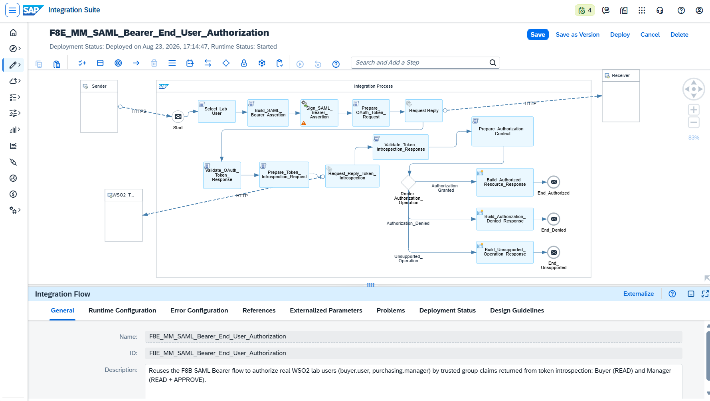
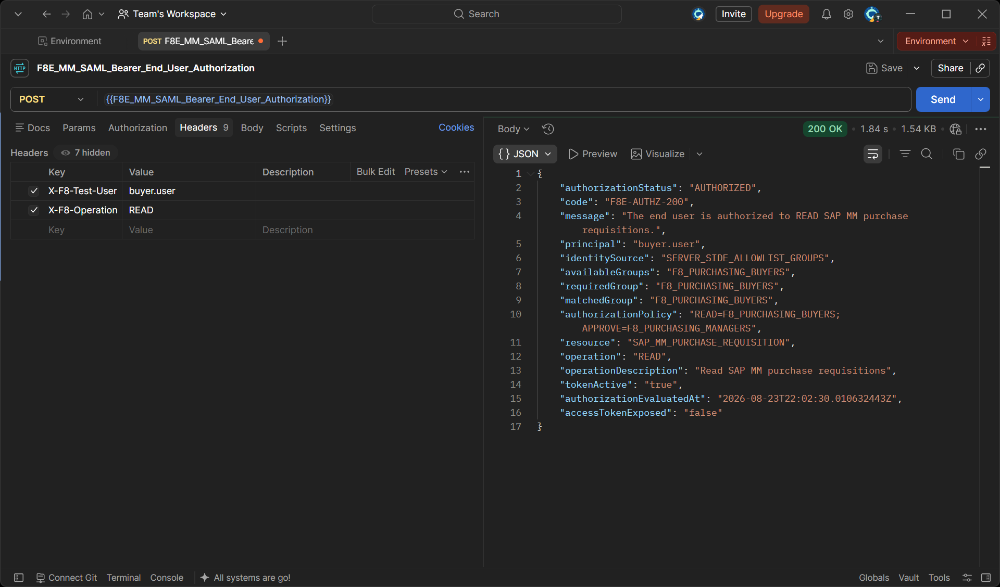
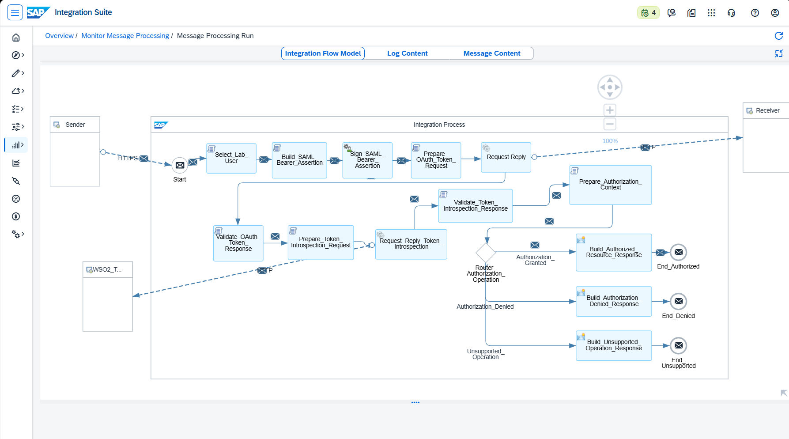
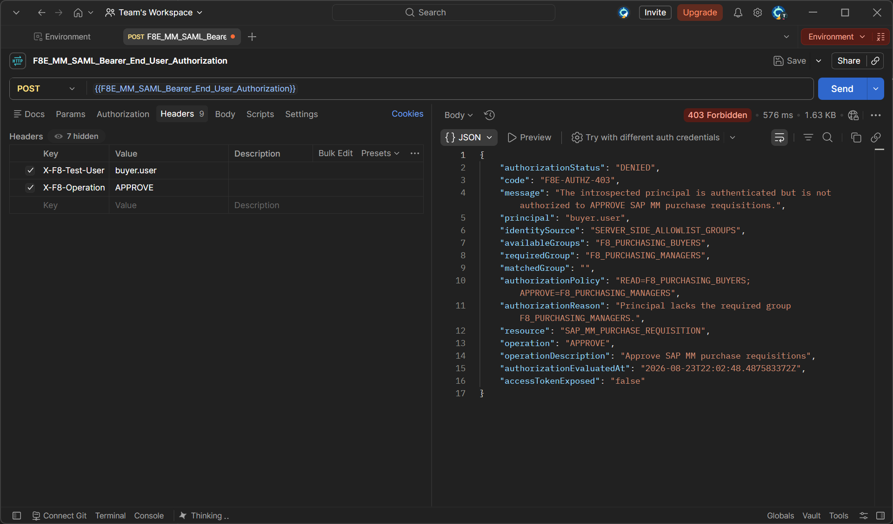
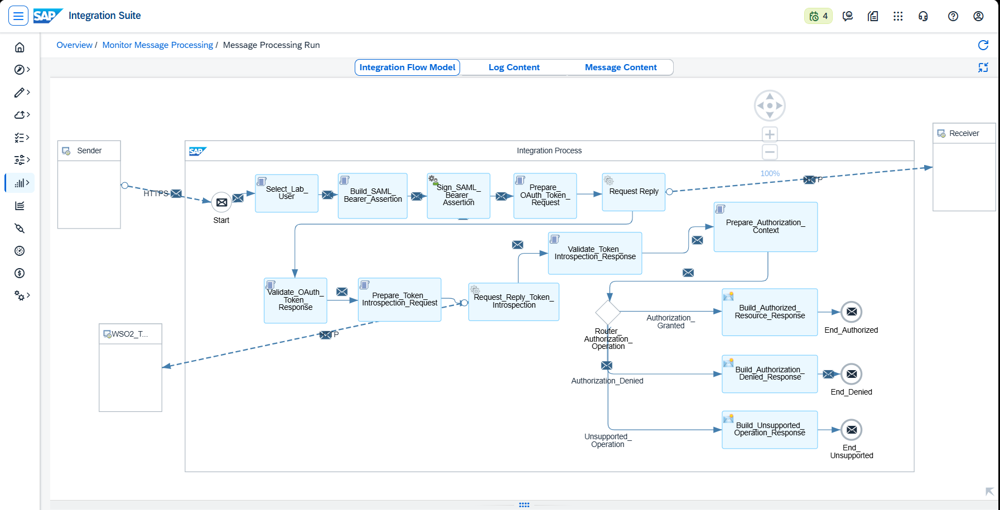
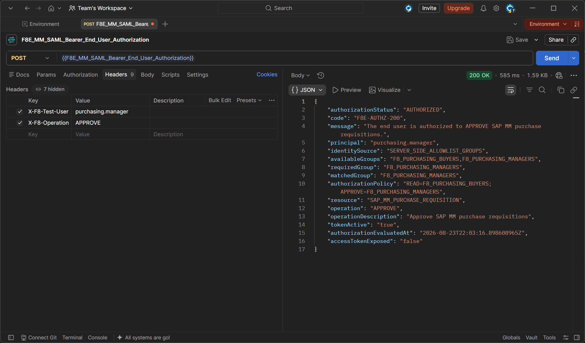
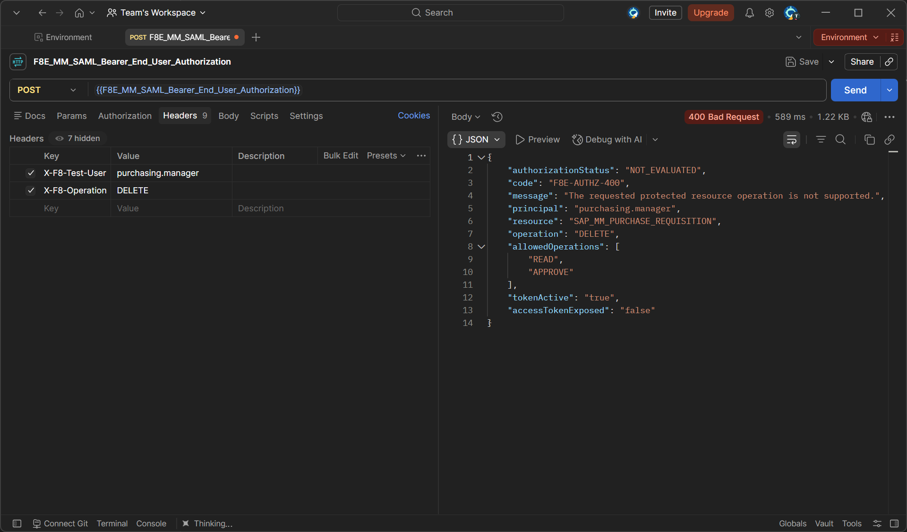
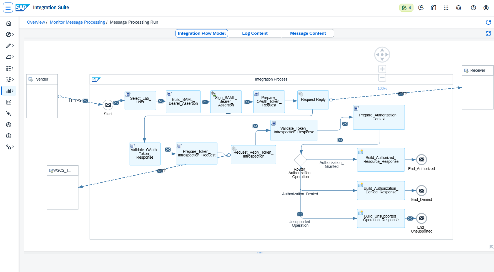

# 🔐 F8E — End-User SAML Bearer e Autorização Baseada em Grupos

**Bloco F — Segurança** · Documento 31
Escopo: reutilização da cadeia OAuth 2.0 SAML Bearer do F8B para **usuários finais** de laboratório, com autorização por operação (READ/APPROVE) e por grupo, incluindo negativa de autorização e operação não suportada.

← Bloco anterior: [F8A–F8B–F8C — Authentication Context, Technical User SAML Bearer e End-User Principal Propagation](./30-f8-authentication-context-technical-user-saml-bearer.md)
→ Próximo cenário: [H1 — Event Mesh: Publish/Subscribe](./32-h1-event-mesh-publish-subscribe.md)

---

## 🧾 Perfil técnico

| Campo | Detalhe |
|---|---|
| Bloco | F — Segurança |
| Cenário | F8E — End-User OAuth 2.0 SAML Bearer com autorização por grupo |
| Nível | Avançado |
| Tecnologias principais | SAP Integration Suite, Cloud Integration, Groovy, XML Digital Signer, WSO2 Identity Server |
| Domínio funcional | SAP MM — Purchase Requisition |
| Padrões praticados | OAuth 2.0 SAML Bearer (RFC 7522), Token Introspection (RFC 7662), autorização baseada em grupo e operação |
| Integration Flow | `F8E_MM_SAML_Bearer_End_User_Authorization` |
| Usuários de laboratório | `buyer.user` · `purchasing.manager` |
| Objetivo | Demonstrar autorização de usuário final por grupo e por operação sobre um recurso protegido, reaproveitando a cadeia técnica do F8B |
| Resultado global | READ autorizado, APPROVE diferenciado por grupo e operação inválida rejeitada, sem expor o access token |

---

## 🎯 Visão executiva

Este cenário evolui o fluxo SAML Bearer validado no F8B, substituindo o principal técnico fixo por **usuários finais de laboratório**. A cadeia de segurança permanece a mesma — construção e assinatura da SAML Assertion, troca por access token no WSO2 e introspecção do token — mas o foco desloca-se para a **decisão de autorização** de cada usuário sobre o recurso `SAP_MM_PURCHASE_REQUISITION`.

O laboratório diferencia dois papéis: `buyer.user`, associado ao grupo `F8_PURCHASING_BUYERS`, e `purchasing.manager`, associado a `F8_PURCHASING_BUYERS` e `F8_PURCHASING_MANAGERS`. Cada operação exige um grupo específico:

- **READ** exige `F8_PURCHASING_BUYERS`.
- **APPROVE** exige `F8_PURCHASING_MANAGERS`.
- Qualquer outra operação é tratada como **não suportada**.

O resultado comprova quatro decisões distintas mais uma rejeição de operação inválida, demonstrando que autenticação e autorização são camadas separadas e que pertencer a um grupo privilegiado não concede acesso irrestrito.

> 📌 **Transparência técnica:** embora a `Description` do iFlow mencione `trusted group claims returned from token introspection`, as respostas finais capturadas identificam explicitamente `identitySource = SERVER_SIDE_ALLOWLIST_GROUPS`. Este documento registra o comportamento efetivamente evidenciado e **não** atribui os grupos à introspection. A materialização do claim `groups` diretamente no JWT fica como melhoria futura de hardening.

---

## 🧠 Conceito: autenticação, validação de token e autorização são camadas distintas

O cenário separa deliberadamente três decisões que muitas vezes são confundidas:

1. **Autenticação / token exchange** — a SAML Assertion assinada é trocada por um access token no WSO2.
2. **Validação do token** — a introspecção confirma `active = true`.
3. **Autorização funcional** — a regra avalia o grupo necessário para a operação solicitada.

Um token válido e ativo **não** implica autorização para executar uma operação de negócio. É exatamente isso que a evidência de APPROVE negado para o Buyer demonstra: o principal está autenticado, o token está ativo, e ainda assim a operação é recusada por ausência do grupo necessário.

---

## 🏗️ Arquitetura

```text
Postman
  │  X-F8-Test-User / X-F8-Operation
  ▼
SAP Integration Suite
  ├─ Select_Lab_User
  ├─ Build_SAML_Bearer_Assertion
  ├─ Sign_SAML_Bearer_Assertion
  ├─ Prepare_OAuth_Token_Request
  ├─ Request Reply ──────────────► WSO2 (/oauth2/token)
  ├─ Validate_OAuth_Token_Response
  ├─ Prepare_Token_Introspection_Request
  ├─ Request_Reply_Token_Introspection ─► WSO2 (/oauth2/introspect)
  ├─ Validate_Token_Introspection_Response
  ├─ Prepare_Authorization_Context
  └─ Router_Authorization_Operation
       ├─ Authorization_Granted   → Build_Authorized_Resource_Response   → 200
       ├─ Authorization_Denied    → Build_Authorization_Denied_Response  → 403
       └─ Unsupported_Operation   → Build_Unsupported_Operation_Response → 400
```

**Evidência 01:** o iFlow `F8E_MM_SAML_Bearer_End_User_Authorization` está implantado e com Runtime Status `Started`. O modelo apresenta os três caminhos após o Router de autorização: `Authorization_Granted`, `Authorization_Denied` e `Unsupported_Operation`. A `Description` do artefato descreve o cenário de autorização de usuário final por grupo.



---

## 🧩 Modelo de autorização exercitado

| Principal | Operação | Grupo necessário | Resultado esperado |
|---|---|:---:|---|
| `buyer.user` | READ | `F8_PURCHASING_BUYERS` | AUTHORIZED / 200 |
| `buyer.user` | APPROVE | `F8_PURCHASING_MANAGERS` | DENIED / 403 |
| `purchasing.manager` | READ | `F8_PURCHASING_BUYERS` | AUTHORIZED / 200 |
| `purchasing.manager` | APPROVE | `F8_PURCHASING_MANAGERS` | AUTHORIZED / 200 |
| `purchasing.manager` | DELETE | Fora da allowlist | NOT_EVALUATED / 400 |

---

## 🧪 Fase 1 — Buyer: READ autorizado

O primeiro teste estabelece o comportamento positivo mínimo. No Postman, o `buyer.user` solicita `READ`. A resposta é **HTTP 200**, com `authorizationStatus` igual a `AUTHORIZED`, `code` `F8E-AUTHZ-200`, `availableGroups`, `requiredGroup` e `matchedGroup` iguais a `F8_PURCHASING_BUYERS`, `tokenActive` igual a `true` e `accessTokenExposed` igual a `false`.

```text
X-F8-Test-User: buyer.user
X-F8-Operation: READ
```

**Evidência 02:** `buyer.user` executa `READ` e recebe **200 AUTHORIZED**, com correspondência de grupo em `F8_PURCHASING_BUYERS`.



**Evidência 03:** representação do ramo `Authorization_Granted → Build_Authorized_Resource_Response → End_Authorized` no modelo de integração. A imagem documenta o caminho arquitetural correspondente à decisão positiva; o resultado efetivo é comprovado pela resposta do Postman acima.



---

## 🧪 Fase 2 — Buyer: APPROVE negado

No segundo teste, o `buyer.user` solicita `APPROVE`. A resposta é **HTTP 403**, com `authorizationStatus` igual a `DENIED` e `code` `F8E-AUTHZ-403`. O grupo `F8_PURCHASING_BUYERS` permanece disponível, porém a operação `APPROVE` exige `F8_PURCHASING_MANAGERS`; o `matchedGroup` fica vazio e o `authorizationReason` informa a ausência do grupo necessário.

```text
X-F8-Test-User: buyer.user
X-F8-Operation: APPROVE
```

**Evidência 04:** `buyer.user` tenta `APPROVE` e recebe **403 DENIED**. Esta é a evidência-chave da separação entre autenticação e autorização: o principal está autenticado e o token está ativo, mas a operação é negada por falta de grupo.



**Evidência 05:** representação do ramo `Authorization_Denied → Build_Authorization_Denied_Response → End_Denied` no modelo de integração.



---

## 🧪 Fase 3 — Manager: READ autorizado

O `purchasing.manager` solicita `READ` e recebe **HTTP 200**. A resposta apresenta `F8_PURCHASING_BUYERS` e `F8_PURCHASING_MANAGERS` como grupos disponíveis; para `READ`, o `requiredGroup` e o `matchedGroup` são `F8_PURCHASING_BUYERS`.

```text
X-F8-Test-User: purchasing.manager
X-F8-Operation: READ
```

**Evidência 06:** `purchasing.manager` executa `READ` e recebe **200 AUTHORIZED**.


---

## 🧪 Fase 4 — Manager: APPROVE autorizado

O `purchasing.manager` solicita `APPROVE` e recebe **HTTP 200**. O grupo requerido é `F8_PURCHASING_MANAGERS` e o `matchedGroup` também é `F8_PURCHASING_MANAGERS`, comprovando a diferença funcional entre Buyer e Manager sobre a mesma operação privilegiada.

```text
X-F8-Test-User: purchasing.manager
X-F8-Operation: APPROVE
```

**Evidência 07:** `purchasing.manager` executa `APPROVE` e recebe **200 AUTHORIZED**, com correspondência em `F8_PURCHASING_MANAGERS`.



**Evidência 08:** representação do retorno ao ramo `Authorization_Granted` para uma decisão privilegiada autorizada.


---

## 🧪 Fase 5 — Manager: DELETE não suportado

O último teste demonstra que o papel de Manager não equivale a acesso irrestrito. O `purchasing.manager` solicita `DELETE` e recebe **HTTP 400**, com `authorizationStatus` igual a `NOT_EVALUATED` e `code` `F8E-AUTHZ-400`. A resposta apresenta `allowedOperations` com `READ` e `APPROVE`.

```text
X-F8-Test-User: purchasing.manager
X-F8-Operation: DELETE
```

**Evidência 09:** `purchasing.manager` tenta `DELETE` e recebe **400 NOT_EVALUATED**, com a allowlist de operações explicitada na resposta.



**Evidência 10:** representação do ramo `Unsupported_Operation → Build_Unsupported_Operation_Response → End_Unsupported` no modelo de integração.



---

## 📊 Matriz final de testes

| Caso | Usuário | Operação | HTTP | Decisão |
|:---:|---|:---:|:---:|---|
| T1 | `buyer.user` | READ | 200 | AUTHORIZED |
| T2 | `buyer.user` | APPROVE | 403 | DENIED |
| T3 | `purchasing.manager` | READ | 200 | AUTHORIZED |
| T4 | `purchasing.manager` | APPROVE | 200 | AUTHORIZED |
| T5 | `purchasing.manager` | DELETE | 400 | NOT_EVALUATED |

---

## 🛠️ Troubleshooting

| Sintoma | Causa raiz | Solução aplicada |
|---|---|---|
| Todas as chamadas caindo em DENIED com `availableGroups` vazio | O JWT emitido pelo WSO2 não materializou o claim `groups`, mesmo com `scope=groups openid` | Resolver os grupos server-side no `Select_Lab_User` via allowlist (`SERVER_SIDE_ALLOWLIST_GROUPS`), sem confiar em grupo declarado pelo caller |
| `SecurityException: access token is not available` no contexto de autorização | Código de parsing do token colado no step incorreto, deixando `internalAccessToken` sem valor | Restaurar o `Validate_OAuth_Token_Response` como responsável por popular `internalAccessToken` e manter a decisão de grupo no `Prepare_Authorization_Context` |
| Header `X-F8-Test-User` não chega ao Groovy | Header não declarado em Allowed Header(s) do iFlow | Incluir `X-F8-Operation,X-F8-Test-User` em Runtime Configuration |
| Resposta mostrando código `F8B-*` no cenário F8E | Content Modifiers de resposta herdados do F8B | Atualizar os bodies para os códigos `F8E-AUTHZ-200/403/400` e principais dinâmicos |

---

## ✅ Boas práticas SAP aplicadas

- Nunca expor o access token na resposta de negócio: as cinco respostas capturadas registram `accessTokenExposed=false`.
- Separar autenticação, validação de token e autorização como decisões independentes, conforme o modelo de segurança do [SAP Cloud Integration](https://help.sap.com/docs/cloud-integration).
- Não confiar em headers controlados pelo consumidor como fonte de grupos ou privilégios; resolver a identidade e os grupos server-side.
- Manter a matriz de autorização explícita por operação e tratar operação fora da allowlist como caso distinto (`NOT_EVALUATED`) da negativa por falta de privilégio (`DENIED`).
- Em produção, substituir a allowlist específica do laboratório por uma fonte corporativa governada de grupos/roles.

---

## 📚 Referências oficiais SAP

- [SAP Integration Suite — SAP Help Portal](https://help.sap.com/docs/integration-suite)
- [SAP Cloud Integration — SAP Help Portal](https://help.sap.com/docs/cloud-integration)
- [OAuth 2.0 SAML Bearer Assertion Flow](https://help.sap.com/docs/cloud-integration/sap-cloud-integration/oauth2-saml-bearer-assertion)
- [WSO2 Identity Server — Documentação](https://is.docs.wso2.com/)
- [RFC 7522 — SAML 2.0 Bearer Assertion Profile for OAuth 2.0](https://datatracker.ietf.org/doc/html/rfc7522)
- [RFC 7662 — OAuth 2.0 Token Introspection](https://datatracker.ietf.org/doc/html/rfc7662)

---

## 🧰 Ferramentas utilizadas

- SAP Integration Suite — Cloud Integration
- SAP BTP Process Integration Runtime
- WSO2 Identity Server 7.0.0
- JDK 17 (Eclipse Temurin)
- ngrok
- Postman
- Groovy
- PowerShell
- Visual Studio Code
- Git e GitHub

---

## 👤 Autor / 📇 Contato

 

**Orlando Caetano**
Especialista SAP • Integração • Inteligência Artificial
Consultor SAP MM com know-how em PP, QM e WM

   

> 📌 Projeto de estudo e portfólio. Os cenários SAP MM, PP e QM são simulações educativas para prática de integração.
