# H1 — Solace PubSub+ Event Mesh Foundation: Direct and Guaranteed Messaging

> **Bloco H — Event-Driven Integration / Event Mesh**  
> **Documento 32**  
> **Objetivo:** construir, configurar e validar um Event Broker real baseado em Solace PubSub+, consolidando os fundamentos de arquitetura orientada a eventos antes da integração do SAP Cloud Integration via AMQP.

---

## 1. Perfil técnico do cenário

| Item | Implementação |
|---|---|
| Cenário | H1 — Event Mesh Foundation |
| Broker | Solace PubSub+ Cloud |
| Service | `H1-EventMesh-Broker` |
| Message VPN | `h1-eventmesh-broker` |
| Service Type | Developer |
| Cloud | Amazon Web Services |
| Região | `eks-sa-east-1a` |
| Broker Release | 10.26 |
| Queue | `H1.Q.MM.PURCHASE_ORDER` |
| Queue durability | Durable |
| Access Type | Exclusive |
| Queue quota | 100 MB |
| Topic | `sap/mm/purchaseorder/created/v1` |
| Domínio de negócio | SAP MM — Purchase Order |
| Padrões praticados | Publish/Subscribe, Direct Messaging, Topic-to-Queue Mapping, Guaranteed Messaging, Persistent Messaging, Durable Queue, Temporal Decoupling |
| Evidências | `evidences/Lab30/` — 10 imagens |

---

## 2. Visão executiva

Este cenário inaugura o Bloco H com uma decisão deliberada: antes de conectar SAP Cloud Integration, aplicações externas, MQTT, RabbitMQ ou Kafka, o laboratório estabelece uma compreensão prática do componente central de uma arquitetura orientada a eventos: o **event broker**.

O ambiente SAP BTP trial utilizado no projeto não disponibilizou a capability Event Mesh/EMIS para ativação. Em vez de reduzir o cenário a uma simulação, foi utilizado **Solace PubSub+ Cloud**, tecnologia diretamente relacionada aos fundamentos estudados em SAP Integration Suite, advanced event mesh. O SAP Learning descreve Advanced Event Mesh como baseado em Solace PubSub+ e destaca publish/subscribe, hierarchical topics, guaranteed delivery, persistence, event filtering e múltiplos protocolos como padrões fundamentais da solução.

O laboratório foi construído em duas partes complementares:

1. **Direct Messaging:** um Publisher publica `PurchaseOrderCreated` em um topic e um Subscriber online recebe o evento imediatamente.
2. **Guaranteed Messaging:** o mesmo padrão de negócio é publicado com delivery mode Persistent. Uma durable queue inscrita no topic mantém os eventos mesmo quando não existe consumer ativo; posteriormente, um consumer associa-se à queue, recebe os eventos e a fila retorna a zero.

O resultado demonstra na prática a diferença entre **comunicação em tempo real dependente de consumidor online** e **mensageria garantida com desacoplamento temporal**, fundamento essencial para arquiteturas event-driven resilientes.

---

## 3. Objetivos de aprendizagem

Ao concluir H1, o laboratório comprova capacidade de:

- provisionar um event broker Solace PubSub+ em cloud;
- compreender o papel do Message VPN;
- desenhar topics hierárquicos orientados ao evento de negócio;
- criar durable queues e associar topic subscriptions;
- diferenciar Direct Messaging de Guaranteed Messaging;
- publicar mensagens Persistent;
- observar retenção enquanto o consumer está offline;
- associar um consumer a um guaranteed endpoint;
- entender acknowledgement e remoção da mensagem da queue;
- compreender Access Type `Exclusive` como preparação para os cenários posteriores de competing consumers e scaling.

---

## 4. Fundamentos arquiteturais

### 4.1 Event-Driven Architecture

Em EDA, o produtor informa que **algo aconteceu**, sem precisar conhecer todos os sistemas interessados naquele acontecimento. O event broker recebe o evento, aplica regras de roteamento e o entrega aos consumidores relevantes.

No H1, o fato de negócio é:

```text
PurchaseOrderCreated
```

O endereço lógico utilizado foi:

```text
sap/mm/purchaseorder/created/v1
```

A escolha explicita domínio, objeto, verbo/evento e versão, facilitando evolução, subscriptions seletivas e governança.

### 4.2 Topic não é Queue

O **topic** representa o endereço lógico utilizado para roteamento. A **queue** é um endpoint de Guaranteed Messaging capaz de manter mensagens destinadas ao consumo confiável.

Neste laboratório, a queue:

```text
H1.Q.MM.PURCHASE_ORDER
```

possui a subscription:

```text
sap/mm/purchaseorder/created/v1
```

Assim, mensagens atraídas pelo topic podem ser armazenadas na durable queue independentemente da existência de um consumer conectado.

### 4.3 Direct versus Guaranteed

| Característica | Direct Messaging | Guaranteed Messaging |
|---|---|---|
| Objetivo | baixa latência e entrega imediata | entrega confiável |
| Consumer precisa estar online | normalmente sim | não |
| Endpoint durável | não obrigatório | durable queue recomendada |
| Spooling | não é a base do modelo | sim |
| Delivery Mode praticado | Direct | Persistent |
| Uso típico | telemetria efêmera, atualizações instantâneas | pedidos, comandos e eventos de negócio que não podem ser perdidos |

O Solace documenta que Guaranteed Messaging mantém mensagens até confirmar a entrega requerida e pode continuar entregando mesmo quando o consumidor esteve offline. Durable queues sobrevivem à desconexão do consumer e são recomendadas quando a mensagem precisa permanecer disponível.

### 4.4 Exclusive Queue

`H1.Q.MM.PURCHASE_ORDER` foi configurada como **Exclusive**.

Nesse modo, somente um consumer permanece ativo para a queue; consumidores adicionais podem atuar como standby, e a ordem de entrega é preservada. Cenários posteriores do Bloco H contrastarão este comportamento com Non-Exclusive queues e competing consumers.

---

# 5. Arquitetura

## 5.1 Arquitetura geral

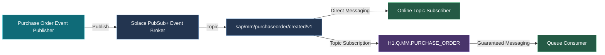

**Leitura da arquitetura:** o Publisher conhece somente o topic. O broker decide quais subscriptions são atraídas. Um subscriber online pode receber diretamente, enquanto a durable queue mantém uma cópia elegível para Guaranteed Messaging e desacopla a disponibilidade do consumidor da disponibilidade do produtor.

## 5.2 Arquitetura detalhada do teste

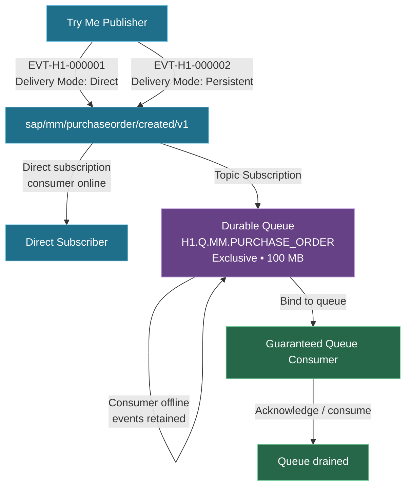

A segunda arquitetura representa exatamente a sequência executada e explica por que Direct e Persistent foram testados separadamente.

---

# 6. Implementação passo a passo e evidências

## 6.1 Provisionamento do broker Developer

O primeiro passo foi criar um Event Broker Service dedicado ao laboratório, evitando misturar o cenário com outros brokers ou configurações. Foi utilizado o Service Type `Developer`, com 100 conexões e 25 GB de Message Spool, hospedado em AWS na região `eks-sa-east-1a`.

O Message VPN foi definido como:

```text
h1-eventmesh-broker
```

### Evidência 01 — Configuração do Event Broker

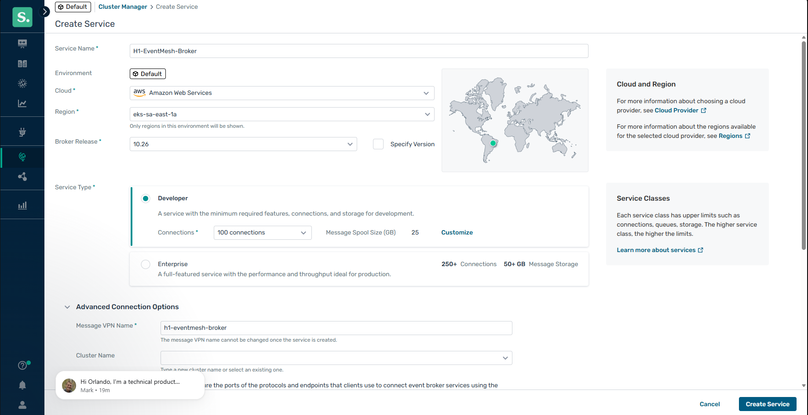

**O que esta evidência comprova:** configuração do serviço `H1-EventMesh-Broker`, classe Developer, AWS, região selecionada, release do broker, limite de conexões, capacidade de spool e Message VPN utilizado no laboratório.

---

## 6.2 Broker em execução

Após o provisionamento, o serviço atingiu estado `Running`. Esta etapa é importante porque separa a criação declarativa do efetivo funcionamento do runtime do broker.

### Evidência 02 — Event Broker Running

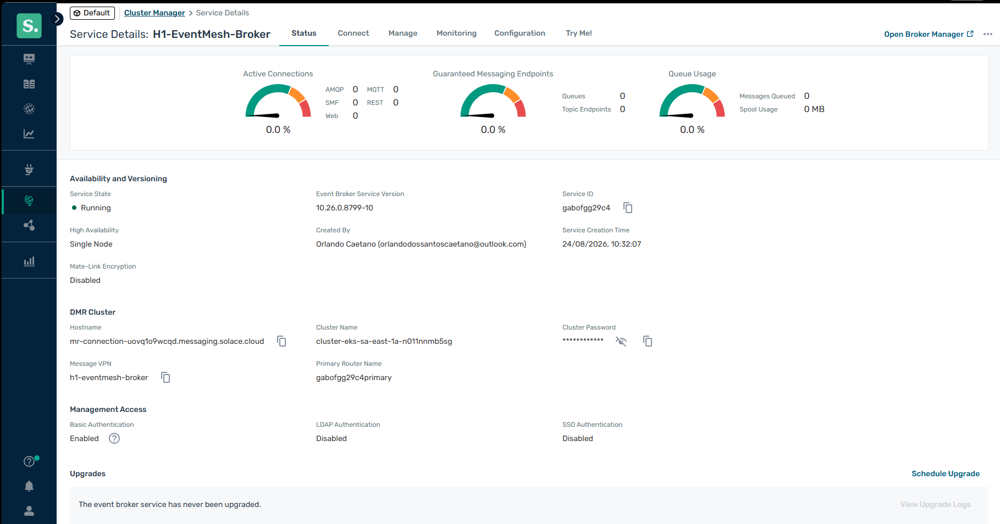

**O que esta evidência comprova:** broker ativo, versão efetivamente provisionada, Message VPN associado e baseline inicial de conexões, queues e utilização antes da configuração de mensageria.

> **Nota de segurança/publicação:** screenshots de ambientes cloud devem ser revisados antes do push para garantir que e-mail, passwords, tokens ou demais credenciais não sejam publicados. Credenciais do Try Me não fazem parte deste documento.

---

## 6.3 Baseline do Message VPN

Antes da criação da queue, foi registrado o estado-base do Message VPN. Esse baseline permite comparar o ambiente antes e depois da adição de endpoints e consumidores.

### Evidência 03 — Message VPN baseline

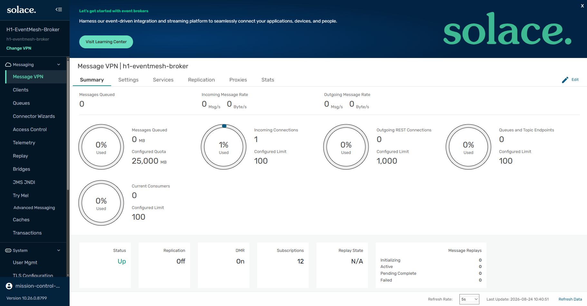

**O que esta evidência comprova:** Message VPN operacional, limites do ambiente e ausência inicial de filas de negócio naquele instante do laboratório.

---

## 6.4 Criação da Topic Subscription

Foi criada a queue de negócio:

```text
H1.Q.MM.PURCHASE_ORDER
```

A queue foi associada ao topic:

```text
sap/mm/purchaseorder/created/v1
```

A importância dessa associação é arquitetural: o Publisher não precisa publicar diretamente para uma implementação física de consumidor. O publisher expressa semanticamente o evento no topic e o broker resolve quais endpoints são interessados.

### Evidência 04 — Topic Subscription

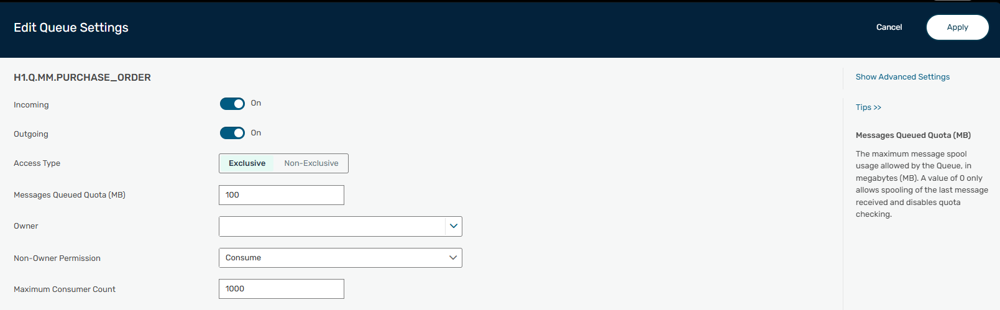

**O que esta evidência comprova:** `H1.Q.MM.PURCHASE_ORDER` possui uma Topic Subscription específica para eventos `PurchaseOrderCreated` versão 1.

---

## 6.5 Configuração da Durable Exclusive Queue

A queue foi configurada com:

| Propriedade | Valor |
|---|---|
| Incoming | On |
| Outgoing | On |
| Access Type | Exclusive |
| Messages Queued Quota | 100 MB |
| Non-Owner Permission | Consume |
| Maximum Consumer Count | 1000 |
| Durability | Durable |

A quota foi deliberadamente reduzida para 100 MB no laboratório, evitando reservar desnecessariamente parte relevante do spool total para uma única queue.

### Evidência 05 — Durable Exclusive Queue

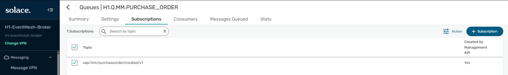

**O que esta evidência comprova:** a queue está habilitada para ingress/egress, usa Access Type Exclusive, quota de 100 MB e permissão de consumo. Essa configuração fornece a base para Guaranteed Messaging.

---

# 7. Teste A — Direct Publish/Subscribe

## 7.1 Conexão do Publisher e Subscriber

O recurso `Try Me!` foi utilizado para remover variáveis externas e testar diretamente o comportamento do broker. Publisher e Subscriber foram conectados ao mesmo Message VPN.

### Evidência 06 — Publisher e Subscriber conectados

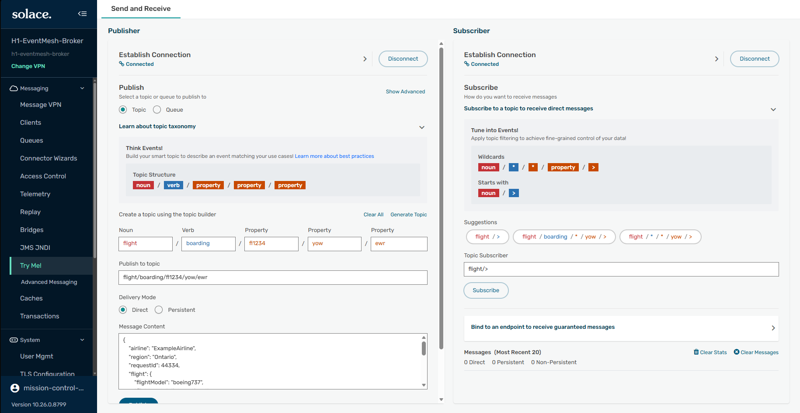

**O que esta evidência comprova:** os dois clientes de teste estabeleceram sessão com o event broker e estavam aptos à troca de eventos.

---

## 7.2 Evento Direct

O subscriber assinou diretamente:

```text
sap/mm/purchaseorder/created/v1
```

O primeiro evento foi criado especificamente para este cenário:

```json
{
  "eventType": "PurchaseOrderCreated",
  "eventVersion": "1.0",
  "eventId": "EVT-H1-000001",
  "timestamp": "2026-08-24T10:45:00-03:00",
  "source": "SAP_MM_LAB",
  "data": {
    "purchaseOrder": "4500010001",
    "companyCode": "1000",
    "purchasingOrganization": "1000",
    "supplier": "SUP-10001",
    "currency": "BRL",
    "totalValue": 18500.00
  }
}
```

O Publisher enviou a mensagem em modo **Direct**. Como o subscriber estava online e inscrito no topic, o evento foi entregue imediatamente.

### Evidência 07 — Direct event published and received

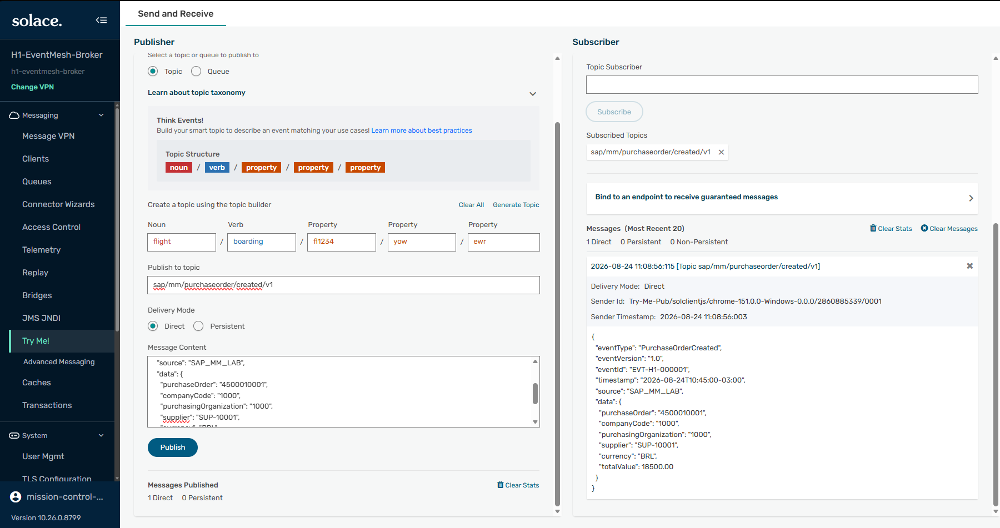

**O que esta evidência comprova:** `EVT-H1-000001` foi publicado no topic correto e recebido pelo subscriber direto. A tela registra `Delivery Mode: Direct`, criando um baseline explícito para comparação com o teste Persistent.

### Interpretação

Direct Messaging é adequado quando a prioridade é distribuição imediata e a aplicação aceita a semântica desse modelo. O teste seguinte altera intencionalmente a necessidade de negócio: o evento de Purchase Order deve permanecer disponível mesmo sem consumer ativo.

---

# 8. Teste B — Persistent / Guaranteed Messaging

## 8.1 Evento Persistent com consumidor da queue offline

Para testar desacoplamento temporal, o cenário removeu a dependência do subscriber direto e publicou um novo evento com **Delivery Mode: Persistent**.

```json
{
  "eventType": "PurchaseOrderCreated",
  "eventVersion": "1.0",
  "eventId": "EVT-H1-000002",
  "timestamp": "2026-08-24T11:15:00-03:00",
  "source": "SAP_MM_LAB",
  "data": {
    "purchaseOrder": "4500010002",
    "companyCode": "1000",
    "purchasingOrganization": "1000",
    "supplier": "SUP-10002",
    "currency": "BRL",
    "totalValue": 32750.00
  }
}
```

Como `H1.Q.MM.PURCHASE_ORDER` possuía a subscription correspondente, o broker encaminhou eventos elegíveis à durable queue, mesmo sem consumer conectado.

### Evidência 08 — Persistent events retained in queue

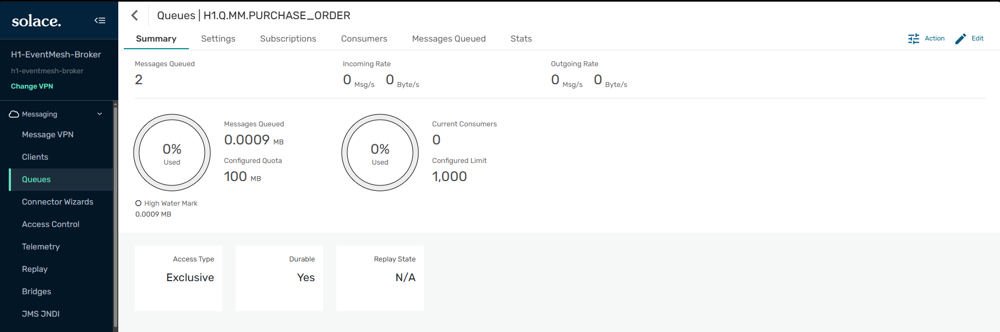

**O que esta evidência comprova:** a durable queue apresenta `Current Consumers = 0` e `Messages Queued = 2`. O teste demonstra materialmente que o consumidor pode estar indisponível sem provocar perda dos eventos atraídos pela queue.

### Por que existem 2 mensagens na Evidência 08?

Durante a sequência de validação, dois eventos elegíveis chegaram à Topic Subscription antes da associação do guaranteed consumer. Essa situação não invalida o teste. Ao contrário, demonstra que a durable queue funciona como buffer e pode acumular múltiplas mensagens enquanto nenhum consumer está ativo.

---

## 8.2 Bind do Guaranteed Consumer

O Subscriber foi alterado de uma subscription direta para:

```text
Bind to an endpoint to receive guaranteed messages
```

Endpoint:

```text
H1.Q.MM.PURCHASE_ORDER
```

Ao estabelecer o bind, o consumer passou ao estado ativo e começou a receber as mensagens retidas.

### Evidência 09 — Guaranteed consumer receiving Persistent event

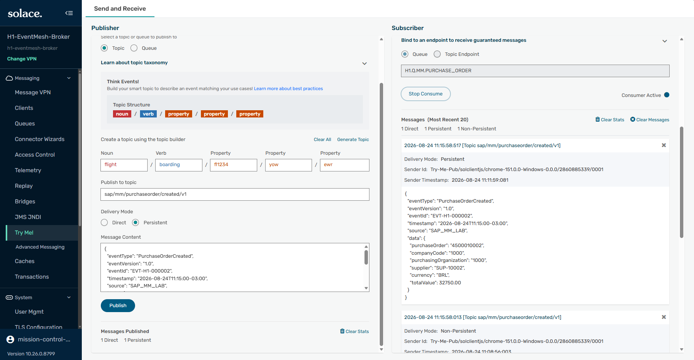

**O que esta evidência comprova:** `Consumer Active`, bind para `H1.Q.MM.PURCHASE_ORDER`, mensagem `EVT-H1-000002` e `Delivery Mode: Persistent`. Essa é a evidência central de Guaranteed Messaging do laboratório.

---

## 8.3 Queue drenada após consumo

Depois que o consumer recebeu e confirmou as mensagens, o broker removeu os itens confirmados do spool da queue.

### Evidência 10 — Queue empty after guaranteed consumption

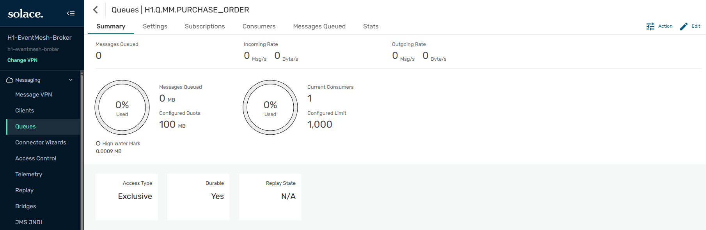

**O que esta evidência comprova:** a queue retorna para `Messages Queued = 0` após o consumo garantido, encerrando o ciclo publish → retain → bind → delivery → acknowledgement.

---

# 9. Storytelling técnico consolidado

O H1 começou com um broker vazio e sem nenhum endpoint de negócio. O ambiente foi preparado com uma durable exclusive queue e uma Topic Subscription representando um evento simples de Purchase Order criado.

A primeira execução utilizou Direct Messaging. O publisher e o subscriber estavam simultaneamente online, o evento `EVT-H1-000001` foi publicado e imediatamente entregue. Esse teste comprovou o mecanismo básico de publish/subscribe e o desacoplamento por endereço lógico.

Em seguida, o requisito foi elevado: uma Purchase Order não deveria deixar de ser processada apenas porque o consumidor estivesse indisponível. Um novo evento foi enviado com delivery mode Persistent. A durable queue continuou atraindo eventos pelo topic mesmo sem consumer conectado e acumulou mensagens no spool.

Somente depois o consumer fez bind ao endpoint garantido. As mensagens acumuladas foram entregues, incluindo `EVT-H1-000002`, e a queue terminou vazia após a confirmação do consumo.

O aprendizado central não é apenas que "uma mensagem chegou". O cenário demonstra que uma arquitetura event-driven permite que produtor e consumidor evoluam, reiniciem e operem em ritmos diferentes sem exigir disponibilidade simultânea. Essa propriedade é um dos fundamentos que torna mensageria assíncrona adequada para processos empresariais críticos.

---

# 10. Matriz de validação

| Validação | Resultado |
|---|---|
| Broker provisionado | ✅ |
| Message VPN ativo | ✅ |
| Durable Queue criada | ✅ |
| Access Type Exclusive | ✅ |
| Topic Subscription criada | ✅ |
| Publisher conectado | ✅ |
| Subscriber conectado | ✅ |
| Direct Messaging validado | ✅ |
| Persistent publication validada | ✅ |
| Consumer offline | ✅ |
| Eventos retidos na queue | ✅ |
| Guaranteed consumer bound | ✅ |
| Persistent event entregue | ✅ |
| Queue drenada após consumo | ✅ |

---

# 11. Troubleshooting e aprendizados

## 11.1 SAP Event Mesh/EMIS indisponível no BTP trial

**Sintoma:** Event Mesh não apareceu em Entitlements nem em `Integration Suite → Activate Capabilities`.

**Causa:** indisponibilidade da capability no ambiente trial utilizado no laboratório.

**Decisão:** não simular SAP Event Mesh nem interromper o aprendizado. Utilizar Solace PubSub+ Cloud para exercitar conceitos diretamente alinhados ao Advanced Event Mesh.

## 11.2 Client Password não aparece no Broker Manager

**Sintoma:** `Client Password` vazio na conexão do `Try Me!` dentro do Broker Manager.

**Solução:** obter a credencial temporária no `Cluster Manager → Service Details → Try Me!`, retornar ao Broker Manager e preencher a conexão. A senha não deve aparecer em screenshots ou no repositório.

## 11.3 Primeiro evento publicado como Direct

**Observação:** `EVT-H1-000001` foi publicado como Direct.

**Tratamento:** o resultado foi mantido intencionalmente como baseline de Direct Messaging. O teste Persistent foi executado separadamente com `EVT-H1-000002`, tornando a comparação mais didática.

## 11.4 Queue acumulou duas mensagens

**Sintoma:** a queue registrou `Messages Queued = 2`, enquanto o roteiro inicial esperava uma.

**Causa:** dois eventos elegíveis foram atraídos pela Topic Subscription antes de o guaranteed consumer fazer bind.

**Conclusão:** comportamento esperado de uma durable queue. A evidência foi preservada porque demonstra melhor o buffering assíncrono.

---

# 12. Boas práticas aplicadas

1. **Começar pela semântica do evento:** o nome do topic descreve um fato de negócio e inclui versão.
2. **Desacoplar publisher de endpoints físicos:** o produtor publica no topic, não precisa conhecer queues e consumers.
3. **Usar durable queue quando a entrega precisa sobreviver à indisponibilidade do consumidor.**
4. **Usar Persistent/Guaranteed para eventos críticos**, em vez de assumir que Direct fornece a mesma garantia.
5. **Definir quota conscientemente:** o laboratório reduziu a queue para 100 MB em vez de reservar uma parcela excessiva do spool.
6. **Escolher Exclusive conscientemente:** preserva um único consumer ativo e ordenação; cenários posteriores praticarão Non-Exclusive e competing consumers.
7. **Separar testes funcionais:** Direct e Guaranteed foram validados de forma independente.
8. **Nunca versionar credenciais:** password do client, tokens e secrets permanecem fora de screenshots e Git.
9. **Monitorar broker e consumidor:** a aplicação e o broker possuem perspectivas complementares de observabilidade.
10. **Projetar para redelivery/idempotência:** Guaranteed Messaging aumenta confiabilidade, mas aplicações empresariais devem estar preparadas para redelivery e processamento idempotente.

---

# 13. Recomendações para produção

O cenário utiliza configuração Developer para aprendizagem. Em produção, avaliar adicionalmente:

- alta disponibilidade e disaster recovery;
- múltiplos event brokers e Distributed Event Mesh/DMR;
- TLS e autenticação adequada aos clientes;
- OAuth 2.0 quando aplicável;
- ACL Profiles para limitar publish e subscribe;
- quotas e alertas baseados em volumetria real;
- TTL e tratamento de mensagens expiradas;
- Dead Message Queue;
- retry policy e redelivery;
- topic taxonomy corporativa;
- schema/event contract e compatibilidade de versões;
- Event Portal para lifecycle, discovery e governança;
- observabilidade e distributed tracing;
- replay quando a necessidade de reprocessamento justificar;
- Non-Exclusive/Partitioned queues quando o requisito for escala horizontal preservando ordem por chave.

---

# 14. Recursos praticados

| Área | Recurso |
|---|---|
| Event Broker | Solace PubSub+ Cloud |
| Runtime | Event Broker Service Developer |
| Isolation | Message VPN |
| Event Routing | Hierarchical Topic |
| Broker Endpoint | Durable Queue |
| Queue Semantics | Exclusive |
| Routing Rule | Topic Subscription |
| Messaging | Direct Publish/Subscribe |
| Reliability | Persistent / Guaranteed Messaging |
| Resilience | Offline consumer buffering |
| Consumption | Guaranteed Queue Consumer |
| Observability | Broker Manager / Queue Summary / Try Me! |
| Business Simulation | SAP MM Purchase Order Created |

---

# 15. Relação com SAP Integration Suite, advanced event mesh

SAP descreve Advanced Event Mesh como uma solução de EDA baseada em **Solace PubSub+**. Entre os padrões destacados pela SAP estão Publish/Subscribe, hierarchical topics, Guaranteed Delivery, persistence, event filtering e competing consumers.

O H1, portanto, não tenta representar o produto completo apenas por meio de um broker. O objetivo é mais preciso: praticar a camada de **event streaming e guaranteed messaging** sobre a mesma família tecnológica, preparando o cenário para os próximos documentos, que acrescentarão SAP Cloud Integration, AMQP, brokers alternativos, MQTT, resiliência, streaming e arquiteturas híbridas.

---

# 16. Próximo cenário: H2

O próximo laboratório adicionará o **SAP Integration Suite — Cloud Integration** à arquitetura.

**H2 — SAP Cloud Integration Publisher to Solace via AMQP**

Objetivo:

```text
External Client
      |
      | HTTPS
      v
SAP Cloud Integration
      |
      | AMQP
      v
Solace PubSub+
      |
      v
Topic / Durable Queue
```

Será criado **um iFlow novo do zero**, sem copiar artefatos dos blocos anteriores. O foco será aprender a configurar Cloud Integration como publisher AMQP contra um broker externo real, incluindo conectividade, autenticação, contrato do evento e rastreabilidade.

---

# 17. Navegação

**Cenário anterior:** [F8E — End-User SAML Bearer Group-Based Authorization](./31-f8e-end-user-saml-bearer-group-based-authorization.md)

**Próximo cenário:** [H2 — SAP Cloud Integration Publisher to Solace via AMQP](./33-h2-sap-cloud-integration-publisher-solace-amqp.md)

---

# 18. Referências oficiais

## SAP

- [Discovering Event-Driven Integration with SAP Integration Suite, advanced event mesh](https://learning.sap.com/courses/discovering-event-driven-integration-with-sap-integration-suite-advanved-event-mesh)
- [Introducing SAP Integration Suite, Advanced Event Mesh](https://learning.sap.com/courses/sap-integration-suite/introducing-sap-integration-suite-advanced-event-mesh_fa92d521-c872-49d4-9bef-e5a3207eff27)
- [SAP Integration Suite, advanced event mesh — SAP](https://www.sap.com/products/technology-platform/integration-suite/advanced-event-mesh.html)
- [SAP Integration Suite, advanced event mesh — Help](https://help.pubsub.em.services.cloud.sap/)

## Solace

- [Guaranteed Messages — Solace Documentation](https://docs.solace.com/Messaging/Guaranteed-Msg/Guaranteed-Messages.htm)
- [Queues — Solace Documentation](https://docs.solace.com/Messaging/Guaranteed-Msg/Queues.htm)
- [Persistence with Queues — Solace Tutorials](https://tutorials.solace.dev/nodejs/persistence-with-queues/)
- [Solace for SAP Event-Driven Integration](https://solace.com/solutions/technology/sap/event-driven-integration/)

---

# 19. Ferramentas utilizadas

- Solace Cloud
- Solace PubSub+ Event Broker
- Solace Cluster Manager
- Solace Broker Manager
- Solace Try Me!
- navegador web
- Git e GitHub para versionamento do portfólio

---

## 👤 Autor / 📇 Contato

[](https://www.linkedin.com/in/orlando-caetano/) [](https://github.com/OrlandoCaetano2026)

**Orlando Caetano**  
Especialista SAP • Integração • Inteligência Artificial  
Consultor SAP MM com know-how em PP, QM e WM

   

> 📌 Projeto de estudo e portfólio. Os cenários SAP MM, PP, QM, MES e Event-Driven são simulações educativas para prática de arquitetura e integração.
