# H2 — SAP Cloud Integration Publisher to Solace via AMQP 1.0

> **Bloco H — Event-Driven Integration / Event Mesh**  
> **Documento 33**  
> **Objetivo:** transformar o SAP Cloud Integration em um produtor real de eventos de negócio e publicar um evento SAP MM `PurchaseOrderCreated` no Solace PubSub+ por AMQP 1.0 seguro, com entrega Persistent, durable queue, correlação ponta a ponta e consumo garantido.

---

## 1. Perfil técnico do cenário

| Item | Implementação |
|---|---|
| Cenário | H2 — SAP Cloud Integration Publisher to Solace |
| Componente SAP | SAP Integration Suite — Cloud Integration |
| iFlow | `H2_CPI_Solace_AMQP_Publisher` |
| Endpoint inbound | `/h2/mm/purchase-order/event` |
| Broker | Solace PubSub+ Cloud |
| Message VPN | `h1-eventmesh-broker` |
| Queue | `H2.Q.MM.PURCHASE_ORDER` |
| Queue durability | Durable |
| Queue access | Exclusive |
| Queue quota | 5000 MB |
| Topic | `sap/mm/purchaseorder/created/from-cpi/v1` |
| Protocolo | AMQP 1.0 sobre TCP/TLS |
| Porta | `5671` |
| Autenticação | SASL com User Credentials no Security Material |
| Credential alias | `H2_SOLACE_AMQP_CREDENTIALS` |
| Delivery | Persistent |
| Domínio | SAP MM — Purchase Order |
| Test client | Postman |
| Evidências | `evidences/lab31/` |

---

## 2. Visão executiva

H1 estabeleceu os fundamentos do event broker: topic, subscription, durable queue, Direct Messaging e Guaranteed Messaging. H2 avança um nível e remove o `Try Me!` da função de produtor. A partir deste cenário, **SAP Cloud Integration passa a produzir o evento de negócio**.

Um Purchase Order SAP MM é submetido por HTTPS ao iFlow. O Cloud Integration valida a entrada, acrescenta contexto técnico, cria um envelope de evento com identificadores dinâmicos e publica esse envelope em Solace PubSub+ utilizando **AMQP 1.0 protegido por TLS e SASL**.

O broker recebe o evento pelo topic `sap/mm/purchaseorder/created/from-cpi/v1`. A subscription da durable queue `H2.Q.MM.PURCHASE_ORDER` atrai a mensagem. Como não existe consumer ativo no momento da publicação, o evento Persistent permanece armazenado. Em seguida, um guaranteed consumer faz bind à queue, recebe exatamente o envelope produzido pelo CPI e a mensagem é removida após o consumo.

O cenário demonstra algo mais importante do que simples conectividade: **identidade e correlação do evento atravessam todas as camadas sem alteração**. O mesmo `eventId`, `correlationId`, `Purchase Order` e metadata observados no CPI antes do AMQP aparecem no payload consumido no Solace.

---

## 3. Objetivos de aprendizagem

Ao concluir H2, o laboratório comprova capacidade de:

- configurar SAP Cloud Integration como AMQP producer;
- conectar Cloud Integration a um broker externo real;
- proteger credenciais no Security Material em vez de embuti-las no iFlow;
- usar AMQP 1.0 via TCP/TLS;
- autenticar o CPI no broker com SASL;
- publicar em topic usando o AMQP Receiver Adapter;
- solicitar delivery `Persistent`;
- construir um evento de Purchase Order a partir de JSON recebido por HTTPS;
- gerar `eventId`, `correlationId` e timestamp dinâmicos;
- utilizar durable queue como buffer quando não há consumer ativo;
- correlacionar o payload antes do AMQP com o payload efetivamente recebido pelo broker;
- diagnosticar falhas de configuração de Groovy pelo Message Processing Log.

---

# 4. Fundamentos

## 4.1 Por que o adapter outbound se chama AMQP Receiver?

Na terminologia do Cloud Integration, Sender Adapter recebe mensagens no iFlow e Receiver Adapter entrega mensagens do iFlow ao sistema de destino. Portanto, embora o CPI atue como **publisher AMQP**, o canal outbound é implementado com **AMQP Receiver Adapter**.

O padrão executado é:

```text
HTTPS Sender → Integration Process → AMQP Receiver → External Message Broker
```

## 4.2 Topic versus Queue no H2

O CPI não publica diretamente para `H2.Q.MM.PURCHASE_ORDER`. O CPI publica semanticamente no topic:

```text
sap/mm/purchaseorder/created/from-cpi/v1
```

A queue possui uma Topic Subscription para esse endereço. Assim, o producer permanece desacoplado da implementação física do consumidor.

## 4.3 Persistent / Guaranteed Messaging

O objetivo do H2 não é apenas enviar rapidamente. Um evento `PurchaseOrderCreated` representa mudança de negócio e deve continuar disponível quando o consumidor estiver indisponível. Por isso, o adapter usa `Delivery = Persistent` e o broker armazena mensagens atraídas pela durable queue até o consumo confirmado.

## 4.4 Event envelope e correlação

O JSON recebido pelo HTTPS Sender é um comando/dado de entrada do laboratório. O Groovy converte essa entrada em um evento autodescritivo com metadata técnica.

| Campo | Papel |
|---|---|
| `specversion` | versão do envelope |
| `type` | tipo do fato ocorrido |
| `source` | origem técnica |
| `id` | identidade única do evento |
| `time` | instante da geração |
| `subject` | business object afetado |
| `datacontenttype` | formato do payload |
| `eventVersion` | versão funcional do evento |
| `domain` | domínio de negócio |
| `correlationId` | rastreabilidade distribuída |
| `data` | Purchase Order efetiva |

---

# 5. Arquitetura

## 5.1 Arquitetura geral


## 5.2 Arquitetura detalhada

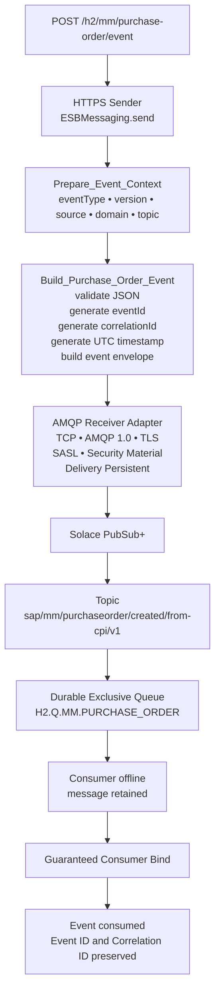

### Fluxo de responsabilidade

```text
Postman              fornece o Purchase Order
Cloud Integration    valida e cria o evento
AMQP Adapter          transporta o evento com entrega Persistent
Solace Topic          representa o endereço lógico
Topic Subscription    seleciona o evento
Durable Queue         armazena enquanto consumer está offline
Consumer              recebe e confirma o evento
```

---

# 6. Preparação do broker

## 6.1 Durable queue isolada para H2

Mesmo utilizando o único Event Broker Developer disponível no ambiente gratuito, H2 recebeu uma queue própria:

```text
H2.Q.MM.PURCHASE_ORDER
```

Configuração ativa:

| Propriedade | Valor |
|---|---|
| Incoming | On |
| Outgoing | On |
| Durable | Yes |
| Access Type | Exclusive |
| Messages Queued Quota | 5000 MB |
| Non-Owner Permission | Consume |
| Maximum Consumer Count | 1000 |

### Evidência 01 — Durable Exclusive Queue

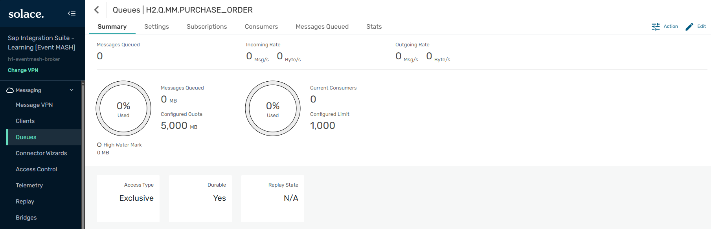

**O que esta evidência comprova:** criação e dimensionamento da queue exclusiva do H2 no broker compartilhado do Bloco H.

---

## 6.2 Topic Subscription

A queue H2 foi inscrita exclusivamente em:

```text
sap/mm/purchaseorder/created/from-cpi/v1
```

Esse topic diferencia os eventos efetivamente produzidos pelo CPI dos eventos utilizados no H1.

### Evidência 02 — CPI Topic Subscription

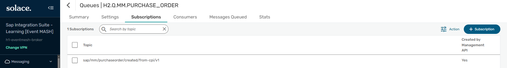

**O que esta evidência comprova:** a queue H2 atrai mensagens publicadas no topic dedicado à integração vinda do Cloud Integration.

---

# 7. Conectividade e segurança

## 7.1 Endpoint AMQP seguro no Solace

O Solace disponibilizou endpoint AMQP seguro em:

```text
amqps://mr-connection-uovq1o9wcqd.messaging.solace.cloud:5671
```

A captura publicada no portfólio foi sanitizada para não expor password ou connection string contendo secret.

### Evidência 03 — Secured AMQP connectivity redacted

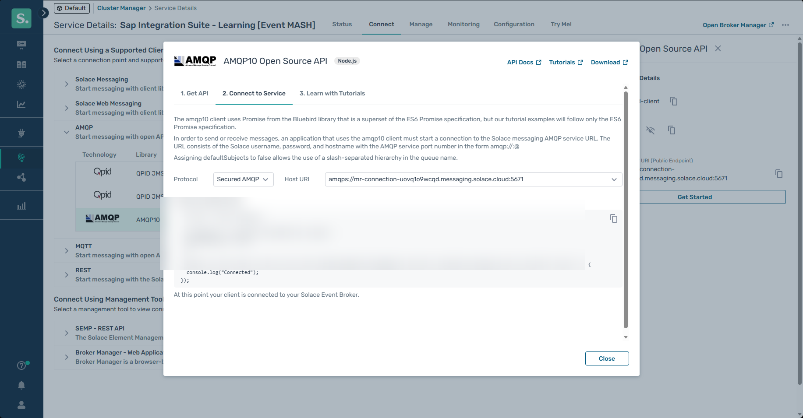

**O que esta evidência comprova:** uso de Secured AMQP e endpoint TLS na porta 5671 sem revelar credenciais sensíveis.

---

## 7.2 Security Material no SAP Integration Suite

As credenciais não foram gravadas no adapter nem no código. Foi criado User Credentials:

```text
H2_SOLACE_AMQP_CREDENTIALS
```

### Evidência 04 — AMQP Security Material

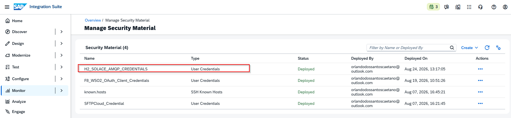

**O que esta evidência comprova:** credential alias está `Deployed` e pode ser referenciado pelo iFlow sem exposição de password.

---

# 8. Construção do iFlow

## 8.1 Prepare Event Context

O Content Modifier `Prepare_Event_Context` externaliza metadata funcional do evento:

| Property | Valor |
|---|---|
| `eventType` | `PurchaseOrderCreated` |
| `eventVersion` | `1.0` |
| `eventSource` | `SAP_INTEGRATION_SUITE` |
| `eventDomain` | `SAP_MM` |
| `eventTopic` | `sap/mm/purchaseorder/created/from-cpi/v1` |

### Evidência 05 — Event Context

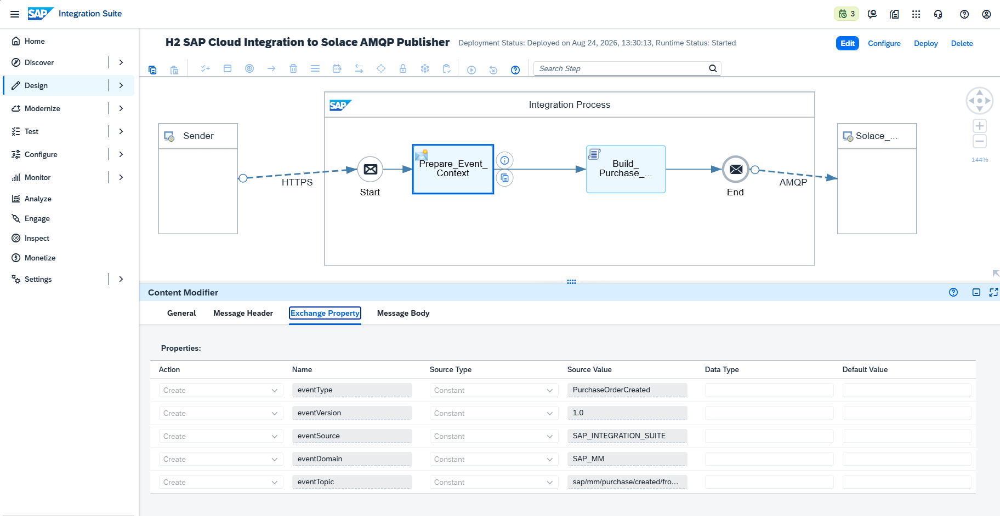

**O que esta evidência comprova:** metadata utilizada para construir o evento não está dispersa pelo código e pode ser administrada de forma explícita no Integration Process.

---

## 8.2 Groovy — Build Purchase Order Event

O script valida os campos obrigatórios, gera IDs dinâmicos e converte o Purchase Order no envelope do evento.

### Código executado

```groovy
import com.sap.gateway.ip.core.customdev.util.Message
import groovy.json.JsonOutput
import groovy.json.JsonSlurper
import java.time.OffsetDateTime
import java.time.ZoneOffset
import java.util.UUID

def Message processData(Message message) {
    String body = message.getBody(String)

    if (!body?.trim()) {
        throw new IllegalArgumentException("Purchase Order payload is empty.")
    }

    def input = new JsonSlurper().parseText(body)

    if (!input.purchaseOrder) {
        throw new IllegalArgumentException("Field 'purchaseOrder' is mandatory.")
    }

    if (!input.companyCode) {
        throw new IllegalArgumentException("Field 'companyCode' is mandatory.")
    }

    if (!input.purchasingOrganization) {
        throw new IllegalArgumentException("Field 'purchasingOrganization' is mandatory.")
    }

    if (!input.supplier) {
        throw new IllegalArgumentException("Field 'supplier' is mandatory.")
    }

    if (!input.items || input.items.isEmpty()) {
        throw new IllegalArgumentException("At least one Purchase Order item is mandatory.")
    }

    String eventId = "EVT-H2-" + UUID.randomUUID().toString().toUpperCase()
    String correlationId = "CORR-" + UUID.randomUUID().toString().toUpperCase()
    String timestamp = OffsetDateTime.now(ZoneOffset.UTC).toString()

    def event = [
        specversion: "1.0",
        type: message.getProperty("eventType"),
        source: message.getProperty("eventSource"),
        id: eventId,
        time: timestamp,
        subject: "purchaseorder/${input.purchaseOrder}",
        datacontenttype: "application/json",
        eventVersion: message.getProperty("eventVersion"),
        domain: message.getProperty("eventDomain"),
        correlationId: correlationId,
        data: [
            purchaseOrder: input.purchaseOrder,
            companyCode: input.companyCode,
            purchasingOrganization: input.purchasingOrganization,
            purchasingGroup: input.purchasingGroup,
            supplier: input.supplier,
            plant: input.plant,
            currency: input.currency,
            totalValue: input.totalValue,
            items: input.items
        ]
    ]

    String output = JsonOutput.prettyPrint(JsonOutput.toJson(event))

    message.setBody(output)
    message.setHeader("Content-Type", "application/json")
    message.setHeader("X-Event-ID", eventId)
    message.setHeader("X-Correlation-ID", correlationId)
    message.setHeader("X-Event-Type", message.getProperty("eventType"))
    message.setProperty("eventId", eventId)
    message.setProperty("correlationId", correlationId)
    message.setProperty("eventTimestamp", timestamp)

    return message
}
```

---

## 8.3 AMQP Receiver — Connection

| Parâmetro | Valor |
|---|---|
| Transport | TCP |
| Message Protocol | AMQP 1.0 |
| Host | `mr-connection-uovq1o9wcqd.messaging.solace.cloud` |
| Port | `5671` |
| Proxy | Internet |
| Authentication | SASL |
| Credential Name | `H2_SOLACE_AMQP_CREDENTIALS` |
| Connect with TLS | Enabled |

### Evidência 06 — AMQP Receiver Connection

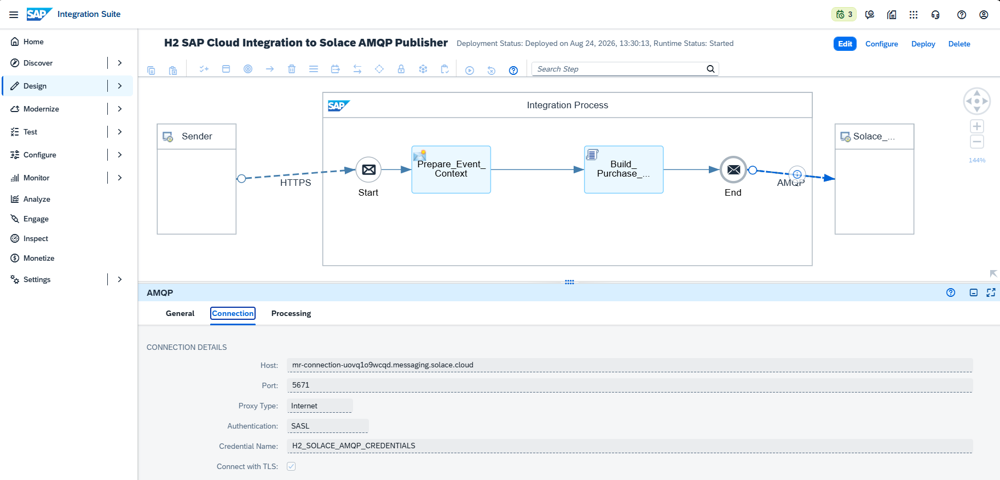

**O que esta evidência comprova:** configuração técnica da sessão AMQP segura entre SAP Cloud Integration e Solace PubSub+.

---

## 8.4 AMQP Receiver — Processing

| Parâmetro | Valor |
|---|---|
| Destination Type | Topic |
| Destination Name | `sap/mm/purchaseorder/created/from-cpi/v1` |
| Delivery | Persistent |
| Message Type | Automatic |
| Header Format Handling | Passthrough |

### Evidência 07 — Persistent Topic Configuration

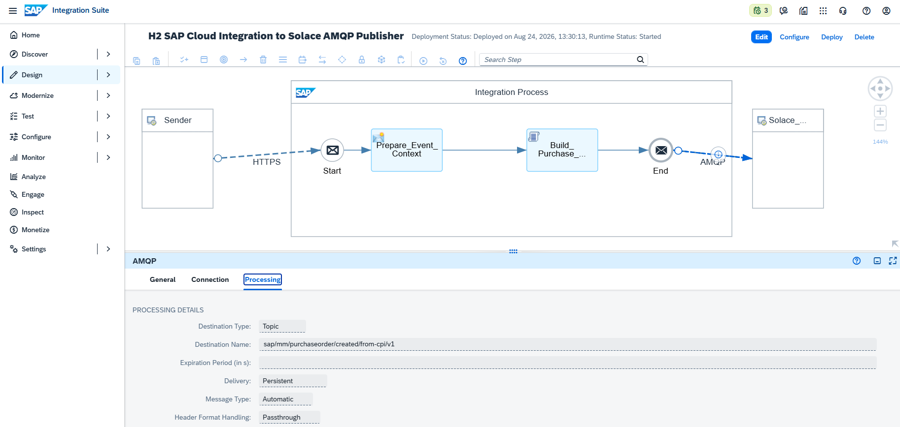

**O que esta evidência comprova:** o CPI publica em topic e solicita Persistent delivery, permitindo que a durable queue mantenha o evento até consumo.

---

# 9. Teste end-to-end

## 9.1 Purchase Order de teste

```json
{
  "purchaseOrder": "4500020001",
  "companyCode": "1000",
  "purchasingOrganization": "1000",
  "purchasingGroup": "001",
  "supplier": "SUP-H2-20001",
  "plant": "1000",
  "currency": "BRL",
  "totalValue": 48750.00,
  "items": [
    {
      "item": "00010",
      "material": "MAT-H2-STEEL-001",
      "description": "Industrial Steel Component",
      "quantity": 50,
      "unit": "EA",
      "netPrice": 625.00
    },
    {
      "item": "00020",
      "material": "MAT-H2-BEARING-002",
      "description": "Precision Bearing Assembly",
      "quantity": 25,
      "unit": "EA",
      "netPrice": 700.00
    }
  ]
}
```

Validação de total:

```text
50 × 625.00 = 31,250.00
25 × 700.00 = 17,500.00
Total         = 48,750.00 BRL
```

---

## 9.2 HTTP 200 e transformação do evento

O Postman enviou o Purchase Order ao endpoint H2 e recebeu `200 OK`. A resposta já contém o Event Envelope produzido pelo CPI, demonstrando que o body original foi transformado antes da publicação AMQP.

### Evidência 08 — Purchase Order published

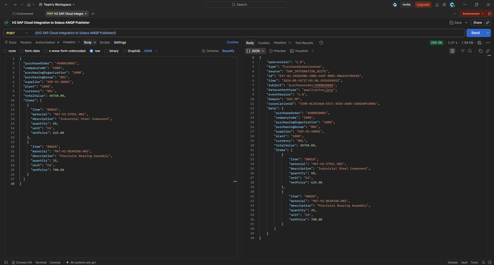

**O que esta evidência comprova:** chamada HTTPS bem-sucedida, payload SAP MM completo e resposta com `specversion`, `type`, `source`, Event ID, timestamp, subject, domain, Correlation ID e `data`.

---

## 9.3 CPI completa a etapa AMQP

O Message Processing Run mostra execução de HTTPS, `Prepare_Event_Context`, `Build_Purchase_Order_Event`, End e AMQP. A execução do segmento AMQP confirma que o fluxo avançou para a comunicação com o broker.

### Evidência 09 — AMQP publish completed

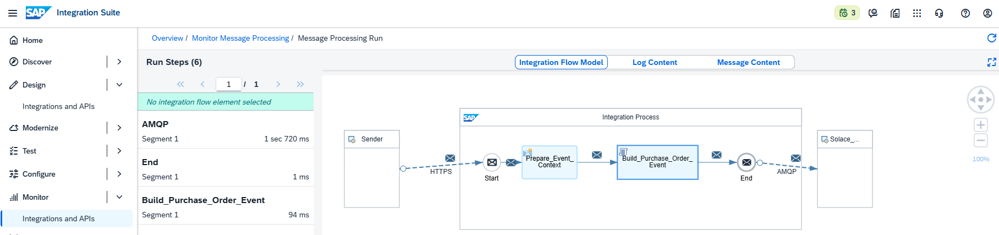

**O que esta evidência comprova:** a execução alcançou o AMQP Adapter após concluir as etapas internas do Integration Process.

---

## 9.4 Event Envelope imediatamente antes do AMQP

Antes do step AMQP, o CPI apresenta o conteúdo exato que será entregue ao broker.

### Evidência 10 — Event Envelope before AMQP

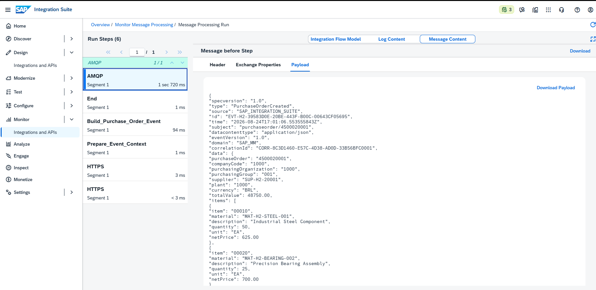

**O que esta evidência comprova:** o evento saiu do CPI com identidade própria, `source = SAP_INTEGRATION_SUITE`, Purchase Order `4500020001`, Event ID, Correlation ID e todos os itens do pedido.

### Correlação registrada

```text
Event ID
EVT-H2-39583D0E-20BE-443F-B00C-00643CF05695

Correlation ID
CORR-8C3D1460-E57C-4D38-AD0D-33B56BFC0001
```

---

# 10. Guaranteed Messaging no broker

## 10.1 Consumer offline: evento retido

Após o POST, a durable queue H2 registrou uma mensagem e nenhum consumer ativo.

### Evidência 11 — Persistent Event queued

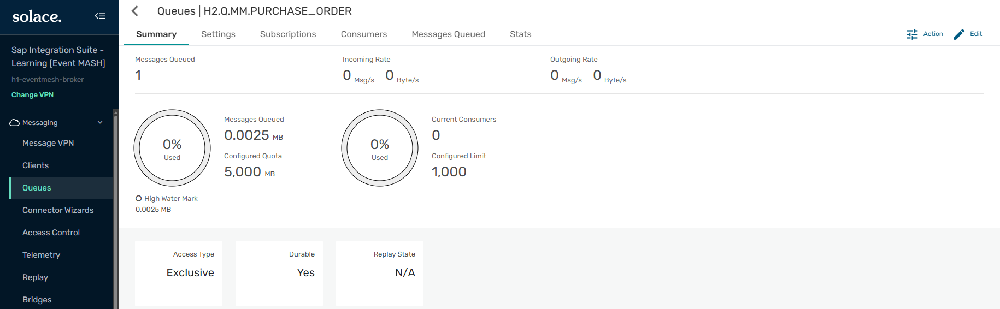

**O que esta evidência comprova:** `Messages Queued = 1`, `Current Consumers = 0`, Durable `Yes`, Access Type `Exclusive` e quota 5000 MB. O evento produzido pelo CPI permaneceu armazenado no broker enquanto não havia consumidor.

---

## 10.2 Guaranteed consumer: mesmo evento recebido

Um guaranteed consumer fez bind à `H2.Q.MM.PURCHASE_ORDER`. O payload recebido no Solace contém exatamente a identidade e os dados observados anteriormente no CPI.

### Evidência 12 — CPI-generated event consumed

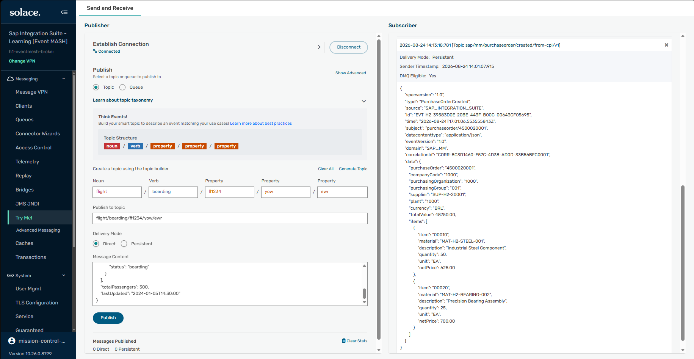

**O que esta evidência comprova:** delivery mode `Persistent`, topic H2 e payload completo com o mesmo `eventId`, `correlationId`, Purchase Order, fornecedor, valor e itens gerados pelo CPI. A correlação ponta a ponta demonstra que o evento atravessou CPI → AMQP → broker → durable queue sem perder identidade.

---

## 10.3 Estado final da queue

Após o consumo garantido e acknowledgement, a queue foi verificada com `Messages Queued = 0` e `Current Consumers = 0`, encerrando o ciclo operacional.

> **Validação operacional final:** a imagem final foi conferida durante a execução. Antes do commit definitivo do documento, mantenha o arquivo físico dessa captura no `lab31` com o nome adotado no repositório caso deseje renderizá-la também no Markdown.

---

# 11. Storytelling técnico consolidado

O H2 começou com uma pergunta simples: **como transformar o SAP Cloud Integration em um verdadeiro produtor EDA?**

A resposta exigiu mais do que trocar HTTP por AMQP. Primeiro, o broker recebeu uma durable queue isolada para o cenário e uma subscription específica. Em seguida, a credencial do Solace foi protegida no Security Material. O iFlow recebeu um Purchase Order tradicional via HTTPS, mas não o encaminhou de forma cega. O integration flow assumiu responsabilidade pela criação de um evento de negócio autodescritivo.

O `Prepare_Event_Context` estabeleceu semântica e versão. O Groovy validou campos obrigatórios, criou Event ID e Correlation ID, atribuiu timestamp UTC e encapsulou os dados MM num envelope. O AMQP Receiver publicou então esse evento em `sap/mm/purchaseorder/created/from-cpi/v1` com delivery Persistent.

No lado do broker, o consumidor estava deliberadamente offline. Mesmo assim, a queue passou de zero para uma mensagem. Esse instante demonstra o desacoplamento temporal: o producer terminou sua responsabilidade sem exigir que o consumer estivesse disponível.

Quando um guaranteed consumer foi conectado, o Solace entregou exatamente o envelope visto antes do AMQP. Event ID, Correlation ID e Purchase Order coincidiam. O consumo drenou a queue e completou o ciclo.

O resultado não é apenas conectividade SAP ↔ Solace. H2 estabelece os pilares que os próximos cenários utilizarão: **event contracts, correlação distribuída, transporte assíncrono, persistência, isolamento producer/consumer e observabilidade por camada**.

---

# 12. Troubleshooting real — Script Function do Groovy

## 12.1 Sintoma

No primeiro teste, o endpoint HTTPS era chamado, porém o Message Processing Log falhava antes do AMQP. A queue no Solace permanecia em zero.

O runtime tentou resolver um método com nome semelhante ao arquivo Groovy em vez do método definido no script.

## 12.2 Causa raiz

O Script Step possui conceitos diferentes:

```text
Nome visual do step
Build_Purchase_Order_Event

Arquivo físico
/script/script1.groovy

Método executável existente no arquivo
processData
```

O campo `Script Function` foi inicialmente preenchido com valor incorreto. O MPL tornou visível qual método o runtime estava tentando executar.

## 12.3 Correção

A configuração final ficou:

```text
Script File: /script/script1.groovy
Script Function: processData
```

O código contém:

```groovy
def Message processData(Message message) {
```

Após Save + Deploy, a execução avançou do Groovy para o AMQP Adapter e o evento foi publicado com sucesso.

## 12.4 Aprendizado

O troubleshooting foi feito por **camadas**:

```text
HTTPS                   OK
Prepare Event Context   OK
Groovy                  FALHA → corrigido
AMQP                    não executado durante a falha
Solace Queue            0 durante a falha
```

Essa abordagem evitou alterações desnecessárias em TLS, SASL, credentials ou broker enquanto a falha ainda estava no processamento interno do CPI.

---

# 13. Boas práticas aplicadas

1. **Credentials fora do iFlow:** password armazenada no Security Material e referenciada por alias.
2. **TLS para transporte externo:** AMQP seguro utilizando porta 5671.
3. **SASL para autenticação AMQP:** autenticação separada da lógica de negócio.
4. **Producer publica em topic:** evita conhecimento da queue física pelo CPI.
5. **Durable queue para evento crítico:** consumer pode ficar offline sem perder a mensagem.
6. **Persistent delivery:** apropriado ao evento empresarial `PurchaseOrderCreated`.
7. **Event ID único:** evita eventos sem identidade técnica.
8. **Correlation ID:** permite rastreabilidade entre sistemas e mensagens derivados.
9. **Metadata fora do payload original:** o envelope diferencia contrato do evento de dados do Purchase Order.
10. **Message Type Automatic:** delega ao adapter a seleção compatível com o conteúdo.
11. **Observabilidade nas duas plataformas:** MPL no CPI e Queue/Consumer no Solace.
12. **Troubleshooting pela primeira camada que falhou:** não alterar broker quando o fluxo ainda não alcançou o AMQP.
13. **Queue e topic separados por cenário:** isolamento lógico mesmo com broker compartilhado pela limitação do plano Developer.
14. **Capturas sanitizadas:** credenciais não são publicadas no GitHub.

---

# 14. Recomendações para produção

Para transportar este desenho para produção, avaliar:

- OAuth 2.0 ou client certificate quando o modelo de segurança e o broker suportarem e justificarem o mecanismo;
- rotação e segregação de credentials por application/client;
- ACL Profiles restringindo topics permitidos para publish/subscribe;
- taxonomia corporativa de topics;
- CloudEvents formal e schema registry / AsyncAPI para contratos;
- strategy para versionamento compatível do evento;
- tratamento explícito de redelivery e idempotência de consumers;
- Dead Message Queue e política operacional de poison messages;
- retry com limites seguros e sem loops de redelivery agressivos;
- monitoramento de spool, thresholds e quotas;
- métricas de end-to-end latency;
- distributed tracing;
- alertas para consumer backlog;
- HA/DR do broker;
- Event Portal para lifecycle, ownership, discovery e governança;
- separação real de recursos entre DEV/QA/PRD.

---

# 15. Matriz de validação

| Validação | Resultado |
|---|---|
| Queue H2 criada | ✅ |
| Topic subscription criada | ✅ |
| Secured AMQP identificado | ✅ |
| Credential alias deployed | ✅ |
| Content Modifier configurado | ✅ |
| Event builder funcional | ✅ |
| AMQP TCP + TLS configurado | ✅ |
| SASL configurado | ✅ |
| Topic outbound configurado | ✅ |
| Delivery Persistent | ✅ |
| Postman HTTP 200 | ✅ |
| Event Envelope gerado | ✅ |
| AMQP step executado | ✅ |
| Evento retido com consumer offline | ✅ |
| Guaranteed consumer recebeu evento | ✅ |
| Event ID preservado | ✅ |
| Correlation ID preservado | ✅ |
| Queue zerada após consumo | ✅ |

---

# 16. Recursos praticados

| Área | Recurso |
|---|---|
| SAP Integration Suite | Cloud Integration |
| Inbound | HTTPS Sender |
| Authorization inbound | `ESBMessaging.send` |
| Message enrichment | Content Modifier |
| Custom logic | Groovy |
| Event design | Business Event Envelope |
| Correlation | Event ID + Correlation ID |
| Outbound protocol | AMQP 1.0 |
| Transport security | TLS |
| Broker authentication | SASL |
| Secret handling | Security Material / User Credentials |
| Event routing | Topic |
| Reliability | Persistent Delivery |
| Broker | Solace PubSub+ Cloud |
| Guaranteed endpoint | Durable Queue |
| Queue semantics | Exclusive |
| Consumer | Guaranteed Consumer |
| Testing | Postman |
| Monitoring | CPI MPL + Solace Broker Manager |

---

# 17. Próximo cenário — H3

## H3 — SAP Cloud Integration Subscriber from Solace via AMQP

H3 inverterá o papel praticado no H2.

No H2:

```text
SAP Cloud Integration → Solace
           Publisher
```

No H3:

```text
Solace → SAP Cloud Integration
           Subscriber
```

A proposta é criar **um iFlow novo, do zero**, usando o **AMQP Sender Adapter** para que o CPI permaneça conectado a uma durable queue do Solace e consuma eventos de negócio assim que estiverem disponíveis.

Para evitar repetir o mesmo Purchase Order do H2, o cenário usará **SAP PP + MES**:

```text
External MES Event Producer
          │
          │ Persistent event
          ▼
Solace Topic
mes/pp/productionorder/confirmed/v1
          │
          ▼
H3.Q.PP.PRODUCTION_CONFIRMATION
          │
          │ AMQP Sender Adapter
          ▼
SAP Cloud Integration
          │
          ├── validate event envelope
          ├── extract eventId/correlationId
          ├── validate production confirmation
          └── build downstream MES/SAP response
          ▼
External HTTP sink / webhook
```

### O que H3 acrescentará

- AMQP **Sender Adapter** do CPI;
- CPI atuando como event consumer;
- queue dedicada `H3.Q.PP.PRODUCTION_CONFIRMATION`;
- evento novo de confirmação de Production Order;
- validação de envelope recebido;
- acknowledgement pelo consumer;
- demonstração de backlog com CPI/iFlow desconectado e recuperação após Start;
- entrega do evento a um endpoint HTTP externo gratuito, tornando a cadeia broker → CPI → aplicação externa verificável.

---

# 18. Navegação

**Cenário anterior:** [H1 — Solace PubSub+ Event Mesh Foundation](./32-h1-solace-pubsub-event-mesh-foundation.md)

**Próximo cenário:** [H3 — SAP Cloud Integration Subscriber from Solace via AMQP](./34-h3-sap-cloud-integration-subscriber-solace-amqp.md)

---

# 19. Referências oficiais

## SAP

- [Configure the AMQP Sender Adapter](https://help.sap.com/docs/cloud-integration/sap-cloud-integration/configure-amqp-sender-adapter)
- [AMQP Adapter](https://help.sap.com/docs/cloud-integration/sap-cloud-integration/amqp-adapter)
- [Configure the AMQP Receiver Adapter](https://help.sap.com/docs/cloud-integration/sap-cloud-integration/configure-amqp-receiver-adapter)
- [Use Secure Authentication Methods](https://help.sap.com/docs/cloud-integration/sap-cloud-integration/use-secure-authentication-methods)
- [Discovering Event-Driven Integration with SAP Integration Suite, advanced event mesh](https://learning.sap.com/courses/discovering-event-driven-integration-with-sap-integration-suite-advanved-event-mesh)

## Solace

- [Using AMQP 1.0](https://docs.solace.com/API/AMQP/Using-AMQP.htm)
- [Guaranteed Messages](https://docs.solace.com/Messaging/Guaranteed-Msg/Guaranteed-Messages.htm)
- [Queues](https://docs.solace.com/Messaging/Guaranteed-Msg/Queues.htm)
- [Messaging Patterns and Queue Types](https://solace.com/products/event-broker/messaging-patterns-queue-types/)

---

# 20. Ferramentas utilizadas

- SAP Integration Suite — Cloud Integration
- Solace PubSub+ Cloud
- Solace Broker Manager
- Solace Try Me!
- AMQP 1.0
- Postman
- Groovy
- Git / GitHub

---

## 👤 Autor / 📇 Contato

[](https://www.linkedin.com/in/orlando-caetano/) [](https://github.com/OrlandoCaetano2026)

**Orlando Caetano**  
Especialista SAP • Integração • Inteligência Artificial  
Consultor SAP MM com know-how em PP, QM e WM

   

> 📌 Projeto de estudo e portfólio. Os cenários SAP MM, PP, QM, MES e Event-Driven são simulações educativas para prática de arquitetura e integração.
