# H3 — SAP Cloud Integration Subscriber from Solace via AMQP 1.0

> **Bloco H — Event-Driven Integration / Event Mesh**  
> **Documento 34**  
> **Objetivo:** transformar o SAP Cloud Integration em um consumidor real de eventos, drenar um backlog de confirmações de produção SAP PP/MES acumulado no Solace PubSub+ via AMQP 1.0, validar os campos técnicos SAP, preservar a correlação distribuída e entregar cada evento processado a um backend externo real.

---

## 1. Perfil técnico do cenário

| Item | Implementação |
|---|---|
| Cenário | H3 — SAP Cloud Integration Subscriber from Solace |
| Componente SAP | SAP Integration Suite — Cloud Integration |
| iFlow | `H3_SAP_PP_MES_Production_Confirmation_AMQP_Subscriber` |
| Papel do CPI | Consumer (AMQP Sender Adapter) |
| Broker | Solace PubSub+ Cloud |
| Message VPN | `h1-eventmesh-broker` |
| Queue | `H3.Q.PP.PRODUCTION_CONFIRMATION` |
| Queue durability | Durable |
| Queue access | Exclusive |
| Queue quota | 100 MB |
| Topic | `mes/pp/productionorder/confirmed/v1` |
| Protocolo | AMQP 1.0 sobre TCP/TLS |
| Porta | `5671` |
| Autenticação | SASL com User Credentials no Security Material |
| Credential alias | `SOLACE_AMQP_CREDENTIALS` |
| Concurrent Processes | 1 |
| Prefetch | 1 |
| Max. Retries | 3 |
| Delivery Status After Max. Retries | REJECTED |
| Backend externo | webhook.site |
| Domínio | SAP PP + MES — Production Order Confirmation |
| Volume de teste | 5 eventos Persistent |
| Evidências | `evidences/lab32/` — 14 imagens |

---

## 2. Visão executiva

H2 provou que o SAP Cloud Integration pode **produzir** eventos e publicá-los em um event broker. H3 completa o par arquitetural: agora o Cloud Integration passa a **consumir** eventos de negócio de uma durable queue do Solace PubSub+.

O cenário simula um caso realista de chão de fábrica. Um sistema MES emite confirmações de operações de uma ordem de produção SAP PP. Essas confirmações não chamam o SAP diretamente. Elas são publicadas de forma assíncrona no broker, com entrega Persistent, e ficam retidas na durable queue.

Deliberadamente, o consumidor SAP Cloud Integration foi mantido offline enquanto cinco confirmações diferentes eram publicadas. Isso criou um backlog real de cinco mensagens aguardando processamento, com zero consumidores conectados. Esse instante demonstra materialmente o desacoplamento temporal: o produtor concluiu sua responsabilidade sem exigir que o consumidor estivesse disponível.

Em seguida, o iFlow consumidor foi iniciado. O AMQP Sender Adapter conectou-se à queue exclusiva, drenou o backlog e disparou cinco execuções independentes do Integration Flow. Cada confirmação foi validada em duas camadas, transformada em um payload de backend e entregue via HTTPS a um endpoint externo real, preservando Event ID e Correlation ID de ponta a ponta.

O resultado foi comprovado por triangulação entre três plataformas independentes: o Solace registrou cinco entregas confirmadas sem redelivery, o CPI registrou cinco processamentos concluídos e o backend externo recebeu cinco requisições distintas.

---

## 3. Objetivos de aprendizagem

Ao concluir H3, o laboratório comprova capacidade de:

- configurar SAP Cloud Integration como consumer AMQP;
- consumir de uma durable queue de broker externo;
- reutilizar uma credencial compartilhada de broker no Security Material;
- manter conectividade AMQP 1.0 segura via TCP/TLS/SASL;
- criar backlog real com consumer offline;
- demonstrar desacoplamento temporal producer/consumer;
- controlar concorrência e prefetch para observar o consumo;
- validar um envelope de evento genérico;
- validar campos técnicos SAP PP de uma confirmação de produção;
- transformar o evento em um contrato de backend;
- preservar Event ID e Correlation ID entre broker, CPI e backend;
- comprovar que cada mensagem AMQP gera uma execução independente;
- interpretar métricas de consumer do broker (delivered, redelivered, unacknowledged).

---

# 4. Fundamentos

## 4.1 Por que o consumer usa o AMQP Sender Adapter

Na terminologia do Cloud Integration, o Sender Adapter é o componente que inicia o Integration Flow. Portanto, embora o CPI atue como consumidor de mensagens, o canal inbound é implementado com o **AMQP Sender Adapter**, que consome de queues em brokers externos.

O padrão executado é:

```text
External Broker Queue → AMQP Sender → Integration Process → HTTP Receiver → External Backend
```

## 4.2 Topic, Subscription e Queue no H3

O MES publica no topic:

```text
mes/pp/productionorder/confirmed/v1
```

A durable queue possui uma Topic Subscription para esse endereço:

```text
mes/pp/productionorder/confirmed/v1
                 │
                 ▼
H3.Q.PP.PRODUCTION_CONFIRMATION
```

Assim, o produtor publica semanticamente no topic e o broker roteia para a queue, que retém as mensagens de forma garantida.

## 4.3 Exclusive Queue e ordem

A queue foi configurada como Exclusive. Nesse modo, apenas um consumidor fica ativo por vez e a ordem das mensagens recebidas é preservada. Isso é adequado para um backlog sequencial de operações de uma mesma ordem de produção.

## 4.4 Concurrent Processes e Prefetch

O consumo foi configurado com `Number of Concurrent Processes = 1` e `Max. Number of Prefetched Messages = 1`. Essa escolha é deliberadamente conservadora para o laboratório, priorizando a observabilidade do consumo sequencial em vez de throughput. Prefetch baixo é recomendado quando o processamento por mensagem é relevante e quando se deseja acompanhar o backlog de forma clara.

## 4.5 Contrato de evento e nomenclatura SAP PP

O evento MES utiliza nomes técnicos clássicos SAP PP, o que aproxima o laboratório da realidade de consultoria.

| Campo | Significado no cenário |
|---|---|
| `AUFNR` | Ordem de produção |
| `WERKS` | Centro |
| `VORNR` | Operação |
| `APLZL` | Sequência/contador interno da operação |
| `ARBPL` | Centro de trabalho |
| `MATNR` | Material |
| `LMNGA` | Quantidade confirmada boa |
| `MEINH` | Unidade de medida |
| `XMNGA` | Quantidade de refugo |
| `AUERU` | Indicador de confirmação final |
| `BUDAT` | Data de lançamento |
| `ISDD` / `ISDZ` | Data/hora real de início |
| `IEDD` / `IEDZ` | Data/hora real de término |
| `PERNR` | Número de pessoal |
| `MACHINE_ID` | Identificador de máquina MES complementar |

> **Nota de precisão técnica:** este é um contrato custom MES orientado pelos nomes técnicos SAP PP para fins de estudo. Não representa o request oficial da API S/4HANA `API_PROD_ORDER_CONFIRMATION_2_SRV`, que expõe propriedades semânticas como Order ID, Operation, Sequence, Material, Production Unit e Is Final Confirmation, e suporta confirmações em nível de ordem, time ticket e time event.

---

# 5. Arquitetura

## 5.1 Arquitetura geral


## 5.2 Arquitetura detalhada

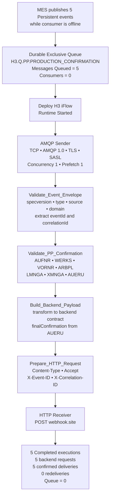

### Fluxo de responsabilidade

```text
MES              publica confirmações de produção como eventos
Solace           roteia por topic e retém na durable queue
AMQP Sender      consome de forma garantida com ordem preservada
Validate Envelope valida o contrato de evento
Validate PP      valida os campos técnicos SAP PP
Build Payload    transforma no contrato de backend
Content Modifier prepara headers de rastreabilidade
HTTP Receiver    entrega ao backend externo
```

---

# 6. Preparação do broker

## 6.1 Durable queue exclusiva do H3

A queue foi criada isolada para o cenário, no broker compartilhado do Bloco H.

| Propriedade | Valor |
|---|---|
| Incoming | On |
| Outgoing | On |
| Durable | Yes |
| Access Type | Exclusive |
| Messages Queued Quota | 100 MB |
| Non-Owner Permission | Consume |
| Maximum Consumer Count | 1000 |

### Evidência 01 — Durable Exclusive Queue

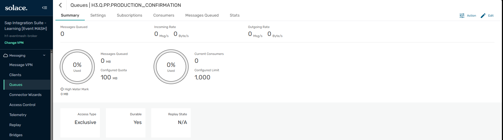

**O que esta evidência comprova:** criação da queue exclusiva e durável dedicada às confirmações de produção do H3.

---

## 6.2 Topic Subscription

A queue foi inscrita no topic de confirmação de produção.

```text
mes/pp/productionorder/confirmed/v1
```

### Evidência 02 — Topic Subscription

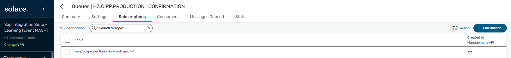

**O que esta evidência comprova:** a queue H3 atrai mensagens publicadas no topic dedicado às confirmações de produção MES.

---

# 7. Criação do backlog com consumer offline

## 7.1 Publicação de cinco confirmações Persistent

Com o CPI ainda offline, o MES publicou cinco confirmações diferentes de operações da mesma ordem de produção `10004567`, cada uma com Delivery Mode Persistent.

| Evento | Operação | Centro de trabalho | Confirmado | Refugo | Final |
|---|---|---|---|---|---|
| `EVT-H3-000001` | 0010 | WC-CUTTING-01 | 120 | 0 | não |
| `EVT-H3-000002` | 0020 | WC-ASSEMBLY-01 | 118 | 2 | não |
| `EVT-H3-000003` | 0030 | WC-PAINTING-01 | 118 | 0 | não |
| `EVT-H3-000004` | 0040 | WC-QUALITY-01 | 117 | 1 | não |
| `EVT-H3-000005` | 0050 | WC-PACKING-01 | 117 | 0 | sim |

### Evidência 03 — Backlog de cinco confirmações

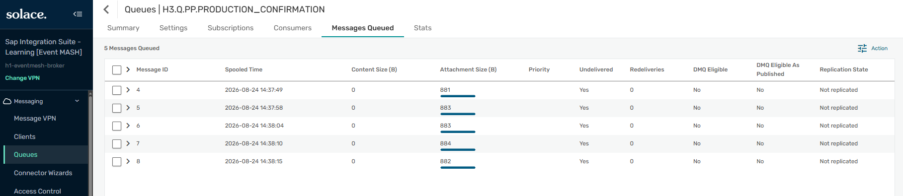

**O que esta evidência comprova:** cinco mensagens distintas armazenadas na durable queue, todas Undelivered e com Redeliveries = 0, aguardando um consumidor.

### Evidência 04 — Cinco eventos Persistent publicados

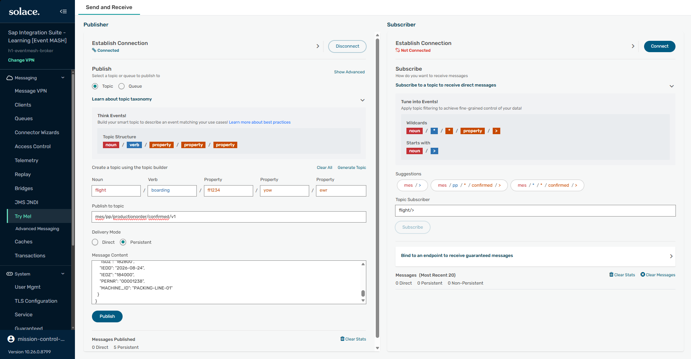

**O que esta evidência comprova:** o produtor MES publicou 5 Persistent e 0 Direct, confirmando que o backlog foi criado com entrega garantida.

---

# 8. Configuração do consumidor SAP Cloud Integration

## 8.1 Credencial compartilhada do broker

Foi criada uma credencial genérica para os cenários Solace do Bloco H, substituindo a credencial específica do H2.

```text
SOLACE_AMQP_CREDENTIALS
```

### Evidência 05 — Credencial AMQP compartilhada

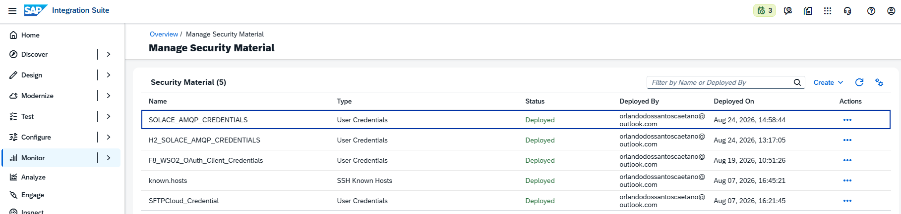

**O que esta evidência comprova:** o alias `SOLACE_AMQP_CREDENTIALS` está implantado como User Credentials e pode ser referenciado pelo iFlow sem expor a senha.

---

## 8.2 AMQP Sender — Connection

| Parâmetro | Valor |
|---|---|
| Transport | TCP |
| Message Protocol | AMQP 1.0 |
| Host | `mr-connection-uovq1o9wcqd.messaging.solace.cloud` |
| Port | `5671` |
| Proxy | Internet |
| Authentication | SASL |
| Credential Name | `SOLACE_AMQP_CREDENTIALS` |
| Connect with TLS | Enabled |

### Evidência 06 — AMQP Sender Connection

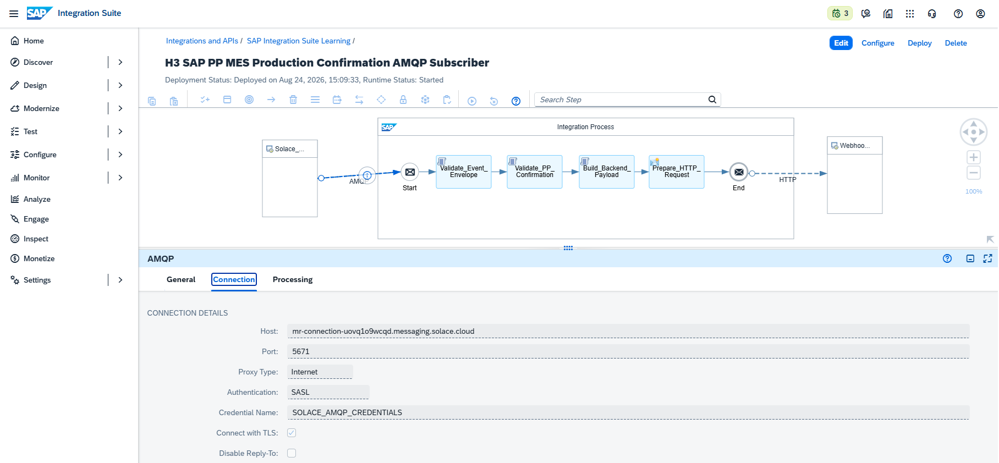

**O que esta evidência comprova:** sessão AMQP segura entre SAP Cloud Integration e Solace, com TLS, SASL e credential alias, sem exposição de senha.

---

## 8.3 AMQP Sender — Processing

| Parâmetro | Valor |
|---|---|
| Queue Name | `H3.Q.PP.PRODUCTION_CONFIRMATION` |
| Number of Concurrent Processes | 1 |
| Max. Number of Prefetched Messages | 1 |
| Consume Expired Messages | Disabled |
| Max. Number of Retries | 3 |
| Delivery Status After Max. Retries | REJECTED |

### Evidência 07 — AMQP Sender Processing

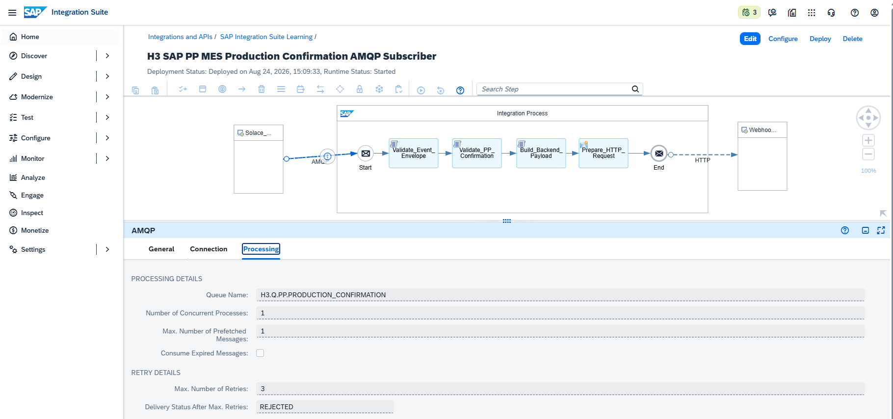

**O que esta evidência comprova:** consumo controlado da queue H3, com concorrência 1, prefetch 1 e política de retry explícita para evitar retries ilimitados.

---

## 8.4 Fluxo de validação e transformação

O Integration Process foi montado com três Groovy Scripts e um Content Modifier.

```text
Start
  ↓
Validate_Event_Envelope
  ↓
Validate_PP_Confirmation
  ↓
Build_Backend_Payload
  ↓
Prepare_HTTP_Request
  ↓
End
```

### Evidência 08 — Fluxo de validação SAP PP

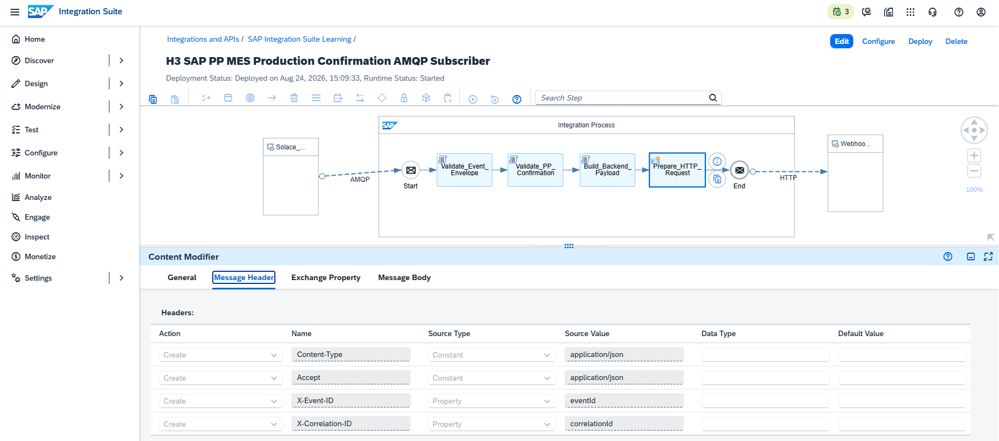

**O que esta evidência comprova:** arquitetura completa do consumidor, incluindo validação de envelope, validação SAP PP, construção do payload e preparação do request HTTP.

### 8.4.1 Groovy — Validate_Event_Envelope

```groovy
import com.sap.gateway.ip.core.customdev.util.Message
import groovy.json.JsonSlurper

def Message processData(Message message) {
    String body = message.getBody(String)

    if (!body?.trim()) {
        throw new IllegalArgumentException("Event payload is empty.")
    }

    def event = new JsonSlurper().parseText(body)

    List<String> mandatoryFields = [
        "specversion",
        "type",
        "source",
        "id",
        "time",
        "subject",
        "datacontenttype",
        "eventVersion",
        "domain",
        "correlationId",
        "data"
    ]

    mandatoryFields.each { String field ->
        if (event[field] == null || event[field].toString().trim().isEmpty()) {
            throw new IllegalArgumentException(
                "Mandatory event field '${field}' is missing."
            )
        }
    }

    if (event.specversion != "1.0") {
        throw new IllegalArgumentException(
            "Unsupported specversion '${event.specversion}'. Expected '1.0'."
        )
    }

    if (event.type != "ProductionOrderConfirmed") {
        throw new IllegalArgumentException(
            "Unsupported event type '${event.type}'."
        )
    }

    if (event.domain != "SAP_PP") {
        throw new IllegalArgumentException(
            "Unsupported event domain '${event.domain}'."
        )
    }

    if (event.source != "MES_SHOP_FLOOR") {
        throw new IllegalArgumentException(
            "Unsupported event source '${event.source}'."
        )
    }

    message.setProperty("eventId", event.id.toString())
    message.setProperty("correlationId", event.correlationId.toString())
    message.setProperty("eventType", event.type.toString())
    message.setProperty("eventSource", event.source.toString())
    message.setProperty("eventDomain", event.domain.toString())
    message.setProperty("eventSubject", event.subject.toString())

    message.setHeader("X-Event-ID", event.id.toString())
    message.setHeader("X-Correlation-ID", event.correlationId.toString())
    message.setHeader("X-Event-Type", event.type.toString())

    return message
}
```

### 8.4.2 Groovy — Validate_PP_Confirmation

```groovy
import com.sap.gateway.ip.core.customdev.util.Message
import groovy.json.JsonSlurper

def Message processData(Message message) {
    String body = message.getBody(String)

    if (!body?.trim()) {
        throw new IllegalArgumentException("Production confirmation payload is empty.")
    }

    def event = new JsonSlurper().parseText(body)
    def data = event.data

    if (data == null) {
        throw new IllegalArgumentException("Event data object is missing.")
    }

    List<String> mandatorySAPFields = [
        "AUFNR",
        "WERKS",
        "VORNR",
        "APLZL",
        "ARBPL",
        "MATNR",
        "LMNGA",
        "MEINH",
        "XMNGA",
        "AUERU",
        "BUDAT",
        "ISDD",
        "ISDZ",
        "IEDD",
        "IEDZ",
        "PERNR",
        "MACHINE_ID"
    ]

    mandatorySAPFields.each { String field ->
        if (!data.containsKey(field) || data[field] == null) {
            throw new IllegalArgumentException(
                "Mandatory SAP PP field '${field}' is missing."
            )
        }
    }

    if (!data.AUFNR.toString().trim()) {
        throw new IllegalArgumentException("AUFNR must not be empty.")
    }

    if (!data.WERKS.toString().trim()) {
        throw new IllegalArgumentException("WERKS must not be empty.")
    }

    if (!data.VORNR.toString().trim()) {
        throw new IllegalArgumentException("VORNR must not be empty.")
    }

    if (!data.ARBPL.toString().trim()) {
        throw new IllegalArgumentException("ARBPL must not be empty.")
    }

    if (!data.MATNR.toString().trim()) {
        throw new IllegalArgumentException("MATNR must not be empty.")
    }

    BigDecimal confirmedQuantity = new BigDecimal(data.LMNGA.toString())
    BigDecimal scrapQuantity = new BigDecimal(data.XMNGA.toString())

    if (confirmedQuantity < 0) {
        throw new IllegalArgumentException(
            "LMNGA confirmed quantity cannot be negative."
        )
    }

    if (scrapQuantity < 0) {
        throw new IllegalArgumentException(
            "XMNGA scrap quantity cannot be negative."
        )
    }

    String finalConfirmation = data.AUERU.toString()

    if (!(finalConfirmation in ["", "X"])) {
        throw new IllegalArgumentException(
            "AUERU must be empty or 'X'."
        )
    }

    message.setProperty("AUFNR", data.AUFNR.toString())
    message.setProperty("WERKS", data.WERKS.toString())
    message.setProperty("VORNR", data.VORNR.toString())
    message.setProperty("APLZL", data.APLZL.toString())
    message.setProperty("ARBPL", data.ARBPL.toString())
    message.setProperty("MATNR", data.MATNR.toString())
    message.setProperty("LMNGA", data.LMNGA.toString())
    message.setProperty("MEINH", data.MEINH.toString())
    message.setProperty("XMNGA", data.XMNGA.toString())
    message.setProperty("AUERU", data.AUERU.toString())
    message.setProperty("MACHINE_ID", data.MACHINE_ID.toString())

    return message
}
```

### 8.4.3 Groovy — Build_Backend_Payload

```groovy
import com.sap.gateway.ip.core.customdev.util.Message
import groovy.json.JsonOutput
import groovy.json.JsonSlurper
import java.time.OffsetDateTime
import java.time.ZoneOffset

def Message processData(Message message) {
    String body = message.getBody(String)

    if (!body?.trim()) {
        throw new IllegalArgumentException("Validated event payload is empty.")
    }

    def event = new JsonSlurper().parseText(body)
    def data = event.data

    boolean finalConfirmation = data.AUERU?.toString() == "X"

    def output = [
        status: "PROCESSED",
        processingStatus: "SAP_PP_CONFIRMATION_RECEIVED",
        processedBy: "SAP_INTEGRATION_SUITE",
        processedAt: OffsetDateTime.now(ZoneOffset.UTC).toString(),
        event: [
            eventId: event.id,
            correlationId: event.correlationId,
            eventType: event.type,
            source: event.source,
            domain: event.domain
        ],
        productionConfirmation: [
            productionOrder: data.AUFNR,
            plant: data.WERKS,
            operation: data.VORNR,
            operationSequence: data.APLZL,
            workCenter: data.ARBPL,
            material: data.MATNR,
            confirmedQuantity: data.LMNGA,
            unit: data.MEINH,
            scrapQuantity: data.XMNGA,
            finalConfirmation: finalConfirmation,
            postingDate: data.BUDAT,
            actualStartDate: data.ISDD,
            actualStartTime: data.ISDZ,
            actualEndDate: data.IEDD,
            actualEndTime: data.IEDZ,
            personnelNumber: data.PERNR,
            machineId: data.MACHINE_ID
        ]
    ]

    String outputJson = JsonOutput.prettyPrint(
        JsonOutput.toJson(output)
    )

    message.setBody(outputJson)

    message.setHeader(
        "X-Event-ID",
        event.id.toString()
    )

    message.setHeader(
        "X-Correlation-ID",
        event.correlationId.toString()
    )

    return message
}
```

### 8.4.4 Content Modifier — Prepare_HTTP_Request

| Action | Name | Source Type | Source Value |
|---|---|---|---|
| Create | `Content-Type` | Constant | `application/json` |
| Create | `Accept` | Constant | `application/json` |
| Create | `X-Event-ID` | Property | `eventId` |
| Create | `X-Correlation-ID` | Property | `correlationId` |

---

## 8.5 HTTP Receiver para o backend externo

| Parâmetro | Valor |
|---|---|
| Address | `https://webhook.site/<unique-id>` |
| Proxy Type | Internet |
| Authentication | None |
| HTTP Method | POST |

### Evidência 09 — HTTP Receiver

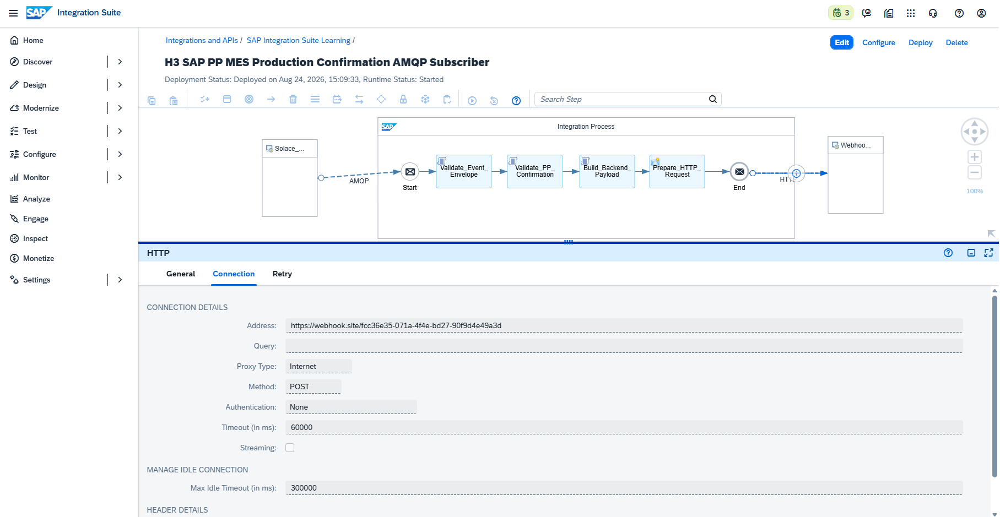

**O que esta evidência comprova:** entrega POST ao backend externo real, encerrando a cadeia broker → CPI → aplicação externa.

---

# 9. Deploy e drenagem do backlog

## 9.1 Consumer online e backlog drenado

Ao iniciar o iFlow, o AMQP Sender conectou-se à queue exclusiva como consumidor ativo e drenou o backlog de cinco mensagens.

### Evidência 10 — Backlog drenado com consumer ativo

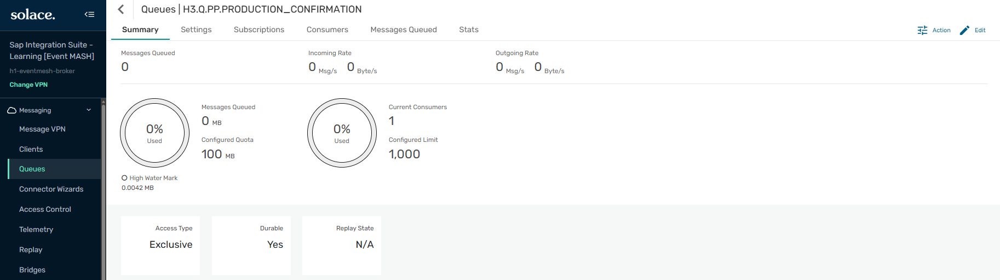

**O que esta evidência comprova:** após o Deploy, a queue passou a ter um consumidor ativo e o backlog foi processado, com Messages Queued retornando a zero.

---

## 9.2 Cinco execuções independentes no CPI

O Monitor do CPI registrou cinco Message Processing Logs distintos, todos Completed, praticamente no mesmo instante, com tempos individuais diferentes.

### Evidência 11 — Cinco confirmações concluídas

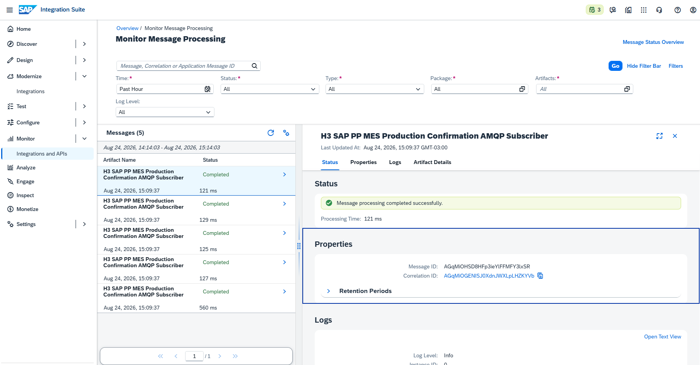

**O que esta evidência comprova:** cada mensagem AMQP disparou uma execução independente do Integration Flow. Cinco eventos resultaram em cinco processamentos concluídos, e não em um único processamento em lote.

---

## 9.3 Cinco requisições no backend externo

O backend externo recebeu cinco requisições distintas. O payload entregue é o contrato transformado pelo CPI, não o evento bruto do MES.

### Evidência 12 — Cinco confirmações recebidas no backend

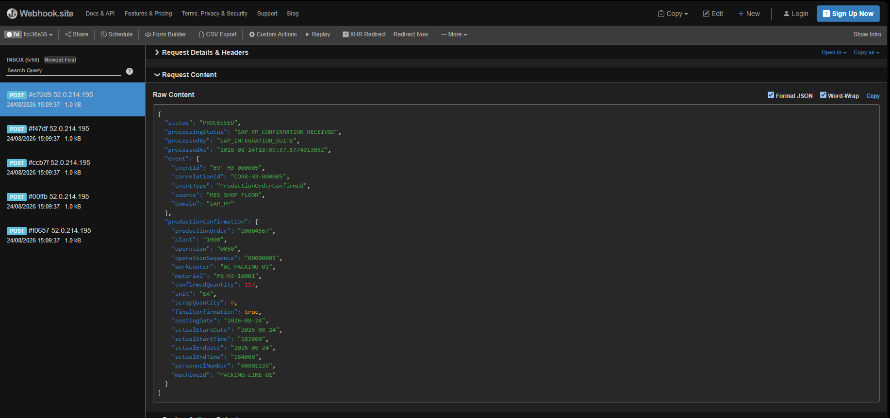

**O que esta evidência comprova:** o backend recebeu 5 requisições e, no evento da operação 0050, o campo `finalConfirmation` foi corretamente derivado como `true` a partir de `AUERU = X`. Isso confirma que o CPI interpretou e transformou os campos SAP, atuando como orquestrador e não como proxy passivo.

Payload representativo entregue ao backend:

```json
{
  "status": "PROCESSED",
  "processingStatus": "SAP_PP_CONFIRMATION_RECEIVED",
  "processedBy": "SAP_INTEGRATION_SUITE",
  "processedAt": "2026-08-24T18:09:37Z",
  "event": {
    "eventId": "EVT-H3-000005",
    "correlationId": "CORR-H3-000005",
    "eventType": "ProductionOrderConfirmed",
    "source": "MES_SHOP_FLOOR",
    "domain": "SAP_PP"
  },
  "productionConfirmation": {
    "productionOrder": "10004567",
    "plant": "1000",
    "operation": "0050",
    "operationSequence": "00000005",
    "workCenter": "WC-PACKING-01",
    "material": "FG-H3-10001",
    "confirmedQuantity": 117,
    "unit": "EA",
    "scrapQuantity": 0,
    "finalConfirmation": true,
    "machineId": "PACKING-LINE-01"
  }
}
```

---

## 9.4 Queue vazia após o processamento

### Evidência 13 — Queue vazia após o backlog

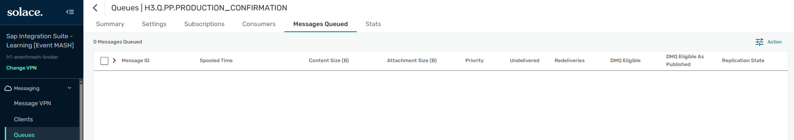

**O que esta evidência comprova:** após o processamento, a durable queue voltou a Messages Queued = 0, encerrando o ciclo de backlog.

---

## 9.5 Métricas de entrega do consumer

### Evidência 14 — Cinco entregas confirmadas sem redelivery

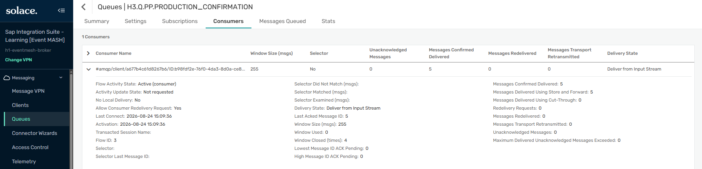

**O que esta evidência comprova:** o consumidor AMQP ficou Active, com Messages Confirmed Delivered = 5, Messages Delivered Using Store and Forward = 5, Messages Redelivered = 0 e Unacknowledged Messages = 0. O caminho feliz foi limpo, sem reentregas e sem mensagens pendentes de acknowledgement.

---

# 10. Storytelling técnico consolidado

O H3 começou com um princípio de negócio simples: no chão de fábrica, confirmações de produção acontecem o tempo todo, e o consumidor corporativo nem sempre está disponível no exato momento do evento.

Para reproduzir isso com honestidade, o consumidor SAP Cloud Integration foi deixado offline. O MES publicou cinco confirmações diferentes da ordem de produção `10004567`, cobrindo as operações de corte, montagem, pintura, qualidade e embalagem. Cada evento foi Persistent e foi atraído pela durable queue exclusiva. O resultado foi um backlog real de cinco mensagens, com zero consumidores.

Esse estado é o coração do cenário. Ele prova que o produtor cumpriu sua responsabilidade sem depender da disponibilidade do consumidor. O broker assumiu a guarda dos eventos.

Em seguida, o consumidor entrou em cena. Ao iniciar o iFlow, o AMQP Sender conectou-se à queue e drenou o backlog de forma ordenada. Cada mensagem disparou uma execução independente do Integration Flow. Cada execução validou o envelope do evento, validou os campos técnicos SAP PP, transformou o evento em um contrato de backend e entregou o resultado a um endpoint externo real, carregando Event ID e Correlation ID.

A validação final veio da triangulação. O broker registrou cinco entregas confirmadas sem redelivery. O CPI registrou cinco processamentos concluídos. O backend recebeu cinco requisições distintas, incluindo a confirmação final com `finalConfirmation = true`.

O aprendizado central do H3 não é apenas que o CPI consegue consumir de um broker. É que uma arquitetura orientada a eventos permite que produção e consumo aconteçam em ritmos diferentes, com garantia de entrega, ordem preservada e rastreabilidade fim a fim.

---

# 11. Matriz de validação

| Validação | Resultado |
|---|---|
| Queue H3 criada | ✅ |
| Topic subscription criada | ✅ |
| Cinco eventos Persistent publicados | ✅ |
| Backlog com consumer offline | ✅ |
| Credencial compartilhada implantada | ✅ |
| AMQP Sender TCP + TLS + SASL | ✅ |
| Concurrency 1 e Prefetch 1 | ✅ |
| Retry configurado | ✅ |
| Validação de envelope | ✅ |
| Validação SAP PP | ✅ |
| Transformação para backend | ✅ |
| Preservação de Event ID | ✅ |
| Preservação de Correlation ID | ✅ |
| Consumer ativo após Deploy | ✅ |
| Cinco execuções independentes | ✅ |
| Cinco requisições no backend | ✅ |
| finalConfirmation derivado de AUERU | ✅ |
| Cinco confirmed deliveries | ✅ |
| Zero redeliveries | ✅ |
| Zero unacknowledged | ✅ |
| Queue drenada | ✅ |

---

# 12. Troubleshooting e aprendizados

## 12.1 Deploy antecipado consumiu o backlog

**Observação:** o Deploy foi acionado antes do planejado, e o consumidor drenou as cinco mensagens imediatamente.

**Tratamento:** não houve prejuízo. O backlog já havia sido evidenciado antes do Deploy nas evidências 03 e 04, e o resultado pós-consumo foi comprovado nas evidências 10 a 14. A narrativa antes/depois permaneceu íntegra.

**Aprendizado:** em cenários de backlog, capturar o estado de fila com consumer offline antes de iniciar o iFlow é decisivo, pois após o Start a drenagem pode ser praticamente instantânea.

## 12.2 Cada mensagem AMQP gera uma execução

**Observação:** cinco eventos geraram cinco Message Processing Logs, não um batch.

**Aprendizado:** o AMQP Sender inicia uma execução do Integration Flow por mensagem consumida, o que reforça a necessidade de idempotência e de correlação por evento no design.

## 12.3 Ordem e exclusividade

**Observação:** a queue exclusiva manteve um único consumidor ativo e preservou a ordem.

**Aprendizado:** para backlog sequencial de operações de uma mesma ordem, Exclusive é adequado. Cenários de escala horizontal com competing consumers exigem Non-Exclusive e serão explorados adiante no bloco.

---

# 13. Boas práticas aplicadas

1. Consumer publica identidade de evento e correlação em properties e headers.
2. Credencial compartilhada do broker mantida no Security Material, fora do iFlow.
3. TLS e SASL para o transporte AMQP externo.
4. Durable queue para não perder eventos com consumer offline.
5. Prefetch e concorrência conservadores para observar o consumo.
6. Política de retry explícita para evitar retries ilimitados.
7. Validação em duas camadas: contrato de evento e campos SAP PP.
8. Transformação para um contrato de backend claro e legível.
9. Rastreabilidade fim a fim por Event ID e Correlation ID.
10. Observabilidade em três plataformas: broker, CPI e backend.
11. Contrato SAP-like documentado como custom, sem confundir com a API oficial.
12. Isolamento lógico por queue e topic mesmo com broker compartilhado.
13. Capturas sanitizadas, sem exposição de senha ou URL sensível permanente.

---

# 14. Recomendações para produção

- OAuth 2.0 ou client certificate quando o broker e o modelo de segurança justificarem;
- segregação de credenciais por aplicação e princípio de menor privilégio;
- idempotência de consumo e deduplicação por Event ID;
- dimensionamento de concorrência e prefetch conforme volume real;
- Dead Message Queue e política de poison messages;
- limites de retry alinhados ao broker para evitar loops de redelivery;
- monitoramento de backlog, latência fim a fim e consumer lag;
- distributed tracing correlacionado por Correlation ID;
- alertas de consumidor inativo e de acúmulo de fila;
- HA e DR do broker;
- contrato formal do evento com schema e versionamento compatível;
- separação real de recursos entre ambientes.

---

# 15. Recursos praticados

| Área | Recurso |
|---|---|
| SAP Integration Suite | Cloud Integration |
| Inbound | AMQP Sender Adapter |
| Transport security | TLS |
| Broker authentication | SASL |
| Secret handling | Security Material / User Credentials |
| Custom logic | Groovy |
| Event validation | Envelope e campos SAP PP |
| Transformation | Backend contract |
| Correlation | Event ID + Correlation ID |
| Outbound | HTTP Receiver |
| Broker | Solace PubSub+ Cloud |
| Guaranteed endpoint | Durable Queue |
| Queue semantics | Exclusive |
| Backlog | Consumer offline buffering |
| Testing backend | webhook.site |
| Monitoring | CPI MPL + Solace Broker Manager |

---

# 16. Próximo cenário — H4

## H4 — Competing Consumers e escala horizontal

H3 usou uma queue exclusiva com um único consumidor e ordem preservada. H4 explorará o trade-off oposto: uma queue não exclusiva com múltiplos consumidores em round-robin, demonstrando load balancing e escala horizontal, e comparando explicitamente ordem versus throughput.

O cenário criará um novo iFlow do zero, um novo domínio de evento e um volume maior de mensagens, para observar a distribuição entre consumidores concorrentes.

---

# 17. Navegação

**Cenário anterior:** [H2 — SAP Cloud Integration Publisher to Solace via AMQP](./33-h2-sap-cloud-integration-publisher-solace-amqp.md)

**Próximo cenário:** [H4 — Competing Consumers e escala horizontal](./35-h4-solace-competing-consumers-scaling.md)

---

# 18. Referências oficiais

## SAP

- [Configure the AMQP Sender Adapter](https://help.sap.com/docs/cloud-integration/sap-cloud-integration/configure-amqp-sender-adapter)
- [AMQP Adapter](https://help.sap.com/docs/cloud-integration/sap-cloud-integration/amqp-adapter)
- [Production Order Confirmation — API_PROD_ORDER_CONFIRMATION_2_SRV](https://help.sap.com/docs/SAP_S4HANA_CLOUD/d35113ee62644d3abee1aaec148291d9/e77b762e243b4045ad1f1f048f6aab87.html)
- [Discovering Event-Driven Integration with SAP Integration Suite, advanced event mesh](https://learning.sap.com/courses/discovering-event-driven-integration-with-sap-integration-suite-advanved-event-mesh)

## Solace

- [Guaranteed Messages](https://docs.solace.com/Messaging/Guaranteed-Msg/Guaranteed-Messages.htm)
- [Queues](https://docs.solace.com/Messaging/Guaranteed-Msg/Queues.htm)
- [Using AMQP 1.0](https://docs.solace.com/API/AMQP/Using-AMQP.htm)

---

# 19. Ferramentas utilizadas

- SAP Integration Suite — Cloud Integration
- Solace PubSub+ Cloud
- Solace Broker Manager
- Solace Try Me!
- AMQP 1.0
- webhook.site
- Groovy
- Git / GitHub

---

## 👤 Autor / 📇 Contato

[](https://www.linkedin.com/in/orlando-caetano/) [](https://github.com/OrlandoCaetano2026)

**Orlando Caetano**  
Especialista SAP • Integração • Inteligência Artificial  
Consultor SAP MM com know-how em PP, QM e WM

   

> 📌 Projeto de estudo e portfólio. Os cenários SAP MM, PP, QM, MES e Event-Driven são simulações educativas para prática de arquitetura e integração.
