# H4 — Competing Consumers e Escala Horizontal: Solace Non-Exclusive Queue com Três Workers e Três Backends Reais

> **Bloco H — Event-Driven Integration / Event Mesh**  
> **Documento 35**  
> **Objetivo:** demonstrar, com um cenário de logística SAP WM, o padrão Competing Consumers sobre uma Solace Non-Exclusive Queue, distribuindo dinamicamente a carga de eventos de picking entre três consumidores independentes do SAP Cloud Integration, cada um entregando a um backend externo distinto, e comprovar escala horizontal, isolamento de falha e recuperação dinâmica de capacidade.

---

## 1. Perfil técnico do cenário

| Item | Implementação |
|---|---|
| Cenário | H4 — Competing Consumers e Horizontal Scaling |
| Domínio | SAP WM / Order Fulfillment |
| Componente SAP | SAP Integration Suite — Cloud Integration |
| Broker | Solace PubSub+ Cloud |
| Message VPN | `h1-eventmesh-broker` |
| Queue | `H4.Q.WM.PICKING_REQUEST` |
| Queue durability | Durable |
| Access Type | **Non-Exclusive** |
| Partition Count | 0 (não particionada) |
| Queue quota | 100 MB |
| Topic | `warehouse/wm/picking/requested/v1` |
| Protocolo | AMQP 1.0 sobre TCP/TLS |
| Porta | `5671` |
| Autenticação | SASL |
| Credential alias | `SOLACE_AMQP_CREDENTIALS` |
| Consumidores | `H4_WM_Picking_Worker_A`, `_B`, `_C` |
| Concurrent Processes por worker | 1 |
| Prefetch por worker | 1 |
| Max. Retries | 3 |
| Producer | OMS Simulator em Node.js (rhea, AMQP 1.0) |
| Backend A | Webhook.site |
| Backend B | RequestBin / Pipedream |
| Backend C | Beeceptor |
| Volume total | 60+ eventos Persistent em múltiplas fases |
| Evidências | `evidences/lab33/` — 31 imagens |

---

## 2. Visão executiva

Os cenários H1 a H3 construíram os fundamentos do Event Mesh: broker, publish/subscribe, guaranteed messaging, publisher e subscriber. Em todos eles, o consumo utilizou uma queue **Exclusive**, com um único consumidor ativo e ordem preservada. H4 muda deliberadamente esse eixo. Aqui o objetivo não é ordem, e sim **escala e resiliência**.

O cenário simula um centro de distribuição integrado a um sistema de gestão de pedidos. Um OMS emite dezenas de solicitações de picking de armazém. Essas solicitações não chamam o SAP diretamente. Elas são publicadas de forma assíncrona no Solace, com entrega Persistent, em uma **Non-Exclusive Queue**. Em uma queue não exclusiva e não particionada, o broker permite múltiplos consumidores ativos simultaneamente e distribui as mensagens entre eles, formando o padrão clássico de Competing Consumers.

Três iFlows independentes — Worker A, Worker B e Worker C — consomem a mesma queue. Cada worker é idêntico em lógica, mudando apenas sua identidade e o backend de destino. Worker A entrega ao Webhook.site, Worker B ao RequestBin e Worker C ao Beeceptor. Assim, a distribuição do trabalho fica visualmente inequívoca em três serviços externos diferentes.

O experimento percorreu quatro momentos: distribuição normal com três consumidores, retirada controlada do Worker B, degradação parcial adicional causada pelo limite de plano gratuito de um dos backends, e recuperação do Worker B com retorno dinâmico ao pool de consumo. O resultado não demonstra apenas load balancing. Demonstra também isolamento parcial de falhas e recuperação dinâmica de capacidade, comportamentos essenciais em arquiteturas orientadas a eventos de missão crítica.

---

## 3. Objetivos de aprendizagem

Ao concluir H4, o laboratório comprova capacidade de:

- diferenciar Exclusive de Non-Exclusive na semântica de consumo Solace;
- configurar uma Non-Exclusive Queue não particionada para Competing Consumers;
- conectar múltiplos consumidores SAP Cloud Integration à mesma queue;
- distribuir workload horizontalmente entre workers concorrentes;
- construir um producer externo AMQP 1.0 em Node.js;
- publicar eventos Persistent com confirmação de entrega (settlement);
- integrar três backends externos independentes;
- preservar Event ID e Correlation ID de ponta a ponta;
- simular a falha de um consumidor e observar redistribuição da carga;
- observar degradação parcial de downstream sem parada total do serviço;
- recuperar um consumidor e comprovar seu retorno ao pool;
- diagnosticar corretamente erros de rede, egress e settlement AMQP.

---

# 4. Fundamentos

## 4.1 Exclusive versus Non-Exclusive

No H3, a queue foi Exclusive: apenas um consumidor fica ativo e a ordem é garantida. É o modelo ideal para processamento sequencial.

No H4, a queue é Non-Exclusive e não particionada. Nesse modo, múltiplos consumidores podem permanecer ativos e o broker distribui mensagens entre eles em round-robin. A ordem global deixa de ser garantida, mas ganha-se paralelismo e escala. Esse é o padrão Competing Consumers.

| Característica | Exclusive (H3) | Non-Exclusive (H4) |
|---|---|---|
| Consumidores ativos | 1 | vários |
| Objetivo | ordem | escala |
| Distribuição | único consumidor | round-robin |
| Ordem global | garantida | não garantida |
| Padrão | fault-tolerant single consumer | competing consumers |

## 4.2 Por que três backends diferentes

Se os três workers entregassem ao mesmo backend, seria difícil provar qual worker processou cada evento. Usando três serviços externos distintos, a distribuição fica evidente: cada request aparece no serviço correspondente ao worker que o processou. Além disso, o cenário passa a exercitar integração com três aplicações consumidoras reais, aproximando-se de um landscape de mercado.

## 4.3 O produtor externo Node.js

Para gerar volume realista sem publicar manualmente dezenas de mensagens, foi criado um OMS Simulator em Node.js usando a biblioteca AMQP 1.0 `rhea`. Como o Solace atua como broker AMQP 1.0, qualquer cliente compatível pode publicar nele. O producer envia eventos Persistent e aguarda o settlement do broker, distinguindo explicitamente uma mensagem apenas enviada de uma mensagem efetivamente aceita.

## 4.4 Contrato de evento SAP WM

O evento de picking utiliza nomes técnicos SAP WM, aproximando o laboratório da realidade de consultoria.

| Campo | Significado no cenário |
|---|---|
| `LGNUM` | Número do depósito / warehouse |
| `TANUM` | Número da ordem/tarefa de transferência |
| `VBELN` | Documento de entrega |
| `MATNR` | Material |
| `LGTYP` | Tipo de depósito / storage type |
| `LGPLA` | Posição / storage bin |
| `VSOLA` | Quantidade solicitada |
| `MEINS` | Unidade de medida |

> **Nota de precisão técnica:** este é um contrato custom orientado por nomenclatura SAP WM para fins de estudo. Não representa o request oficial de uma API S/4HANA de Warehouse Task.

---

# 5. Arquitetura

## 5.1 Arquitetura geral

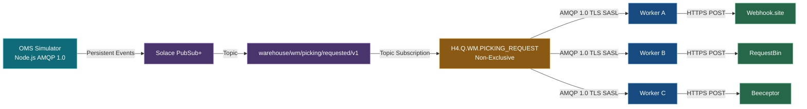
```mermaid
flowchart LR
    OMS[OMS Simulator\nNode.js AMQP 1.0] -->|Persistent Events| S[Solace PubSub+]
    S -->|Topic| T[warehouse/wm/picking/requested/v1]
    T -->|Topic Subscription| Q[H4.Q.WM.PICKING_REQUEST\nNon-Exclusive]
    Q -->|AMQP 1.0 TLS SASL| WA[Worker A]
    Q -->|AMQP 1.0 TLS SASL| WB[Worker B]
    Q -->|AMQP 1.0 TLS SASL| WC[Worker C]
    WA -->|HTTPS POST| BA[Webhook.site]
    WB -->|HTTPS POST| BB[RequestBin]
    WC -->|HTTPS POST| BC[Beeceptor]

    classDef oms fill:#0f6b78,color:#fff,stroke:#58c7d1;
    classDef broker fill:#49346b,color:#fff,stroke:#a98bdc;
    classDef queue fill:#8a5a14,color:#fff,stroke:#e5b75f;
    classDef sap fill:#174a7e,color:#fff,stroke:#65a8e5;
    classDef backend fill:#276749,color:#fff,stroke:#77c99a;
    class OMS oms;
    class S,T broker;
    class Q queue;
    class WA,WB,WC sap;
    class BA,BB,BC backend;
```

## 5.2 Arquitetura detalhada das fases

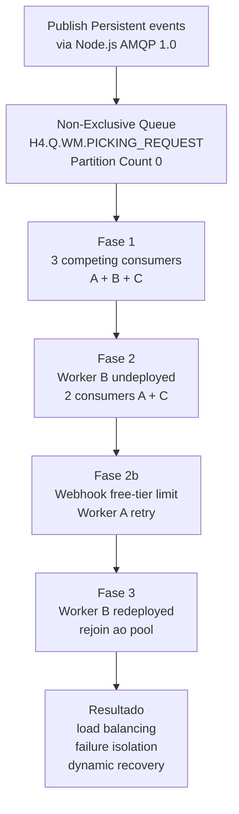
```mermaid
flowchart TD
    P[Publish Persistent events\nvia Node.js AMQP 1.0]
    Q[Non-Exclusive Queue\nH4.Q.WM.PICKING_REQUEST\nPartition Count 0]
    F1[Fase 1\n3 competing consumers\nA + B + C]
    F2[Fase 2\nWorker B undeployed\n2 consumers A + C]
    F3[Fase 2b\nWebhook free-tier limit\nWorker A retry]
    F4[Fase 3\nWorker B redeployed\nrejoin ao pool]
    R[Resultado\nload balancing\nfailure isolation\ndynamic recovery]

    P --> Q --> F1 --> F2 --> F3 --> F4 --> R
```

## 5.3 Sequência do experimento

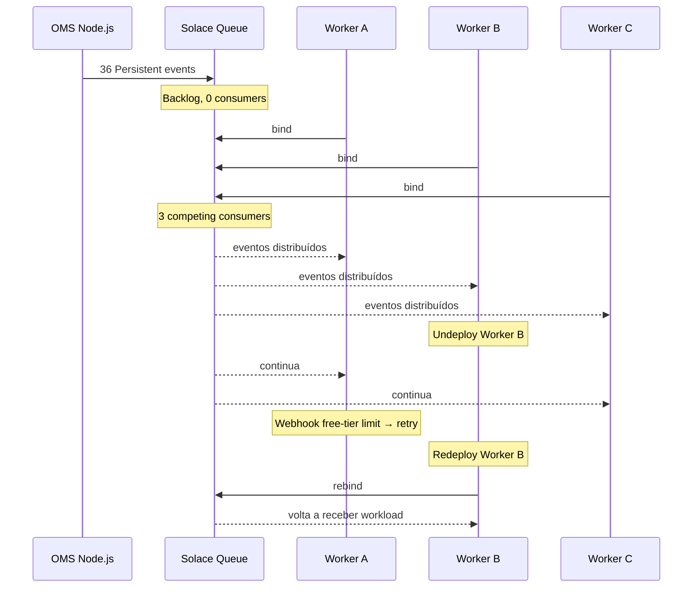
```mermaid
sequenceDiagram
    participant OMS as OMS Node.js
    participant SOL as Solace Queue
    participant A as Worker A
    participant B as Worker B
    participant C as Worker C

    OMS->>SOL: 36 Persistent events
    Note over SOL: Backlog, 0 consumers
    A->>SOL: bind
    B->>SOL: bind
    C->>SOL: bind
    Note over SOL: 3 competing consumers
    SOL-->>A: eventos distribuídos
    SOL-->>B: eventos distribuídos
    SOL-->>C: eventos distribuídos
    Note over B: Undeploy Worker B
    SOL-->>A: continua
    SOL-->>C: continua
    Note over A: Webhook free-tier limit → retry
    Note over B: Redeploy Worker B
    B->>SOL: rebind
    SOL-->>B: volta a receber workload
```

---

# 6. Preparação do broker

## 6.1 Non-Exclusive Queue

A queue foi criada especificamente para o padrão Competing Consumers.

| Propriedade | Valor |
|---|---|
| Incoming | On |
| Outgoing | On |
| Durable | Yes |
| Access Type | Non-Exclusive |
| Partition Count | 0 |
| Messages Queued Quota | 100 MB |
| Maximum Consumer Count | 1000 |

### Evidência 01 — Non-Exclusive Picking Queue

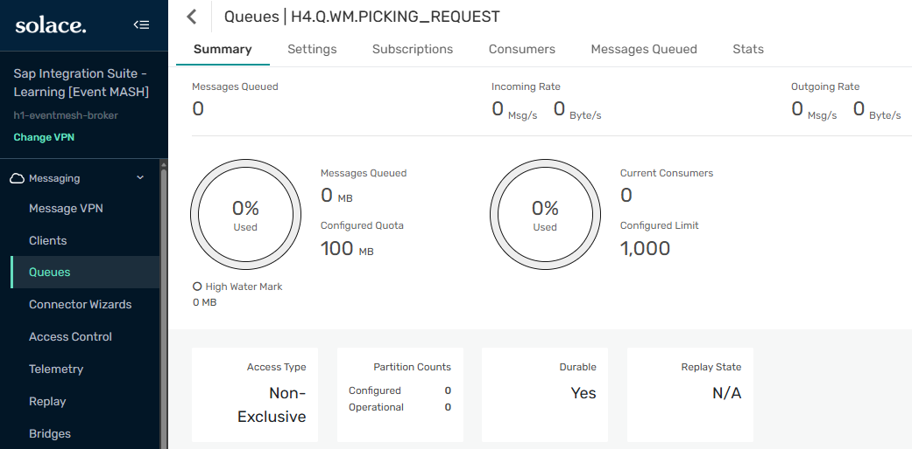

**O que esta evidência comprova:** criação da queue `H4.Q.WM.PICKING_REQUEST` como Durable, Non-Exclusive e não particionada, com zero mensagens e zero consumidores, servindo de baseline para o experimento.

## 6.2 Topic Subscription

A queue foi inscrita no topic de picking.

```text
warehouse/wm/picking/requested/v1
```

### Evidência 02 — Topic Subscription

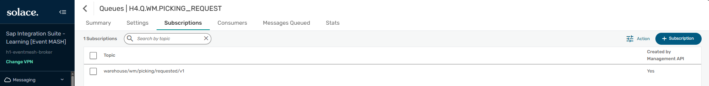

**O que esta evidência comprova:** todas as solicitações de picking publicadas no topic são atraídas para a queue Non-Exclusive do H4.

---

# 7. Preparação dos backends externos

Cada worker entrega a um serviço externo diferente, tornando a distribuição observável.

### Evidência 03 — Backend A pronto (Webhook.site)

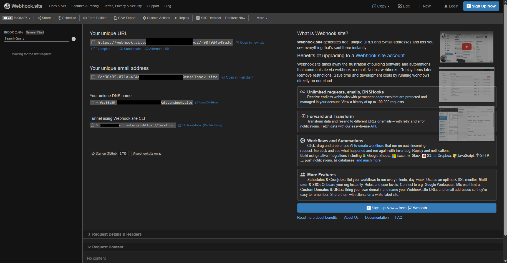

**O que esta evidência comprova:** endpoint do Webhook.site preparado para o Worker A, com inbox zerada.

### Evidência 04 — Backend B pronto (RequestBin)

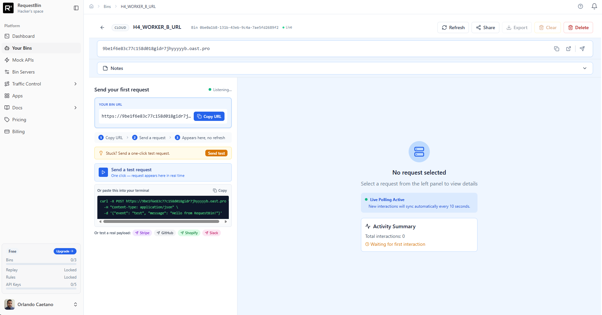

**O que esta evidência comprova:** Cloud Bin do RequestBin preparado para o Worker B, aguardando requisições.

### Evidência 05 — Backend C pronto (Beeceptor)

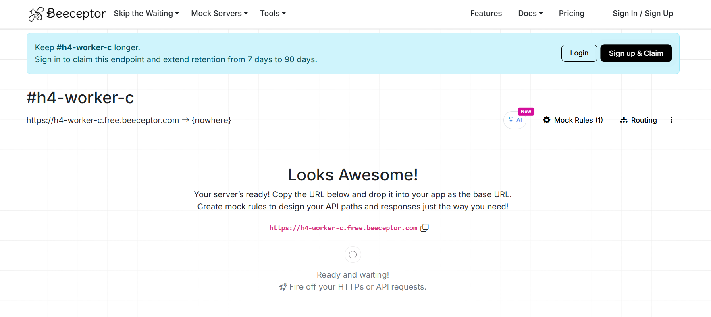

**O que esta evidência comprova:** endpoint HTTPS do Beeceptor preparado para o Worker C.

---

# 8. Configuração do Worker A

Os três workers são idênticos em lógica. O Worker A é o template; B e C são cópias que alteram apenas a identidade e o backend.

## 8.1 AMQP Sender — Connection

| Parâmetro | Valor |
|---|---|
| Transport | TCP |
| Message Protocol | AMQP 1.0 |
| Host | `mr-connection-uovq1o9wcqd.messaging.solace.cloud` |
| Port | `5671` |
| Proxy | Internet |
| Authentication | SASL |
| Credential Name | `SOLACE_AMQP_CREDENTIALS` |
| Connect with TLS | Enabled |

### Evidência 06 — AMQP Connection

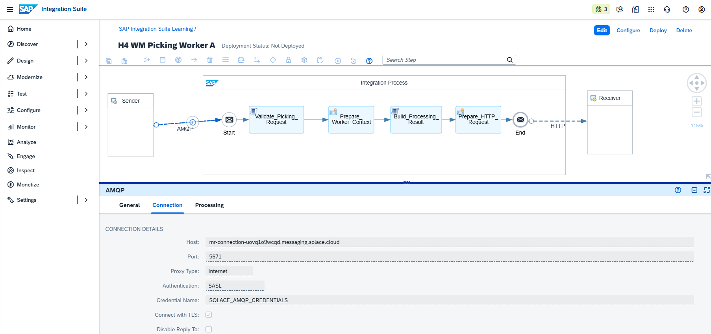

**O que esta evidência comprova:** sessão AMQP 1.0 segura com TLS e SASL, usando a credencial compartilhada do broker.

## 8.2 AMQP Sender — Processing

| Parâmetro | Valor |
|---|---|
| Queue Name | `H4.Q.WM.PICKING_REQUEST` |
| Number of Concurrent Processes | 1 |
| Max. Number of Prefetched Messages | 1 |
| Max. Number of Retries | 3 |
| Delivery Status After Max. Retries | REJECTED |

### Evidência 07 — AMQP Processing

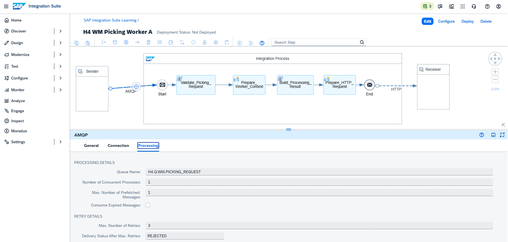

**O que esta evidência comprova:** o Worker A consome exatamente a queue compartilhada, com concorrência e prefetch mínimos para observabilidade, e política de retry finita.

## 8.3 Contexto e transformação

O iFlow valida o evento, identifica o worker e transforma o payload antes da entrega.

```text
AMQP Sender
  ↓
Validate_Picking_Request
  ↓
Prepare_Worker_Context   (workerId, backendName, scenarioId)
  ↓
Build_Processing_Result
  ↓
Prepare_HTTP_Request
  ↓
HTTP Receiver
```

### Evidência 08 — Worker Context

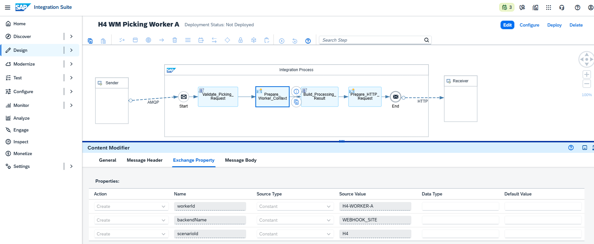

**O que esta evidência comprova:** o fluxo do Worker A e a atribuição de identidade `workerId = H4-WORKER-A`, `backendName = WEBHOOK_SITE`, `scenarioId = H4`.

### Evidência 09 — HTTP Headers

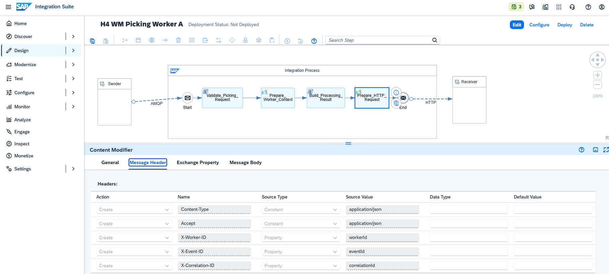

**O que esta evidência comprova:** a identidade do worker e a correlação distribuída são propagadas como headers HTTP (`X-Worker-ID`, `X-Event-ID`, `X-Correlation-ID`), além do body.

### Evidência 10 — HTTP Receiver

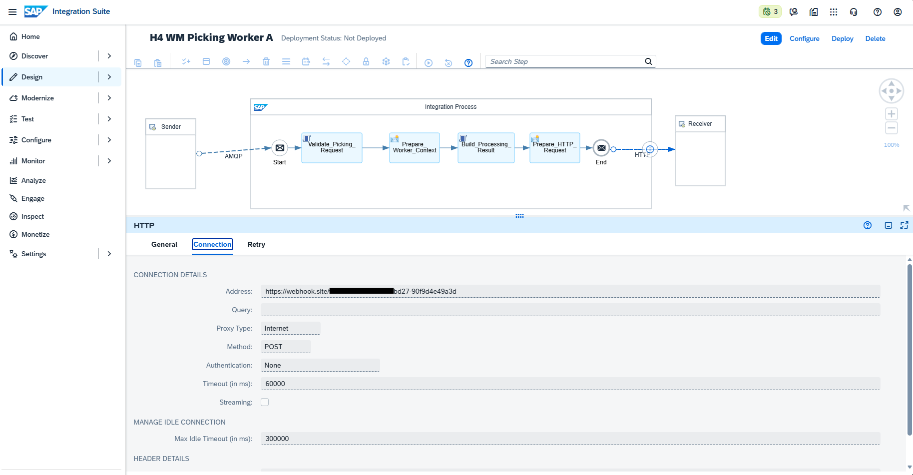

**O que esta evidência comprova:** entrega POST do Worker A ao backend externo Webhook.site.

> **Cópias B e C:** os Workers B e C foram criados a partir do A alterando somente três pontos: no Content Modifier `Prepare_Worker_Context`, os valores `workerId` (`H4-WORKER-B` / `H4-WORKER-C`) e `backendName` (`REQUESTBIN` / `BEECEPTOR`); e o endereço do HTTP Receiver (RequestBin / Beeceptor). Toda a configuração AMQP, incluindo a mesma queue, permaneceu idêntica, o que é justamente a condição para que compitam pela mesma workload.

---

# 9. Produtor Node.js e backlog inicial

O OMS Simulator em Node.js publicou os eventos com confirmação de settlement do broker.

### Evidência 11 — Publisher Node.js confirmado

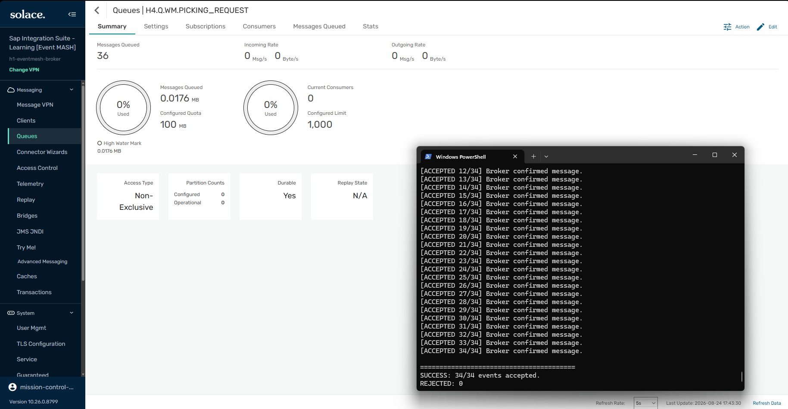

**O que esta evidência comprova:** o publisher AMQP 1.0 recebeu confirmação do broker para o lote (`ACCEPTED`, `0 REJECTED`), e o Solace acumulou o backlog total de 36 mensagens antes da ativação dos consumidores.

### Evidência 12 — Mensagens Persistent retidas

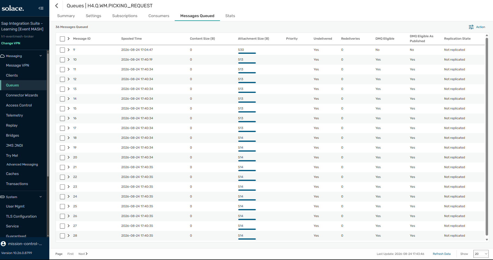

**O que esta evidência comprova:** as 36 mensagens estão fisicamente armazenadas na durable queue, todas Undelivered e com Redeliveries = 0, aguardando os competing consumers.

---

# 10. Troubleshooting real — egress desabilitado

Uma tentativa de sincronizar a ativação dos três workers usando `Outgoing = Off` na queue revelou um comportamento importante do broker.

### Evidência 13 — AMQP resource-locked

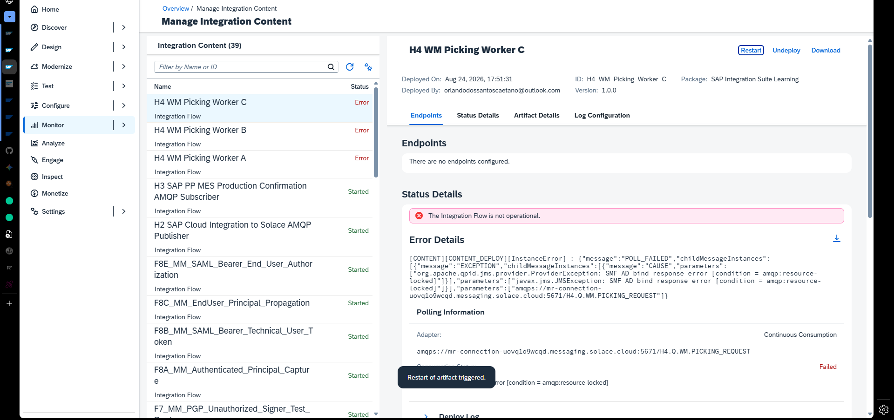

**O que esta evidência comprova:** com o egress da queue desabilitado, o bind AMQP do Worker A foi recusado com `amqp:resource-locked` e `Consumption Status: Failed`. Isso demonstra que desabilitar o egress impede o acesso do consumidor ao endpoint, e não apenas pausa a entrega. A abordagem de gate foi então abandonada, e o egress reabilitado.

---

# 11. Fase 1 — Competing Consumers ativos

Com o egress reabilitado e os três workers deployados, a queue passou a ter três consumidores competindo pela carga.

### Evidência 14 — 36 mensagens distribuídas entre workers

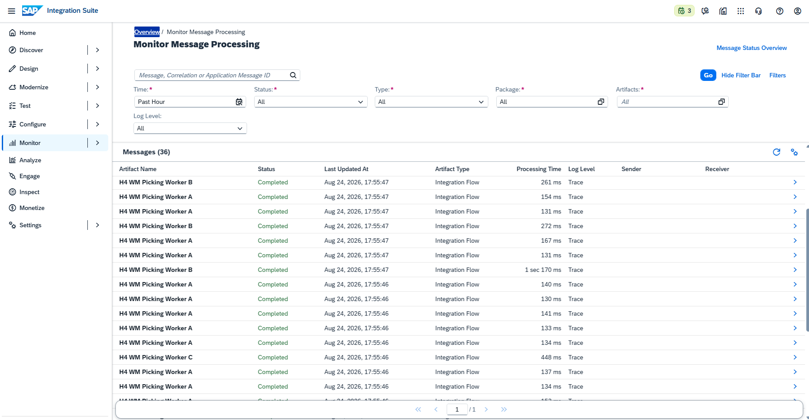

**O que esta evidência comprova:** o CPI processou a carga com participação dos três workers, cada mensagem gerando uma execução independente do Integration Flow.

### Evidência 15 — Fluxo completo de um competing consumer

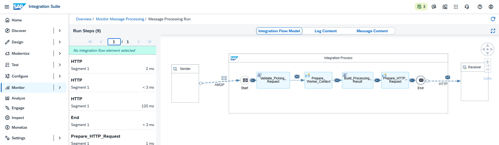

**O que esta evidência comprova:** uma execução completa AMQP → validação → contexto do worker → transformação → HTTP, concluída com sucesso.

### Evidência 16 — Backlog zerado com três consumidores

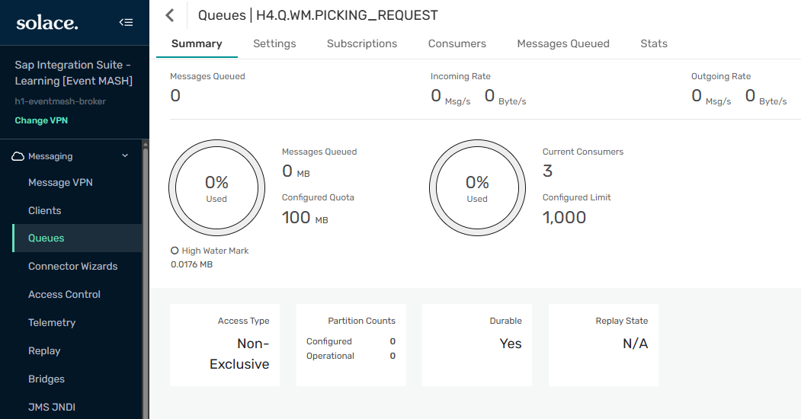

**O que esta evidência comprova:** as mensagens foram drenadas e a queue permanece com três consumidores ativos, prontos para novas cargas.

### Evidência 17 — Três consumer flows ativos

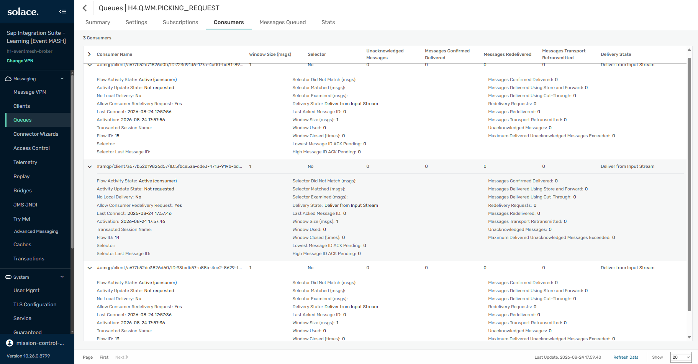

**O que esta evidência comprova:** o broker lista explicitamente três consumer flows Active sobre a mesma Non-Exclusive Queue. É a prova central do padrão Competing Consumers.

---

# 12. Distribuição visível nos três backends

A distribuição ficou inequívoca porque cada worker entregou a um serviço externo diferente.

### Evidência 18 — Worker A no Webhook.site

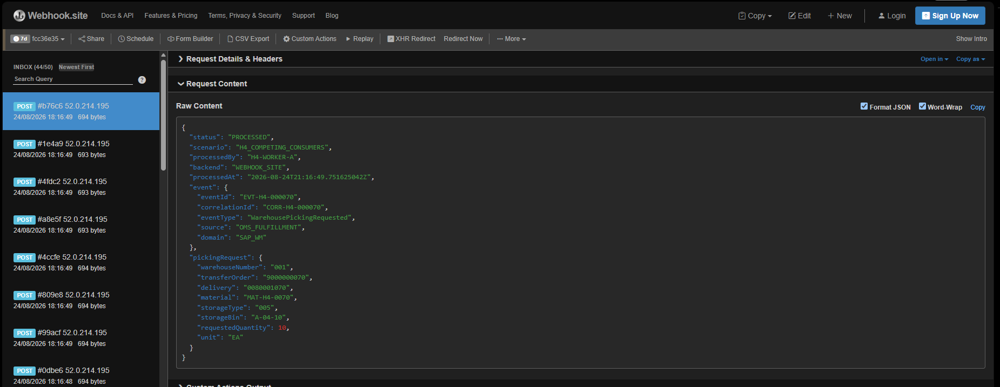

**O que esta evidência comprova:** eventos processados por `H4-WORKER-A`, com `backend = WEBHOOK_SITE`, Event ID, Correlation ID e campos WM transformados.

### Evidência 19 — Worker B no RequestBin

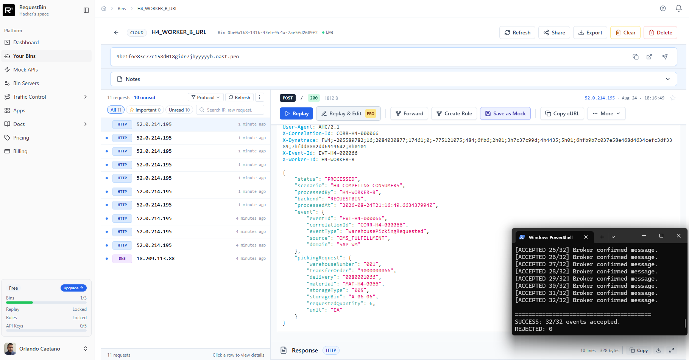

**O que esta evidência comprova:** eventos processados por `H4-WORKER-B`, com `backend = REQUESTBIN`, incluindo headers `X-Worker-Id`, `X-Event-Id` e `X-Correlation-Id`.

### Evidência 20 — Worker C no Beeceptor

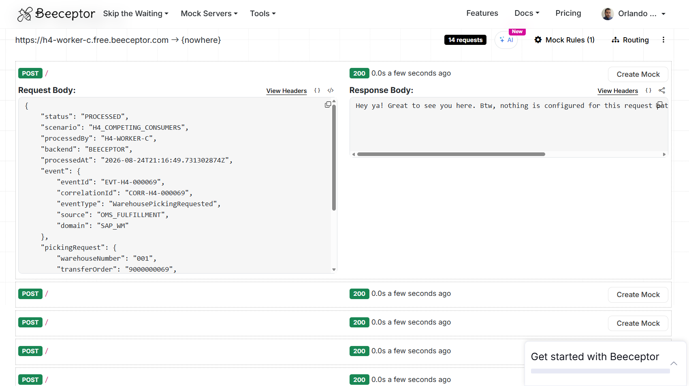

**O que esta evidência comprova:** eventos processados por `H4-WORKER-C`, com `backend = BEECEPTOR` e resposta HTTP 200.

### Evidência 21 — Processamento distribuído no CPI

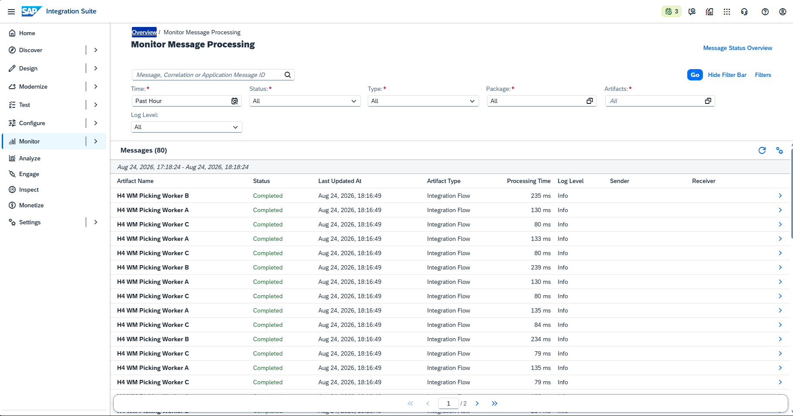

**O que esta evidência comprova:** o Monitor apresenta execuções `Completed` de A, B e C intercaladas praticamente no mesmo instante, evidenciando distribuição dinâmica da workload entre os três competing consumers.

---

# 13. Fase 2 — Falha controlada do Worker B

Para testar resiliência, o Worker B foi retirado do runtime.

### Evidência 22 — Worker B em Stopping, A e C ativos

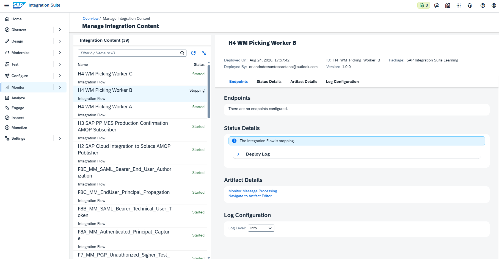

**O que esta evidência comprova:** o Worker B entra em Stopping enquanto A e C permanecem Started, iniciando a simulação de falha parcial sem parar o serviço.

### Evidência 23 — Dois consumidores após a falha

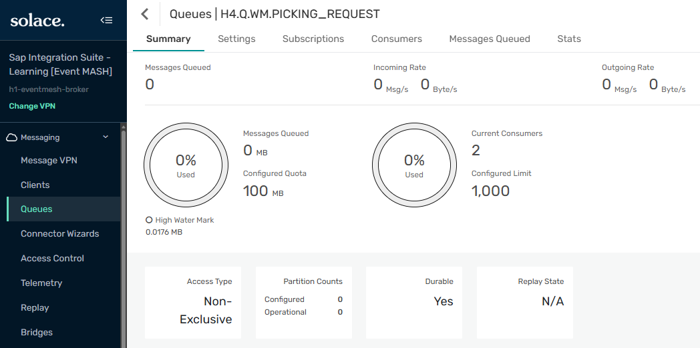

**O que esta evidência comprova:** a queue passou de três para dois consumidores, sem indisponibilidade total.

### Evidência 24 — Dois consumidores com entregas confirmadas

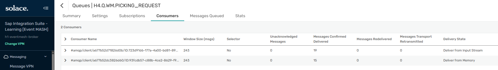

**O que esta evidência comprova:** os dois consumer flows remanescentes seguem ativos, com 19 e 15 mensagens confirmadas, zero redelivered e zero unacknowledged. A carga foi absorvida pelos consumidores restantes.

---

# 14. Fase 2b — Degradação parcial de downstream

Durante a operação com dois consumidores, um segundo evento não planejado enriqueceu o cenário: o backend do Worker A atingiu o limite do plano gratuito.

### Evidência 25 — Retry de A e C durante degradação

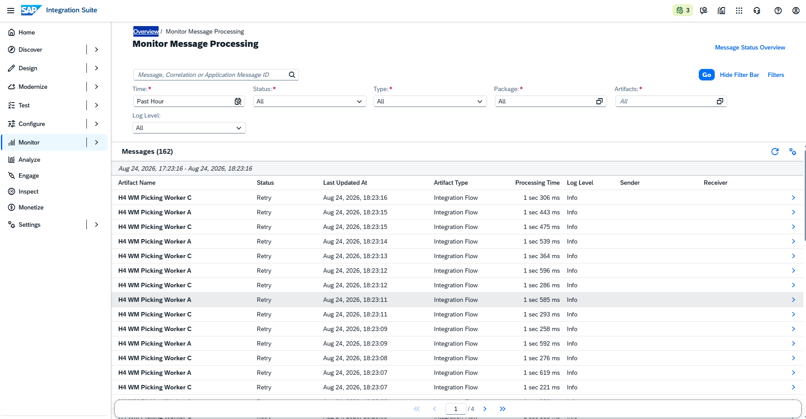

**O que esta evidência comprova:** os consumidores continuaram recebendo workload do broker, porém entraram em Retry porque a conclusão com sucesso depende de toda a cadeia downstream, não apenas do consumo AMQP.

### Evidência 26 — Worker C continua durante a falha de B

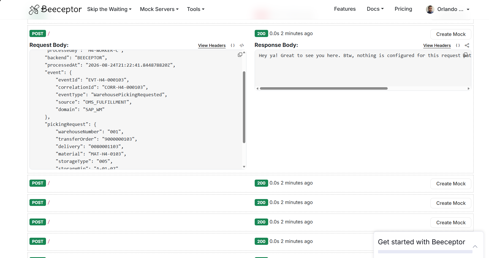

**O que esta evidência comprova:** o Worker C seguiu entregando ao Beeceptor com HTTP 200, incluindo `EVT-H4-000103`, mesmo com o Worker B offline.

### Evidência 27 — Limite do plano gratuito no Webhook.site

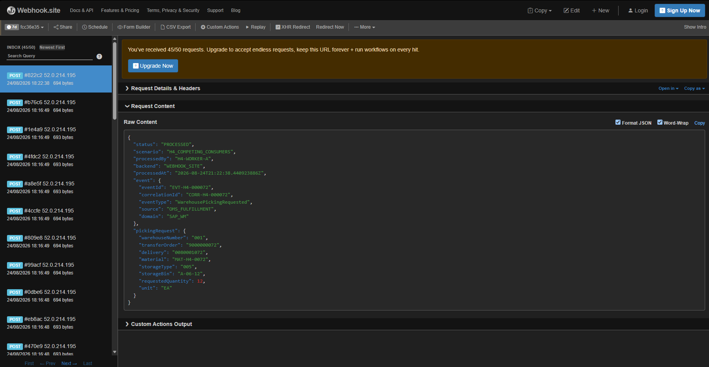

**O que esta evidência comprova:** o Webhook.site atingiu o limite de requisições do plano gratuito, o que explica objetivamente a causa raiz dos retries do Worker A. A degradação foi do backend externo, não do padrão de consumo.

### Evidência 28 — Worker C concluído durante a falha parcial

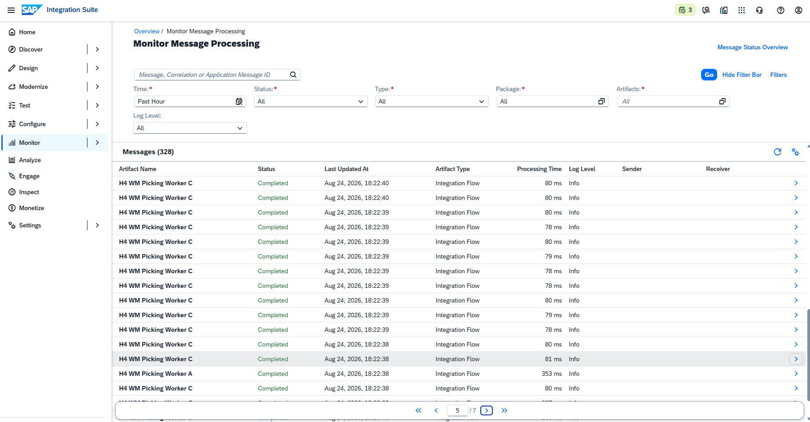

**O que esta evidência comprova:** o Worker C permaneceu saudável e concluiu processamentos enquanto o Worker A degradava e o Worker B estava offline, demonstrando isolamento parcial de falhas.

---

# 15. Fase 3 — Recuperação do Worker B

O Worker B foi reimplantado e retornou ao pool de consumo.

### Evidência 29 — Worker B redeployado

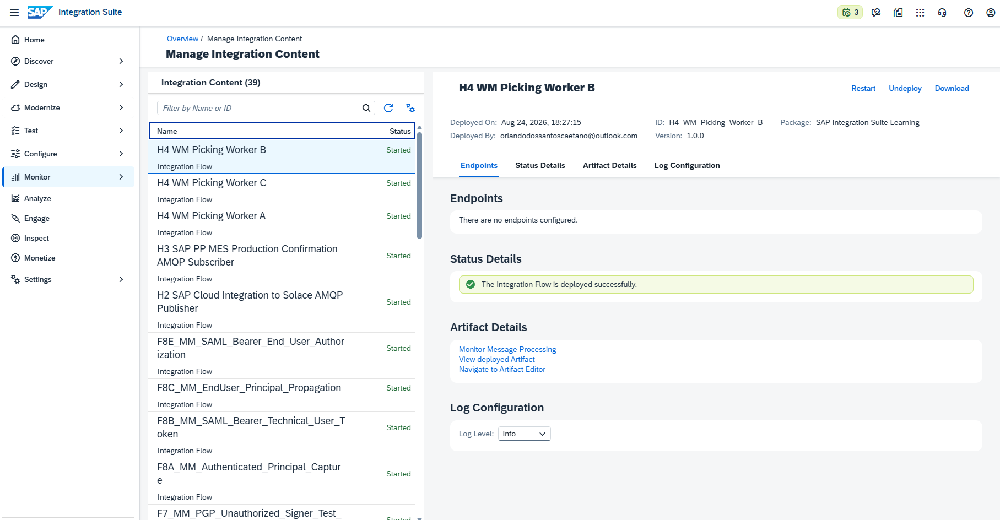

**O que esta evidência comprova:** o Worker B voltou ao estado Started junto de A e C, com deployment bem-sucedido.

### Evidência 30 — Workload de recuperação do Worker B

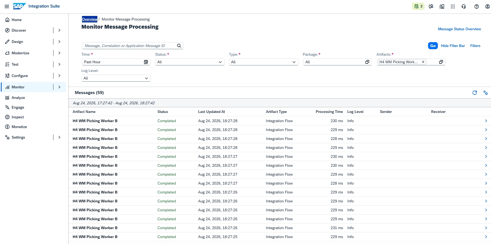

**O que esta evidência comprova:** o Monitor filtrado por Worker B mostra dezenas de execuções `Completed` após a recuperação, evidenciando que o consumidor voltou a assumir carga imediatamente.

### Evidência 31 — Worker B processando após a recuperação

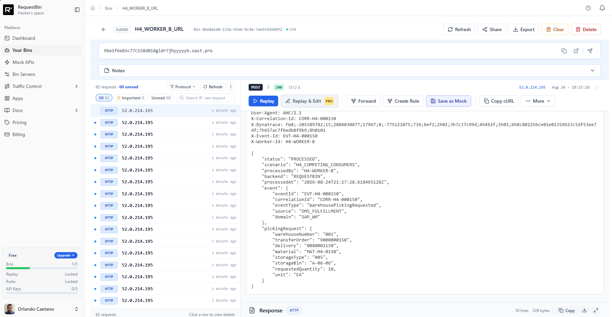

**O que esta evidência comprova:** o RequestBin voltou a receber eventos do Worker B, incluindo `EVT-H4-000150`, com `X-Worker-Id: H4-WORKER-B`, `X-Event-Id` e `X-Correlation-Id` preservados. É o fechamento perfeito do ciclo de recuperação dinâmica.

---

# 16. Storytelling técnico consolidado

O H4 começou com uma pergunta de arquitetura: como fazer um centro de distribuição processar um grande volume de solicitações de picking sem que um único consumidor vire gargalo, e sem que a falha de um componente derrube todo o processo?

A resposta foi construída em camadas. Primeiro, a queue deixou de ser Exclusive e passou a Non-Exclusive não particionada, habilitando múltiplos consumidores. Depois, um OMS Simulator em Node.js publicou dezenas de eventos Persistent, confirmando cada envio pelo settlement do broker. As mensagens ficaram retidas como backlog, provando o desacoplamento temporal.

Ao ativar os três workers, o broker passou a distribuir a carga entre eles. O Monitor do CPI mostrou execuções intercaladas de A, B e C, e os três backends externos independentes registraram eventos distintos. Cada request carregava a identidade do worker e a correlação do evento, tornando a distribuição rastreável de ponta a ponta.

O experimento então testou a resiliência. O Worker B foi retirado do runtime, e a queue caiu de três para dois consumidores. A carga continuou sendo processada por A e C, com entregas confirmadas e sem mensagens perdidas. Nesse momento, um evento não planejado tornou o cenário ainda mais realista: o backend gratuito do Worker A atingiu seu limite de requisições, provocando retries. Em vez de mascarar isso, o laboratório documentou a causa raiz. A degradação estava no serviço externo, não no padrão de consumo, e o Worker C seguiu operando normalmente, demonstrando isolamento parcial de falhas.

Por fim, o Worker B foi reimplantado. O broker o reconduziu ao pool, e ele imediatamente voltou a assumir carga, com o RequestBin registrando novos eventos processados por `H4-WORKER-B`. O ciclo completo de scale-out, falha, redistribuição, degradação parcial e recuperação dinâmica ficou comprovado em três plataformas independentes.

O aprendizado central do H4 vai além de load balancing. Ele demonstra que uma arquitetura orientada a eventos com Competing Consumers oferece elasticidade e tolerância a falhas: consumidores entram e saem do pool dinamicamente, a carga é redistribuída automaticamente, e a falha de um componente não interrompe o serviço como um todo.

---

# 17. Matriz de validação técnica

| Validação | Resultado |
|---|---|
| Non-Exclusive Queue criada | ✅ |
| Topic subscription criada | ✅ |
| Três backends independentes preparados | ✅ |
| Producer Node.js AMQP 1.0 funcional | ✅ |
| Eventos Persistent confirmados pelo broker | ✅ |
| Backlog inicial retido | ✅ |
| Diagnóstico de egress desabilitado | ✅ |
| Três competing consumers ativos | ✅ |
| Distribuição da carga entre A/B/C | ✅ |
| Rastreabilidade nos três backends | ✅ |
| Event ID e Correlation ID preservados | ✅ |
| Falha controlada do Worker B | ✅ |
| Pool reduzido de 3 para 2 | ✅ |
| Continuidade com dois consumidores | ✅ |
| Degradação parcial de downstream identificada | ✅ |
| Isolamento parcial de falha | ✅ |
| Recuperação do Worker B | ✅ |
| Rejoin dinâmico ao pool | ✅ |

---

# 18. Troubleshooting e aprendizados

## 18.1 Egress desabilitado bloqueia o bind

Tentar usar `Outgoing = Off` como gate resultou em `amqp:resource-locked` no bind do consumidor. Aprendizado: desabilitar egress impede o acesso do consumer ao endpoint, e não apenas pausa a entrega. A ativação dos workers deve ser feita com egress habilitado.

## 18.2 Rede corporativa e porta 5671

Em uma das redes corporativas, a porta AMQP TLS 5671 não estava acessível, gerando `ETIMEDOUT` no producer. `Test-NetConnection` foi usado para diferenciar indisponibilidade de rede de falha da aplicação, evitando alterações indevidas no publisher e no broker. O envio foi concluído a partir de uma rede com a porta liberada.

## 18.3 SENT não é ACCEPTED

Na primeira execução do producer, as mensagens apareceram como enviadas, mas foram rejeitadas pelo broker porque o endereço de destino não estava qualificado como topic. Corrigido o endereço para o formato `topic://`, o broker passou a confirmar o settlement. Aprendizado: uma mensagem só é efetivamente publicada quando há confirmação de aceite, não apenas o envio.

## 18.4 Retry por degradação de downstream

Os retries do Worker A não foram falha do padrão de consumo. A causa raiz foi o limite de plano gratuito do backend externo. Em produção, isso reforça a necessidade de idempotência, política de retry adequada e monitoramento do downstream.

## 18.5 Contadores de consumer flow

Os contadores exibidos na aba Consumers refletem o estado do flow no momento observado e podem reiniciar em reconexões. A prova da distribuição deve ser feita por triangulação: Monitor do CPI, backends externos e estado da queue.

---

# 19. Boas práticas aplicadas

1. Non-Exclusive Queue para habilitar Competing Consumers e escala horizontal.
2. Workers idênticos em lógica, diferindo apenas em identidade e destino.
3. Mesma queue para os três workers, garantindo competição real pela carga.
4. Prefetch e concorrência baixos para observabilidade do experimento.
5. Política de retry finita, evitando reprocessamento indefinido.
6. Credencial de broker compartilhada e mantida no Security Material.
7. TLS e SASL no transporte AMQP externo.
8. Identidade do worker e correlação propagadas em headers e body.
9. Três backends distintos para tornar a distribuição rastreável.
10. Producer externo em Node.js com confirmação de settlement.
11. Diagnóstico honesto de rede, egress e degradação de downstream.
12. Observabilidade multi-plataforma: broker, CPI e três backends.

---

# 20. Recomendações para produção

- avaliar Partitioned Queues quando for necessário preservar ordem por chave e ainda escalar;
- dimensionar concorrência e prefetch conforme throughput real e tempo de processamento;
- implementar idempotência e deduplicação por Event ID nos consumidores;
- configurar Dead Message Queue e política de max redelivery;
- alinhar o retry do AMQP Sender ao comportamento de redelivery do broker;
- monitorar backlog, oldest-message age, consumer count e latência downstream;
- tratar degradação de downstream com circuit breaker e backpressure;
- usar backends corporativos autenticados em vez de serviços gratuitos;
- distribuir tracing por Correlation ID para rastrear ponta a ponta;
- alertar sobre queda de consumidores e sobre acúmulo de fila;
- segregar credenciais por aplicação com princípio de menor privilégio;
- garantir HA e DR do broker.

---

# 21. Recursos praticados

| Área | Recurso |
|---|---|
| EDA | Competing Consumers |
| Broker | Solace PubSub+ Cloud |
| Queue | Non-Exclusive, não particionada |
| Reliability | Persistent / Guaranteed Messaging |
| Consumidores | 3 iFlows SAP Cloud Integration |
| Protocolo | AMQP 1.0 |
| Adapter | AMQP Sender |
| Transporte | TCP + TLS |
| Autenticação | SASL |
| Producer externo | Node.js + rhea (AMQP 1.0) |
| Correlação | Event ID + Correlation ID |
| Backends | Webhook.site, RequestBin, Beeceptor |
| Resiliência | falha, redistribuição, recuperação |
| Observabilidade | CPI MPL + Solace + 3 backends |
| Domínio | SAP WM / Order Fulfillment |

---

# 22. Próximo cenário — H5

## H5 — Topic Hierarchy, Wildcards e Fan-out

Depois de dominar escala horizontal e resiliência com Competing Consumers, o próximo passo é explorar o roteamento por hierarquia de tópicos. H5 usará uma taxonomia de tópicos com múltiplos níveis e assinaturas por wildcard, demonstrando fan-out: um mesmo evento atraído por várias queues distintas, cada uma servindo a um propósito diferente.

O cenário criará um novo iFlow do zero, um novo domínio de evento e explorará explicitamente os coringas de um e de múltiplos níveis para segmentar o consumo.

---

# 23. Navegação

**Cenário anterior:** [H3 — SAP Cloud Integration Subscriber from Solace via AMQP](./34-h3-sap-cloud-integration-subscriber-solace-amqp.md)

**Próximo cenário:** [H5 — Topic Hierarchy, Wildcards e Fan-out](./36-h5-solace-topic-hierarchy-wildcards-fanout.md)

---

# 24. Referências oficiais

## SAP

- [Configure the AMQP Sender Adapter](https://help.sap.com/docs/cloud-integration/sap-cloud-integration/configure-amqp-sender-adapter)
- [AMQP Adapter](https://help.sap.com/docs/cloud-integration/sap-cloud-integration/amqp-adapter)
- [Discovering Event-Driven Integration with SAP Integration Suite, advanced event mesh](https://learning.sap.com/courses/discovering-event-driven-integration-with-sap-integration-suite-advanved-event-mesh)

## Solace

- [Queues](https://docs.solace.com/Messaging/Guaranteed-Msg/Queues.htm)
- [Solace Message Queue Access Types](https://solace.com/blog/solace-message-queue-access-types/)
- [Using AMQP 1.0](https://docs.solace.com/API/AMQP/Using-AMQP.htm)
- [Message Publication (AMQP destinations)](https://docs.solace.com/API/AMQP/Msg-Pub.htm)

## Ferramentas externas

- [Webhook.site](https://webhook.site)
- [RequestBin](https://requestbin.net)
- [Beeceptor](https://beeceptor.com)

---

# 25. Ferramentas utilizadas

- SAP Integration Suite — Cloud Integration
- Solace PubSub+ Cloud
- Solace Broker Manager
- AMQP 1.0
- Node.js + rhea (OMS Simulator)
- Webhook.site
- RequestBin / Pipedream
- Beeceptor
- PowerShell
- Git / GitHub

---

## 👤 Autor / 📇 Contato

[](https://www.linkedin.com/in/orlando-caetano/) [](https://github.com/OrlandoCaetano2026)

**Orlando Caetano**  
Especialista SAP • Integração • Inteligência Artificial  
Consultor SAP MM com know-how em PP, QM e WM

   

> 📌 Projeto de estudo e portfólio. Os cenários SAP MM, PP, QM, WM, MES e Event-Driven são simulações educativas para prática de arquitetura e integração.
