# H5 — Topic Hierarchy, Wildcards e Fan-out: Roteamento Seletivo de Eventos SAP QM com Consumidor Crítico no SAP Cloud Integration

> **Bloco H — Event-Driven Integration / Event Mesh**  
> **Documento 36**  
> **Objetivo:** demonstrar, com eventos de inspeção de qualidade SAP QM, como uma taxonomia de topics combinada a subscriptions com wildcards permite que uma única publicação seja roteada seletivamente para múltiplas queues independentes (fan-out), e como o SAP Cloud Integration pode consumir apenas os eventos críticos para gerar alertas operacionais classificados por severidade.

---

## 1. Perfil técnico do cenário

| Item | Implementação |
|---|---|
| Cenário | H5 — Topic Hierarchy, Wildcards e Fan-out |
| Domínio | SAP QM — Quality Inspection |
| Broker | Solace PubSub+ Cloud |
| Message VPN | `h1-eventmesh-broker` |
| Topic base | `sap/qm/{plant}/{inspectionType}/{result}/{inspectionLot}/v1` |
| Queue corporativa | `H5.Q.QM.ALL_INSPECTIONS` |
| Queue de planta | `H5.Q.QM.PLANT_1000` |
| Queue crítica | `H5.Q.QM.CRITICAL_RESULTS` |
| Wildcards praticados | `>` (multinível) e `*` (nível único) |
| Producer | OMS/QM Simulator em Node.js (rhea, AMQP 1.0) |
| Consumer crítico | `H5_QM_Critical_Alert_Consumer` (SAP Cloud Integration) |
| Protocolo | AMQP 1.0 sobre TCP/TLS |
| Autenticação | SASL |
| Credential alias | `SOLACE_AMQP_CREDENTIALS` |
| Backend de alertas | RequestBin |
| Classificação de severidade | BLOCKED → HIGH · REJECTED → MEDIUM |
| Evidências | `evidences/lab34/` |

---

## 2. Visão executiva

Os cenários anteriores do Bloco H construíram a base do event mesh: fundamentos do broker (H1), publicação pelo CPI (H2), consumo pelo CPI (H3) e escala horizontal com competing consumers (H4). O H4 respondeu a pergunta "como vários consumidores compartilham a carga de uma fila?". O H5 responde a uma pergunta diferente e complementar: **"como o mesmo evento pode ser entregue a aplicações distintas, sem que o produtor conheça os consumidores?"**.

A resposta está no coração da arquitetura orientada a eventos: **a taxonomia de topics**. Um topic no Solace é uma string hierárquica de níveis que descreve o evento. Subscriptions com wildcards permitem que cada queue expresse, de forma declarativa, exatamente quais eventos lhe interessam. O broker então decide o roteamento observando apenas o topic, sem abrir o payload e sem qualquer roteador no meio de campo.

O cenário simula eventos de inspeção de qualidade gerados por diferentes plantas industriais. Três queues foram criadas com propósitos diferentes: uma queue corporativa que captura todos os eventos de qualidade, uma queue específica de uma planta e uma queue de exceções que só recebe resultados críticos (reprovados ou bloqueados). Um produtor Node.js publicou uma matriz controlada de eventos, e a contagem resultante nas três queues comprovou quantitativamente o fan-out: **8 eventos publicados geraram 16 mensagens armazenadas**.

Em seguida, o SAP Cloud Integration entrou em cena como consumidor especializado. Um iFlow assina exclusivamente a queue crítica, transforma cada evento de qualidade em um alerta operacional, classifica a severidade conforme o resultado e entrega o alerta a um backend externo. O produtor publica um fato de qualidade uma única vez; o broker roteia seletivamente; e o CPI é acordado apenas quando há um problema que exige ação.

---

## 3. Objetivos de aprendizagem

Ao concluir H5, o laboratório comprova capacidade de:

- projetar uma taxonomia de topics hierárquica e versionada;
- criar múltiplas queues com propósitos de roteamento distintos;
- usar o wildcard `>` para capturar um ou mais níveis restantes;
- usar o wildcard `*` para casar exatamente um nível;
- combinar várias subscriptions em uma mesma queue;
- comprovar o fan-out de forma quantitativa;
- comprovar roteamento seletivo por planta, por resultado e por domínio;
- validar com testes negativos que o filtro ocorre no broker;
- publicar eventos com topic dinâmico via Node.js AMQP 1.0;
- consumir seletivamente apenas a queue crítica no SAP Cloud Integration;
- aplicar validação defensiva no consumer;
- transformar eventos em alertas operacionais classificados;
- preservar Event ID e Correlation ID de ponta a ponta.

---

# 4. Fundamentos

## 4.1 Topic é semântica, não endereço físico

No Solace, o topic é uma classificação hierárquica do evento. Cada nível agrega significado, permitindo que o broker roteie com base no topic sem precisar interpretar o conteúdo da mensagem.

A taxonomia definida foi:

```text
sap / qm / {plant} / {inspectionType} / {result} / {inspectionLot} / v1
 1     2       3             4              5             6            7
```

| Nível | Exemplo | Finalidade |
|---|---|---|
| 1 | `sap` | Ecossistema empresarial |
| 2 | `qm` | Módulo SAP Quality Management |
| 3 | `1000` | Planta / unidade produtiva |
| 4 | `FINAL_PRODUCT` | Categoria da inspeção |
| 5 | `REJECTED` | Resultado da decisão |
| 6 | `890000002` | Inspection Lot |
| 7 | `v1` | Versão do contrato de evento |

## 4.2 Os dois wildcards

| Wildcard | Regra | Uso no H5 |
|---|---|---|
| `>` | corresponde a um ou mais níveis restantes, apenas no final da subscription | `sap/qm/>` e `sap/qm/1000/>` |
| `*` | corresponde a exatamente um nível | `sap/qm/*/*/REJECTED/*/v1` |

Uma hierarquia bem construída permite que a decisão de roteamento seja tomada exclusivamente pelo topic, o que torna o sistema desacoplado e escalável.

## 4.3 Fan-out versus Competing Consumers

O H4 tratou de Competing Consumers: várias instâncias competindo por mensagens de uma mesma fila. O H5 trata de fan-out por subscription: um evento pode ser copiado logicamente para várias queues distintas, cada uma servindo a um propósito.

| Característica | H4 (Competing Consumers) | H5 (Fan-out) |
|---|---|---|
| Padrão | competição por carga | publish/subscribe seletivo |
| Queues | uma | três |
| Efeito de um publish | um worker processa | várias queues podem receber cópia |
| Objetivo | escala horizontal | roteamento seletivo |
| Recurso central | Non-Exclusive Queue | topic hierarchy + wildcards |

---

# 5. Arquitetura

## 5.1 Arquitetura geral

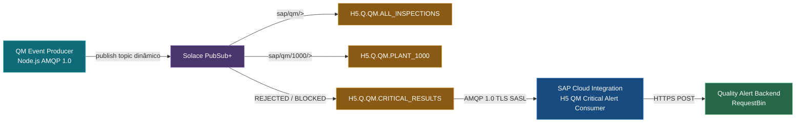

## 5.2 Arquitetura detalhada do roteamento

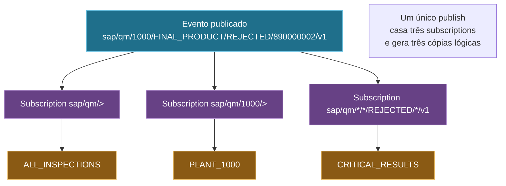

## 5.3 Pipeline do consumidor crítico

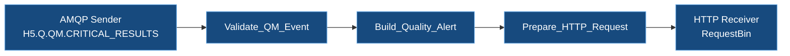

---

# 6. Preparação do broker

## 6.1 As três queues de roteamento

Todas as queues foram criadas como Durable e Exclusive, com quota de 100 MB. No H5 não se usa Non-Exclusive porque o objetivo não é load balancing, e sim roteamento para queues independentes.

| Queue | Propósito |
|---|---|
| `H5.Q.QM.ALL_INSPECTIONS` | Repositório corporativo de todos os eventos de qualidade |
| `H5.Q.QM.PLANT_1000` | Visão específica de uma planta |
| `H5.Q.QM.CRITICAL_RESULTS` | Exceções críticas (reprovado ou bloqueado) |

### Evidência 01 — Três queues de roteamento QM

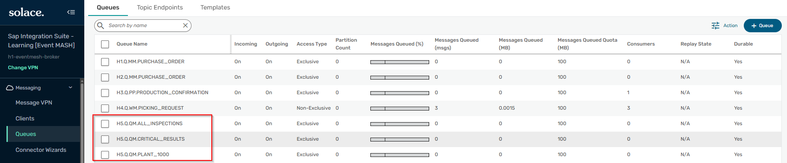

**O que esta evidência comprova:** criação das três queues Durable e Exclusive dedicadas a propósitos de roteamento distintos, servindo de base para o fan-out.

## 6.2 Subscriptions com wildcards

Cada queue expressa seu interesse por meio de subscriptions.

| Queue | Subscription(s) |
|---|---|
| `ALL_INSPECTIONS` | `sap/qm/>` |
| `PLANT_1000` | `sap/qm/1000/>` |
| `CRITICAL_RESULTS` | `sap/qm/*/*/REJECTED/*/v1` e `sap/qm/*/*/BLOCKED/*/v1` |

### Evidência 02 — Subscription corporativa

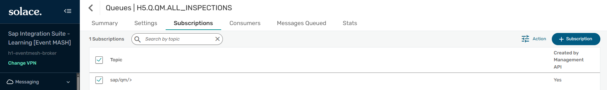

**O que esta evidência comprova:** a queue corporativa usa `sap/qm/>` para atrair todos os eventos de qualidade, independentemente de planta, tipo ou resultado.

### Evidência 03 — Subscription de planta

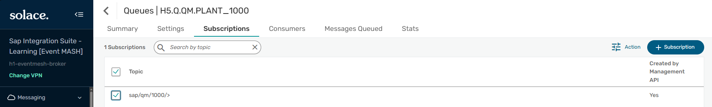

**O que esta evidência comprova:** a queue de planta usa `sap/qm/1000/>` para atrair apenas eventos da planta 1000.

### Evidência 04 — Subscriptions críticas

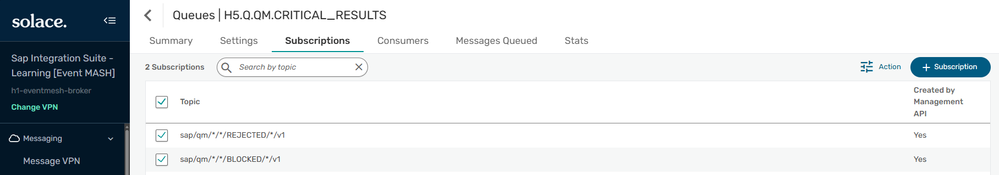

**O que esta evidência comprova:** a queue crítica combina duas subscriptions com wildcard de nível único, exigindo que o resultado seja REJECTED ou BLOCKED, ignorando planta e tipo de inspeção.

---

# 7. Produção de eventos e prova do fan-out

## 7.1 Produtor Node.js com topic dinâmico

Um QM Simulator em Node.js (biblioteca `rhea`, AMQP 1.0) publicou uma matriz controlada de oito eventos, cada um com um topic dinâmico correspondente à planta, tipo e resultado. A publicação usa o prefixo `topic://`, obrigatório para que o Solace trate o destino como topic e aplique o roteamento por subscription.

Matriz publicada:

| Evento | Planta | Tipo | Resultado |
|---|---|---|---|
| 001 | 1000 | RAW_MATERIAL | APPROVED |
| 002 | 1000 | FINAL_PRODUCT | REJECTED |
| 003 | 1000 | IN_PROCESS | BLOCKED |
| 004 | 1000 | FINAL_PRODUCT | APPROVED |
| 005 | 2000 | RAW_MATERIAL | APPROVED |
| 006 | 2000 | FINAL_PRODUCT | REJECTED |
| 007 | 2000 | IN_PROCESS | BLOCKED |
| 008 | 2000 | FINAL_PRODUCT | APPROVED |

Contrato de evento (SAP QM-like):

```json
{
  "specversion": "1.0",
  "type": "QualityInspectionResultChanged",
  "source": "SAP_QM_SIMULATOR",
  "id": "EVT-H5-000002",
  "time": "2026-08-27T12:00:00Z",
  "domain": "SAP_QM",
  "correlationId": "CORR-H5-000002",
  "data": {
    "WERKS": "1000",
    "PRUEFLOS": "890000002",
    "MATNR": "MAT-QM-0002",
    "ART": "01",
    "inspectionType": "FINAL_PRODUCT",
    "result": "REJECTED",
    "qualityScore": 62,
    "defectCount": 4,
    "createdBy": "QM.EVENT.PRODUCER"
  }
}
```

> **Nota de precisão técnica:** os campos `WERKS`, `PRUEFLOS`, `MATNR` e `ART` seguem a nomenclatura técnica SAP QM para fins de estudo. É um contrato custom, não o request oficial de uma API S/4HANA de Quality Management.

## 7.2 Fan-out comprovado

Com as três subscriptions ativas antes da publicação, os oito eventos produziram a seguinte distribuição:

| Queue | Subscription | Mensagens |
|---|---|---:|
| `H5.Q.QM.ALL_INSPECTIONS` | `sap/qm/>` | 8 |
| `H5.Q.QM.PLANT_1000` | `sap/qm/1000/>` | 4 |
| `H5.Q.QM.CRITICAL_RESULTS` | REJECTED + BLOCKED | 4 |

```text
8 eventos publicados
        ↓
16 mensagens armazenadas (8 + 4 + 4)
```

### Evidência 05 — Fan-out 8/4/4

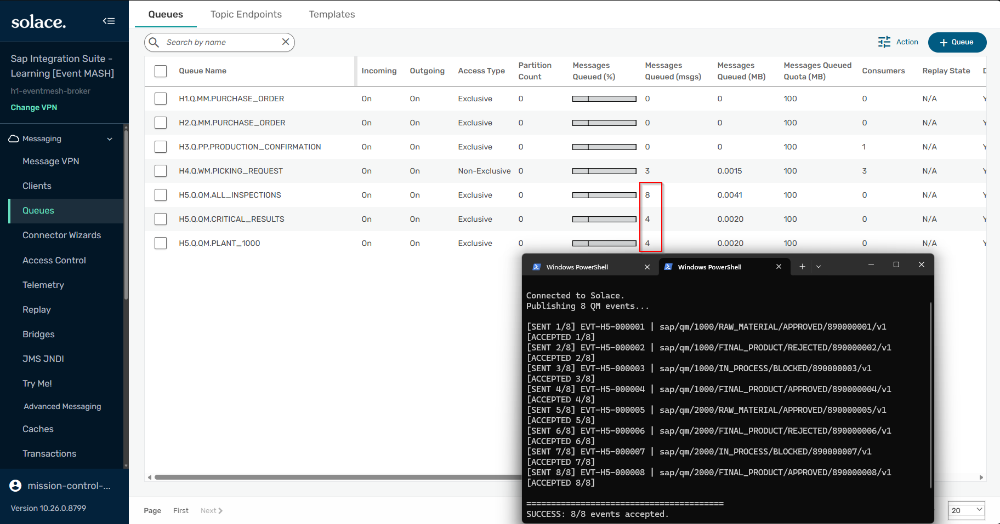

**O que esta evidência comprova:** o produtor publicou oito eventos uma única vez (`SUCCESS: 8/8`), e o broker gerou dezesseis cópias lógicas distribuídas pelas três queues conforme as subscriptions. É a prova quantitativa do fan-out por topic.

---

# 8. Roteamento seletivo e testes negativos

Para provar que o filtro ocorre no broker, e não em um roteador do CPI, foram publicados dois eventos de teste negativo.

| Teste | Topic | Expectativa |
|---|---|---|
| A | `sap/qm/2000/FINAL_PRODUCT/APPROVED/890000020/v1` | Só a queue corporativa recebe |
| B | `sap/mm/1000/purchaseOrder/created/7800000099/v1` | Nenhuma queue H5 recebe |

Resultado observado após os testes:

| Queue | Antes | Depois | Explicação |
|---|---:|---:|---|
| `ALL_INSPECTIONS` | 8 | 9 | Teste A é QM e casa `sap/qm/>`; Teste B é MM e não casa |
| `PLANT_1000` | 4 | 4 | Teste A é planta 2000; Teste B é MM |
| `CRITICAL_RESULTS` | 4 | 4 | Teste A é APPROVED; Teste B é MM |

O evento MM foi aceito pelo broker no ato da publicação, mas não entrou em nenhuma queue H5, porque nenhuma subscription de qualidade casa com o topic de outro domínio.

### Evidência 06 — Roteamento seletivo com testes negativos

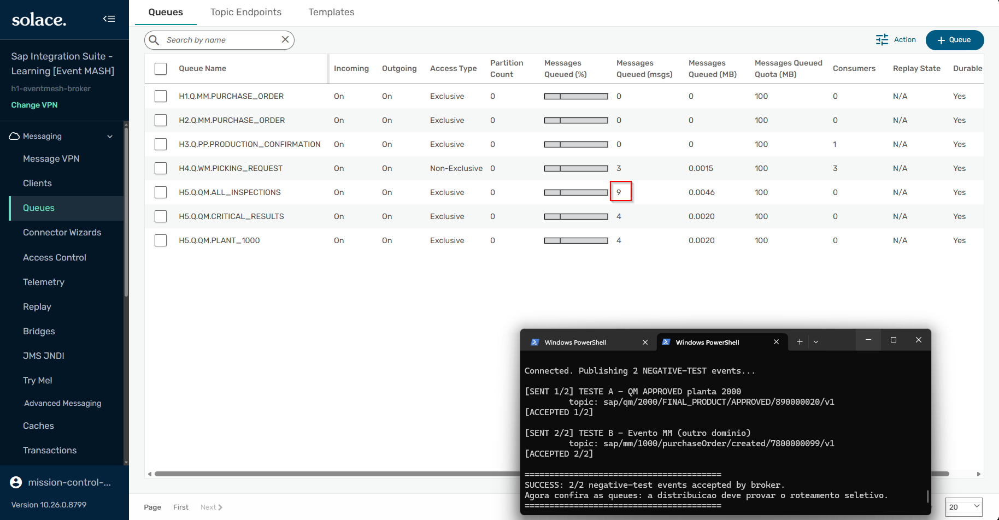

**O que esta evidência comprova:** o evento aprovado da planta 2000 incrementou somente a queue corporativa (de 8 para 9), sem tocar a queue de planta 1000 nem a crítica; e o evento de outro domínio não foi roteado para nenhuma queue H5. O filtro é feito pelo broker via subscription.

> **Aceito não é entregue:** o `ACCEPTED` do broker apenas confirma que a publicação foi válida. A entrega a uma queue depende exclusivamente de uma subscription que case com o topic.

---

# 9. Consumidor crítico no SAP Cloud Integration

Depois de comprovar o roteamento, o SAP Cloud Integration foi conectado apenas à queue crítica, atuando como um sistema de alertas de qualidade.

## 9.1 Backend de alertas

Um endpoint dedicado foi criado para receber os alertas do H5.

### Evidência 07 — Backend de alertas pronto

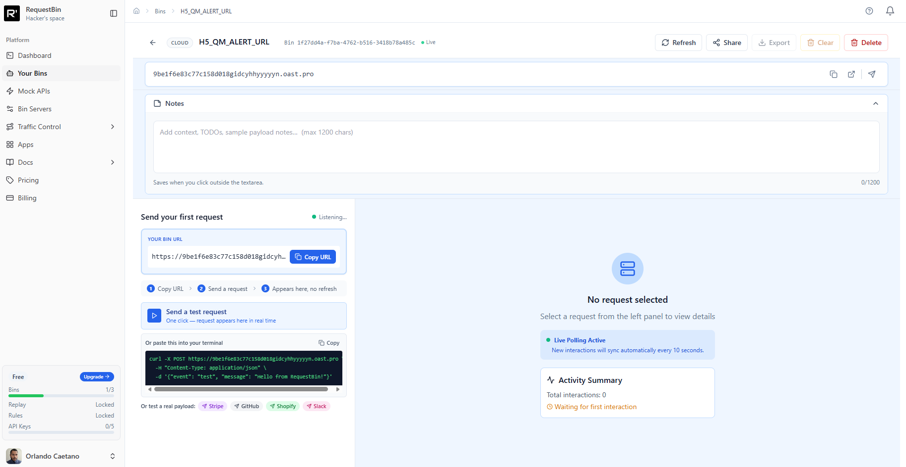

**O que esta evidência comprova:** endpoint externo dedicado, ativo e zerado, aguardando os alertas de qualidade que o CPI vai despachar.

## 9.2 AMQP Sender — Connection

| Parâmetro | Valor |
|---|---|
| Transport | TCP |
| Message Protocol | AMQP 1.0 |
| Host | `mr-connection-uovq1o9wcqd.messaging.solace.cloud` |
| Port | `5671` |
| Proxy | Internet |
| Authentication | SASL |
| Credential Name | `SOLACE_AMQP_CREDENTIALS` |
| Connect with TLS | Enabled |

### Evidência 08 — AMQP Connection do consumidor crítico

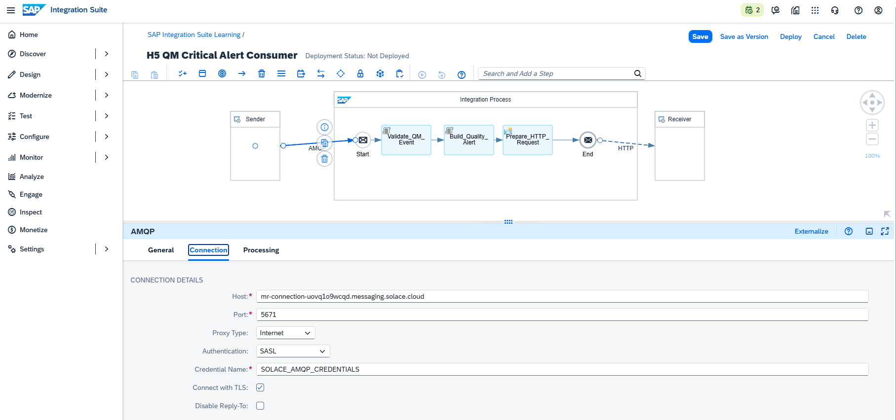

**O que esta evidência comprova:** sessão AMQP 1.0 segura entre o SAP Cloud Integration e o Solace, com TLS, SASL e credencial compartilhada.

## 9.3 AMQP Sender — Processing

| Parâmetro | Valor |
|---|---|
| Queue Name | `H5.Q.QM.CRITICAL_RESULTS` |
| Number of Concurrent Processes | 1 |
| Max. Number of Prefetched Messages | 1 |
| Max. Number of Retries | 3 |
| Delivery Status After Max. Retries | REJECTED |

### Evidência 09 — AMQP Processing (só a queue crítica)

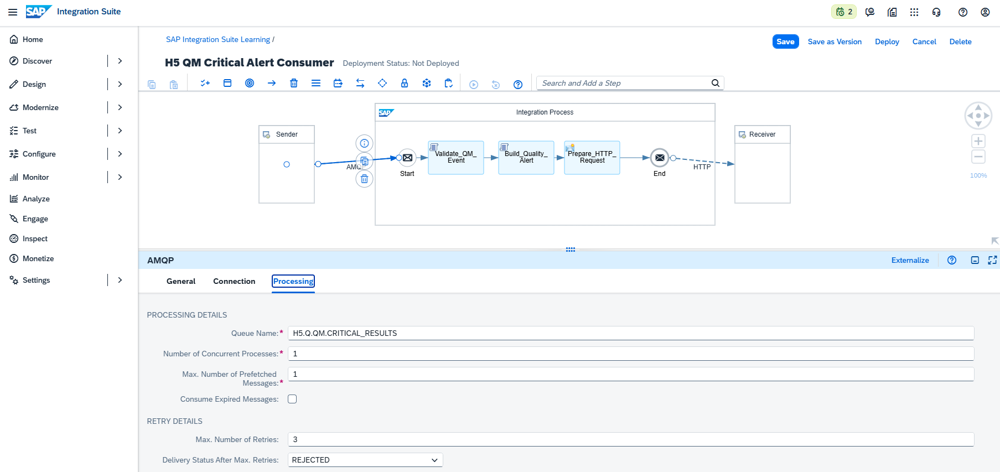

**O que esta evidência comprova:** o consumidor lê exclusivamente a `H5.Q.QM.CRITICAL_RESULTS`. Ele nunca vê eventos aprovados, porque o broker já os filtrou. O CPI não possui roteador decidindo criticidade.

## 9.4 Validação e transformação

O iFlow valida o envelope e os campos QM, recusando qualquer evento não crítico que porventura chegasse (uma proteção defensiva que também prova a subscription correta), e transforma o evento em alerta.

### 9.4.1 Groovy — Validate_QM_Event

```groovy
import com.sap.gateway.ip.core.customdev.util.Message
import groovy.json.JsonSlurper

def Message processData(Message message) {
    String body = message.getBody(String)

    if (!body?.trim()) {
        throw new IllegalArgumentException("QM event payload is empty.")
    }

    def event = new JsonSlurper().parseText(body)

    List<String> mandatoryFields = [
        "specversion", "type", "source", "id",
        "time", "domain", "correlationId", "data"
    ]

    mandatoryFields.each { String field ->
        if (event[field] == null || event[field].toString().trim().isEmpty()) {
            throw new IllegalArgumentException("Mandatory event field '${field}' is missing.")
        }
    }

    if (event.type != "QualityInspectionResultChanged") {
        throw new IllegalArgumentException("Unsupported event type '${event.type}'.")
    }

    if (event.domain != "SAP_QM") {
        throw new IllegalArgumentException("Unsupported event domain '${event.domain}'.")
    }

    def data = event.data
    String result = data.result?.toString()

    if (!(result in ["REJECTED", "BLOCKED"])) {
        throw new IllegalArgumentException(
            "Non-critical result '${result}' reached the critical consumer. Check topic subscriptions."
        )
    }

    message.setProperty("eventId", event.id.toString())
    message.setProperty("correlationId", event.correlationId.toString())
    message.setProperty("result", result)
    message.setProperty("plant", data.WERKS.toString())

    message.setHeader("X-Event-ID", event.id.toString())
    message.setHeader("X-Correlation-ID", event.correlationId.toString())

    return message
}
```

### 9.4.2 Groovy — Build_Quality_Alert

```groovy
import com.sap.gateway.ip.core.customdev.util.Message
import groovy.json.JsonOutput
import groovy.json.JsonSlurper
import java.time.OffsetDateTime
import java.time.ZoneOffset

def Message processData(Message message) {
    String body = message.getBody(String)
    def event = new JsonSlurper().parseText(body)
    def data = event.data

    String severity = (data.result?.toString() == "BLOCKED") ? "HIGH" : "MEDIUM"

    def alert = [
        alertType: "QUALITY_CRITICAL_RESULT",
        severity: severity,
        raisedBy: "SAP_INTEGRATION_SUITE",
        raisedAt: OffsetDateTime.now(ZoneOffset.UTC).toString(),
        event: [
            eventId: event.id,
            correlationId: event.correlationId,
            eventType: event.type,
            source: event.source,
            domain: event.domain
        ],
        inspection: [
            plant: data.WERKS,
            inspectionLot: data.PRUEFLOS,
            material: data.MATNR,
            inspectionType: data.inspectionType,
            result: data.result,
            qualityScore: data.qualityScore,
            defectCount: data.defectCount
        ],
        recommendedAction: (data.result?.toString() == "BLOCKED")
            ? "Immediate stock block and supplier notification"
            : "Open quality notification and review inspection lot"
    ]

    message.setBody(JsonOutput.prettyPrint(JsonOutput.toJson(alert)))
    message.setHeader("Content-Type", "application/json")
    message.setHeader("X-Event-ID", event.id.toString())
    message.setHeader("X-Correlation-ID", event.correlationId.toString())
    message.setHeader("X-Alert-Severity", severity)

    return message
}
```

### 9.4.3 Content Modifier — Prepare_HTTP_Request

| Action | Name | Source Type | Source Value |
|---|---|---|---|
| Create | `Content-Type` | Constant | `application/json` |
| Create | `Accept` | Constant | `application/json` |
| Create | `X-Event-ID` | Property | `eventId` |
| Create | `X-Correlation-ID` | Property | `correlationId` |

---

# 10. Execução: backlog crítico consumido

## 10.1 Estado inicial da queue crítica

Antes do Deploy, a queue crítica já continha quatro mensagens (dois REJECTED e dois BLOCKED), acumuladas durante os testes de roteamento.

### Evidência 12 — Quatro eventos críticos antes do consumidor

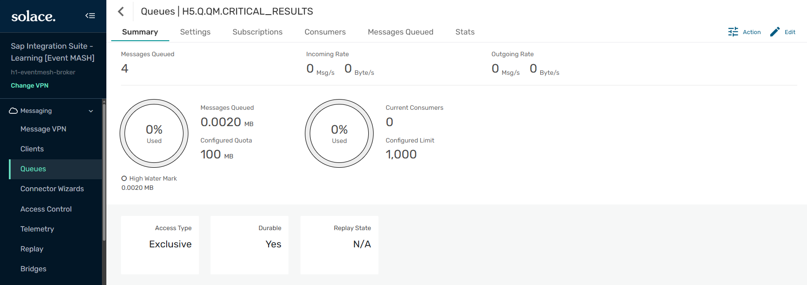

**O que esta evidência comprova:** `Messages Queued = 4`, `Current Consumers = 0`, queue Exclusive e Durable. É o backlog crítico aguardando o consumidor.

## 10.2 Consumidor implantado

### Evidência 13 — Consumidor crítico iniciado

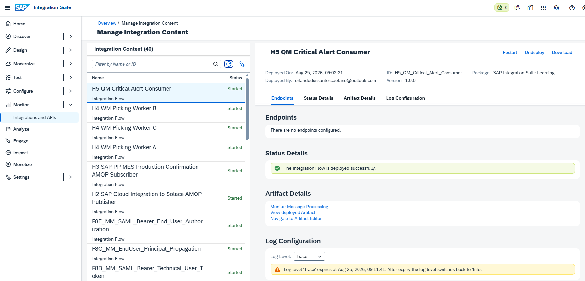

**O que esta evidência comprova:** o iFlow `H5_QM_Critical_Alert_Consumer` foi implantado com sucesso e está `Started`.

## 10.3 Quatro alertas processados

### Evidência 14 — Quatro alertas concluídos

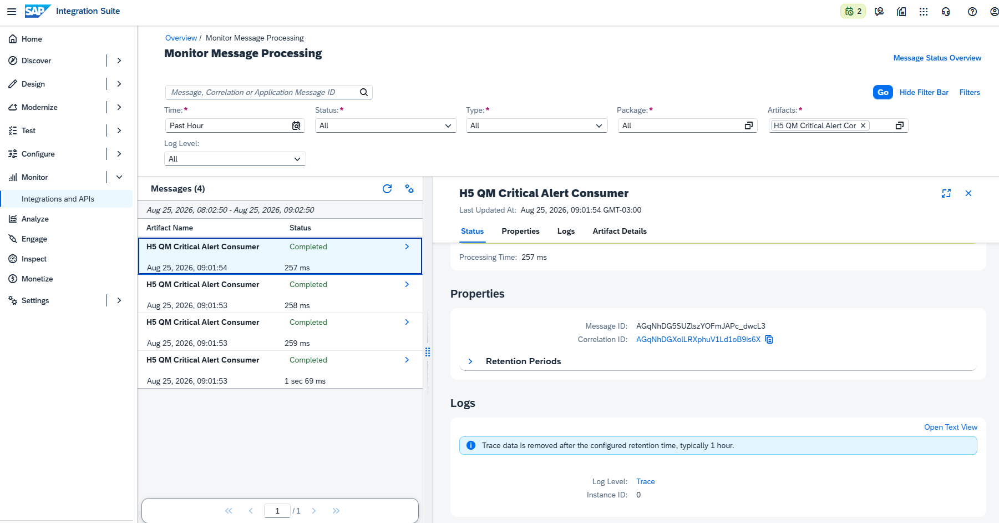

**O que esta evidência comprova:** o Monitor apresenta quatro mensagens `Completed`, uma por evento crítico consumido da queue.

### Evidência 15 — Fluxo completo do consumidor

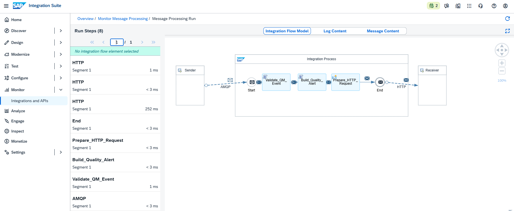

**O que esta evidência comprova:** execução completa AMQP → validação → construção do alerta → preparação HTTP → entrega, concluída com sucesso.

## 10.4 Queue drenada

### Evidência 16 — Queue crítica drenada com consumer ativo

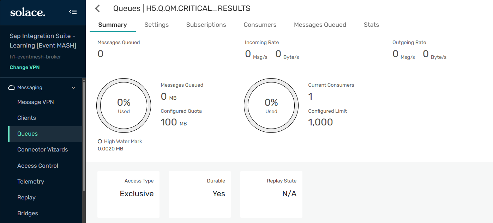

**O que esta evidência comprova:** após o consumo, a queue voltou a `Messages Queued = 0` e mantém um consumidor ativo, pronto para novos eventos críticos.

### Evidência 17 — Consumer flow AMQP ativo

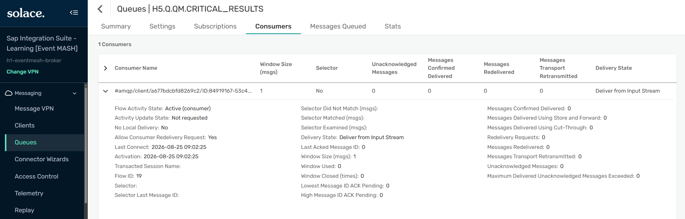

**O que esta evidência comprova:** o broker lista um consumer flow AMQP `Active` vinculado à queue crítica. Os contadores exibidos refletem o estado do flow no instante observado; a prova do consumo se faz por triangulação com o Monitor e o backend.

---

# 11. Transformação e classificação de severidade

O CPI não atua como proxy: ele interpreta o resultado da inspeção e classifica a severidade do alerta.

## 11.1 Alerta HIGH (BLOCKED)

### Evidência 18 — Payload BLOCKED classificado como HIGH

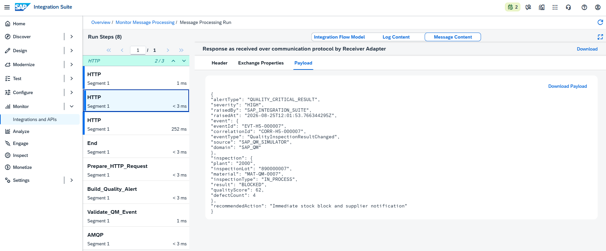

**O que esta evidência comprova:** o evento `EVT-H5-000007` (result BLOCKED, planta 2000) foi transformado em alerta com `severity = HIGH` e ação recomendada de bloqueio imediato de estoque. Confirma a regra BLOCKED → HIGH.

## 11.2 Alerta MEDIUM (REJECTED)

### Evidência 19 — Payload REJECTED classificado como MEDIUM

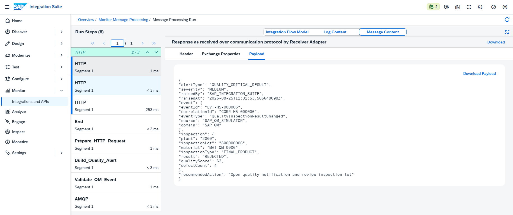

**O que esta evidência comprova:** o evento `EVT-H5-000006` (result REJECTED, planta 2000) foi transformado em alerta com `severity = MEDIUM` e ação de abrir notificação de qualidade. Confirma a regra REJECTED → MEDIUM.

## 11.3 Alertas recebidos no backend

### Evidência 20 — Alerta HIGH recebido no backend

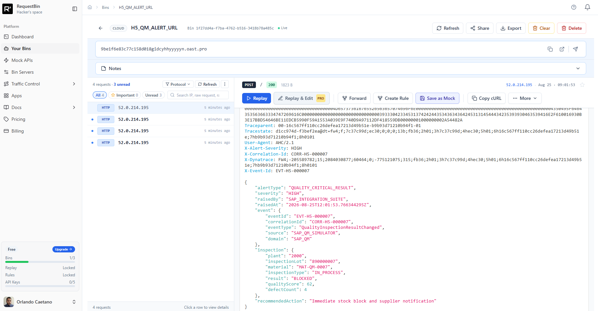

**O que esta evidência comprova:** o backend recebeu o alerta com `HTTP 200`, header `X-Alert-Severity: HIGH`, `X-Correlation-Id: CORR-H5-000007`, `X-Event-Id: EVT-H5-000007` e o body completo do alerta de bloqueio.

### Evidência 21 — Alerta MEDIUM recebido no backend

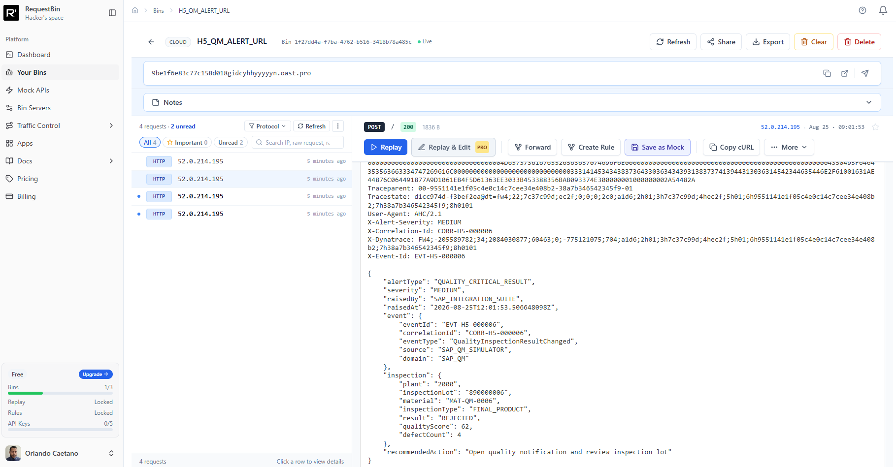

**O que esta evidência comprova:** o backend recebeu o alerta com `HTTP 200`, header `X-Alert-Severity: MEDIUM`, `X-Correlation-Id: CORR-H5-000006`, `X-Event-Id: EVT-H5-000006` e o body do alerta de reprovação. Comprova rastreabilidade e classificação de ponta a ponta.

---

# 12. Storytelling técnico consolidado

O H5 começou com uma pergunta de arquitetura: como fazer com que um mesmo fato de qualidade sirva a públicos diferentes, sem que o produtor precise conhecê-los?

A resposta foi construída em duas fases. Na primeira, o foco esteve inteiramente no broker. Três queues foram criadas com propósitos distintos e assinaram o mesmo domínio de eventos com granularidades diferentes: a corporativa capturando tudo com `sap/qm/>`, a de planta filtrando com `sap/qm/1000/>` e a crítica exigindo resultado REJECTED ou BLOCKED por meio de wildcards de nível único. Um produtor Node.js publicou oito eventos, cada um em seu topic dinâmico. O resultado foi inequívoco: oito publicações geraram dezesseis mensagens armazenadas. O produtor publicou o fato uma única vez, e o broker decidiu, apenas pelo topic, quais aplicações interessadas deveriam receber cópia.

Os testes negativos reforçaram a prova. Um evento aprovado da planta 2000 tocou somente a queue corporativa, e um evento de outro domínio não entrou em nenhuma queue de qualidade, embora tenha sido aceito pelo broker. Isso demonstrou que a seleção acontece no broker, não em um roteador do integration flow.

Na segunda fase, o SAP Cloud Integration assumiu um papel especializado. Em vez de ler todos os eventos e decidir o que fazer, o consumidor assinou exclusivamente a queue crítica. Ele foi acordado apenas quando havia um problema real. Ao implantar o iFlow, quatro alertas foram gerados a partir do backlog crítico. O consumidor validou cada evento, aplicou uma regra de negócio e classificou a severidade: bloqueios viraram alertas HIGH com recomendação de bloqueio imediato de estoque, e reprovações viraram alertas MEDIUM com recomendação de abertura de notificação de qualidade. Cada alerta chegou ao backend externo com Event ID, Correlation ID e severidade preservados.

O aprendizado central do H5 é que a taxonomia de topics é uma ferramenta de arquitetura, não apenas um nome. Uma hierarquia bem desenhada permite que produtores e consumidores evoluam de forma independente, que o roteamento seja declarativo e escalável, e que sistemas de exceção, como um serviço de alertas de qualidade, consumam apenas o que realmente importa.

---

# 13. Matriz de validação técnica

| Validação | Resultado |
|---|---|
| Três queues de roteamento criadas | ✅ |
| Subscription `sap/qm/>` | ✅ |
| Subscription `sap/qm/1000/>` | ✅ |
| Subscriptions REJECTED e BLOCKED | ✅ |
| Producer Node.js AMQP 1.0 | ✅ |
| Topic dinâmico com prefixo topic:// | ✅ |
| Fan-out 8 → 16 comprovado | ✅ |
| Roteamento seletivo por planta | ✅ |
| Roteamento seletivo por resultado | ✅ |
| Teste negativo de domínio (MM) | ✅ |
| Consumidor crítico exclusivo da queue crítica | ✅ |
| AMQP TLS + SASL | ✅ |
| Validação defensiva de evento | ✅ |
| Transformação em alerta | ✅ |
| BLOCKED → HIGH | ✅ |
| REJECTED → MEDIUM | ✅ |
| Event ID e Correlation ID preservados | ✅ |
| Quatro alertas entregues ao backend | ✅ |
| Queue crítica drenada | ✅ |

---

# 14. Troubleshooting e aprendizados

## 14.1 Publicação em topic exige o prefixo topic://

No primeiro teste, as mensagens foram rejeitadas pelo broker porque o endereço de destino estava sem o prefixo `topic://`, e o Solace o interpretou como uma durable queue inexistente. Corrigido para `topic://sap/qm/...`, o broker passou a rotear por subscription. Aprendizado: em publicação AMQP non-JMS, o destino deve ser qualificado explicitamente como topic.

## 14.2 Um envio por sender

Uma versão inicial do publisher disparava o mesmo evento mais de uma vez ao reutilizar o handler de envio, provocando rejeição. A correção usou uma trava de envio único por sender, garantindo exatamente uma publicação por evento.

## 14.3 Subscription só atrai eventos publicados depois dela

A segunda subscription crítica (BLOCKED) foi adicionada após a primeira publicação, o que fez a queue crítica receber inicialmente apenas os reprovados. Aprendizado: subscriptions não são retroativas; para uma matriz limpa, configuram-se todas as subscriptions antes de publicar.

## 14.4 Aceito pelo broker não é entregue à queue

O evento de outro domínio foi aceito no ato do publish, mas não entrou em nenhuma queue de qualidade. O `ACCEPTED` confirma a validade da publicação, não a entrega. A entrega depende de uma subscription que case com o topic.

---

# 15. Boas práticas aplicadas

1. Taxonomia de topics hierárquica, com domínio, módulo, planta, tipo, resultado, lote e versão.
2. Versionamento do contrato de evento no próprio topic (`/v1`).
3. Queues com propósito único de roteamento, em vez de uma fila genérica.
4. Wildcards `>` e `*` usados conforme a granularidade desejada.
5. Consumo especializado: o CPI assina apenas a queue crítica.
6. Validação defensiva no consumer, recusando eventos fora do contrato.
7. Transformação do evento em alerta operacional acionável.
8. Classificação de severidade orientada ao resultado da inspeção.
9. Rastreabilidade por Event ID e Correlation ID em properties e headers.
10. Publicação Persistent para não perder eventos críticos.
11. Credenciais mantidas no Security Material, fora do iFlow.
12. Observabilidade multi-plataforma: broker, CPI e backend.

---

# 16. Recomendações para produção

- formalizar a taxonomia de topics como padrão corporativo, com governança;
- adotar Event Portal para catalogar topics, contratos e ownership;
- versionar contratos e planejar compatibilidade retroativa;
- avaliar durable queues por consumidor crítico com Dead Message Queue;
- monitorar backlog e idade da mensagem mais antiga por queue;
- aplicar ACLs de publish/subscribe por namespace de topic;
- implementar idempotência e deduplicação nos consumidores;
- integrar o alerta a um sistema real de notificação e workflow de qualidade;
- distribuir tracing por Correlation ID de ponta a ponta;
- dimensionar concorrência e prefetch conforme volumetria;
- proteger o transporte com TLS e autenticação forte;
- separar recursos entre ambientes.

---

# 17. Recursos praticados

| Área | Recurso |
|---|---|
| EDA | Publish/Subscribe fan-out |
| Broker | Solace PubSub+ Cloud |
| Roteamento | Topic hierarchy + wildcards `>` e `*` |
| Reliability | Persistent / Guaranteed Messaging |
| Producer | Node.js + rhea (AMQP 1.0) |
| Consumidor | SAP Cloud Integration |
| Protocolo | AMQP 1.0 |
| Adapter | AMQP Sender |
| Transporte | TCP + TLS |
| Autenticação | SASL |
| Secret handling | Security Material |
| Validação | Envelope + campos SAP QM |
| Transformação | Alerta operacional classificado |
| Correlação | Event ID + Correlation ID |
| Backend | HTTP externo |
| Domínio | SAP QM / Quality Inspection |
| Observabilidade | CPI MPL + Solace Broker Manager + backend |

---

# 18. Próximo cenário — H6

## H6 — Dead Letter Queue, Retry e Replay

Com fundamentos, publicação, consumo, escala e roteamento cobertos, o próximo passo natural é a resiliência avançada do event mesh. H6 explorará o que acontece quando o processamento falha de forma persistente: Dead Letter Queue para isolar poison messages, política de retry no consumidor e Replay para reprocessar histórico. O cenário reutilizará um destino instável (por exemplo, um ERP mock que retorna erro controlado) para exercitar redelivery, DLQ e recuperação.

---

# 19. Navegação

**Cenário anterior:** [H4 — Competing Consumers e Escala Horizontal](./35-h4-solace-competing-consumers-scaling.md)

**Próximo cenário:** [H6 — Dead Letter Queue, Retry e Replay](./37-h6-solace-dead-letter-retry-replay.md)

---

# 20. Referências oficiais

## SAP

- [Configure the AMQP Sender Adapter](https://help.sap.com/docs/cloud-integration/sap-cloud-integration/configure-amqp-sender-adapter)
- [AMQP Adapter](https://help.sap.com/docs/cloud-integration/sap-cloud-integration/amqp-adapter)
- [Discovering Event-Driven Integration with SAP Integration Suite, advanced event mesh](https://learning.sap.com/courses/discovering-event-driven-integration-with-sap-integration-suite-advanved-event-mesh)

## Solace

- [Understanding Topics](https://docs.solace.com/Messaging/Guaranteed-Msg/Topics.htm)
- [Wildcard Characters in Topic Subscriptions](https://docs.solace.com/Messaging/Wildcard-Charaters-Topic-Subs.htm)
- [Queues and Topic-to-Queue Mapping](https://docs.solace.com/Messaging/Guaranteed-Msg/Queues.htm)
- [Message Publication (AMQP destinations)](https://docs.solace.com/API/AMQP/Msg-Pub.htm)

---

# 21. Ferramentas utilizadas

- SAP Integration Suite — Cloud Integration
- Solace PubSub+ Cloud
- Solace Broker Manager
- AMQP 1.0
- Node.js + rhea (QM Simulator)
- RequestBin
- PowerShell
- Git / GitHub

---

## 👤 Autor / 📇 Contato

[](https://www.linkedin.com/in/orlando-caetano/) [](https://github.com/OrlandoCaetano2026)

**Orlando Caetano**  
Especialista SAP • Integração • Inteligência Artificial  
Consultor SAP MM com know-how em PP, QM e WM


> 📌 Projeto de estudo e portfólio. Os cenários SAP MM, PP, QM, WM, MES e Event-Driven são simulações educativas para prática de arquitetura e integração.
