# H6 — Dead Message Queue, Retry, Recuperação Operacional e Message Replay com Solace e SAP Cloud Integration

> **Bloco H — Event-Driven Integration / Event Mesh**  
> **Documento 37**  
> **Objetivo:** demonstrar, em um cenário SAP MM de confirmação de fornecedor, o ciclo completo de resiliência orientada a eventos: entrega garantida, retry interno do SAP Cloud Integration, falha permanente, isolamento em Dead Message Queue, recuperação operacional, republicação controlada e reprodução histórica por Message Replay.

---

## 1. Perfil técnico do cenário

| Item | Implementação |
|---|---|
| Cenário | H6 — DMQ, Retry, Recovery e Message Replay |
| Domínio | SAP MM — Supplier Confirmation |
| Broker | Solace PubSub+ Cloud |
| Message VPN | `h1-eventmesh-broker` |
| Topic | `sap/mm/supplier/confirmation/received/v1` |
| Source queue | `H6.Q.MM.SUPPLIER_CONFIRMATION` |
| Dead Message Queue | `H6.DMQ.MM.SUPPLIER_CONFIRMATION` |
| Source queue type | Durable, Exclusive, não particionada |
| Maximum Redelivery Count | 5 |
| Client Delivery Count | Enabled |
| CPI consumer | `H6_MM_Supplier_Confirmation_Consumer` |
| Protocolo | AMQP 1.0 sobre TCP/TLS |
| Autenticação | SASL |
| Credential alias | `SOLACE_AMQP_CREDENTIALS` |
| CPI retries | 3 |
| Outcome final | `REJECTED` |
| Backend | Mockoon 9.8.0, exposto via ngrok |
| Producer | Node.js 24 + rhea |
| Replay Log | 100 MB, Incoming/Outgoing habilitados |
| Replay filter | `sap/mm/supplier/confirmation/received/v1` |
| Evidências | `evidences/lab35/` — 47 imagens |

---

## 2. Visão executiva

Os cenários H1 a H5 construíram os principais pilares do Event Mesh: fundação do broker, publicação, consumo, escala horizontal e roteamento seletivo. O H6 fecha a lacuna operacional mais importante: **o que acontece quando um evento garantido não consegue ser processado?**

O cenário simula confirmações de fornecedor SAP MM publicadas por um portal externo. Os eventos chegam ao Solace como mensagens Persistent e são armazenados em uma queue Durable. O SAP Cloud Integration consome essas mensagens por AMQP 1.0, valida o contrato e chama um ERP simulado no Mockoon.

Três comportamentos foram exercitados. No caminho feliz, o ERP retornou HTTP 200 e a mensagem foi reconhecida. Na falha temporária, o ERP respondeu `500 → 500 → 200`; o SAP Cloud Integration executou dois retries internos e concluiu sem redelivery broker-side. Na falha permanente, o ERP respondeu HTTP 500 em todas as chamadas. Depois de dez runs observados, a mensagem deixou a source queue e foi preservada na DMQ dedicada.

A recuperação foi conduzida de forma controlada. O backend voltou a responder HTTP 200, o mesmo evento lógico foi republicado, processado com sucesso e a mensagem original permaneceu na DMQ até a confirmação operacional. Por fim, um Replay Log filtrado para o topic H6 registrou um novo evento já reconhecido e permitiu que o broker o reproduzisse para a queue, demonstrando processamento histórico sem nova publicação do producer.

O H6 diferencia, na prática, quatro conceitos frequentemente confundidos:

```text
Retry interno do adapter
Redelivery do broker
Dead Message Queue
Message Replay
```

---

## 3. Objetivos de aprendizagem

- configurar uma DMQ dedicada para uma source queue;
- limitar redeliveries e habilitar Client Delivery Count;
- coordenar política de retry do CPI com comportamento da queue;
- diferenciar retry HTTP interno de redelivery broker-side;
- simular falha temporária determinística;
- produzir e isolar um poison message;
- investigar uma mensagem preservada na DMQ;
- documentar limitações e alternativas administrativas do Broker Manager;
- executar recuperação operacional sem perder rastreabilidade;
- configurar Replay Log com filtro de topic;
- iniciar Replay desde o início do log;
- observar desconexão e reconexão do consumer durante Replay;
- comprovar que o mesmo evento histórico foi processado novamente.

---

# 4. Fundamentos arquiteturais

## 4.1 Retry, redelivery, DMQ e Replay

Estes quatro conceitos aparecem juntos em discussões de resiliência e costumam ser confundidos. O H6 os separa com evidências concretas.

| Recurso | Responsabilidade | Onde atua | Evidência no H6 |
|---|---|---|---|
| Retry | repetir uma operação dentro do processamento atual | no consumidor (adapter) | duas chamadas HTTP 500 seguidas de 200 |
| Redelivery | broker entregar novamente uma mensagem não reconhecida | no broker | contador permaneceu 0 na falha temporária |
| DMQ | isolar mensagem removida da source queue após falha/rejeição | no broker | poison message preservado na DMQ |
| Replay | reproduzir mensagem histórica já reconhecida | no broker | evento 000004 processado duas vezes |

## 4.2 Retry interno não é redelivery

Na falha temporária, o Solace entregou o evento uma vez. O CPI manteve a entrega aberta e repetiu a chamada HTTP internamente:

```text
Solace entrega uma vez
        ↓
CPI Run 1 → HTTP 500
        ↓
CPI Run 2 → HTTP 500
        ↓
CPI Run 3 → HTTP 200
        ↓
CPI retorna ACCEPTED
```

Por isso:

```text
CPI Runs = 3
Mockoon Requests = 3
Messages Redelivered no Solace = 0
```

Essa distinção é decisiva em produção: dimensionar o `Maximum Redelivery Count` da queue pensando que ele conta os retries do adapter levaria a um comportamento muito diferente do esperado.

## 4.3 DMQ como área de isolamento

A DMQ não possui subscription. Ela recebe mensagens transferidas internamente pelo broker quando a mensagem deixa de ser elegível na source queue ou recebe um outcome final de rejeição. Seu papel é preservar — e não descartar — a mensagem defeituosa, para que ela possa ser investigada e recuperada.

## 4.4 Replay não substitui DMQ

A DMQ preserva mensagens que **falharam**. O Replay Log preserva mensagens Guaranteed, inclusive aquelas **já processadas e reconhecidas**, para reprodução histórica. São mecanismos complementares: um trata exceção, o outro trata recuperação de histórico.

---

# 5. Arquitetura

## 5.1 Arquitetura geral

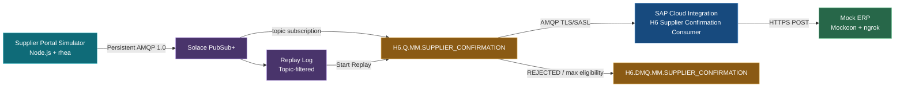
```mermaid
flowchart LR
    P[Supplier Portal Simulator\nNode.js + rhea] -->|Persistent AMQP 1.0| S[Solace PubSub+]
    S -->|topic subscription| Q[H6.Q.MM.SUPPLIER_CONFIRMATION]
    Q -->|AMQP TLS/SASL| CPI[SAP Cloud Integration\nH6 Supplier Confirmation Consumer]
    CPI -->|HTTPS POST| ERP[Mock ERP\nMockoon + ngrok]
    Q -->|REJECTED / max eligibility| D[H6.DMQ.MM.SUPPLIER_CONFIRMATION]
    S --> R[Replay Log\nTopic-filtered]
    R -->|Start Replay| Q

    classDef prod fill:#0f6b78,color:#fff,stroke:#58c7d1;
    classDef broker fill:#49346b,color:#fff,stroke:#a98bdc;
    classDef queue fill:#8a5a14,color:#fff,stroke:#e5b75f;
    classDef sap fill:#174a7e,color:#fff,stroke:#65a8e5;
    classDef backend fill:#276749,color:#fff,stroke:#77c99a;
    class P prod;
    class S,R broker;
    class Q,D queue;
    class CPI sap;
    class ERP backend;
```

## 5.2 Máquina de estados do laboratório

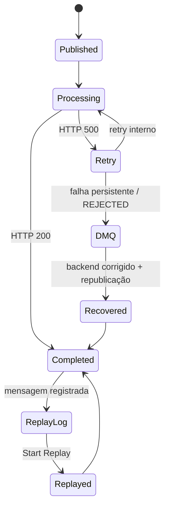
```mermaid
stateDiagram-v2
    [*] --> Published
    Published --> Processing
    Processing --> Completed: HTTP 200
    Processing --> Retry: HTTP 500
    Retry --> Processing: retry interno
    Retry --> DMQ: falha persistente / REJECTED
    DMQ --> Recovered: backend corrigido + republicação
    Recovered --> Completed
    Completed --> ReplayLog: mensagem registrada
    ReplayLog --> Replayed: Start Replay
    Replayed --> Completed
```

## 5.3 Pipeline do consumidor

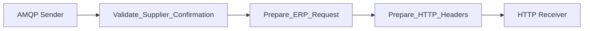
```mermaid
flowchart LR
    A[AMQP Sender] --> B[Validate_Supplier_Confirmation]
    B --> C[Prepare_ERP_Request]
    C --> D[Prepare_HTTP_Headers]
    D --> E[HTTP Receiver]
```

---

# 6. Configuração do broker

> Nesta seção construímos a espinha dorsal da resiliência: a DMQ dedicada, a source queue, a política de redelivery que as conecta e a subscription que alimenta a fila. Cada evidência traz o contexto da configuração, a captura e uma explicação detalhada do que ela garante no comportamento do cenário.


## Evidência 01 — DMQ dedicada

A primeira etapa da resiliência é ter para onde enviar as mensagens que não podem ser processadas. Por isso, antes mesmo da source queue, criamos a Dead Message Queue dedicada `H6.DMQ.MM.SUPPLIER_CONFIRMATION`, Durable e Exclusive, com quota de 100 MB. Ela nasce vazia e permanecerá vazia durante todo o caminho feliz e a falha temporária, só recebendo tráfego quando um poison message esgotar as tentativas.

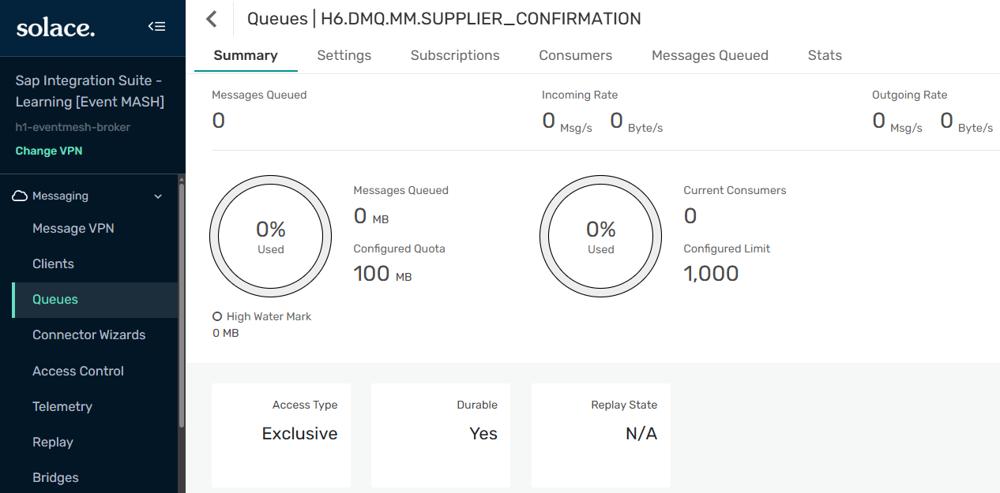

**O que esta evidência comprova:** a existência de uma área de isolamento operacional própria para esta integração, comprovada por `Messages Queued = 0`, `Current Consumers = 0`, `Access Type = Exclusive`, `Durable = Yes` e quota de 100 MB. Uma DMQ dedicada por endpoint é a base para investigar e recuperar mensagens sem contaminar outras filas, e é pré-requisito para que o broker consiga mover mensagens rejeitadas em vez de descartá-las silenciosamente.

## Evidência 02 — Source queue de confirmação

Com a DMQ pronta, criamos a source queue `H6.Q.MM.SUPPLIER_CONFIRMATION`, também Durable e Exclusive, com quota de 100 MB. É nela que os eventos de confirmação de fornecedor serão persistidos ao chegar do topic. Neste momento ela ainda não está associada à DMQ nem tem política de redelivery ajustada — isso será feito na configuração avançada, evidenciada a seguir.

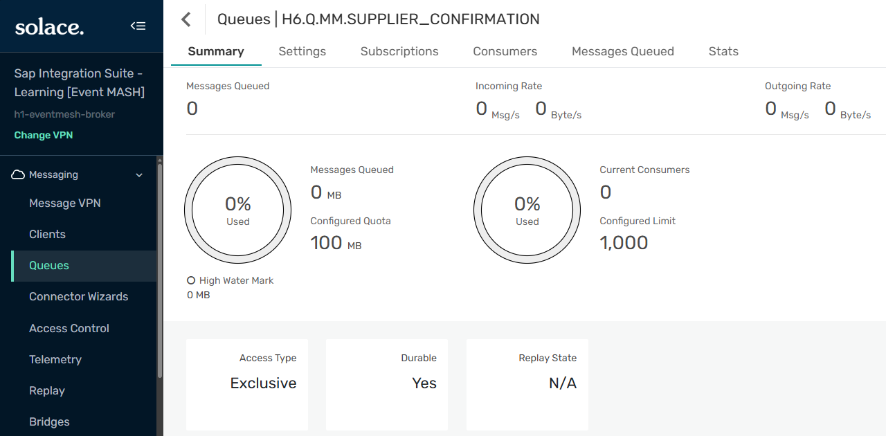

**O que esta evidência comprova:** o endpoint principal do cenário existe, é durável e está zerado, estabelecendo o baseline limpo antes de qualquer publicação. A escolha por `Exclusive` garante um único consumidor ativo e ordem preservada, o que é adequado para um fluxo transacional de confirmação em que não queremos concorrência, e sim tratamento confiável mensagem a mensagem.

## Evidência 03 — Associação da DMQ e política de redelivery

Esta é a configuração técnica central do H6. Nas configurações avançadas da source queue, apontamos o campo `Dead Message Queue Name` para `H6.DMQ.MM.SUPPLIER_CONFIRMATION`, mantivemos `Respect DMQ Eligible = Off` (para que mensagens removidas sejam encaminhadas à DMQ independentemente de flag do publisher), desligamos `Try Forever` e definimos `Maximum Redelivery Count = 5`. Também habilitamos `Enable Client Delivery Count` para observar as tentativas de entrega ao consumidor.

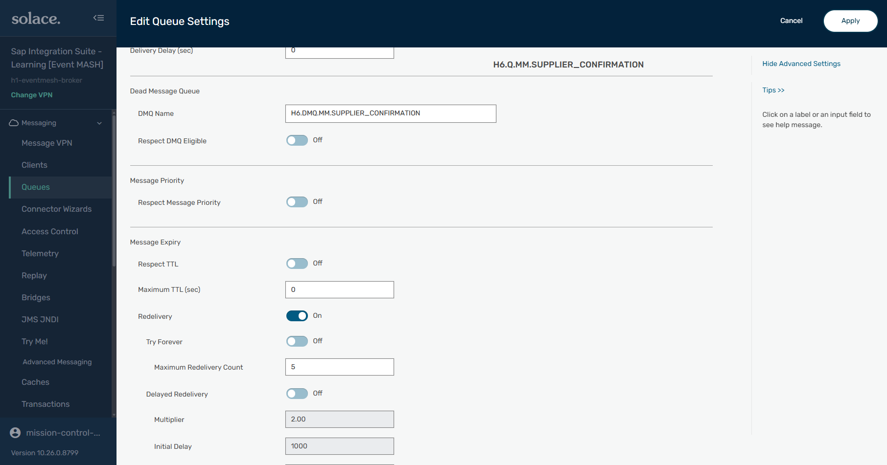

**O que esta evidência comprova:** o vínculo lógico `source queue → DMQ` está estabelecido, e a queue possui um limite finito de reentrega broker-side (`Try Forever = Off`, `Maximum Redelivery Count = 5`). Essa combinação é o que garante que um poison message eventualmente deixe de ser elegível na source queue e seja transferido para a DMQ, em vez de circular indefinidamente. É a diferença prática entre uma fila que trava com uma mensagem defeituosa e uma fila que se protege e continua operando.

## Evidência 04 — Topic subscription da source queue

Para que a source queue receba os eventos, associamos a ela a subscription do topic de negócio `sap/mm/supplier/confirmation/received/v1`. Assim, o produtor publica no topic sem conhecer a fila física, e o broker roteia cada confirmação para a queue por meio da subscription.

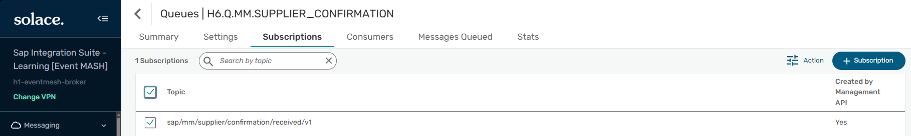

**O que esta evidência comprova:** o desacoplamento entre produtor e endpoint físico. Todo evento publicado no topic de confirmação de fornecedor é atraído para `H6.Q.MM.SUPPLIER_CONFIRMATION`. Esse é o ponto de entrada de toda a cadeia de resiliência: a partir daqui, qualquer falha de processamento será tratada pela política de redelivery e, em última instância, pela DMQ configurada na evidência anterior.

---

# 7. Mock ERP com três comportamentos

> Um laboratório de resiliência precisa de um backend previsível. Em vez de um sistema real, usamos um ERP simulado no Mockoon capaz de alternar, de forma controlada, entre sucesso, falha temporária e falha permanente. Isso permite reproduzir cada fase do H6 quantas vezes forem necessárias.

## Evidência 05 — Mock ERP com três comportamentos

Para exercitar retry, recuperação e poison message de forma determinística, o backend não pode ser aleatório. Configuramos no Mockoon uma única rota `POST /h6/erp/supplier-confirmation` com três respostas controláveis: `H6_SUCCESS_200` (processa com sucesso), `H6_TEMPORARY_FAILURE_500` (falha que permite retry) e `H6_PERMANENT_FAILURE_500` (falha não recuperável). Alternando qual delas é o default, controlamos exatamente qual comportamento o ERP simulado apresenta.

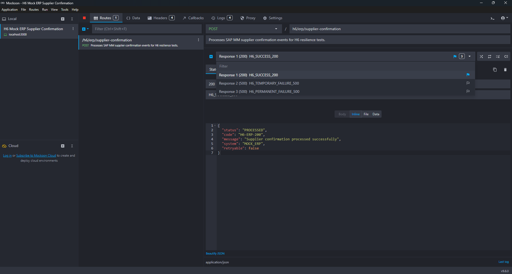

**O que esta evidência comprova:** temos um ERP simulado totalmente determinístico, com os três desfechos possíveis de uma integração real: sucesso, indisponibilidade temporária e falha permanente. Os campos `code` e `retryable` de cada resposta (`H6-ERP-200/false`, `H6-ERP-500-TEMP/true`, `H6-ERP-500-PERM/false`) documentam a intenção semântica de cada desfecho, permitindo reproduzir cada fase do laboratório de forma controlada e repetível. As validações locais e públicas (HTTP 200, 500 temporário e 500 permanente) confirmaram o comportamento antes de ligar o consumidor.

---

# 8. Configuração do consumidor CPI

> O consumidor é o `H6_MM_Supplier_Confirmation_Consumer`. Ele lê a source queue por AMQP, valida e transforma o evento em dois scripts Groovy, prepara os headers de rastreabilidade e chama o ERP. A seguir, cada aba de configuração é evidenciada com seu contexto e o papel que exerce na resiliência.

## Evidência 06 — AMQP Connection do consumidor

No SAP Cloud Integration, o consumidor `H6_MM_Supplier_Confirmation_Consumer` usa o AMQP Sender Adapter para ler a source queue. A aba Connection define host do broker, porta `5671`, `Proxy Type = Internet`, `Connect with TLS` habilitado e autenticação `SASL` com o credential alias compartilhado `SOLACE_AMQP_CREDENTIALS`, mantendo a senha fora do iFlow.

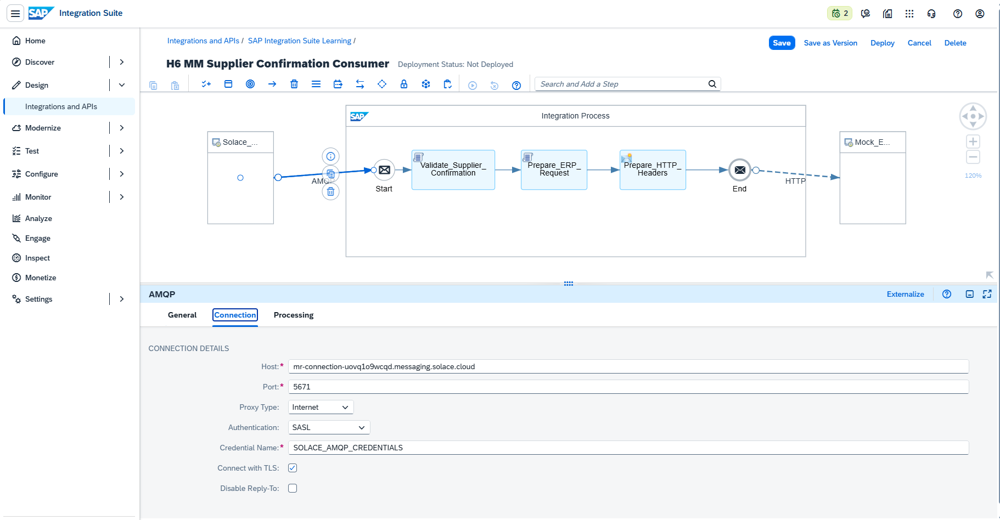

**O que esta evidência comprova:** o consumidor estabelece uma sessão AMQP 1.0 segura com o Solace, protegida por TLS e autenticada por SASL, reutilizando a credencial compartilhada do broker. Essa é a base de conectividade sobre a qual todo o comportamento de retry e redelivery será observado — sem uma conexão estável e segura, não seria possível distinguir falhas de rede de falhas de processamento nas fases seguintes.

## Evidência 07 — Processing com política de retry

A aba Processing do AMQP Sender é onde amarramos a política de tentativa do lado do adapter à política da queue. Configuramos `Queue Name = H6.Q.MM.SUPPLIER_CONFIRMATION`, `Number of Concurrent Processes = 1`, `Max. Number of Prefetched Messages = 1`, `Max. Number of Retries = 3` e `Delivery Status After Max. Retries = REJECTED`. Concorrência e prefetch mínimos deixam o comportamento observável mensagem a mensagem.

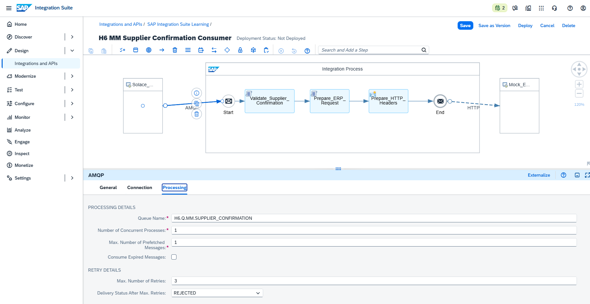

**O que esta evidência comprova:** o consumidor lê exclusivamente a source queue do H6 e, ao esgotar as tentativas, devolve ao broker o outcome `REJECTED` — que é justamente o gatilho para o broker remover a mensagem da queue e encaminhá-la à DMQ. A coordenação entre `Max. Number of Retries = 3` no adapter e `Maximum Redelivery Count = 5` na queue cria duas camadas de proteção complementares e evita reprocessamento infinito de uma mensagem defeituosa.

## Evidência 08 — Headers HTTP de rastreabilidade

Antes de chamar o ERP, o Content Modifier `Prepare_HTTP_Headers` monta os cabeçalhos que serão enviados: `Content-Type`, `Accept` e, principalmente, os headers de rastreabilidade `X-Event-ID`, `X-Correlation-ID` e `X-Processing-Mode`, todos alimentados por Exchange Properties preenchidas na validação.

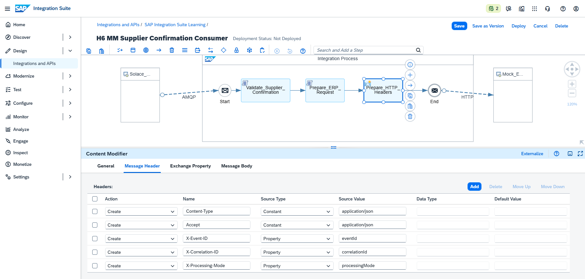

**O que esta evidência comprova:** a identidade do evento e a correlação distribuída não ficam apenas no corpo da mensagem — elas viajam também como metadados HTTP até o backend. Isso é o que permitirá, nas fases de falha e replay, confirmar visualmente no Mockoon que as várias tentativas e o evento reprocessado se referem exatamente ao mesmo evento lógico, e não a publicações diferentes.

## Evidência 09 — HTTP Receiver para o Mock ERP

O último passo do pipeline é o HTTP Receiver, que envia o request preparado ao endpoint público do Mock ERP exposto via ngrok. O adapter está configurado como `POST`, `Proxy Type = Internet`, `Authentication = None` e timeout de 60 segundos, encaminhando os headers de rastreabilidade definidos anteriormente.

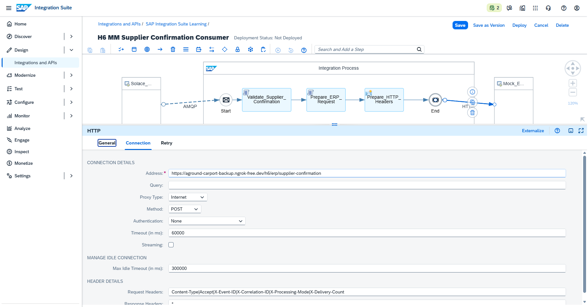

**O que esta evidência comprova:** o consumidor fecha a cadeia entregando a confirmação a um sistema externo real. É neste ponto que a resposta do ERP (200 ou 500) determina se o processamento é bem-sucedido ou entra em retry — ou seja, é o HTTP Receiver que transforma o comportamento do backend simulado nos diferentes desfechos de resiliência que o cenário demonstra.

## 8.1 Groovy — Validate_Supplier_Confirmation

O primeiro script protege o contrato do evento. Ele recusa payloads vazios, valida os campos obrigatórios do envelope e do bloco `data`, confirma `type`, `domain` e `specversion`, e restringe o `processingMode` aos três valores suportados. Além disso, promove Event ID, Correlation ID e Processing Mode a Exchange Properties e headers, garantindo rastreabilidade ao longo de todo o fluxo.

```groovy
import com.sap.gateway.ip.core.customdev.util.Message
import groovy.json.JsonSlurper

def Message processData(Message message) {
    String body = message.getBody(String)
    if (!body?.trim()) {
        throw new IllegalArgumentException("Supplier confirmation event payload is empty.")
    }
    def event = new JsonSlurper().parseText(body)
    ["specversion", "type", "source", "id", "time", "domain", "correlationId", "data"].each { String field ->
        if (event[field] == null || event[field].toString().trim().isEmpty()) {
            throw new IllegalArgumentException("Mandatory event field '${field}' is missing.")
        }
    }
    if (event.specversion != "1.0") {
        throw new IllegalArgumentException("Unsupported specversion '${event.specversion}'.")
    }
    if (event.type != "SupplierConfirmationReceived") {
        throw new IllegalArgumentException("Unsupported event type '${event.type}'.")
    }
    if (event.domain != "SAP_MM") {
        throw new IllegalArgumentException("Unsupported event domain '${event.domain}'.")
    }
    def data = event.data
    ["EBELN", "EBELP", "LIFNR", "MATNR", "WERKS", "MENGE", "MEINS", "confirmationType", "confirmedDeliveryDate", "processingMode"].each { String field ->
        if (data[field] == null || data[field].toString().trim().isEmpty()) {
            throw new IllegalArgumentException("Mandatory supplier confirmation field '${field}' is missing.")
        }
    }
    String processingMode = data.processingMode.toString()
    if (!(processingMode in ["SUCCESS", "TEMPORARY_FAILURE", "PERMANENT_FAILURE"])) {
        throw new IllegalArgumentException("Unsupported processingMode '${processingMode}'.")
    }
    message.setProperty("eventId", event.id.toString())
    message.setProperty("correlationId", event.correlationId.toString())
    message.setProperty("processingMode", processingMode)
    message.setHeader("X-Event-ID", event.id.toString())
    message.setHeader("X-Correlation-ID", event.correlationId.toString())
    message.setHeader("X-Processing-Mode", processingMode)
    return message
}
```

## 8.2 Groovy — Prepare_ERP_Request

O segundo script transforma o evento em um request de ERP legível, com um envelope `SUPPLIER_CONFIRMATION_PROCESSING`, timestamps de recebimento e encaminhamento, o `deliveryCount` observado e o bloco `supplierConfirmation` com os campos SAP MM normalizados. Também replica os headers de rastreabilidade e adiciona o `X-Delivery-Count`.

```groovy
import com.sap.gateway.ip.core.customdev.util.Message
import groovy.json.JsonOutput
import groovy.json.JsonSlurper
import java.time.OffsetDateTime
import java.time.ZoneOffset

def Message processData(Message message) {
    def event = new JsonSlurper().parseText(message.getBody(String))
    def data = event.data
    Object value = message.getHeader("JMSXDeliveryCount", Object)
    String deliveryCount = value != null ? value.toString() : "1"
    def request = [
        requestType: "SUPPLIER_CONFIRMATION_PROCESSING",
        eventId: event.id,
        correlationId: event.correlationId,
        receivedAt: event.time,
        forwardedAt: OffsetDateTime.now(ZoneOffset.UTC).toString(),
        source: event.source,
        domain: event.domain,
        processingMode: data.processingMode,
        deliveryCount: deliveryCount,
        supplierConfirmation: [
            purchaseOrder: data.EBELN,
            purchaseOrderItem: data.EBELP,
            supplier: data.LIFNR,
            material: data.MATNR,
            plant: data.WERKS,
            confirmedQuantity: data.MENGE,
            unit: data.MEINS,
            confirmationType: data.confirmationType,
            confirmedDeliveryDate: data.confirmedDeliveryDate
        ]
    ]
    message.setBody(JsonOutput.prettyPrint(JsonOutput.toJson(request)))
    message.setHeader("X-Delivery-Count", deliveryCount)
    return message
}
```

---

# 9. Caminho feliz

> Antes de provocar falhas, estabelecemos a linha de base: um evento válido publicado, aguardando com o consumidor offline, e depois processado com sucesso. Este é o comportamento de referência contra o qual todas as falhas serão comparadas.

## Evidência 10 — Evento de sucesso publicado

Com o consumidor ainda offline, o producer Node.js publica o primeiro evento `EVT-H6-000001` com `processingMode = SUCCESS`. O terminal mostra a conexão ao Solace, o destino `topic://sap/mm/supplier/confirmation/received/v1`, o envio e o settlement do broker.

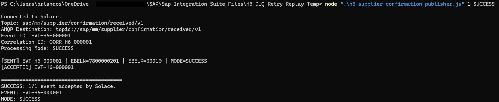

**O que esta evidência comprova:** a diferença entre *enviar* e *ser aceito*. O `[SENT]` indica a tentativa e o `[ACCEPTED]` confirma que o broker aceitou e persistiu a mensagem Guaranteed (`SUCCESS: 1/1 event accepted by Solace`). Publicar com o consumidor offline é intencional: prepara a próxima evidência, em que veremos o desacoplamento temporal entre produtor e consumidor.

## Evidência 11 — Evento aguardando consumer offline

Esta é uma composição das duas filas logo após a publicação e antes do deploy do consumidor. À esquerda, a source queue `H6.Q.MM.SUPPLIER_CONFIRMATION` mostra `Messages Queued = 1`; à direita, a DMQ `H6.DMQ.MM.SUPPLIER_CONFIRMATION` permanece em `0`. Nenhum consumidor está conectado ainda.

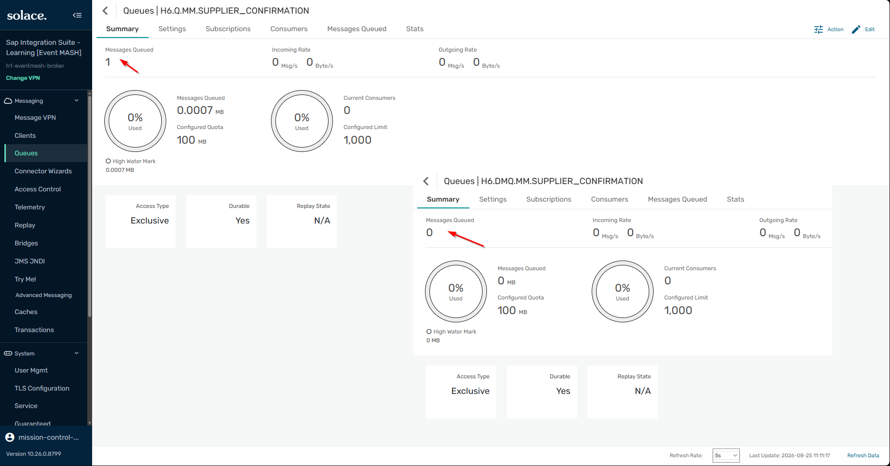

**O que esta evidência comprova:** o desacoplamento temporal do event-driven na prática. O produtor concluiu sua responsabilidade e o evento ficou preservado na durable queue mesmo sem ninguém para consumi-lo, enquanto a DMQ segue vazia porque nenhuma falha ocorreu. Este é o estado de partida controlado (`source = 1`, `DMQ = 0`, `consumers = 0`) que torna as fases seguintes comparáveis e auditáveis.

## Evidência 12 — Consumer iniciado

Com o backend em `H6_SUCCESS_200`, fazemos o deploy do consumidor. A tela de Manage Integration Content mostra o iFlow `H6 MM Supplier Confirmation Consumer` com `Status = Started` e o consumo AMQP estabelecido com sucesso sobre a source queue.

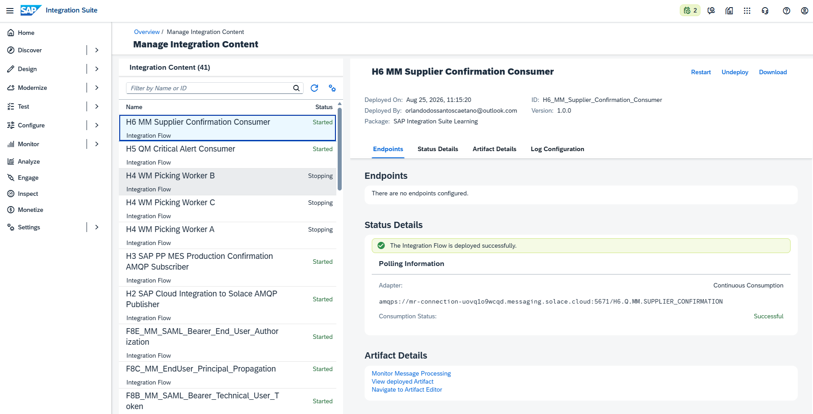

**O que esta evidência comprova:** o consumidor entrou em operação e vinculou-se à `H6.Q.MM.SUPPLIER_CONFIRMATION`, tornando-se apto a drenar o evento que estava aguardando. A partir daqui, a responsabilidade passa do broker (que guardou a mensagem) para o SAP Cloud Integration (que vai processá-la e chamar o ERP).

## Evidência 13 — Execução do caminho feliz concluída

No Monitor Message Processing, a execução do `EVT-H6-000001` aparece com `Status = Completed`. O ERP respondeu HTTP 200 na primeira tentativa e o adapter reconheceu a mensagem ao broker.

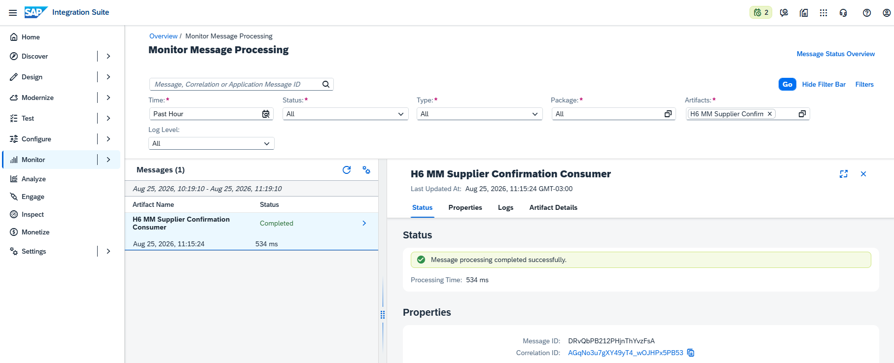

**O que esta evidência comprova:** o fluxo completo funcionou no caminho feliz — AMQP recebeu, os Groovy validaram e transformaram, o HTTP entregou ao ERP e o retorno 200 encerrou o processamento como `Completed`. Este é o baseline de sucesso contra o qual as falhas das próximas fases serão contrastadas.

## Evidência 14 — ERP processou com HTTP 200

Do lado do backend, o log do Mockoon mostra o request `POST /h6/erp/supplier-confirmation` com resposta `200 OK`. Nos headers e no corpo aparecem `X-Event-ID`, `X-Correlation-ID`, `X-Processing-Mode = SUCCESS` e `X-Delivery-Count = 1`.

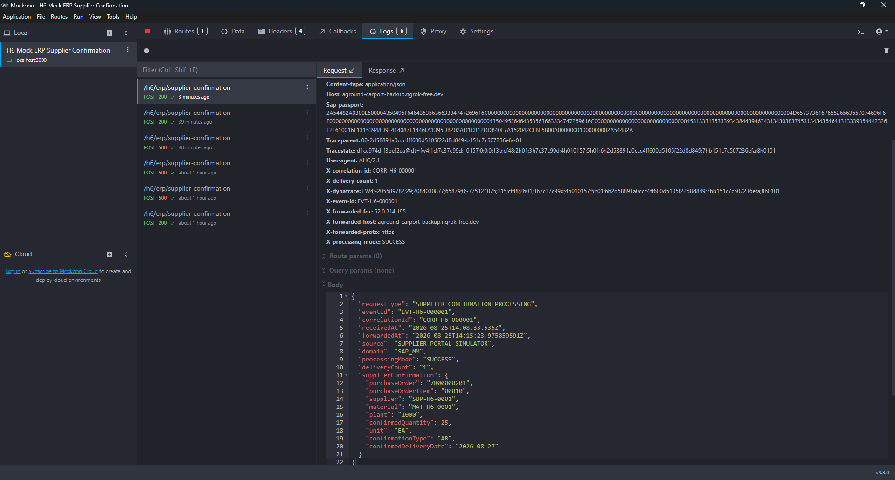

**O que esta evidência comprova:** a entrega efetiva ao sistema externo, com rastreabilidade completa. O `X-Delivery-Count = 1` indica que houve uma única entrega desta mensagem — informação que será fundamental para diferenciar retry interno de redelivery broker-side nas fases seguintes. Também confirma que os headers definidos no CPI chegaram intactos ao destino.

## Evidência 15 — Queue drenada e entrega confirmada

Após o processamento, a composição do Solace mostra a source queue novamente em `Messages Queued = 0` com `Current Consumers = 1`, entrega confirmada, zero redeliveries e zero mensagens não reconhecidas, enquanto a DMQ permanece zerada.

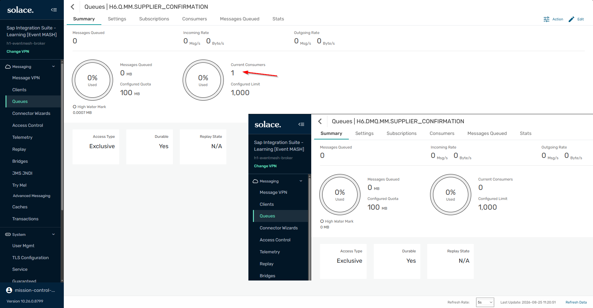

**O que esta evidência comprova:** o ciclo do caminho feliz fechou de forma limpa — a mensagem foi entregue, confirmada e removida da fila, sem qualquer reentrega e sem tocar a DMQ. Fica estabelecida a linha de base: em condições normais, o número de entregas do broker é igual a 1 e o número de redeliveries é 0. Guardar esse comparativo é o que dará força à demonstração de retry interno que vem a seguir.

---

# 10. Falha temporária e recuperação automática

> Agora o ERP passa a falhar duas vezes antes de se recuperar. O objetivo é demonstrar que falhas transitórias são absorvidas pela política de retry — e provar que esses retries são internos ao adapter, sem gerar redelivery no broker.

## Evidência 16 — Evento temporário publicado

Iniciando a fase de falha temporária, o producer publica `EVT-H6-000002` com `processingMode = TEMPORARY_FAILURE`. O evento é aceito pelo broker exatamente como o anterior — a diferença de comportamento virá do backend, não do payload.

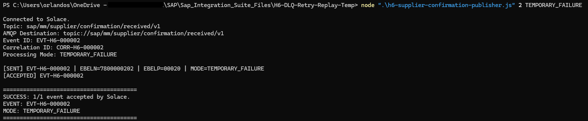

**O que esta evidência comprova:** o segundo evento entrou na cadeia de forma idêntica à do caminho feliz (`[ACCEPTED]`, `SUCCESS: 1/1`). Isso é importante metodologicamente: como a publicação é igual, qualquer diferença observada adiante é atribuível exclusivamente ao comportamento do ERP simulado, e não a variações no evento.

## Evidência 17 — Mockoon em modo sequencial 500 → 500 → 200

Para tornar a falha temporária determinística, o Mockoon é colocado em modo `Sequential response mode`, com as respostas ordenadas como `H6_TEMPORARY_FAILURE_500_ATTEMPT_1`, `H6_TEMPORARY_FAILURE_500_ATTEMPT_2` e `H6_SUCCESS_200`. Assim, as três primeiras chamadas seguem obrigatoriamente a sequência `500 → 500 → 200`.

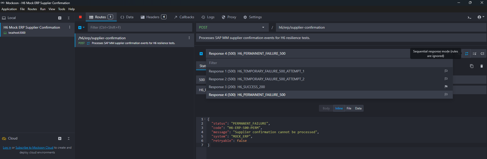

**O que esta evidência comprova:** a simulação de uma indisponibilidade temporária controlada, em que o ERP falha duas vezes e se recupera na terceira. O modo sequencial elimina qualquer dependência de troca manual durante o retry, garantindo que a demonstração de recuperação seja reproduzível e não dependa da velocidade de reação do operador.

## Evidência 18 — Primeira tentativa com HTTP 500

O log do Mockoon registra a primeira chamada do `EVT-H6-000002` com resposta `500`. Os headers preservam `X-Event-ID`, `X-Correlation-ID` e `X-Processing-Mode = TEMPORARY_FAILURE`.

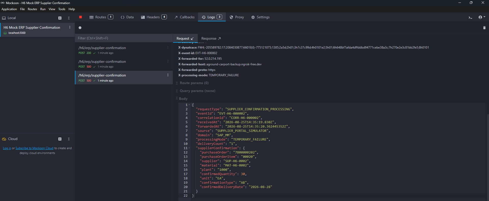

**O que esta evidência comprova:** o primeiro contato do consumidor com o backend indisponível resultou em `HTTP 500` com `code = H6-ERP-500-TEMP` e `retryable = true`. É o disparo da lógica de resiliência: a partir desta resposta, o adapter iniciará suas tentativas em vez de considerar a mensagem processada.

## Evidência 19 — Segunda tentativa com HTTP 500

A segunda chamada ao ERP, ainda dentro da sequência configurada, também retorna `500`. O ponto-chave é que os identificadores permanecem idênticos aos da primeira tentativa.

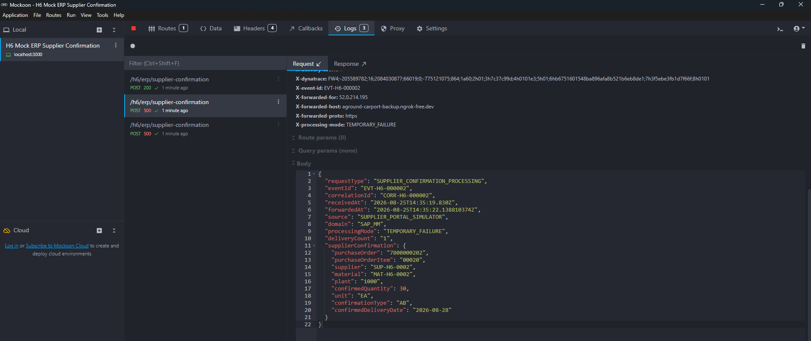

**O que esta evidência comprova:** que houve uma nova tentativa do **mesmo** evento, e não a chegada de um evento novo — comprovado pela preservação de `X-Event-ID` e `X-Correlation-ID`. Isso demonstra visualmente que o SAP Cloud Integration está repetindo a chamada HTTP para a mesma mensagem, caracterizando um retry de processamento.

## Evidência 20 — Terceira tentativa com HTTP 200

Conforme a sequência `500 → 500 → 200`, a terceira chamada do mesmo evento finalmente retorna `200 OK`, com `code = H6-ERP-200`. O ERP simulado se recuperou.

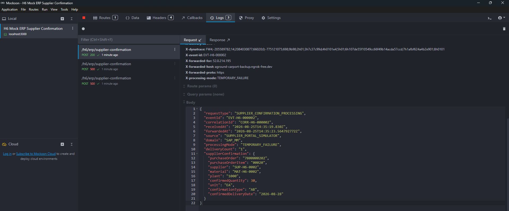

**O que esta evidência comprova:** a recuperação automática dentro da política de retry. O mesmo evento que falhou duas vezes foi processado com sucesso na terceira tentativa, sem intervenção manual e sem ir para a DMQ. É a demonstração de que falhas transitórias podem ser absorvidas pela integração de forma transparente para o negócio.

## Evidência 21 — Retry → Retry → Completed no CPI

No Monitor, o `EVT-H6-000002` aparece como um único Message Processing Log com três `Runs`: os dois primeiros marcados como `Retry` e o terceiro como `Completed`. O tempo total agrega as três tentativas.

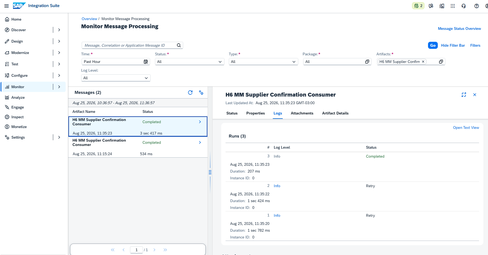

**O que esta evidência comprova:** os dois retries e a conclusão aconteceram dentro do **mesmo** processamento AMQP, e não como três entregas separadas. Essa é a visão do lado do consumidor que, combinada com a evidência seguinte do broker, prova a distinção conceitual entre retry de aplicação e redelivery de broker.

## Evidência 22 — Sem redelivery broker-side

As estatísticas da source queue no Solace, após a recuperação, mostram a mensagem confirmada, `Messages Redelivered = 0`, `Redelivery Requests = 0` e `Unacknowledged Messages = 0`, apesar de o CPI ter feito três chamadas HTTP.

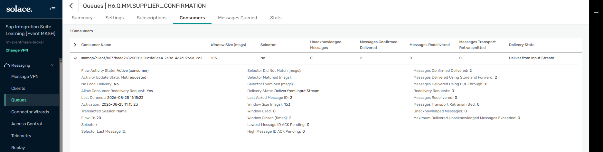

**O que esta evidência comprova:** o ponto conceitual mais importante desta fase — **retry de aplicação não é redelivery de broker**. O Solace entregou a mensagem uma única vez e os três requests HTTP foram tentativas internas do adapter dentro dessa mesma entrega. Por isso o contador de redelivery permaneceu em zero. Confundir esses dois conceitos leva a dimensionar erroneamente políticas de reprocessamento em produção.

## Evidência 23 — Source e DMQ zeradas após recuperação

Encerrando a fase temporária, a composição mostra a source queue em `0`, `Current Consumers = 1` e a DMQ também em `0`.

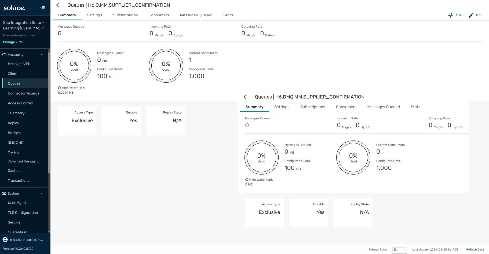

**O que esta evidência comprova:** a falha temporária foi integralmente resolvida dentro da política de retry, sem gerar poison message. A DMQ permaneceu vazia porque a mensagem nunca esgotou suas tentativas. Este resultado contrasta diretamente com a próxima fase, em que a falha será permanente e a mensagem terminará isolada na DMQ.

---

# 11. Poison message e Dead Message Queue

> Aqui o ERP recusa a mensagem de forma persistente. O evento esgota suas tentativas e é isolado na DMQ, em vez de bloquear a fila ou ser descartado. Esta é a demonstração central do dead-lettering.

## Evidência 24 — Falha permanente como resposta default

Para provocar um poison message, desligamos o modo sequencial e definimos `H6_PERMANENT_FAILURE_500` como resposta default do Mockoon. Agora todas as chamadas retornarão `500` com `retryable = false`.

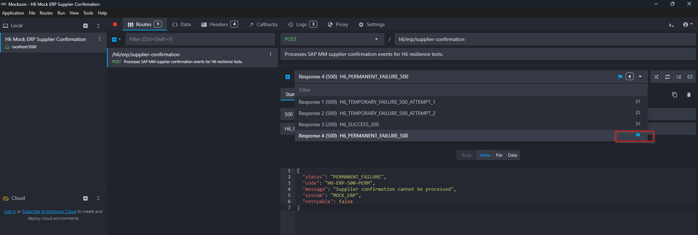

**O que esta evidência comprova:** o backend está configurado para uma falha não recuperável e consistente. Diferentemente da falha temporária, aqui não há terceira tentativa bem-sucedida — o que forçará o esgotamento das tentativas e o acionamento do mecanismo de dead-lettering. O `code = H6-ERP-500-PERM` documenta explicitamente a natureza permanente do erro.

## Evidência 25 — Poison message publicado

O producer publica `EVT-H6-000003` com `processingMode = PERMANENT_FAILURE`. Como nas demais fases, o broker aceita a mensagem normalmente.

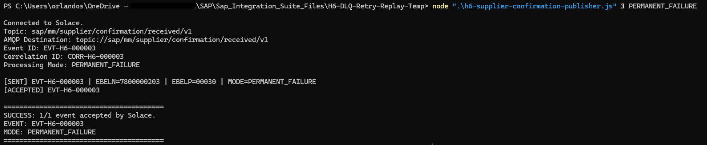

**O que esta evidência comprova:** o candidato a poison message entrou na cadeia de forma legítima e foi aceito pelo broker (`SUCCESS: 1/1`). Novamente, a publicação idêntica isola a variável: o que tornará este evento um poison message não é o seu conteúdo, mas o fato de o backend recusá-lo persistentemente.

## Evidência 26 — Dez chamadas HTTP 500

O log do Mockoon acumula dez requests `POST /h6/erp/supplier-confirmation`, todos com `500`, todos referentes ao mesmo `EVT-H6-000003`.

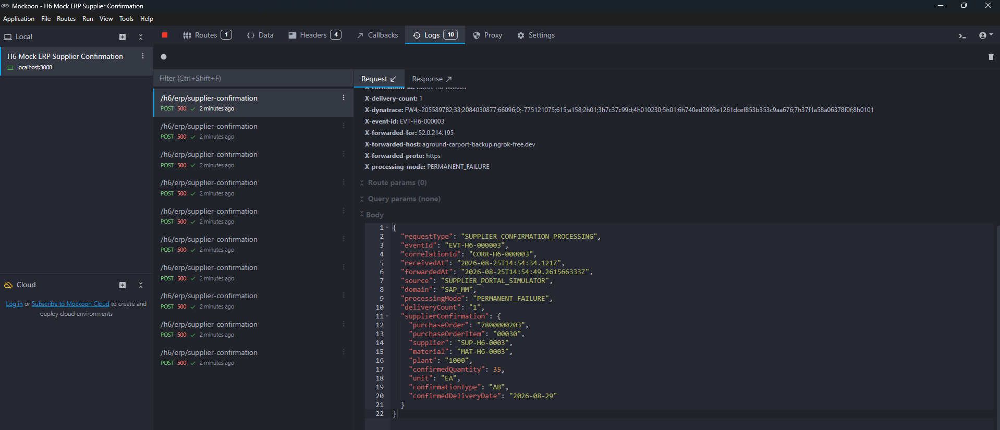

**O que esta evidência comprova:** o consumidor esgotou suas tentativas contra um backend que nunca aceitou a mensagem. Registramos aqui o número **real** de chamadas observado no runtime (dez), sem forçá-lo a caber em uma expectativa teórica de "tentativa inicial + 3 retries". A preservação do Event ID em todas as chamadas confirma que é sempre a mesma mensagem sendo retentada.

## Evidência 27 — Dez runs esgotados no CPI

No Monitor, o processamento do `EVT-H6-000003` mostra `Runs (10)`, todos com status `Retry` e a mensagem de erro `HTTP operation failed ... statusCode: 500`. O tempo total do MPL reflete todo o ciclo de tentativas.

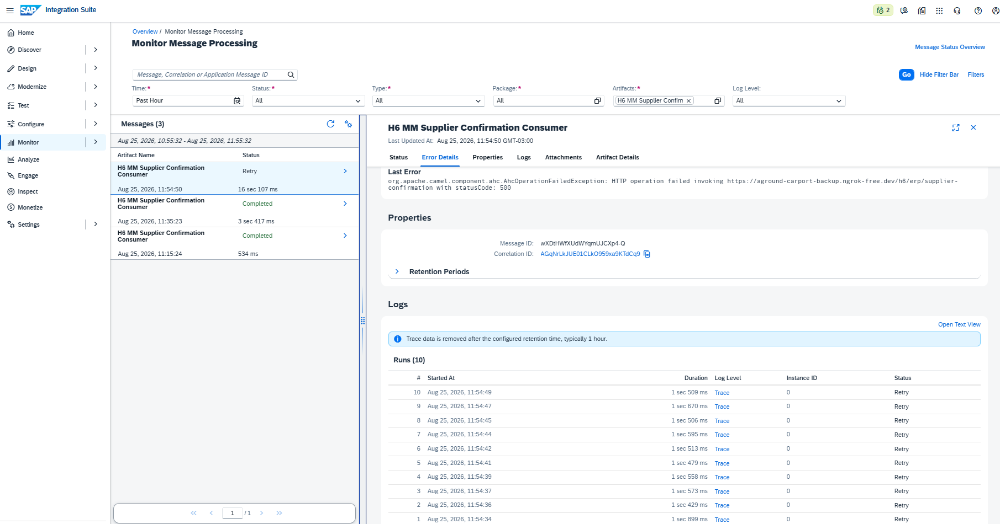

**O que esta evidência comprova:** o comportamento real do runtime diante de uma falha permanente. Mesmo com o MPL exibido como `Retry`, o desfecho efetivo é a remoção da mensagem da source queue e sua transferência para a DMQ, confirmada na evidência seguinte. Documentar os dez runs observados, em vez de um número idealizado, mantém a honestidade técnica do laboratório.

## Evidência 28 — Mensagem movida para a DMQ

Após o esgotamento, a composição do Solace mostra a inversão de estado: a source queue voltou a `Messages Queued = 0` e a DMQ passou a `Messages Queued = 1`.

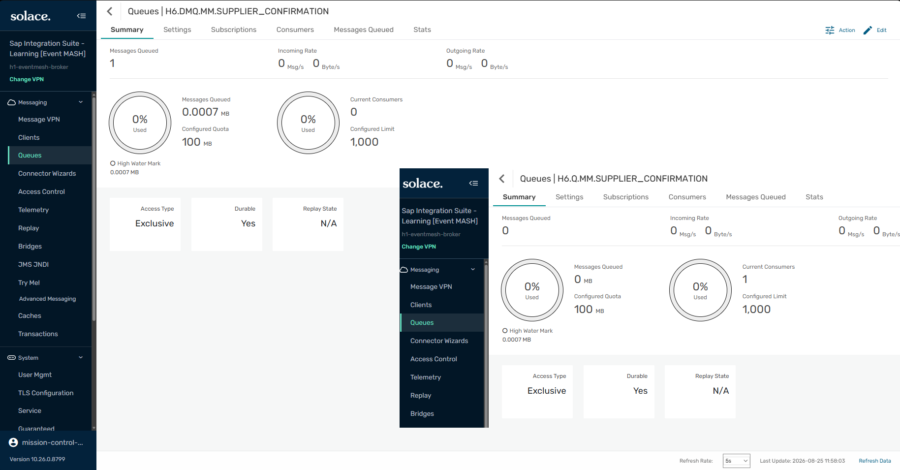

**O que esta evidência comprova:** o mecanismo de dead-lettering funcionou exatamente como projetado. A mensagem que não pôde ser entregue foi automaticamente movida da `H6.Q.MM.SUPPLIER_CONFIRMATION` para a `H6.DMQ.MM.SUPPLIER_CONFIRMATION`, liberando a source queue para continuar operando. Isso evita o cenário clássico em que uma única mensagem defeituosa bloqueia toda a fila.

## Evidência 29 — Detalhes do poison message na DMQ

Na aba Messages Queued da DMQ, abrimos a mensagem isolada. Aparecem propriedades como `Message ID`, `Content Size`, `Undelivered = Yes`, `Redeliveries`, `DMQ Eligible` e `DMQ Eligible As Published`.

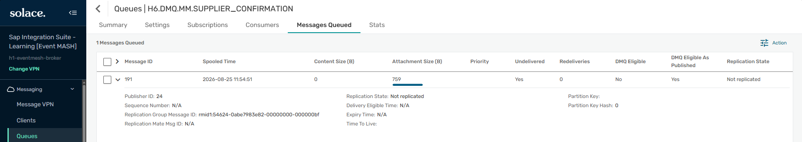

**O que esta evidência comprova:** a mensagem não foi descartada — foi **preservada** com seus metadados para investigação. O `DMQ Eligible As Published = Yes` mostra que a mensagem era elegível para dead-lettering desde a publicação, enquanto o `DMQ Eligible = No` (já na DMQ) é coerente, pois uma mensagem já isolada não deve ser reencaminhada para outra DMQ. Preservar o conteúdo é o que torna possível a recuperação operacional demonstrada a seguir.

---

# 12. Recuperação operacional

> Com a causa raiz corrigida, recuperamos a mensagem sem perder rastreabilidade: documentamos a limitação da interface, restauramos o backend, republicamos o mesmo evento lógico, validamos o sucesso e só então removemos o original da DMQ.

## Evidência 30 — Ação de cópia não exposta na lista da DMQ

Ao tentar devolver a mensagem à source queue a partir da própria DMQ, o menu `Action` da lista de mensagens exibiu apenas `Delete Messages`, sem uma opção gráfica de copiar para outra fila.

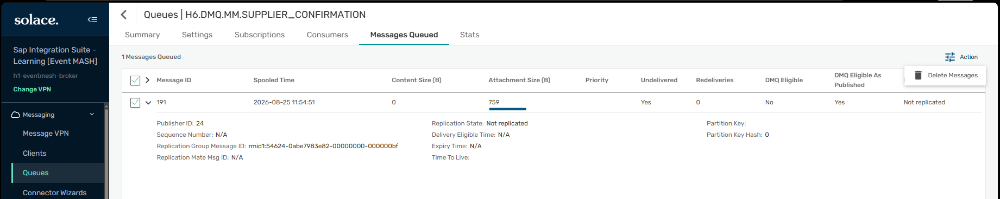

**O que esta evidência comprova:** uma limitação real da operação disponível nessa tela e perfil de acesso, documentada de forma transparente. Posteriormente identificamos que o Broker Manager expõe `Copy Message From Queue` a partir da **fila de destino**, não da mensagem na DMQ. Como a recuperação por republicação controlada já havia sido validada, essa alternativa administrativa foi registrada mas não executada, evitando dependência de CLI/SEMP e preservando a mensagem original.

## Evidência 31 — Backend recuperado para HTTP 200

Simulando a correção da causa raiz, voltamos o Mockoon para `H6_SUCCESS_200` como default, com o modo sequencial e o fallback desligados. O ERP volta a processar confirmações normalmente.

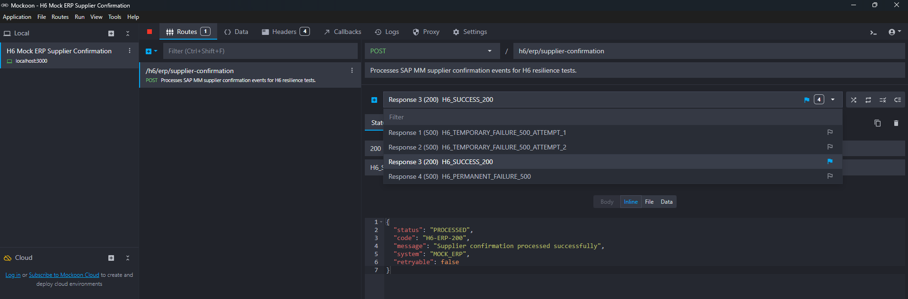

**O que esta evidência comprova:** o pré-requisito da recuperação foi atendido — o sistema externo que causava a falha permanente agora responde com sucesso. Importante notar a sequência operacional correta: **primeiro** se corrige a causa, **depois** se reprocessa. Reprocessar antes de corrigir apenas devolveria a mensagem à DMQ.

## Evidência 32 — Mesmo evento lógico republicado

Com o backend recuperado, o producer republica o mesmo evento lógico `EVT-H6-000003` (mesmos Event ID e Correlation ID), preservando o `processingMode = PERMANENT_FAILURE` original. O broker aceita a nova publicação.

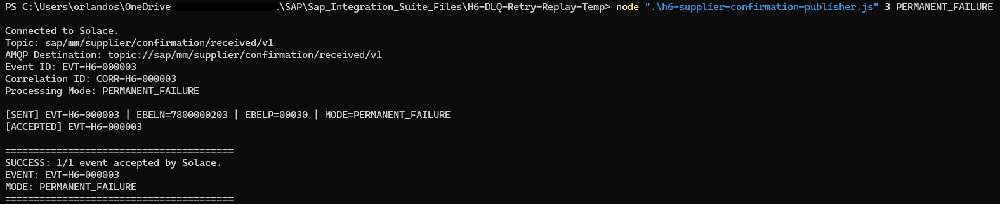

**O que esta evidência comprova:** a recuperação por republicação controlada, preservando a identidade funcional do evento. O `processingMode` continua `PERMANENT_FAILURE` intencionalmente — não adulteramos o payload para forçar sucesso; o que mudou foi o **estado operacional do backend**. A mensagem original permanece intacta na DMQ enquanto validamos o reprocessamento.

## Evidência 33 — Evento recuperado processado com HTTP 200

O log do Mockoon mostra que o evento republicado foi processado com `200 OK`, com os mesmos identificadores do poison message original.

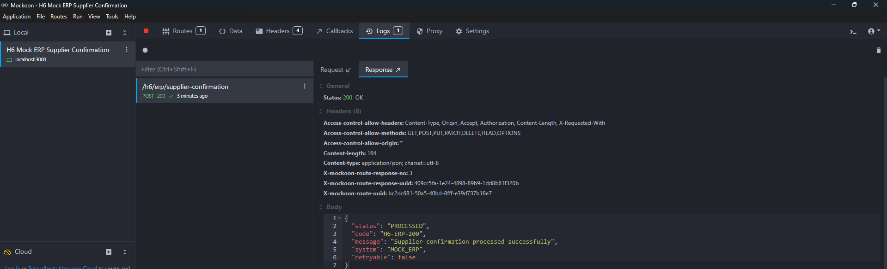

**O que esta evidência comprova:** o mesmo evento que anteriormente recebeu dez respostas `500` agora foi aceito pelo ERP recuperado. É a prova de que a falha era realmente do backend (operacional) e não do evento (dado), e de que a correção da causa raiz é suficiente para reprocessar com sucesso.

## Evidência 34 — Reprocessamento concluído no CPI

No Monitor, o processamento do evento recuperado é exibido com `Status = Completed`. Os Run Steps mostram o pipeline completo — AMQP, validação, preparação do request, headers e HTTP — executado com sucesso.

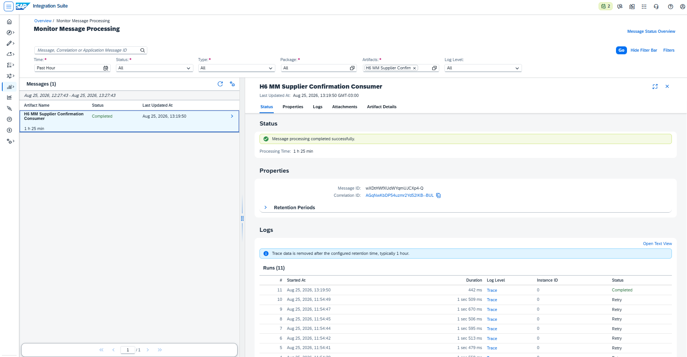

**O que esta evidência comprova:** a transição de um evento antes problemático para um desfecho `Completed`, atravessando todo o pipeline do consumidor sem interrupção. Fecha a demonstração de que a integração é capaz de recuperar mensagens que haviam falhado, uma vez corrigida a condição externa.

## Evidência 35 — Original preservado na DMQ durante a validação

Neste instante intermediário, a composição mostra a source queue em `0` com `Current Consumers = 1` (o evento republicado já foi consumido) e a DMQ ainda em `1` (a mensagem original continua lá).

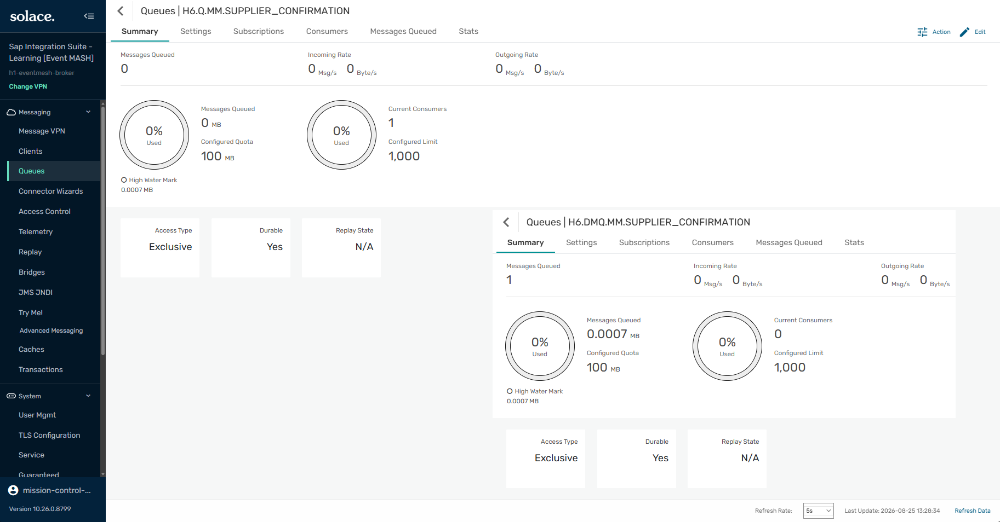

**O que esta evidência comprova:** a recuperação foi validada **antes** de qualquer exclusão. A republicação foi processada e reconhecida, mas o registro original permaneceu preservado na DMQ até termos certeza do sucesso. Essa disciplina operacional — validar primeiro, excluir depois — evita perda de dados caso o reprocessamento falhasse.

## Evidência 36 — Exclusão manual controlada da DMQ

Com o reprocessamento confirmado, selecionamos a mensagem original na DMQ e executamos `Action → Delete Messages` como etapa final de encerramento operacional.

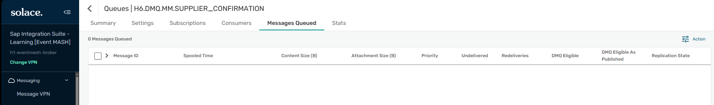

**O que esta evidência comprova:** o fechamento consciente do ciclo de tratamento do poison message. A exclusão foi uma **ação manual controlada**, executada somente após a validação da recuperação — e não um descarte automático. Em produção, essa etapa corresponderia a marcar o incidente como resolvido em um processo auditável.

## Evidência 37 — Estado final da recuperação

A composição final da fase de recuperação mostra a source queue em `0`, a DMQ em `0` e o consumidor ativo.

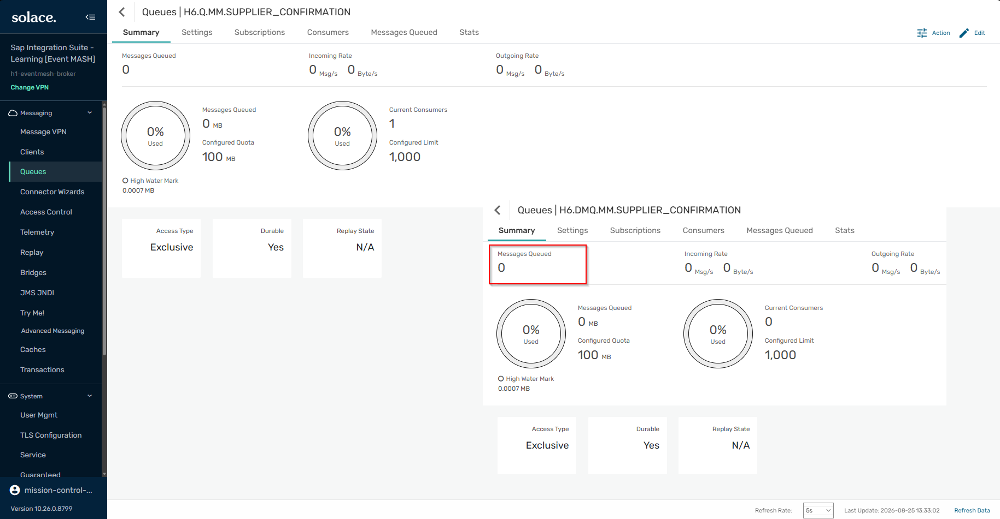

**O que esta evidência comprova:** o cenário de falha permanente foi completamente encerrado — a mensagem foi recuperada, o original foi removido de forma controlada e ambas as filas voltaram ao estado limpo, com o consumidor pronto para novos eventos. É o marco que separa a fase de dead-lettering da fase de Message Replay.

---

# 13. Message Replay

> A última fase demonstra um mecanismo diferente da DMQ: reproduzir um evento **já processado e reconhecido**. Criamos um Replay Log filtrado, publicamos um evento dedicado, iniciamos o replay e comprovamos que o mesmo evento foi processado duas vezes.

## Evidência 38 — Configuração do Replay Log

Iniciando a fase de Message Replay, criamos o Replay Log do Message VPN. Habilitamos `Incoming = On` (gravar mensagens) e `Outgoing = On` (reproduzir mensagens), definimos `Maximum Spool Usage = 100 MB` e ativamos `Topic Filter Enabled`.

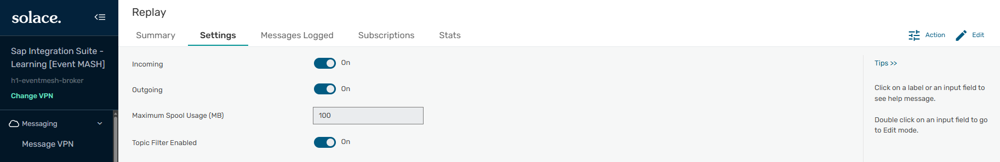

**O que esta evidência comprova:** o Message VPN foi preparado para reter e reproduzir mensagens Guaranteed. Diferente da DMQ — que guarda o que falhou — o Replay Log guarda mensagens **mesmo após terem sido processadas e reconhecidas**, permitindo reprodução histórica. O topic filter será usado para restringir o log apenas ao namespace do H6.

## Evidência 39 — Filtro de topic do Replay Log

Na aba Subscriptions do Replay Log, adicionamos exatamente o topic `sap/mm/supplier/confirmation/received/v1`, evitando registrar eventos dos demais laboratórios (H1 a H5) que compartilham o mesmo Message VPN.

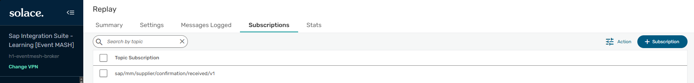

**O que esta evidência comprova:** o Replay Log está restrito ao namespace de negócio do H6. Sem esse filtro, o log capturaria toda mensagem Guaranteed do VPN, misturando domínios e consumindo quota desnecessariamente. É uma boa prática de governança: registrar para replay apenas o que realmente pode precisar ser reproduzido.

## Evidência 40 — Evento exclusivo do Replay publicado

Com o Replay Log já ativo e filtrado, o producer publica `EVT-H6-000004` com `processingMode = SUCCESS`. Este evento é novo e exclusivo desta fase, pois só mensagens publicadas **após** a criação do log entram nele.

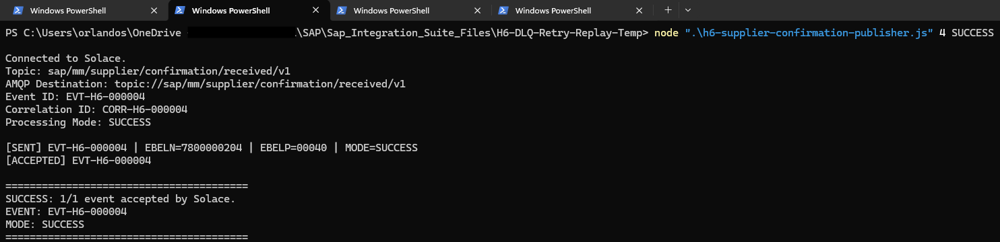

**O que esta evidência comprova:** a criação de uma mensagem que será, ao mesmo tempo, processada normalmente e registrada no histórico de replay. Os eventos anteriores (000001 a 000003) não podem ser reproduzidos porque foram publicados antes do log existir — por isso a fase de replay usa um evento dedicado.

## Evidência 41 — Primeiro processamento com HTTP 200

O log do Mockoon registra o primeiro `POST 200` para o `EVT-H6-000004`, correspondendo ao processamento normal do evento recém-publicado.

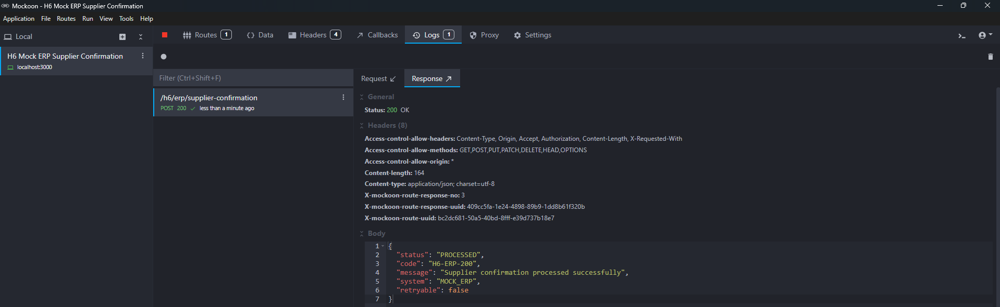

**O que esta evidência comprova:** o processamento original do evento ocorreu como qualquer caminho feliz. Este é o primeiro dos **dois** processamentos que este mesmo evento terá — o segundo virá do replay — e serve de referência para comprovar, adiante, que a reprodução histórica de fato reexecutou a integração.

## Evidência 42 — Primeiro processamento concluído no CPI

No Monitor, o processamento inicial do `EVT-H6-000004` aparece como `Completed`. A source queue é drenada normalmente após o reconhecimento.

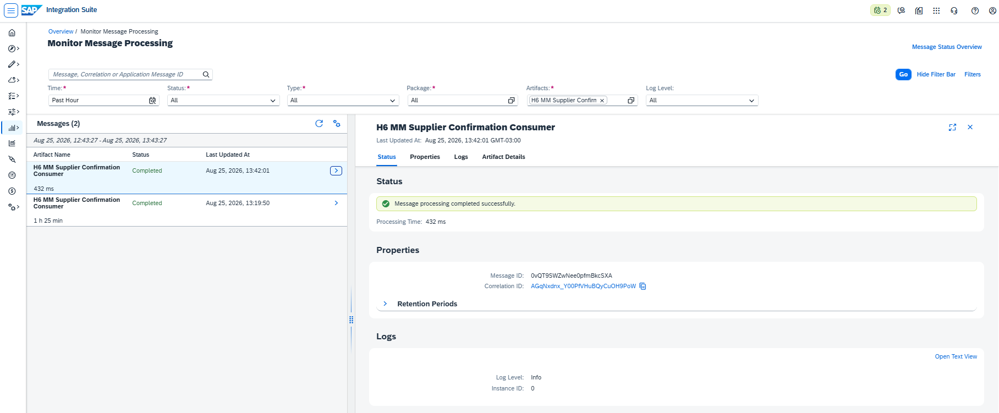

**O que esta evidência comprova:** o evento foi consumido, processado com sucesso e removido da source queue — comportamento idêntico ao caminho feliz. O ponto sutil, que a próxima evidência revela, é que apesar de removido da fila, o evento continua preservado no Replay Log.

## Evidência 43 — Evento preservado no Replay Log

Na aba Messages Logged do Replay, aparece a mensagem registrada com seu `Message ID`, `Spooled Time`, `Content Size`, `DMQ Eligible` e um `Replication Group Message ID`, mesmo após o evento já ter sido consumido e reconhecido.

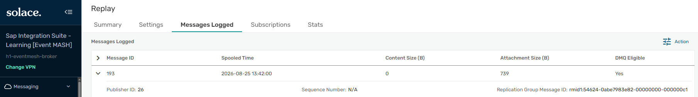

**O que esta evidência comprova:** a diferença fundamental entre a fila e o Replay Log. Na fila, uma mensagem reconhecida desaparece; no Replay Log, ela **permanece disponível para reprodução**. O `Replication Group Message ID` é o identificador que permitiria, se quiséssemos, iniciar o replay a partir de um ponto específico do histórico.

## Evidência 44 — Início do Replay a partir do começo do log

Esta composição documenta o procedimento administrativo completo em quatro passos numerados: (1) abrir o menu `Action` da source queue, (2) selecionar `Start Replay`, (3) escolher `Start Replay from Beginning` e (4) confirmar em `Start Replay`. A source queue está zerada no momento da operação.

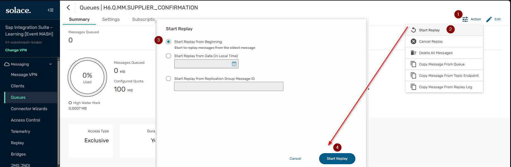

**O que esta evidência comprova:** a decisão e a configuração exatas usadas para iniciar a reprodução histórica sobre a `H6.Q.MM.SUPPLIER_CONFIRMATION`, a partir da mensagem mais antiga do log. A sequência numerada torna o procedimento reproduzível por qualquer pessoa que consulte a documentação, sem ambiguidade sobre onde clicar.

## Evidência 45 — Segundo POST 200 originado pelo Replay

Após o início do replay, o log do Mockoon passa a exibir **dois** `POST 200` para o `EVT-H6-000004`: o processamento original e, agora, o processamento originado pela reprodução histórica.

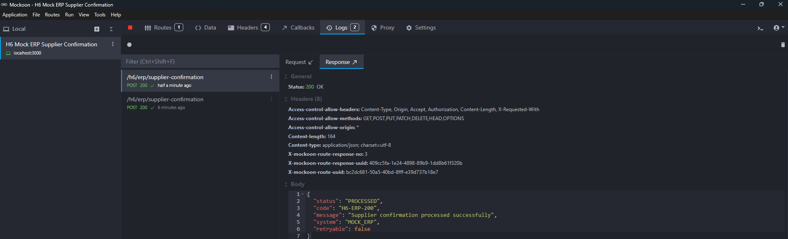

**O que esta evidência comprova:** o mesmo evento chegou novamente ao ERP, desta vez entregue pelo broker a partir do Replay Log — e não por uma nova publicação do producer. Os identificadores idênticos confirmam que é o evento histórico sendo reproduzido, comprovando na prática o mecanismo de Message Replay.

## Evidência 46 — Segundo processamento concluído no CPI

No Monitor, agora aparecem **duas** execuções `Completed` para o mesmo Event ID, uma referente ao processamento original e outra à mensagem reproduzida.

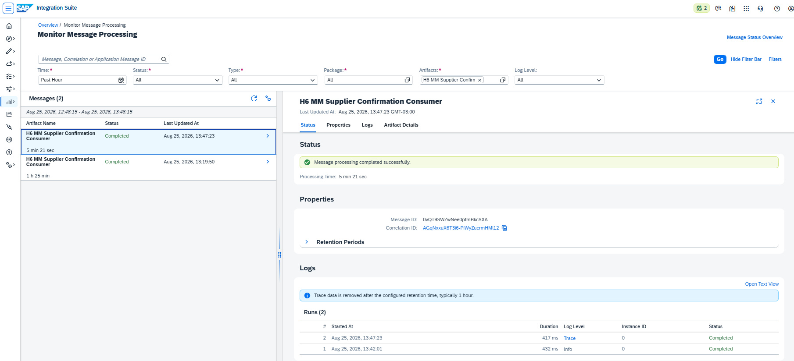

**O que esta evidência comprova:** o SAP Cloud Integration processou o mesmo evento lógico duas vezes — a primeira ao vivo e a segunda via replay — ambas com sucesso. Isso evidencia por que, em produção com replay habilitado, a **idempotência do consumidor** é essencial: sem ela, um replay reprocessaria efeitos colaterais já aplicados.

## Evidência 47 — Replay concluído (Before/After)

Esta composição Before/After captura o ciclo de vida do replay na source queue. No estado **Before**, a queue mostra `Messages Queued = 1`, `Current Consumers = 0` e `Replay State = Pending Complete`. No estado **After**, mostra `Messages Queued = 0`, `Current Consumers = 1` e `Replay State = Complete`.

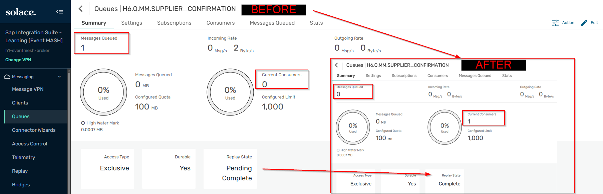

**O que esta evidência comprova:** o comportamento operacional completo do Message Replay. Ao iniciar, o broker desconecta os consumer flows e recoloca a mensagem histórica na fila (`Pending Complete`, `0 consumers`); em seguida, o consumidor se reconecta automaticamente, processa a mensagem reproduzida e o estado transiciona para `Complete` com a fila novamente zerada. É o fechamento visual de toda a demonstração de resiliência do H6.

---

# 14. Storytelling técnico consolidado

O H6 começou como uma integração aparentemente simples: receber uma confirmação do fornecedor e encaminhá-la ao ERP. O caminho feliz demonstrou entrega garantida e reconhecimento, estabelecendo a linha de base — uma entrega, zero redeliveries, fila zerada. Porém, o valor real do laboratório surgiu quando o backend passou a falhar.

Na falha temporária, o Mock ERP retornou dois erros consecutivos antes de se recuperar. O CPI realizou os retries dentro do mesmo processamento AMQP. O Solace contabilizou uma única entrega e zero redeliveries, provando que retries da aplicação não equivalem automaticamente a redelivery do broker — uma distinção que muda a forma de dimensionar políticas de reprocessamento em produção.

Na falha permanente, o ERP retornou dez erros HTTP 500. O evento deixou a source queue e foi preservado na DMQ dedicada. A mensagem permaneceu disponível para investigação, com seus metadados intactos, em vez de ser silenciosamente descartada ou de travar a fila para os demais eventos.

A recuperação operacional não mascarou a falha. Primeiro, o backend foi restaurado. Depois, o mesmo evento lógico foi republicado com Event ID e Correlation ID preservados. Somente após o CPI concluir e o ERP responder 200 a mensagem original foi removida da DMQ — validar primeiro, excluir depois.

Por fim, o Message Replay demonstrou uma capacidade diferente. Um evento já processado e reconhecido permaneceu no Replay Log. A operação `Start Replay from Beginning` desconectou temporariamente o consumer, recolocou a mensagem histórica na queue e permitiu que o mesmo evento fosse processado novamente. O broker concluiu o Replay e o consumer se reconectou automaticamente, evidenciando por que a idempotência do consumidor é essencial quando o replay está habilitado.

O resultado é um ciclo completo de resiliência operacional:

```text
processar
→ tentar novamente
→ isolar
→ investigar
→ recuperar
→ confirmar
→ reproduzir histórico
```

---

# 15. Troubleshooting e aprendizados

## 15.1 `topic://` é obrigatório no publisher AMQP

O destino deve ser explicitamente qualificado como topic. Sem o prefixo, o broker pode interpretar o endereço como queue, resultando em rejeição da publicação.

## 15.2 Quantidade real de runs

`Max. Number of Retries = 3` não produziu apenas quatro requests na falha permanente. Foram observados dez runs. A documentação registra o comportamento real do runtime, sem impor uma simplificação teórica que não corresponderia às evidências.

## 15.3 Retry interno versus redelivery

A falha temporária produziu três chamadas HTTP, mas zero redeliveries no Solace. A mensagem permaneceu na mesma entrega AMQP até o resultado final, comprovando que os dois conceitos são independentes.

## 15.4 Copy no Broker Manager

Na lista de mensagens da DMQ, a ação de cópia não estava exposta — apenas `Delete Messages`. Depois foi identificada, na source queue, a opção `Copy Message From Queue`. O laboratório já havia concluído a recuperação por republicação controlada, portanto a alternativa foi registrada sem alterar a evidência executada, preservando a mensagem original.

## 15.5 Replay desconecta consumers

Durante o Replay, a queue mostrou zero consumers e estado `Pending Complete`. Após o reprocessamento, o consumer retornou e o estado passou a `Complete`. Clientes compatíveis se reconectam automaticamente, mas esse comportamento precisa ser considerado no desenho de operações críticas.

---

# 16. Boas práticas aplicadas

1. DMQ dedicada por source queue.
2. Source queue Durable e Exclusive.
3. Redelivery finito e Client Delivery Count habilitado.
4. Retry do CPI coordenado com outcome final `REJECTED`.
5. Poison message preservado para análise.
6. Backend controlável e testes determinísticos.
7. Event ID e Correlation ID preservados em properties e headers.
8. Exclusão da DMQ somente após validação da recuperação.
9. Replay Log filtrado para o namespace necessário.
10. Source queue zerada antes do Replay.
11. Evidências trianguladas entre producer, broker, CPI e backend.
12. Limitações do ambiente documentadas de forma transparente.

---

# 17. Recomendações para produção

- automatizar o tratamento de DMQ com processo operacional auditável;
- utilizar `Copy Message From Queue` ou SEMP/CLI conforme governança e permissões;
- impedir republicação duplicada sem idempotência no consumidor;
- adicionar deduplicação por Event ID quando Replay estiver habilitado;
- configurar alertas para backlog, oldest-message age e DMQ count;
- governar Replay com autorização administrativa e janela de mudança;
- usar start location por data ou Replication Group Message ID em logs grandes;
- dimensionar a quota do Replay Log e monitorar seu uso;
- segregar topics e ACLs por domínio;
- registrar todas as ações manuais em trilha de auditoria;
- evitar expor headers de infraestrutura em evidências;
- implementar observabilidade distribuída por Correlation ID.

---

# 18. Matriz de validação

| Capability | Resultado |
|---|---|
| Caminho feliz | ✅ |
| Retry interno | ✅ |
| Falha temporária recuperada | ✅ |
| Retry versus redelivery diferenciado | ✅ |
| Falha permanente | ✅ |
| Poison message | ✅ |
| DMQ dedicada | ✅ |
| Investigação da mensagem | ✅ |
| Backend recuperado | ✅ |
| Republicação controlada | ✅ |
| Exclusão manual controlada | ✅ |
| Replay Log | ✅ |
| Topic filter | ✅ |
| Start Replay from Beginning | ✅ |
| Consumer temporariamente desconectado | ✅ |
| Evento histórico processado novamente | ✅ |
| Replay Complete | ✅ |

---

# 19. Próximo cenário — H7

## H7 — MQTT Industrial Telemetry para Solace e SAP Cloud Integration

O próximo cenário levará o Event Mesh para o chão de fábrica. Um simulador de dispositivo industrial publicará telemetria via MQTT, protocolo leve amplamente usado para IoT. O Solace receberá os eventos MQTT e os tornará disponíveis no mesmo event mesh para consumo via AMQP pelo SAP Cloud Integration.

### História de negócio

```text
Sensor de máquina / gateway industrial
        ↓ MQTT
Solace PubSub+
        ↓ topic hierarchy
queue de telemetria
        ↓ AMQP 1.0
SAP Cloud Integration
        ↓ validação e normalização
backend de manutenção / condição
```

### Capacidades previstas

- conexão MQTT segura ao Solace;
- Quality of Service 0 versus 1;
- topic hierarchy para planta, linha e máquina;
- telemetria normal e alerta por limite;
- Last Will and Testament, se suportado pelo cliente escolhido;
- queue Durable atraindo topics MQTT;
- consumo protocol-agnostic pelo CPI via AMQP;
- transformação para um evento de manutenção SAP PM-like;
- teste de desconexão e retomada;
- comparação MQTT versus AMQP.

### Artefatos previstos

```text
38-h7-solace-mqtt-industrial-telemetry.md
```

```text
evidences/lab36/
```

```text
H7.Q.PM.INDUSTRIAL_TELEMETRY
```

```text
H7_PM_Industrial_Telemetry_Consumer
```

```text
factory/{plant}/{line}/{machine}/telemetry/v1
```

O cenário será executado em três fases: conexão MQTT e publicação, roteamento MQTT → Durable Queue, e consumo AMQP pelo CPI. Dessa forma, o H7 demonstrará interoperabilidade de protocolos no mesmo event mesh, sem exigir que o produtor MQTT conheça o protocolo usado pelo consumidor.

---

# 20. Navegação

**Cenário anterior:** [H5 — Topic Hierarchy, Wildcards e Fan-out](./36-h5-solace-topic-hierarchy-wildcards-fanout.md)

**Próximo cenário:** [H7 — MQTT Industrial Telemetry](./38-h7-solace-mqtt-industrial-telemetry.md)

---

# 21. Referências oficiais

## SAP

- [Configure the AMQP Sender Adapter](https://help.sap.com/docs/cloud-integration/sap-cloud-integration/configure-amqp-sender-adapter)
- [Discovering Event-Driven Integration with SAP Integration Suite, advanced event mesh](https://learning.sap.com/courses/discovering-event-driven-integration-with-sap-integration-suite-advanved-event-mesh)

## Solace

- [Configuring Dead Message Queues](https://docs.solace.com/Cloud/Broker-Manager/configuring-dmqs-broker-manager.htm)
- [Message Replay](https://docs.solace.com/Features/Replay/Message-Replay-Overview.htm)
- [Configuring Message Replay](https://docs.solace.com/Cloud/Broker-Manager/message-replay-cloud.htm)
- [Playing Back a Replay Log](https://docs.solace.com/Features/Replay/Msg-Replay-Playback.htm)

---

# 22. Ferramentas utilizadas

- SAP Integration Suite — Cloud Integration
- Solace PubSub+ Cloud
- Solace Broker Manager
- AMQP 1.0
- Node.js 24 + rhea
- Mockoon 9.8.0
- ngrok
- PowerShell
- Git / GitHub

---

## 👤 Autor / 📇 Contato

[](https://www.linkedin.com/in/orlando-caetano/) [](https://github.com/OrlandoCaetano2026)

**Orlando Caetano**  
Especialista SAP • Integração • Inteligência Artificial  
Consultor SAP MM com know-how em PP, QM e WM


> 📌 Projeto de estudo e portfólio. Os cenários SAP MM, PP, QM, WM, MES e Event-Driven são simulações educativas para prática de arquitetura e integração.
