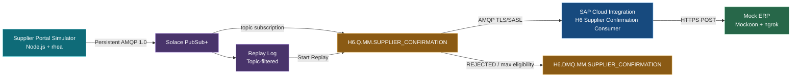
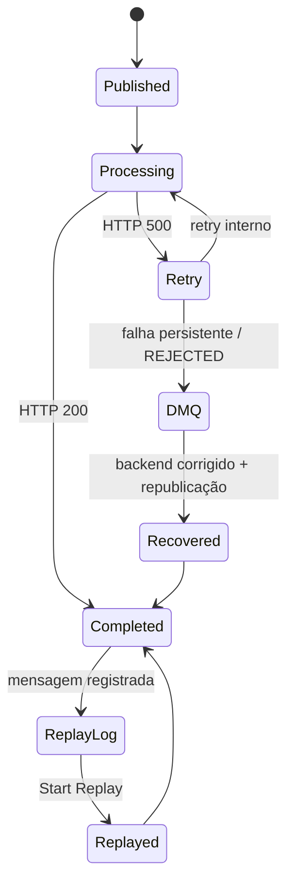
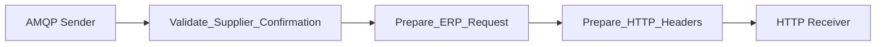

# H6 — Dead Message Queue, Retry, Recuperação Operacional e Message Replay com Solace e SAP Cloud Integration

> **Bloco H — Event-Driven Integration / Event Mesh**  
> **Documento 37**  
> **Objetivo:** demonstrar, em um cenário SAP MM de confirmação de fornecedor, o ciclo completo de resiliência orientada a eventos: entrega garantida, retry interno do SAP Cloud Integration, falha permanente, isolamento em Dead Message Queue, recuperação operacional, republicação controlada e reprodução histórica por Message Replay.

---

## 1. Perfil técnico do cenário

| Item | Implementação |
|---|---|
| Cenário | H6 — DMQ, Retry, Recovery e Message Replay |
| Domínio | SAP MM — Supplier Confirmation |
| Broker | Solace PubSub+ Cloud |
| Message VPN | `h1-eventmesh-broker` |
| Topic | `sap/mm/supplier/confirmation/received/v1` |
| Source queue | `H6.Q.MM.SUPPLIER_CONFIRMATION` |
| Dead Message Queue | `H6.DMQ.MM.SUPPLIER_CONFIRMATION` |
| Source queue type | Durable, Exclusive, não particionada |
| Maximum Redelivery Count | 5 |
| Client Delivery Count | Enabled |
| CPI consumer | `H6_MM_Supplier_Confirmation_Consumer` |
| Protocolo | AMQP 1.0 sobre TCP/TLS |
| Autenticação | SASL |
| Credential alias | `SOLACE_AMQP_CREDENTIALS` |
| CPI retries | 3 |
| Outcome final | `REJECTED` |
| Backend | Mockoon 9.8.0, exposto via ngrok |
| Producer | Node.js 24 + rhea |
| Replay Log | 100 MB, Incoming/Outgoing habilitados |
| Replay filter | `sap/mm/supplier/confirmation/received/v1` |
| Evidências | `evidences/lab35/` — 47 imagens |

---

## 2. Visão executiva

Os cenários H1 a H5 construíram os principais pilares do Event Mesh: fundação do broker, publicação, consumo, escala horizontal e roteamento seletivo. O H6 fecha a lacuna operacional mais importante: **o que acontece quando um evento garantido não consegue ser processado?**

O cenário simula confirmações de fornecedor SAP MM publicadas por um portal externo. Os eventos chegam ao Solace como mensagens Persistent e são armazenados em uma queue Durable. O SAP Cloud Integration consome essas mensagens por AMQP 1.0, valida o contrato e chama um ERP simulado no Mockoon.

Três comportamentos foram exercitados. No caminho feliz, o ERP retornou HTTP 200 e a mensagem foi reconhecida. Na falha temporária, o ERP respondeu `500 → 500 → 200`; o SAP Cloud Integration executou dois retries internos e concluiu sem redelivery broker-side. Na falha permanente, o ERP respondeu HTTP 500 em todas as chamadas. Depois de dez runs observados, a mensagem deixou a source queue e foi preservada na DMQ dedicada.

A recuperação foi conduzida de forma controlada. O backend voltou a responder HTTP 200, o mesmo evento lógico foi republicado, processado com sucesso e a mensagem original permaneceu na DMQ até a confirmação operacional. Por fim, um Replay Log filtrado para o topic H6 registrou um novo evento já reconhecido e permitiu que o broker o reproduzisse para a queue, demonstrando processamento histórico sem nova publicação do producer.

O H6 diferencia, na prática, quatro conceitos frequentemente confundidos:

```text
Retry interno do adapter
Redelivery do broker
Dead Message Queue
Message Replay
```

---

## 3. Objetivos de aprendizagem

- configurar uma DMQ dedicada para uma source queue;
- limitar redeliveries e habilitar Client Delivery Count;
- coordenar política de retry do CPI com comportamento da queue;
- diferenciar retry HTTP interno de redelivery broker-side;
- simular falha temporária determinística;
- produzir e isolar um poison message;
- investigar uma mensagem preservada na DMQ;
- documentar limitações e alternativas administrativas do Broker Manager;
- executar recuperação operacional sem perder rastreabilidade;
- configurar Replay Log com filtro de topic;
- iniciar Replay desde o início do log;
- observar desconexão e reconexão do consumer durante Replay;
- comprovar que o mesmo evento histórico foi processado novamente.

---

# 4. Fundamentos arquiteturais

## 4.1 Retry, redelivery, DMQ e Replay

| Recurso | Responsabilidade | Evidência no H6 |
|---|---|---|
| Retry | repetir uma operação dentro do processamento atual | duas chamadas HTTP 500 seguidas de 200 |
| Redelivery | broker entregar novamente uma mensagem não reconhecida | contador permaneceu 0 na falha temporária |
| DMQ | isolar mensagem removida da source queue após falha/rejeição | poison message preservado na DMQ |
| Replay | reproduzir mensagem histórica já reconhecida | evento 000004 processado duas vezes |

## 4.2 Retry interno não é redelivery

Na falha temporária, o Solace entregou o evento uma vez. O CPI manteve a entrega aberta e repetiu a chamada HTTP internamente:

```text
Solace entrega uma vez
        ↓
CPI Run 1 → HTTP 500
        ↓
CPI Run 2 → HTTP 500
        ↓
CPI Run 3 → HTTP 200
        ↓
CPI retorna ACCEPTED
```

Por isso:

```text
CPI Runs = 3
Mockoon Requests = 3
Messages Redelivered no Solace = 0
```

## 4.3 DMQ como área de isolamento

A DMQ não possui subscription. Ela recebe mensagens transferidas internamente pelo broker quando a mensagem deixa de ser elegível na source queue ou recebe um outcome final de rejeição.

## 4.4 Replay não substitui DMQ

A DMQ preserva mensagens que falharam. O Replay Log preserva mensagens Guaranteed, inclusive aquelas já processadas e reconhecidas, para reprodução histórica.

---

# 5. Arquitetura

## 5.1 Arquitetura geral



## 5.2 Máquina de estados do laboratório



## 5.3 Pipeline do consumidor



---

# 6. Configuração do broker

## Evidência 01 — DMQ dedicada


**Comprova:** criação da DMQ Durable e Exclusive, com quota de 100 MB, zero mensagens e zero consumers.

## Evidência 02 — Source queue


**Comprova:** criação da source queue Durable e Exclusive, inicialmente zerada.

## Evidência 03 — Associação DMQ e redelivery


**Comprova:** associação com `H6.DMQ.MM.SUPPLIER_CONFIRMATION`, redelivery habilitado, `Try Forever = Off`, Maximum Redelivery Count igual a 5 e Client Delivery Count habilitado.

## Evidência 04 — Topic subscription


**Comprova:** atração dos eventos publicados em `sap/mm/supplier/confirmation/received/v1` para a source queue.

---

# 7. Mock ERP com três comportamentos

O Mockoon foi configurado com uma única rota:

```text
POST /h6/erp/supplier-confirmation
```

E três respostas:

```text
H6_SUCCESS_200
H6_TEMPORARY_FAILURE_500
H6_PERMANENT_FAILURE_500
```

## Evidência 05 — Respostas do Mock ERP


**Comprova:** backend controlável com sucesso, falha temporária e falha permanente.

Os testes locais e públicos validaram HTTP 200, HTTP 500 temporário e HTTP 500 permanente. Essas validações foram preparação técnica e não geraram evidências adicionais.

---

# 8. Configuração do consumidor CPI

## Evidência 06 — AMQP Connection


**Comprova:** conexão AMQP 1.0 via TLS/SASL na porta 5671.

## Evidência 07 — Retry Processing


**Comprova:** queue H6, concorrência 1, prefetch 1, três retries e outcome final `REJECTED`.

## Evidência 08 — Headers HTTP


**Comprova:** propagação de Content-Type, Event ID, Correlation ID e Processing Mode.

## Evidência 09 — HTTP Receiver


**Comprova:** POST para o endpoint público do Mock ERP via ngrok.

## 8.1 Validação do evento

```groovy
import com.sap.gateway.ip.core.customdev.util.Message
import groovy.json.JsonSlurper

def Message processData(Message message) {
    String body = message.getBody(String)
    if (!body?.trim()) {
        throw new IllegalArgumentException("Supplier confirmation event payload is empty.")
    }
    def event = new JsonSlurper().parseText(body)
    ["specversion", "type", "source", "id", "time", "domain", "correlationId", "data"].each { String field ->
        if (event[field] == null || event[field].toString().trim().isEmpty()) {
            throw new IllegalArgumentException("Mandatory event field '${field}' is missing.")
        }
    }
    if (event.specversion != "1.0") {
        throw new IllegalArgumentException("Unsupported specversion '${event.specversion}'.")
    }
    if (event.type != "SupplierConfirmationReceived") {
        throw new IllegalArgumentException("Unsupported event type '${event.type}'.")
    }
    if (event.domain != "SAP_MM") {
        throw new IllegalArgumentException("Unsupported event domain '${event.domain}'.")
    }
    def data = event.data
    ["EBELN", "EBELP", "LIFNR", "MATNR", "WERKS", "MENGE", "MEINS", "confirmationType", "confirmedDeliveryDate", "processingMode"].each { String field ->
        if (data[field] == null || data[field].toString().trim().isEmpty()) {
            throw new IllegalArgumentException("Mandatory supplier confirmation field '${field}' is missing.")
        }
    }
    String processingMode = data.processingMode.toString()
    if (!(processingMode in ["SUCCESS", "TEMPORARY_FAILURE", "PERMANENT_FAILURE"])) {
        throw new IllegalArgumentException("Unsupported processingMode '${processingMode}'.")
    }
    message.setProperty("eventId", event.id.toString())
    message.setProperty("correlationId", event.correlationId.toString())
    message.setProperty("processingMode", processingMode)
    message.setHeader("X-Event-ID", event.id.toString())
    message.setHeader("X-Correlation-ID", event.correlationId.toString())
    message.setHeader("X-Processing-Mode", processingMode)
    return message
}
```

## 8.2 Preparação do request ERP

```groovy
import com.sap.gateway.ip.core.customdev.util.Message
import groovy.json.JsonOutput
import groovy.json.JsonSlurper
import java.time.OffsetDateTime
import java.time.ZoneOffset

def Message processData(Message message) {
    def event = new JsonSlurper().parseText(message.getBody(String))
    def data = event.data
    Object value = message.getHeader("JMSXDeliveryCount", Object)
    String deliveryCount = value != null ? value.toString() : "1"
    def request = [
        requestType: "SUPPLIER_CONFIRMATION_PROCESSING",
        eventId: event.id,
        correlationId: event.correlationId,
        receivedAt: event.time,
        forwardedAt: OffsetDateTime.now(ZoneOffset.UTC).toString(),
        source: event.source,
        domain: event.domain,
        processingMode: data.processingMode,
        deliveryCount: deliveryCount,
        supplierConfirmation: [
            purchaseOrder: data.EBELN,
            purchaseOrderItem: data.EBELP,
            supplier: data.LIFNR,
            material: data.MATNR,
            plant: data.WERKS,
            confirmedQuantity: data.MENGE,
            unit: data.MEINS,
            confirmationType: data.confirmationType,
            confirmedDeliveryDate: data.confirmedDeliveryDate
        ]
    ]
    message.setBody(JsonOutput.prettyPrint(JsonOutput.toJson(request)))
    message.setHeader("X-Delivery-Count", deliveryCount)
    return message
}
```

---

# 9. Caminho feliz

## Evidência 10 — Evento publicado


**Comprova:** `EVT-H6-000001` enviado como Persistent e aceito pelo broker.

## Evidência 11 — Evento aguardando consumer offline


**Comprova:** source queue com uma mensagem, zero consumers e DMQ zerada.

## Evidência 12 — Consumer iniciado


**Comprova:** iFlow iniciado e consumo AMQP operacional.

## Evidência 13 — Execução concluída


**Comprova:** caminho feliz finalizado como `Completed`.

## Evidência 14 — ERP processou com HTTP 200


**Comprova:** Event ID, Correlation ID, Processing Mode e Delivery Count 1 recebidos pelo backend.

## Evidência 15 — Queue drenada


**Comprova:** mensagem confirmada, source queue zerada e nenhuma mensagem na DMQ.

---

# 10. Falha temporária e recuperação automática

## Evidência 16 — Evento temporário publicado


**Comprova:** publicação de `EVT-H6-000002` com `TEMPORARY_FAILURE`.

## Evidência 17 — Sequência 500 → 500 → 200


**Comprova:** Mockoon em modo sequencial, tornando a falha temporária determinística.

## Evidência 18 — Primeira tentativa 500


**Comprova:** primeira chamada do mesmo evento retornou HTTP 500.

## Evidência 19 — Segunda tentativa 500


**Comprova:** retry preservando Event ID e Correlation ID.

## Evidência 20 — Terceira tentativa 200


**Comprova:** recuperação na terceira chamada.

## Evidência 21 — Retry → Retry → Completed


**Comprova:** três runs no mesmo MPL, com dois retries e conclusão.

## Evidência 22 — Sem redelivery broker-side


**Comprova:** entrega confirmada e contador de redelivery em zero, pois os retries foram internos ao CPI.

## Evidência 23 — Source e DMQ zeradas


**Comprova:** falha temporária recuperada antes da DMQ.

---

# 11. Poison message e DMQ

## Evidência 24 — Falha permanente como default


**Comprova:** backend configurado para retornar HTTP 500 permanentemente.

## Evidência 25 — Poison message publicado


**Comprova:** publicação de `EVT-H6-000003` com `PERMANENT_FAILURE`.

## Evidência 26 — Dez HTTP 500


**Comprova:** dez chamadas do mesmo evento, todas sem sucesso.

## Evidência 27 — Dez runs esgotados


**Comprova:** comportamento real observado no runtime, sem ajustar a evidência à expectativa teórica.

## Evidência 28 — Mensagem movida para a DMQ


**Comprova:** source queue igual a zero e DMQ igual a um.

## Evidência 29 — Detalhes da mensagem na DMQ


**Comprova:** mensagem preservada para investigação, incluindo propriedades de DMQ e conteúdo.

---

# 12. Recuperação operacional

## Evidência 30 — Copy não exposto na lista da DMQ


**Comprova:** na visualização da mensagem da DMQ, a ação disponível era exclusão; a cópia não estava exposta nessa tela específica.

> Posteriormente foi identificado que a source queue oferece `Copy Message From Queue`. Como a recuperação por republicação já havia sido concluída, essa opção administrativa foi registrada, mas não executada.

## Evidência 31 — Backend recuperado


**Comprova:** retorno do Mock ERP para `H6_SUCCESS_200`.

## Evidência 32 — Mesmo evento lógico republicado


**Comprova:** preservação de Event ID e Correlation ID após a correção operacional.

## Evidência 33 — Evento recuperado com HTTP 200


**Comprova:** o mesmo evento anteriormente rejeitado foi aceito pelo ERP recuperado.

## Evidência 34 — Reprocessamento concluído


**Comprova:** transição do processamento problemático para `Completed`.

## Evidência 35 — Original preservado durante validação


**Comprova:** source queue zerada, consumer ativo e original ainda na DMQ.

## Evidência 36 — Exclusão manual controlada


**Comprova:** remoção do registro original somente após validar o sucesso.

## Evidência 37 — Estado final da recuperação


**Comprova:** source queue e DMQ zeradas, com consumer ativo.

---

# 13. Message Replay

## Evidência 38 — Replay Log


**Comprova:** Incoming e Outgoing habilitados, quota de 100 MB e topic filter ativo.

## Evidência 39 — Filtro do topic H6


**Comprova:** apenas o topic H6 é registrado no log.

## Evidência 40 — Evento exclusivo do Replay


**Comprova:** publicação e aceite de `EVT-H6-000004` após ativação do Replay Log.

## Evidência 41 — Primeiro processamento HTTP 200


**Comprova:** processamento original do evento.

## Evidência 42 — Primeiro processamento CPI


**Comprova:** evento reconhecido e removido da source queue.

## Evidência 43 — Evento preservado no Replay Log


**Comprova:** mensagem histórica disponível mesmo após o reconhecimento.

## Evidência 44 — Start Replay from Beginning


**Comprova:** queue correta, ação Start Replay, modo From Beginning e confirmação da operação.

## Evidência 45 — Segundo POST 200


**Comprova:** o mesmo evento histórico chegou novamente ao ERP.

## Evidência 46 — Segundo processamento CPI


**Comprova:** duas execuções `Completed` para o mesmo Event ID.

## Evidência 47 — Replay concluído


**Comprova:** transição `Pending Complete → Complete`, mensagem histórica consumida e consumer reconectado.

---

# 14. Storytelling técnico consolidado

O H6 começou como uma integração aparentemente simples: receber uma confirmação do fornecedor e encaminhá-la ao ERP. O caminho feliz demonstrou entrega garantida e reconhecimento. Porém, o valor real do laboratório surgiu quando o backend passou a falhar.

Na falha temporária, o Mock ERP retornou dois erros consecutivos antes de se recuperar. O CPI realizou os retries dentro do mesmo processamento AMQP. O Solace contabilizou uma única entrega e zero redeliveries, provando que retries da aplicação não equivalem automaticamente a redelivery do broker.

Na falha permanente, o ERP retornou dez erros HTTP 500. O evento deixou a source queue e foi preservado na DMQ dedicada. A mensagem permaneceu disponível para investigação, em vez de ser silenciosamente descartada.

A recuperação operacional não mascarou a falha. Primeiro, o backend foi restaurado. Depois, o mesmo evento lógico foi republicado com Event ID e Correlation ID preservados. Somente após o CPI concluir e o ERP responder 200 a mensagem original foi removida da DMQ.

Por fim, o Message Replay demonstrou uma capacidade diferente. Um evento já processado e reconhecido permaneceu no Replay Log. A operação `Start Replay from Beginning` desconectou temporariamente o consumer, recolocou a mensagem histórica na queue e permitiu que o mesmo evento fosse processado novamente. O broker concluiu o Replay e o consumer se reconectou automaticamente.

O resultado é um ciclo completo de resiliência operacional:

```text
processar
→ tentar novamente
→ isolar
→ investigar
→ recuperar
→ confirmar
→ reproduzir histórico
```

---

# 15. Troubleshooting e aprendizados

## 15.1 `topic://` é obrigatório no publisher AMQP

O destino deve ser explicitamente qualificado como topic. Sem o prefixo, o broker pode interpretar o endereço como queue.

## 15.2 Quantidade real de runs

`Max. Number of Retries = 3` não produziu apenas quatro requests na falha permanente. Foram observados dez runs. A documentação deve registrar o comportamento real do runtime e não impor uma simplificação teórica.

## 15.3 Retry interno versus redelivery

A falha temporária produziu três chamadas HTTP, mas zero redeliveries no Solace. A mensagem permaneceu na mesma entrega AMQP até o resultado final.

## 15.4 Copy no Broker Manager

Na lista de mensagens da DMQ, a ação de cópia não estava exposta. Depois foi identificada, na source queue, a opção `Copy Message From Queue`. O laboratório já havia concluído a recuperação por republicação controlada, portanto a alternativa foi registrada sem alterar a evidência executada.

## 15.5 Replay desconecta consumers

Durante o Replay, a queue mostrou zero consumers e estado `Pending Complete`. Após o reprocessamento, o consumer retornou e o estado passou a `Complete`.

---

# 16. Boas práticas aplicadas

1. DMQ dedicada por source queue.
2. Source queue Durable e Exclusive.
3. Redelivery finito e Client Delivery Count habilitado.
4. Retry do CPI coordenado com outcome final `REJECTED`.
5. Poison message preservado para análise.
6. Backend controlável e testes determinísticos.
7. Event ID e Correlation ID preservados.
8. Exclusão da DMQ somente após validação da recuperação.
9. Replay Log filtrado para o namespace necessário.
10. Source queue zerada antes do Replay.
11. Evidências trianguladas entre producer, broker, CPI e backend.
12. Limitações do ambiente documentadas de forma transparente.

---

# 17. Recomendações para produção

- automatizar o tratamento de DMQ com processo operacional auditável;
- utilizar `Copy Message From Queue` ou SEMP/CLI conforme governança e permissões;
- impedir republicação duplicada sem idempotência no consumidor;
- adicionar deduplicação por Event ID quando Replay estiver habilitado;
- configurar alertas para backlog, oldest-message age e DMQ count;
- governar Replay com autorização administrativa e janela de mudança;
- usar start location por data ou Replication Group Message ID em logs grandes;
- dimensionar a quota do Replay Log e monitorar seu uso;
- segregar topics e ACLs por domínio;
- registrar todas as ações manuais em trilha de auditoria;
- evitar expor headers de infraestrutura em evidências;
- implementar observabilidade distribuída por Correlation ID.

---

# 18. Matriz de validação

| Capability | Resultado |
|---|---|
| Caminho feliz | ✅ |
| Retry interno | ✅ |
| Falha temporária recuperada | ✅ |
| Retry versus redelivery diferenciado | ✅ |
| Falha permanente | ✅ |
| Poison message | ✅ |
| DMQ dedicada | ✅ |
| Investigação da mensagem | ✅ |
| Backend recuperado | ✅ |
| Republicação controlada | ✅ |
| Exclusão manual controlada | ✅ |
| Replay Log | ✅ |
| Topic filter | ✅ |
| Start Replay from Beginning | ✅ |
| Consumer temporariamente desconectado | ✅ |
| Evento histórico processado novamente | ✅ |
| Replay Complete | ✅ |

---

# 19. Próximo cenário — H7

## H7 — MQTT Industrial Telemetry para Solace e SAP Cloud Integration

O próximo cenário levará o Event Mesh para o chão de fábrica. Um simulador de dispositivo industrial publicará telemetria via MQTT, protocolo leve amplamente usado para IoT. O Solace receberá os eventos MQTT e os tornará disponíveis no mesmo event mesh para consumo via AMQP pelo SAP Cloud Integration.

### História de negócio

```text
Sensor de máquina / gateway industrial
        ↓ MQTT
Solace PubSub+
        ↓ topic hierarchy
queue de telemetria
        ↓ AMQP 1.0
SAP Cloud Integration
        ↓ validação e normalização
backend de manutenção / condição
```

### Capacidades previstas

- conexão MQTT segura ao Solace;
- Quality of Service 0 versus 1;
- topic hierarchy para planta, linha e máquina;
- telemetria normal e alerta por limite;
- Last Will and Testament, se suportado pelo cliente escolhido;
- queue Durable atraindo topics MQTT;
- consumo protocol-agnostic pelo CPI via AMQP;
- transformação para um evento de manutenção SAP PM-like;
- teste de desconexão e retomada;
- comparação MQTT versus AMQP.

### Artefatos previstos

```text
38-h7-solace-mqtt-industrial-telemetry.md
```

```text
evidences/lab36/
```

```text
H7.Q.PM.INDUSTRIAL_TELEMETRY
```

```text
H7_PM_Industrial_Telemetry_Consumer
```

```text
factory/{plant}/{line}/{machine}/telemetry/v1
```

O cenário será executado em três fases: conexão MQTT e publicação, roteamento MQTT → Durable Queue, e consumo AMQP pelo CPI. Dessa forma, o H7 demonstrará interoperabilidade de protocolos no mesmo event mesh, sem exigir que o produtor MQTT conheça o protocolo usado pelo consumidor.

---

# 20. Navegação

**Cenário anterior:** [H5 — Topic Hierarchy, Wildcards e Fan-out](./36-h5-solace-topic-hierarchy-wildcards-fanout.md)

**Próximo cenário:** [H7 — MQTT Industrial Telemetry](./38-h7-solace-mqtt-industrial-telemetry.md)

---

# 21. Referências oficiais

## SAP

- [Configure the AMQP Sender Adapter](https://help.sap.com/docs/cloud-integration/sap-cloud-integration/configure-amqp-sender-adapter)
- [Discovering Event-Driven Integration with SAP Integration Suite, advanced event mesh](https://learning.sap.com/courses/discovering-event-driven-integration-with-sap-integration-suite-advanved-event-mesh)

## Solace

- [Configuring Dead Message Queues](https://docs.solace.com/Cloud/Broker-Manager/configuring-dmqs-broker-manager.htm)
- [Message Replay](https://docs.solace.com/Features/Replay/Message-Replay-Overview.htm)
- [Configuring Message Replay](https://docs.solace.com/Cloud/Broker-Manager/message-replay-cloud.htm)
- [Playing Back a Replay Log](https://docs.solace.com/Features/Replay/Msg-Replay-Playback.htm)

---

# 22. Ferramentas utilizadas

- SAP Integration Suite — Cloud Integration
- Solace PubSub+ Cloud
- Solace Broker Manager
- AMQP 1.0
- Node.js 24 + rhea
- Mockoon 9.8.0
- ngrok
- PowerShell
- Git / GitHub

---

## 👤 Autor / 📇 Contato

[](https://www.linkedin.com/in/orlando-caetano/) [](https://github.com/OrlandoCaetano2026)

**Orlando Caetano**  
Especialista SAP • Integração • Inteligência Artificial  
Consultor SAP MM com know-how em PP, QM e WM


> 📌 Projeto de estudo e portfólio. Os cenários SAP MM, PP, QM, WM, MES e Event-Driven são simulações educativas para prática de arquitetura e integração.
