# H7 — MQTT Industrial Telemetry: Interoperabilidade de Protocolo com Solace, SAP Cloud Integration e Manutenção Condicional Automatizada

> **Bloco H — Event-Driven Integration / Event Mesh**  
> **Documento 38**  
> **Objetivo:** demonstrar interoperabilidade real de protocolo dentro do mesmo Event Mesh — um dispositivo industrial publica telemetria via **MQTT** (em .NET/C#) e o SAP Cloud Integration consome o mesmo evento via **AMQP 1.0**, sem que produtor e consumidor precisem conhecer o protocolo um do outro. A partir da telemetria, o cenário classifica a condição do equipamento e, quando crítica, dispara automaticamente uma ordem de manutenção e um alerta por e-mail real para a equipe responsável.

---

## 1. Perfil técnico do cenário

| Item | Implementação |
|---|---|
| Cenário | H7 — MQTT Industrial Telemetry e Manutenção Condicional |
| Domínio | SAP PM — Plant Maintenance / Condition-Based Maintenance |
| Broker | Solace PubSub+ Cloud |
| Message VPN | `h1-eventmesh-broker` |
| Protocolo de entrada | MQTT 3.1.1 sobre TLS, porta `8883` |
| Protocolo de saída (CPI) | AMQP 1.0 sobre TCP/TLS, porta `5671` |
| Topic hierarchy | `factory/{plant}/{line}/{machine}/telemetry/v1` |
| Queue | `H7.Q.PM.INDUSTRIAL_TELEMETRY` |
| Queue type | Durable, Exclusive, quota 10 MB |
| CPI consumer | `H7_PM_Industrial_Telemetry_Consumer` |
| Credential alias (AMQP) | `SOLACE_AMQP_CREDENTIALS` |
| Producer | .NET 8 (SDK portátil) + `MQTTnet` 4.3.7.1207 |
| QoS de publicação | 1 (At Least Once) |
| Backend de condição/ordem | RequestBin (`H7_BACKEND_URL`) |
| Backend de alerta | Mailtrap (SMTP sandbox) |
| Credential alias (SMTP) | `MAILTRAP_SMTP_CREDENTIALS` |
| Regras de classificação | `temp > 90 OU vib > 7 → CRITICAL`; `temp 75–90 OU vib 4–7 → WARNING`; senão `NORMAL` |
| Evidências | `evidences/lab36/` — 24 imagens |

---

## 2. Visão executiva

Os cenários H1 a H6 construíram o Event Mesh inteiramente sobre **AMQP 1.0**: fundação do broker, publicação, consumo, escala horizontal, roteamento por topic e resiliência com DMQ/Replay. O H7 introduz uma dimensão que nenhum cenário anterior havia tocado: **interoperabilidade de protocolo**. Um sensor industrial não fala AMQP — ele fala **MQTT**, o protocolo leve e onipresente em IoT, sensores de máquina e gateways de chão de fábrica.

O cenário simula uma máquina industrial que reporta telemetria (temperatura, vibração, pressão, rotação) periodicamente. Em vez de reaproveitar o Node.js já validado nos cenários anteriores, o producer foi construído em **.NET/C#** com a biblioteca `MQTTnet`, ampliando deliberadamente o repertório de tecnologias do portfólio. O publisher conecta ao Solace via MQTT sobre TLS na porta 8883, publica com QoS 1 e o broker roteia o evento pela mesma taxonomia de topics já usada nos cenários anteriores — só que agora a entrada é MQTT, não AMQP.

Do lado do consumo, nada muda: o SAP Cloud Integration continua lendo a queue via **AMQP 1.0**, exatamente como fez em H3, H4, H5 e H6. Esse é o ponto central da demonstração: **o produtor e o consumidor não precisam compartilhar protocolo**. O Solace atua como a camada de tradução universal do Event Mesh.

A partir da telemetria recebida, o consumidor classifica a condição do equipamento em três níveis. Eventos `NORMAL` e `WARNING` seguem um caminho simples de registro. Eventos `CRITICAL` disparam um **Parallel Multicast**: um branch cria uma ordem de manutenção (SAP PM-like) entregue a um backend HTTP, e o outro branch monta e envia um **e-mail real** — capturado por uma caixa de teste no Mailtrap — para a equipe de manutenção responsável. O cenário foi testado nos dois braços da árvore de decisão: um evento `WARNING` comprovando o caminho simples, e um evento `CRITICAL` comprovando o fan-out completo com ordem de manutenção e e-mail.

---

## 3. Objetivos de aprendizagem

- publicar eventos MQTT 1.0/3.1.1 sobre TLS a partir de uma aplicação .NET;
- montar um ambiente **.NET SDK portátil**, sem instalação administrativa, contornando o conflito entre extração de pacotes e sincronização do OneDrive;
- comprovar que o mesmo Event Mesh aceita entrada MQTT e saída AMQP para o mesmo evento de negócio;
- desenhar uma taxonomia de topics para telemetria industrial (planta/linha/máquina);
- classificar uma condição de equipamento a partir de limites de temperatura e vibração;
- implementar um **Router** com uma rota condicional e uma rota default;
- implementar um **Parallel Multicast** para fan-out de uma única condição crítica em dois destinos distintos;
- configurar o **Mail Receiver Adapter** do SAP Cloud Integration com STARTTLS e credenciais via Security Material;
- disparar um e-mail HTML real a partir de uma condição de negócio, sem intervenção manual;
- identificar e documentar o comportamento de isolamento de Exchange Properties entre branches paralelos de um Multicast.

---

# 4. Fundamentos

## 4.1 Por que MQTT para IoT industrial

MQTT é um protocolo publish/subscribe leve, desenhado para redes instáveis, dispositivos com recursos limitados e comunicação eficiente em banda estreita — exatamente o perfil de sensores, gateways e controladores de chão de fábrica. O Solace PubSub+ atua como broker MQTT nativo, permitindo que qualquer cliente compatível (Paho, MQTTnet, mosquitto, etc.) publique e assine topics no mesmo Event Mesh usado pelos protocolos AMQP e JMS.

## 4.2 QoS 1 — At Least Once

O publisher .NET publica com **QoS 1**, garantindo que a mensagem seja entregue ao broker pelo menos uma vez, com confirmação (`PUBACK`). Para telemetria de manutenção condicional, isso é adequado: perder um evento crítico não é aceitável, mas uma eventual duplicata é tolerável (o pior cenário é uma ordem de manutenção duplicada, não uma perdida).

## 4.3 Taxonomia de topics para manutenção

```text
factory / {plant} / {line} / {machine} / telemetry / v1
   1         2         3         4          5        6
```

| Nível | Exemplo | Significado |
|---|---|---|
| 1 | `factory` | Domínio de chão de fábrica |
| 2 | `1000` | Planta |
| 3 | `LINE_01` | Linha de produção |
| 4 | `MACHINE_001` | Identificador da máquina |
| 5 | `telemetry` | Categoria do evento |
| 6 | `v1` | Versão do contrato |

## 4.4 Router vs Multicast — dois padrões, um fluxo

O H7 combina dois Enterprise Integration Patterns na mesma cadeia de decisão:

| Padrão | Papel no H7 |
|---|---|
| **Router (Content-Based Router)** | Decide qual **rota** seguir: `Route_Critical` ou `Route_Normal_Warning` (default), com base na property `condition` |
| **Multicast (Parallel Fan-out)** | Dentro da rota crítica, replica a mensagem para **dois branches simultâneos**: ordem de manutenção e e-mail |

O Router decide **qual caminho**; o Multicast decide **quantos destinos** recebem cópia dentro daquele caminho.

---

# 5. Arquitetura

## 5.1 Arquitetura geral

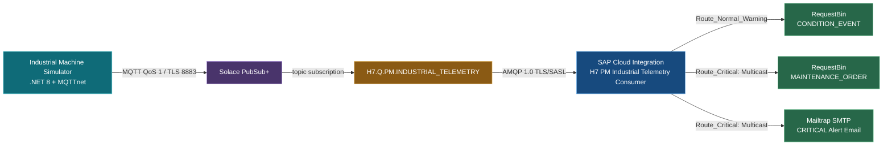
```mermaid
flowchart LR
    D[Industrial Machine Simulator\n.NET 8 + MQTTnet] -->|MQTT QoS 1 / TLS 8883| S[Solace PubSub+]
    S -->|topic subscription| Q[H7.Q.PM.INDUSTRIAL_TELEMETRY]
    Q -->|AMQP 1.0 TLS/SASL| CPI[SAP Cloud Integration\nH7 PM Industrial Telemetry Consumer]
    CPI -->|Route_Normal_Warning| HTTPA[RequestBin\nCONDITION_EVENT]
    CPI -->|Route_Critical: Multicast| HTTPB[RequestBin\nMAINTENANCE_ORDER]
    CPI -->|Route_Critical: Multicast| MAIL[Mailtrap SMTP\nCRITICAL Alert Email]

    classDef prod fill:#0f6b78,color:#fff,stroke:#58c7d1;
    classDef broker fill:#49346b,color:#fff,stroke:#a98bdc;
    classDef queue fill:#8a5a14,color:#fff,stroke:#e5b75f;
    classDef sap fill:#174a7e,color:#fff,stroke:#65a8e5;
    classDef backend fill:#276749,color:#fff,stroke:#77c99a;
    class D prod;
    class S broker;
    class Q queue;
    class CPI sap;
    class HTTPA,HTTPB,MAIL backend;
```

## 5.2 Arquitetura detalhada do consumidor

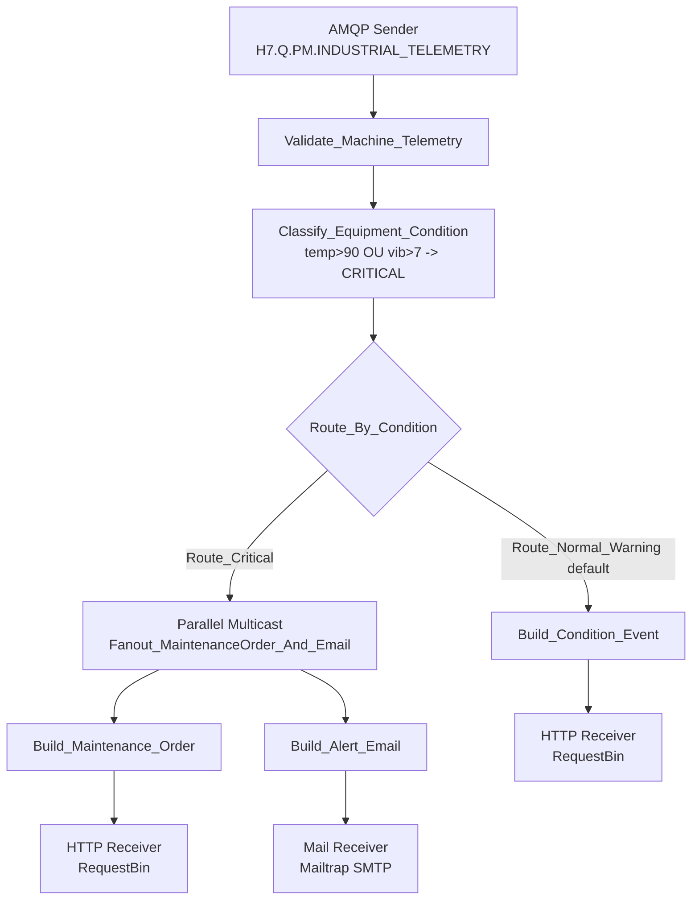
```mermaid
flowchart TD
    A[AMQP Sender\nH7.Q.PM.INDUSTRIAL_TELEMETRY] --> B[Validate_Machine_Telemetry]
    B --> C[Classify_Equipment_Condition\ntemp>90 OU vib>7 -> CRITICAL]
    C --> R{Route_By_Condition}
    R -->|Route_Critical| M[Parallel Multicast\nFanout_MaintenanceOrder_And_Email]
    R -->|Route_Normal_Warning default| E[Build_Condition_Event]
    M --> M1[Build_Maintenance_Order]
    M --> M2[Build_Alert_Email]
    M1 --> H1[HTTP Receiver\nRequestBin]
    M2 --> ML[Mail Receiver\nMailtrap SMTP]
    E --> H2[HTTP Receiver\nRequestBin]
```

## 5.3 Sequência ponta a ponta (evento crítico)

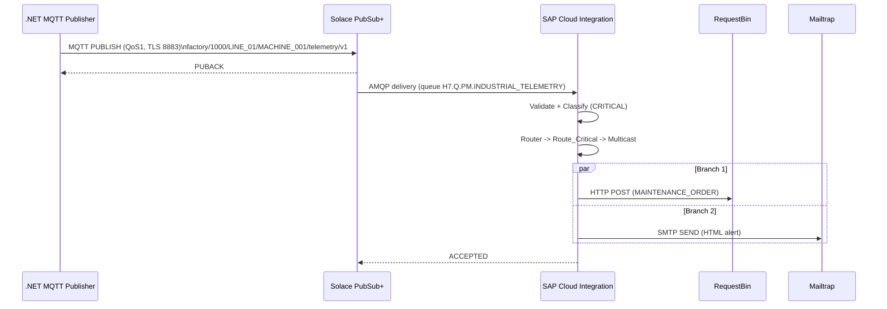
```mermaid
sequenceDiagram
    participant DEV as .NET MQTT Publisher
    participant SOL as Solace PubSub+
    participant CPI as SAP Cloud Integration
    participant REQ as RequestBin
    participant MAIL as Mailtrap

    DEV->>SOL: MQTT PUBLISH (QoS1, TLS 8883)\nfactory/1000/LINE_01/MACHINE_001/telemetry/v1
    SOL-->>DEV: PUBACK
    SOL->>CPI: AMQP delivery (queue H7.Q.PM.INDUSTRIAL_TELEMETRY)
    CPI->>CPI: Validate + Classify (CRITICAL)
    CPI->>CPI: Router -> Route_Critical -> Multicast
    par Branch 1
        CPI->>REQ: HTTP POST (MAINTENANCE_ORDER)
    and Branch 2
        CPI->>MAIL: SMTP SEND (HTML alert)
    end
    CPI-->>SOL: ACCEPTED
```

---

# 6. Preparação do ambiente .NET

O primeiro desafio do H7 não foi de integração, e sim de ambiente: o computador possuía o **.NET Runtime**, mas não o **.NET SDK**, impedindo `dotnet build`/`dotnet run`. Sem direitos administrativos, a solução foi um **SDK portátil**.

A primeira tentativa de extrair o SDK **dentro da pasta do OneDrive** falhou: o OneDrive tentou sincronizar milhares de arquivos pequenos simultaneamente à extração, gerando erros em cascata e travando o processo. A correção foi extrair o SDK para uma pasta **local, fora do OneDrive** (`%LOCALAPPDATA%\dotnet-sdk-portable`), mantendo apenas o código-fonte do projeto (poucos arquivos) na pasta sincronizada.

```powershell
$sdkLocal = "$env:LOCALAPPDATA\dotnet-sdk-portable"
Expand-Archive -Path $zip -DestinationPath $sdkLocal -Force
$env:DOTNET_ROOT = $sdkLocal
$env:PATH = "$sdkLocal;$env:PATH"
$env:DOTNET_MULTILEVEL_LOOKUP = "0"
```

Com o SDK ativo apenas na sessão do PowerShell, o projeto `H7Publisher` foi criado com `dotnet new console`, o pacote `MQTTnet` adicionado via `dotnet add package`, e o build validado com `dotnet build` antes de qualquer tentativa de conexão ao broker.

---

# 7. Infraestrutura do broker

## Evidência 01 — Queue de telemetria

Antes de qualquer publicação, criamos a queue que receberá os eventos MQTT roteados pelo broker. Diferente dos cenários anteriores, o volume esperado é de telemetria contínua e de baixo tamanho, por isso a quota foi dimensionada propositalmente menor.

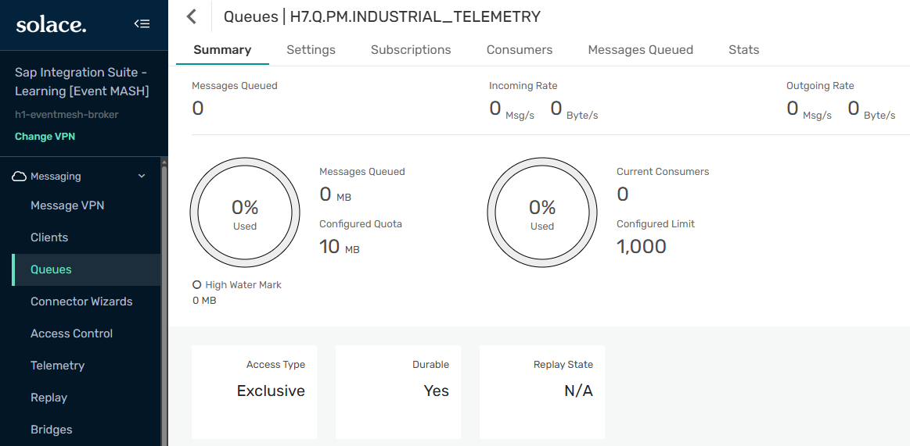

**O que esta evidência comprova:** a criação da `H7.Q.PM.INDUSTRIAL_TELEMETRY` como queue Durable e Exclusive, com quota de 10 MB — suficiente para um fluxo de telemetria de máquina, sem reservar capacidade excessiva. É o endpoint físico que tornará possível a interoperabilidade entre o produtor MQTT e o consumidor AMQP, funcionando como a "ponte" entre os dois protocolos.

## Evidência 02 — Topic subscription da telemetria

Para que a queue capture qualquer máquina, de qualquer linha e planta, aplicamos uma subscription com wildcards de nível único nos três primeiros segmentos variáveis do topic.

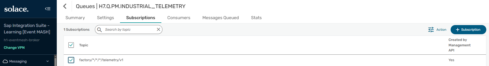

**O que esta evidência comprova:** a subscription `factory/*/*/*/telemetry/v1` está associada à queue, atraindo telemetria de qualquer combinação de planta, linha e máquina que publique nesse padrão. Essa é a mesma técnica de wildcard de nível único explorada no H5, agora aplicada a um domínio de manutenção industrial em vez de qualidade.

---

# 8. Publicação via MQTT em .NET

## Evidência 03 — Interoperabilidade de protocolo comprovada

Este é o momento mais simbólico do H7: uma mensagem publicada via **MQTT** aparece armazenada em uma **queue Solace**, exatamente como qualquer outra mensagem Guaranteed publicada via AMQP nos cenários anteriores.

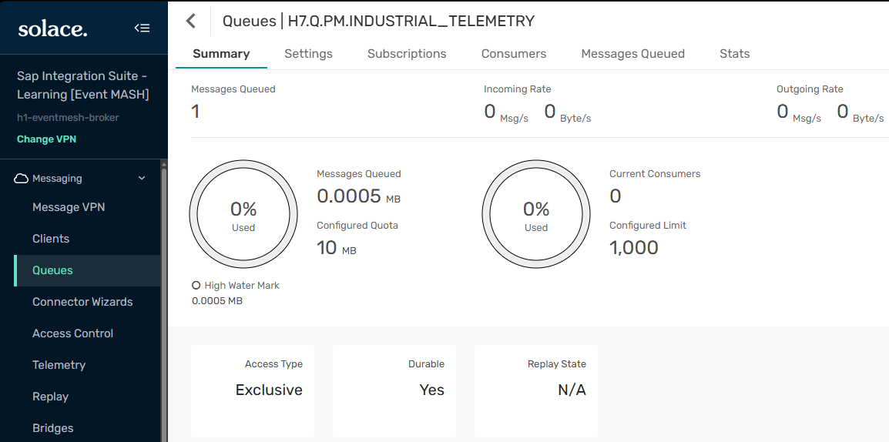

**O que esta evidência comprova:** o broker tratou a publicação MQTT com a mesma semântica de Guaranteed Messaging usada em AMQP — a mensagem foi persistida na queue Durable, independentemente do protocolo de entrada. Isso prova, de forma concreta, que o Event Mesh do Solace é **protocol-agnostic**: o mesmo dado de negócio pode entrar por MQTT e ser consumido por AMQP sem qualquer adaptação intermediária ou gateway de tradução manual.

## Evidência 04 — Publisher .NET conectado

O console do publisher .NET mostra o ciclo de vida completo de uma publicação MQTT: conexão, publicação e confirmação.

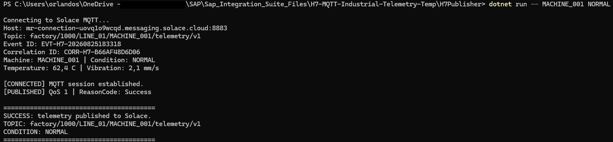

**O que esta evidência comprova:** o cliente `MQTTnet` estabeleceu uma sessão MQTT sobre TLS na porta 8883, publicou a telemetria com QoS 1 e recebeu confirmação de sucesso do broker (`ReasonCode: Success`). O topic dinâmico construído a partir dos parâmetros de máquina (`factory/1000/LINE_01/MACHINE_001/telemetry/v1`) demonstra que o mesmo publisher pode representar qualquer máquina da planta, bastando variar os argumentos de linha de comando.

---

# 9. Backends de destino

## Evidência 05 — Credenciais SMTP do Mailtrap

Para capturar o e-mail de alerta sem enviá-lo a uma caixa real, utilizamos o Mailtrap como sandbox SMTP. A tela de configuração SMTP expõe host, porta e usuário (a senha permanece mascarada por segurança).

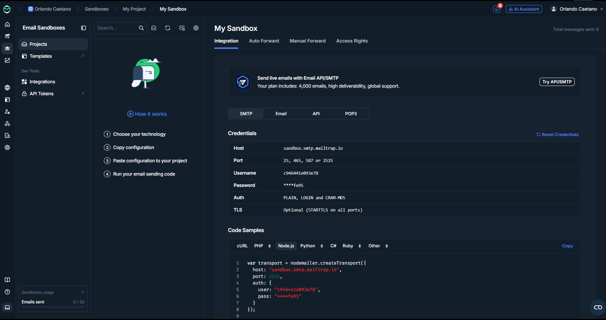

**O que esta evidência comprova:** a inbox de teste está pronta para receber e-mails via SMTP com STARTTLS na porta 587, usando autenticação Plain User/Password. O uso de uma sandbox de e-mail é uma prática recomendada em laboratórios: o comportamento do Mail Adapter é testado de ponta a ponta sem risco de enviar notificações reais a destinatários inexistentes.

## Evidência 06 — Security Material do Mailtrap

A senha do Mailtrap nunca é escrita diretamente no iFlow. Ela foi cadastrada como User Credentials no Security Material do SAP Cloud Integration.

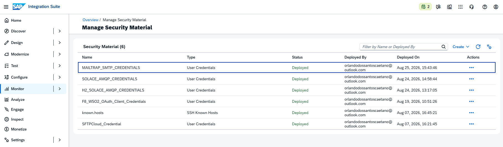

**O que esta evidência comprova:** o alias `MAILTRAP_SMTP_CREDENTIALS` está implantado (`Deployed`) e disponível para ser referenciado pelo Mail Receiver Adapter, seguindo a mesma disciplina de segurança aplicada em todos os cenários anteriores do Bloco H — nenhuma senha em texto plano dentro do desenho do fluxo.

## Evidência 07 — Backend HTTP pronto

Como o plano gratuito do Webhook.site permite apenas um endpoint, optamos por um RequestBin dedicado ao H7, compartilhado pelos dois tipos de evento HTTP (condição normal/warning e ordem de manutenção), diferenciados pelo header `X-Event-Type`.

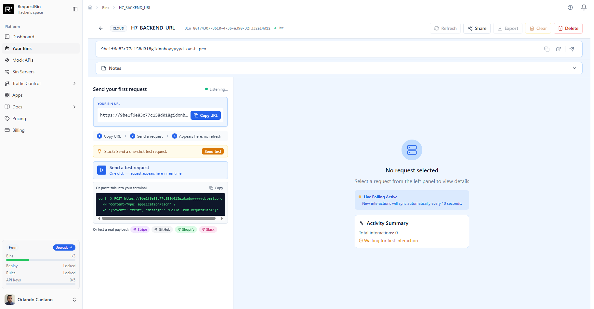

**O que esta evidência comprova:** o endpoint `H7_BACKEND_URL` está ativo e aguardando requisições, pronto para registrar tanto eventos de condição simples quanto ordens de manutenção, sem necessidade de múltiplos serviços externos.

---

# 10. Configuração do consumidor CPI

## Evidência 08 — AMQP Connection

O consumidor `H7_PM_Industrial_Telemetry_Consumer` lê a queue de telemetria via AMQP 1.0, com a mesma credencial compartilhada do broker usada em H2 a H6.

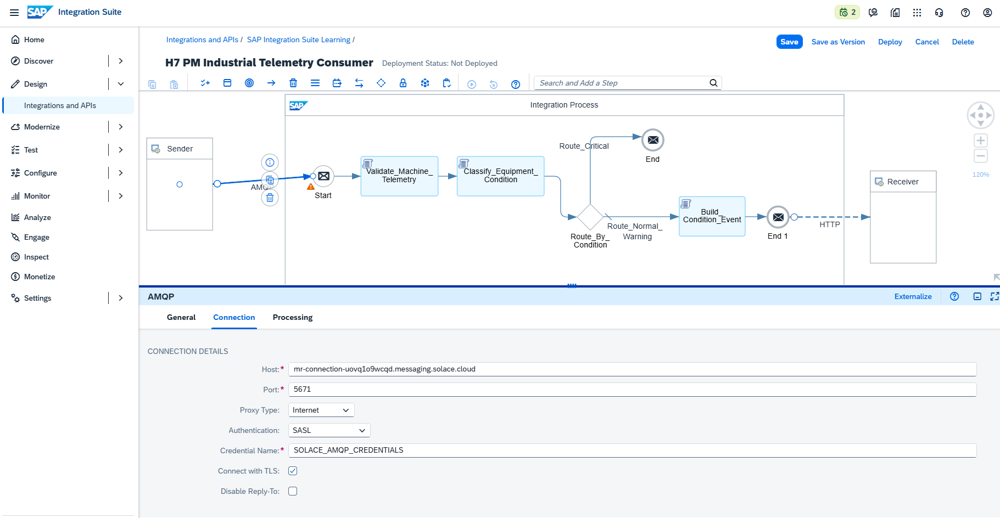

**O que esta evidência comprova:** conexão AMQP 1.0 segura via TLS e SASL, na porta 5671, reutilizando o alias `SOLACE_AMQP_CREDENTIALS`. Este é o lado "de saída" da ponte de protocolos: embora o dado tenha entrado via MQTT, o consumo continua no protocolo AMQP já dominado nos cenários anteriores, sem exigir nenhum adaptador MQTT no lado do CPI.

## Evidência 09 — AMQP Processing

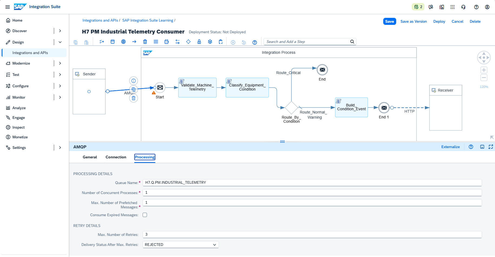

**O que esta evidência comprova:** o consumidor lê exclusivamente `H7.Q.PM.INDUSTRIAL_TELEMETRY`, com concorrência 1, prefetch 1 e três retries antes de um outcome final `REJECTED` — a mesma disciplina de resiliência aplicada em H6, garantindo que uma falha de rede ou backend não prenda a fila indefinidamente.

## Evidência 10 — Router de condição

O coração da lógica de negócio do H7: um Router com duas rotas, uma condicional (`Route_Critical`) e uma default (`Route_Normal_Warning`).

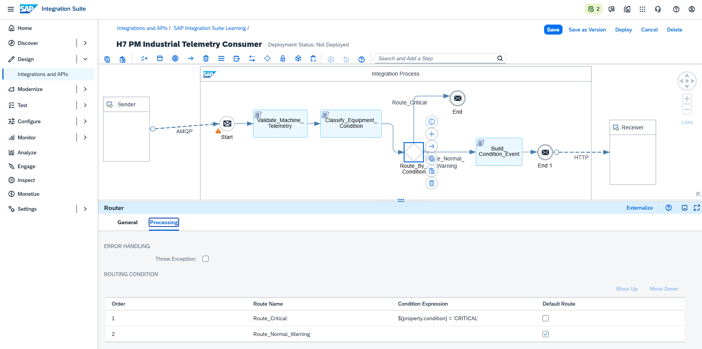

**O que esta evidência comprova:** a árvore de decisão do consumidor está corretamente modelada — `Route_Critical` avalia `${property.condition} = 'CRITICAL'`, enquanto `Route_Normal_Warning` captura tudo o que não atender a essa condição, sem exigir uma segunda expressão explícita. Essa configuração garante que **todo** evento seja roteado para exatamente um caminho, sem lacunas.

## Evidência 11 — HTTP Receiver da rota default

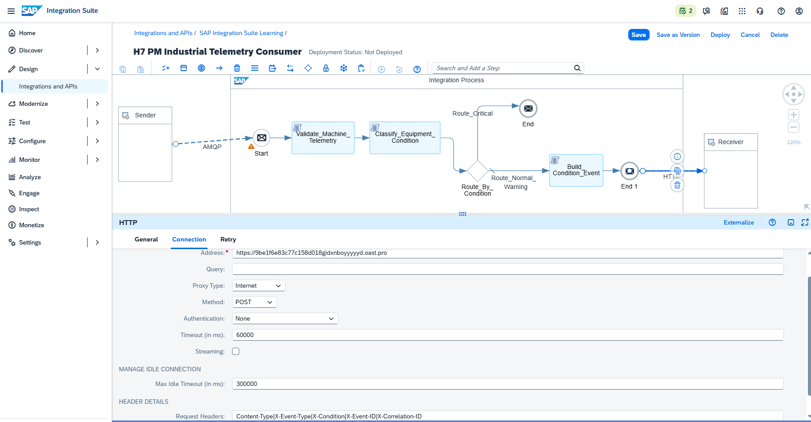

**O que esta evidência comprova:** eventos `NORMAL` e `WARNING`, após serem transformados pelo `Build_Condition_Event`, são entregues ao RequestBin com headers de rastreabilidade completos (`Content-Type`, `X-Event-Type`, `X-Condition`, `X-Event-ID`, `X-Correlation-ID`). Esta é a rota "de registro simples" — sem disparo de ordem de manutenção nem e-mail.

## Evidência 12 — Mail Adapter: Connection

A configuração de conexão do Mail Receiver Adapter é o ponto mais específico do H7. Diferente do HTTP Receiver, o Mail Adapter não expõe um campo de porta separado — a porta faz parte do próprio endereço.

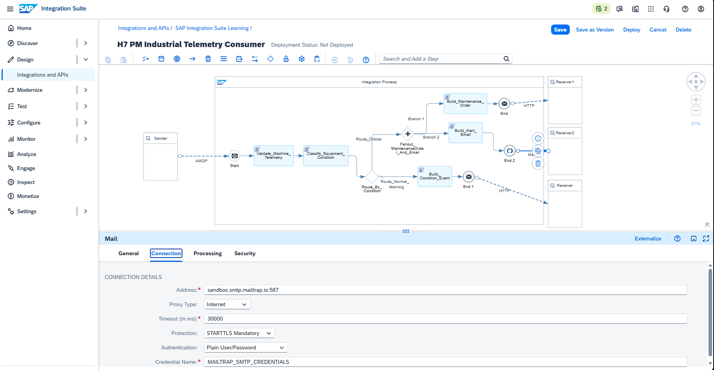

**O que esta evidência comprova:** a conexão SMTP aponta para `sandbox.smtp.mailtrap.io:587`, com `Protection = STARTTLS Mandatory` e autenticação `Plain User/Password` via credencial `MAILTRAP_SMTP_CREDENTIALS`. O Integration Suite restringe conexões de e-mail para a internet pública às portas 587 (STARTTLS) ou 465 (SMTPS) — por isso a porta precisou ser embutida no `Address`, e não informada em um campo dedicado.

## Evidência 13 — Mail Adapter: Processing

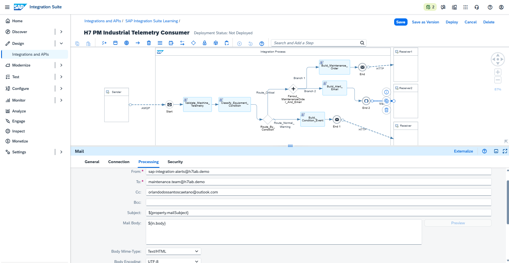

**O que esta evidência comprova:** os atributos do e-mail — `From`, `To`, `Cc` (endereço pessoal do autor, mantido como contato de rastreamento do laboratório), `Subject` dinâmico via `${property.mailSubject}` e `Mail Body` via `${in.body}` com `Body Mime-Type = Text/HTML` — estão corretamente configurados para que o Groovy `Build_Alert_Email` controle integralmente o conteúdo e a aparência da notificação.

---

# 11. Groovy scripts do consumidor

## 11.1 `Validate_Machine_Telemetry`

Primeiro contato com o evento: garante que o contrato de dados está íntegro antes de qualquer decisão de negócio.

```groovy
import com.sap.gateway.ip.core.customdev.util.Message
import groovy.json.JsonSlurper

def Message processData(Message message) {
    String body = message.getBody(String)
    if (!body?.trim()) {
        throw new IllegalArgumentException("Telemetry payload is empty.")
    }
    def event = new JsonSlurper().parseText(body)

    ["specversion","type","source","id","time","domain","correlationId","data"].each { f ->
        if (event[f] == null || event[f].toString().trim().isEmpty()) {
            throw new IllegalArgumentException("Mandatory event field '${f}' is missing.")
        }
    }
    if (event.type != "IndustrialMachineTelemetryReceived") {
        throw new IllegalArgumentException("Unsupported event type '${event.type}'.")
    }
    if (event.domain != "SAP_PM") {
        throw new IllegalArgumentException("Unsupported event domain '${event.domain}'.")
    }

    def d = event.data
    ["plant","productionLine","machineId","equipmentNumber","temperatureCelsius","vibrationMmS","operatingState"].each { f ->
        if (d[f] == null) {
            throw new IllegalArgumentException("Mandatory telemetry field '${f}' is missing.")
        }
    }

    message.setProperty("eventId", event.id.toString())
    message.setProperty("correlationId", event.correlationId.toString())
    message.setProperty("plant", d.plant.toString())
    message.setProperty("productionLine", d.productionLine.toString())
    message.setProperty("machineId", d.machineId.toString())
    message.setProperty("equipmentNumber", d.equipmentNumber.toString())
    message.setProperty("temperature", d.temperatureCelsius.toString())
    message.setProperty("vibration", d.vibrationMmS.toString())

    message.setHeader("X-Event-ID", event.id.toString())
    message.setHeader("X-Correlation-ID", event.correlationId.toString())
    return message
}
```

## 11.2 `Classify_Equipment_Condition`

A regra de negócio central: converte medições brutas em uma classificação de severidade.

```groovy
import com.sap.gateway.ip.core.customdev.util.Message
import groovy.json.JsonSlurper

def Message processData(Message message) {
    String body = message.getBody(String)
    def event = new JsonSlurper().parseText(body)
    def d = event.data

    BigDecimal temp = new BigDecimal(d.temperatureCelsius.toString())
    BigDecimal vib  = new BigDecimal(d.vibrationMmS.toString())

    String condition
    if (temp > 90 || vib > 7) {
        condition = "CRITICAL"
    } else if ((temp >= 75 && temp <= 90) || (vib >= 4 && vib <= 7)) {
        condition = "WARNING"
    } else {
        condition = "NORMAL"
    }

    message.setProperty("condition", condition)
    message.setHeader("X-Condition", condition)
    return message
}
```

## 11.3 `Build_Condition_Event` (rota default)

```groovy
import com.sap.gateway.ip.core.customdev.util.Message
import groovy.json.JsonOutput
import groovy.json.JsonSlurper
import java.time.OffsetDateTime
import java.time.ZoneOffset

def Message processData(Message message) {
    def event = new JsonSlurper().parseText(message.getBody(String))
    def d = event.data
    String condition = message.getProperty("condition")?.toString()

    def out = [
        status: "TELEMETRY_PROCESSED",
        eventType: "CONDITION_EVENT",
        condition: condition,
        processedBy: "SAP_INTEGRATION_SUITE",
        processedAt: OffsetDateTime.now(ZoneOffset.UTC).toString(),
        event: [ eventId: event.id, correlationId: event.correlationId, source: event.source, domain: event.domain ],
        telemetry: [
            plant: d.plant, productionLine: d.productionLine, machineId: d.machineId,
            equipmentNumber: d.equipmentNumber, temperatureCelsius: d.temperatureCelsius,
            vibrationMmS: d.vibrationMmS, operatingState: d.operatingState
        ]
    ]
    message.setBody(JsonOutput.prettyPrint(JsonOutput.toJson(out)))
    message.setHeader("Content-Type", "application/json")
    message.setHeader("X-Event-Type", "CONDITION_EVENT")
    message.setHeader("X-Condition", condition)
    return message
}
```

## 11.4 `Build_Maintenance_Order` (branch 1 do Multicast)

```groovy
import com.sap.gateway.ip.core.customdev.util.Message
import groovy.json.JsonOutput
import groovy.json.JsonSlurper
import java.time.OffsetDateTime
import java.time.ZoneOffset

def Message processData(Message message) {
    def event = new JsonSlurper().parseText(message.getBody(String))
    def d = event.data

    String moNumber = "MO-" + System.currentTimeMillis().toString().substring(4)

    def order = [
        status: "MAINTENANCE_ORDER_CREATED",
        eventType: "MAINTENANCE_ORDER",
        priority: "HIGH",
        maintenanceOrder: moNumber,
        orderType: "PM01",
        createdBy: "SAP_INTEGRATION_SUITE",
        createdAt: OffsetDateTime.now(ZoneOffset.UTC).toString(),
        event: [ eventId: event.id, correlationId: event.correlationId ],
        equipment: [
            plant: d.plant, productionLine: d.productionLine, machineId: d.machineId,
            equipmentNumber: d.equipmentNumber, temperatureCelsius: d.temperatureCelsius,
            vibrationMmS: d.vibrationMmS
        ],
        recommendedAction: "Immediate corrective maintenance required"
    ]
    message.setBody(JsonOutput.prettyPrint(JsonOutput.toJson(order)))
    message.setHeader("Content-Type", "application/json")
    message.setHeader("X-Event-Type", "MAINTENANCE_ORDER")
    message.setProperty("maintenanceOrder", moNumber)
    return message
}
```

## 11.5 `Build_Alert_Email` (branch 2 do Multicast)

```groovy
import com.sap.gateway.ip.core.customdev.util.Message
import groovy.json.JsonSlurper

def Message processData(Message message) {
    def event = new JsonSlurper().parseText(message.getBody(String))
    def d = event.data
    String mo = message.getProperty("maintenanceOrder")?.toString() ?: "MO-PENDING"

    String html = """<html><body style="font-family:Arial,sans-serif">
<h2 style="color:#c0392b">CRITICAL EQUIPMENT ALERT</h2>
<p>Uma condição crítica foi detectada e uma ordem de manutenção foi criada automaticamente.</p>
<table border="0" cellpadding="6" style="border-collapse:collapse">
<tr><td><b>Ordem de Manutenção</b></td><td>${mo}</td></tr>
<tr><td><b>Equipamento</b></td><td>${d.equipmentNumber}</td></tr>
<tr><td><b>Máquina</b></td><td>${d.machineId}</td></tr>
<tr><td><b>Linha</b></td><td>${d.productionLine}</td></tr>
<tr><td><b>Planta</b></td><td>${d.plant}</td></tr>
<tr><td><b>Temperatura</b></td><td style="color:#c0392b">${d.temperatureCelsius} C (limite 90)</td></tr>
<tr><td><b>Vibração</b></td><td style="color:#c0392b">${d.vibrationMmS} mm/s (limite 7)</td></tr>
<tr><td><b>Estado</b></td><td>CRITICAL</td></tr>
</table>
<p><b>Ação recomendada:</b> intervenção imediata de manutenção.</p>
<p style="color:#888">Notificação automática - SAP Integration Suite - Event Mesh H7</p>
</body></html>"""

    message.setBody(html)
    message.setProperty("mailSubject", "[CRITICAL] Maintenance Order ${mo} - ${d.machineId} / ${d.productionLine}")
    message.setHeader("Content-Type", "text/html")
    return message
}
```

---

# 12. Deploy e caminho crítico completo

## Evidência 14 — Consumer implantado

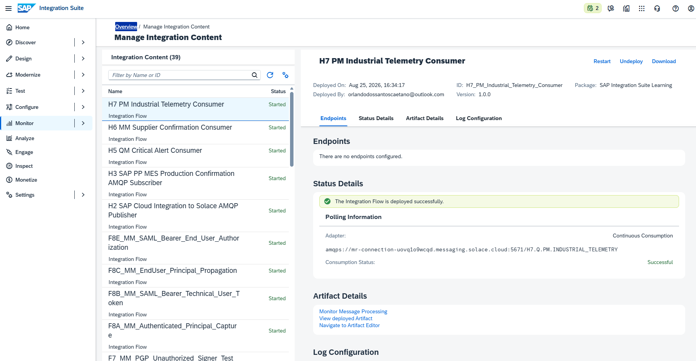

**O que esta evidência comprova:** o iFlow `H7_PM_Industrial_Telemetry_Consumer` foi implantado com sucesso e estabeleceu consumo contínuo (`Consumption Status: Successful`) sobre a queue de telemetria via `amqps://.../H7.Q.PM.INDUSTRIAL_TELEMETRY`. A partir deste ponto, qualquer telemetria publicada — seja NORMAL, WARNING ou CRITICAL — será processada automaticamente pelo pipeline completo.

## Evidência 15 — Telemetria crítica publicada

Com o backend em condições de sucesso e o consumidor ativo, publicamos deliberadamente uma medição acima dos dois limites simultaneamente (temperatura e vibração), para provar o caminho mais exigente da árvore de decisão.

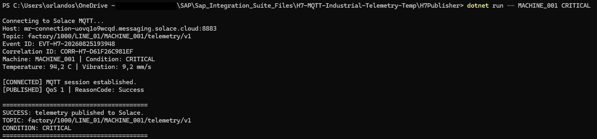

**O que esta evidência comprova:** o publisher .NET conectou via MQTT/TLS, publicou com QoS 1 e recebeu `ReasonCode: Success` do broker, com temperatura `94,2°C` (limite 90) e vibração `9,2 mm/s` (limite 7) — ambos os parâmetros ultrapassando o threshold de criticidade definido no `Classify_Equipment_Condition`. Esse é o evento que, ao ser processado pelo CPI, deve acionar o Multicast completo.

## Evidência 16 — Multicast crítico processado

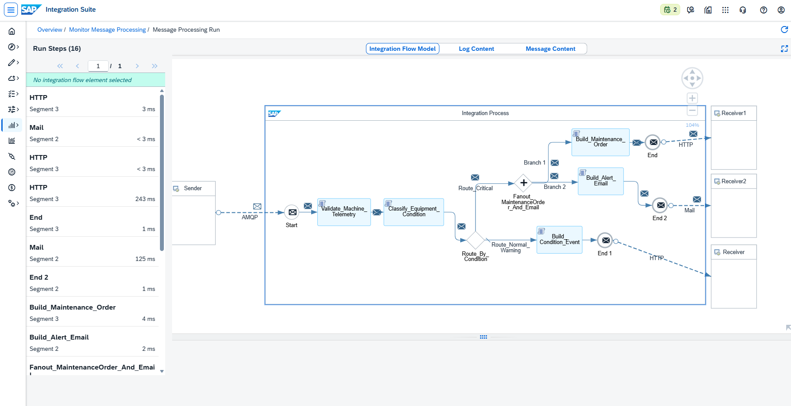

**O que esta evidência comprova:** o Run Steps do Message Processing Log mostra a execução percorrendo `AMQP → Validate → Classify → Route_Critical → Fanout_MaintenanceOrder_And_Email`, com os dois branches disparados na mesma execução: `Build_Maintenance_Order → HTTP` (poucos milissegundos) e `Build_Alert_Email → Mail` (cerca de 125 ms, correspondendo ao handshake SMTP com o Mailtrap). O modelo visual do fluxo confirma que ambos os caminhos paralelos foram efetivamente percorridos a partir de uma única mensagem de entrada.

## Evidência 17 — E-mail crítico recebido

O resultado mais tangível de todo o cenário: um e-mail HTML real, gerado automaticamente a partir de uma condição de negócio, capturado na sandbox do Mailtrap.

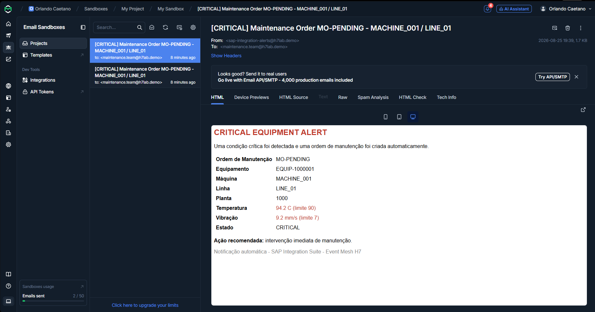

**O que esta evidência comprova:** o Mail Receiver Adapter enviou com sucesso, via SMTP/STARTTLS, um e-mail com assunto `[CRITICAL] Maintenance Order MO-PENDING - MACHINE_001 / LINE_01` e corpo HTML formatado, exibindo em destaque vermelho a temperatura (94.2°C, limite 90) e a vibração (9.2 mm/s, limite 7) que motivaram o alerta, junto da ação recomendada. Esta é a materialização prática de manutenção condicional automatizada: uma leitura de sensor se transformou, sem intervenção humana, em uma notificação acionável para a equipe responsável.

## Evidência 18 — Confirmação de entrega no broker

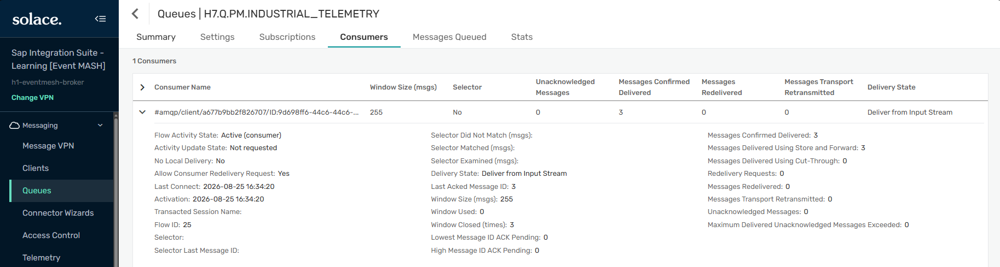

**O que esta evidência comprova:** o consumer flow do Solace, na aba Consumers, apresenta `Messages Confirmed Delivered: 3`, `Messages Redelivered: 0` e `Unacknowledged Messages: 0` — evidenciando que todas as mensagens processadas até este ponto (o teste inicial NORMAL e os eventos CRITICAL) foram entregues e reconhecidas com sucesso, sem qualquer necessidade de reentrega pelo broker.

## Evidência 19 — Queue drenada

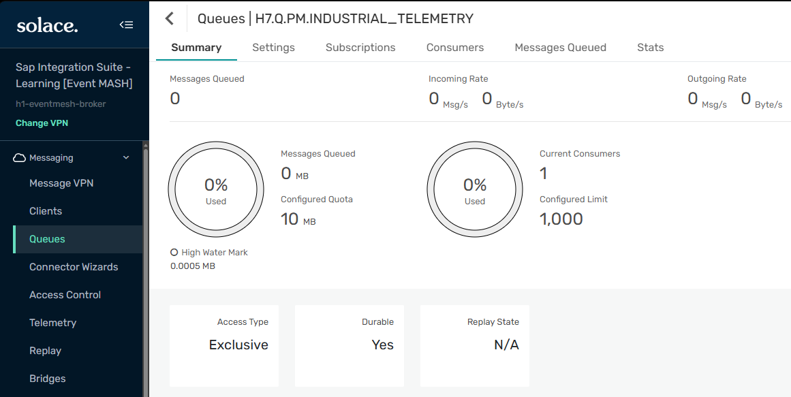

**O que esta evidência comprova:** após o processamento, a queue retorna a `Messages Queued: 0`, com `Current Consumers: 1` e uso de quota próximo de zero (`High Water Mark: 0.0005 MB` de 10 MB configurados). O fluxo completo — publicação MQTT, roteamento pelo broker, consumo AMQP e processamento no CPI — não deixou nenhuma mensagem pendente.

## Evidência 20 — Ordem de manutenção recebida

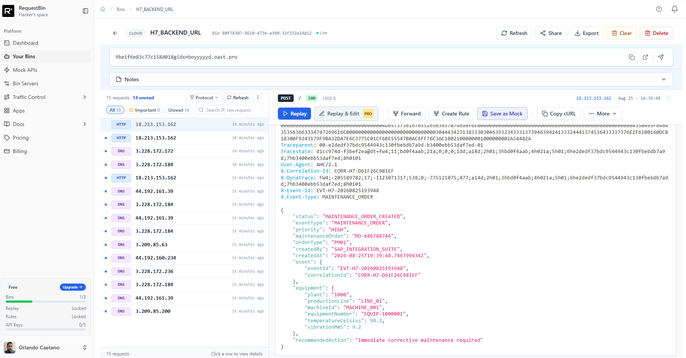

**O que esta evidência comprova:** o branch `Build_Maintenance_Order → HTTP` do Multicast entregou ao RequestBin um payload completo de ordem de manutenção, com `HTTP 200`, cabeçalho `X-Event-Type: MAINTENANCE_ORDER` e o número de ordem gerado dinamicamente (`MO-686788746`), junto de todos os dados de equipamento e telemetria que originaram o alerta. Este payload comprova que o branch de ordem de manutenção, isoladamente, funcionou perfeitamente — o número de ordem foi gerado corretamente **dentro do seu próprio contexto de execução**.

---

# 13. Validando o outro braço da árvore: rota WARNING

Testar apenas o caminho crítico deixaria a demonstração incompleta — seria impossível provar que o Router de fato **discrimina** por severidade, e não que "tudo vira e-mail". Por isso, publicamos deliberadamente um evento na faixa intermediária.

## Evidência 21 — Telemetria WARNING publicada

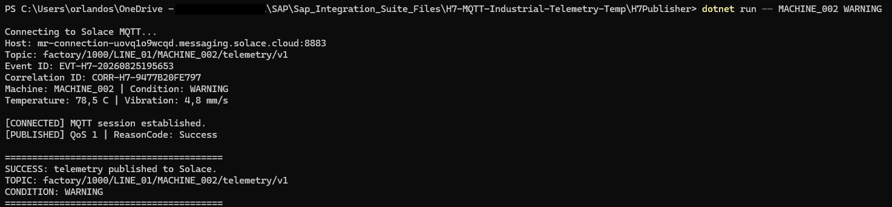

**O que esta evidência comprova:** o publisher .NET publicou uma segunda telemetria, desta vez para `MACHINE_002`, com temperatura `78,5°C` e vibração `4,8 mm/s` — ambos os valores dentro da faixa intermediária (75–90°C ou 4–7 mm/s), que o `Classify_Equipment_Condition` deve rotular como `WARNING`, não `CRITICAL`. A conexão MQTT e a confirmação `ReasonCode: Success` seguem o mesmo padrão do evento crítico.

## Evidência 22 — Rota WARNING processada sem Multicast

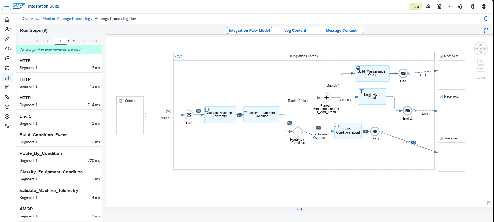

**O que esta evidência comprova:** o Run Steps (9 segmentos) mostra um caminho **visivelmente mais curto** do que o do evento crítico — `AMQP → Validate_Machine_Telemetry → Classify_Equipment_Condition → Route_By_Condition → Build_Condition_Event → HTTP → End 1` — sem qualquer passagem pelo `Fanout_MaintenanceOrder_And_Email` nem pelo Mail Adapter. Isso confirma, de forma inequívoca, que o Router de fato bifurca o processamento conforme a severidade calculada, e que apenas eventos `CRITICAL` acionam o fan-out completo.

## Evidência 23 — Evento de condição recebido no backend

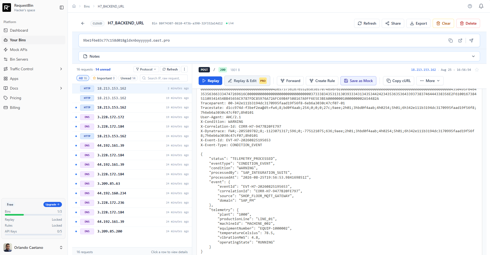

**O que esta evidência comprova:** o RequestBin recebeu um payload do tipo `CONDITION_EVENT` (não `MAINTENANCE_ORDER`), com o cabeçalho `X-Condition: WARNING` e os dados da `MACHINE_002` (temperatura 78.5, vibração 4.8, `operatingState: RUNNING`). A diferenciação de `eventType` entre os dois braços do Router permite que o mesmo backend HTTP sirva a ambos os fluxos sem ambiguidade.

## Evidência 24 — Contagem acumulada de entregas confirmadas

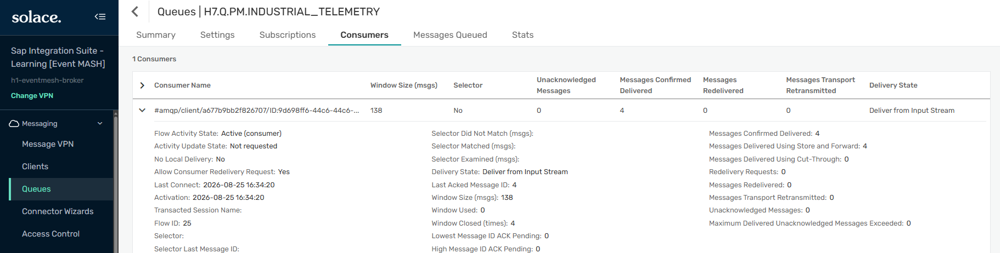

**O que esta evidência comprova:** o contador de entregas confirmadas avançou de 3 para 4 (`Messages Confirmed Delivered: 4`), refletindo exatamente a soma de todas as mensagens processadas ao longo do cenário — o teste inicial NORMAL, os dois eventos CRITICAL e o evento WARNING —, sempre com zero redeliveries e zero mensagens não reconhecidas. Esse número fechado numericamente é a prova estatística final de que nenhuma mensagem foi perdida ao longo de todo o experimento de interoperabilidade MQTT→AMQP.

---

# 14. Storytelling técnico consolidado

O H7 nasceu de uma pergunta simples: será que o Event Mesh construído nos seis cenários anteriores — todo ele operado via AMQP — realmente funciona como uma malha de eventos **agnóstica de protocolo**, ou é, na prática, apenas uma coleção de integrações AMQP?

A resposta começou pela escolha deliberada de uma tecnologia nova para o producer: .NET/C# com MQTTnet, em vez de reaproveitar o Node.js já dominado. O primeiro obstáculo não foi técnico de integração, e sim de ambiente — o SDK .NET não podia ser extraído dentro do OneDrive sem que a sincronização em tempo real corrompesse o processo. Resolvido com um SDK portátil em pasta local, o publisher conectou ao Solace via MQTT sobre TLS, publicou telemetria com QoS 1, e o broker armazenou a mensagem em uma queue Durable exatamente como faria com qualquer publicação AMQP.

Do lado do consumo, o SAP Cloud Integration nunca soube que a mensagem havia entrado via MQTT. Ele simplesmente leu a queue via AMQP 1.0, como em todos os cenários anteriores. Essa transparência de protocolo é o núcleo da prova de conceito do H7.

A partir da telemetria, o consumidor assumiu um papel de decisão: classificar a severidade e agir de forma proporcional. Um evento dentro dos limites normais ou em alerta segue um caminho simples de registro. Um evento crítico — temperatura e vibração simultaneamente acima do limite — aciona um Multicast paralelo que, em uma única execução, cria uma ordem de manutenção formal e dispara um e-mail HTML real para a equipe responsável.

O teste do braço crítico revelou também uma sutileza arquitetural importante: como os dois branches do Multicast operam sobre cópias isoladas do Exchange, o número de ordem gerado no branch da ordem de manutenção (`MO-686788746`) não estava automaticamente disponível para o branch do e-mail, que exibiu `MO-PENDING`. Longe de ser um defeito, esse comportamento é uma característica conhecida do padrão de fan-out paralelo e foi documentado como aprendizado arquitetural, não como falha a esconder.

Por fim, testamos deliberadamente o braço oposto da árvore de decisão — um evento `WARNING` — para provar que o Router de fato discrimina por severidade, e que o Multicast só é acionado quando a condição realmente exige. O contador final de entregas confirmadas pelo broker (`4`, com zero redeliveries) fecha a narrativa: cada mensagem publicada, seja qual for a severidade, foi entregue, processada e reconhecida exatamente uma vez.

---

# 15. Troubleshooting e aprendizados

## 15.1 Extração de SDK dentro do OneDrive corrompe o processo

Extrair o `.NET SDK` (milhares de arquivos pequenos) dentro de uma pasta sincronizada pelo OneDrive gerou erros em cascata, pois o cliente de sincronização tentava processar cada arquivo em tempo real durante a extração. A correção foi extrair o SDK para uma pasta local fora do OneDrive (`%LOCALAPPDATA%`), mantendo apenas o código do projeto na pasta sincronizada.

## 15.2 Mail Adapter não expõe campo de porta separado

A porta SMTP deve ser embutida diretamente no campo `Address` (`sandbox.smtp.mailtrap.io:587`). O Integration Suite restringe conexões de e-mail para a internet pública às portas 587 (STARTTLS) e 465 (SMTPS); tentar usar outra porta ou deixar a porta fora do endereço gera um alerta de validação.

## 15.3 Multicast paralelo isola Exchange Properties entre branches

Uma property criada em um branch do Parallel Multicast (`maintenanceOrder`, definida em `Build_Maintenance_Order`) não é automaticamente visível no branch irmão (`Build_Alert_Email`), pois cada branch opera sobre uma cópia independente do Exchange. O e-mail exibiu `MO-PENDING` como valor padrão, enquanto o payload HTTP exibiu o número real gerado. Para compartilhar um valor entre branches de um Multicast paralelo, a geração deve ocorrer **antes** da bifurcação (por exemplo, no próprio `Classify_Equipment_Condition` ou em um Content Modifier imediatamente anterior ao Multicast).

## 15.4 Rodar duas vezes para popular o Trace

A primeira execução após o Deploy processa normalmente, mas o Trace detalhado (corpo e headers de cada step no Run Steps) só é gravado quando essa opção já está habilitada previamente na sessão de Monitor; por isso, uma segunda execução foi necessária para capturar o payload completo em cada segmento.

---

# 16. Boas práticas aplicadas

1. Producer em tecnologia adicional (.NET) para diversificar o portfólio de clientes do Event Mesh.
2. SDK/runtime portátil isolado de pastas sincronizadas por serviços de nuvem.
3. QoS 1 (At Least Once) para telemetria que alimenta decisões operacionais.
4. Taxonomia de topics hierárquica e versionada para chão de fábrica.
5. Validação defensiva do contrato de telemetria antes de qualquer decisão de negócio.
6. Regra de classificação centralizada em um único step, fácil de auditar e ajustar.
7. Router com rota default explícita, garantindo cobertura de 100% dos casos.
8. Multicast paralelo para ações independentes (registro HTTP e notificação por e-mail).
9. Credenciais SMTP e AMQP mantidas em Security Material, nunca no desenho do iFlow.
10. E-mail HTML com dados de contexto suficientes para ação imediata da equipe de manutenção.
11. Teste dos dois braços da árvore de decisão (crítico e não crítico), evitando viés de demonstração.
12. Triangulação de evidências entre producer, broker, CPI e os dois backends de destino.

---

# 17. Recomendações para produção

- substituir o Mailtrap por um relay SMTP corporativo real, com DKIM/SPF configurados;
- implementar deduplicação de ordens de manutenção por Correlation ID, evitando ordens duplicadas em cenários de redelivery;
- propagar identificadores gerados (como o número de ordem) antes do Multicast, evitando divergência entre branches;
- integrar a ordem de manutenção a uma API real de Plant Maintenance (SAP PM) em vez de um backend de teste;
- adicionar um segundo canal de alerta (SMS, Teams, PagerDuty) para condições críticas, além do e-mail;
- implementar Last Will and Testament no cliente MQTT para detectar desconexão de sensores;
- avaliar QoS 2 para telemetria excepcionalmente sensível a duplicidade;
- monitorar a taxa de mensagens `CRITICAL` como indicador de saúde da planta;
- versionar o contrato de telemetria (`/v1`) e planejar compatibilidade retroativa;
- aplicar TLS mútuo (mTLS) na conexão MQTT para autenticação forte de dispositivos IoT em produção.

---

# 18. Matriz de validação

| Capability | Resultado |
|---|---|
| Publisher MQTT em .NET/C# | ✅ |
| SDK portátil sem privilégios administrativos | ✅ |
| Publicação QoS 1 sobre TLS (8883) | ✅ |
| Interoperabilidade MQTT → Solace → AMQP | ✅ |
| Consumo AMQP 1.0 pelo SAP Cloud Integration | ✅ |
| Validação defensiva do contrato de telemetria | ✅ |
| Classificação de condição (NORMAL/WARNING/CRITICAL) | ✅ |
| Router com rota condicional e rota default | ✅ |
| Parallel Multicast para fan-out crítico | ✅ |
| Ordem de manutenção entregue via HTTP | ✅ |
| E-mail HTML real entregue via SMTP/Mailtrap | ✅ |
| Rota default (WARNING) validada isoladamente | ✅ |
| Zero redeliveries, zero mensagens perdidas | ✅ |
| Isolamento de properties em Multicast documentado | ✅ |

---

# 19. Próximo cenário — H8

## H8 — Consolidação do Event Mesh e Matriz Comparativa do Bloco H

Com H1 a H7 concluídos, o Bloco H já demonstrou fundamentos, publicação, consumo, escala horizontal, roteamento por topic, resiliência (DMQ/Retry/Replay) e interoperabilidade de protocolo (MQTT/AMQP). O H8 será um cenário de **consolidação**, reunindo os padrões praticados em uma matriz comparativa e, se o tempo permitir antes da certificação, um cenário combinado de ponta a ponta que integra múltiplos domínios de negócio (SAP MM, PP, QM, WM, PM) sob um único Event Mesh, encerrando o bloco com uma visão arquitetural unificada.

---

# 20. Navegação

**Cenário anterior:** [H6 — Dead Message Queue, Retry, Recuperação Operacional e Message Replay](./37-h6-solace-dead-letter-retry-replay.md)

**Próximo cenário:** [H8 — Consolidação do Event Mesh](./39-h8-event-mesh-consolidation.md)

---

# 21. Referências oficiais

## SAP

- [Mail Adapter — SAP Help Portal](https://help.sap.com/docs/cloud-integration/sap-cloud-integration/mail-adapter)
- [Configure the AMQP Sender Adapter](https://help.sap.com/docs/cloud-integration/sap-cloud-integration/configure-amqp-sender-adapter)
- [Discovering Event-Driven Integration with SAP Integration Suite, advanced event mesh](https://learning.sap.com/courses/discovering-event-driven-integration-with-sap-integration-suite-advanved-event-mesh)

## Solace

- [Using MQTT with Solace PubSub+](https://docs.solace.com/API/MQTT/MQTT-Overview.htm)
- [Queues and Topic-to-Queue Mapping](https://docs.solace.com/Messaging/Guaranteed-Msg/Queues.htm)

## .NET / MQTTnet

- [MQTTnet — GitHub](https://github.com/dotnet/MQTTnet)
- [.NET SDK Downloads](https://dotnet.microsoft.com/download)

---

# 22. Ferramentas utilizadas

- SAP Integration Suite — Cloud Integration
- Solace PubSub+ Cloud
- Solace Broker Manager
- .NET 8 SDK (portátil) + MQTTnet 4.3.7.1207
- MQTT 3.1.1 sobre TLS
- AMQP 1.0
- Mailtrap (SMTP sandbox)
- RequestBin
- PowerShell
- Git / GitHub

---

## 👤 Autor / 📇 Contato

[](https://www.linkedin.com/in/orlando-caetano/) [](https://github.com/OrlandoCaetano2026)

**Orlando Caetano**
Especialista SAP • Integração • Inteligência Artificial
Consultor SAP MM com know-how em PP, QM e WM


> 📌 Projeto de estudo e portfólio. Os cenários SAP MM, PP, QM, WM, PM e Event-Driven são simulações educativas para prática de arquitetura e integração.
